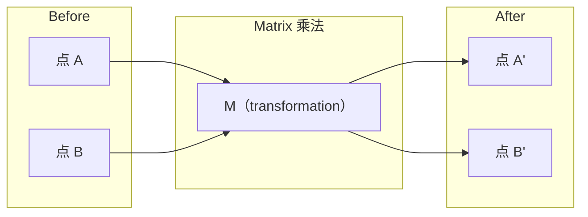
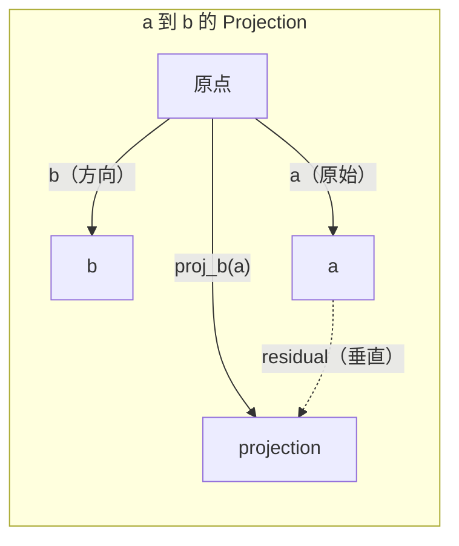

# 线性代数直觉

> 每个人工智能模型都只是戴着一顶美丽的矩阵数学的帽子.

**类型：**学习 课程
**语言：**皮森,朱莉亚
**先修要求：**阶段0
**时间：**时间60分钟

## 学习目标

- 在Python中从零实现向量和矩阵运算 (加法点,产品,矩阵乘法)
- 从几何角度解释点产品,投影和Gram-Schmidt过程在做什么
- 使用排列减小 判断一组向量的线性独立、排列 和基础
- 将线性代数概念连接到它们在AI中的应用:嵌入式,注意力分数和LoRA

## 问题

打开任意一篇 ML论文. 在第一页之内,你就会看到矢量、矩阵、点产品和变化.

你不需要成为数学家. 你需要看到这些运算在几何上意味着什么,然后亲自编写它们为代码.

## 概念

### 矢量是点(也是方向)

矢量只是一个数字列表.但这些数字有意义.

**2D Vector [3, 2]：**

| x | y | 点 |
|---|---|-------|
| 3 | 2 | 这个 Vector 从原点 (0,0) 指向平面上的 (3, 2) |

这个向量的大小为3^2 +2^2) =3^3),方向上而向右.

在AI中,向量表示一切:
- 一个词 → 一个包含768个数字的向量 (它在嵌入空间中的含义)
- 一张图像 → 一个由数百万个图像组成的向量
- 一个用户 → 一个表示偏好向量

### 矩阵是转变

矩阵将把一个向量转换为另一个向量. 它可以旋转缩缩拉伸或投影.



在AI中,矩阵就是模型:
- 神经网络重量 → 将输入转换为输出的矩阵
- 注意力分数 → 决定关注什么的矩阵
- 嵌入 → 将词映射到向量的矩阵

### 点产品 衡量相似性

两个向量的点数值将告诉你它们有多的相似之处.

```
a · b = a₁×b₁ + a₂×b₂ + ... + aₙ×bₙ

方向相同：      a · b > 0  （相似）
相互垂直：      a · b = 0  （无关）
方向相反：      a · b < 0  （不相似）
```

这正是搜索引擎,推系统和RAG的工作方式 - - 找到点产品的较高的向量.

### 线性独立性

如果集合中没有任何一个向量可以写成其他向量的组合,那么这些向量是线性独立的.如果v1、v2、v3独立,它们将跨越一个3D空间.如果其中一个是其他向量的组合,它们只跨越一个平面.

它对AI的重要性:你的特征矩阵应该有线性独立的列. 如果两个特征完全相连,模型就无法区分它们的各自影响.

**具体示例：**

```
v1 = [1, 0, 0]
v2 = [0, 1, 0]
v3 = [2, 1, 0]   # v3 = 2*v1 + v2
```

v1 和 v2 是独立的-- 二者都不是另一个标量倍数或组合.但是 v3 = 2*v1 + v2,所以 {v1, v2, v3} 是一个依赖集合.

在数据集中:如果 feature_3 = 2*feature_1 + feature_2,加入 feature_3 不会给模型带来任何新信息.更糟糕的是,它会让正常方程变成单重.

### 基础和等级

基础是最小的线性独立向量组,它们跨越整个空间.基础向量的数量是空间的维度.

3D空间的标准基础是 {[1,0,0], [0,1,0], [0,0,1]}──但在3D中任意三个独立向量都能构成有效的基础──选择基础就是在选择坐标系──

矩阵的排名 = 线性独立列的数量 = 线性独立列的数量──如果排名 < min(排行,列),这个矩阵就是排名不足──这意味着:
- 这个系统有无穷无尽的解答 (或没有解答)
- 转变中丢失信息
- 矩阵 不能被逆转

| 情况 | Rank | 对 ML 的含义 |
|-----------|------|---------------------|
| Full rank (rank = min(m, n)) | 最大可能值 | 存在唯一 least-squares solution。Model well-conditioned。 |
| Rank deficient (rank < min(m, n)) | 低于最大值 | Features 冗余。有无穷多个 weight solutions。需要 regularization。 |
| Rank 1 | 1 | 每一列都是某个 Vector 的缩放副本。所有数据都位于一条线上。 |
| Near rank-deficient（较小的 singular values） | 数值上较低 | Matrix ill-conditioned。极小的 input noise 会造成很大的 output changes。使用 SVD truncation 或 ridge regression。 |

### 投影

将向量**a**投影到矢量**b**上,会得到**a**在**b**方向上的分量:

```
proj_b(a) = (a dot b / b dot b) * b
```

随着 b 垂直――这种直角分解是最小方形的配合的基础――

投影 在 ML 中无处不在:
- 线性回归 最小化观测到列空间的距离 - 解本身就是一个投影
-  PCA将数据投影到最大变化方向
- 变压器中的注意会计算到键的预测



**示例：**其他类型的子

其他类型的产品:

这种投影已经丢掉了 y 分量. 这就是最简单的形式的维度减少.

### 格拉姆-施密德过程

将任意一组独立向量转换为正规基础──正规意味着每个向量长度为1,并且任意一对向量都互相垂直──

算法:
1. 取第一个向量,将其正常化
2. 取第二个向量,减去它在第一个向量上投影,再正常化
3. 取第三个向量,减去它在所有之前的向量上的投影,再正常化
4. 对剩余的向量 重复这个过程

```
Input:  v1, v2, v3, ...（linearly independent）

u1 = v1 / |v1|

w2 = v2 - (v2 dot u1) * u1
u2 = w2 / |w2|

w3 = v3 - (v3 dot u1) * u1 - (v3 dot u2) * u2
u3 = w3 / |w3|

Output: u1, u2, u3, ...（orthonormal basis）
```

这就是QR分解的内部工作方式.Q是正规的基础.R 捕获投影系数.
- 求解线性系统 ((比高斯的消除更稳定)
- 计算自值 (QR算法)
- 最小方体回归 (标准数值方法)


```figure
eigen-directions
```

## 构建它

### 步骤1:从零实现向量 (Python)

```python
class Vector:
    def __init__(self, components):
        self.components = list(components)
        self.dim = len(self.components)

    def __add__(self, other):
        return Vector([a + b for a, b in zip(self.components, other.components)])

    def __sub__(self, other):
        return Vector([a - b for a, b in zip(self.components, other.components)])

    def dot(self, other):
        return sum(a * b for a, b in zip(self.components, other.components))

    def magnitude(self):
        return sum(x**2 for x in self.components) ** 0.5

    def normalize(self):
        mag = self.magnitude()
        return Vector([x / mag for x in self.components])

    def cosine_similarity(self, other):
        return self.dot(other) / (self.magnitude() * other.magnitude())

    def __repr__(self):
        return f"Vector({self.components})"


a = Vector([1, 2, 3])
b = Vector([4, 5, 6])

print(f"a + b = {a + b}")
print(f"a · b = {a.dot(b)}")
print(f"|a| = {a.magnitude():.4f}")
print(f"cosine similarity = {a.cosine_similarity(b):.4f}")
```

### 步骤2: 从零实现矩阵 (Python)

```python
class Matrix:
    def __init__(self, rows):
        self.rows = [list(row) for row in rows]
        self.shape = (len(self.rows), len(self.rows[0]))

    def __matmul__(self, other):
        if isinstance(other, Vector):
            return Vector([
                sum(self.rows[i][j] * other.components[j] for j in range(self.shape[1]))
                for i in range(self.shape[0])
            ])
        rows = []
        for i in range(self.shape[0]):
            row = []
            for j in range(other.shape[1]):
                row.append(sum(
                    self.rows[i][k] * other.rows[k][j]
                    for k in range(self.shape[1])
                ))
            rows.append(row)
        return Matrix(rows)

    def transpose(self):
        return Matrix([
            [self.rows[j][i] for j in range(self.shape[0])]
            for i in range(self.shape[1])
        ])

    def __repr__(self):
        return f"Matrix({self.rows})"


rotation_90 = Matrix([[0, -1], [1, 0]])
point = Vector([3, 1])

rotated = rotation_90 @ point
print(f"Original: {point}")
print(f"Rotated 90°: {rotated}")
```

### 步骤3:为什么对AI很重要

```python
import random

random.seed(42)
weights = Matrix([[random.gauss(0, 0.1) for _ in range(3)] for _ in range(2)])
input_vector = Vector([1.0, 0.5, -0.3])

output = weights @ input_vector
print(f"Input (3D): {input_vector}")
print(f"Output (2D): {output}")
print("This is what a neural network layer does -- matrix multiplication.")
```

### 步骤 4: 朱莉亚 版本

```julia
a = [1.0, 2.0, 3.0]
b = [4.0, 5.0, 6.0]

println("a + b = ", a + b)
println("a · b = ", a ⋅ b)       # Julia supports unicode operators
println("|a| = ", √(a ⋅ a))
println("cosine = ", (a ⋅ b) / (√(a ⋅ a) * √(b ⋅ b)))

# Matrix-vector multiplication
W = [0.1 -0.2 0.3; 0.4 0.5 -0.1]
x = [1.0, 0.5, -0.3]
println("Wx = ", W * x)
println("This is a neural network layer.")
```

### 步骤5:从零实现线性独立和投影 (Python)

```python
def is_linearly_independent(vectors):
    n = len(vectors)
    dim = len(vectors[0].components)
    mat = Matrix([v.components[:] for v in vectors])
    rows = [row[:] for row in mat.rows]
    rank = 0
    for col in range(dim):
        pivot = None
        for row in range(rank, len(rows)):
            if abs(rows[row][col]) > 1e-10:
                pivot = row
                break
        if pivot is None:
            continue
        rows[rank], rows[pivot] = rows[pivot], rows[rank]
        scale = rows[rank][col]
        rows[rank] = [x / scale for x in rows[rank]]
        for row in range(len(rows)):
            if row != rank and abs(rows[row][col]) > 1e-10:
                factor = rows[row][col]
                rows[row] = [rows[row][j] - factor * rows[rank][j] for j in range(dim)]
        rank += 1
    return rank == n


def project(a, b):
    scalar = a.dot(b) / b.dot(b)
    return Vector([scalar * x for x in b.components])


def gram_schmidt(vectors):
    orthonormal = []
    for v in vectors:
        w = v
        for u in orthonormal:
            proj = project(w, u)
            w = w - proj
        if w.magnitude() < 1e-10:
            continue
        orthonormal.append(w.normalize())
    return orthonormal


v1 = Vector([1, 0, 0])
v2 = Vector([1, 1, 0])
v3 = Vector([1, 1, 1])
basis = gram_schmidt([v1, v2, v3])
for i, u in enumerate(basis):
    print(f"u{i+1} = {u}")
    print(f"  |u{i+1}| = {u.magnitude():.6f}")

print(f"u1 · u2 = {basis[0].dot(basis[1]):.6f}")
print(f"u1 · u3 = {basis[0].dot(basis[2]):.6f}")
print(f"u2 · u3 = {basis[1].dot(basis[2]):.6f}")
```

## 使用它

现在用NumPy做同样的事情 - - 这是你实践中真正使用的方式:

```python
import numpy as np

a = np.array([1, 2, 3], dtype=float)
b = np.array([4, 5, 6], dtype=float)

print(f"a + b = {a + b}")
print(f"a · b = {np.dot(a, b)}")
print(f"|a| = {np.linalg.norm(a):.4f}")
print(f"cosine = {np.dot(a, b) / (np.linalg.norm(a) * np.linalg.norm(b)):.4f}")

W = np.random.randn(2, 3) * 0.1
x = np.array([1.0, 0.5, -0.3])
print(f"Wx = {W @ x}")
```

### 使用NumPy 处理 排名、投影 和 QR

```python
import numpy as np

A = np.array([[1, 2], [2, 4]])
print(f"Rank: {np.linalg.matrix_rank(A)}")

a = np.array([3, 4])
b = np.array([1, 0])
proj = (np.dot(a, b) / np.dot(b, b)) * b
print(f"Projection of {a} onto {b}: {proj}")

Q, R = np.linalg.qr(np.random.randn(3, 3))
print(f"Q is orthogonal: {np.allclose(Q @ Q.T, np.eye(3))}")
print(f"R is upper triangular: {np.allclose(R, np.triu(R))}")
```

### 光 - 紧张器是带有自动变体的向量

```python
import torch

x = torch.randn(3, requires_grad=True)
y = torch.tensor([1.0, 0.0, 0.0])

similarity = torch.dot(x, y)
similarity.backward()

print(f"x = {x.data}")
print(f"y = {y.data}")
print(f"dot product = {similarity.item():.4f}")
print(f"d(dot)/dx = {x.grad}")
```

关于 x 的分数就是 y.PyTorch 自动计算了这一点. 神经网络中的每个操作都是由此类运算构成的.

你刚刚从零开始构建了NumPy 一行代码可以完成的事情.

## 交付它

本课会产出:
- `outputs/prompt-linear-algebra-tutor.md`-- 一个用于让人工智能助理通过几何直觉教授线性代数的提示

## 连接

本课程中的每一个内容都与现代人工智能的具体部分相关:

| 概念 | 出现位置 |
|---------|------------------|
| Dot product | Transformers 中的 Attention scores，RAG 中的 cosine similarity |
| Matrix multiply | 每个 Neural Network layer，每个 linear transformation |
| Linear independence | Feature selection，避免 multicollinearity |
| Rank | 判断一个系统是否可解，LoRA（low-rank adaptation） |
| Projection | Linear Regression（投影到 column space）、PCA |
| Gram-Schmidt / QR | Numerical solvers，eigenvalue computation |
| Orthonormal basis | 稳定的 numerical computation，whitening transforms |

洛拉值得特别说明. 它通过将重量更新分为低级矩阵来细调LLMs. 与其更新一个4096x4096的重量矩阵.

## 练习

1. 实现`Vector.angle_between(other)`返回两个向量之间的角度
2. 创建一个2D扩展矩阵,使x坐标翻倍,y坐标变为三倍,然后将其应用到向量 [1, 1]
3. 给定5个随机类词向量 (维度50),使用宇宙相似性 找出最相似的两个
4. 验证Gram-Schmidt输出确实是正规的:检查每对点产品都为 0,并且每个向量的大小都为 1
5. 创建一个为2的3x3矩阵.`rank()`然后解释这些列的几何对象是什么.
6. 将向量 [1,2,3] 投影到 [1,1,1] 上――结果在几何上表示什么?

## 关键术语

| 术语 | 人们常说 | 实际含义 |
|------|----------------|----------------------|
| Vector | “一个箭头” | 一个数字列表，表示 n-dimensional space 中的点或方向 |
| Matrix | “一个数字表” | 一种 transformation，将 Vectors 从一个空间映射到另一个空间 |
| Dot product | “相乘再求和” | 衡量两个 Vectors 对齐程度的指标 -- similarity search 的核心 |
| Embedding | “某种 AI 魔法” | 一个表示某物含义（词、图像、用户）的 Vector |
| Linear independence | “它们不重叠” | 集合中没有任何 Vector 可以写成其他 Vector 的组合 |
| Rank | “有多少维” | Matrix 中 linearly independent columns（或 rows）的数量 |
| Projection | “影子” | 一个 Vector 在另一个 Vector 方向上的分量 |
| Basis | “坐标轴” | 一组最小的 independent Vectors，它们 span 该空间 |
| Orthonormal | “垂直的单位 Vectors” | 彼此互相垂直且各自长度为 1 的 Vectors |
