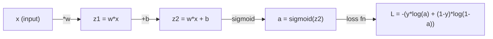
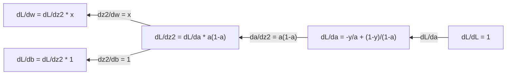
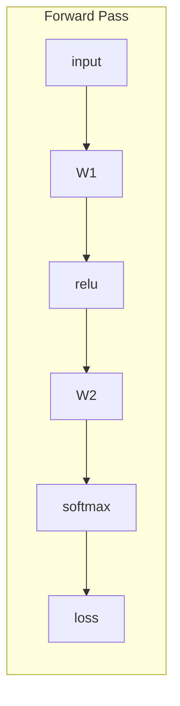
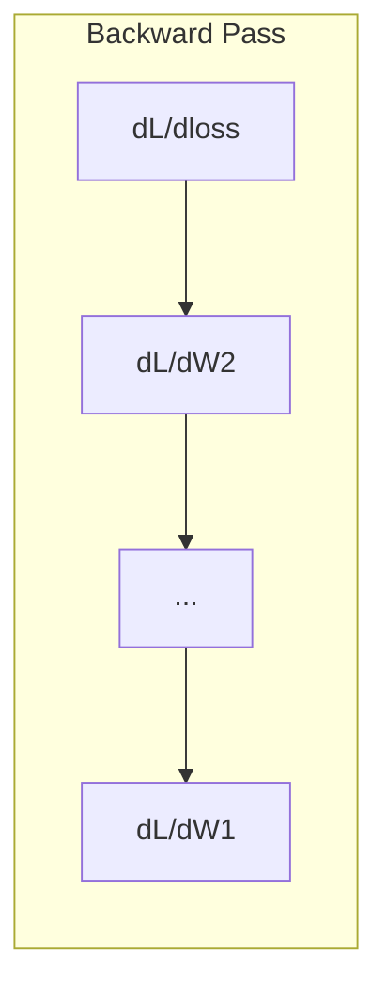

# 机器学习 微积分

> 导数会告诉你哪边是下坡――这是神经网络学习所需的一切――

**Type:** Learn
**Language:**字符串
**Prerequisites:** Phase 1, Lessons 01-03
**Time:** ~60 minutes

## 学习目标

- 计算常见 ML 函数(x^2、sigmoid、跨) 的数值导数与解析导数
- 从零实现渐进下降,在1D和2D中最小化损失函数
- 推导线性回归 模型的渐变,并通过手动更新权重来训练它
- 解释赫西亚矩阵,泰勒系列近似以及它们与优化方法的联系

## 问题

你有一个包含数百万个权重的神经网络. 每个权重都是一个旋转. 你需要弄清楚每个旋转应该转向哪个方向,才能让模型的错误稍微小一点.

没有微积分,训练神经网络就意味着随时尝试各种变化,然后希望运气. 有导数,你就能准确地知道每个权重如何影响错误.

## 概念

### 什么是导数?

导数量量量变率――对于函数 y = f(x),导数 f'(x) 会告诉你:如果你把 x 微小地推进一点,y 会变化多少?

从几何角度来看,导数是某个点的斜率.

**f(x) = x^2：**

| x | f(x) | f'(x)（斜率） |
|---|------|---------------|
| 0 | 0    | 0（平坦，在底部） |
| 1 | 1    | 2 |
| 2 | 4    | 4（该点处切线的斜率） |
| 3 | 9    | 6 |

在 x=2 时,斜率是4――如果你把 x 向右移动很小一点, y 大约会增加这个移动量4倍――在 x=0 时,斜率是0――你位于碗底――

形式化定义:

```
f'(x) = lim   f(x + h) - f(x)
        h->0  -----------------
                     h
```

在代码中,你会跳过极限,直接使用一个非常小的h.

### 偏导数:一次只看一个变量

真正函数有很多输入. 神经网络的损失取决于数百万重量.偏向数量将保持除一个变量之外的所有变量不变,然后对这个变量寻求导向.

```
f(x, y) = x^2 + 3xy + y^2

df/dx = 2x + 3y     (treat y as a constant)
df/dy = 3x + 2y     (treat x as a constant)
```

每个偏向数回答:如果我只调节这个权重,

### 梯度:所有偏导数构成的向量

渐进式将每个偏导数集合成一个向量.

```
grad f = [ df/dx, df/dy, df/dz ]
```

渐进指向最上升方向.要最小化一个函数,就朝相反方向走.

**f(x,y) = x^2 + y^2 的等高线图：**

这个函数形成一个碗形曲面,等高线是同心圆.最小值在 (0, 0) ⋅

| 点 | grad f | -grad f（下降方向） |
|-------|--------|----------------------------|
| (1, 1) | [2, 2]（指向上坡，远离最小值） | [-2, -2]（指向下坡，朝向最小值） |
| (0, 0) | [0, 0]（平坦，在最小值处） | [0, 0] |

这就是图中的渐进下降.

### 与优化联系

训练神经网络就是优化――你有一个损失函数 L(w1,w2, ..., wn),它衡量模型有多错误――你想最小化它――

```
Gradient descent update rule:

  w_new = w_old - learning_rate * dL/dw

For every weight:
  1. Compute the partial derivative of loss with respect to that weight
  2. Subtract a small multiple of it from the weight
  3. Repeat
```

太大就会越过目标.太小就会爬得很慢.

**Loss landscape（1D 切片）：**

损失函数 L(w) 随着权重的变化形成一个有峰有谷的曲线──

| 特征 | 描述 |
|---------|-------------|
| Global minimum | 整条曲线上的最低点，即最佳解 |
| Local minimum | 比邻近位置更低、但不是整体最低点的谷 |
| Slope | Gradient Descent 会从任意起点沿斜率向下走 |

渐进下降会沿着斜率下坡. 它可能陷入当地最小,但在高维空间中,这是很少实际的问题.

### 数值导数与解析导数

计算导数有两种方法.

解析方式:手动应用微积分规则──对于f(x) =x^2,导数是f'(x) =2x──精确,快速──

数值方式:使用定义进行近似──对一个很小的 h 计算 f  x+h 和 f  x-h),然后取差分──

```
Numerical (central difference):

f'(x) ~= f(x + h) - f(x - h)
          -----------------------
                  2h

h = 0.0001 works well in practice
```

数值导数较慢,但适用于任何函数.解析导数很快,但需要你推导公式. 神经网络框架使用第三种方法:自动分化,它会机械地计算精确导数.你会在3期看到它.

### 手动推导简单函数的导数

这些是你会在ML中反复看到的导数.

```
Function        Derivative       Used in
--------        ----------       -------
f(x) = x^2     f'(x) = 2x      Loss functions (MSE)
f(x) = wx + b  f'(w) = x        Linear layer (gradient w.r.t. weight)
                f'(b) = 1        Linear layer (gradient w.r.t. bias)
                f'(x) = w        Linear layer (gradient w.r.t. input)
f(x) = e^x     f'(x) = e^x     Softmax, attention
f(x) = ln(x)   f'(x) = 1/x     Cross-entropy loss
f(x) = 1/(1+e^-x)  f'(x) = f(x)(1-f(x))   Sigmoid activation
```

对于f ((x) = x^2:

```
f(x) = x^2    f'(x) = 2x

  x    f(x)   f'(x)   meaning
  -2    4      -4      slope tilts left (decreasing)
  -1    1      -2      slope tilts left (decreasing)
   0    0       0      flat (minimum!)
   1    1       2      slope tilts right (increasing)
   2    4       4      slope tilts right (increasing)
```

对于 f  = wx + b,且 x=3、b=1:

```
f(w) = 3w + 1    f'(w) = 3

The derivative with respect to w is just x.
If x is big, a small change in w causes a big change in output.
```

### 链式法则

当函数发生组合时,链式法则会告诉你如何求导.

```
If y = f(g(x)), then dy/dx = f'(g(x)) * g'(x)

Example: y = (3x + 1)^2
  outer: f(u) = u^2       f'(u) = 2u
  inner: g(x) = 3x + 1    g'(x) = 3
  dy/dx = 2(3x + 1) * 3 = 6(3x + 1)
```

神经网络是一串函数:输入 -> 直线 -> 激活 -> 直线 -> 激活 -> 损失──反传播就是从输出到输入反复应用链式法则──这就是整个算法──

### 赫西亚矩阵

渐进率告诉你斜率――Hessian 告诉你曲率――

对于函数 f ((x1, x2, ..., xn), 赫西安的 (i, j) 项是:

```
H[i][j] = d^2f / (dx_i * dx_j)
```

对于二变量函数 f ((x, y):

```
H = | d^2f/dx^2    d^2f/dxdy |
    | d^2f/dydx    d^2f/dy^2 |
```

**Hessian 在临界点（Gradient = 0 的地方）告诉你什么：**

| Hessian 性质 | 含义 | 示例曲面 |
|-----------------|---------|-----------------|
| 正定（所有 eigenvalues > 0） | Local minimum | 向上开口的碗 |
| 负定（所有 eigenvalues < 0） | Local maximum | 向下开口的碗 |
| 不定（eigenvalues 正负混合） | Saddle point | 马鞍形 |

**示例：**子 函数)

```
df/dx = 2x       df/dy = -2y
d^2f/dx^2 = 2    d^2f/dy^2 = -2    d^2f/dxdy = 0

H = | 2   0 |
    | 0  -2 |

Eigenvalues: 2 and -2 (one positive, one negative)
--> Saddle point at (0, 0)
```

与 f(x,y) = x^2 + y^2(一个碗形函数)比较:

```
H = | 2  0 |
    | 0  2 |

Eigenvalues: 2 and 2 (both positive)
--> Local minimum at (0, 0)
```

**为什么 Hessian 在 ML 中重要：**

牛顿的方法使用赫西式来比渐进下降更好优化步骤.

```
Newton's update:    w_new = w_old - H^(-1) * gradient
Gradient descent:   w_new = w_old - lr * gradient
```

牛顿的方法更快,因为赫西式会重新缩小了梯度:方向的步子更小,平坦方向的步子更大.

问题在于:对于一个具有N参数的神经网络,Hessian是N x N. 一个拥有100万参数的模型需要一个包含100亿元素的矩阵.

| 方法 | 使用什么 | 成本 | 收敛 |
|--------|-------------|------|-------------|
| Gradient Descent | 只使用一阶导数 | 每步 O(N) | 慢（线性） |
| Newton's method | 完整 Hessian | 每步 O(N^3) | 快（二次） |
| L-BFGS | 从 Gradient 历史近似 Hessian | 每步 O(N) | 中等（超线性） |
| Adam | 每参数自适应 rate（对角 Hessian 近似） | 每步 O(N) | 中等 |
| Natural gradient | Fisher information matrix（统计 Hessian） | 每步 O(N^2) | 快 |

在实践中,Adam是深度学习的默认优化器. 它通过跟踪每个参数的运行平均值和方差,以低成本近似二阶信息.

### 泰勒系列近似

任何平滑函数都可以局部使用多项式近似:

```
f(x + h) = f(x) + f'(x)*h + (1/2)*f''(x)*h^2 + (1/6)*f'''(x)*h^3 + ...
```

包含的项越多,近似越好,但只在点 x 附近成立.

**为什么 Taylor series 对 ML 重要：**

- **一阶 Taylor = Gradient Descent。**当你使用 f(x + h) ~ f(x) + f'(x) *h 时,你是在做线性近似──渐进下降 会最小化这个线性模型,从而选择 h = -lr * f'(x)。

- **二阶 Taylor = Newton's method。**使用 f(x + h) ~ f(x) + f'(x) *h + (1/2)*f'(x) *h^2 时,你得到一个二次模型――最小化它会得到 h = -f'(x) /f'(x),也就是牛顿的步骤――

- **Loss Function 设计。**它们的泰勒扩张表现良好.

```
Approximation order    What it captures    Optimization method
-------------------    -----------------   -------------------
0th order (constant)   Just the value      Random search
1st order (linear)     Slope               Gradient descent
2nd order (quadratic)  Curvature           Newton's method
Higher orders          Finer structure     Rarely used in ML
```

关键洞见是:所有基于渐进的优化,本质上都在局部近似损失函数,并向该近似函数的最小值迈步.

### 中的积分

导数告诉你变化率──积分计算积分,也就是曲线下面积──

在 ML 中,你很少手动计算积分,但这个概念无处不在:

**概率。**对于具有密度 p  x 的连续随机变量:
```
P(a < X < b) = integral from a to b of p(x) dx
```
概率密度曲线在 a 和 b 之间的面积,就是落在该区间内的概率.

**期望值。**根据概率加权的平均结果:
```
E[f(X)] = integral of f(x) * p(x) dx
```
数据分布的预期损失是积分――训练最小化是它的经验近似――

**KL divergence。**衡量两个分布有多种不同:
```
KL(p || q) = integral of p(x) * log(p(x) / q(x)) dx
```
根据VAE,知识蒸和贝叶斯推理.

**归一化常数。**在贝叶斯推理中:
```
p(w | data) = p(data | w) * p(w) / integral of p(data | w) * p(w) dw
```
分母是对所有可能参数值的积分. 它通常是不可处理的,这就是我们使用MCMC和变化推理等近似方法的原因.

| 积分概念 | 在 ML 中出现的位置 |
|-----------------|----------------------|
| 曲线下面积 | 由 density functions 得到概率 |
| 期望值 | Loss Functions、risk minimization |
| KL divergence | VAEs、policy optimization、distillation |
| 归一化 | Bayesian posteriors、softmax denominator |
| Marginal likelihood | Model comparison、evidence lower bound (ELBO) |

### 计算图 中的多变量链式法则

链式法则不仅适用于一条线上的标量函数――在神经网络中,变量会分叉并合并――下面展示导数如何流过一个简单的前进传递:



后行行 会从右到左计算 渐进:



每条箭头都乘以局部导数.任意参数的梯度,是从损失到参数路径上的所有局部导数的乘积.当路径分叉并合并时,你将把各条路径的贡献加起来.

背传播的全部内容是:从输出到输入,系统地在计算图中应用链式法则.

### 雅可比亚矩阵

当一个函数把向量映射到向量时 (例如神经网络层),它的导数是一个矩阵――Jacobian 包含每个输出对每个输入的所有偏导数――

对于f:R^n ->R^m,Jacobian J 是一个m x n矩阵:

| | x1 | x2 | ... | xn |
|---|---|---|---|---|
| f1 | df1/dx1 | df1/dx2 | ... | df1/dxn |
| f2 | df2/dx1 | df2/dx2 | ... | df2/dxn |
| ... | ... | ... | ... | ... |
| fm | dfm/dx1 | dfm/dx2 | ... | dfm/dxn |

你不会为神经网络手动计算Jacobian──PyTorch 会处理它──但知道它存在,有助于你理解后传的形状:如果一个层把R^n映射到R^m,它的Jacobian就是m x n──Gradient 会通过这个矩阵的转移向后流动──

### 为什么这对神经网络很重要

网络中每个权重都会得到一个级别.





每次重更新:
- `W1 = W1 - lr * dL/dW1`
- `W2 = W2 - lr * dL/dW2`

计算预测和损失 计算损失 相对于每个权重的梯度.


```figure
derivative-tangent
```

## 构建它

### 步骤1:从零实现数值导数

```python
def numerical_derivative(f, x, h=1e-7):
    return (f(x + h) - f(x - h)) / (2 * h)

def f(x):
    return x ** 2

for x in [-2, -1, 0, 1, 2]:
    numerical = numerical_derivative(f, x)
    analytical = 2 * x
    print(f"x={x:2d}  f'(x) numerical={numerical:.6f}  analytical={analytical:.1f}")
```

数值导数和解析导数在许多小数上都匹配.

### 步骤2:偏向数与渐进数

```python
def numerical_gradient(f, point, h=1e-7):
    gradient = []
    for i in range(len(point)):
        point_plus = list(point)
        point_minus = list(point)
        point_plus[i] += h
        point_minus[i] -= h
        partial = (f(point_plus) - f(point_minus)) / (2 * h)
        gradient.append(partial)
    return gradient

def f_multi(point):
    x, y = point
    return x**2 + 3*x*y + y**2

grad = numerical_gradient(f_multi, [1.0, 2.0])
print(f"Numerical gradient at (1,2): {[f'{g:.4f}' for g in grad]}")
print(f"Analytical gradient at (1,2): [2*1+3*2, 3*1+2*2] = [{2*1+3*2}, {3*1+2*2}]")
```

### 步骤3:用渐进下降 找到 f(x) = x^2 的最小值

```python
x = 5.0
lr = 0.1
for step in range(20):
    grad = 2 * x
    x = x - lr * grad
    print(f"step {step:2d}  x={x:8.4f}  f(x)={x**2:10.6f}")
```

从 x=5 开始,每一步都会更接近 x=0 ((最小值) 

### 步骤 4: 在 2D 函数上执行渐进下降

```python
def f_2d(point):
    x, y = point
    return x**2 + y**2

point = [4.0, 3.0]
lr = 0.1
for step in range(30):
    grad = numerical_gradient(f_2d, point)
    point = [p - lr * g for p, g in zip(point, grad)]
    loss = f_2d(point)
    if step % 5 == 0 or step == 29:
        print(f"step {step:2d}  point=({point[0]:7.4f}, {point[1]:7.4f})  f={loss:.6f}")
```

### 步骤5:比较数值导数和分析导数

```python
import math

test_functions = [
    ("x^2",      lambda x: x**2,          lambda x: 2*x),
    ("x^3",      lambda x: x**3,          lambda x: 3*x**2),
    ("sin(x)",   lambda x: math.sin(x),   lambda x: math.cos(x)),
    ("e^x",      lambda x: math.exp(x),   lambda x: math.exp(x)),
    ("1/x",      lambda x: 1/x,           lambda x: -1/x**2),
]

x = 2.0
print(f"{'Function':<12} {'Numerical':>12} {'Analytical':>12} {'Error':>12}")
print("-" * 50)
for name, f, df in test_functions:
    num = numerical_derivative(f, x)
    ana = df(x)
    err = abs(num - ana)
    print(f"{name:<12} {num:12.6f} {ana:12.6f} {err:12.2e}")
```

### 步骤 6:数值计算 赫西语

```python
def hessian_2d(f, x, y, h=1e-5):
    fxx = (f(x + h, y) - 2 * f(x, y) + f(x - h, y)) / (h ** 2)
    fyy = (f(x, y + h) - 2 * f(x, y) + f(x, y - h)) / (h ** 2)
    fxy = (f(x + h, y + h) - f(x + h, y - h) - f(x - h, y + h) + f(x - h, y - h)) / (4 * h ** 2)
    return [[fxx, fxy], [fxy, fyy]]

def saddle(x, y):
    return x ** 2 - y ** 2

def bowl(x, y):
    return x ** 2 + y ** 2

H_saddle = hessian_2d(saddle, 0.0, 0.0)
H_bowl = hessian_2d(bowl, 0.0, 0.0)
print(f"Saddle Hessian: {H_saddle}")  # [[2, 0], [0, -2]] -- mixed signs
print(f"Bowl Hessian:   {H_bowl}")    # [[2, 0], [0, 2]]  -- both positive
```

子函数的Hessian 有自值2 和 -2(符号混合,确认是子点) ・碗 函数有自值2 和 2 ((均为正,确认是最小) ・

### 步骤7:泰勒近似的实际效果

```python
import math

def taylor_approx(f, f_prime, f_double_prime, x0, h, order=2):
    result = f(x0)
    if order >= 1:
        result += f_prime(x0) * h
    if order >= 2:
        result += 0.5 * f_double_prime(x0) * h ** 2
    return result

x0 = 0.0
for h in [0.1, 0.5, 1.0, 2.0]:
    true_val = math.sin(h)
    t1 = taylor_approx(math.sin, math.cos, lambda x: -math.sin(x), x0, h, order=1)
    t2 = taylor_approx(math.sin, math.cos, lambda x: -math.sin(x), x0, h, order=2)
    print(f"h={h:.1f}  sin(h)={true_val:.4f}  order1={t1:.4f}  order2={t2:.4f}")
```

在 x0=0 附近,sin(x) ~ x(一阶段泰勒) ――对于很小的h,这个近似非常好;但对于较大的h,它会失效――这就是为什么在较小的学习率下降的最佳效果:每一步都假设线性近似是准确的――

### 步骤8:为什么对神经网络来说这很重要

```python
import random

random.seed(42)

w = random.gauss(0, 1)
b = random.gauss(0, 1)
lr = 0.01

xs = [1.0, 2.0, 3.0, 4.0, 5.0]
ys = [3.0, 5.0, 7.0, 9.0, 11.0]

for epoch in range(200):
    total_loss = 0
    dw = 0
    db = 0
    for x, y in zip(xs, ys):
        pred = w * x + b
        error = pred - y
        total_loss += error ** 2
        dw += 2 * error * x
        db += 2 * error
    dw /= len(xs)
    db /= len(xs)
    total_loss /= len(xs)
    w -= lr * dw
    b -= lr * db
    if epoch % 40 == 0 or epoch == 199:
        print(f"epoch {epoch:3d}  w={w:.4f}  b={b:.4f}  loss={total_loss:.6f}")

print(f"\nLearned: y = {w:.2f}x + {b:.2f}")
print(f"Actual:  y = 2x + 1")
```

每个基于梯度的训练循环都遵循这个模式:预测、计算损失、计算梯度、更新权重──

## 使用它

运用 NumPy 时,同样的操作会更快,更简洁:

```python
import numpy as np

x = np.array([1, 2, 3, 4, 5], dtype=float)
y = np.array([3, 5, 7, 9, 11], dtype=float)

w, b = np.random.randn(), np.random.randn()
lr = 0.01

for epoch in range(200):
    pred = w * x + b
    error = pred - y
    loss = np.mean(error ** 2)
    dw = np.mean(2 * error * x)
    db = np.mean(2 * error)
    w -= lr * dw
    b -= lr * db

print(f"Learned: y = {w:.2f}x + {b:.2f}")
```

你刚刚从零构建了渐进式下降. PyTorch 会自动完成渐进式计算,但更新循环是完全一样的.

## 练习

1. 使用调用两次`numerical_derivative`实现的方法`numerical_second_derivative(f, x)`△验证 x^3 在 x=2 处的二阶导数是12──
2. 使用 渐进式下降 找到 f(x, y) = (x - 3) ^2 + (y + 1) ^2 的最小值──从 (0, 0) 开始──答案应收到 (3, -1)──
3. 在渐进下降循环中加入动力:维护一个会累积过去的渐进的速度矢量──在 f(x) = x^4 - 3x^2 上比较有没有动力的收速度──

## 关键术语

| 术语 | 人们常说 | 实际含义 |
|------|----------------|----------------------|
| Derivative | “斜率” | 函数在某一点的变化率。告诉你输入每变化一个单位，输出会变化多少。 |
| Partial derivative | “一个变量的导数” | 在保持其他所有变量不变时，对某一个变量求导。 |
| Gradient | “最陡上升方向” | 由所有偏导数组成的 Vector。指向让函数增长最快的方向。 |
| Gradient Descent | “往下坡走” | 从参数中减去 Gradient（乘以 learning rate），从而降低 Loss。Neural Network 训练的核心。 |
| Learning rate | “步长” | 控制每一步 Gradient Descent 有多大的标量。太大：发散。太小：收敛缓慢。 |
| Chain rule | “把导数相乘” | 对复合函数求导的规则：df/dx = df/dg * dg/dx。Backpropagation 的数学基础。 |
| Jacobian | “导数 Matrix” | 当一个函数把 Vector 映射到 Vector 时，Jacobian 是所有输出相对于输入的偏导数组成的 Matrix。 |
| Numerical derivative | “有限差分” | 通过在两个相邻点上评估函数并计算它们之间的斜率来近似导数。 |
| Backpropagation | “Reverse-mode autodiff” | 使用链式法则，从输出到输入逐层计算 Gradient。Neural Network 就是这样学习的。 |
| Hessian | “二阶导数 Matrix” | 所有二阶偏导数组成的 Matrix。描述函数的曲率。在临界点处 Hessian 正定意味着 local minimum。 |
| Taylor series | “多项式近似” | 使用函数的导数在某一点附近近似函数：f(x+h) ~ f(x) + f'(x)h + (1/2)f''(x)h^2 + ... 它是理解 Gradient Descent 和 Newton's method 为什么有效的基础。 |
| Integral | “曲线下面积” | 某个量在一个范围内的累积。在 ML 中，积分定义概率、期望值和 KL divergence。 |

## 延伸阅读

- [3Blue1Brown: Essence of Calculus](https://www.3blue1brown.com/topics/calculus)- 关于导数,积分和链式规则的视觉直觉
- [Stanford CS231n: Backpropagation](https://cs231n.github.io/optimization-2/)- 如何流过神经网络层
