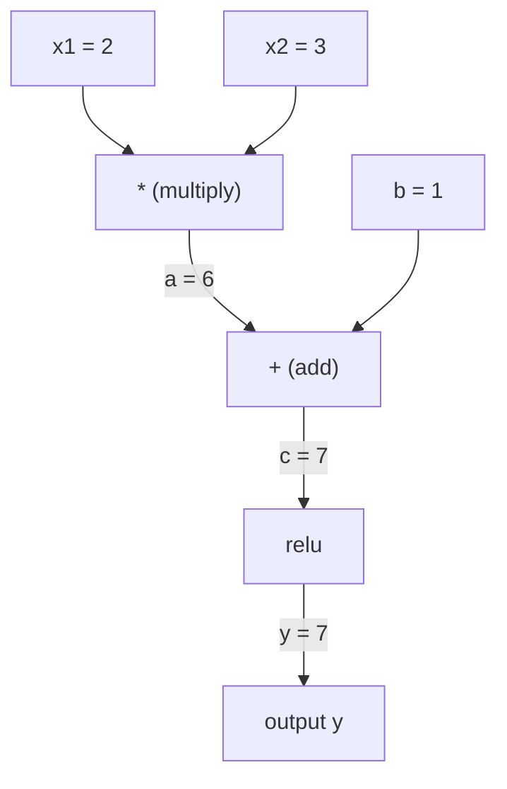
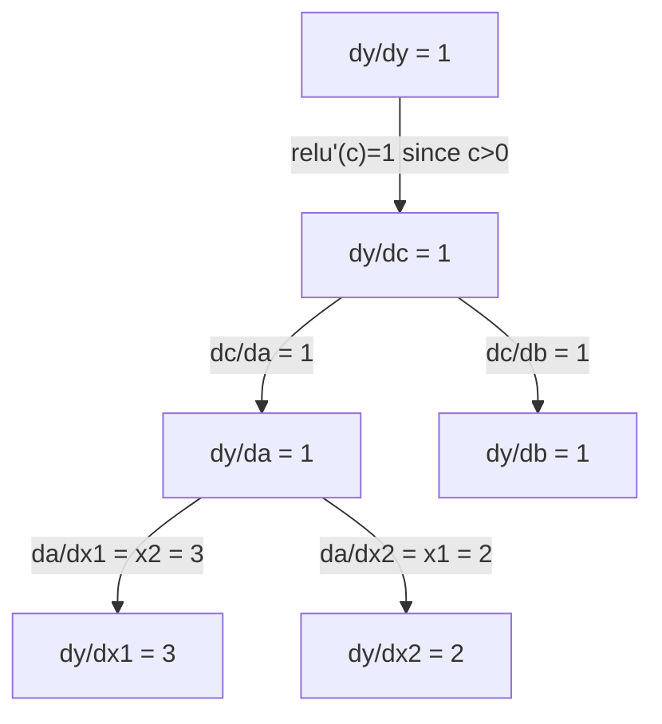

# 链条规则与自动区分

> 链条规则是每个人都能学习的神经网络的背后引擎.

**类型：**建立
**语言：**字符串
**前置要求：**第1阶段,第04课 (衍生品和梯度)
**时间：**约90分钟

## 学习目标

- 构建一个极简自动化引擎 (极简自动化引擎) 记录操作并通过反向模式自动化计算 计算渐进
- 使用拓类型在计算图中实现前进和后退传递
- 仅使用从零实现的自动化引擎,在XOR上构建并训练一个多层的感知器
- 使用梯度检查,将自动变化与数值有限差异对比,验证正确性

## 问题

你可以计算简单函数的导数――但神经网络不是简单函数――它由数百个函数组合组成:矩阵乘以,增加偏差,应用激活,再次矩阵乘以,软高,跨进化损失――输出一个函数的函数的函数――

对于数百万参数手工完成这一点是不可能的.

链条规则 给出数学基础――自动分化 给出算法――二者结合,让你能够在一个正比的时间内,通过任意函数组合计算精确的梯度――

这就是PyTorch、TensorFlow和JAX的工作方式.

## 核心概念

### 链条规则

如果`y = f(g(x))`现在,`y`对于`x`的导数是:

```
dy/dx = dy/dg * dg/dx = f'(g(x)) * g'(x)
```

沿着链条将导数相乘――每个环节贡献自己的局部导数――

示例:`y = sin(x^2)`

```
g(x) = x^2       g'(x) = 2x
f(g) = sin(g)     f'(g) = cos(g)

dy/dx = cos(x^2) * 2x
```

对于更深的组合,链条会继续延伸:

```
y = f(g(h(x)))

dy/dx = f'(g(h(x))) * g'(h(x)) * h'(x)
```

网络中每一个层,都是链上一个环节.

### 计算图表

计算图 让链条可视化――每个操作都将成为一个节点――数据沿图向前流――渐进向后流――

**Forward pass（计算值）：**



**Backward pass（计算 Gradient）：**



后行通过 会在每个节点应用链条,将从输出传播到输入的渐进.

### 前向模式与反向模式

链条规则可以在图中应用两种方式.

**Forward mode**从输入开始,将导数向前推――它计算`dx/dx = 1`通过每个操作传播. 适合输入少,输出多场景.

```
Forward mode: seed dx/dx = 1, propagate forward

  x = 2       (dx/dx = 1)
  a = x^2     (da/dx = 2x = 4)
  y = sin(a)  (dy/dx = cos(a) * da/dx = cos(4) * 4 = -2.615)
```

**Reverse mode**从输出开始,将渐进向后拉回.`dy/dy = 1`通过每个操作进行反向顺序传播.

```
Reverse mode: seed dy/dy = 1, propagate backward

  y = sin(a)  (dy/dy = 1)
  a = x^2     (dy/da = cos(a) = cos(4) = -0.654)
  x = 2       (dy/dx = dy/da * da/dx = -0.654 * 4 = -2.615)
```

网络有数百万个输入 (输入) 和输出 (输出) 输出 (输出) 输出 (输出) 输出 (输出) 输出 (输出) 输出 (输出) 输出 (输出) 输出 (输出) 输出 (输出) 输出 (输出) 输出 (输出) 输出 (输出) 输出 (输出) 输出) 输出 (输出) 输出) 输出 (输出) 输出 (输出) 输出) 输出 (输出) 输出) 输出 (输出) 输出) 输出 (输出) 输出) 输出 (输出) 输出 (输出) 输出) 输出 (输出) 输出) 输出 (输出) 输出) 输出 (输出) 输出) 输出 (输出) 输出) 输出 (输出) 输出) 输出) 输出 (输出) 输出) 输出 (输出) 输出) 输出 (输出) 输出) 输出) 输出 (输出) 输出) 输出 (输出) 输出) 输出) 输出 (输出) 输出) 输出 (输出) 输出) 输出 (输出) 输出) 输出) 输出 (输出) 输出) 输出) 输出 (输出) 输出) 输出方式是逆方式的原因是逆方式的原因是逆方式.

| Mode | Seed | Direction | Best when |
|------|------|-----------|-----------|
| Forward | `dx_i/dx_i = 1` | 输入到输出 | 输入少、输出多 |
| Reverse | `dy/dy = 1` | 输出到输入 | 输入多、输出少（neural nets） |

### 用前进模式的双数字

进步模式可以使用双数 优雅地实现――双数的形式是`a + b*epsilon`在其中`epsilon^2 = 0`,我知道.

```
Dual number: (value, derivative)

(2, 1) means: value is 2, derivative w.r.t. x is 1

Arithmetic rules:
  (a, a') + (b, b') = (a+b, a'+b')
  (a, a') * (b, b') = (a*b, a'*b + a*b')
  sin(a, a')         = (sin(a), cos(a)*a')
```

将输入变量的导数设为1――导数会自动通过每个操作传播――

### 构建自动化引擎

一个自动化引擎需要三个事情:

1. **Value wrapping。**将每个数字包裹在一个对象中,用于存储它的值和梯度.
2. **Graph recording。**每个操作都记录了其输入和局部的渐进函数.
3. **Backward pass。**在每节点应用链条.

这正是Pytorch的.`autograd`为了做的事.`torch.Tensor`包裹值,在`requires_grad=True`时记录操作,并在你调用 `.backward()`时计算 渐进式――

### 皮托尔奇自动化 底层如何工作

当你编写 PyTorch代码时:

```python
x = torch.tensor(2.0, requires_grad=True)
y = x ** 2 + 3 * x + 1
y.backward()
print(x.grad)  # 7.0 = 2*x + 3 = 2*2 + 3
```

火在内部会:

1. 为`x`创建一个`Tensor`节点,并设置`requires_grad=True`
2. 每个操作`**`,我知道.`*`,我知道.`+`) 都会创建一个新节点,并记录后面的函数
3. `y.backward()`触发对已记录的图表的反向模式自动调节
4. 每个节点`grad_fn`计算局部 渐进式,并将它们传递给父节点
5. 通过加法 (不是替换) 累积到`.grad`属性中

这张图是动态的 (如果/否则,循环) 原因.


```figure
chain-rule
```

## 构建它

### 步骤1:值类

```python
class Value:
    def __init__(self, data, children=(), op=''):
        self.data = data
        self.grad = 0.0
        self._backward = lambda: None
        self._prev = set(children)
        self._op = op

    def __repr__(self):
        return f"Value(data={self.data:.4f}, grad={self.grad:.4f})"
```

每个`Value`都存储自己的数值数据、Gradient(初始为零) 、一个倒退的函数,以及指向生成它的子节点的指针──

### 步骤 2:带渐进跟踪的算术操作

```python
    def __add__(self, other):
        other = other if isinstance(other, Value) else Value(other)
        out = Value(self.data + other.data, (self, other), '+')
        def _backward():
            self.grad += out.grad
            other.grad += out.grad
        out._backward = _backward
        return out

    def __mul__(self, other):
        other = other if isinstance(other, Value) else Value(other)
        out = Value(self.data * other.data, (self, other), '*')
        def _backward():
            self.grad += other.data * out.grad
            other.grad += self.data * out.grad
        out._backward = _backward
        return out

    def relu(self):
        out = Value(max(0, self.data), (self,), 'relu')
        def _backward():
            self.grad += (1.0 if out.data > 0 else 0.0) * out.grad
        out._backward = _backward
        return out
```

每个操作都会创建一个关闭,它知道如何计算局部的梯度,并乘以上游梯度(`out.grad``+=`处理是某个值被多个操作使用的情况.

### 步骤3: 倒退通行

```python
    def backward(self):
        topo = []
        visited = set()
        def build_topo(v):
            if v not in visited:
                visited.add(v)
                for child in v._prev:
                    build_topo(child)
                topo.append(v)
        build_topo(self)

        self.grad = 1.0
        for v in reversed(topo):
            v._backward()
```

确保每个节点的梯度在传播到其子节点之前已经完整计算.

### 步骤 4:完整的引擎需要更多操作

基础值类 支持加法、乘法和 relú──真正的自动化引擎需要更多能力──下面是构建神经网络所需的操作:

```python
    def __neg__(self):
        return self * -1

    def __sub__(self, other):
        return self + (-other)

    def __radd__(self, other):
        return self + other

    def __rmul__(self, other):
        return self * other

    def __rsub__(self, other):
        return other + (-self)

    def __pow__(self, n):
        out = Value(self.data ** n, (self,), f'**{n}')
        def _backward():
            self.grad += n * (self.data ** (n - 1)) * out.grad
        out._backward = _backward
        return out

    def __truediv__(self, other):
        return self * (other ** -1) if isinstance(other, Value) else self * (Value(other) ** -1)

    def exp(self):
        import math
        e = math.exp(self.data)
        out = Value(e, (self,), 'exp')
        def _backward():
            self.grad += e * out.grad
        out._backward = _backward
        return out

    def log(self):
        import math
        out = Value(math.log(self.data), (self,), 'log')
        def _backward():
            self.grad += (1.0 / self.data) * out.grad
        out._backward = _backward
        return out

    def tanh(self):
        import math
        t = math.tanh(self.data)
        out = Value(t, (self,), 'tanh')
        def _backward():
            self.grad += (1 - t ** 2) * out.grad
        out._backward = _backward
        return out
```

**每个操作为什么重要：**

| Operation | Backward rule | Used in |
|-----------|--------------|---------|
| `__sub__` | 复用 add + neg | Loss 计算（pred - target） |
| `__pow__` | n * x^(n-1) | Polynomial activations、MSE（error^2） |
| `__truediv__` | 复用 mul + pow(-1) | Normalization、learning rate scaling |
| `exp` | exp(x) * upstream | Softmax、log-likelihood |
| `log` | (1/x) * upstream | Cross-entropy loss、log probabilities |
| `tanh` | (1 - tanh^2) * upstream | 经典 activation function |

巧妙之处在于:`__sub__`和 `__truediv__`它们会自动得到正确的格式,因为链条规则会通过底层的加/mul/pow 操作组合起来.

### 步骤5:从零实现迷你MLP

只有价值和链条规则.

```python
import random

class Neuron:
    def __init__(self, n_inputs):
        self.w = [Value(random.uniform(-1, 1)) for _ in range(n_inputs)]
        self.b = Value(0.0)

    def __call__(self, x):
        act = sum((wi * xi for wi, xi in zip(self.w, x)), self.b)
        return act.tanh()

    def parameters(self):
        return self.w + [self.b]

class Layer:
    def __init__(self, n_inputs, n_outputs):
        self.neurons = [Neuron(n_inputs) for _ in range(n_outputs)]

    def __call__(self, x):
        return [n(x) for n in self.neurons]

    def parameters(self):
        return [p for n in self.neurons for p in n.parameters()]

class MLP:
    def __init__(self, sizes):
        self.layers = [Layer(sizes[i], sizes[i+1]) for i in range(len(sizes)-1)]

    def __call__(self, x):
        for layer in self.layers:
            x = layer(x)
        return x[0] if len(x) == 1 else x

    def parameters(self):
        return [p for layer in self.layers for p in layer.parameters()]
```

一个`Neuron`计算`tanh(w1*x1 + w2*x2 + ... + b)`一个`Layer`是神经元列表.`MLP`堆积多层. 每层都重量.`Value`现在,我们要做什么?`loss.backward()`将分数传播到每个参数.

**在 XOR 上训练：**

```python
random.seed(42)
model = MLP([2, 4, 1])  # 2 inputs, 4 hidden neurons, 1 output

xs = [[0, 0], [0, 1], [1, 0], [1, 1]]
ys = [-1, 1, 1, -1]  # XOR pattern (using -1/1 for tanh)

for step in range(100):
    preds = [model(x) for x in xs]
    loss = sum((p - y) ** 2 for p, y in zip(preds, ys))

    for p in model.parameters():
        p.grad = 0.0
    loss.backward()

    lr = 0.05
    for p in model.parameters():
        p.data -= lr * p.grad

    if step % 20 == 0:
        print(f"step {step:3d}  loss = {loss.data:.4f}")

print("\nPredictions after training:")
for x, y in zip(xs, ys):
    print(f"  input={x}  target={y:2d}  pred={model(x).data:6.3f}")
```

这就是微分级. 完全使用Python和自动区分实现的完整神经网络训练循环.

### 步骤 6: 渐进检查

你怎么知道自己的自动化是正确的?

```python
def gradient_check(build_expr, x_val, h=1e-7):
    x = Value(x_val)
    y = build_expr(x)
    y.backward()
    autodiff_grad = x.grad

    y_plus = build_expr(Value(x_val + h)).data
    y_minus = build_expr(Value(x_val - h)).data
    numerical_grad = (y_plus - y_minus) / (2 * h)

    diff = abs(autodiff_grad - numerical_grad)
    return autodiff_grad, numerical_grad, diff
```

在一个复杂的表达中测试它:

```python
def expr(x):
    return (x ** 3 + x * 2 + 1).tanh()

ad, num, diff = gradient_check(expr, 0.5)
print(f"Autodiff:  {ad:.8f}")
print(f"Numerical: {num:.8f}")
print(f"Difference: {diff:.2e}")
# Difference should be < 1e-5
```

实现新操作时,梯度检查 至关重要. 如果你的倒退通行有错误,数值检查会发现它.

**什么时候使用 gradient checking：**

| Situation | Do gradient check? |
|-----------|-------------------|
| 向 autograd 添加新操作 | 是，始终要做 |
| 调试无法收敛的训练循环 | 是，先检查 Gradient |
| 生产训练 | 否，太慢（每个参数需要 2 次 forward pass） |
| autograd 代码的 unit tests | 是，将它自动化 |

### 步骤 7:与手数结果验证

```python
x1 = Value(2.0)
x2 = Value(3.0)
a = x1 * x2          # a = 6.0
b = a + Value(1.0)    # b = 7.0
y = b.relu()          # y = 7.0

y.backward()

print(f"y = {y.data}")          # 7.0
print(f"dy/dx1 = {x1.grad}")   # 3.0 (= x2)
print(f"dy/dx2 = {x2.grad}")   # 2.0 (= x1)
```

手动检查:`y = relu(x1*x2 + 1)`由于`x1*x2 + 1 = 7 > 0`没有什么,所以你是个性.
`dy/dx1 = x2 = 3`,我知道.`dy/dx2 = x1 = 2`△引擎的结果一致――

## 使用它

### 与Pytorch 验证

```python
import torch

x1 = torch.tensor(2.0, requires_grad=True)
x2 = torch.tensor(3.0, requires_grad=True)
a = x1 * x2
b = a + 1.0
y = torch.relu(b)
y.backward()

print(f"PyTorch dy/dx1 = {x1.grad.item()}")  # 3.0
print(f"PyTorch dy/dx2 = {x2.grad.item()}")  # 2.0
```

通过链条规则实现反向模式自动调节.

### 更加复杂的表达

```python
a = Value(2.0)
b = Value(-3.0)
c = Value(10.0)
f = (a * b + c).relu()  # relu(2*(-3) + 10) = relu(4) = 4

f.backward()
print(f"df/da = {a.grad}")  # -3.0 (= b)
print(f"df/db = {b.grad}")  #  2.0 (= a)
print(f"df/dc = {c.grad}")  #  1.0
```

## 交付内容

本课会产出:
- `outputs/skill-autodiff.md`-- 一个用于构建和调试自行升级系统的技能
- `code/autodiff.py`-- 一个可以继续扩展的极简自动化引擎

在这个构建的值类是 Neural Network 训练循环的基础.

## 练习

1. 向值类 添加 `__pow__`现在你就可以计算.`x ** n`△验证在`x=2`时,`d/dx(x^3)`等于`12.0`,我知道.

2. 添加`tanh`作为激活函数──验证`tanh'(0) = 1`且`tanh'(2) = 0.0707`没有什么可做.

3. 为单个神经元构建计算图:`y = relu(w1*x1 + w2*x2 + b)`△计算全部五个分数,并与 PyTorch 验证.

4. 使用双数实现前进模式的自动化.`Dual`导数与反模式引擎相同.

## 关键术语

| Term | What people say | What it actually means |
|------|----------------|----------------------|
| Chain rule | “把导数相乘” | 组合函数的导数等于每个函数在正确位置处的局部导数之积 |
| Computational graph | “网络图” | 一个有向无环图，其中节点是操作，边承载值（forward）或 Gradient（backward） |
| Forward mode | “向前推导数” | 将导数从输入传播到输出的 autodiff。每个输入变量需要一次 pass。 |
| Reverse mode | “Backpropagation” | 将 Gradient 从输出传播到输入的 autodiff。每个输出变量需要一次 pass。 |
| Autograd | “自动 Gradient” | 一个系统：记录对值执行的操作、构建 graph，并通过 Chain Rule 计算精确 Gradient |
| Dual numbers | “值加导数” | 形式为 a + b*epsilon（epsilon^2 = 0）的数字，可以在算术运算中携带导数信息 |
| Topological sort | “依赖顺序” | 对 graph 节点排序，使每个节点都位于其所有依赖之后。正确传播 Gradient 所必需。 |
| Gradient accumulation | “相加，不要替换” | 当一个值流入多个操作时，它的 Gradient 是所有传入 Gradient 贡献的总和 |
| Dynamic graph | “Define by run” | 每次 forward pass 都重新构建的 computation graph，允许模型内部使用 Python 控制流（PyTorch 风格） |
| Gradient checking | “数值验证” | 将 autodiff Gradient 与数值 finite-difference Gradient 对比，以验证正确性。调试时必不可少。 |
| MLP | “Multi-layer perceptron” | 一个包含一层或多层隐藏 neuron 的 Neural Network。每个 neuron 计算加权和加 bias，然后应用 activation function。 |
| Neuron | “加权和 + activation” | 基本单元：output = activation(w1*x1 + w2*x2 + ... + b)。weights 和 bias 是可学习参数。 |

## 延伸阅读

- [3Blue1Brown: Backpropagation calculus](https://www.youtube.com/watch?v=tIeHLnjs5U8)-- 对神经网络中链条规则的可视化讲解
- [PyTorch Autograd mechanics](https://pytorch.org/docs/stable/notes/autograd.html)-- 真实系统工作方式
- [Baydin et al., Automatic Differentiation in Machine Learning: a Survey](https://arxiv.org/abs/1502.05767)-- 综合参考
