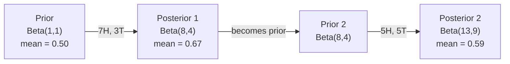

# 贝叶斯定理

> 概率关注的是你预期会发生什么.

**类型：**建立
**语言：**字符串
**前置要求：**第1阶段,第06课)
**时间：**七十五分钟

## 学习目标

- 应用贝叶斯定理,根据先前的概率和证据计算后来的概率
- 从零构建一个带有拉普莱斯平滑和日记空间计算的天真的贝斯 文本分类器
- 较 MLE 和 MAP估计,并解释MAP 如何应对L2规范化
- 使用Beta-Binomial 连接前列为A/B测试实现连续贝叶斯更新

## 问题

一项医学检查的准确率为99%. 你的检查结果是阳性. 你真正患病的概率是多少?

大多数人会说99%──真正的答案取决于这种疾病的罕见性──如果每1万人中只有1人患病,那么一次阳性结果只意味着你患病的概率约为1%──其他99%的阳性结果都是健康人产生的错误报道──

这不是脑筋急转──这是贝叶斯定理──每一个垃圾邮件过器,每一个医疗诊断,每一个量化不确定性的 ML 模型都使用完全相同的推理──你先有一个信念──你看到了证据──然后更新它──

如果你不了解这一点,构建ML系统,就会误解模型输出,设置糟糕的门,并发布过度自信的预测.

## 概念

### 从联合概率到贝斯

你已经在第六课中知道条件概率是:

```
P(A|B) = P(A and B) / P(B)
```

对称地:

```
P(B|A) = P(A and B) / P(A)
```

两个表达式共享同一个分子:P(A和B) ――令它们相等并重新整理:

```
P(A and B) = P(A|B) * P(B) = P(B|A) * P(A)

Therefore:

P(A|B) = P(B|A) * P(A) / P(B)
```

这就是贝叶斯定理.

### 四个部分

| Part | Name | What it means |
|------|------|---------------|
| P(A\|B) | Posterior | 看到 evidence B 之后，你对 A 的更新后 belief |
| P(B\|A) | Likelihood | 如果 A 为真，evidence B 出现的概率有多大 |
| P(A) | Prior | 在看到任何 evidence 之前，你对 A 的 belief |
| P(B) | Evidence | 在所有可能性下看到 B 的总概率 |

证据 P 项 B 起到归化因子的作用.你可以用总概率法展开它:

```
P(B) = P(B|A) * P(A) + P(B|not A) * P(not A)
```

### 医学检测示例

一种疾病影响每1万人中的1人.检查准确率为99%.

```
P(sick)          = 0.0001     (prior: disease is rare)
P(positive|sick) = 0.99       (likelihood: test catches it)
P(positive|healthy) = 0.01    (false positive rate)

P(positive) = P(positive|sick) * P(sick) + P(positive|healthy) * P(healthy)
            = 0.99 * 0.0001 + 0.01 * 0.9999
            = 0.000099 + 0.009999
            = 0.010098

P(sick|positive) = P(positive|sick) * P(sick) / P(positive)
                 = 0.99 * 0.0001 / 0.010098
                 = 0.0098
                 = 0.98%
```

没有1%的前占主导地位. 在某些情况很少,即使准确的检查也会产生错误阳性.

### 垃圾邮件过器示例

你收到一个包含"彩票"单词的电子邮件.

```
P(spam)                = 0.3      (30% of email is spam)
P("lottery"|spam)      = 0.05     (5% of spam emails contain "lottery")
P("lottery"|not spam)  = 0.001    (0.1% of legitimate emails contain "lottery")

P("lottery") = 0.05 * 0.3 + 0.001 * 0.7
             = 0.015 + 0.0007
             = 0.0157

P(spam|"lottery") = 0.05 * 0.3 / 0.0157
                  = 0.955
                  = 95.5%
```

一个词就把概率从30%推高到95.5%──真实的垃圾邮件过器会同时应用在数百个词上.

### 简单的贝伊斯:独立假设

通过假设所有特征在给定的类的条件下相互独立,把这个思维扩展到多个特征:

```
P(class | feature_1, feature_2, ..., feature_n)
  = P(class) * P(feature_1|class) * P(feature_2|class) * ... * P(feature_n|class)
    / P(feature_1, feature_2, ..., feature_n)
```

"无常"的部分是独立假设. 在文本中,词的出现不是独立的. "新" 和 "纽约" 是相关的.

因为分母对所有类都是相同的,你可以跳过它,只比较分子:

```
score(class) = P(class) * product of P(feature_i | class)
```

选择最高的分数.

### 极限概率估计 (MLE)

如何从训练数据得到P √ 个性类?

```
P("free"|spam) = (number of spam emails containing "free") / (total spam emails)
```

这就是MLE:选择让观测数据出现最可能的参数值.

问题:如果某个词在训练期间从未出现在垃圾邮件中,MLE会给它分配零概率――一个未见的词会让整个乘积归零――使用Laplace平滑修复这个问题:

```
P(word|class) = (count(word, class) + 1) / (total_words_in_class + vocabulary_size)
```

给每一个数量加1,确保任何概率都不会为零.

### 后期最大 (MAP)

问:哪些参数最大化数据参数?

问:哪些参数最大化数据中的参数?

根据贝叶斯的定理:

```
P(parameters|data) proportional to P(data|parameters) * P(parameters)
```

图会在参数内本身加入一个先决.如果你认为参数应该较小,就把它编码为惩罚大值的先决.

| Estimation | Optimizes | ML equivalent |
|------------|-----------|---------------|
| MLE | P(data\|params) | 未 regularize 的训练 |
| MAP | P(data\|params) * P(params) | L2 / L1 regularization |

### 贝叶斯语与频率主义:实践差异

频率学家把参数视为固定但未知的量. 他们问:如果我重复这个实验很多次,会发生什么?

贝塞人把参数视为分布. 他们问:基于我已经观察到的内容,我对这些参数有什么信念?

对于构建 ML 系统,实践差异如下:

| Aspect | Frequentist | Bayesian |
|--------|-------------|----------|
| Output | 点估计 | 值上的 distribution |
| Uncertainty | Confidence intervals（关于过程） | Credible intervals（关于 parameter） |
| Small data | 可能 overfit | Prior 起到 regularization 的作用 |
| Computation | 通常更快 | 通常需要 sampling（MCMC） |

大多数生产级 ML 是频率的 (SGD、点估计) ――当你需要校准良好的不确定性 (医学决策、安全关键系统),或者数据很少 (少) 时,贝叶斯方法会非常有用.

### 为什么贝耶斯思想对 ML 很重要

关联比类比更深:

**Priors 就是 regularization。**对于每次加值规律化项,你都对期望的参数值做出一个贝耶斯式语句.

**Posteriors 就是不确定性。**单个预测概率不能告诉你模型对这个估计有多的信心.

**Bayes updates 就是 online learning。**当你看到新数据时,它会增加更新自己的信念,而不是从零重新训练.

**Model comparison 是 Bayesian 的。**贝叶斯信息标准 (BIC) 边际概率和贝叶斯因素都使用贝叶斯推理 在不过合适的情况下选择模型.


```figure
bayes-update
```

## 构建它
### 步骤1:贝斯定理函数

```python
def bayes(prior, likelihood, false_positive_rate):
    evidence = likelihood * prior + false_positive_rate * (1 - prior)
    posterior = likelihood * prior / evidence
    return posterior

result = bayes(prior=0.0001, likelihood=0.99, false_positive_rate=0.01)
print(f"P(sick|positive) = {result:.4f}")
```

### 步骤2:无码贝斯分类器

```python
import math
from collections import defaultdict

class NaiveBayes:
    def __init__(self, smoothing=1.0):
        self.smoothing = smoothing
        self.class_counts = defaultdict(int)
        self.word_counts = defaultdict(lambda: defaultdict(int))
        self.class_word_totals = defaultdict(int)
        self.vocab = set()

    def train(self, documents, labels):
        for doc, label in zip(documents, labels):
            self.class_counts[label] += 1
            words = doc.lower().split()
            for word in words:
                self.word_counts[label][word] += 1
                self.class_word_totals[label] += 1
                self.vocab.add(word)

    def predict(self, document):
        words = document.lower().split()
        total_docs = sum(self.class_counts.values())
        vocab_size = len(self.vocab)
        best_class = None
        best_score = float("-inf")
        for cls in self.class_counts:
            score = math.log(self.class_counts[cls] / total_docs)
            for word in words:
                count = self.word_counts[cls].get(word, 0)
                total = self.class_word_totals[cls]
                score += math.log((count + self.smoothing) / (total + self.smoothing * vocab_size))
            if score > best_score:
                best_score = score
                best_class = cls
        return best_class
```

记载概率可以防止下流. 许多很小的概率相乘会产生在浮点上,说过小的数字.

### 步骤3: 在垃圾邮件数据上训练

```python
train_docs = [
    "win free money now",
    "free lottery ticket winner",
    "claim your prize today free",
    "urgent offer free cash",
    "congratulations you won free",
    "meeting tomorrow at noon",
    "project update attached",
    "can we schedule a call",
    "quarterly report review",
    "lunch on thursday sounds good",
    "team standup notes attached",
    "please review the pull request",
]

train_labels = [
    "spam", "spam", "spam", "spam", "spam",
    "ham", "ham", "ham", "ham", "ham", "ham", "ham",
]

classifier = NaiveBayes()
classifier.train(train_docs, train_labels)

test_messages = [
    "free money waiting for you",
    "meeting rescheduled to friday",
    "you won a free prize",
    "please review the attached report",
]

for msg in test_messages:
    print(f"  '{msg}' -> {classifier.predict(msg)}")
```

### 步骤4:检查学习的概率

```python
def show_top_words(classifier, cls, n=5):
    vocab_size = len(classifier.vocab)
    total = classifier.class_word_totals[cls]
    probs = {}
    for word in classifier.vocab:
        count = classifier.word_counts[cls].get(word, 0)
        probs[word] = (count + classifier.smoothing) / (total + classifier.smoothing * vocab_size)
    sorted_words = sorted(probs.items(), key=lambda x: x[1], reverse=True)
    for word, prob in sorted_words[:n]:
        print(f"    {word}: {prob:.4f}")

print("\nTop spam words:")
show_top_words(classifier, "spam")
print("\nTop ham words:")
show_top_words(classifier, "ham")
```

## 使用它
简单学习提供了可生产的天真的贝尔实现:

```python
from sklearn.feature_extraction.text import CountVectorizer
from sklearn.naive_bayes import MultinomialNB
from sklearn.metrics import classification_report

vectorizer = CountVectorizer()
X_train = vectorizer.fit_transform(train_docs)
clf = MultinomialNB()
clf.fit(X_train, train_labels)

X_test = vectorizer.transform(test_messages)
predictions = clf.predict(X_test)
for msg, pred in zip(test_messages, predictions):
    print(f"  '{msg}' -> {pred}")
```

同一个算法──CountVectorizer 处理代码化和词汇构建──多数NB 在内部处理平滑和日志概率──你从零写的版本用40行代码完成了同样的事情──

## 交付它
通过使用拉普莱斯平滑的概率估计,`code/bayes.py`中代码可以端到端运行,除了Python标准库之外,不需要任何依赖.

### 结合的先驱

当前和后者属于同一个分布式家族时,这个前者被称为"结合式"――这使得贝叶斯式更新在代数上很干净你不需要数字整合就能得到封闭形式后者――

| Likelihood | Conjugate Prior | Posterior | Example |
|-----------|----------------|-----------|---------|
| Bernoulli | Beta(a, b) | Beta(a + successes, b + failures) | Coin flip bias estimation |
| Normal (known variance) | Normal(mu_0, sigma_0) | Normal(weighted mean, smaller variance) | Sensor calibration |
| Poisson | Gamma(a, b) | Gamma(a + sum of counts, b + n) | Modeling arrival rates |
| Multinomial | Dirichlet(alpha) | Dirichlet(alpha + counts) | Topic modeling, language models |

这为什么重要:没有结合前,你需要蒙特卡罗样本或变化推断 来近似后.

贝塔分布是实践中最常见的联合式先──Beta(a,b) 表示你对某种概率参数的信念──平均值是 a/(a+b)──a+b 越大,分布 越集中(越自信)──

贝塔前的特殊情况:
- 测量量对象的参数没有意见.
- 测量量量是0.5 接近峰值的.
- 微小小小小小小小小小小小小小小小小小小小小小小小小小小小小小小小小小小小小小小小小小小小小小小小小小小小小小小小小小小小小小小小小小小小小小小小小小小小小小小小小小小小小小小小小小小小小小小小小小小小小

更新规则极其简单:

```
Prior:     Beta(a, b)
Data:      s successes, f failures
Posterior: Beta(a + s, b + f)
```

没有积分.没有样本.

### 序列的贝叶斯语更新

贝叶斯推断天然是序列的. 今天的后续将成为明天的前. 这就是现实系统如何在没有重新处理所有历史数据的情况下增量学习.

具体例子:估计一枚硬币是否公平.

**Day 1：还没有数据。**
从Beta(1,1) 开始一个统一的前──你没有意见──
- 之前的平均值:0.5
- 之前在 [0, 1] 上是平坦的

**Day 2：观察到 7 次正面，3 次反面。**
后面 = 贝塔 (Beta) 1 + 7, 1 + 3) = 贝塔 (Beta) 8, 4)
- 后期平均:8/12 = 0.667
- 证据显示硬币偏向正面

**Day 3：又观察到 5 次正面，5 次反面。**
用昨天的后者作为今天的前者.
后面 = 贝塔 ((8 + 5, 4 + 5) = 贝塔 ((13, 9)
- 后期平均:13/22 = 0.591
- 新的平衡数据将估计值返回0.5 左右



观测顺序不重要――Beta(1,1) 一次性用全部12次正面和8次反面更新,也会得到Beta(13,9) 结果相同――序列更新和批次更新 在数学上等价――但序列更新允许你在每一步做出决策,而不必存储原始数据――

这就是生产级 ML 系统的在线学习的基础.

### 与A/B测试的联系

测实质上是伪造的贝耶斯推断.

设定:你正在测试两种按颜色──变量A(蓝色) 和变量B(绿色)──你想知道哪一个得到更多点击──

贝耶斯 A/B测试:

1. **Prior。**两种变体都从Beta(1,1) 开始──没有先前的偏好──
2. **Data。**变体 A:1000 次展示中50次点击──B:1000 次展示中65次点击──
3. **Posteriors。**
   - 答:Beta(1 + 50,1 + 950) =Beta(51,951) ・平均值 =0.051
   - :Beta(1 + 65,1 + 935) =Beta(66,936) ――平均值 =0.066
4. **Decision。**计算 P(B > A) B 的真实转换率 高于 A 的概率──

解析地计算 P(B > A) 很困难.

```
1. Draw 100,000 samples from Beta(51, 951)  -> samples_A
2. Draw 100,000 samples from Beta(66, 936)  -> samples_B
3. P(B > A) = fraction of samples where B > A
```

如果P(B >A) >0.95,就发布B变体.如果它在0.05和0.95之间,就继续收集数据.

相比频率A/B测试的优势:
- 你会得到一个直接的概率陈述:B有97%的概率更好
- 没有p值 混──没有不能拒绝零假设 这种回避表述──
- 你可以随时查看结果,而不会提高虚假阳性率,没有"探问题")
- 你可以纳入先前的知识,例如,之前的测试显示转换率通常是3-8%.

| Aspect | Frequentist A/B | Bayesian A/B |
|--------|----------------|--------------|
| Output | p-value | P(B > A) |
| Interpretation | “如果 A=B，这些数据有多令人意外？” | “B 比 A 更好的可能性有多大？” |
| Early stopping | 会抬高 false positives | 任意时点都是安全的（前提是 prior 选择合理且 model specification 正确） |
| Prior knowledge | 不使用 | 编码为 Beta prior |
| Decision rule | p < 0.05 | P(B > A) > threshold |

## 练习
1. **Multiple tests。**一名患者在两次独立检查中呈阳性. 两次检查中呈阳性. 确切99%,疾病流行率为每1万人中1人.

2. **Smoothing impact。**使用0.01、0.1、1.0 和 10.0 的平滑值运行垃圾邮件分类器.

3. **Add features。**扩展 NaiveBayes 类,使它除了单词数量之外,也使用消息长度(短/长) 作为特征──从训练数据中估计 P(short时时spam) 和 P(short时ham),并把它合并到预测分数中──

4. **MAP by hand。**给定观测数据 ((10次抛币中有7次头),使用Beta(2,2) 之前计算偏差的MAP估计――把它与MLE估计――7/10)进行比较――

## 关键术语
| Term | What people say | What it actually means |
|------|----------------|----------------------|
| Prior | “我的初始猜测” | 观测 evidence 之前的 P(hypothesis)。在 ML 中：regularization 项。 |
| Likelihood | “数据拟合得有多好” | P(evidence\|hypothesis)。在特定 hypothesis 下，观测数据出现的概率有多大。 |
| Posterior | “我更新后的 belief” | P(hypothesis\|evidence)。Prior 乘以 likelihood，然后归一化。 |
| Evidence | “归一化常数” | 所有 hypotheses 下的 P(data)。确保 posterior 求和为 1。 |
| Naive Bayes | “那个简单的文本分类器” | 一个假设 features 在给定 class 时相互独立的分类器。尽管该假设不成立，效果仍然很好。 |
| Laplace smoothing | “Add-one smoothing” | 给每个 feature 增加一个小计数，以防止未见数据产生零概率。 |
| MLE | “直接用频率” | 选择最大化 P(data\|parameters) 的 parameters。没有 prior。在小数据上可能 overfit。 |
| MAP | “带 prior 的 MLE” | 选择最大化 P(data\|parameters) * P(parameters) 的 parameters。等价于 regularized MLE。 |
| Log-probability | “在 log space 中工作” | 使用 log(P) 而不是 P，避免许多小数相乘时发生 floating-point underflow。 |
| False positive | “错误警报” | 检测结果为阳性，但真实状态为阴性。它会推动 base rate fallacy。 |

## 延伸阅读
- [3Blue1Brown: Bayes' theorem](https://www.youtube.com/watch?v=HZGCoVF3YvM)- 使用医学检查示例的可视化解释
- [Stanford CS229: Generative Learning Algorithms](https://cs229.stanford.edu/notes2022fall/cs229-notes2.pdf)- 无明的贝尔及其与歧视性模式的联系
- [Think Bayes](https://greenteapress.com/wp/think-bayes/)- 免费书籍,包含Python 代码的贝耶斯统计
- [scikit-learn Naive Bayes](https://scikit-learn.org/stable/modules/naive_bayes.html)- 生产阶级实现以及何时使用各种变体
