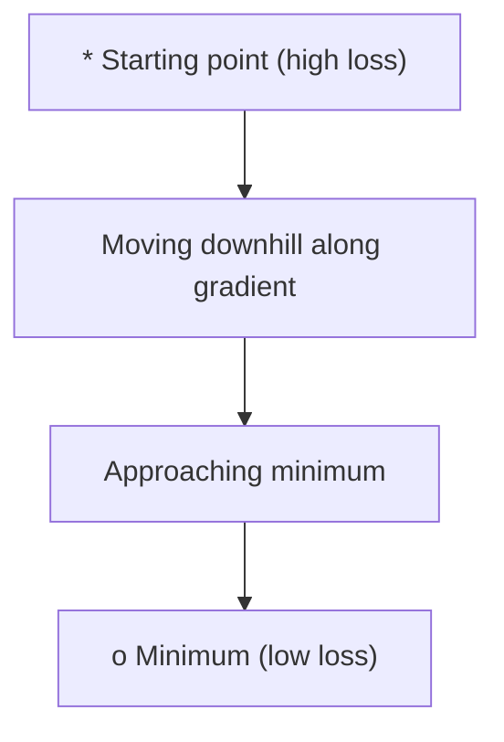
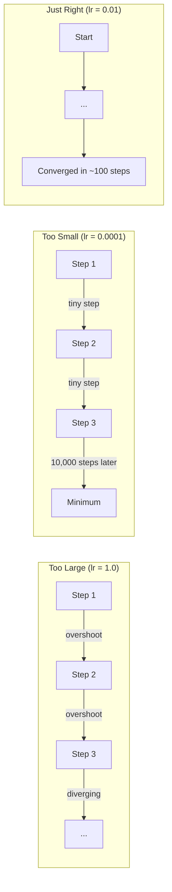
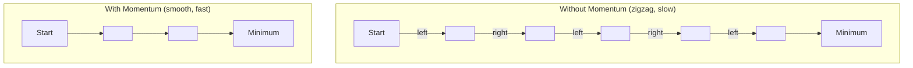
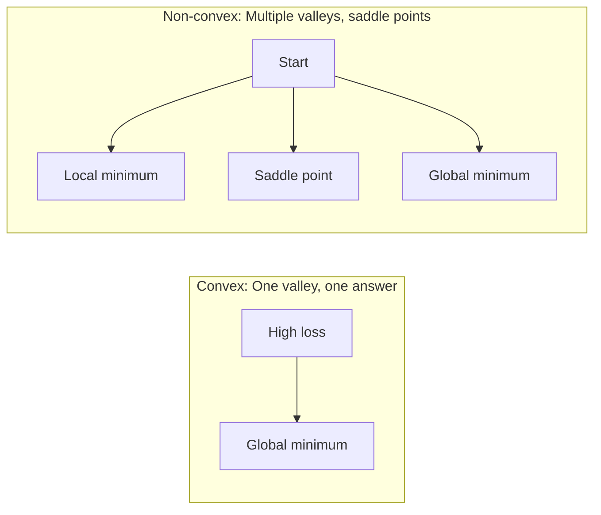
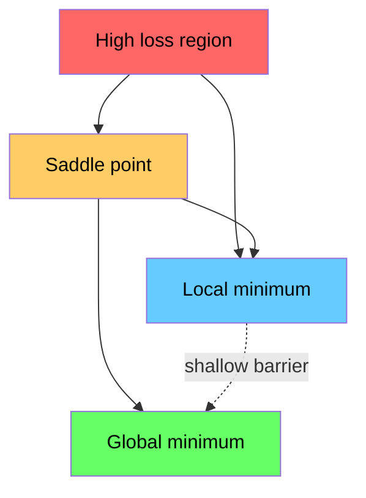

# 优化

> 训练一个神经网络,本质上就是寻找山谷的最低点.

**Type:** Build
**Language:**字符串
**Prerequisites:** Phase 1, Lessons 04-05 (Derivatives, Gradients)
**Time:** ~75 minutes

## 学习目标
- 从零实现尼拉梯度下降,带动力的 SGD,以及亚当
- 比较Rosenbrock函数 上的优化器 收表现,并解释为什么亚当会为每一个重量自适应调整学习率
- 区分凸与非凸的损失景观,并解释车点在高维空间中的作用
- 配置学习速度时间表 (步骤衰退,化,加热) 提高训练稳定性

## 问题
你有一个损失函数――它告诉你模型错误的离谱――你有梯度――它们告诉你哪个方向会使损失变得更糟――现在你需要一种向下走的策略――

最简单的方法很简单:朝渐进的反向移动――用一个叫学习率的数量来缩放步长――重复执行――这就是梯度下降,而且确实有效――但有效有前提――学习率太大,你会直接穿越整个山谷,两边之间来回震荡――学习率太小,你会用数千个不必要的步骤缓慢爬到答案――遇到车点时,即使还没有找到最低点,你也会停止移动――

如何更快,更可靠地到达山谷底部?

## 概念
### 优化意味着什么

在机器学习中,这个函数就是损失――输入是模型的重量――训练就是优化――

```
minimize L(w) where:
  L = loss function
  w = model weights (could be millions of parameters)
```

### 渐进性下降 (瓦尼拉)

最简单的优化器――计算减轻对每个重量的梯度――让每个重量 沿其梯度的反向移动――使用学习速度缩小这一步――

```
w = w - lr * gradient
```

这就是完整的算法.



### 学习速度:最重要的超值

控制步长. 它决定了收取的一切.



没有公式可以直接给出正确的学习率. 你需要通过实验找到它.

### 清算量与批量对比小批量

在迈出一步之前,会在整个数据集上计算的梯度.

随机样本上计算的梯,并立即更新.

首先在一个小批次 (32、64、128、256个样本) 上计算梯度,然后更新──这是实际上大家真正使用的方法──

| Variant | Batch size | Gradient quality | Speed per step | Noise |
|---------|-----------|-----------------|---------------|-------|
| Batch GD | 整个 dataset | 精确 | 慢 | 无 |
| SGD | 1 个样本 | 噪声很大 | 快 | 高 |
| Mini-batch | 32-256 | 良好估计 | 均衡 | 中等 |

由于它是的,它可以帮助逃离低层的局部最小和车点.

### 动力:向山下滚动的小球

如果梯度回归的形状摆动在狭窄山谷中很常见),进展会很慢.

```
v = beta * v + gradient
w = w - lr * v
```

类比是:一个向山下滚动的球. 它不会在每个小凸起处停下再开始. 它会在一致的方向上积累速度,并抑制震荡.



`beta`控制保留多少历史信息──beta 越高,momentum 越强,路径越平滑,但对方向变化的反应也越慢──

### 亚当:适应性学习率

不同的重量需要不同的学习率. 一个很少获得大分数的重量,最终获得大分数时应该迈出更大的步骤.

亚当的适应时刻估计将为每一个重量,

1. 第一个时刻 ((m):度的运行平均值 ((类似的动力)
2. 第二时刻 ((v):平方梯度的运行平均度 ((梯度大小)

```
m = beta1 * m + (1 - beta1) * gradient
v = beta2 * v + (1 - beta2) * gradient^2

m_hat = m / (1 - beta1^t)    bias correction
v_hat = v / (1 - beta2^t)    bias correction

w = w - lr * m_hat / (sqrt(v_hat) + epsilon)
```

除了`sqrt(v_hat)`是关键洞察. 具有大成绩的重量会被一个大成绩的分离. 有小成绩的重量会被一个小成绩的分离. 每个重量都会获得自己的适应性学习率.

默认超参数:`lr=0.001, beta1=0.9, beta2=0.999, epsilon=1e-8`,这些默认值对大多数问题都有效不错.

### 学习率时间表

固定的学习率是一个折中──早期训练,你希望步子大一些,以便快速取得进展──训练后期,你希望步子小一些,以便在最小的附近精调──

常见时间表:

| Schedule | Formula | Use case |
|----------|---------|----------|
| Step decay | lr = lr * factor every N epochs | 简单，手动控制 |
| Exponential decay | lr = lr_0 * decay^t | 平滑降低 |
| Cosine annealing | lr = lr_min + 0.5 * (lr_max - lr_min) * (1 + cos(pi * t / T)) | Transformers，现代训练 |
| Warmup + decay | 线性上升，然后 decay | 大模型，防止早期不稳定 |

### 形与非形

形函数只有一个最小的――渐进式下降总能找到它――像`f(x) = x^2`这样的方形是曲的.

网络损失功能是非形的.它们有很多地方的最小值.



实际上,高维神经网络中的本地最小值很少是真正的问题. 大多数本地最小值的损失值都接近全球最小值.

### 失景视觉化

损失是所有权重的函数.对于一个拥有100万权重的模型,损失景观存在于1,000,001维空间中.



的最小化较差. 的最小化较好. 这也是带动的 SGD 在最终测试精度上经常优于亚当的原因之一:它的噪音会防止模型停留在的最小中.


```figure
gradient-descent
```

## 构建它
### 步骤1:定义测试函数

罗森布洛克函数是经典优化基准.它的最小位数位于 (1, 1),处于一个狭窄曲的山谷中,很容易找到,但很难沿着它进步.

```
f(x, y) = (1 - x)^2 + 100 * (y - x^2)^2
```

```python
def rosenbrock(params):
    x, y = params
    return (1 - x) ** 2 + 100 * (y - x ** 2) ** 2

def rosenbrock_gradient(params):
    x, y = params
    df_dx = -2 * (1 - x) + 200 * (y - x ** 2) * (-2 * x)
    df_dy = 200 * (y - x ** 2)
    return [df_dx, df_dy]
```

### 步骤2:瓦尼拉梯度下降

```python
class GradientDescent:
    def __init__(self, lr=0.001):
        self.lr = lr

    def step(self, params, grads):
        return [p - self.lr * g for p, g in zip(params, grads)]
```

### 步骤3: 动力增长的SGD

```python
class SGDMomentum:
    def __init__(self, lr=0.001, momentum=0.9):
        self.lr = lr
        self.momentum = momentum
        self.velocity = None

    def step(self, params, grads):
        if self.velocity is None:
            self.velocity = [0.0] * len(params)
        self.velocity = [
            self.momentum * v + g
            for v, g in zip(self.velocity, grads)
        ]
        return [p - self.lr * v for p, v in zip(params, self.velocity)]
```

### 步骤4:亚当

```python
class Adam:
    def __init__(self, lr=0.001, beta1=0.9, beta2=0.999, epsilon=1e-8):
        self.lr = lr
        self.beta1 = beta1
        self.beta2 = beta2
        self.epsilon = epsilon
        self.m = None
        self.v = None
        self.t = 0

    def step(self, params, grads):
        if self.m is None:
            self.m = [0.0] * len(params)
            self.v = [0.0] * len(params)

        self.t += 1

        self.m = [
            self.beta1 * m + (1 - self.beta1) * g
            for m, g in zip(self.m, grads)
        ]
        self.v = [
            self.beta2 * v + (1 - self.beta2) * g ** 2
            for v, g in zip(self.v, grads)
        ]

        m_hat = [m / (1 - self.beta1 ** self.t) for m in self.m]
        v_hat = [v / (1 - self.beta2 ** self.t) for v in self.v]

        return [
            p - self.lr * mh / (vh ** 0.5 + self.epsilon)
            for p, mh, vh in zip(params, m_hat, v_hat)
        ]
```

### 步骤 5:运行和比较

```python
def optimize(optimizer, func, grad_func, start, steps=5000):
    params = list(start)
    history = [params[:]]
    for _ in range(steps):
        grads = grad_func(params)
        params = optimizer.step(params, grads)
        history.append(params[:])
    return history

start = [-1.0, 1.0]

gd_history = optimize(GradientDescent(lr=0.0005), rosenbrock, rosenbrock_gradient, start)
sgd_history = optimize(SGDMomentum(lr=0.0001, momentum=0.9), rosenbrock, rosenbrock_gradient, start)
adam_history = optimize(Adam(lr=0.01), rosenbrock, rosenbrock_gradient, start)

for name, history in [("GD", gd_history), ("SGD+M", sgd_history), ("Adam", adam_history)]:
    final = history[-1]
    loss = rosenbrock(final)
    print(f"{name:6s} -> x={final[0]:.6f}, y={final[1]:.6f}, loss={loss:.8f}")
```

预期输出:亚当 收最快――带动的 SGD 路径更平滑――瓦尼拉 GD 在狭窄山谷中进展缓慢――

## 使用它
实践中,使用 PyTorch 或 JAX 优化器──它们处理参数组、重量衰减、渐变剪切和GPU加速──

```python
import torch

model = torch.nn.Linear(784, 10)

sgd = torch.optim.SGD(model.parameters(), lr=0.01, momentum=0.9)
adam = torch.optim.Adam(model.parameters(), lr=0.001)
adamw = torch.optim.AdamW(model.parameters(), lr=0.001, weight_decay=0.01)

scheduler = torch.optim.lr_scheduler.CosineAnnealingLR(adam, T_max=100)
```

经验法则:

- 从亚当开始.
- 当你需要最好的最终精度,并且能够承担更多调整成本时,切换到带动力的 SGD ((lr=0.01,动力=0.9) .
- 对于转变器使用亚当W(带脱减肥的亚当)
- 对于几个时期的训练运行,始终使用学习率时间表.
- 如果训练不稳定,降低学习速度.如果训练太慢,提高它.

## 交付它
本课会产出一个用于选择合适优化器的提示.`outputs/prompt-optimizer-guide.md`,我知道.

在3阶段,我们将从零开始训练一个神经网络.

## 练习
1. **Learning rate sweep.**在罗森布洛克函数上使用学习率 [0.0001, 0.0005, 0.001, 0.005, 0.01] 运行基梯度下降──对每一个学习率,在5000步后绘图或打印最终损失──找到仍能收取的最大学习率──

2. **Momentum comparison.**在Rosenbrock函数上使用动力值 [0.0,0.5,0.9,0.99]运行带动力的 SGD──跟踪每一步的损失──哪个动力值收最快?哪个会超越?

3. **Saddle point escape.**定义函数`f(x, y) = x^2 - y^2`开始──比较尼拉 GD、带动的 SGD 和亚当的行为──哪个能逃离车点?

4. **Implement learning rate decay.**为 GradientDescent类 添加指数式衰变时间表:`lr = lr_0 * 0.999^step`△比较在Rosenbrock函数上使用衰变与不使用衰变的收表现──

## 关键术语
| Term | What people say | What it actually means |
|------|----------------|----------------------|
| Gradient descent | “Go downhill” | 通过减去按 learning rate 缩放后的 Gradient 来更新 weights。最基础的 Optimizer。 |
| Learning rate | “Step size” | 控制每次更新让 weights 移动多远的标量。太大会导致发散。太小会浪费计算。 |
| Momentum | “Keep rolling” | 将过去的 Gradients 累积到一个 velocity Vector 中。抑制震荡，并加速沿一致方向的移动。 |
| SGD | “Random sampling” | Stochastic gradient descent。用随机子集而不是完整 dataset 计算 Gradient。实践中几乎总是指 mini-batch SGD。 |
| Mini-batch | “A chunk of data” | 用于估计 Gradient 的一小部分训练数据（32-256 个样本）。平衡速度与 Gradient 准确性。 |
| Adam | “The default optimizer” | Adaptive Moment Estimation。跟踪每个 weight 的 Gradients 和 squared gradients 的 running averages，从而为每个 weight 提供自己的 learning rate。 |
| Bias correction | “Fix the cold start” | Adam 的 first 和 second moments 初始化为零。Bias correction 在早期步骤中通过除以 (1 - beta^t) 进行补偿。 |
| Learning rate schedule | “Change lr over time” | 在训练过程中调整 learning rate 的函数。早期大步，后期小步。 |
| Convex function | “One valley” | 任意 local minimum 都是 global minimum 的函数。Gradient descent 总能找到它。Neural Network losses 不是 convex。 |
| Saddle point | “Flat but not a minimum” | Gradient 为零，但在某些方向上是 minimum、在另一些方向上是 maximum 的点。高维空间中很常见。 |
| Loss landscape | “The terrain” | 在 weight space 上绘制出的 Loss function。通过沿两个随机方向切片来可视化。 |
| Convergence | “Getting there” | Optimizer 已到达一个继续更新也无法显著降低 Loss 的点。 |

## 延伸阅读
- [Sebastian Ruder: An overview of gradient descent optimization algorithms](https://ruder.io/optimizing-gradient-descent/)- 对所有主要优化器的全面概述
- [Why Momentum Really Works (Distill)](https://distill.pub/2017/momentum/)- 动力动态的互动可视化
- [Adam: A Method for Stochastic Optimization (Kingma & Ba, 2014)](https://arxiv.org/abs/1412.6980)- 原始亚当纸,易读且简短
- [Visualizing the Loss Landscape of Neural Nets (Li et al., 2018)](https://arxiv.org/abs/1712.09913)- 展示硬的纸质与平坦的纸质
