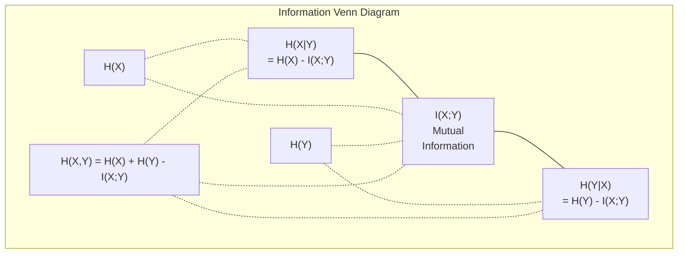

# 信息理论

> 信息理论 衡量惊喜――损失函数 建立在它之上――

**Type:** Learn
**Language:**字符串
**Prerequisites:** Phase 1, Lesson 06 (Probability)
**Time:** ~60 分钟

## 学习目标

- 从零计算的化,交叉化和KL分化,并解释它们之间的关系
- 推导为什么要最大化交叉缩损失等价格
- 计算特征与目标之间的互通信息,用于排序特征的重要性
- 将困难 解释为语言模型 从中选择的有效词汇规模

## 问题

你在训练中每一个分类模型都会调用`CrossEntropyLoss()`△你会在每篇语言模型论文中看到复杂性──你会在VAE、蒸和RLHF中读到KL分歧──这些概念并不是彼此分开的──它们都是相同的思想披着不同的外衣──

信息理论为你提供了不确定性,压缩和预测的推理语言. 1948年,Claude Shannon发明了它,用来解决通信问题.结果证明,训练神经网络也是一种通信问题.

这本课程将从零构建每个公式,让你看看它们来自哪里,以及为什么有效.

## 概念

### 信息量(惊喜)

随着不太可能发生的事情发生,它带来更多信息.

概率为 p 的事件信息量是:

```
I(x) = -log(p(x))
```

使用以2为底的日志 得到比特.使用自然日志 得到 nats.

```
Event              Probability    Surprise (bits)
Fair coin heads    0.5            1.0
Rolling a 6        0.167          2.58
1-in-1000 event    0.001          9.97
Certain event      1.0            0.0
```

确定事件带着零信息.

### 性 (平均惊度)

性是一种分布,

```
H(P) = -sum( p(x) * log(p(x)) )  for all x
```

公平硬币对二元变量 具有最大的缩:1位──偏置硬币(99% 正面) 具有低缩:0.08位──你已经知道会发生什么,因此每次抛几乎不会告诉你任何信息──

```
Fair coin:    H = -(0.5 * log2(0.5) + 0.5 * log2(0.5)) = 1.0 bit
Biased coin:  H = -(0.99 * log2(0.99) + 0.01 * log2(0.01)) = 0.08 bits
```

气量度一个分布中不可约定的不确定性――你无法缩小到低于它――

### 交叉透 (你每天使用的损失函数)

交叉化量 衡量当你使用分布 Q 来编码实际来自分布 P 的事件时,平均惊喜是多少──

```
H(P, Q) = -sum( p(x) * log(q(x)) )  for all x
```

如果Q与P完全匹配,交叉透等于透.任何不匹配都会使它变大.

在分类中,P 是一个热向量 (真类的概率为 1,其他全部为 0).

```
H(P, Q) = -log(q(true_class))
```

这就是分类的完整交叉缩损失公式.

### KL 差距 (分布 之间的距离)

分别 测量使用Q而不是P会带来多少额外的惊喜.

```
D_KL(P || Q) = sum( p(x) * log(p(x) / q(x)) )  for all x
             = H(P, Q) - H(P)
```

交叉化是加上KL差异的化.由于真正分布的化在训练期间是常数,最小化交叉化等等于最小化KL差异.

距离不对称:D_KL(P 距离 Q) !=D_KL(Q 距离 P) ──它不是真正的距离指标──

### 互通信息

相互信息 衡量知道一个变量 能告诉你另一个变量 多少信息──

```
I(X; Y) = H(X) - H(X|Y)
        = H(X) + H(Y) - H(X, Y)
```

如果X和Y 独立,相互信息为零. 知道其中一个不会告诉你另一个信息. 如果它们完全相关,相互信息等于任一变量的化.

在特征选择中,特征与目标之间的互通信息高,意味着该特征有用处.

### 条件性

衡量观察到X后,关于Y还有多少不确定性.

```
H(Y|X) = H(X,Y) - H(X)
```

两个极端:
- 如果X 完全决定Y,那么H(YX不过) = 0──知道X会消除关于Y的全部不确定性──示例:X =摄氏温度,Y =华氏温度──
- 如果X对Y没有任何信息,那么H(Y对X) =H() ――知道X 完全不会降低你的不确定性――例如:X =抛币结果,Y =明天的天气――

始终非负,并且永远不超过H(Y):

```
0 <= H(Y|X) <= H(Y)
```

在机器学习中,有条件的透现象在决策树中. 在每次分开时,算法会选择使H(Y X) 最小的特征X,也就是移除关于标签 Y 最多的不确定性特征.

### 关联

 X,Y) 是 X 和 Y 一起的联合分布的中.

```
H(X,Y) = -sum sum p(x,y) * log(p(x,y))   for all x, y
```

关键性质:

```
H(X,Y) <= H(X) + H(Y)
```

当 X 和 Y 独立时等号成立时,如果它们共享信息,联合缩就会小于各自的缩.



这些关系:
- , =  + 
-  () =  () -  () =  () -  ()
- , =+

### 互通信息 (深度潜水)

相互信息 I 量化知道一个变量会减少关于另一个变量的多少不确定性.

```
I(X;Y) = H(X) - H(X|Y)
       = H(Y) - H(Y|X)
       = H(X) + H(Y) - H(X,Y)
       = sum sum p(x,y) * log(p(x,y) / (p(x) * p(y)))
```

性质:
- 观察某事永远不会让你失去信息.
- 当且仅当 X 和 Y 独立时,I  X;Y) = 0。
- 它们是对称的,不同于KL分歧.
- 变量与自己共享全部信息.

**用于 feature selection 的 mutual information。**在 ML 中,你希望的功能对目标有信息量.

1. 对每个特征 X_i,计算 I(X_i; Y),其中 Y 是目标变量──
2. 按MI分数排序特征
3. 保持前面的特征.

这适用于特征与目标之间的任何关系:线性、非线性、单调或其他关系――关系只能捕捉到线性关系――MI 能捕捉所有关系――

| Method | Detects | Computational cost | Handles categorical? |
|--------|---------|-------------------|---------------------|
| Pearson correlation | Linear relationships | O(n) | No |
| Spearman correlation | Monotonic relationships | O(n log n) | No |
| Mutual information | 任意 statistical dependency | O(n log n) with binning | Yes |

### 标签滑滑与交叉透

标准分类 使用硬目标:[0, 0, 1, 0]──真类的概率为 1,其他全部为 0──标签平滑 会使用软目标 替换它们:

```
soft_target = (1 - epsilon) * hard_target + epsilon / num_classes
```

当epsilon = 0.1 且有4个类时:
- 强度目标: [0, 0, 1, 0]
- 软目标: [0.025,0.025,0.925,0.025]

从信息理论 视角看,标签平滑 增加了目标分布的化.

为什么这有帮助:
- 防止模型 将引擎推向极端值 在交叉值下,要完美匹配一个热目标 需要无限大的引擎)
- 作为规范:模型不能100%自信
- 改善校准:预测概率更好地反映真实不确定性
- 缩小训练行为与推断行为之间的差距

使用标签滑滑 的交叉缩损失 变为:

```
L = (1 - epsilon) * CE(hard_target, prediction) + epsilon * H_uniform(prediction)
```

第二,将惩罚远离统一的预测,即直接对信心进行规范化.

### 为什么跨是分类损失的核心

三个视角,同一个结论.

**Information Theory 视角。**跨体化 衡量使用你的模型的分布而不是实际分布时浪费了多少位.

**Maximum likelihood 视角。**对于 N 个真实类为 y_i 的培训样本:

```
Likelihood     = product( q(y_i) )
Log-likelihood = sum( log(q(y_i)) )
Negative log-likelihood = -sum( log(q(y_i)) )
```

最后一行就是交叉缩损失――最小化交叉缩 =最大化训练数据 在你的模型下面的可能性――

**Gradient 视角。**交叉化 关于逻辑的渐变 简单地是(预测 - 真正) 干净、稳定、计算快速――这就是它与软max 完美配合的原因――

### 子与子

唯一的区别是日志的底数.

```
log base 2   -> bits      (information theory tradition)
log base e   -> nats      (machine learning convention)
log base 10  -> hartleys  (rarely used)
```

1 nat = 1/ln(2) 位 = 1,4427 位──PyTorch 和 TensorFlow 默认使用自然的日志

### 困惑

困惑是跨的指数. 它告诉你模型的有效数量不确定.

```
Perplexity = 2^H(P,Q)   (if using bits)
Perplexity = e^H(P,Q)   (if using nats)
```

对于50个语言模型,平均来看,就像必须从50个可能的下一个代币中中均选择一样困惑――越低越好――

在常见基准上,GPT-2达到约30个的困难性.


```figure
entropy-kl
```

## 构建它

### 第1步:信息含量和

```python
import math

def information_content(p, base=2):
    if p <= 0 or p > 1:
        return float('inf') if p <= 0 else 0.0
    return -math.log(p) / math.log(base)

def entropy(probs, base=2):
    return sum(
        p * information_content(p, base)
        for p in probs if p > 0
    )

fair_coin = [0.5, 0.5]
biased_coin = [0.99, 0.01]
fair_die = [1/6] * 6

print(f"Fair coin entropy:   {entropy(fair_coin):.4f} bits")
print(f"Biased coin entropy: {entropy(biased_coin):.4f} bits")
print(f"Fair die entropy:    {entropy(fair_die):.4f} bits")
```

### 步骤2:跨和KL分离

```python
def cross_entropy(p, q, base=2):
    total = 0.0
    for pi, qi in zip(p, q):
        if pi > 0:
            if qi <= 0:
                return float('inf')
            total += pi * (-math.log(qi) / math.log(base))
    return total

def kl_divergence(p, q, base=2):
    return cross_entropy(p, q, base) - entropy(p, base)

true_dist = [0.7, 0.2, 0.1]
good_model = [0.6, 0.25, 0.15]
bad_model = [0.1, 0.1, 0.8]

print(f"Entropy of true dist:     {entropy(true_dist):.4f} bits")
print(f"CE (good model):          {cross_entropy(true_dist, good_model):.4f} bits")
print(f"CE (bad model):           {cross_entropy(true_dist, bad_model):.4f} bits")
print(f"KL divergence (good):     {kl_divergence(true_dist, good_model):.4f} bits")
print(f"KL divergence (bad):      {kl_divergence(true_dist, bad_model):.4f} bits")
```

### 步骤3: 作为分类损失的交叉缩

```python
def softmax(logits):
    max_logit = max(logits)
    exps = [math.exp(z - max_logit) for z in logits]
    total = sum(exps)
    return [e / total for e in exps]

def cross_entropy_loss(true_class, logits):
    probs = softmax(logits)
    return -math.log(probs[true_class])

logits = [2.0, 1.0, 0.1]
true_class = 0

probs = softmax(logits)
loss = cross_entropy_loss(true_class, logits)

print(f"Logits:      {logits}")
print(f"Softmax:     {[f'{p:.4f}' for p in probs]}")
print(f"True class:  {true_class}")
print(f"Loss:        {loss:.4f} nats")
print(f"Perplexity:  {math.exp(loss):.2f}")
```

### 步骤 4: 交叉缩等于负记载概率

```python
import random

random.seed(42)

n_samples = 1000
n_classes = 3
true_labels = [random.randint(0, n_classes - 1) for _ in range(n_samples)]
model_logits = [[random.gauss(0, 1) for _ in range(n_classes)] for _ in range(n_samples)]

ce_loss = sum(
    cross_entropy_loss(label, logits)
    for label, logits in zip(true_labels, model_logits)
) / n_samples

nll = -sum(
    math.log(softmax(logits)[label])
    for label, logits in zip(true_labels, model_logits)
) / n_samples

print(f"Cross-entropy loss:      {ce_loss:.6f}")
print(f"Negative log-likelihood: {nll:.6f}")
print(f"Difference:              {abs(ce_loss - nll):.2e}")
```

### 步骤5:相互信息

```python
def mutual_information(joint_probs, base=2):
    rows = len(joint_probs)
    cols = len(joint_probs[0])

    margin_x = [sum(joint_probs[i][j] for j in range(cols)) for i in range(rows)]
    margin_y = [sum(joint_probs[i][j] for i in range(rows)) for j in range(cols)]

    mi = 0.0
    for i in range(rows):
        for j in range(cols):
            pxy = joint_probs[i][j]
            if pxy > 0:
                mi += pxy * math.log(pxy / (margin_x[i] * margin_y[j])) / math.log(base)
    return mi

independent = [[0.25, 0.25], [0.25, 0.25]]
dependent = [[0.45, 0.05], [0.05, 0.45]]

print(f"MI (independent): {mutual_information(independent):.4f} bits")
print(f"MI (dependent):   {mutual_information(dependent):.4f} bits")
```

## 使用它

使用NumPy表达同样的概念,也就是你在实践中会使用的方式:

```python
import numpy as np

def np_entropy(p):
    p = np.asarray(p, dtype=float)
    mask = p > 0
    result = np.zeros_like(p)
    result[mask] = p[mask] * np.log(p[mask])
    return -result.sum()

def np_cross_entropy(p, q):
    p, q = np.asarray(p, dtype=float), np.asarray(q, dtype=float)
    mask = p > 0
    return -(p[mask] * np.log(q[mask])).sum()

def np_kl_divergence(p, q):
    return np_cross_entropy(p, q) - np_entropy(p)

true = np.array([0.7, 0.2, 0.1])
pred = np.array([0.6, 0.25, 0.15])
print(f"Entropy:    {np_entropy(true):.4f} nats")
print(f"Cross-ent:  {np_cross_entropy(true, pred):.4f} nats")
print(f"KL div:     {np_kl_divergence(true, pred):.4f} nats")
```

你从零开始构建了`torch.nn.CrossEntropyLoss()`内部的情况――现在你知道为什么损失会在训练过程中下降:你的模型的预测分布正接近真正的分布,

## 练习

1. 假设英文字母表服从统一分布 (26个字母),计算它的化――然后使用实际字母频率来估计它――哪个更高,为什么?

2. 某个模型对真实类为 1 的样本输出记录 [5.0, 2.0, 0.5]──手算交叉缩损失,然后用你的`cross_entropy_loss`什么样的逻辑会给出零损失?

3. 证明KL分歧 不是对称的. 选择两个分布 P 和 Q,计算 D_KL 计算 Q 和 D_K 计算 Q 和 D_L 解释它们为什么不同.

4. 构建一个函数,为一段代币预测 序列计算困惑――给定一个由 (true_token_index, predicted_logits) 组合的组合列表,返回该序列的困惑――

## 关键术语

| Term | What people say | What it actually means |
|------|----------------|----------------------|
| Information content | “Surprise” | 编码一个事件所需的 bits（或 nats）数量：-log(p) |
| Entropy | “Randomness” | 一个 distribution 中所有 outcomes 的平均 surprise。衡量不可约 uncertainty。 |
| Cross-entropy | “The loss function” | 使用 model distribution Q 编码来自 true distribution P 的事件时的平均 surprise。 |
| KL divergence | “Distance between distributions” | 使用 Q 而不是 P 所浪费的额外 bits。等于 cross-entropy 减 entropy。不是对称的。 |
| Mutual information | “How related are X and Y” | 知道 Y 后，关于 X 的 uncertainty 减少量。为零表示独立。 |
| Softmax | “Turn logits into probabilities” | 取指数并归一化。将任意 real-valued vector 映射为有效 probability distribution。 |
| Perplexity | “How confused the model is” | Cross-entropy 的指数。model 在每一步从中选择的有效 vocabulary size。 |
| Bits | “Shannon's unit” | 使用以 2 为底的 log 衡量的信息。一个 bit 解决一次公平抛硬币。 |
| Nats | “ML's unit” | 使用 natural log 衡量的信息。PyTorch 和 TensorFlow 默认使用。 |
| Negative log-likelihood | “NLL loss” | 对 one-hot labels 来说，与 cross-entropy loss 完全相同。最小化它会最大化正确 predictions 的概率。 |

## 延伸阅读

- [Shannon 1948: A Mathematical Theory of Communication](https://people.math.harvard.edu/~ctm/home/text/others/shannon/entropy/entropy.pdf)- 原始论文,至今仍然易读
- [Visual Information Theory (Chris Olah)](https://colah.github.io/posts/2015-09-Visual-Information/)- 对和KL分歧的最佳可见解释
- [PyTorch CrossEntropyLoss docs](https://pytorch.org/docs/stable/generated/torch.nn.CrossEntropyLoss.html)- 框架 如何实现你刚刚构建的内容
