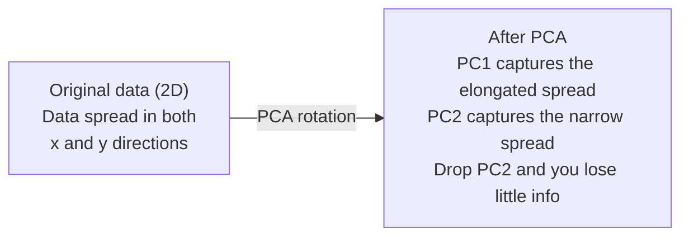

# 缩小尺寸

> 高维数据有结构. 你需要从正确的角度观察它.

**Type:** Build
**Language:**字符串
**Prerequisites:** Phase 1, Lessons 01（Linear Algebra Intuition）、02（Vectors, Matrices & Operations）、03（Eigenvalues & Eigenvectors）、06（Probability & Distributions）
**Time:** ~90 分钟

## 学习目标

- 从零实现PCA:数据中心,计算共变矩阵,自定义组合,并进行项目
- 使用解释的变量比 和肘方方法 选择主要组件的数量
- 比较PCA、t-SNE和UMAP在2D中可视化的MNIST数字的效果,并解释它们的权衡
- 使用带 RBF 核的核PCA 分离标准PCA 无法处理的非线性数据结构

## 问题

你有一个每个样本包含784个特征的数据集――也许它是手写数字的像素值――也许它是基因表达水平――也许它是用户行为信号――你无法可视化784个维度――你无法绘制它们――你甚至无法思考它们――

但这784个特征中,大多数都是冗余的. 真正的信息存在于一个小的表面. 一个手写的"7"不需要784个相互独立的数字来描述.

维度减少会找到更小的表面――它将你的784维度数据缩小到2,10或50维度,同时保留重要结构――

## 概念

### 维度的诅咒

高维空间不符合直觉.随着维度的增长,有三个事情会失效.

**距离变得没有意义。**在高维中,任意两个随机点之间的距离会达到相同的值.如果每个点与其他每个点之间的距离都不一样,

```
Dimension    Avg distance ratio (max/min between random points)
2            ~5.0
10           ~1.8
100          ~1.2
1000         ~1.02
```

**体积集中在角落。**在100维中,几乎所有的体积都在角落里,远离中心. 数据点将扩散到边缘,而你的模型在内部区域会缺少数据.

**你需要指数级更多的数据。**为了在一个空间中保持相同的样本密度,从2D到20D意味着你需要10^18倍的数据――你永远不会有足够的数据――降低的维度将数据密度带来可处理的范围――

### 查找重要的方向

主成分分析 (PCA) 会找到数据变化最大的轴――它旋转你的坐标系,使第一轴捕获最多的变化,第二轴捕获第二种变化,依此类推――

算法:

```
1. Center the data        (subtract the mean from each feature)
2. Compute covariance     (how features move together)
3. Eigendecomposition     (find the principal directions)
4. Sort by eigenvalue     (biggest variance first)
5. Project               (keep top k eigenvectors, drop the rest)
```

为什么使用自定义组合?共差矩阵是对称且正的半确的――它的自向量是特征空间中直角方向――自值值值告诉你每个方向捕获了多少变异――具有最大的自值的自向量指向最大的变异方向――



- **Before PCA:**数据云 沿 x 和 y 两个轴呈对角线扩散
- **After PCA:**坐标系被旋转,使PC1对齐最大差距的方向(延长差距),PC2对齐最小差距的方向(窄差距)
- **Dimensionality reduction:**丢弃PC2 将数据投影到PC1上,只会损失很少的信息

### 解释变异率

每个主要组件都捕获了总变量的一部分.

```
Component    Eigenvalue    Explained ratio    Cumulative
PC1          4.73          0.473              0.473
PC2          2.51          0.251              0.724
PC3          1.12          0.112              0.836
PC4          0.89          0.089              0.925
...
```

当累计解释变异达到0.95时,你就知道这些组件 捕获了95%的信息.

### 选择组件数量

三种策略:

1. **Threshold.**保持足够多的组件,解释90-95%的差异.
2. **Elbow method.**绘制每个组件的解释变异――寻找明显的快速下降点――
3. **Downstream performance.**将PCA 用作预处理――扫描 k,并测量模型的精度――最佳 k 是精度 进入平台期的位置――

### 保护社区

t-分布式的静态邻居嵌入式 (t-SNE) 是为可视化设计的. 它将高维数据映射到2D或3D,同时保留哪些点接近彼此.

直觉是:在原始空间中,根据点对点之间的距离计算一个概率分布――近点得到高概率――远点得到低概率――然后找到一个2D排布,使相同的概率分布成立――在784维中是邻居的点,在2D中仍然保持为邻居――

子的关键性质:
- 不线性. 它可以展开PCA无法处理的复杂的多元化.
- 不同运行会产生不同的布局.
- 参数控制考虑多少邻居 (典型范围:5-50)
- 输出中集群之间的距离没有意义.
- 在大型数据集上很慢.默认是O (n) 2.

### 快速,更好的全球结构

统一多重接近和投影 (UMAP) 的工作方式与t-SNE类似,但有两个优势:
- 更快──它使用近邻图,而不是计算所有对距离──
- 较好的全球结构――输出中集群相对位置往往比t-SNE更有意义――

在高维空间中构建一个重量图形,然后寻找一个低维布局,尽可能保留这个图形.

关键参数:
- `n_neighbors`更多的邻居定义了本地结构,类似于困惑.
- `min_dist`输出中点聚集得多紧.较低的值会产生更密集的集群.

### 什么时候使用

| Method | Use case | Preserves | Speed |
|--------|----------|-----------|-------|
| PCA | Preprocessing before training | Global variance | Fast (exact), works on millions of samples |
| PCA | Quick exploratory visualization | Linear structure | Fast |
| t-SNE | Publication-quality 2D plots | Local neighborhoods | Slow (< 10k samples ideal) |
| UMAP | 2D visualization at scale | Local + some global structure | Medium (handles millions) |
| PCA | Feature reduction for models | Variance-ranked features | Fast |
| t-SNE / UMAP | Understanding cluster structure | Cluster separation | Medium to slow |

经验法则:使用PCA做预处理和数据压缩──当你需要在2D中可视化结构时,使用t-SNE或UMAP──

### 核PCA

标准PCA会找到线性子空间――它旋转你的坐标系并丢弃轴――但是如果数据位于非线性多元上怎么办?2D中一个圆不能被任何直线分离――标准PCA不会有帮助――

核心PCA在内核函数诱导的高维功能空间中应用PCA,而显然不计算该空间中的坐标――这就是内核技巧,也就是SVM背后的同一个思想――

算法:
1. 计算内核矩阵K,其中K_ij = k(x_i,x_j)
2. 在功能空间中中核矩阵
3. 对中心内核矩阵做自己的组合
4. 顶部的自向量按1/sqrt的自值值缩放就是投影

常见内核函数:

| Kernel | Formula | Good for |
|--------|---------|----------|
| RBF (Gaussian) | exp(-gamma * \|\|x - y\|\|^2) | 大多数 nonlinear data、smooth manifolds |
| Polynomial | (x . y + c)^d | Polynomial relationships |
| Sigmoid | tanh(alpha * x . y + c) | Neural network-like mappings |

何時使用内核PCA而不是标准PCA:

| Criterion | Standard PCA | Kernel PCA |
|-----------|-------------|------------|
| Data structure | Linear subspace | Nonlinear manifold |
| Speed | O(min(n^2 d, d^2 n)) | O(n^2 d + n^3) |
| Interpretability | Components are linear combinations of features | Components lack direct feature interpretation |
| Scalability | Works on millions of samples | Kernel matrix is n x n, memory-limited |
| Reconstruction | Direct inverse transform | Requires pre-image approximation |

经典例子:2D 中的圆点――两圈点,一圈在另一圈内――标准PCA将它们投影到同一条线上,这对分类没有用处――带着RBF内核的内圈PCA将内圈和外圈映射到不同的区域,使它们线性分离――

### 复制错误

你把784维缩小到50维.你丢了什么?

测量重建错误:
1. 将数据投影到 k 维:X_reduced = X @ W_k
2. 重建:X_hat = X_reduced @ W_k^T
3. 计算 MSE:平均水平

对于PCA,重建错误与解释变异有明确关系:

```
Reconstruction error = sum of eigenvalues NOT included
Total variance = sum of ALL eigenvalues
Fraction lost = (sum of dropped eigenvalues) / (sum of all eigenvalues)
```

每个组件的解释变量比是:

```
explained_ratio_k = eigenvalue_k / sum(all eigenvalues)
```

总结解释分数的变异,将得到"肘部"曲线.
- 曲线变平的位置 (收益递减)
- 累积变异 跨越你的门的位置(通常是0.90或0.95)
- 下游任务执行 进入平台期的位置

重建错误不仅用于选择k.你可以将其用于异常检测:重建错误高的样本是异常值,它们不符合学习的子空间.


```figure
pca-axes
```

## 建立它

### 步骤1:从零开始进行PCA

```python
import numpy as np

class PCA:
    def __init__(self, n_components):
        self.n_components = n_components
        self.components = None
        self.mean = None
        self.eigenvalues = None
        self.explained_variance_ratio_ = None

    def fit(self, X):
        self.mean = np.mean(X, axis=0)
        X_centered = X - self.mean

        cov_matrix = np.cov(X_centered, rowvar=False)

        eigenvalues, eigenvectors = np.linalg.eigh(cov_matrix)

        sorted_idx = np.argsort(eigenvalues)[::-1]
        eigenvalues = eigenvalues[sorted_idx]
        eigenvectors = eigenvectors[:, sorted_idx]

        self.components = eigenvectors[:, :self.n_components].T
        self.eigenvalues = eigenvalues[:self.n_components]
        total_var = np.sum(eigenvalues)
        self.explained_variance_ratio_ = self.eigenvalues / total_var

        return self

    def transform(self, X):
        X_centered = X - self.mean
        return X_centered @ self.components.T

    def fit_transform(self, X):
        self.fit(X)
        return self.transform(X)
```

### 步骤2:对合成数据进行测试

```python
np.random.seed(42)
n_samples = 500

t = np.random.uniform(0, 2 * np.pi, n_samples)
x1 = 3 * np.cos(t) + np.random.normal(0, 0.2, n_samples)
x2 = 3 * np.sin(t) + np.random.normal(0, 0.2, n_samples)
x3 = 0.5 * x1 + 0.3 * x2 + np.random.normal(0, 0.1, n_samples)

X_synthetic = np.column_stack([x1, x2, x3])

pca = PCA(n_components=2)
X_reduced = pca.fit_transform(X_synthetic)

print(f"Original shape: {X_synthetic.shape}")
print(f"Reduced shape:  {X_reduced.shape}")
print(f"Explained variance ratios: {pca.explained_variance_ratio_}")
print(f"Total variance captured: {sum(pca.explained_variance_ratio_):.4f}")
```

### 步骤3:MNIST数字在2D中

```python
from sklearn.datasets import fetch_openml

mnist = fetch_openml("mnist_784", version=1, as_frame=False, parser="auto")
X_mnist = mnist.data[:5000].astype(float)
y_mnist = mnist.target[:5000].astype(int)

pca_mnist = PCA(n_components=50)
X_pca50 = pca_mnist.fit_transform(X_mnist)
print(f"50 components capture {sum(pca_mnist.explained_variance_ratio_):.2%} of variance")

pca_2d = PCA(n_components=2)
X_pca2d = pca_2d.fit_transform(X_mnist)
print(f"2 components capture {sum(pca_2d.explained_variance_ratio_):.2%} of variance")
```

### 步骤 4:与 sklearn 进行比较

```python
from sklearn.decomposition import PCA as SklearnPCA
from sklearn.manifold import TSNE

sklearn_pca = SklearnPCA(n_components=2)
X_sklearn_pca = sklearn_pca.fit_transform(X_mnist)

print(f"\nOur PCA explained variance:     {pca_2d.explained_variance_ratio_}")
print(f"Sklearn PCA explained variance: {sklearn_pca.explained_variance_ratio_}")

diff = np.abs(np.abs(X_pca2d) - np.abs(X_sklearn_pca))
print(f"Max absolute difference: {diff.max():.10f}")

tsne = TSNE(n_components=2, perplexity=30, random_state=42)
X_tsne = tsne.fit_transform(X_mnist)
print(f"\nt-SNE output shape: {X_tsne.shape}")
```

### 步骤5:UMAP比较

```python
try:
    from umap import UMAP

    reducer = UMAP(n_components=2, n_neighbors=15, min_dist=0.1, random_state=42)
    X_umap = reducer.fit_transform(X_mnist)
    print(f"UMAP output shape: {X_umap.shape}")
except ImportError:
    print("Install umap-learn: pip install umap-learn")
```

## 用它

把PCA 用作分类器 之前的预处理:

```python
from sklearn.decomposition import PCA as SklearnPCA
from sklearn.linear_model import LogisticRegression
from sklearn.model_selection import train_test_split
from sklearn.metrics import accuracy_score

X_train, X_test, y_train, y_test = train_test_split(
    X_mnist, y_mnist, test_size=0.2, random_state=42
)

results = {}
for k in [10, 30, 50, 100, 200]:
    pca_k = SklearnPCA(n_components=k)
    X_tr = pca_k.fit_transform(X_train)
    X_te = pca_k.transform(X_test)

    clf = LogisticRegression(max_iter=1000, random_state=42)
    clf.fit(X_tr, y_train)
    acc = accuracy_score(y_test, clf.predict(X_te))
    var_captured = sum(pca_k.explained_variance_ratio_)
    results[k] = (acc, var_captured)
    print(f"k={k:>3d}  accuracy={acc:.4f}  variance={var_captured:.4f}")
```

性能会在远小于 784维时进入平台期.

## 运送它

本课会产出:
- `outputs/skill-dimensionality-reduction.md`- 一个用于给定任务选择合适的尺寸性减少技术技能

## 运动

1. 修改PCA类 以支持`inverse_transform`△使用10、50 和200个组件重建MNIST数字──分别打印重建错误(相对于原始数据的平均平方差别)。

2. 在同一MNIST子组上运行t-SNE,度值分别为5、30和100──描述输出如何变化──为什么度会影响集群紧密性?

3. 取一个有50个功能,但只有5个信息功能的数据集`sklearn.datasets.make_classification`生成) ・应用PCA,并检查解释了变量曲线 是否正确识别出数据实际上是五维的──

## 关键词

| Term | What people say | What it actually means |
|------|----------------|----------------------|
| Curse of dimensionality | "Too many features" | 随着维度增长，距离、体积和数据密度都会表现得反直觉。Models 需要指数级更多的数据来补偿。 |
| PCA | "Reduce dimensions" | 旋转你的坐标系，使各轴与 maximum variance 的方向对齐，然后丢弃 low-variance axes。 |
| Principal component | "An important direction" | Covariance matrix 的一个 eigenvector。Feature space 中数据变化最大的方向。 |
| Explained variance ratio | "How much info this component has" | 一个 principal component 捕获的 total variance 比例。对前 k 个 ratios 求和，就能看到 k 个 components 保留了多少信息。 |
| Covariance matrix | "How features correlate" | 一个 symmetric matrix，其中 entry (i,j) 衡量 feature i 和 feature j 如何共同变化。Diagonal entries 是各自的 variances。 |
| t-SNE | "That cluster plot" | 一种 nonlinear 方法，通过保留 pairwise neighborhood probabilities 将高维数据映射到 2D。适合可视化，不适合 preprocessing。 |
| UMAP | "Faster t-SNE" | 一种基于 topological data analysis 的 nonlinear 方法。既保留 local structure，也保留部分 global structure。比 t-SNE 更容易扩展。 |
| Perplexity | "A t-SNE knob" | 控制每个点考虑的有效邻居数量。低 perplexity 聚焦非常 local 的结构。高 perplexity 捕获更宽泛的模式。 |
| Manifold | "The surface the data lives on" | Embedding在更高维空间中的低维表面。一张在 3D 中揉皱的纸是一个 2D manifold。 |

## 进一步阅读

- [A Tutorial on Principal Component Analysis](https://arxiv.org/abs/1404.1100)开始清晰推导 PCA
- [How to Use t-SNE Effectively](https://distill.pub/2016/misread-tsne/)关于t-SNE 陷和参数选择的交互式指南
- [UMAP documentation](https://umap-learn.readthedocs.io/)- 来自UMAP作者的理论和实践指导
