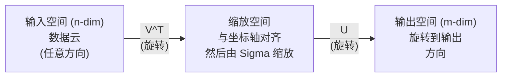
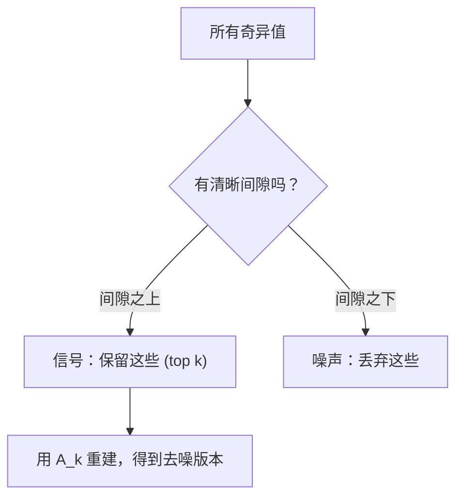

# 单一值分解

> 每个矩阵都有SVD. 每个数据科学家都需要SVD.

**Type:** Build
**Languages:** Python, Julia
**Prerequisites:** Phase 1，Lessons 01 (Linear Algebra Intuition)、02 (Vectors & Matrices Operations)、03 (Matrix Transformations)
**Time:** ~120 minutes

## 学习目标
- 通过功率代实现SVD,并解释U、Sigma 和 V^T的几何含义
- 应用缩短SVD 进行图像压缩,并衡量压缩率与重建差异之间的关系
- 通过SVD计算摩尔-罗斯伪逆,以求解超定最小平方
- 将SVD与PCA、推系统 (置因素) 和NLP中置语义分析联系起来

## 问题
你有一个1000x2000的矩阵. 它可能是用户电影评分. 它可能是文档词项频率表. 也可能是一个图像的像素值. 你需要压缩它,去噪音,发现其中的隐藏结构,或者用它来解答一个最小方形的系统. 它的构成仅适用于方阵.

适用于任何矩阵――任意形状――任意级别――无条件限制――它把矩阵分为三个因子,揭示了对空间所发生变化的几何结构――它是整个线性代数中最普遍的――最有用的因素化――

## 概念
### 如何做什么?

每个矩阵,无论形状如何,都会按顺序执行三个操作:旋转,缩放,旋转.

```
A = U * Sigma * V^T

      m x n     m x m    m x n    n x n
     (任意)    (旋转)   (缩放)   (旋转)
```

给定任意矩阵A,SVD将其分解为:
- 在空间中的向量
- 随着每个轴进行缩放 (拉伸或压缩)
- 结果将转到输出空间 (m 维)



可以理解. 你把一个矩阵交给SVD. 它会告诉你:这个矩阵会先使用V^T旋转输入球体,然后使用Sigma将其拉伸成球体,最后使用U旋转这个球体.

### 完全的分解

对于形状为m x n 的矩阵 A:

```
A = U * Sigma * V^T

其中：
  U     是 m x m，正交 (U^T U = I)
  Sigma 是 m x n，对角（奇异值位于对角线上）
  V     是 n x n，正交 (V^T V = I)

奇异值 sigma_1 >= sigma_2 >= ... >= sigma_r > 0
其中 r = rank(A)
```

U 的列称为左奇异向量. V 的列称为右奇异向量.

### 左单向量"",单向值"",右单向量

每个SVD组成部分都有不同的几何含义.

**Right singular vectors（V 的列）：**它们为输入空间 (R^n) 构成一组的正规基础.它们是输入空间中的方向,矩阵将这些方向映射到输出空间中的正交方向.

**Singular values（Sigma 的对角线）：**它们是缩小的因子. 第一个奇异值告诉你,矩阵沿着第一个右边奇异向量 方向将向量 拉伸多少――奇异值为零意味着矩阵将把该方向完全压──

**Left singular vectors（U 的列）：**它们为输出空间 (R^m) 构成一组正规基础.

它们之间的关系:

```
A * v_i = sigma_i * u_i

Matrix A 接收第 i 个右奇异Vector v_i，
用 sigma_i 对其缩放，并将其映射到第 i 个左奇异Vector u_i。
```

这给出了任意矩阵做什么的个性图像.

### 外型产品形式

体可以写成级-1矩阵的和:

```
A = sigma_1 * u_1 * v_1^T + sigma_2 * u_2 * v_2^T + ... + sigma_r * u_r * v_r^T

每一项 sigma_i * u_i * v_i^T 都是一个 rank-1 Matrix（一个 outer product）。
完整 Matrix 是 r 个这类 Matrix 的和，其中 r 是 rank。
```

这种形式是低级近似的基础. 每个项目都增加了一个层结构. 第一,捕获最重要的单一模式. 第二,捕获最重要的第二模式.

```
Rank-1 approx:    A_1 = sigma_1 * u_1 * v_1^T
                  (捕获主导模式)

Rank-2 approx:    A_2 = sigma_1 * u_1 * v_1^T + sigma_2 * u_2 * v_2^T
                  (捕获两个最重要的模式)

Rank-k approx:    A_k = top k 项之和
                  (根据 Eckart-Young theorem，这是最优的)
```

### 关于自己的组成的关系

奇异值和奇异向量直接来自A^T A 和A^T的 eigenvalues 与 eigenvectors.

```
A^T A = V * Sigma^T * U^T * U * Sigma * V^T
      = V * Sigma^T * Sigma * V^T
      = V * D * V^T

其中 D = Sigma^T * Sigma 是一个对角 Matrix，其对角线上为 sigma_i^2。

因此：
- 右奇异Vector (V) 是 A^T A 的 eigenvectors
- 奇异值的平方 (sigma_i^2) 是 A^T A 的 eigenvalues

类似地：
A A^T = U * Sigma * V^T * V * Sigma^T * U^T
      = U * Sigma * Sigma^T * U^T

因此：
- 左奇异Vector (U) 是 A A^T 的 eigenvectors
- A A^T 的 eigenvalues 也都是 sigma_i^2
```

这位联系人告诉你三个事情:
1. 奇异值总是实数且非负数,它们是正面半定义矩阵的本值的平方根.
2. 通过A^T A来计算SVD,你可以做自己的组合,但这会导致平方条件数并损失数值精度.
3. 当A 是方阵且为对称正半确时,SVD 和自身构成是同一件事.

### 缩短的SVD:低级近似

埃卡特-年轻-米尔斯基定理表明,A 的最佳级别近似在弗罗贝尼斯规范和光谱规范下) 通过只能保留顶级 k 个奇异值及其对应向量得到:

```
A_k = U_k * Sigma_k * V_k^T

其中：
  U_k     是 m x k  (U 的前 k 列)
  Sigma_k 是 k x k  (Sigma 的左上 k x k 块)
  V_k     是 n x k  (V 的前 k 列)

近似误差 = sigma_{k+1}  (在 spectral norm 下)
         = sqrt(sigma_{k+1}^2 + ... + sigma_r^2)  (在 Frobenius norm 下)
```

这不仅仅是一个好的近似――它是可证明的最佳级 k近似――没有其他级 k矩阵能更接近A――

| Component | Relative magnitude | Kept in rank-3 approx? |
|-----------|-------------------|------------------------|
| sigma_1 | 最大 | 是 |
| sigma_2 | 大 | 是 |
| sigma_3 | 中等偏大 | 是 |
| sigma_4 | 中等 | 否（误差） |
| sigma_5 | 中等偏小 | 否（误差） |
| sigma_6 | 小 | 否（误差） |
| sigma_7 | 很小 | 否（误差） |
| sigma_8 | 极小 | 否（误差） |

保留 top 3:A_3 捕获三个最大的奇异值──误差 = 剩余值(sigma_4 到 sigma_8) ⋅

如果奇异值很快衰退,一个很小的 k 就能捕获矩阵的大部分信息.

### 使用SVD 进行图像压缩

灰度图像是像素强度组成的矩阵. 一张800x600 图像有480,000 个值.

```
原始图像：800 x 600 = 480,000 个值

rank k 的 SVD：
  U_k:      800 x k 个值
  Sigma_k:  k 个值
  V_k:      600 x k 个值
  总计:     k * (800 + 600 + 1) = k * 1401 个值

  k=10:   14,010 个值   (原始的 2.9%)
  k=50:   70,050 个值  (原始的 14.6%)
  k=100: 140,100 个值  (原始的 29.2%)

  k 越小，压缩率越好，
  但视觉质量会下降。
```

关键洞察:自然图像的奇异价值会迅速衰退――前几种奇异价值捕获大规模结构(形状、渐变)――后面的奇异价值捕获细节和噪音――截至50级通常能产生一个看起来几乎与原图相同的图像,同时节省85%的存储――

### 推系统的使用

您有一个用户电影评分矩阵,其中大多数条目是缺失的.

```
             Movie1  Movie2  Movie3  Movie4  Movie5
  User1      [  5      ?       3       ?       1  ]
  User2      [  ?      4       ?       2       ?  ]
  User3      [  3      ?       5       ?       ?  ]
  User4      [  ?      ?       ?       4       3  ]

  ? = 未知评分
```

核心思想:这个评分矩阵具有低级别的.用户的品味并非完全独立的.

对于填后的评分,将其分解为:
- U:隐藏因素空间 中的用户配置文件
- 号:每个隐形因素的重要性
- 视频中部电影介绍

用户对某部电影的预测评分,就是该用户配置文件与电影配置文件的点产品 (由奇异值加权) .

实践中,你会使用西蒙·弗恩的增量SVD或ALS (替代最小平方) 这类可以直接处理缺失数据的变体――但核心想法相同:通过SVD做隐藏因素分解――

### 无线性研究 中的SVD:隐藏语义分析

隐形语义分析 (LSA),也称为隐形语义指数 (LSI),会将SVD应用于术语文档矩阵──

```
             Doc1   Doc2   Doc3   Doc4
  "cat"      [  3      0      1      0  ]
  "dog"      [  2      0      0      1  ]
  "fish"     [  0      4      1      0  ]
  "pet"      [  1      1      1      1  ]
  "ocean"    [  0      3      0      0  ]

rank k=2 的 SVD 之后：

  每个文档变成 2D “概念空间”中的一个点。
  每个词项变成同一个 2D 空间中的一个点。
  主题相似的文档会聚在一起。
  含义相似的词项会聚在一起。

  "cat" 和 "dog" 最终会靠近彼此（陆地宠物）。
  "fish" 和 "ocean" 最终会靠近彼此（水相关概念）。
  如果 Doc1 和 Doc3 共享相似主题，它们会聚在一起。
```

LSA是最早成功的方法之一从原始文本中捕获语义相似性. 它是有效的,因为同义词往往出现在相似文档中,因此SVD将它们归纳于相同的隐形维度.

### 降低噪音的SVD

噪音数据通常集中在最高异值中,而噪音分散在所有异值上.

**干净信号的奇异值：**

| Component | Magnitude | Type |
|-----------|-----------|------|
| sigma_1 | 非常大 | 信号 |
| sigma_2 | 大 | 信号 |
| sigma_3 | 中等 | 信号 |
| sigma_4 | 接近零 | 可忽略 |
| sigma_5 | 接近零 | 可忽略 |

**有噪声信号的奇异值（噪声会加到所有分量上）：**

| Component | Magnitude | Type |
|-----------|-----------|------|
| sigma_1 | 非常大 | 信号 |
| sigma_2 | 大 | 信号 |
| sigma_3 | 中等 | 信号 |
| sigma_4 | 小 | 噪声 |
| sigma_5 | 小 | 噪声 |
| sigma_6 | 小 | 噪声 |
| sigma_7 | 小 | 噪声 |



任何时候,只要你的矩阵被加噪污染, 缩的SVD都是一个有原则的信噪分离方法.

### 通过SVD进行伪逆转

摩尔-罗斯伪逆转 A+ 将矩阵逆转推广到非方阵和奇异矩阵――SVD 让它的计算变得非常简单――

```
如果 A = U * Sigma * V^T，那么：

A+ = V * Sigma+ * U^T

其中 Sigma+ 的构造方式为：
  1. 转置 Sigma（交换行和列）
  2. 将每个非零对角元素 sigma_i 替换为 1/sigma_i
  3. 零保持为零

对于 A (m x n)：      A+ 是 (n x m)
对于 Sigma (m x n)：  Sigma+ 是 (n x m)
```

如果Ax = b 没有精确解 ((超定系统),那么x = A+b 就是最小的平方 解 ((最小化 解 解 Ax - b 时的时间)

```
超定系统（方程数多于未知数）：

  [1  1]         [3]
  [2  1] x   =   [5]       不存在精确解。
  [3  1]         [6]

  x_ls = A+ b = V * Sigma+ * U^T * b

  这给出了使残差平方和最小的 x。
  结果与 normal equations (A^T A)^(-1) A^T b 相同，
  但数值上更稳定。
```

### 数字稳定性 优势

计算A^T A 的自定义组合 会平方奇异值(A^T A 的自定义值是 sigma_i^2)。 这会平方条件数,从而增加数值差距──

```
示例：
  A 的奇异值为 [1000, 1, 0.001]
  A 的 condition number：1000 / 0.001 = 10^6

  A^T A 的 eigenvalues 为 [10^6, 1, 10^{-6}]
  A^T A 的 condition number：10^6 / 10^{-6} = 10^{12}

  直接计算 SVD：使用 condition number 10^6
  通过 A^T A 计算：使用 condition number 10^{12}
                   （额外损失 6 位精度）
```

现代SVD算法 (Golub-Kahan双诊断) 直在 A 上工作,从不构建 A^T A.`np.linalg.svd(A)`没有什么.`np.linalg.eig(A.T @ A)`,我知道.

### 连接到PCA

对于中心化数据做SVD. 这不是类比.

```
给定数据 Matrix X (n_samples x n_features)，已中心化（减去均值）：

Covariance Matrix: C = (1/(n-1)) * X^T X

PCA 寻找 C 的 eigenvectors。但：

  X = U * Sigma * V^T    (X 的 SVD)

  X^T X = V * Sigma^2 * V^T

  C = (1/(n-1)) * V * Sigma^2 * V^T

所以 principal components 恰好就是右奇异Vector V。
每个 component 的 explained variance 是 sigma_i^2 / (n-1)。

在 sklearn 中，PCA 使用 SVD 实现，而不是 eigendecomposition。
它更快，数值上也更稳定。
```

这意味着你在10课中学到的关于减小维度的一切,底层都是SVD──PCA是ML中SVD最常见的应用──


```figure
svd-rank-reconstruction
```

## 构建它
### 步骤1:使用功率代的SVD从零开始

想路:要找到最大的奇异值及其向量,可以对A^T A(或A^T) 使用功率代――然后对矩阵做了缩,并重复寻找下一个奇异值――

```python
import numpy as np

def power_iteration(M, num_iters=100):
    n = M.shape[1]
    v = np.random.randn(n)
    v = v / np.linalg.norm(v)

    for _ in range(num_iters):
        Mv = M @ v
        v = Mv / np.linalg.norm(Mv)

    eigenvalue = v @ M @ v
    return eigenvalue, v

def svd_from_scratch(A, k=None):
    m, n = A.shape
    if k is None:
        k = min(m, n)

    sigmas = []
    us = []
    vs = []

    A_residual = A.copy().astype(float)

    for _ in range(k):
        AtA = A_residual.T @ A_residual
        eigenvalue, v = power_iteration(AtA, num_iters=200)

        if eigenvalue < 1e-10:
            break

        sigma = np.sqrt(eigenvalue)
        u = A_residual @ v / sigma

        sigmas.append(sigma)
        us.append(u)
        vs.append(v)

        A_residual = A_residual - sigma * np.outer(u, v)

    U = np.column_stack(us) if us else np.empty((m, 0))
    S = np.array(sigmas)
    V = np.column_stack(vs) if vs else np.empty((n, 0))

    return U, S, V
```

### 步骤 2:测试和与NumPy进行比较

```python
np.random.seed(42)
A = np.random.randn(5, 4)

U_ours, S_ours, V_ours = svd_from_scratch(A)
U_np, S_np, Vt_np = np.linalg.svd(A, full_matrices=False)

print("Our singular values:", np.round(S_ours, 4))
print("NumPy singular values:", np.round(S_np, 4))

A_reconstructed = U_ours @ np.diag(S_ours) @ V_ours.T
print(f"Reconstruction error: {np.linalg.norm(A - A_reconstructed):.8f}")
```

### 步骤3:图像压缩演示

```python
def compress_image_svd(image_matrix, k):
    U, S, Vt = np.linalg.svd(image_matrix, full_matrices=False)
    compressed = U[:, :k] @ np.diag(S[:k]) @ Vt[:k, :]
    return compressed

image = np.random.seed(42)
rows, cols = 200, 300
image = np.random.randn(rows, cols)

for k in [1, 5, 10, 20, 50]:
    compressed = compress_image_svd(image, k)
    error = np.linalg.norm(image - compressed) / np.linalg.norm(image)
    original_size = rows * cols
    compressed_size = k * (rows + cols + 1)
    ratio = compressed_size / original_size
    print(f"k={k:>3d}  error={error:.4f}  storage={ratio:.1%}")
```

### 步骤 4: 减少噪音

```python
np.random.seed(42)
clean = np.outer(np.sin(np.linspace(0, 4*np.pi, 100)),
                 np.cos(np.linspace(0, 2*np.pi, 80)))
noise = 0.3 * np.random.randn(100, 80)
noisy = clean + noise

U, S, Vt = np.linalg.svd(noisy, full_matrices=False)
denoised = U[:, :5] @ np.diag(S[:5]) @ Vt[:5, :]

print(f"Noisy error:    {np.linalg.norm(noisy - clean):.4f}")
print(f"Denoised error: {np.linalg.norm(denoised - clean):.4f}")
print(f"Improvement:    {(1 - np.linalg.norm(denoised - clean) / np.linalg.norm(noisy - clean)):.1%}")
```

### 步骤5:伪逆

```python
A = np.array([[1, 1], [2, 1], [3, 1]], dtype=float)
b = np.array([3, 5, 6], dtype=float)

U, S, Vt = np.linalg.svd(A, full_matrices=False)
S_inv = np.diag(1.0 / S)
A_pinv = Vt.T @ S_inv @ U.T

x_svd = A_pinv @ b
x_lstsq = np.linalg.lstsq(A, b, rcond=None)[0]
x_pinv = np.linalg.pinv(A) @ b

print(f"SVD pseudoinverse solution:  {x_svd}")
print(f"np.linalg.lstsq solution:   {x_lstsq}")
print(f"np.linalg.pinv solution:    {x_pinv}")
```

## 使用它
完整可运行演示 位于 `code/svd.py`◎运行它可以看到SVD 应用于图像压缩、推系统、隐藏语义分析和噪音降低──

```bash
python svd.py
```

`code/svd.jl`中的朱莉亚 版本使用朱莉亚 原生 `svd()`函数和 `LinearAlgebra`包装 演示相同概念――

```bash
julia svd.jl
```

## 交付它
本课会产出:
- `outputs/skill-svd.md`- 一个用于理解什么时候以及如何在真实项目中应用SVD的技能

## 练习
1. 从零实现完整SVD,不使用功率代――改为计算A^T A的自成组合 来得到V 和奇异值,然后计算U =A V Sigma^{-1}──将数值精度与你的功率代和NumPy 进行比较――

2. 加载一张真实灰度图像 ((或将一张图像转换为灰度) ⋅在排列1、5、10、25、50、100下压缩它──对每个排列,计算压缩率和相对差异──找到图像在视觉上变得可接受的排列──

3. 构建一个微型推系统――创建一个10x8的用户电影评分矩阵,其中包含一些已知条目――使用行平均值填补缺失条目――计算SVD 并重建排名-3 近似――使用重建矩阵 预测缺失评分――验证预测结果是合理的――

4. 创建一个100x50的文档术语矩阵,包含3个合成主题――每个主题有5个关联词项――添加噪音――应用SVD,并验证前3个奇异值明显大于其余奇异值――将文档投影到3D隐形空间,并检查来自同一主题的文档是否聚集在一起――

5. 生成一个干净的低级矩阵 (排名 3,大小 50x40),并在不同水平下添加高斯噪音 (sigma = 0.1、0.5、1.0、2.0) .通过从 k=1到 40 扫描并测量对干净矩阵的重建错误,找到最好的截断级别.

## 关键术语
| Term | What people say | What it actually means |
|------|----------------|----------------------|
| SVD | “Factor 任意 Matrix” | 将 A 分解为 U Sigma V^T，其中 U 和 V 是正交的，Sigma 是具有非负元素的对角 Matrix。适用于任意形状的任意 Matrix。 |
| Singular value | “这个 component 有多重要” | Sigma 的第 i 个对角元素。衡量 Matrix 沿第 i 个 principal direction 拉伸的程度。总是非负，并按降序排列。 |
| Left singular vector | “输出方向” | U 的一列。第 i 个右奇异Vector 经过 sigma_i 缩放后映射到的输出空间方向。 |
| Right singular vector | “输入方向” | V 的一列。输入空间中的一个方向，Matrix 会将其映射到第 i 个左奇异Vector（经过 sigma_i 缩放后）。 |
| Truncated SVD | “Low-rank approximation” | 只保留 top k 个奇异值及其 Vector。生成原始 Matrix 的可证明最佳 rank-k 近似（Eckart-Young theorem）。 |
| Rank | “真实维度” | 非零奇异值的数量。告诉你 Matrix 实际使用了多少个独立方向。 |
| Pseudoinverse | “广义逆” | V Sigma+ U^T。对非零奇异值取倒数，零保持为零。为非方阵或奇异 Matrix 求解 least-squares 问题。 |
| Condition number | “对误差有多敏感” | sigma_max / sigma_min。大的 condition number 意味着很小的输入变化会造成很大的输出变化。SVD 直接揭示这一点。 |
| Latent factor | “隐藏变量” | SVD 发现的 low-rank space 中的一个维度。在推荐中，latent factor 可能对应类型偏好。在 NLP 中，它可能对应一个主题。 |
| Frobenius norm | “Matrix 的总大小” | 所有元素平方和的平方根。等于所有奇异值平方和的平方根。用于衡量近似误差。 |
| Eckart-Young theorem | “SVD 给出最佳压缩” | 对任意目标 rank k，truncated SVD 会在所有可能的 rank-k Matrix 中最小化近似误差。 |
| Power iteration | “找到最大的 eigenvector” | 反复用 Matrix 乘以一个随机 Vector 并归一化。会收敛到具有最大 eigenvalue 的 eigenvector。它是许多 SVD 算法的构建模块。 |

## 延伸阅读
- [Gilbert Strang: Linear Algebra and Its Applications, Chapter 7](https://math.mit.edu/~gs/linearalgebra/)- 对SVD及其应用的深入解读
- [3Blue1Brown: But what is the SVD?](https://www.youtube.com/watch?v=vSczTbgc8Rc)- 苏联的几何直觉
- [We Recommend a Singular Value Decomposition](https://www.ams.org/publicoutreach/feature-column/fcarc-svd)- 美国数学学会提供简单的概述
- [Netflix Prize and Matrix Factorization](https://sifter.org/~simon/journal/20061211.html)关于将SVD使用推的原始博客文章
- [Latent Semantic Analysis](https://en.wikipedia.org/wiki/Latent_semantic_analysis)- 在NLP中早期应用的SVD
- [Numerical Linear Algebra by Trefethen and Bau](https://people.maths.ox.ac.uk/trefethen/text.html)- 了解SVD算法及其数值性质的权威资料
