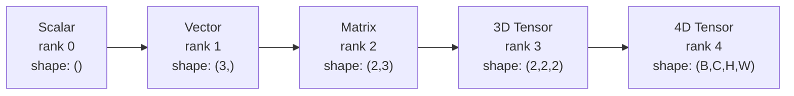
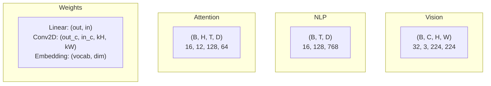
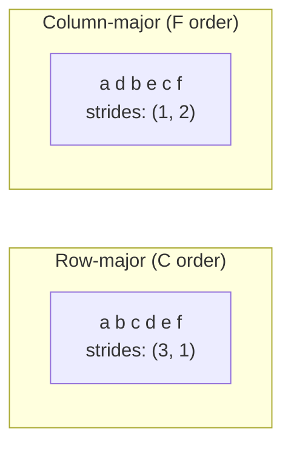
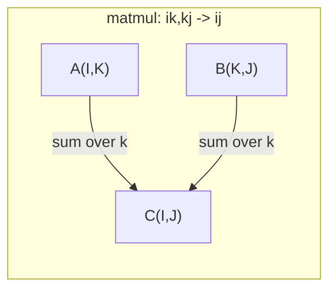

# 度操作

> 子是数据与深度学习之间的通用语言. 每个图像,每一个句子,每一个分数都通过它们流动.

**Type:** Build
**Language:**字符串
**前置要求：**阶段1课程01 (线性代数直观),02 (向量,矩阵和运算)
**Time:** ~90 分钟

## 学习目标
- 从零实现一个子类,支持形状,步骤,重塑,转换和元素智能操作
- 应用广播规则,在不复制数据的情况下对不同形状的电压进行运算
- 为点产品,矩阵乘法,外部产品和批量运算 编写总数表达式
- 追踪多头注意力 每一步的精确的电压形状

## 问题
你建了一个变压器. 往前通行. 看起来很干净.`RuntimeError: mat1 and mat2 shapes cannot be multiplied (32x768 and 512x768)`你想把这些形状转换,现在它提示.`Expected 4D input (got 3D input)`你还有一个不紧的. 还有一些坏的地方.

形状错误是深度学习代码中最常见的错误――它们在概念上并不难--每个操作都有一个形状合同――但会迅速叠加――一个变压器会把几十个重型,转型和播放串联起来――一个轴错了,错了就会级联――更糟糕的是,有些形状错误根本不会抛出错误――它们会沿错误的维度播放,或者在错误的轴上求和,静默产生垃圾结果――

矩阵处理两组事物的成对关系――真实数据不能放进两个维度――一批的32张224x224RGB图像是一个4D色:`(32, 3, 224, 224)`带有12个头的自我注意力也就是4D:`(batch, heads, seq_len, head_dim)`△你需要一种可以扩展到任意维度 数量数据结构,并且其操作可以在所有维度上干净组合.

## 概念
### 子是什么?

数是一个具有统一数据类型的多维数字数组.**rank**(或 **order**每个维度都是一个.**axis**,我知道.**shape**是一个,列出每个轴上大小.



总元素数 = 所有尺寸的乘积――形状`(2, 3, 4)`包含`2 * 3 * 4 = 24`个元素.

### 深度学习中的压形状

根据惯例,不同数据类型会映射到特定的光形状.



火器使用NCHW(频道-第一) ・TensorFlow 默认使用NHWC(频道-最后) ・不匹配的布局会导致静默变慢或报错――

### 记忆布局的运作方式

内存中的2D数组是一段1D字节序列.**Strides**告诉你,在每个轴上,需要跳过多少元素.



转移 不移动数据――它交换步骤,使电压变为**non-contiguous**-- 一行中的元素在内存中不再相邻.

### 广播规则

广播 允许你在不复制数据的情况下,对不同形状的电压器进行运算. 从右侧对齐形状.

```
Tensor A:     (8, 1, 6, 1)
Tensor B:        (7, 1, 5)
Padded B:     (1, 7, 1, 5)
Result:       (8, 7, 6, 5)
```

### 数:通用数操作

爱因斯坦总结 用字母标记每个轴──现在输入,但现在不现在输出 中的轴将被求和──两边都出现的轴将被保留──



关键模式:`i,i->`(点产品)`i,j->ij`(外产品)`ii->`没有什么可做.`ij->ji`转移的时间`bij,bjk->bik`没有什么可做.`bhtd,bhsd->bhts`没有什么可做.


```figure
tensor-broadcast
```

## 构建它
代码位于`code/tensors.py`,每一步都引用其中的实现.

### 步骤1:电压器存储和步骤

子存储一个平面的数字列表以及形状元数据――步骤告诉索引逻辑如何将多维索引映射到平面位置――

```python
class Tensor:
    def __init__(self, data, shape=None):
        if isinstance(data, (list, tuple)):
            self._data, self._shape = self._flatten_nested(data)
        elif isinstance(data, np.ndarray):
            self._data = data.flatten().tolist()
            self._shape = tuple(data.shape)
        else:
            self._data = [data]
            self._shape = ()

        if shape is not None:
            total = reduce(lambda a, b: a * b, shape, 1)
            if total != len(self._data):
                raise ValueError(
                    f"Cannot reshape {len(self._data)} elements into shape {shape}"
                )
            self._shape = tuple(shape)

        self._strides = self._compute_strides(self._shape)

    @staticmethod
    def _compute_strides(shape):
        if len(shape) == 0:
            return ()
        strides = [1] * len(shape)
        for i in range(len(shape) - 2, -1, -1):
            strides[i] = strides[i + 1] * shape[i + 1]
        return tuple(strides)
```

对于形状`(3, 4)`步骤是`(4, 1)`进前一行跳过4个元素,进前一列跳过1个元素.

### 步骤 2:重新塑造,挤压,脱压

换形 改变形状,但不改变元素序列――总元素数必须保持不变――使用`-1`让某个维度自动推断其大小.

```python
t = Tensor(list(range(12)), shape=(2, 6))
r = t.reshape((3, 4))
r = t.reshape((-1, 3))
```

压缩会移除大小为 1 的轴子. 压缩会插入一个. 压缩对广播至关重要.`(D,)`加入到批量`(B, T, D)`上时,需要不挤到`(1, 1, D)`,我知道.

```python
t = Tensor(list(range(6)), shape=(1, 3, 1, 2))
s = t.squeeze()
v = Tensor([1, 2, 3])
u = v.unsqueeze(0)
```

### 第3步:转移和转移

转换两个轴――转换重新排序所有轴――这就是NCHW与NHWC之间转换的方式――

```python
mat = Tensor(list(range(6)), shape=(2, 3))
tr = mat.transpose(0, 1)

t4d = Tensor(list(range(24)), shape=(1, 2, 3, 4))
perm = t4d.permute((0, 2, 3, 1))
```

在PyTorch中,Tensor 在内存中是非连接的.`view`会在非连接的子上失败 -- 使用 `reshape`首先调用`.contiguous()`,我知道.

### 步骤 4: 元素的操作和减小

元素智能的运算将独立应用于每个元素,并保持形状 不变.

```python
a = Tensor([[1, 2], [3, 4]])
b = Tensor([[10, 20], [30, 40]])
c = a + b
d = a * 2
s = a.sum(axis=0)
```

美国CNN中全球平均聚合:`(B, C, H, W).mean(axis=[2, 3])`产生`(B, C)`△NLP 中的序列意味着聚合:`(B, T, D).mean(axis=1)`产生`(B, D)`,我知道.

### 步骤5:使用 NumPy 广播

`tensors.py`中中 `demo_broadcasting_numpy()`功能 展示了核心模式――

```python
activations = np.random.randn(4, 3)
bias = np.array([0.1, 0.2, 0.3])
result = activations + bias

images = np.random.randn(2, 3, 4, 4)
scale = np.array([0.5, 1.0, 1.5]).reshape(1, 3, 1, 1)
result = images * scale

a = np.array([1, 2, 3]).reshape(-1, 1)
b = np.array([10, 20, 30, 40]).reshape(1, -1)
outer = a * b
```

通过广播计算双距离:将`(M, 2)`改造为`(M, 1, 2)`将`(N, 2)`改造为`(1, N, 2)`结果为: 求和取平方根`(M, N)`,我知道.

### 步骤 6: 爱因组操作

`demo_einsum()`和 `demo_einsum_gallery()`函数会逐步展示每种常见模式.

```python
a = np.array([1.0, 2.0, 3.0])
b = np.array([4.0, 5.0, 6.0])
dot = np.einsum("i,i->", a, b)

A = np.array([[1, 2], [3, 4], [5, 6]], dtype=float)
B = np.array([[7, 8, 9], [10, 11, 12]], dtype=float)
matmul = np.einsum("ik,kj->ij", A, B)

batch_A = np.random.randn(4, 3, 5)
batch_B = np.random.randn(4, 5, 2)
batch_mm = np.einsum("bij,bjk->bik", batch_A, batch_B)
```

一个缩减的计算成本是所有指数尺寸的乘积.`bij,bjk->bik`其他:`32 * 128 * 64 * 128 = 33,554,432`乘以加量次

### 步骤 7:通过一数的注意力机制

`demo_attention_einsum()`端到端实现了多头关注.

```python
B, H, T, D = 2, 4, 8, 16
E = H * D

X = np.random.randn(B, T, E)
W_q = np.random.randn(E, E) * 0.02

Q = np.einsum("bte,ek->btk", X, W_q)
Q = Q.reshape(B, T, H, D).transpose(0, 2, 1, 3)

scores = np.einsum("bhtd,bhsd->bhts", Q, K) / np.sqrt(D)
weights = softmax(scores, axis=-1)
attn_output = np.einsum("bhts,bhsd->bhtd", weights, V)

concat = attn_output.transpose(0, 2, 1, 3).reshape(B, T, E)
output = np.einsum("bte,ek->btk", concat, W_o)
```

每一步都是一个力操作:投影(通过 einsum 执行 matmul) 、头分分(重塑 + 转换) 、注意力分数(通过 einsum 执行批量 matmul) 、重量总量(通过 einsum 执行批量 matmul) 、头合并(转换 + 转换) 、输出投影(通过 einsum 执行 matmul) 。

## 使用它
### 与数码

| Operation | Scratch (Tensor class) | NumPy |
|---|---|---|
| Create | `Tensor([[1,2],[3,4]])` | `np.array([[1,2],[3,4]])` |
| Reshape | `t.reshape((3,4))` | `a.reshape(3,4)` |
| Transpose | `t.transpose(0,1)` | `a.T` or `a.transpose(0,1)` |
| Squeeze | `t.squeeze(0)` | `np.squeeze(a, 0)` |
| Sum | `t.sum(axis=0)` | `a.sum(axis=0)` |
| Einsum | N/A | `np.einsum("ij,jk->ik", a, b)` |

### 与皮托尔奇

```python
import torch

t = torch.tensor([[1, 2, 3], [4, 5, 6]], dtype=torch.float32)
t.shape
t.stride()
t.is_contiguous()

t.reshape(3, 2)
t.unsqueeze(0)
t.transpose(0, 1)
t.transpose(0, 1).contiguous()

torch.einsum("ik,kj->ij", A, B)
```

皮托尔奇增加了自动化,GPU支持和优化BLAS内核.

### 每个神经网络层都是一个缩器操作

| Operation | Tensor Form | Einsum |
|---|---|---|
| Linear layer | `Y = X @ W.T + b` | `"bd,od->bo"` + bias |
| Attention QKV | `Q = X @ W_q` | `"btd,dh->bth"` |
| Attention scores | `Q @ K.T / sqrt(d)` | `"bhtd,bhsd->bhts"` |
| Attention output | `softmax(scores) @ V` | `"bhts,bhsd->bhtd"` |
| Batch norm | `(X - mu) / sigma * gamma` | element-wise + broadcast |
| Softmax | `exp(x) / sum(exp(x))` | element-wise + reduction |

## 交付它
本课会产出两个可复制的提示:

1. **`outputs/prompt-tensor-shapes.md`**-- 一个用于调试子形状不匹配的系统化提示──包含每种常见操作的决策表,以及一个修复查找表──

2. **`outputs/prompt-tensor-debugger.md`**-- 一个逐步调试提示,当形状错误 阻塞你时,可以粘贴到任何AI助手中――把错误信息和你的电压形状 提供给它,它会返回精确修复方案――

## 练习
1. **Easy -- Reshape round-trip.**取一个形状为`(2, 3, 4)`升的压力将会改变形态.`(6, 4)`重新塑造为`(24,)`然后再变了`(2, 3, 4)`通过印刷平面数据验证每一步的元素顺序都保留着.

2. **Medium -- Implement broadcasting.**为`Tensor`扩展一个 类`broadcast_to(shape)`方法将大小为1的尺寸扩展到目标形状.`_elementwise_op`操作前自动播放.`(3, 1)`和 `(1, 4)`进行测试,结果应产生`(3, 4)`,我知道.

3. **Hard -- Build einsum from scratch.**实现一个基础`einsum(subscripts, *tensors)`函数,至少支持:dot产品`i,i->`)、矩阵乘以`ij,jk->ik`)、外产品`i,j->ij`) 和转换`ij->ji`)――解析字符串,识别合约指数,并遍历所有指数组合――将你的结果与 `np.einsum`对于比较.

4. **Hard -- Attention shape tracker.**编写一个函数,输入`batch_size`,我知道.`seq_len`,我知道.`embed_dim`和 `num_heads`并打印多头注意力 每一步的精确形状:输入,Q/K/V投影,头分,注意力分数,软最大重量,加权总和,头合并,输出投影.`demo_attention_einsum()`输出 进行验证――

## 关键术语
| Term | What people say | What it actually means |
|---|---|---|
| Tensor | “一个 Matrix，但有更多 dimensions” | 一个具有统一 type 以及已定义 shape、strides 和 operations 的多维数组 |
| Rank | “dimensions 的数量” | axes 的数量。一个 Matrix 的 rank 是 2，而不是等于它的 matrix rank |
| Shape | “Tensor 的大小” | 一个 tuple，列出每个 axis 上的大小。`(2, 3)` 表示 2 行、3 列 |
| Stride | “内存如何排列” | 沿每个 axis 前进一个位置需要跳过的元素数量 |
| Broadcasting | “shapes 不同时它也能直接工作” | 一组严格规则：从右对齐，dimensions 必须相等，或其中一个必须是 1 |
| Contiguous | “Tensor 是正常的” | 元素在内存中按逻辑 layout 顺序连续存储，没有间隙或重排 |
| Einsum | “一种花哨的 matmul 写法” | 一种通用记法，可以用一行表达任意 Tensor contraction、outer product、trace 或 transpose |
| View | “和 reshape 一样” | 一个共享相同 memory buffer，但具有不同 shape/stride metadata 的 Tensor。会在 non-contiguous data 上失败 |
| Contraction | “对某个 index 求和” | Tensor 之间共享的 index 被相乘并求和，从而产生更低 rank 结果的一般 operation |
| NCHW / NHWC | “PyTorch vs TensorFlow format” | image tensors 的 memory layout conventions。NCHW 把 channels 放在 spatial dims 之前，NHWC 把它们放在之后 |

## 延伸阅读
- [NumPy Broadcasting](https://numpy.org/doc/stable/user/basics.broadcasting.html)-- 带有可见示例的规范规则
- [PyTorch Tensor Views](https://pytorch.org/docs/stable/tensor_view.html)如何复制?
- [einops](https://github.com/arogozhnikov/einops)让电压器更好地重新塑造更安全的库
- [The Illustrated Transformer](https://jalammar.github.io/illustrated-transformer/)-- 可视化注意力 中流动的电压形状
- [Einstein Summation in NumPy](https://numpy.org/doc/stable/reference/generated/numpy.einsum.html)-- 带有示例的完整总数文档
