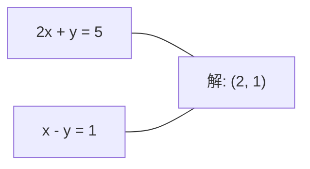
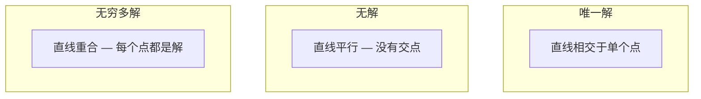

# 线性系统

> 求解 Ax = b 是数学中最古老的问题之一,而它至今仍在运行你的神经网络.

**Type:** Build
**Language:**字符串
**前置要求：**阶段1课程01 (线性代数直观),02 (向量和矩阵),03 (矩阵转变)
**Time:** ~120 minutes

## 学习目标
- 使用带部分旋转和后置的高斯消除求解 Ax = b
- 使用 LU、QR 和 Cholesky 分解矩阵,并解释每种方法适用的场景
- 推导最小方体的正常方程,并将其与线性回归和脊坡回归联系起来
- 使用条件号 诊断不良条件的系统,并应用规范化 使其稳定

## 问题
每次训练线性回归时,你都在寻求解决一个线性系统. 每次计算最小平方的适应时,你都在寻求解决一个线性系统. 每次神经网络层计算.`y = Wx + b`当你加入规律化时,你正在修改这个系统时,你正在分解一个矩阵时,你正在分解一个矩阵时,为马哈拉诺比距离寻求对等矩阵的逆转时,你正在寻求解答一个线性系统时,

方程 Ax = b 无处不在──A 是已知系数构成的矩阵──b 是已知输出构成的矩阵──x 是你想找到的未知量矩阵──在线性归归还中,A 是你的数据矩阵,b 是你的目标矩阵,x 是重量矩阵──整个模型可以归结为:找到x,使 Ax 尽可能接近b──

本课程将从零构建到解方程的所有主要方法. 你会理解为什么有些方法是快速的,而其他方法是更稳定的,为什么有些方法只适用于方形系统,而其他方法可以处理过分的系统,以及为什么矩阵的条件数决定了你的答案是否有意义.

## 概念
### 什么意思在几何上

一个线性方程系统 具有几何解释――每个方程 定义一个超平面――解就是所有超平面 相交的点(或点集) ――

```
2x + y = 5          2D 中的两条直线。
x - y  = 1          它们相交于 x=2, y=1。
```



可能出现三个情况:



在矩阵形式中",一个解决方案"意味着A是可逆的――"没有解决方案"意味着系统是不一致的――"无限解决方案"意味着A有一个零空间――大多数ML问题都属于没有精确解的类别,因为你的方程 ((数据点) 比未知的 ((参数) 更多――这是最小的方体 发挥作用的地方――

### 列图与行图

了解Ax=b的两种方法.

**Row picture.**它们的每个行定义了一个方程. 每个方程都是一个超平面.

**Column picture.**问题变成:A的列的线性组合能产生b?

```
A = | 2  1 |    b = | 5 |
    | 1 -1 |        | 1 |

Row picture: 同时求解 2x + y = 5 和 x - y = 1。

Column picture: 找到 x1, x2，使得：
  x1 * [2, 1] + x2 * [1, -1] = [5, 1]
  2 * [2, 1] + 1 * [1, -1] = [4+1, 2-1] = [5, 1]   check.
```

如果 b 位于 A 的列空间中,系统就有解答.如果 b 不在其中,你就找到列空间中离它最近的点.

### 盖斯的消除

盖斯式消除将Ax = b 转换为上方三角形系统Ux = c,然后使用后置替换求解――这是最直接的方法――

算法:

```
1. 对每一列 k（pivot column）：
   a. 在第 k 行及其下方，找到 column k 中最大的 entry（partial pivoting）。
   b. 将该行与第 k 行交换。
   c. 对 k 下方的每一行 i：
      - 计算 multiplier m = A[i][k] / A[k][k]
      - 从第 i 行中减去 m 倍的第 k 行。
2. Back substitute：从最后一个 equation 向上求解。
```

示例:

```
Original:
| 2  1  1 | 8 |       R2 = R2 - (2)R1     | 2  1   1 |  8 |
| 4  3  3 |20 |  -->  R3 = R3 - (1)R1 --> | 0  1   1 |  4 |
| 2  3  1 |12 |                            | 0  2   0 |  4 |

                       R3 = R3 - (2)R2     | 2  1   1 |  8 |
                                       --> | 0  1   1 |  4 |
                                           | 0  0  -2 | -4 |

Back substitute:
  -2 * x3 = -4    -->  x3 = 2
  x2 + 2  = 4     -->  x2 = 2
  2*x1 + 2 + 2 = 8 --> x1 = 2
```

对于1000x1000系统,这大约是10亿次浮点操作.

### 部分转向:为什么重要

没有旋转,高斯的消除可能失败或产生垃圾结果. 如果旋转元素为零,你会除以零. 如果它很小,你会增加圆形错误.

```
Bad pivot:                       With partial pivoting:
| 0.001  1 | 1.001 |            先交换行：
| 1      1 | 2     |            | 1      1 | 2     |
                                 | 0.001  1 | 1.001 |
m = 1/0.001 = 1000              m = 0.001/1 = 0.001
R2 = R2 - 1000*R1               R2 = R2 - 0.001*R1
| 0.001  1     | 1.001   |      | 1      1     | 2     |
| 0     -999   | -999.0  |      | 0      0.999 | 0.999 |

x2 = 1.000（正确）              x2 = 1.000（正确）
x1 = (1.001 - 1)/0.001          x1 = (2 - 1)/1 = 1.000（正确）
   = 0.001/0.001 = 1.000        稳定，因为 multiplier 很小。
```

在精度有限的浮点算术中,未旋转的版本可能会丢失显著数字.

### 化

LU分解将A 分解为下三角矩阵L 和上三角矩阵U:A = LU──L矩阵存储中的加倍者――高斯消除 U矩阵是消除的结果――

```
A = L @ U

| 2  1  1 |   | 1  0  0 |   | 2  1   1 |
| 4  3  3 | = | 2  1  0 | @ | 0  1   1 |
| 2  3  1 |   | 1  2  1 |   | 0  0  -2 |
```

为什么要是因素而不是直接消除?因为一旦有L和U,针对任意新的b求解 Ax = b只需要O(n^2):

```
Ax = b
LUx = b
令 y = Ux:
  Ly = b    (forward substitution, O(n^2))
  Ux = y    (back substitution, O(n^2))
```

之后每次解决都是O                                                                                                                                                                                                                                                           

使用部分旋转时,你得到PA = LU,其中P是记录行交换的变量矩阵.

### 清理器分解

 QR分解将分解为直角矩阵 Q 和上方三角矩阵 R:A = QR──

直角矩阵具有Q^T Q = I 的性质──它的列是直角向量──乘以Q 会保持长度和角落──

```
A = Q @ R

Q has orthonormal columns: Q^T Q = I
R is upper triangular

To solve Ax = b:
  QRx = b
  Rx = Q^T b    (只需乘以 Q^T，不需要 inversion)
  Back substitute to get x.
```

在求解最小平方数问题时,QR比LU在数值稳定上更好.

```
Given columns a1, a2, ... of A:

q1 = a1 / ||a1||

q2 = a2 - (a2 . q1) * q1        (减去到 q1 上的 projection)
q2 = q2 / ||q2||                (normalize)

q3 = a3 - (a3 . q1) * q1 - (a3 . q2) * q2
q3 = q3 / ||q3||

R[i][j] = qi . aj    for i <= j
```

每一步都会移除所有前Q向量的组件,只留下新的直角方向.

### 乔莱斯基的分解

当A是对称的 (A = A^T) 且正确的 (A = A^T) 时,你可以将其分解为A = L^T,其中L是下方三角形.

```
A = L @ L^T

| 4  2 |   | 2  0 |   | 2  1 |
| 2  5 | = | 1  2 | @ | 0  2 |

L[i][i] = sqrt(A[i][i] - sum(L[i][k]^2 for k < i))
L[i][j] = (A[i][j] - sum(L[i][k]*L[j][k] for k < j)) / L[j][j]    for i > j
```

乔莱斯基比LU快两倍,而且只需要半个储存空间. 它只适用于对称正确的确定矩阵,但这种矩阵经常出现:

- 合变矩阵是对称正面半确的 (通过规范可变为正确的)
- 高斯过程中内核矩阵是对称正确的定义.
- 曲函数在最小处的赫西式是对称正确的定义.
- 总是对称正面半确的.

在高斯过程中,你用Cholesky 分解内核矩阵K,然后求解K alpha = y 来得到预测的含义──Cholesky因子还会给出边际概率的日志确定符:log det(K) = 2 * sum(log(diag(L)))。

### 最小方体:当 Ax = b 没有精确解时

如果 A 是 m x n 且 m > n 方程 多于未知),系统就是过分确定.

```
minimize ||Ax - b||^2

这是 squared residuals 的总和：
  sum((A[i,:] @ x - b[i])^2 for i in range(m))
```

最小化 满足正常方程:

```
A^T A x = A^T b
```

推导:展开A 求 Gradient,并令其为零:2 A 求 A x - 2 A 求 b = 0

```
Original system (overdetermined, 4 equations, 2 unknowns):
| 1  1 |         | 3 |
| 1  2 | x     = | 5 |       没有精确的 x 能满足全部 4 个 equations。
| 1  3 |         | 6 |
| 1  4 |         | 8 |

Normal equations:
A^T A = | 4  10 |    A^T b = | 22 |
        | 10 30 |            | 63 |

Solve: x = [1.5, 1.7]

这就是 linear regression。x[0] 是 intercept，x[1] 是 slope。
```

### 常态方程 =线性回归

在线性回归中,数据矩阵 X 每一行对应一个样本, 每一列对应一个特征 y 每个输入对应一个样本的权重向量 满足:

```
X^T X w = X^T y
w = (X^T X)^(-1) X^T y
```

这是线性回归的闭式解决方案.`sklearn.linear_model.LinearRegression.fit()`通过QR或SVD计算等价结果)

给矩阵添加规则化术语 lambda * I,你就得到了脊回归:

```
(X^T X + lambda * I) w = X^T y
w = (X^T X + lambda * I)^(-1) X^T y
```

调节会让矩阵的条件更好(更容易准确求逆),并通过将重量向零缩小以防止过度合适──当兰布达 > 0 时,矩阵X^T X +兰布达 * I 总是对称正确的,因此可以使用乔尔斯基求解──

### 伪逆 (摩尔-罗斯)

伪逆转 A+ 将矩阵逆转推广到非正方形和单一矩阵.

```
x = A+ b

where A+ = V Sigma+ U^T    (computed via SVD)
```

通过对每个非零单一值 取相互并转置结果构成──如果A = U Sigma V^T,则A+ = V Sigma+ U^T──

```
A = U Sigma V^T        (SVD)

Sigma = | 5  0 |       Sigma+ = | 1/5  0  0 |
        | 0  2 |                | 0  1/2  0 |
        | 0  0 |

A+ = V Sigma+ U^T
```

假逆向 给出最小标准最小平方的解决方案――如果系统有:
- 唯一解:A+b 给出该解.
- 无解:A+b 给出最小平方的解决方案.
- 无穷多解:A+b 给出了 无穷多解 最小的

许多人`np.linalg.lstsq`和 `np.linalg.pinv`内部都使用SVD──

### 条件号码

条件数 测量解决方案对输入的微小变化有多敏感――对矩阵A,条件数是:

```
kappa(A) = ||A|| * ||A^(-1)|| = sigma_max / sigma_min
```

其中,sigma_max 和sigma_min 分别是最大和最小的单数值.

```
Well-conditioned (kappa ~ 1):        Ill-conditioned (kappa ~ 10^15):
b 中的小变化 -->                    b 中的小变化 -->
x 中的小变化                         x 中的巨大变化

| 2  0 |   kappa = 2/1 = 2          | 1   1          |   kappa ~ 10^15
| 0  1 |   safe to solve            | 1   1+10^(-15) |   solution is garbage
```

经验法则:
- 没有什么可做.
- 由于这些问题,我们可以在数学上进行分析.
- 对于 float64):解决方案没有意义――矩阵实际上是单一――

在 ML 中,不良条件 发生在特征 几乎与线程相对的时时――规范化(添加 lambda * I) 将条件号从 sigma_max / sigma_min 改善为 (sigma_max + lambda) / (sigma_min + lambda) ⋅

### 复制方法:结合梯度

对于非常大的稀疏系统 (数百万未知的),LU或Cholesky这样的直接方法 成本过高.

结合梯度 (CG) 在 A 是对称正确的定义时求解 Ax = b。它在精确算法中最多 n 次代找到精确解,但如果 A 的本值聚集,通常会更快收。

```
Algorithm sketch:
  x0 = initial guess (often zero)
  r0 = b - A x0           (residual)
  p0 = r0                 (search direction)

  For k = 0, 1, 2, ...:
    alpha = (rk . rk) / (pk . A pk)
    x_{k+1} = xk + alpha * pk
    r_{k+1} = rk - alpha * A pk
    beta = (r_{k+1} . r_{k+1}) / (rk . rk)
    p_{k+1} = r_{k+1} + beta * pk
    if ||r_{k+1}|| < tolerance: stop
```

 CG 用于:
- 大规模优化 (Newton-CG方法)
- 求解 PDE 分
- 核心方法,其中的核心矩阵太大无法因素
- 作为其他反复解决器的预先条件

变化率取决于条件数量.

### 完整的图片:何时使用哪种方法

| Method | Requirements | Cost | Use case |
|--------|-------------|------|----------|
| Gaussian elimination | Square, nonsingular A | O(n^3) | 对 square system 的一次性求解 |
| LU decomposition | Square, nonsingular A | O(n^3) factor + O(n^2) solve | 使用相同 A 的多次求解 |
| QR decomposition | Any A (m >= n) | O(mn^2) | Least squares，numerically stable |
| Cholesky | Symmetric positive definite A | O(n^3/3) | Covariance matrices，Gaussian processes，ridge regression |
| Normal equations | Overdetermined (m > n) | O(mn^2 + n^3) | Linear regression（小 n） |
| SVD / pseudoinverse | Any A | O(mn^2) | Rank-deficient systems，minimum-norm solutions |
| Conjugate gradient | Symmetric positive definite, sparse A | O(n * k * nnz) | Large sparse systems，k = iterations |

### 与 ML 连接

本课程中的每种方法都出现在生产级 ML 中:

**Linear regression.**求解正常方程 X^T X w = X^T y。这可以通过Cholesky 若 n 很小) 、QR 若数稳定 很重要) 或 SVD 若矩阵可能是缺陷的) 完成──

**Ridge regression.**向 X^T X 添加 lambda * I。规律化系统 (X^T X + lambda * I) w = X^T y 总是可以通过Cholesky 求解,因为当 lambda > 0 时,X^T X + lambda * I 是对称正确的定义──

**Gaussian processes.**预测平均值需要求解 K alpha = y,其中 K 是内核矩阵──对 K 做了乔莱斯基因数是标准方法── 逻辑边际概率 使用 log det(K) = 2 个总数(log(diag(L)))。

**Neural network initialization.**基于线程的初始化使用QR分解 创建列为线程的重量矩阵――这可以防止深度网络中信号崩――

**Preconditioning.**大规模优化器 使用不完整的Cholesky 或不完整的 LU 作为结合梯度溶解器的先决条件──

**Feature engineering.** X^T X 的条件数 告诉你是否有线性. 如果卡帕很大,删除功能或添加规律化.


```figure
linear-system-conditioning
```

## 构建它
### 步骤1: 部分旋转的高斯式消除

```python
import numpy as np

def gaussian_elimination(A, b):
    n = len(b)
    Ab = np.hstack([A.astype(float), b.reshape(-1, 1).astype(float)])

    for k in range(n):
        max_row = k + np.argmax(np.abs(Ab[k:, k]))
        Ab[[k, max_row]] = Ab[[max_row, k]]

        if abs(Ab[k, k]) < 1e-12:
            raise ValueError(f"Matrix is singular or nearly singular at pivot {k}")

        for i in range(k + 1, n):
            m = Ab[i, k] / Ab[k, k]
            Ab[i, k:] -= m * Ab[k, k:]

    x = np.zeros(n)
    for i in range(n - 1, -1, -1):
        x[i] = (Ab[i, -1] - Ab[i, i+1:n] @ x[i+1:n]) / Ab[i, i]

    return x
```

### 步骤 2: LU分解

```python
def lu_decompose(A):
    n = A.shape[0]
    L = np.eye(n)
    U = A.astype(float).copy()
    P = np.eye(n)

    for k in range(n):
        max_row = k + np.argmax(np.abs(U[k:, k]))
        if max_row != k:
            U[[k, max_row]] = U[[max_row, k]]
            P[[k, max_row]] = P[[max_row, k]]
            if k > 0:
                L[[k, max_row], :k] = L[[max_row, k], :k]

        for i in range(k + 1, n):
            L[i, k] = U[i, k] / U[k, k]
            U[i, k:] -= L[i, k] * U[k, k:]

    return P, L, U

def lu_solve(P, L, U, b):
    n = len(b)
    Pb = P @ b.astype(float)

    y = np.zeros(n)
    for i in range(n):
        y[i] = Pb[i] - L[i, :i] @ y[:i]

    x = np.zeros(n)
    for i in range(n - 1, -1, -1):
        x[i] = (y[i] - U[i, i+1:] @ x[i+1:]) / U[i, i]

    return x
```

### 步骤3: 乔莱斯基的分解

```python
def cholesky(A):
    n = A.shape[0]
    L = np.zeros_like(A, dtype=float)

    for i in range(n):
        for j in range(i + 1):
            s = A[i, j] - L[i, :j] @ L[j, :j]
            if i == j:
                if s <= 0:
                    raise ValueError("Matrix is not positive definite")
                L[i, j] = np.sqrt(s)
            else:
                L[i, j] = s / L[j, j]

    return L
```

### 步骤 4:通过正常方程的最小方体

```python
def least_squares_normal(A, b):
    AtA = A.T @ A
    Atb = A.T @ b
    return gaussian_elimination(AtA, Atb)

def ridge_regression(A, b, lam):
    n = A.shape[1]
    AtA = A.T @ A + lam * np.eye(n)
    Atb = A.T @ b
    L = cholesky(AtA)
    y = np.zeros(n)
    for i in range(n):
        y[i] = (Atb[i] - L[i, :i] @ y[:i]) / L[i, i]
    x = np.zeros(n)
    for i in range(n - 1, -1, -1):
        x[i] = (y[i] - L.T[i, i+1:] @ x[i+1:]) / L.T[i, i]
    return x
```

### 步骤5:条件号码

```python
def condition_number(A):
    U, S, Vt = np.linalg.svd(A)
    return S[0] / S[-1]
```

## 使用它
将这些部分组合起来,在真实数据上进行线性回归和脊坡回归:

```python
np.random.seed(42)
X_raw = np.random.randn(100, 3)
w_true = np.array([2.0, -1.0, 0.5])
y = X_raw @ w_true + np.random.randn(100) * 0.1

X = np.column_stack([np.ones(100), X_raw])

w_ols = least_squares_normal(X, y)
print(f"OLS weights (ours):    {w_ols}")

w_np = np.linalg.lstsq(X, y, rcond=None)[0]
print(f"OLS weights (numpy):   {w_np}")
print(f"Max difference: {np.max(np.abs(w_ols - w_np)):.2e}")

w_ridge = ridge_regression(X, y, lam=1.0)
print(f"Ridge weights (ours):  {w_ridge}")

from sklearn.linear_model import Ridge
ridge_sk = Ridge(alpha=1.0, fit_intercept=False)
ridge_sk.fit(X, y)
print(f"Ridge weights (sklearn): {ridge_sk.coef_}")
```

## 交付它
本课产出:
- `code/linear_systems.py`包含从零实现的高斯消除,LU分解,Cholesky分解,最小方体和脊回归
- 一个可运行的演示,展示正常方程和 sklearn 的线性回归 产生相同的重量

## 练习
1. 用你的高斯式消除,用你的 LU 溶剂和`np.linalg.solve`求解系统`[[1,2,3],[4,5,6],[7,8,10]] x = [6, 15, 27]`△验证三者在浮点宽容内给出相同的答案──

2. 生成一个50x5随机矩阵 X 和目标 y = X @ w_true + noise──分别使用正常方程、QR(通过 `np.linalg.qr`通过SVD`np.linalg.svd`) 和 `np.linalg.lstsq`求解 w―比较四个解决方案――测量X^T X的条件数,并解释它如何影响你的信任哪种方法――

3. 通过让两列几乎相同来创建一个几乎单一的矩阵 (例如,列2 =列1 + 1e-10 *噪音) ⋅计算它的条件数――分别在有规律化和没有规律化的情况下求解 Ax = b(添加 0.01 * I) ・比较解决方案和残余物――解释为什么规律化有帮助――

4. 为一个100x100随机对称正确矩阵实现结合梯度算法――统计它收到耐受性1e-8需要多少次代――与n代的理论最大值进行比较――

5. 在大小为10、50、200、500的对称正确矩阵上,对你的乔莱斯基溶解器,你的LU溶解器和`np.linalg.solve`计时――绘制结果――验证 乔莱斯基大约比卢快2倍――

## 关键术语
| Term | What people say | What it actually means |
|------|----------------|----------------------|
| Linear system | "Solve for x" | 一组 linear equations Ax = b。找到 x 意味着找到在 transformation A 下产生 output b 的 input。 |
| Gaussian elimination | "Row reduce" | 使用 row operations 系统性地将 diagonal 下方的 entries 置零，产生可通过 back substitution 求解的 upper triangular system。O(n^3)。 |
| Partial pivoting | "Swap rows for stability" | 在 column k 中进行 elimination 前，将该 column 中 absolute value 最大的行交换到 pivot 位置。防止除以很小的数。 |
| LU decomposition | "Factor into triangles" | 写成 A = LU，其中 L 是 lower triangular（存储 multipliers），U 是 upper triangular（eliminated matrix）。将 O(n^3) 成本摊销到多次求解中。 |
| QR decomposition | "Orthogonal factorization" | 写成 A = QR，其中 Q 的 columns 是 orthonormal，R 是 upper triangular。对于 least squares，比 LU 更稳定。 |
| Cholesky decomposition | "Square root of a matrix" | 对 symmetric positive definite A，写成 A = LL^T。成本是 LU 的一半。用于 covariance matrices、kernel matrices 和 ridge regression。 |
| Least squares | "Best fit when exact is impossible" | 当 system overdetermined（equations 多于 unknowns）时，最小化 squared residuals 的总和 ||Ax - b||^2。 |
| Normal equations | "The calculus shortcut" | A^T A x = A^T b。将 ||Ax - b||^2 的 Gradient 设为零。这就是 linear regression 的 closed-form solution。 |
| Pseudoinverse | "Inversion for non-square matrices" | A+ = V Sigma+ U^T via SVD。对于任意 Matrix，无论 square 或 rectangular、singular 与否，给出 minimum-norm least-squares solution。 |
| Condition number | "How trustworthy is this answer" | kappa = sigma_max / sigma_min。衡量对 input perturbations 的敏感性。大约损失 log10(kappa) 位精度。 |
| Ridge regression | "Regularized least squares" | 求解 (X^T X + lambda I) w = X^T y。添加 lambda I 改善 conditioning，并将 weights 向零收缩。防止 overfitting。 |
| Conjugate gradient | "Iterative Ax=b for big matrices" | 用于 symmetric positive definite systems 的 iterative solver。最多 n 步收敛。适合 factorization 成本过高的大型 sparse systems。 |
| Overdetermined system | "More data than parameters" | 在 m-by-n system 中 m > n。不存在精确解。Least squares 找到最佳近似。这就是每个 regression problem。 |
| Back substitution | "Solve from the bottom up" | 给定 upper triangular system，先求解最后一个 equation，然后向后 substitute。O(n^2)。 |
| Forward substitution | "Solve from the top down" | 给定 lower triangular system，先求解第一个 equation，然后向前 substitute。O(n^2)。用于 LU solves 中的 L step。 |

## 延伸阅读
- [MIT 18.06: Linear Algebra](https://ocw.mit.edu/courses/18-06-linear-algebra-spring-2010/)关于线性系统和矩阵因数化的权威课程
- [Numerical Linear Algebra](https://people.maths.ox.ac.uk/trefethen/text.html)了解数值稳定性,条件化以及算法为什么失败标准参考
- [Matrix Computations](https://www.cs.cornell.edu/cv/GolubVanLoan4/golubandvanloan.htm)包含各种矩阵算法的百科式参考
- [3Blue1Brown: Inverse Matrices](https://www.3blue1brown.com/lessons/inverse-matrices)-- 对求解 Ax = b 几何意义的可视化直觉
