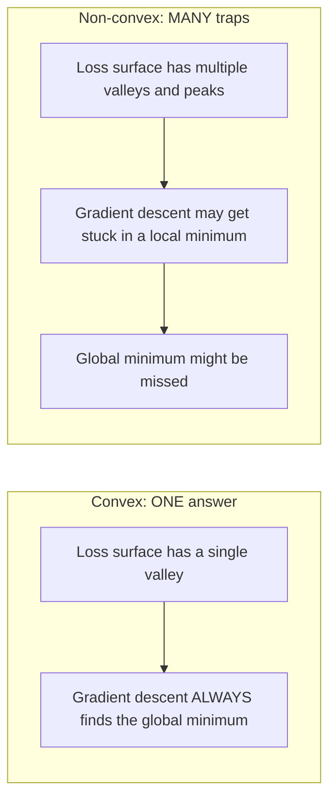
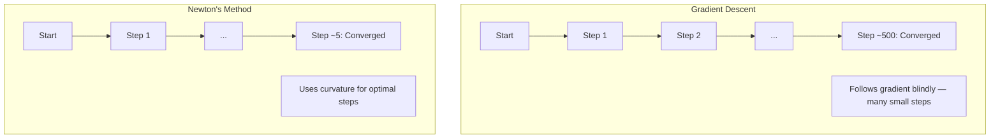
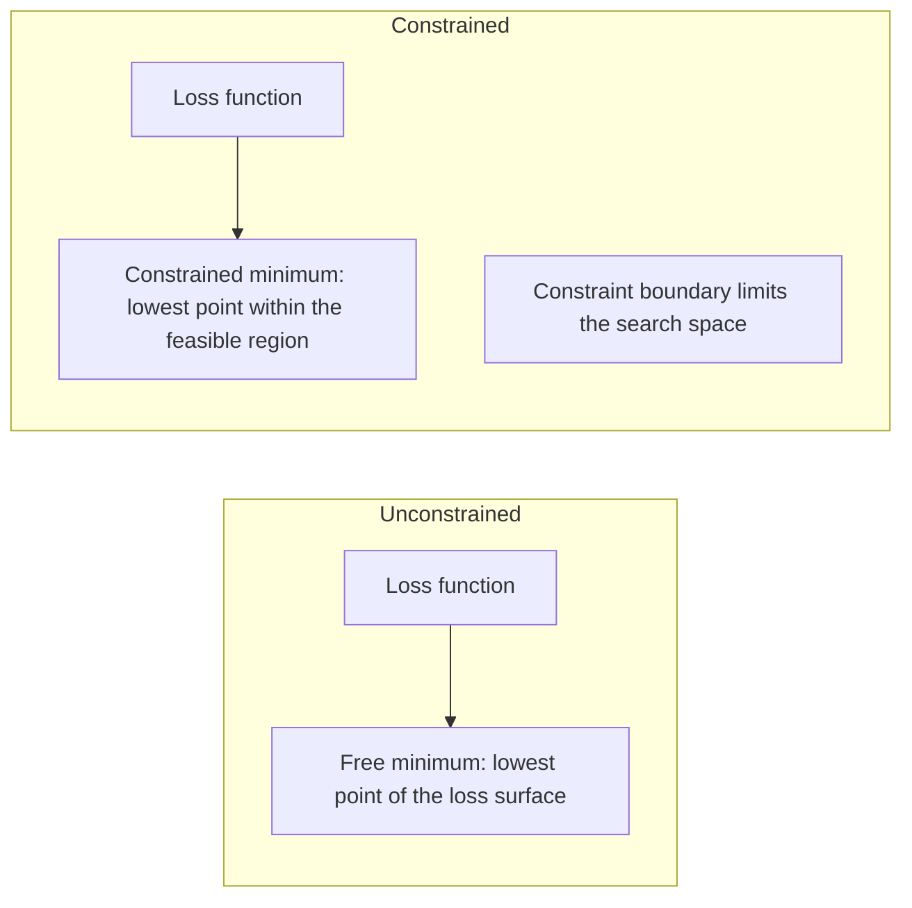
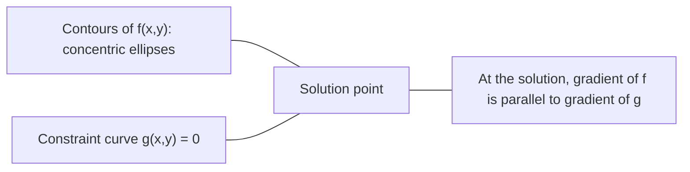

# 凸优化

> 凸问题只有一个谷底. 神经网络有数百万个.

**类型：**构建
**语言：**字符串
**前置要求：**阶段 1,课程04 (ML计算) 、08 (优化)
**时间：**约90分钟

## 学习目标

- 使用定义、二阶导数和赫西安 判据测试一个函数是否为凸函数
- 实现牛顿的方法,并将其二次收速度与渐进下降进行比较
- 使用缩乘法 求解带约束的优化问题,并解释KKT条件
- 解释为什么神经网络损失景观是非凸显的,但SGD仍然能找到好的解决方案

## 问题

课8 教你过你渐进下降,momentum 和 Adam──这些优化器可以在任何表面上向下移动──但它们没有保证──渐进下降在非凸色景观上可能落入糟糕的局部最小值,卡在车点,或者永远振荡──你仍然使用它,因为神经网络是非凸色的,而且没有替代方案──

但是,ML中许多问题是凸的――线性回归"",逻辑回归"",SVMs"",LASSO"",条回归――对于这些问题,有更强大的工具:带有数学保证的优化――凸的问题只有一个谷底――任何向下走的算法都会达到全局最小值――不需要重新启动――不需要学习率调度――不需要祈祷――

了解凸性有三点价值. 第一,它告诉你问题什么时候是简单的,什么时候是困难的. 第二,它为凸问题提供更快的工具,比如牛顿的方法. 第三,它解释了ML中出现的概念:规范化作为束,SVM中二元性,以及为什么深度学习在违反凸性提供的一切优质性中仍然可以工作.

## 概念

### 凸集

如果对集合 S 中任意两个点,它们之间的线段也完全位于 S 中,则集合 S 是凸集.

| 凸集 | 非凸 |
|---|---|
| **矩形**：内部任意两点都可以用一条仍在内部的线段连接 | **星形/月牙形**：两个内部点之间的线段可能穿过集合外部 |
| **三角形**：对所有内部点都满足相同性质 | **甜甜圈/环形**：中间的孔意味着某些线段会离开集合 |
| 任意两点之间的线段都留在集合内 | 某些点对之间的线段会离开集合 |

形式化测试:对于 S 中任意点 x、y,以及任意t 在 [0, 1],点 tx + (1-t) y 也在 S 中。

凸集示例:
- 一条直线 一平面 一整条R^n
- 一个球 (圆球体)
- 一个半空间: {x: a^T x <= b}
- 任意数量凸集的交交集

非凸集示例:
- 一个甜甜圈
- 两个不相交的并集
- 任何带有陷或洞的集合

### 凸函数

如果函数 f 的定义域是凸集,并且对于其定义域中的任意两点 x、y,以及任意 t 在 [0, 1]:

```
f(tx + (1-t)y) <= t*f(x) + (1-t)*f(y)
```

几何上看:图像上任意两点之间的线段位于图像上或图像上.

| 属性 | 凸函数 | 非凸函数 |
|---|---|---|
| **线段测试** | 图像上任意两点之间的线段位于曲线**之上或之上** | 图像上某些点之间的线段会下探到曲线**之下** |
| **形状** | 单个向上弯曲的碗/谷底 | 多个峰和谷，曲率混合 |
| **局部最小值** | 每个局部最小值都是全局最小值 | 可能存在多个高度不同的局部最小值 |

常见凸函数:
- 抛物线 (抛物线)
- 没有什么值
-  () =  ()
- 虽然是分段线性的)
- 对于 x > 0 负对数)
- 任意线性函数 f(x) = a^T x + b(既凸又)

### 测试凸性

试验从最容易到最严谨.

**测试 1：二阶导数测试（1D）。**如果对所有x都有f'(x) >=0,则f是凸函数.

- 子子子子子子子子子子子子子子子子子子子子子子子子子子子子子子子子子子子子子子子子子子子子子子子子子子子子子子子子子子子子子子子子子子子子子子子子子子子子子子子子子子子子子子子子子子子子子子子子子子子子子子子子子子子子子子子子子子子子子子子子子子子子子子子子子子子子子子子子子子
-  () = x^3:f' () = 6x。x < 0 时为负──非凸──
-  () =  () =  () =  () =  () =  () =  () =  () =  () =  () =  () =  () =  () =  () =  () =  () =  () =  () =  () =  () =  () =  ()

**测试 2：Hessian 测试（多变量）。**如果Hessian矩阵H(x) 对所有x都是正的半定义,则f是凸函数――Hessian是二阶偏导数组成的矩阵――

**测试 3：定义测试。**直接检查不等式 f(tx + (1-t) y) <= t*f(x) + (1-t) *f(y) 』适用于导数难以计算的函数──

### 为什么重要

凸优化的核心定理:

**对于凸函数，每个局部最小值都是全局最小值。**

这意味着渐进下降不会被困困.任何向下的路径都会通向同一个答案.



结果:
- 不需要随时重启
- 不需要复杂的学习率调度
- 可以证明收性 (速度取决于函数性质)
- 解是唯一的 (除平坦区域外)

### 和非的 ML 中

| 问题 | 凸？ | 原因 |
|---------|---------|-----|
| Linear regression (MSE) | 是 | Loss 关于权重是二次的 |
| Logistic regression | 是 | Log-loss 关于权重是凸的 |
| SVM (hinge loss) | 是 | 线性函数的最大值 |
| LASSO (L1 regression) | 是 | 凸函数之和是凸的 |
| Ridge regression (L2) | 是 | 二次 + 二次 = 凸 |
| Neural Network（任意 Loss） | 否 | 非线性 activations 会产生非凸 landscape |
| k-means clustering | 否 | 离散分配步骤 |
| Matrix factorization | 否 | 未知量的乘积 |

带有凸变的线性模型是凸变的. 一旦加入带有非线性激活的隐藏层,凸变就会被破坏.

### 赫西亚矩阵

函数 f: R^n -> R 的Hessian H 是由二阶偏导数组成的 n x n矩阵──

```
H[i][j] = d^2 f / (dx_i dx_j)
```

对于f ((x,y) =x^2 +3xy + y^2:

```
df/dx = 2x + 3y       d^2f/dx^2 = 2      d^2f/dxdy = 3
df/dy = 3x + 2y       d^2f/dydx = 3      d^2f/dy^2 = 2

H = [ 2  3 ]
    [ 3  2 ]
```

赫西安 告诉你曲率信息:
- 函数在每个方向上都向上曲 (在该点凸)
- 自身值 全为负:在每个方向上都向下曲 (,局部最大值)
- 符号混合:车点(某些方向上曲,其他方向向下曲)
- 零自值:该方向上是平坦的(退化)

对于凸性,Hessian 必须在所有位置都是正面半确的,所有自值 >= 0),而不仅仅在某个点.

### 牛顿的方法

渐进式下降 使用一阶段信息(渐进式) ――牛顿方法 使用二阶段信息(赫西安式) ――它在当前点拟合一次近似,然后直接跳到该二次函数的最小值──

```
Update rule:
  x_new = x - H^(-1) * gradient

Compare to gradient descent:
  x_new = x - lr * gradient
```

根据局部曲率自动调整步长和方向.



优点:
- 接近最小值时二次收(每一步差距平方级下降)
- 不需要调学习率
- 尺度不变 (不管你如何参数化问题都能工作)

缺点:
- 计算 需要 O                                                                                                                                                                                                                                                             
- 对于一个重量100万的神经网络,这意味着1012条条和1018次操作.
- 对深度学习不实用

### 约束优化

无约束优化:在所有 x 上最小化 f(x) ⋅
约束优化:在约束条件下最小化 f ((x) ⋅

现实问题有限制. 你想最小化成本,但预算有限.



### 缩乘法

拉格兰奇乘法 方法把束问题转换为无束问题.

问题:在g(x) = 0 的约束下最小化 f(x)。

解法:引入一个新变量 (Lagrange乘法 lambda),并求解无约束问题:

```
L(x, lambda) = f(x) + lambda * g(x)
```

在解处,L 的渐进为零:

```
dL/dx = df/dx + lambda * dg/dx = 0
dL/dlambda = g(x) = 0
```

几何直觉:在束中最小值处,f 的梯度必须与束 g 的梯度平行相等.如果它们不平行,你可以沿束曲面移动,并进一步降低f.



示例:在 x + y = 1 的约束下最小化 f(x,y) = x^2 + y^2。

```
L = x^2 + y^2 + lambda(x + y - 1)

dL/dx = 2x + lambda = 0  =>  x = -lambda/2
dL/dy = 2y + lambda = 0  =>  y = -lambda/2
dL/dlambda = x + y - 1 = 0

From first two: x = y
Substituting: 2x = 1, so x = y = 0.5, lambda = -1
```

直线 x + y = 1 上距离原点最近的点是 (0.5,0.5) 

### 卡卡特条件

卡鲁什-库恩-图克条件将拉格兰奇乘法扩展到不等式约束.

问题:在g_i(x) <= 0,i = 1, ..., m 的约束下最小化 f(x) 』

 KKT条件:

```
1. Stationarity:    df/dx + sum(lambda_i * dg_i/dx) = 0
2. Primal feasibility:  g_i(x) <= 0  for all i
3. Dual feasibility:    lambda_i >= 0  for all i
4. Complementary slackness:  lambda_i * g_i(x) = 0  for all i
```

补充性惰是关键洞见:约束要么是活跃的(g_i = 0,解位于边界上),要么是乘以为零(该约束不起作用) ――不影响解约束有 lambda = 0。

 KKT条件是SVM的核心──支持向量是约束的数据点的数据点──lambda > 0)──所有其他数据点的 lambda = 0,不影响决策边界──

### 规范化 作为约束优化

它们是伪装成无束形式的束优化问题.

**L2 regularization (Ridge)：**

```
minimize  Loss(w)  subject to  ||w||^2 <= t

Equivalent unconstrained form:
minimize  Loss(w) + lambda * ||w||^2
```

约束时时时时时时时时时时时时时时时时时时时时时时时时时时时时时时时时时时时时时时时时时时时时时时时时时时时时时时时时时时时时时时时时时时时时时时时时时时时时时时时时时时时时时时时时时时时时时时时时时时时时时时时时时时时时时时时时时时时时时时时时时时时时时时时时时时时时时时时时时时时时时时时时时时时时时时时时时时时时时时时时时时时时时时时时时时时时时时时时时时时时时时时时时时时时时时时时时时时时时时时时时时时时时时时时时时时时时时时时时时时时时时时时时时时时时时时时时时时时时时时时时时时时时时时时时时时时时时时时时时时时时时时时时时时时时时时时时时时时时时时时时时时时时时时时时时时时时时时时时时时时时时时时时时时时时时时时时时时时时时时时时时时时时时时时时时时时时时时时时时时时时时时时时时时时时时时时时时时时时时时时时时时时时时时时时时时时时时时时时时时时时时时时时时时时时时时时时时时时时时时时时时时时时时时时时时时时时时时时时时时时时时时时时时时时时时时时时时时时时时时时时时时时时时时时时时时时时时时时时时时时时时时时时时时时时时时时时时时时时时时时时时时时时时时时时时时时时时时时时时时时时时时时时时时

**L1 regularization (LASSO)：**

```
minimize  Loss(w)  subject to  ||w||_1 <= t

Equivalent unconstrained form:
minimize  Loss(w) + lambda * ||w||_1
```

约束的东西在一个 形状的形状

| 属性 | L2 约束（圆） | L1 约束（菱形） |
|---|---|---|
| **约束形状** | 圆（更高维中是球面） | 菱形（2D 中旋转的正方形） |
| **Loss 等高线接触的位置** | 光滑边界：圆上的任意点 | 角点：与某个轴对齐 |
| **解的行为** | 权重较小但非零 | 某些权重恰好为零（稀疏） |
| **结果** | 权重收缩 | 特征选择 |

这解释了为什么L1会产生稀疏模型 (特征选择),而L2只是缩小权重.

### 两性

每个约束优化问题 () 都有一个伴随问题 () 双.对于凸问题,和双具有相同的优化值.

拉格兰基双函数:

```
Primal: minimize f(x) subject to g(x) <= 0
Lagrangian: L(x, lambda) = f(x) + lambda * g(x)
Dual function: d(lambda) = min_x L(x, lambda)
Dual problem: maximize d(lambda) subject to lambda >= 0
```

为什么二元性很重要:
- 双重问题 有时比原始更容易解决
- 问题依赖数据点之间的点产品 (从而启动内核技巧)
- 提供原始最佳的下界,可用于检查解的质量

具体到SVMs:

```
Primal: find w, b that maximize the margin 2/||w|| subject to
        y_i(w^T x_i + b) >= 1 for all i

Dual:   maximize sum(alpha_i) - 0.5 * sum_ij(alpha_i * alpha_j * y_i * y_j * x_i^T x_j)
        subject to alpha_i >= 0 and sum(alpha_i * y_i) = 0

The dual only involves dot products x_i^T x_j.
Replace x_i^T x_j with K(x_i, x_j) to get the kernel trick.
```

### 为什么深度学习仍然可以工作

根据每一种经典标准,优化它们都应该失败.

**大多数局部最小值已经足够好。**在高维空间中,随机关键点 (随机关键点) 是杆点,而不是局部最小值.

**真正的障碍是 saddle points，而不是局部最小值。**在一个有 n 个参数的函数中,车点同时具有正曲率和负曲率方向──对于高维中的随机关键点,所有 n 个自值值都为正的 (局部最小值) 的概率大约是 2^(-n) ⋅几乎所有关键点都是车点──SGD的噪音帮助逃离它们──

**Overparameterization 会平滑 landscape。**参数数量多于训练样本的网络具有更平滑的,更连接的损失表面.

**Loss landscape 结构：**

| 属性 | 低维空间 | 高维空间 |
|---|---|---|
| **Landscape** | 许多孤立的峰和谷 | 平滑连通的谷 |
| **最小值** | 许多孤立局部最小值 | 很少有糟糕局部最小值；大多数接近最优 |
| **导航** | 难以找到全局最小值 | 许多路径通向好的解 |
| **Critical points** | 局部最小值和 saddle points 混合 | 压倒性地是 saddle points，而非局部最小值 |

**随机噪声充当隐式 regularization。**微批次SGD 引入噪音,防止落入急极的最小量――急极的最小量 容易过适应;平坦的最小量 泛化更好――噪音将优化偏向损失景观的平坦区域――

### 实践中的二阶方法

纯牛顿的方法对大模型不实用.

**L-BFGS (Limited-memory BFGS)：**使用最近的 m 个 个 差分近似逆赫西亚语──需要 O   内存,而不是 O  n ^ 2)──适用于最多约 10,000 个参数问题──用于经典的 ML 逻辑回归、CRF,但不用于深度学习──

**Natural gradient：**使用费舍尔信息矩阵 (Fisher Information Matrix) 作为Hessian 标准而不是Hessian 标准.

**Hessian-free optimization：**使用结合梯度 求解 Hx = g,而不显然形成 H――只需要Hessian-vector产品,这可以通过自动差异化在 O  时间内计算――

**Diagonal approximations：**亚当的第二个时刻是赫西亚对角线的对角近似.

| 方法 | 内存 | 每步成本 | 何时使用 |
|--------|--------|--------------|-------------|
| Gradient Descent | O(n) | O(n) | Baseline，大模型 |
| Newton's method | O(n^2) | O(n^3) | 小型凸问题 |
| L-BFGS | O(mn) | O(mn) | 中型凸问题 |
| Adam | O(n) | O(n) | Deep Learning 默认选择 |
| K-FAC | O(n) | 每层 O(n) | 研究、大 batch training |


```figure
convex-vs-nonconvex
```

## 构建它

### 步骤1:凸性检查器

构建一个函数,通过采样点并检查定义来经验性测试凸性.

```python
import random
import math

def check_convexity(f, dim, bounds=(-5, 5), samples=1000):
    violations = 0
    for _ in range(samples):
        x = [random.uniform(*bounds) for _ in range(dim)]
        y = [random.uniform(*bounds) for _ in range(dim)]
        t = random.uniform(0, 1)
        mid = [t * xi + (1 - t) * yi for xi, yi in zip(x, y)]
        lhs = f(mid)
        rhs = t * f(x) + (1 - t) * f(y)
        if lhs > rhs + 1e-10:
            violations += 1
    return violations == 0, violations
```

### 步骤2:用于2D的牛顿方法

使用显式赫西式实现牛顿的方法.

```python
def newtons_method(f, grad_f, hessian_f, x0, steps=50, tol=1e-12):
    x = list(x0)
    history = [x[:]]
    for _ in range(steps):
        g = grad_f(x)
        H = hessian_f(x)
        det = H[0][0] * H[1][1] - H[0][1] * H[1][0]
        if abs(det) < 1e-15:
            break
        H_inv = [
            [H[1][1] / det, -H[0][1] / det],
            [-H[1][0] / det, H[0][0] / det],
        ]
        dx = [
            H_inv[0][0] * g[0] + H_inv[0][1] * g[1],
            H_inv[1][0] * g[0] + H_inv[1][1] * g[1],
        ]
        x = [x[0] - dx[0], x[1] - dx[1]]
        history.append(x[:])
        if sum(gi ** 2 for gi in g) < tol:
            break
    return history
```

### 步骤3: 宽乘法 求解器

通过在拉格兰基上执行渐进下降来求解约束优化.

```python
def lagrange_solve(f_grad, g_val, g_grad, x0, lr=0.01,
                   lr_lambda=0.01, steps=5000):
    x = list(x0)
    lam = 0.0
    history = []
    for _ in range(steps):
        fg = f_grad(x)
        gv = g_val(x)
        gg = g_grad(x)
        x = [
            xi - lr * (fgi + lam * ggi)
            for xi, fgi, ggi in zip(x, fg, gg)
        ]
        lam = lam + lr_lambda * gv
        history.append((x[:], lam, gv))
    return history
```

### 步骤 4:比较一阶段与二阶段

在同一二次函数上运行渐进下降和牛顿的方法――统计收收取所需步数――

```python
def quadratic(x):
    return 5 * x[0] ** 2 + x[1] ** 2

def quadratic_grad(x):
    return [10 * x[0], 2 * x[1]]

def quadratic_hessian(x):
    return [[10, 0], [0, 2]]
```

牛顿的方法会在1步内收 (它对二次函数是精确的) .渐进下降会需要数百步,因为赫西安的本值相差5倍,形成了一个长长的谷.

## 使用它

在选择ML模型和解决器时,凸性分析可以直接应用.

对于凸问题:
- 使用专用解决器 ((liblinear、CVXPY、scipy.optimize.minimize with method='L-BFGS-B')
- 预期得到唯一的全局解
- 二阶段方法实用且快速

对于非凸问题:
- 使用一阶方法(SGD、Adam)
- 接受解依赖初始化和随机性
- 使用过度参数化,噪音和学习率调度作为隐式规范化
- 不要浪费时间寻找全局最小值.

```python
from scipy.optimize import minimize

result = minimize(
    fun=lambda w: sum((y - X @ w) ** 2) + 0.1 * sum(w ** 2),
    x0=np.zeros(d),
    method='L-BFGS-B',
    jac=lambda w: -2 * X.T @ (y - X @ w) + 0.2 * w,
)
```

对于SVM,双重配方,让你使用内核技巧:

```python
from sklearn.svm import SVC

svm = SVC(kernel='rbf', C=1.0)
svm.fit(X_train, y_train)
print(f"Support vectors: {svm.n_support_}")
```

## 练习

1. **凸性画廊。**使用检查器测试这些函数的凸性:f(x) = x^4、f(x) = sin(x)、f(x,y) = x^2 + y^2、f(x,y) = x*y、f(x) = max(x,0) ⋅解释为什么每个结果都是合理的。

2. **Newton vs Gradient Descent 竞赛。**从起点 (10, 10) 出发,在f(x,y) = 50*x^2 + y^2 上运行两种方法──每种方法需要多少步才能达到损失 < 1e-10?当条件数(最大的赫西安本值与最小的赫西安本值的比值) 增加时,渐进下降会发生什么?

3. **Lagrange multiplier 几何。**在约束 x + 2y = 4 下最小化 f(x,y) = (x-3)^2 + (y-3)^2──通过检查解处 f 的梯度与 g 的梯度平行来验证解──

4. **Regularization 约束。**实现L1限制优化:在 \ x 进 \ y 进 \ = 1 的约束下最小化 (x-3) ^ 2 + (y-2) ^ 2 ,展示解有一个坐标等于零 ,由形约束产生的稀疏性)

5. **Hessian eigenvalue 分析。**计算罗森布洛克函数 在 (1,1) 和 (-1,1) 处的赫西亚式――计算两个点处的自值――自值值 告诉你最小值附近和最小值处的曲率有什么区别?

## 关键术语

| 术语 | 含义 |
|------|---------------|
| 凸集 | 集合中任意两点之间的线段仍留在集合内部的集合 |
| 凸函数 | 图像上任意两点之间的线段位于图像之上或图像上的函数。等价地，Hessian 在所有位置都是 positive semidefinite |
| 局部最小值 | 比所有邻近点都低的点。对于凸函数，每个局部最小值都是全局最小值 |
| 全局最小值 | 函数在其整个定义域上的最低点 |
| Hessian Matrix | 所有二阶偏导数组成的 Matrix。编码曲率信息 |
| Positive semidefinite | Eigenvalues 全部非负的 Matrix。是“二阶导数 >= 0”的多维类比 |
| Condition number | Hessian 的最大 eigenvalue 与最小 eigenvalue 的比值。高 condition number 意味着拉长的谷和缓慢的 Gradient Descent |
| Newton's method | 使用逆 Hessian 确定步进方向和大小的二阶 Optimizer。接近最小值时二次收敛 |
| Lagrange multiplier | 为了将约束优化问题转换为无约束问题而引入的变量 |
| KKT conditions | 不等式约束下最优性的必要条件。推广了 Lagrange multipliers |
| Complementary slackness | 在解处，约束要么是 active 的，要么其 multiplier 为零。二者不会同时非零 |
| Duality | 每个约束问题都有一个伴随的 dual problem。对于凸问题，二者具有相同的最优值 |
| Strong duality | Primal 和 dual 的最优值相等。对满足 Slater's condition 的凸问题成立 |
| L-BFGS | 近似二阶方法，存储最近 m 个 Gradient 差分，而不是完整 Hessian |
| Saddle point | Gradient 为零，但在某些方向上是最小值、在另一些方向上是最大值的点 |
| Overparameterization | 使用比训练样本更多的参数。会平滑 Loss landscape 并减少糟糕局部最小值 |

## 延伸阅读

- [Boyd & Vandenberghe: Convex Optimization](https://web.stanford.edu/~boyd/cvxbook/)- 标准教材,在线免费提供
- [Bottou, Curtis, Nocedal: Optimization Methods for Large-Scale Machine Learning (2018)](https://arxiv.org/abs/1606.04838)- 连接凸优化理论与深度学习实践
- [Choromanska et al.: The Loss Surfaces of Multilayer Networks (2015)](https://arxiv.org/abs/1412.0233)- 为什么不凸显的神经网络的风景不像看起来那么糟糕
- [Nocedal & Wright: Numerical Optimization](https://link.springer.com/book/10.1007/978-0-387-40065-5)- 牛顿方法 L-BFGS 和约束优化综合参考
