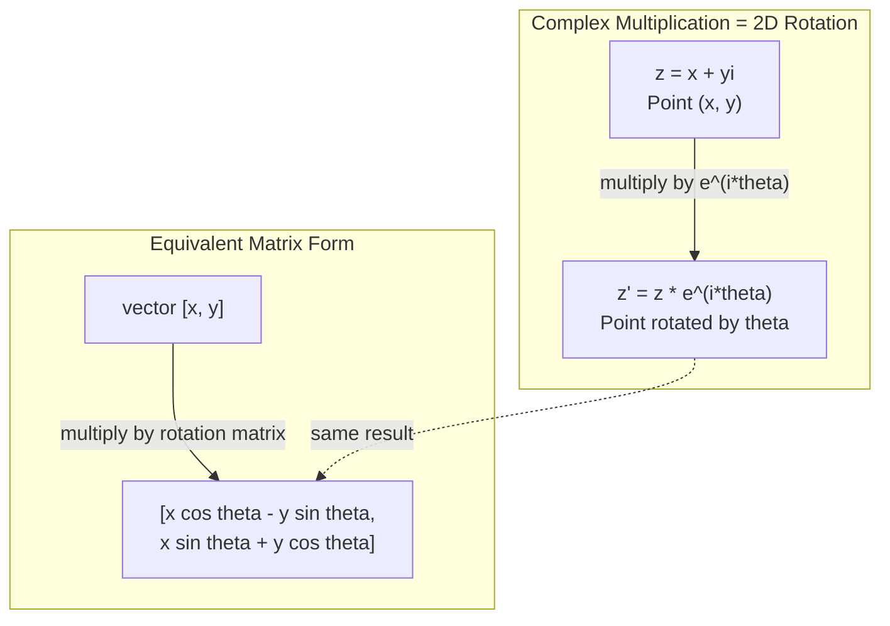
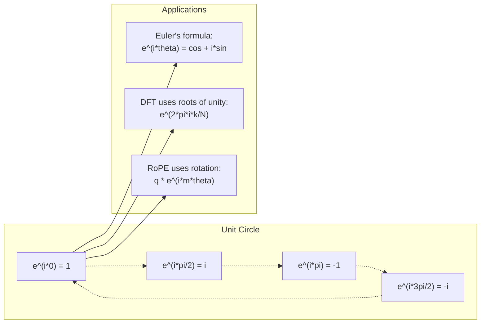

# 间的复数

> 平方根不虚. 它是旋转频率和半信号处理领域的关键.

**Type:** Learn
**Language:**字符串
**Prerequisites:** Phase 1, Lessons 01-04（linear algebra, calculus）
**Time:** ~60 分钟

## 学习目标
- 在直角形式和极坐标形式中执行复数运算 (加法,乘法,除法,共)
- 应用尤勒公式 在复指数与三角函数之间转换
- 使用复数单位根实现分离福利尔转换
- 解释复数旋转如何构成变压器 中 RoPE 和正弦位置编码的基础

## 问题
你打开一篇关于福利尔转变的论文,`i`△你查看变压器位置编码,看不同频率下面`sin`和 `cos` 也就是复指数的实部和虚部――你读到量子计算,又发现一切都用复向量空间来表达――

复数看起来很抽象――一个建立在 -1 的平方根上的数系,感觉就像某种数学技巧――但它不是技巧――它是旋转和振荡的自然语言――每当某种东西旋转、振动或振荡时,复数是合适的工具――

如果不理解复数,你就无法理解FFT――你无法理解现代语言模型中的ROPE――旋转位置嵌入式 (Rotary Position Embedding) 是如何工作的――你也无法理解为什么原始的变压器论文中的正弦位置编码会使用这些频率――

本课程将从零构建复数运算,将其连接到几何,并准确展示复数在机器学习中出现的位置.

## 概念
### 什么是复数?

复数有两个部分:实部和虚部.

```
z = a + bi

where:
  a is the real part
  b is the imaginary part
  i is the imaginary unit, defined by i^2 = -1
```

正如这样. 你把数轴扩展到一个平面. 实数位于一条轴上,虚数位于另一条轴上. 每个复数都是这个平面上的一个点.

### 复数运算

**加法。**实部相加,虚部相加.

```
(a + bi) + (c + di) = (a + c) + (b + d)i

Example: (3 + 2i) + (1 + 4i) = 4 + 6i
```

**乘法。**使用分配律,并记住i^2 = -1──

```
(a + bi)(c + di) = ac + adi + bci + bdi^2
                 = ac + adi + bci - bd
                 = (ac - bd) + (ad + bc)i

Example: (3 + 2i)(1 + 4i) = 3 + 12i + 2i + 8i^2
                            = 3 + 14i - 8
                            = -5 + 14i
```

**共轭。**翻转虚部的符号──

```
conjugate of (a + bi) = a - bi
```

一个复数与其共的乘积总是实数:

```
(a + bi)(a - bi) = a^2 + b^2
```

**除法。**分子和分母同时乘以分母的共──

```
(a + bi) / (c + di) = (a + bi)(c - di) / (c^2 + d^2)
```

这会消灭分母中的虚分,得到一个干净的复数.

### 复平面

复平面把每个复数映射到一个2D点――水平轴是实轴,垂直轴是虚轴――

```
z = 3 + 2i  corresponds to the point (3, 2)
z = -1 + 0i corresponds to the point (-1, 0) on the real axis
z = 0 + 4i  corresponds to the point (0, 4) on the imaginary axis
```

复数同时是一个点,也是从原点发出的向量.

### 极坐标形式

平面中的任意点可以用它来描述距离原点,以及它对正轴的角度.

```
z = r * (cos(theta) + i*sin(theta))

where:
  r = |z| = sqrt(a^2 + b^2)     (magnitude, or modulus)
  theta = atan2(b, a)             (phase, or argument)
```

直角形式(a + bi)适合加法。极坐标形式(r, theta)适合乘法。

**极坐标形式下的乘法。**模长相乘,角度相加.

```
z1 = r1 * e^(i*theta1)
z2 = r2 * e^(i*theta2)

z1 * z2 = (r1 * r2) * e^(i*(theta1 + theta2))
```

这就是复数非常适合表示旋转的原因.

### 勒的公式

复指数与三角函数之间的桥梁:

```
e^(i*theta) = cos(theta) + i*sin(theta)
```

这是本课最重要的公式.当太太 = pi时:

```
e^(i*pi) = cos(pi) + i*sin(pi) = -1 + 0i = -1

Therefore: e^(i*pi) + 1 = 0
```

五个基本常数 (e,i,pi,1,0) 被一个方程连接在一起.

### 为什么尤勒的公式对 ML 很重要

勒的公式表明,`e^(i*theta)`当太 = pi/2 时,你在 (0, 1) ・当太 = pi 时,你在 (-1, 0) ・当太 = 3*pi/2 时,你在 (0, -1) ・完整一圈旋转是太 = 2*pi。

这意味着复指数是旋转.而旋转在信号处理和ML中无处不在.

### 与2D旋转的联系

将复数 (x + yi) 乘以 e^(i*theta),会把点 (x, y) 围绕原点旋转的角.

```
Rotation via complex multiplication:
  (x + yi) * (cos(theta) + i*sin(theta))
  = (x*cos(theta) - y*sin(theta)) + (x*sin(theta) + y*cos(theta))i

Rotation via matrix multiplication:
  [cos(theta)  -sin(theta)] [x]   [x*cos(theta) - y*sin(theta)]
  [sin(theta)   cos(theta)] [y] = [x*sin(theta) + y*cos(theta)]
```

它们产生完全相同的结果――复数乘法就是2D旋转――旋转矩阵 只是用矩阵记法写出的复数乘法――



### 光和旋转信号

复指数 e^(i*omega*t) 是一个以角频的环绕单位圆旋转点──随着t 增加,这个点将描绘出圆──

这个旋转点的实部是 cos(omega*t) ・・・虚部是 sin(omega*t) ・・・正弦信号就是旋转复数投下的影子。

```
e^(i*omega*t) = cos(omega*t) + i*sin(omega*t)

Real part:      cos(omega*t)    -- a cosine wave
Imaginary part: sin(omega*t)    -- a sine wave
```

这就是相光表达法――你不再追踪一条起伏的正弦波,而是追踪一条平滑旋转的箭头――相位偏移变成角度偏移――振幅变化变成模长变化――信号相加变成向量加法――

### 单位根

单位根是单位圆上等间隔分布的 N 个点:

```
w_k = e^(2*pi*i*k/N)    for k = 0, 1, 2, ..., N-1
```

当N = 4 时,根是:1, i, -1, -i(四个罗盘方向)
当N=8时,你会得到四个方向,再加上四个对角方向.

单位根是分离福利尔变换的基础.DFT将信号分解为这个N个等间隔频率上的分量.

### 与DFT的联系

信号 x[0],x[1], ...,x[N-1] 的分离式福利尔转换是:

```
X[k] = sum_{n=0}^{N-1} x[n] * e^(-2*pi*i*k*n/N)
```

每个X[k] 测量信号与第一个单位根的相关程度,也就是与频率 k 处的复正弦波的相关程度――DFT将信号分解为N个旋转相,并告诉你每个振幅和相位――

### 为什么我不虚假

想象 这个词是历史上的偶然. 德卡特曾经带着轻蔑的意思使用它. 但我并没有比负数更虚. 负数回答是:从3减到5? 虚数单位回答是:什么数平方后得到 -1?

更有用的理解是:i 是一个90度旋转算子――把一个实数乘以i 一次,你就旋转90度到虚轴――再乘以i 一次(i^2),你又旋转90度,此时指向负实轴方向――这就是为什么i^2 = -1――它不是神秘的――它由两个四分之一圈组成的半圈旋转――

这就是为什么复数在工程中无处不在的原因.任何旋转的东西都能适应复数描述.

### 复指数与三角函数

在尤勒公式之前,工程师把信号写成A*cos(omega*t + phi) 振幅A、频率 omega、相位phi──这是可行的,但会让运算变得痛苦──相加两个相位不同的余弦需要三角恒等式──

使用复指数后,同一个信号可以写成A*e^(i*(omega*t + phi))。相加两个信号只是相加两个复数。相乘(调制) 只是模长相乘、角度相加。相位偏移变成角度加法。频率偏移变成乘法──

整个信号处理领域都转向复指数记法,因为数学更干净.

### 与变压器的联系

**正弦位置编码**们的故事:

```
PE(pos, 2i) = sin(pos / 10000^(2i/d))
PE(pos, 2i+1) = cos(pos / 10000^(2i/d))
```

它们是不同频率下复指数的实部和虚部. 每个频率都为编码位置提供不同的分辨率──低频变化缓慢──粗略位置──高频变化快速──精细位置──它们共同为每个位置提供独特的频率纹──

**RoPE（Rotary Position Embedding）**更进一步――它显然使用复旋矩阵乘以查询和键向量――两个符号之间的相对位置变成一个旋转角――注意使用这些旋转后的向量 计算,使模型通过复数乘法对相对位置敏感――

| Operation | Algebraic Form | Geometric Meaning |
|-----------|---------------|-------------------|
| 加法 | (a+c) + (b+d)i | 平面中的 Vector 加法 |
| 乘法 | (ac-bd) + (ad+bc)i | 旋转并缩放 |
| 共轭 | a - bi | 关于实轴反射 |
| 模长 | sqrt(a^2 + b^2) | 到原点的距离 |
| 相位 | atan2(b, a) | 相对正实轴的角度 |
| 除法 | multiply by conjugate | 反向旋转并重新缩放 |
| 幂 | r^n * e^(i*n*theta) | 旋转 n 次，按 r^n 缩放 |




```figure
roots-of-unity
```

## 构建它
### 步骤1:复杂类

构建一个复杂的数类,支持运算,模长,相位以及直角形式和极坐标形式之间的转换.

```python
import math

class Complex:
    def __init__(self, real, imag=0.0):
        self.real = real
        self.imag = imag

    def __add__(self, other):
        return Complex(self.real + other.real, self.imag + other.imag)

    def __mul__(self, other):
        r = self.real * other.real - self.imag * other.imag
        i = self.real * other.imag + self.imag * other.real
        return Complex(r, i)

    def __truediv__(self, other):
        denom = other.real ** 2 + other.imag ** 2
        r = (self.real * other.real + self.imag * other.imag) / denom
        i = (self.imag * other.real - self.real * other.imag) / denom
        return Complex(r, i)

    def magnitude(self):
        return math.sqrt(self.real ** 2 + self.imag ** 2)

    def phase(self):
        return math.atan2(self.imag, self.real)

    def conjugate(self):
        return Complex(self.real, -self.imag)
```

### 步骤 2:极坐标转换与尤勒公式

```python
def to_polar(z):
    return z.magnitude(), z.phase()

def from_polar(r, theta):
    return Complex(r * math.cos(theta), r * math.sin(theta))

def euler(theta):
    return Complex(math.cos(theta), math.sin(theta))
```

验证:`euler(theta).magnitude()`应始终为1.0──`euler(0)`应给出 (1, 0) ⋅`euler(pi)`应给出 (-1, 0) ⋅

### 步骤3:旋转

将点 (x,y) 旋转到角,只需要一次复数乘法:

```python
point = Complex(3, 4)
rotated = point * euler(math.pi / 4)
```

模长保持不变.

### 步骤4:基于复数运算的DFT

```python
def dft(signal):
    N = len(signal)
    result = []
    for k in range(N):
        total = Complex(0, 0)
        for n in range(N):
            angle = -2 * math.pi * k * n / N
            total = total + Complex(signal[n], 0) * euler(angle)
        result.append(total)
    return result
```

这是O(N^2) 的 DFT──每个输出 X[k] 都是信号样本乘以单位根后的总和──

### 步骤5:反向DFT

相比于正向DFT,唯一的变化是:翻转指数中的符号,并除以N──

```python
def idft(spectrum):
    N = len(spectrum)
    result = []
    for n in range(N):
        total = Complex(0, 0)
        for k in range(N):
            angle = 2 * math.pi * k * n / N
            total = total + spectrum[k] * euler(angle)
        result.append(Complex(total.real / N, total.imag / N))
    return result
```

这将给出完美的重构. 首先应用DFT,再应用IDFT,你将在机器精度范围内得到原始信号.

### 步骤 6:单位根

```python
def roots_of_unity(N):
    return [euler(2 * math.pi * k / N) for k in range(N)]
```

验证两个性质:
- 每个根的模长都严格为1.
- 所有的和为零,它们因对称性相互抵消)

这些性质使得DFT可逆.

## 使用它
字面量 字面量 字面量 字面量 字面量 字面量 字面量 字面量 字面量 字面量 字面量 字面量 字面量 字面量 字面量 字面量 字面量 字面量 字面量`j`表示虚数单位――

```python
z = 3 + 2j
w = 1 + 4j

print(z + w)
print(z * w)
print(abs(z))

import cmath
print(cmath.phase(z))
print(cmath.exp(1j * cmath.pi))
```

对于数组,不太原生支持复数:

```python
import numpy as np

z = np.array([1+2j, 3+4j, 5+6j])
print(np.abs(z))
print(np.angle(z))
print(np.conj(z))
print(np.real(z))
print(np.imag(z))

signal = np.sin(2 * np.pi * 5 * np.linspace(0, 1, 128))
spectrum = np.fft.fft(signal)
freqs = np.fft.fftfreq(128, d=1/128)
```

## 交付它
运行`code/complex_numbers.py`产生`outputs/skill-complex-arithmetic.md`,我知道.

## 练习
1. **手算复数运算。**计算 (2 + 3i) * (4 - i),并使用代码验证――然后计算 (5 + 2i) / (1 - 3i) ─把两个结果都画在复平面上,并检查乘法是否旋转并缩放第一个数――

2. **旋转序列。**从点 (1, 0) 开始──连续乘以 e^(i*pi/6) 十二次──验证 12次乘法后你会回到 (1, 0)──印印每一步的坐标,并确认它们描绘出一个正 12 边形──

3. **已知信号的 DFT。**创建一个信号,它在32个点上采用类似的信号(2*pi*3*t) 与0.5*sin(2*pi*7*t) 之和──运行你的DFT──验证幅度频谱在频率3 和 7 处有峰值,并且频率7 处的峰值高度是频率3 处的一半──

4. **单位根可视化。**计算 8 次单位根──验证它们的和为零──验证任意一个根乘以本原根 e^(2*pi*i/8) 都会得到下一个根──

5. **旋转 Matrix 等价性。**对10个随机角度和10个随机点,验证复数乘法所给出的结果与使用2x2旋转矩阵的结果相同.

## 关键术语
| Term | What it means |
|------|---------------|
| 复数 | 形如 a + bi 的数，其中 a 是实部，b 是虚部，并且 i^2 = -1 |
| 虚数单位 | 数 i，定义为 i^2 = -1。它在哲学意义上并不“虚”——它是一个旋转算子 |
| 复平面 | x 轴为实轴、y 轴为虚轴的 2D 平面。也称为 Argand plane |
| 模长（模） | 到原点的距离：sqrt(a^2 + b^2)。写作 \|z\| |
| 相位（辐角） | 相对正实轴的角度：atan2(b, a)。写作 arg(z) |
| 共轭 | 关于实轴的镜像：a + bi 的共轭是 a - bi |
| 极坐标形式 | 将 z 表示为 r * e^(i*theta)，而不是 a + bi。让乘法变得容易 |
| Euler's formula | e^(i*theta) = cos(theta) + i*sin(theta)。连接指数函数与三角函数 |
| Phasor | 表示正弦信号的旋转复数 e^(i*omega*t) |
| 单位根 | k = 0 到 N-1 时的 N 个复数 e^(2*pi*i*k/N)。单位圆上等间隔的 N 个点 |
| DFT | Discrete Fourier Transform。使用单位根将信号分解为复正弦分量 |
| RoPE | Rotary Position Embedding。使用复数乘法在 Transformer Attention 中编码相对位置 |

## 延伸阅读
- [Visual Introduction to Euler's Formula](https://betterexplained.com/articles/intuitive-understanding-of-eulers-formula/)- 在不使用繁重新闻的情况下建立几何直觉
- [Su et al.: RoFormer (2021)](https://arxiv.org/abs/2104.09864)- 提出使用复数旋转的轮盘位置嵌入的论文
- [Vaswani et al.: Attention Is All You Need (2017)](https://arxiv.org/abs/1706.03762)- 提出正弦位置编码的原始变压器论文
- [3Blue1Brown: Euler's formula with introductory group theory](https://www.youtube.com/watch?v=mvmuCPvRoWQ)- 对为什么 e^(i*pi) = -1 的可见解释
- [Needham: Visual Complex Analysis](https://global.oup.com/academic/product/visual-complex-analysis-9780198534464)- 关于复数的最佳可见解,充满几何洞察力
- [Strang: Introduction to Linear Algebra, Ch. 10](https://math.mit.edu/~gs/linearalgebra/)- 线性代数和特征值语境中的复数
