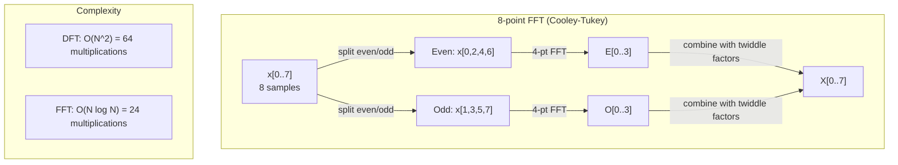
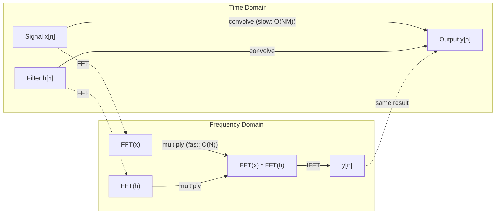

# 福利尔转换

> 每个信号都是弦波的叠加.

**Type:** Build
**Language:**字符串
**Prerequisites:** Phase 1, Lessons 01-04, 19 (complex numbers)
**Time:** ~90 分钟

## 学习目标
- 从零实现DFT,并使用O(N log N) 的Cooley-Tukey FFT 验证它
- 了解频率系数:从信号中提取振幅,相和功率谱
- 应用卷积定理,通过FFT乘法 执行卷积
- 将Fourier频率分解与变压器位置编码和CNN卷积层 联系起来

## 问题
一段音频录音是随时间变化的压力测量值的一系列. 股价是按天排列的数值的一系列. 图像是空间中像素强度的网格. 这些都是时间域的数据. 你看到的是某个指数上不断变化的值.

但在时间域中,许多模式是不可见的.这个音频信号是纯音调还是合唱?这个股价是否存在每周周期?这个图像是否有重复的纹理?这些问题关注的是频率内容,而时间域会隐藏它.

福利尔变形将将数据从时间域转换到频率域――它接收一个信号,并将其分解为不同频率的弦波――每个弦波都有一个放大度 (强度) 和一个阶段 (起始位置)――福利尔变形会同时告诉你这两者――

这对 ML 很重要,因为频率域思考 随处可见. 卷积神经网络 执行卷积,而卷积在频率域中就是乘积.

## 概念
### 关于DFT的定义

给定N 个样本x[0],x[1], ...,x[N-1],分离福利尔转换 会生成N 个频率系数X[0],X[1], ...,X[N-1]:

```
X[k] = sum_{n=0}^{N-1} x[n] * e^(-2*pi*i*k*n/N)

for k = 0, 1, ..., N-1
```

每个X[k]都是一个复杂的数字.它的大小.X[k]也表示频率k的幅度.

关键洞见:`e^(-2*pi*i*k*n/N)`是一个频率 k 旋转的相子.DFT 计算信号与 N 个等间隔频率中的每个信号的相关性.如果信号在频率 k 上包含能量,相关性就很大.否则,它接近零.

### 每个系数的含义

**X[0]: DC component。**这是所有样本的总和,与平均成比例. 它表示信号的常数.

```
X[0] = sum_{n=0}^{N-1} x[n] * e^0 = sum of all samples
```

**X[k] for 1 <= k <= N/2: positive frequencies。**显示每N个样本中 k 个周期的频率──k 越大,频率 越高(动 越快)──

**X[N/2]: Nyquist frequency。**超过这个频率,就会出现称,也就是说高频率被伪装成低频率.

**X[k] for N/2 < k < N: negative frequencies。**对于实值信号,X[N-k] = conj(X[k])──负频率是正的镜像──这就是为什么有用信息位于前N/2 + 1 个系数中──

### 逆转DFT

逆 DFT 会从频率系数重建原始信号:

```
x[n] = (1/N) * sum_{k=0}^{N-1} X[k] * e^(2*pi*i*k*n/N)

for n = 0, 1, ..., N-1
```

它与前进DFT的唯一区别是:中中的符号为正 (不是负),并且有一个1/N正常化因子.

反向DFT是完美的重建――不会丢失任何信息――你可以从时间域到频率域,再返回,没有任何错误――DFT是一种基本的改变,也就是用不同的坐标系统重新表达相同信息――

### 快速的转移

如上定义的 DFT 是 O(N^2):对 N 个输出系数中每一个,必须对 N 个输入样本求和──当 N = 1 万 时,这就是10^12次操作──

快速富里尔转换 (FFT) 会以 O N 记 N 计算同样的结果.当 N = 1 万 时,这大约是2000万次的操作,而不是10亿次.

库利-图基算法 (最常见的FFT) 使用分和征服:

1. 将信号分为偶指数和偶指数样本.
2. 归计算每一半的DFT.
3. 使用"双重因素"e^(-2*pi*i*k/N) 合并两个半尺寸的DFT──

```
X[k] = E[k] + e^(-2*pi*i*k/N) * O[k]          for k = 0, ..., N/2 - 1
X[k + N/2] = E[k] - e^(-2*pi*i*k/N) * O[k]    for k = 0, ..., N/2 - 1

where E = DFT of even-indexed samples
      O = DFT of odd-indexed samples
```

这种对称性意味着递归的每一层执行O (N) 工作,并且有log2 (N) 层――总计:O (N) log N) ――



在实践中,信号通常会零到下一个2的──

### 频谱分析

**power spectrum**它们显示每个频率上有多少能量.

**phase spectrum**是角 ((X[k]),也就是每个频率的相对应.对于大多数分析任务,你关心的是电源谱,并会忽略相.

```
Power at frequency k:  P[k] = |X[k]|^2 = X[k].real^2 + X[k].imag^2
Phase at frequency k:  phi[k] = atan2(X[k].imag, X[k].real)
```

### 频率分辨率

根据样本数量N和样本取量率fs.

```
Frequency of bin k:      f_k = k * fs / N
Frequency resolution:    delta_f = fs / N
Maximum frequency:       f_max = fs / 2  (Nyquist)
```

要分辨两个非常接近的频率,你需要更多的样本.

### 卷积定理

这也是信号处理中最重要的结果之一,

**time domain 中的 convolution 等于 frequency domain 中的 pointwise multiplication。**

```
x * h = IFFT(FFT(x) . FFT(h))

where * is convolution and . is element-wise multiplication
```

为什么这很重要:

- 两个长度为N和M的信号 直接卷积 需要O(N*M) 操作。
- 基于FFT的卷积需要O(N log N):转换 两者、乘以、转换回──
- 对于大型核子来说,FFT卷积会快得多.
- 这正是发生在具有大受容场的卷积层中的事.

注意:DFT 计算是圆形卷积 (信号会绕绕) ⋅对于线性卷积 (线性卷积) ⋅无绕绕),请在计算前将两个信号零到长度 N + M - 1⋅



### 窗户

如果信号的起点和终点不是相同的值,就会在边界产生间断性,并表现为虚假的高频内容――这被称为光谱泄漏――

窗户会在计算DFT前将信号 两端减弱到零,从而减少泄漏.

常见窗户:

| Window | Shape | Main lobe width | Side lobe level | Use case |
|--------|-------|----------------|-----------------|----------|
| Rectangular | 平坦（无 window） | 最窄 | 最高 (-13 dB) | 当 signal 在 N 个 samples 中正好 periodic 时 |
| Hann | Raised cosine | 中等 | 低 (-31 dB) | 通用 spectral analysis |
| Hamming | Modified cosine | 中等 | 更低 (-42 dB) | Audio processing、speech analysis |
| Blackman | Triple cosine | 宽 | 非常低 (-58 dB) | 当 side lobe suppression 至关重要时 |

```
Hann window:    w[n] = 0.5 * (1 - cos(2*pi*n / (N-1)))
Hamming window: w[n] = 0.54 - 0.46 * cos(2*pi*n / (N-1))
```

在DFT之前,将与信号进行元素智能乘法来应用窗口:`X = DFT(x * w)`,我知道.

### 光电源

| Property | Time Domain | Frequency Domain |
|----------|-------------|-----------------|
| Linearity | a*x + b*y | a*X + b*Y |
| Time shift | x[n - k] | X[f] * e^(-2*pi*i*f*k/N) |
| Frequency shift | x[n] * e^(2*pi*i*f0*n/N) | X[f - f0] |
| Convolution | x * h | X * H (pointwise) |
| Multiplication | x * h (pointwise) | X * H (circular convolution, scaled by 1/N) |
| Parseval's theorem | sum \|x[n]\|^2 | (1/N) * sum \|X[k]\|^2 |
| Conjugate symmetry (real input) | x[n] real | X[k] = conj(X[N-k]) |

帕塞瓦尔定理表示总能量在两个领域中相同.

### 与位置编码的联系

原始变压器 使用状位置编码:

```
PE(pos, 2i)   = sin(pos / 10000^(2i/d_model))
PE(pos, 2i+1) = cos(pos / 10000^(2i/d_model))
```

每个对尺寸 (2i, 2i+1) 都以不同的频率振荡──从高(尺寸0,1) 到低(最后的尺寸) 按几何间隔排列──这使每个位置在所有频率带上都有独特的模式,类似于福利尔系数 如何唯一识别一个信号──

它提供关键属性:

- **Uniqueness:**任意两个位置都不会有相同的编码.
- **Bounded values:**总是在 [-1, 1] 内──
- **Relative position:**位置 p+k 的编码可以表示为位置 p 处编码的线性函数──模型可以学习关注相对位置──

### 与CNN的连接

通过信号或图像上滑动一个学习过器的核,将其应用到输入.

根据卷积定理,这等价于:
1. 对输入 执行FFT
2. 对内核执行FFT
3. 在频率域中乘以
4. 执行IFT的结果

标准CNN 实现直接卷积的使用(对小型3x3核更快) ⋅但对于大型核或全球卷积,基于FFT的方法会显著更快――一些架构 (例如FNET) 完全使用FFT 替代注意力,在O(N log N) 而不是O(N^2) 复杂度下获得有竞争力的准确――

### 频谱和短时间福利尔转换

单次FFT会给出整个信号的频率内容,但不能告诉你这些频率何时出现.

通过在信号的重叠窗户上计算FFT来解决这个问题.结果是谱图:一种2D表示,其中一个轴是时间,另一个轴是频率.

```
STFT procedure:
1. Choose a window size (e.g., 1024 samples)
2. Choose a hop size (e.g., 256 samples -- 75% overlap)
3. For each window position:
   a. Extract the windowed segment
   b. Apply a Hann/Hamming window
   c. Compute FFT
   d. Store the magnitude spectrum as one column of the spectrogram
```

频谱是音频ML模型的标准输入表示. 语音识别模型 (Whisper、DeepSpeech) 处理旋律谱,也就是将频率映射到旋律尺度的谱,这更符合人类的音速感知.

### 标签名

如果信号包含高于fs/2 (Nyquist频率),以速度fs采样会产生号副本――一个以100Hz采样的90Hz信号看起来与10Hz信号完全相同――仅仅通过样本无法区分它们――

```
Example:
  True signal: 90 Hz sine wave
  Sampling rate: 100 Hz
  Apparent frequency: 100 - 90 = 10 Hz

  The samples from the 90 Hz signal at 100 Hz sampling rate
  are identical to the samples from a 10 Hz signal.
  No amount of math can recover the original 90 Hz.
```

这就是为什么模拟到数字转换器会包含反化过器,在采样前移除高于尼奎斯特的频率. 在ML中,当没有适当的低通行过器,就像在特征地图下样时,会出现化;一些架构使用反化聚合层来处理这个问题.

### 零不会提高分辨率

一个常见误解是:在FFT前对信号进行零接 会提高频率分辨率――它不会――零接 只是插入现有频率桶之间,让频谱看起来更平滑――但它无法揭示原始样本中不存在的频率细节――

真正的频率分辨率只取决于观察时间T = N / fs──要分辨分相差的两个频率,你至少需要T = 1 / delta_f 秒的数据──无论做多少零,都无法改变这个基本的限制──


```figure
fourier-synthesis
```

## 构建它
### 步骤1:从零开始的DFT

                                                                                                                                                                                                                                                              

```python
import math

class Complex:
    ...

def dft(x):
    N = len(x)
    result = []
    for k in range(N):
        total = Complex(0, 0)
        for n in range(N):
            angle = -2 * math.pi * k * n / N
            w = Complex(math.cos(angle), math.sin(angle))
            xn = x[n] if isinstance(x[n], Complex) else Complex(x[n])
            total = total + xn * w
        result.append(total)
    return result
```

### 步骤 2:反向DFT

结构相同,元为正,并除以N──

```python
def idft(X):
    N = len(X)
    result = []
    for n in range(N):
        total = Complex(0, 0)
        for k in range(N):
            angle = 2 * math.pi * k * n / N
            w = Complex(math.cos(angle), math.sin(angle))
            total = total + X[k] * w
        result.append(Complex(total.real / N, total.imag / N))
    return result
```

### 步骤3:FFT (Cooley-Tukey)

复制式FFT 要求长度为 2 的──分为偶 和 偶,递归,然后使用双重因子合并──

```python
def fft(x):
    N = len(x)
    if N <= 1:
        return [x[0] if isinstance(x[0], Complex) else Complex(x[0])]
    if N % 2 != 0:
        return dft(x)

    even = fft([x[i] for i in range(0, N, 2)])
    odd = fft([x[i] for i in range(1, N, 2)])

    result = [Complex(0)] * N
    for k in range(N // 2):
        angle = -2 * math.pi * k / N
        twiddle = Complex(math.cos(angle), math.sin(angle))
        t = twiddle * odd[k]
        result[k] = even[k] + t
        result[k + N // 2] = even[k] - t
    return result
```

### 步骤 4: 频谱分析助手

```python
def power_spectrum(X):
    return [xk.real ** 2 + xk.imag ** 2 for xk in X]

def convolve_fft(x, h):
    N = len(x) + len(h) - 1
    padded_N = 1
    while padded_N < N:
        padded_N *= 2

    x_padded = x + [0.0] * (padded_N - len(x))
    h_padded = h + [0.0] * (padded_N - len(h))

    X = fft(x_padded)
    H = fft(h_padded)

    Y = [xk * hk for xk, hk in zip(X, H)]

    y = idft(Y)
    return [y[n].real for n in range(N)]
```

## 使用它
在真实工作中,使用numpy的FFT,它由高度优化的C库支持.

```python
import numpy as np

signal = np.sin(2 * np.pi * 5 * np.arange(256) / 256)
spectrum = np.fft.fft(signal)
freqs = np.fft.fftfreq(256, d=1/256)

power = np.abs(spectrum) ** 2

positive_freqs = freqs[:len(freqs)//2]
positive_power = power[:len(power)//2]
```

对于窗户和更高级的光谱分析:

```python
from scipy.signal import windows, stft

window = windows.hann(256)
windowed = signal * window
spectrum = np.fft.fft(windowed)
```

对于卷积:

```python
from scipy.signal import fftconvolve

result = fftconvolve(signal, kernel, mode='full')
```

对于光谱:

```python
from scipy.signal import stft

frequencies, times, Zxx = stft(signal, fs=sample_rate, nperseg=256)
spectrogram = np.abs(Zxx) ** 2
```

频谱矩阵的形状是 (n_frequencies,n_time_frames) ⋅每一列都是一个时间窗口上方的电源谱──这是音频ML模型作为输入消费内容──

## 交付它
运行`code/fourier.py`生成 `outputs/prompt-spectral-analyzer.md`,我知道.

## 练习
1. **Pure tone identification。**创建一个信号,其中包含一个未知频率的单个弦波,以128Hz采样1秒. 使用你的DFT识别频率. 验证答案是否匹配. 现在加入标准偏差为0.5的高斯噪音,并重复. 噪音如何影响频谱?

2. **FFT vs DFT verification。**生成一个长度为64的随机信号――同时计算DFT(O(N^2)) 和FFT──验证所有系数在1e-10以内匹配──在长度为256、512、1024和2048的信号上分别计时两个函数──绘制DFT时间与FFT时间的比率──

3. **Convolution theorem proof by example。**创建信号 x = [1, 2, 3, 4, 0, 0, 0, 0] 和过器 h = [1, 1, 1, 0, 0, 0, 0, 0]──直接计算它们的圆形卷积 (圈)──然后通过FFT 计算(转换、乘以、逆转变)──验证结果匹配──现在通过适当的零接 执行线性卷积──

4. **Windowing effects。**创建一个信号,它是10 Hz 和 12 Hz(非常接近) 两个弦波的和──以 128 Hz 采样 1 秒──分别在无窗户、汉窗和汉密窗 下计算电源谱──哪个窗户最容易区分两个峰值?为什么?

5. **Positional encoding analysis。**为d_model = 128 和 max_pos = 512 生成的突状位置编码──对每对位置 (p1,p2),计算它们编码的点产品──说明点产品只依赖于p1 -p2的位置,而不依赖于绝对的位置──随着距离的增加,点产品会发生什么?

## 关键术语
| Term | What it means |
|------|---------------|
| DFT (Discrete Fourier Transform) | 将 N 个 time-domain samples 转换为 N 个 frequency-domain coefficients。每个 coefficient 都是与该 frequency 上 complex sinusoid 的 correlation |
| FFT (Fast Fourier Transform) | 用于计算 DFT 的 O(N log N) algorithm。Cooley-Tukey algorithm 递归拆分 even/odd indices |
| Inverse DFT | 从 frequency coefficients 重建 time-domain signal。公式与 DFT 相同，但 exponent sign 相反，并带有 1/N scaling |
| Frequency bin | DFT output 中的每个 index k 表示 frequency k*fs/N Hz。"bin" 是离散的 frequency slot |
| DC component | X[0]，zero-frequency coefficient。与 signal mean 成比例 |
| Nyquist frequency | fs/2，在 sampling rate fs 下可表示的最大 frequency。高于它的 frequencies 会 alias |
| Power spectrum | \|X[k]\|^2，每个 frequency coefficient 的 squared magnitude。显示 energy 在 frequencies 上的分布 |
| Phase spectrum | angle(X[k])，每个 frequency component 的 phase offset。在 analysis 中通常会忽略 |
| Spectral leakage | 将 non-periodic signal 当作 periodic 处理导致的虚假 frequency content。可通过 windowing 减少 |
| Window function | 在 DFT 前应用的 tapering function（Hann、Hamming、Blackman），用于减少 spectral leakage |
| Twiddle factor | FFT butterfly computation 中用于合并 sub-DFTs 的 complex exponential e^(-2*pi*i*k/N) |
| Convolution theorem | time domain 中的 convolution 等于 frequency domain 中的 pointwise multiplication。它是 signal processing 和 CNNs 的基础 |
| Circular convolution | signal 会 wrap around 的 convolution。这是 DFT 自然计算的内容 |
| Linear convolution | 没有 wraparound 的标准 convolution。通过在 DFT 前 zero-padding 实现 |
| Parseval's theorem | 总 energy 在 Fourier transform 中保持不变。sum \|x[n]\|^2 = (1/N) sum \|X[k]\|^2 |
| Aliasing | 当 sampling rate 不足时，高于 Nyquist 的 frequencies 表现为较低 frequencies |

## 延伸阅读
- [Cooley & Tukey: An Algorithm for the Machine Calculation of Complex Fourier Series (1965)](https://www.ams.org/journals/mcom/1965-19-090/S0025-5718-1965-0178586-1/)- 改变计算的原始FFT论文
- [3Blue1Brown: But what is the Fourier Transform?](https://www.youtube.com/watch?v=spUNpyF58BY)- 关于福利变化的最佳可见性入口
- [Lee-Thorp et al.: FNet: Mixing Tokens with Fourier Transforms (2021)](https://arxiv.org/abs/2105.03824)- 在变压器中使用FFT 替代自我注意力
- [Smith: The Scientist and Engineer's Guide to Digital Signal Processing](http://www.dspguide.com/)- 免费在线教材,深入覆盖FFT,窗户和光谱分析
- [Vaswani et al.: Attention Is All You Need (2017)](https://arxiv.org/abs/1706.03762)- 从福利尔频率分解 派生出的突状位置编码
- [Radford et al.: Whisper (2022)](https://arxiv.org/abs/2212.04356)- 使用光谱作为输入表示的语音识别
