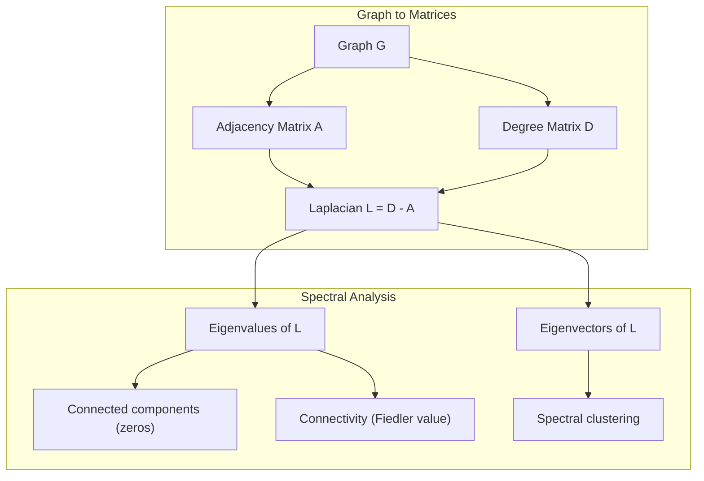
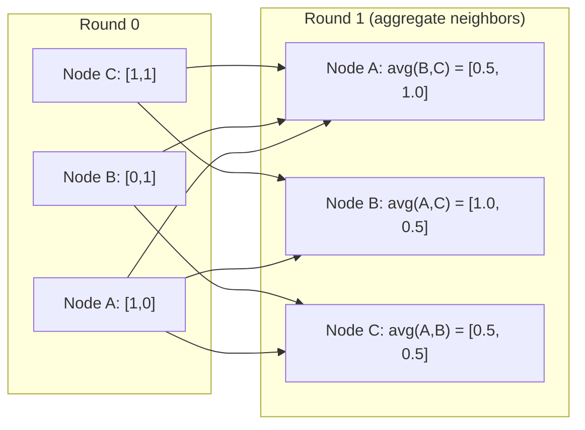

# 面向机器学习的图形理论

> 如果你的数据包含连接,你就需要图形理论.

**Type:** Build
**Language:**字符串
**Prerequisites:** Phase 1, Lessons 01-03（linear algebra, matrices）
**Time:** ~90 分钟

## 学习目标
- 构建一个图类,包含邻接矩阵/列表表示,并实现BFS 和 DFS 遍历
- 计算图 拉普拉西亚,并使用其本值 检测连接组件 和对节点 聚类
- 将一轮 GNN 风格的消息传递实现为正常化的邻接矩阵乘法
- 使用Fiedler向量 应用光谱集群 来划分图

## 问题
社交网络,分子,知识基础,引用网络,路线图都是图形.传统的ML将数据视为平面表格.

考虑一个社交网络――你想预测某个用户会购买什么产品――他们的购买历史很重要――但他们朋友的购买历史更重要――连接本身承载信号――

或者考虑一个分子――你想预测它是否会与某种蛋白质结合――原子很重要,但真正重要的是原子如何相互关键――结构就是数据――

图神经网络 (GNN) 是深度学习中增长最快的领域――它们驱动药物发现,社会推,欺诈检测和知识图论――每个GNN都建立在一个基础上:基础图理论――

你需要四件事:
1. 一种将图表表示为矩阵的方式 (这样你可以对它们进行乘法)
2. 用于探索图形结构的穿越算法
3. 拉普拉西亚,这是光谱图理论中最重要的矩阵
4. 通过消息,这是让 GNN 工作的操作

## 概念
### 图:节点和边缘

一个图 G = (V,E) 由顶点 (节点) V 和边缘 E 组成──每条边缘 连接两个节点──

**Directed vs undirected。**在未定向图中,边缘 (u, v) 表示 u 连接到 v,并且 v 也连接到 u. 在未定向图中,边缘 (u, v) 表示 u 指向 v,但反向不一定成立──

**Weighted vs unweighted。**在未加权图中,边缘要么存在,要么不存在. 在加权图中,每个边缘都有数值重量,例如距离,成本或强度.

| Graph type | Example |
|-----------|---------|
| Undirected, unweighted | Facebook friendship network |
| Directed, unweighted | Twitter follow network |
| Undirected, weighted | Road map（distances） |
| Directed, weighted | Web page links（PageRank scores） |

### 接近矩阵

邻近矩阵 A 是核心表示──对于一个包含n个节点的图:

```
A[i][j] = 1    if there is an edge from node i to node j
A[i][j] = 0    otherwise
```

对于未定向图形,A 是对称:A[i][j] =A[j][i]。对于权重图形,A[i][j] =边缘 (i,j) 的重量。

**示例：一个 triangle：**

```
Nodes: 0, 1, 2
Edges: (0,1), (1,2), (0,2)

A = [[0, 1, 1],
     [1, 0, 1],
     [1, 1, 0]]
```

邻接矩阵是每个 GNN 的输入.

### 学位

对于导向图表,你有进度的边缘 (进入边缘) 和外度的边缘 (出去边缘)

度矩阵 D 是对角:

```
D[i][i] = degree of node i
D[i][j] = 0    for i != j
```

对于三角形示例:D =  diag(2,2,2),因为每个节点都连接到另外两个节点.

程度告诉你节点的重要性――高度 = 枢纽节点――网络的程度分布 揭示了它的结构――社会网络 遵循电力规律――少量枢纽,许多叶子节点――随机图形 具有波森分布式的度量――

### 和

两个基本的图形穿越算法.

**Breadth-First Search (BFS)：**先探索所有邻居,再探索邻居的邻居――使用队列 (FIFO)――

```
BFS from node 0:
  Visit 0
  Queue: [1, 2]        (neighbors of 0)
  Visit 1
  Queue: [2, 3]        (add neighbors of 1)
  Visit 2
  Queue: [3]           (neighbors of 2 already visited)
  Visit 3
  Queue: []            (done)
```

在未加权图中,BFS 找到最短的路径――从起点到任意节点的距离等于该节点第一次被发现时所在的BFS 水平――这就是为什么BFS 将被用于社交网络中跳数距离的原因――

**Depth-First Search (DFS)：**在回溯之前尽可能深入.

```
DFS from node 0:
  Visit 0
  Stack: [1, 2]        (neighbors of 0)
  Visit 2               (pop from stack)
  Stack: [1, 3]         (add neighbors of 2)
  Visit 3               (pop from stack)
  Stack: [1]
  Visit 1               (pop from stack)
  Stack: []             (done)
```

可用于:
- 查找连接的组件(从未访问的节点 运行 DFS)
- 循环检测 (DFS树 中的后边)
- 拓分类 (反向 DFS 完成顺序)

| Algorithm | Data structure | Finds | Use case |
|-----------|---------------|-------|----------|
| BFS | Queue | Shortest paths | Social network distance, knowledge graph traversal |
| DFS | Stack | Components, cycles | Connectivity, topological sort |

### 拉普拉西亚图

L = D - A──光谱图理论 中最重要的矩阵──

对于三角形:

```
D = [[2, 0, 0],    A = [[0, 1, 1],    L = [[2, -1, -1],
     [0, 2, 0],         [1, 0, 1],         [-1, 2, -1],
     [0, 0, 2]]         [1, 1, 0]]         [-1, -1,  2]]
```

拉普拉西亚具有非常重要的性质:

1. **L 是 positive semi-definite。**所有的本值都 >= 0──

2. **zero eigenvalues 的数量等于 connected components 的数量。**一个连接的图形恰好有一个零的自值. 一个有3个离线的组件.

3. **最小的 non-zero eigenvalue（Fiedler value）衡量 connectivity。**较大的Fiedler值表示图 连接良好――较小的Fiedler值表示图 有一个薄弱点,也就是瓶――

4. **Fiedler value 的 eigenvector（Fiedler vector）揭示最佳切分。**值为正的节点进入一组,值为负的节点进入另一个组.



### 频谱特性

邻近矩阵和拉普拉西亚的本值可以在没有任何穿越的情况下揭示结构性质.

**Spectral clustering**的工作方式如下:
1. 计算 拉普拉西亚 L
2. 找到 L 的 k 个最小的自向量(跳过第一个;对于连接图表,它是全 1)
3. 将这些自向量用作每个节点的新标记
4. 在这些坐标上运行 k-means

为什么这有效?L的自向量编码了图上最平滑的函数――连接良好的节点会得到相似的自向量值――被瓶分离的节点会得到不同的值――自向量会自然分离集群――

**Random walk connection。**随机步行的静止分布与节点度 成比例――混合时间(步行 收得有多快) 取决于光谱差距――

### 传递信息

这就是图神经网络的核心操作. 每个节点从邻居收集信息,聚合它们,然后更新自己的状态.

```
h_v^(k+1) = UPDATE(h_v^(k), AGGREGATE({h_u^(k) : u in neighbors(v)}))
```

在最简单的形式中,AGGREGATE = 中,UPDATE =线性转换 +激活:

```
h_v^(k+1) = sigma(W * mean({h_u^(k) : u in neighbors(v)}))
```

这实际上是伪装成另一种形式的矩阵乘法. 如果H是所有节点特征的矩阵,A是邻立矩阵:

```
H^(k+1) = sigma(A_norm * H^(k) * W)
```

其中A_norm是正常化的邻近矩阵 (每行求和为 1) ⋅

一轮消息传递 让每个节点 看到它的邻居――两轮让它看到邻居的邻居――K 轮让每个节点 获得来自其K-hop社区的信息――



### 概念与 ML 应用

| Concept | ML Application |
|---------|---------------|
| Adjacency matrix | GNN input representation |
| Graph Laplacian | Spectral clustering, community detection |
| BFS/DFS | Knowledge graph traversal, path finding |
| Degree distribution | Node importance, feature engineering |
| Message passing | GNN layers (GCN, GAT, GraphSAGE) |
| Eigenvalues of L | Community detection, graph partitioning |
| Spectral clustering | Unsupervised node grouping |
| PageRank | Node importance, web search |


```figure
graph-degree-distribution
```

## 构建它
### 步骤1:从零实现图类

```python
class Graph:
    def __init__(self, n_nodes, directed=False):
        self.n = n_nodes
        self.directed = directed
        self.adj = {i: {} for i in range(n_nodes)}

    def add_edge(self, u, v, weight=1.0):
        self.adj[u][v] = weight
        if not self.directed:
            self.adj[v][u] = weight

    def neighbors(self, node):
        return list(self.adj[node].keys())

    def degree(self, node):
        return len(self.adj[node])

    def adjacency_matrix(self):
        import numpy as np
        A = np.zeros((self.n, self.n))
        for u in range(self.n):
            for v, w in self.adj[u].items():
                A[u][v] = w
        return A

    def degree_matrix(self):
        import numpy as np
        D = np.zeros((self.n, self.n))
        for i in range(self.n):
            D[i][i] = self.degree(i)
        return D

    def laplacian(self):
        return self.degree_matrix() - self.adjacency_matrix()
```

邻近的列表(`self.adj`由于所有光谱操作都需要它.

### 步骤2:BFS和DFS

```python
from collections import deque

def bfs(graph, start):
    visited = set()
    order = []
    distances = {}
    queue = deque([(start, 0)])
    visited.add(start)
    while queue:
        node, dist = queue.popleft()
        order.append(node)
        distances[node] = dist
        for neighbor in graph.neighbors(node):
            if neighbor not in visited:
                visited.add(neighbor)
                queue.append((neighbor, dist + 1))
    return order, distances


def dfs(graph, start):
    visited = set()
    order = []
    stack = [start]
    while stack:
        node = stack.pop()
        if node in visited:
            continue
        visited.add(node)
        order.append(node)
        for neighbor in reversed(graph.neighbors(node)):
            if neighbor not in visited:
                stack.append(neighbor)
    return order
```

BFS 使用 deque(双端排队) 实现O(1) 弹左──DFS 使用列表 作为堆──两者都会恰好访问每个节点 一次,时间复杂度为O(V + E)──

### 步骤3:连接组件和拉普拉斯的本值

```python
def connected_components(graph):
    visited = set()
    components = []
    for node in range(graph.n):
        if node not in visited:
            order, _ = bfs(graph, node)
            visited.update(order)
            components.append(order)
    return components


def laplacian_eigenvalues(graph):
    import numpy as np
    L = graph.laplacian()
    eigenvalues = np.linalg.eigvalsh(L)
    return eigenvalues
```

`eigvalsh`对于不导向图表,拉普拉西亚语总是对称. 它按上升序返回自身值.

### 步骤4: 频谱集群

```python
def spectral_clustering(graph, k=2):
    import numpy as np
    L = graph.laplacian()
    eigenvalues, eigenvectors = np.linalg.eigh(L)
    features = eigenvectors[:, 1:k+1]

    labels = np.zeros(graph.n, dtype=int)
    for i in range(graph.n):
        if features[i, 0] >= 0:
            labels[i] = 0
        else:
            labels[i] = 1
    return labels
```

对于 k=2,Fiedler向量的符号会将图分为两个集群.对于 k>2,你会在前 k 个个个个个向量 (排除微不足道的所有个个个个个的个向量) 上运行 k-means.

### 步骤5: 传递消息

```python
def message_passing(graph, features, weight_matrix):
    import numpy as np
    A = graph.adjacency_matrix()
    row_sums = A.sum(axis=1, keepdims=True)
    row_sums[row_sums == 0] = 1
    A_norm = A / row_sums
    aggregated = A_norm @ features
    output = aggregated @ weight_matrix
    return output
```

这是一个轮 GNN 信息传递. 每个节点的新特性是其邻居的特征的权重平均值,再通过重量矩阵转换.

## 使用它
网络x 和 numpy,相同操作都是单线:

```python
import networkx as nx
import numpy as np

G = nx.karate_club_graph()

A = nx.adjacency_matrix(G).toarray()
L = nx.laplacian_matrix(G).toarray()

eigenvalues = np.linalg.eigvalsh(L.astype(float))
print(f"Smallest eigenvalues: {eigenvalues[:5]}")
print(f"Connected components: {nx.number_connected_components(G)}")

communities = nx.community.greedy_modularity_communities(G)
print(f"Communities found: {len(communities)}")

pr = nx.pagerank(G)
top_nodes = sorted(pr.items(), key=lambda x: x[1], reverse=True)[:5]
print(f"Top 5 PageRank nodes: {top_nodes}")
```

网络x可以借助优化C后台处理任意规模的图形. 在生产中使用它.

### 光谱分析

```python
import numpy as np

A = np.array([
    [0, 1, 1, 0, 0],
    [1, 0, 1, 0, 0],
    [1, 1, 0, 1, 0],
    [0, 0, 1, 0, 1],
    [0, 0, 0, 1, 0]
])

D = np.diag(A.sum(axis=1))
L = D - A

eigenvalues, eigenvectors = np.linalg.eigh(L)
print(f"Eigenvalues: {np.round(eigenvalues, 4)}")
print(f"Fiedler value: {eigenvalues[1]:.4f}")
print(f"Fiedler vector: {np.round(eigenvectors[:, 1], 4)}")

fiedler = eigenvectors[:, 1]
group_a = np.where(fiedler >= 0)[0]
group_b = np.where(fiedler < 0)[0]
print(f"Cluster A: {group_a}")
print(f"Cluster B: {group_b}")
```

字符串向量 承担了主要工作──正值条目位于一个集群,负值条目位于另一个集群──不需要循环优化,只需要一次的自定义组合──

## 交付它
本课产出:
- `outputs/skill-graph-analysis.md`:用于分析图形结构数据的技能参考

## 联系

| Concept | Where it shows up |
|---------|------------------|
| Adjacency matrix | GCN, GAT, GraphSAGE input |
| Laplacian | Spectral clustering, ChebNet filters |
| BFS | Knowledge graph traversal, shortest path queries |
| Message passing | Every GNN layer, neural message passing |
| Spectral gap | Graph connectivity, mixing time of random walks |
| Degree distribution | Power-law networks, node feature engineering |
| Connected components | Preprocessing, handling disconnected graphs |
| PageRank | Node importance ranking, attention initialization |

在GCN (Kipf & Welling, 2017) 中使用添加了自行循环的邻接矩阵,A_hat = A + I:

```text
H^(l+1) = sigma(D_hat^(-1/2) * A_hat * D_hat^(-1/2) * H^(l) * W^(l))
```

其中A_hat =A + I(相邻加自环),D_hat 是A_hat 的级矩阵──自环 确保每个节点在集成期间包含自身的特征──这正是带有对称正常化的消息传递──D_hat^(-1/2) *A_hat *D_hat^(-1/2) 是正常化的邻近矩阵──Laplacian 出现在这里,是因为这种正常化与L_sym =I - D^(-1/2) *A * D^(-1/2) 相关──理解拉普拉斯人,就意味着理解GCN为什么有效.

## 练习
1. **从零实现 PageRank。**从统一分数开始──每一步:分数 ((v) = (1-d) /n + d * 总数(分数(u) /out_degree(u)),其中 u 是所有指向v的节点──使用 d=0.85──运行直到收(变化 < 1e-6)──在一个小型的网页图上 上测试──

2. **使用 spectral clustering 查找 communities。**创建一个包含两个明显分离的集群的图表,例如,两个点击 通过一条边缘 连接) 运行光谱集群,并验证它能找到正确分分.

3. **为 weighted graphs 中的 shortest paths 实现 Dijkstra's algorithm。**在具有均权重的同一个图表上,将结果与BFS比较.

4. **构建一个 2-layer message passing network。**使用不同的重量矩阵 应用两次消息传递――展示经过2轮后,每个节点都拥有来自其2跳社区的信息――

5. **分析一个真实世界 graph。**使用卡拉特俱乐部图片(34节点,78边) ――计算度分布、拉普拉西亚自值 和光谱集群──将光谱集群 结果与已知地面真理分比比──

## 关键术语
| Term | What people say | What it actually means |
|------|----------------|----------------------|
| Graph | “Nodes and edges” | 一种数学结构 G=(V,E)，用于编码 pairwise relationships |
| Adjacency matrix | “The connection table” | 一个 n x n matrix，其中如果 nodes i 和 j 相连，则 A[i][j] = 1 |
| Degree | “一个 node 有多 connected” | 接触某个 node 的 edges 数量 |
| Laplacian | “D minus A” | L = D - A，其 eigenvalues 会揭示 graph structure 的 matrix |
| Fiedler value | “The algebraic connectivity” | L 的最小 non-zero eigenvalue，用于衡量 graph 连接得有多好 |
| BFS | “Level-by-level search” | 在深入之前先访问所有 neighbors 的 traversal，可找到 shortest paths |
| DFS | “Go deep first” | 在回溯之前沿一条 path 走到末端的 traversal |
| Message passing | “Nodes talk to neighbors” | 每个 node 从其 neighbors 聚合信息，这是 GNNs 的核心 |
| Spectral clustering | “Cluster by eigenvectors” | 使用 graph 的 Laplacian 的 eigenvectors 来划分 graph |
| Connected component | “A separate piece” | 一个 maximal subgraph，其中每个 node 都能到达其他每个 node |

## 延伸阅读
- **Kipf & Welling (2017)** 半监督分类与图形转变网络――开启现代GNNs的论文――展示了光谱图形转变如何简化为传递信息――
- **Spielman (2012)**关于拉普拉西亚人,光谱差距和图形分区的权威入门.
- **Hamilton (2020)**图表表表现学习──一本从基础到应用覆盖 GNN 的书──
- **Bronstein et al. (2021)**几何深度学习:网格,组,图形,地质学和测量量.
- **Veličković et al. (2018)**图表注意力网络──用注意力机制 扩展信息传递──
