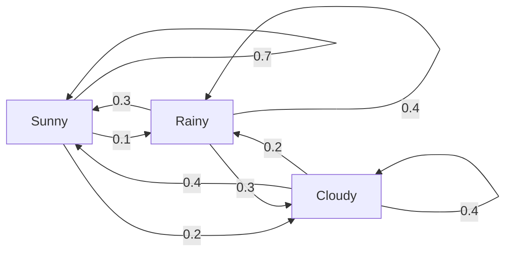
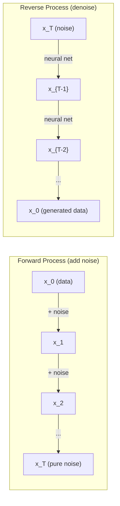

# 断过程

> 具有结构性随机性──随机行走、马科夫链和扩散模型 背后的数学──

**Type:** Learn
**Language:**字符串
**Prerequisites:** Phase 1, Lessons 06-07（probability, Bayes）
**Time:** ~75 分钟

## 学习目标
- 模拟1D和2D随机走路,并验证位移的平方
- 构建马科夫链 模拟器,并通过自己的组合 计算其静止分布
- 实现Metropoles-Hastings MCMC和Langevin动态,用于从目标分布采样
- 将前进扩散过程与布朗运动联系起来,并解释反向过程如何生成数据

## 问题
许多人工智能系统都涉及随机性随着时间的演变. 不是静态随机性,而是结构化,序列化的随机性,其中每一步都取决于之前发生的内容.

语言模型一次生成一个代币.每个代币都取决于前面的环境.模型输出一个概率分布,从中采样,然后继续.

扩散模型逐步向图像添加噪音,直到它变成纯静态噪音. 然后它们反转这个过程,逐步否定,直到出现一张新图像.

强化学习代理在环境中采取行动.每个行动都以某种概率导致一个新状态. 代理在随机世界中遵循随机政策.

采样是贝叶斯推理的支柱,它构建了一个马科夫链,其静止分布就是你想要采样后面.

所有这些都建立在四个基本思想上:
1. 随机步行  最简单的静止过程
2. 马科夫链 带有过渡矩阵的结构随机性
3.  带噪音的渐进下降
4. 城市-哈斯廷斯 从任意分布采样

## 概念
### 随机散步

从位置 0 开始──每一步,抛一枚公平硬币──正面:向右移动(+1)──反面:向左移动(-1)──

经过 n 步后,你的位置是 n 个随机 +/-1 值的总和――期望位置是 0(这个行程是无偏的) ・・・但距离原点的期望距离按平方(n) 增长――

这有点反直觉. 这步行是公平的,两个方向都没有漂移.

```
Step 0:  Position = 0
Step 1:  Position = +1 or -1
Step 2:  Position = +2, 0, or -2
...
Step 100: Expected distance from origin ~ 10 (sqrt(100))
Step 10000: Expected distance from origin ~ 100 (sqrt(10000))
```

**在 2D 中**走以相等概率向上向下向左或向右移动――从原点距离也遵循了缩放规则――路径将描绘出类似的碎片模式――

**为什么是 sqrt(n)？**每一步都以相等概率为 +1 或 -1──n 步后,位置 S_n = X_1 + X_2 + ... + X_n,其中每个 X_i 都是 +/-1──每一步的差异是 1,并且每个步都是相互独立的,所以 Var(S_n) = n──标准偏差 = sqrt(n)──根据中央限量定理,S_n / sqrt(n) 收到标准正常分布──

这种平方的缩放 放在ML 中随处可见──SGD 噪音按1/平方的量量缩放──嵌入式 维度按平方的缩放──平方根是独立随机加和的标志──

**与 Brownian motion 的联系。**取一个步骤尺寸为 1/sqrt(n) 、每单位时间的随机步行──当 n 趋近无穷时,这个步行会收到布朗运动 B(t)  一个连续时间过程,其中 B(t) 服从平均值为 0、变量为 t 的正常分布──

布朗运动是扩散的数学基础. 它描绘了体内粒子流的随机动作,股票价格的波动以及在扩散模型中的噪音过程.

**Gambler's ruin。**一个随机走者从位置 k 开始,在 0 和 N 处有吸收障碍──到达 N 早于到达 0 的概率是多少?对于公平走势:P(到达 N) = k/N──这非常简单而优雅──它连接到马丁加尔 理论  公平随机走势是一个马丁加尔 预期未来值 = 现值) 。

### 马科夫链

马科夫链是一个系统,它根据固定概率在各州之间转换.

```
P(X_{t+1} = j | X_t = i, X_{t-1} = ...) = P(X_{t+1} = j | X_t = i)
```

这就是马科夫的属性. 这意味着你可以用一个过渡矩阵 P 描述整个动态:

```
P[i][j] = probability of going from state i to state j
```

为了一个,你必须去某个地方.

**示例 —— Weather：**

```
States: Sunny (0), Rainy (1), Cloudy (2)

P = [[0.7, 0.1, 0.2],    (if sunny: 70% sunny, 10% rainy, 20% cloudy)
     [0.3, 0.4, 0.3],    (if rainy: 30% sunny, 40% rainy, 30% cloudy)
     [0.4, 0.2, 0.4]]    (if cloudy: 40% sunny, 20% rainy, 40% cloudy)
```

从任意状态开始.经过多次过渡后,状态的分布会收到静止分布 pi,其中 pi * P = pi.这是 P 的自值为 1 的左自向量.

对于天气链,静止分布可能是 [0.53,0.18,0.29] 长期来看,无论起始状态是什么,53%的时间都是阳光明的.



**计算 stationary distribution。**有两种方法:

1. **Power method**经过足够多的代后,它会收──
2. **Eigenvalue method**:找到P的本值为1的左本向量──这等于P^T的本值为1的本向量──

两种方法都要求链 满足收条件.

**收敛条件。**如果一个马科夫链 满足以下条件,它将获得唯一的静止分布:
- **Irreducible**每个州都能从任何其他州到达
- **Aperiodic**链不会有固定周期循环

你在ML中遇到的大多数链都满足了这两个条件.

**Absorbing states。**如果一旦进入某个状态就永远不会离开 (P[i][i] = 1),这个状态就是吸收的――吸收的马科夫链可用于建模带有终端状态的过程  一个结束的游戏 一个的客户 一个命中结束文本代币的代币序列――

**Mixing time。**需要多少步,链才会接近站式分布?形式化地说,就是总变化距离与静止的距离降至某个值以下所需的步数――快混合 = 需要步数少――P的光谱差距(1减第二大自值) 控制混合时间――差距越大,混合越快――

### 与语言模型的联系

语言模型 中的代币生成 近似是一个马科夫过程――给定当前的背景,模型输出下一个代币 上的分布――温度 控制敏度:

```
P(token_i) = exp(logit_i / temperature) / sum(exp(logit_j / temperature))
```

- 温度 = 1.0:标准分布
- 温度 < 1.0:更尖(更确定性)
- 温度 > 1.0:更平坦(更随机)
- 温度 -> 0:argmax(贪)

截至概率最高的 k 个代币―― 截至累积概率的最高的 k 个代币―― 截至累积概率的最小代币―― 集合―― 两者都会修改马科夫过渡概率――

### 布朗运动

随机走的连续时间限制.位置 B(t) 有三个性质:
1. 子
2. 根据平均值为0、变量为 t 的正常分布
3. 不重叠区间上的增长 相互独立

布朗运动是连续的,但处处不可微微的. 它在每个尺度上都在动.

在离散模拟中,你可以这样接近布朗运动:

```
B(t + dt) = B(t) + sqrt(dt) * z,    where z ~ N(0, 1)
```

缩放很重要. 它来自应用于随机行走的中央限量定理.

### 兰杰文动力学

渐进式下降 寻找函数的最小值――长维因动态 寻找与 exp(-U(x)/T) 成正比的概率分布,其中U是能量函数,T是温度――

```
x_{t+1} = x_t - dt * gradient(U(x_t)) + sqrt(2 * T * dt) * z_t
```

粒子上有两种作用:
1. **Gradient force**(dt *梯度(U)):推向低能量(类似的梯度下降)
2. **Random force**,,,,,,,,,,,,,,,,,,,,,,,,,,,,,,,,,,,,,,,,,,,,,,,,,,,,,,,,,,,,,,,,,,,,,,,,,,,,,,,,,,,,,,,,,,,,,,,,,,,,,,,,,,,,,,,,,,,,,,,,,,,,,,,,,,,,,,,,,,,,,,,,,,,,,,,,,,,,,,,,,,,,,,,,,,,,,,,,,,,,,,,,,,,,,,,,,,,,,,,,,,,,,,,,,,,,,,,,,,,,,,,,,,,,,,,,,,,,,,,,,,,,,,,,,,,,,,

当温度T=0时,这就是纯渐进下降――高温下,它几乎是随机走行――在合适的温度下,粒子会探索能量景观,并在低能区域停留更久――

**与 diffusion models 的联系。**扩散模型的前进过程是:

```
x_t = sqrt(alpha_t) * x_{t-1} + sqrt(1 - alpha_t) * noise
```

这是一个逐步将数据与噪音混合的马科夫链.

逆转过程 从噪音回到数据  也是一个马科夫链,但它的过渡概率由神经网络学习得到──网络学习预测每一步加入的噪音,然后将其减去──



### 马科夫链蒙特卡罗

有时你需要从一个可以求值 (允许差一个常数) 但不能直接采用样式分布 p (x) 中采样.

**Metropolis-Hastings**构建一个固定分布为 p(x) 的马科夫链:

1. 从某个位置开始
2. 从提案分配 Q(x'不时x) 提议一个新位置 x'
3. 计算接受率:a(x') *Q(x 便x') / (p(x) *Q(x'便x))
4. 以概率 min(1,a) 接受 x'──否则留在 x──
5. 复制

如果 Q 是对称的 (例如 Q     ) = Q     ) = N      )),比率可简化为 a = p   / p      概率的比率  正常化常数 会相互抵消──

在温和条件下,这个链保证收到p(x) ⋅但如果建议太小 (太大) 随机走路 (太大) ⋅高拒绝),收可能很慢.调节建议是MCMC的艺术.

**为什么它有效。**接受率 确保详细平衡:位于 x 并移动到 x 的概率,等于位于 x 的概率.

**实践注意事项：**
- **Burn-in**需要时间从起点到静止分布.
- **Thinning**为了减少自动相关性,每个样本保持一个.
- **Multiple chains**由于不同起点运行多个链,如果它们得到相同的分布,就有收获的证据.
- **Acceptance rate**对于高斯人的建议,最佳接受率大约是23%.

### 人工智能中的断过程

| Process | AI Application |
|---------|---------------|
| Random walk | RL 中的 exploration、Node2Vec embeddings |
| Markov chain | Text generation、MCMC sampling |
| Brownian motion | Diffusion models（forward process） |
| Langevin dynamics | Score-based generative models、SGLD |
| Markov decision process | Reinforcement learning |
| Metropolis-Hastings | Bayesian inference、posterior sampling |


```figure
random-walk-diffusion
```

## 构建它
### 步骤1:随机走路模拟器

```python
import numpy as np

def random_walk_1d(n_steps, seed=None):
    rng = np.random.RandomState(seed)
    steps = rng.choice([-1, 1], size=n_steps)
    positions = np.concatenate([[0], np.cumsum(steps)])
    return positions


def random_walk_2d(n_steps, seed=None):
    rng = np.random.RandomState(seed)
    directions = rng.choice(4, size=n_steps)
    dx = np.zeros(n_steps)
    dy = np.zeros(n_steps)
    dx[directions == 0] = 1   # right
    dx[directions == 1] = -1  # left
    dy[directions == 2] = 1   # up
    dy[directions == 3] = -1  # down
    x = np.concatenate([[0], np.cumsum(dx)])
    y = np.concatenate([[0], np.cumsum(dy)])
    return x, y
```

1D走路 存储累计数量――每一步是 +1 或 -1──经过 n 步后,位置就是总和──变量随着 n 线性增长,因此标准偏差按平方 增长──

### 步骤2:马科夫链

```python
class MarkovChain:
    def __init__(self, transition_matrix, state_names=None):
        self.P = np.array(transition_matrix, dtype=float)
        self.n_states = len(self.P)
        self.state_names = state_names or [str(i) for i in range(self.n_states)]

    def step(self, current_state, rng=None):
        if rng is None:
            rng = np.random.RandomState()
        probs = self.P[current_state]
        return rng.choice(self.n_states, p=probs)

    def simulate(self, start_state, n_steps, seed=None):
        rng = np.random.RandomState(seed)
        states = [start_state]
        current = start_state
        for _ in range(n_steps):
            current = self.step(current, rng)
            states.append(current)
        return states

    def stationary_distribution(self):
        eigenvalues, eigenvectors = np.linalg.eig(self.P.T)
        idx = np.argmin(np.abs(eigenvalues - 1.0))
        stationary = np.real(eigenvectors[:, idx])
        stationary = stationary / stationary.sum()
        return np.abs(stationary)
```

静止分布是P的本值为1的左本向量. 我们通过计算P^T的本向量来找到它,将左本向量转换为右本向量.

### 步骤3: 兰杰文动态

```python
def langevin_dynamics(grad_U, x0, dt, temperature, n_steps, seed=None):
    rng = np.random.RandomState(seed)
    x = np.array(x0, dtype=float)
    trajectory = [x.copy()]
    for _ in range(n_steps):
        noise = rng.randn(*x.shape)
        x = x - dt * grad_U(x) + np.sqrt(2 * temperature * dt) * noise
        trajectory.append(x.copy())
    return np.array(trajectory)
```

渐进式将 x 推向低能量――噪音 防止它陷入局部停滞――在平衡时,样本分布与 exp(-U(x) /温度) 成正比――

### 步骤4:大都会-哈斯廷斯

```python
def metropolis_hastings(target_log_prob, proposal_std, x0, n_samples, seed=None):
    rng = np.random.RandomState(seed)
    x = np.array(x0, dtype=float)
    samples = [x.copy()]
    accepted = 0
    for _ in range(n_samples - 1):
        x_proposed = x + rng.randn(*x.shape) * proposal_std
        log_ratio = target_log_prob(x_proposed) - target_log_prob(x)
        if np.log(rng.rand()) < log_ratio:
            x = x_proposed
            accepted += 1
        samples.append(x.copy())
    acceptance_rate = accepted / (n_samples - 1)
    return np.array(samples), acceptance_rate
```

算法提出了一个新点,检查它是否具有更高的概率 (或与成正比的概率接受),然后重复――为了获得良好的混合,接受率应该大约在23-50%之间――

## 使用它
实际上,你会使用成熟库来实现这些算法.

```python
import numpy as np

rng = np.random.RandomState(42)
walk = np.cumsum(rng.choice([-1, 1], size=10000))
print(f"Final position: {walk[-1]}")
print(f"Expected distance: {np.sqrt(10000):.1f}")
print(f"Actual distance: {abs(walk[-1])}")
```

### 用于过渡矩阵的 numpy

```python
import numpy as np

P = np.array([[0.7, 0.1, 0.2],
              [0.3, 0.4, 0.3],
              [0.4, 0.2, 0.4]])

distribution = np.array([1.0, 0.0, 0.0])
for _ in range(100):
    distribution = distribution @ P

print(f"Stationary distribution: {np.round(distribution, 4)}")
```

经过足够多的代后,它会得到静止分布,无论你从哪里开始.

### 与真实框架的连接

- **PyTorch diffusion：**拥抱着脸`diffusers`中中 `DDPMScheduler`实现了前进和反转的马科夫链
- **NumPyro / PyMC：**使用MCMC(NUTS样本,它是对大都市-哈斯廷斯的改进)进行贝耶斯推断
- **Gymnasium (RL)：**环境步骤函数 定义了一个马科夫决策过程

### 验证马科夫链的融合

```python
import numpy as np

P = np.array([[0.9, 0.1], [0.3, 0.7]])

eigenvalues = np.linalg.eigvals(P)
spectral_gap = 1 - sorted(np.abs(eigenvalues))[-2]
print(f"Eigenvalues: {eigenvalues}")
print(f"Spectral gap: {spectral_gap:.4f}")
print(f"Approximate mixing time: {1/spectral_gap:.1f} steps")
```

频谱差距告诉你链 忘记其初始状态的速度──差距为0.2 意思大约 5 步即可混合──差距为0.01 意思大约 100 步──运行长度模拟 之前必检查这一点  混合 很慢的链 会浪费计算──

## 交付它
本课产出:
- `outputs/prompt-stochastic-process-advisor.md` 一个提示,用于帮助识别给定问题适用于哪种类型的股票流程框架

## 联系

| Concept | Where it shows up |
|---------|------------------|
| Random walk | Node2Vec graph embeddings、RL 中的 exploration |
| Markov chain | LLMs 中的 Token generation、MCMC sampling |
| Brownian motion | DDPM 中的 forward diffusion process、SDE-based models |
| Langevin dynamics | Score-based generative models、stochastic gradient Langevin dynamics (SGLD) |
| Stationary distribution | MCMC convergence target、PageRank |
| Metropolis-Hastings | Bayesian posterior sampling、simulated annealing |
| Temperature | LLM sampling、RL 中的 Boltzmann exploration、simulated annealing |
| Mixing time | MCMC 的 convergence speed、spectral gap analysis |
| Absorbing state | End-of-sequence token、RL 中的 terminal states |
| Detailed balance | MCMC samplers 的 correctness guarantee |

扩散模型值得特别关注――DDPM(Ho et al., 2020) 定义了一个前进的马科夫链:

```
q(x_t | x_{t-1}) = N(x_t; sqrt(1-beta_t) * x_{t-1}, beta_t * I)
```

其中beta_t 是一个噪音时间表――经过T 步后,x_T 近似为N(0,I) ─ 反向过程 由一个预测噪音的神经网络参数化:

```
p_theta(x_{t-1} | x_t) = N(x_{t-1}; mu_theta(x_t, t), sigma_t^2 * I)
```

了解马科夫链意味着理解扩散模型如何以及为什么能够生成数据.

随着学习速度的衰退,SGLD将从优化转移到样本采集  你几乎免费得到近似的贝叶斯后样本――这是从神经网络获得不确定性估计的最简单方式之一――

穿过这些联系的关键洞见是:静止过程不仅仅是理论工具――它们是现代人工智能系统内部的计算机制――当你调节LLM的温度时,你正在调整一个马科夫链――当你训练扩散模型时,你正在学习反转一个类似布朗运动的过程――当你运行贝叶斯推理时,你正在构建一个接收到后的链――

## 练习
1. **模拟 1000 条 10000 步的 random walks。**绘制最终位置的分布――验证它近似为平均0、标准偏差平方rt(10000) =100的高斯人――

2. **使用 Markov chain 构建 text generator。**在一个小体上训练:对每一个词,统计到下一个词的过渡――构建过渡矩阵――通过从链中采样生成新句子――

3. **使用 Metropolis-Hastings 实现 simulated annealing。**从高温开始 (几乎接受所有内容),然后逐渐降温 (只接受改进) .

4. **比较不同 temperatures 下的 Langevin dynamics。**从双井潜力 U(x) = (x^2 - 1)^2 中采样――低温时,样本集在一个井中――高温时,它们分布在两个井中――找到链在井中混合的关键温度――

5. **实现 forward diffusion process。**从一个1D信号 (例如,波) 开始――使用线性噪音时间表,在100步中逐渐增加噪音――展示信号如何退化为纯噪音――然后实现简单的指标来反转这个过程――即使是仅仅减小估计的噪音的天真版本也可以)

## 关键术语
| Term | What people say | What it actually means |
|------|----------------|----------------------|
| Random walk | “抛硬币式移动” | 一个 position 在每一步按随机 increments 改变的过程 |
| Markov property | “无记忆性” | future 只依赖当前 state，而不依赖 history |
| Transition matrix | “概率表” | P[i][j] = 从 state i 移动到 state j 的概率 |
| Stationary distribution | “长期平均” | 满足 pi*P = pi 的分布 pi —— chain 的 equilibrium |
| Brownian motion | “随机抖动” | random walk 的 continuous-time limit，B(t) ~ N(0, t) |
| Langevin dynamics | “带噪声的 Gradient Descent” | 结合 deterministic Gradient 与 random perturbation 的 update rule |
| MCMC | “向目标行走” | 构造一个 stationary distribution 为你想要的分布的 Markov chain |
| Metropolis-Hastings | “提议并接受/拒绝” | 使用 acceptance ratios 来确保收敛的 MCMC algorithm |
| Temperature | “随机性旋钮” | 控制 exploration 与 exploitation 之间权衡的参数 |
| Diffusion process | “噪声进，噪声出” | Forward：逐渐添加 noise。Reverse：逐渐移除 noise。生成 data。 |

## 延伸阅读
- **Ho, Jain, Abbeel (2020)**                                                                                                                                                                                                                                                              
- **Song & Ermon (2019)** 通过估计数据分布的基梯进行生成模型.
- **Roberts & Rosenthal (2004)** 一般状态空间马科夫链和MCMC算法.
- **Norris (1997)** 马科夫链. 标准教材――涵盖缩,静止分布和击中时间――
- **Welling & Teh (2011)** 通过斯托卡斯式渐进式兰杰文动态学习. 将SGD与兰杰文动态结合,用于可扩展的兰杰文推理.
