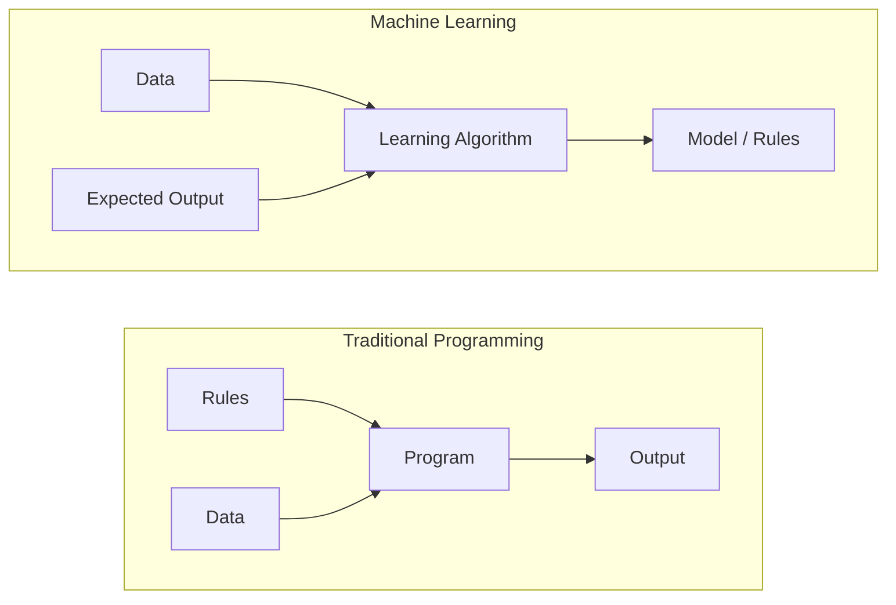
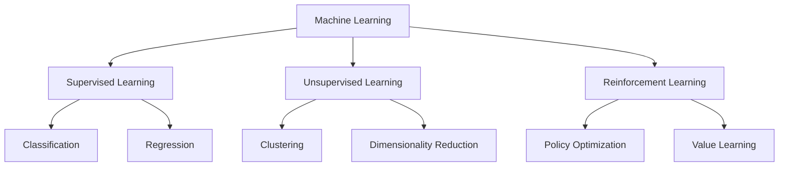
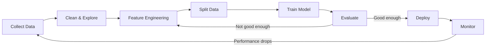
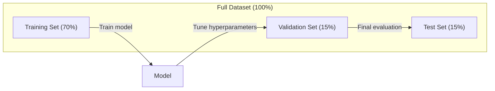
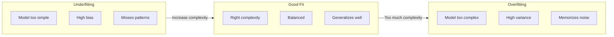
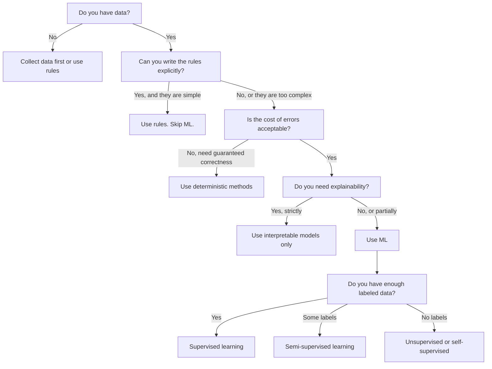

# 什么是机器学习

> 机器学习是计算机在数据中寻找模式,而不是手写规则.

**类型：**学习 课程
**语言：**字符串
**先修要求：**第一个阶段 (数学基础)
**时间：**约45分钟

## 学习目标

- 解释监督和不监督和加强学习的区别,并判断给定问题适用于哪种类型
- 从零实现最接近的中位数分类器,并没有使用随机基线来评估它
- 区分 分类 和 逆转 任务,并为每种任务选择合适的损失函数
- 评估确定业务问题是否适合使用 ML,还是更适合确定性规则解决

## 问题

你想建立垃圾邮件过器. 传统做法是:坐下来写几百条规则. 如果邮件包含"免费的钱",标记为垃圾邮件. 如果它有超过3个感叹号,标记为垃圾邮件.

机器学习改变了这种方式――你不再写规则,而是给计算机数千封标签的邮件 (垃圾邮件或不垃圾邮件),让它自己找到规则――计算机会发现你从未想过的模式――当垃圾邮件发送者改变策略时,你用新数据重新训练,而不是重写代码――

机器学习的核心是从编写规则到数据学习的转变.

## 概念

### 从数据中学习,而不是从规则中学习

传统编程和机器学习以相反的方向解决问题.



传统编程:你编写规则.程序把规则应用到数据上并产生输出.

机器学习:你提供数据和期望输出.

训练的模型 本身就是规则,以数字形式编码的重量,参数.

### 机器学习的三种类型



**Supervised Learning**您有输入输出对.
- 这里有1万张标签的照片猫或狗.
- 这里有房屋特征和价格──学会预测价格──

**Unsupervised Learning**你只有输入.没有标签.
- 这里有1万条客户购买历史.
- 这里有1000维的数据点.

**Reinforcement Learning**经理在环境中采取行动,并获得奖励或惩罚.
- 玩这个游戏,赢得+1,输掉−1......找出策略.
- 控制机器手臂. 拿起物体. 每秒浪费.

你在实践中构建的大多数内容都会使用监督学习――无监督学习常用于预处理和探索――加强学习 支游戏 AI、机器人技术,以及语言模型中的RLHF――

### 超越三大类型

上面的三类很清楚,但真实的世界ML经常会模糊边界.

**Semi-supervised learning**使用一小部分标记数据和大量的未标记数据──你可能有100张带标签的医学图像和10万张未标签的图像──技术包括:

- **Label propagation：**构建一个连接相似数据点的图――标签 通过图从标记节点传播到未标记的邻居――
- **Pseudo-labeling：**在标记数据上训练模型,使用它预测未标记数据的标签,然后在全部数据上重新训练――模型会启动自己的训练集――
- **Consistency regularization：**对于一个输入和其轻微扰动版本,模型应该给出相同的预测.

**Self-supervised learning**从数据本身创建监督――完全不需要人工标签――模型根据数据结构创建自己的预测任务――

- **Masked language modeling (BERT)：**隐藏句子中 15% 的词,训练模型 预测缺失的词──标签 来自原始文本──
- **Contrastive learning (SimCLR)：**取一张图像,创建两个增强版本――训练模型 识别它们来自同一张图像,同时将它们与其他图像的增强版本区分开――
- **Next-token prediction (GPT)：**给定前面的所有词,预测下一个词――每个文本文档都会成为一个训练样本――

这些不是独立于三大类别之外的类别.它们是结合监督和无监督思路的策略.

### 归类与回归

这两个主要的监督学习任务.

| 方面 | Classification | Regression |
|--------|---------------|------------|
| 输出 | 离散类别 | 连续数值 |
| 示例 | “这封邮件是垃圾邮件吗？” | “房价会是多少？” |
| 输出空间 | {cat, dog, bird} | 任意实数 |
| Loss Function | Cross-entropy, accuracy | Mean squared error, MAE |
| 决策 | 类别之间的边界 | 拟合数据的曲线 |

类别 答案 属于哪个类别? 退回 答案 多少?

预测股票上或下跌是分类的.

### 工作流

每个机器学习项目都遵循相同的管道,无论使用什么算法.



**Collect Data**收集原始数据. 更多数据几乎总是更好,但质量比数量更重要.

**Clean & Explore**处理缺值,删除重复项,可视化分布,发现异常.

**Feature Engineering**转换为星期几. 归纳数值列. 编码类别变量. 好的功能比花哨的算法更重要.

**Split Data**训练数据上训练,你在验证数据上调度超参数,并在测试数据上报告最终表现――

**Train Model**输入算法――算法调整内部参数,以最小化损失函数――

**Evaluate**通过验证/测试数据上测量性能. 如果性能不可接受,就回去尝试不同的功能,算法或超参数.

**Deploy**让模型进入生产环境,让它对新数据进行预测.

**Monitor**持续跟踪性能,数据分布会变化,模型会退化,当性能下降时,重新训练.

### 培训,验证和测试

这是一个初学者最容易错误的关键概念. 你必须在训练期间从未见过的数据模型评估.



| 划分 | 目的 | 使用时机 | 典型大小 |
|-------|---------|-----------|-------------|
| Training | model 从这些数据中学习 | 训练期间 | 60-80% |
| Validation | 调整 hyperparameter、比较 model | 每次训练运行之后 | 10-20% |
| Test | 最终无偏 performance 估计 | 只在最后使用一次 | 10-20% |

测试组是神圣的. 你只能看一次. 如果你根据测试性能调整模型,你实际上在测试组上训练,你的报告数字也就没有意义.

对于小数据集,使用k倍交叉验证:把数据分成k 份,在k-1 份训练,在剩余1 份验证,轮换进行,并对结果取平均.

### 过度适应与不足



**Underfitting**模型 太简单,无法捕捉数据中的模式――就像用一条直线去适应曲关系――训练错误 高――测试错误 也高――

**Overfitting**模型太复杂了,记住了训练数据,包括其中的噪音.

**Good fit**模型 捕捉真实模式,不记忆噪音――训练错误和测试错误都相对较低――

过度适应的迹象:
- 训练精度远高于验证精度
- 在训练数据上表现良好,但在新数据上表现很差
- 增加更多的训练数据 会提升性能 (原本是记忆而不是学习)

修复过装:
- 获取更多培训数据
- 降低模型复杂性 ((更少参数、更简单的架构)
- 规范化 (对较大的重量加加惩罚)
- 放弃炼期间随机将神经元置零)
- 早期停止 (当验证错误 开始上升时停止训练)

修复 适配不良:
- 使用更复杂的模型
- 添加更多功能
- 降低规律化
- 训练更久

### 偏差差差异

这就是超级适合和低级的数学框架.

**Bias**错误假设的错误. 当真实关系不线性时,线性模型会有高偏见.

**Variance**训练数据中微小波动敏感性错误――高差异性模型 在不同数据集上训练时,会给出非常不同的预测――高差异性会导致过度适应――

| Model complexity | Bias | Variance | 结果 |
|-----------------|------|----------|--------|
| 过低（用 linear model 拟合弯曲数据） | High | Low | Underfitting |
| 刚好合适 | Medium | Medium | 良好的 generalization |
| 过高（用 degree-20 polynomial 拟合 10 个点） | Low | High | Overfitting |

总错误 = 偏差^2 + 变异 + 无约噪音

你不能降低不可减排的噪音. 它本身就是数据的随机性.

### 没有免费午餐理论

没有一个对所有问题最优的单一算法. 在某种类别的问题上表现良好的算法,在另一类问题上可能表现差.

实践中,选择取决于:
- 你有多少数据
- 有多少特征
- 关系是线性还是非线性
- 是否需要解释性
- 你能承担多少计算资源

### 什么时候不要使用机器学习

在使用模型之前,首先问自己是否真的需要它.

**不要在以下情况下使用 ML：**

- **规则简单且定义明确。**税费计算、排序算法、单位转换――如果你能用几个 if-语句写出逻辑,模型只会增加复杂性,而没有收益――
- **你没有数据或数据很少。**只有10个数据点,无法训练出有意义的东西.
- **错误成本是灾难性的，并且你需要保证正确性。**医疗剂量计算,核反应堆控制,密码学验证,ML模型是概率性的.
- **lookup table 或 heuristic 可以解决问题。**如果一个简单的门或表 覆盖了99%的情况,添加ML将增加维护成本,但没有任何有意义的改进.
- **你无法解释决策，而 explainability 又是必需的。**监管行业 (借贷,保险,刑事司法) 有时要求每个决策都能得到完整的解释.
- **问题变化得比你重新训练还快。**如果规则每天都变化,重新训练需要一周,

使用这个决策流程图:




```figure
f3-learning-boundary
```

## 构建它

`code/ml_intro.py`中代码从零实现了最接近的中位数分类器,这是最简单的 ML 算法――它展示了核心思想:从数据中学习,然后对新数据进行预测――

### 步骤1:从零实现最接近的中位数分类器

最近的中心分类器 会计算训练数据 中每个类的中心 (中) 平均) ⋅预测时,它将每个新点分配给离最近的中心所属的类的距离――

```python
class NearestCentroid:
    def fit(self, X, y):
        self.classes = np.unique(y)
        self.centroids = np.array([
            X[y == c].mean(axis=0) for c in self.classes
        ])

    def predict(self, X):
        distances = np.array([
            np.sqrt(((X - c) ** 2).sum(axis=1))
            for c in self.centroids
        ])
        return self.classes[distances.argmin(axis=0)]
```

这就是整个算法. 算法两个意思. 预测 计算距离. 没有渐进下降,没有反复,没有超参数.

### 步骤2:在合成数据上训练

我们生成了一个2D分类数据集,其中两个类有轻微重叠――中位数分类器会在类中心之间绘制一条线性决策界限――

```python
rng = np.random.RandomState(42)
X_class0 = rng.randn(100, 2) + np.array([1.0, 1.0])
X_class1 = rng.randn(100, 2) + np.array([-1.0, -1.0])
X = np.vstack([X_class0, X_class1])
y = np.array([0] * 100 + [1] * 100)
```

### 步骤3:与基线相比

每个ML模型都应该与一个简单的基线相比. 这里的基线会随机预测一个类.

```python
baseline_preds = rng.choice([0, 1], size=len(y_test))
baseline_acc = np.mean(baseline_preds == y_test)
```

在这个净数据集中,中位数分类器应该达到90%+的准确度.

### 为什么这很重要?

它没有超参数,没有代,没有渐进下降,但它捕捉了基本的 ML 模式:

1. 从培训数据中**学习**一种表示(中心)
2. 使用该表示对新数据进行**预测**(最接近距离)
3. 与基线进行**评估**现在,我们要做什么?

每个ML算法,从物流回归到变压器,都遵循相同的三步模式――表示会变得更复杂,但工作流保持不变――

### 步骤4:Centroid分类器做不到什么

假设每个类都形成一个单一的斑点. 它描绘出的是线性决定边界. 它在以下情况下会失败:

- 类有多个集群 (例如数字1 可以用几种不同的方式写书)
- 决策界限是非线性的 (例如一个类包围另一个类)
- 区别很大 (区别很大)

这些限制引发了你将学习的其他所有算法――K-近邻可以处理多个集群――决策树可以处理非线性边界――特征扩展可以修复规模――问题――每个课程都建立在上一课的限制之上――

## 使用它

提供 提供`NearestCentroid`和合成数据生成器:

```python
from sklearn.neighbors import NearestCentroid
from sklearn.datasets import make_classification
from sklearn.model_selection import train_test_split

X, y = make_classification(
    n_samples=500, n_features=2, n_redundant=0,
    n_clusters_per_class=1, random_state=42
)
X_train, X_test, y_train, y_test = train_test_split(X, y, test_size=0.3)

clf = NearestCentroid()
clf.fit(X_train, y_train)
print(f"Accuracy: {clf.score(X_test, y_test):.3f}")
```

## 交付它

本课会生成`outputs/prompt-ml-problem-framer.md`我们想减少下一个季度的或预测需求),它会识别学习类型,定义预测目标,列出候选人特征,选择成功指标,建立基线,并标记数据泄露或类分类失衡等陷. 在任何ML项目开始时使用它,以避免构建错误的东西.

## 关键术语

| 术语 | 人们常说 | 实际含义 |
|------|----------------|----------------------|
| Model | “The AI” | 一个带有可学习 parameter 的数学函数，用于把输入映射到输出 |
| Training | “Teaching the AI” | 运行 optimization algorithm 来调整 model parameter，使预测匹配已知输出 |
| Feature | “An input column” | 数据中可测量的属性，model 用它进行预测 |
| Label | “The answer” | training example 的已知输出，用于计算 error signal |
| Hyperparameter | “A setting you tweak” | 训练前设置的 parameter，用于控制学习过程（learning rate、layer 数量） |
| Loss Function | “How wrong the model is” | 衡量预测输出与实际输出之间差距的函数，训练会尝试将其最小化 |
| Overfitting | “It memorized the test” | model 学到了 training-specific noise，而不是通用模式，因此在新数据上失败 |
| Underfitting | “It didn't learn anything” | model 太简单，无法捕捉数据中的真实模式 |
| Generalization | “It works on new data” | model 对未训练过的数据做出准确预测的能力 |
| Cross-validation | “Testing on different chunks” | 反复把数据拆分为 train/test fold 并对结果取平均，从而得到更稳健的 performance 估计 |
| Regularization | “Keeping weights small” | 向 Loss Function 添加 penalty term，以抑制过于复杂的 model |
| Data drift | “The world changed” | 传入数据的统计分布随时间发生变化，导致 model performance 下降 |

## 练习

1. 选择任意数据集 (例如Iris、Titanic) 按70/15/15 拆分为火车/验证/测试.
2. 列出三个真实世界问题. 对每个问题,判断它是分类,退缩还是集群,以及它是监督还是不受监督.
3. 一种模型在训练数据上达到99%的准确性,但在测试数据上只有60%的诊断问题,并列出你会尝试的三种修复方法.

## 延伸阅读

- [An Introduction to Statistical Learning](https://www.statlearning.com/)- 免费教材,覆盖所有经典的 ML 方法,并配有实践示例
- [Google's Machine Learning Crash Course](https://developers.google.com/machine-learning/crash-course)- 对 ML 概念的简单可见介绍
- [Scikit-learn User Guide](https://scikit-learn.org/stable/user_guide.html)- 在Python实现ML的实用参考
