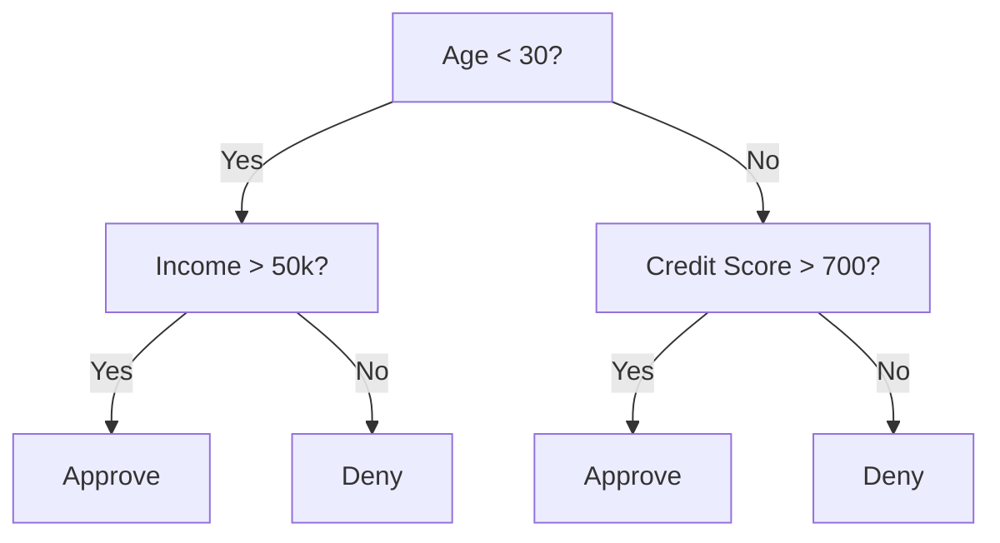
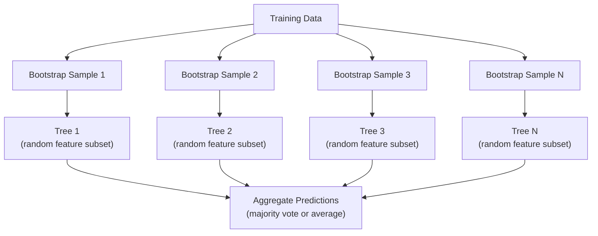

# 决策树和随机森林

> 决策树只是一个流程图,但由许多树木组成的森林,是 ML 中最强大的工具之一.

**类型：**建立
**语言：**字符串
**先修要求：**阶段1 ((09课,信息理论,06概率)
**时间：**约90分钟

## 学习目标

- 实现基尼杂质,化和信息获取 计算,以找到最佳的决策树分区
- 从零构建一个决策树分类器,并加入预剪切控制最大深度、分钟样本)
- 使用启动线样本和特征随机化 构建随机森林,并解释为什么它能降低变异
- 与变量重要性相比,并识别MDI有何时存在偏见

## 问题

你有表格数据,行是样本,列是功能,还有一个你想预测的目标列.你可以直接上一个神经网络.但是对于表格数据,树基模型,决定树木,随机森林,渐进增强树木,持续优于深度学习.

为什么?树木 无需预处理 就能处理混合特征 类型 数和类型) 它们无需特征工程 就能处理非线性关系──它们具有解释性:你可以看树,准确看到某种预测是如何产生──而随机森林会对许多树木 寻求平均,对中等规模的数据集上层过度配件具有很强的抵抗力──

本课程将使用复制分离从零构建决策树,然后在上面构建随机森林──你将实现分离标准 背后的数学(基因杂质、透、获取信息),并理解为什么一群弱的学习者会变成强大的学习者──

## 核心概念

### 决策树做什么

通过提出一系列的"是/否"问题,把特征空间分为矩形区域.



每个内部节点都会使用一个门测试某种特性. 每个叶节点做出预测.

树通过上下的方式构建:在每个节点中,选择最能分离数据的特征和门.

### 分类标准:衡量杂质

在每个节点,我们有一个样本组. 我们希望它们被分开,使生成的儿童节点尽可能纯净,也就是说每个孩子主要包含一个类.

**Gini impurity**测量是:如果按照该节点的类分布给一个随机选择的样本贴标签,它被错误分类的概率.

```
Gini(S) = 1 - sum(p_k^2)

where p_k is the proportion of class k in set S.
```

对于纯节点 (全部属于同一个类),Gini = 0──对于50/50类的二进制分区,Gini = 0.5──越低越好──

```
Example: 6 cats, 4 dogs

Gini = 1 - (0.6^2 + 0.4^2) = 1 - (0.36 + 0.16) = 0.48
```

**Entropy**衡量节点 中的信息量(混乱程度) ・第一阶段 第09课已覆盖――

```
Entropy(S) = -sum(p_k * log2(p_k))
```

对于纯节点,值=0──对于50/50二进制分区,值=1.0──越低越好──

```
Example: 6 cats, 4 dogs

Entropy = -(0.6 * log2(0.6) + 0.4 * log2(0.4))
        = -(0.6 * -0.737 + 0.4 * -1.322)
        = 0.442 + 0.529
        = 0.971 bits
```

**Information gain**是分开后度度或基因的降低量.

```
IG(S, feature, threshold) = Impurity(S) - weighted_avg(Impurity(S_left), Impurity(S_right))

where the weights are the proportions of samples in each child.
```

每个节点上的贪算法:尝试每一个特征和每个可能的门.`(feature, threshold)`组合.

### 分开 如何工作

对于当前节点上包含n 个特征 m 个样本的数据集:

1. 对每个特征 j(j = 1 到 n):
   - 按特征 j 对样本排序
   - 将相邻不同取值之间的每个中点作为门
   - 计算每个门的信息获取
2. 选择信息获取最高特征和门
3. 将数据分为左面的特征 <=门) 和右面的特征 >门)
4. 对每一个孩子的递归执行

这种贪方法不保证得到全局最好的树.寻找最好的树是 NP-hard.

### 停止条件

如果没有停止条件,树会一直生长,直到每一张叶都纯净了.

**Pre-pruning**在树上会成长之前停止:
- 树 达到设定深度 时停止分裂
- 每叶子的最小样本:如果某个节点的样本少于 k,则停止
- 最少信息获取:如果最好的污染改善小于某个门,则停止
- 最多叶子节点:限制叶子的总数

**Post-pruning**首先生成完整的树,然后再向回修剪:
- 成本复杂性剪裁 (剪裁) 简单学习 使用:加入一个与叶子数量成正比的罚款.
- 减少错误剪裁:如果移除一个子树不会增加验证错误,就移除它

切割前更简单也更快. 切割后通常会产生更好的树木,因为它不会过早停止后续可能带来有用的分支.

### 根据回归的决定树

对于回归,叶子预测是该叶子中目标值的平均值.

**Variance reduction**替代信息获取:

```
VR(S, feature, threshold) = Var(S) - weighted_avg(Var(S_left), Var(S_right))
```

选择使变量 降低最大的分区. 树将输入空间分为多个区域,并在每个区域预测一个常数 (平均值) △.

### 随机森林:集体的力量

单棵决策树 具有高差异性――数据中的微小变化可能产生完全不同的树木――随机森林 通过许多树木 寻求平均来解决这个问题――



两种随机性 让树木多样性:

**Bagging（bootstrap aggregating）：**每棵树都在一个杆样本上训练,也就是从训练数据中进行放回随机抽取样本.

**Feature randomization：**在每次分区时,只考虑一个随机的特征子集.对于分类,默认是 sqrt(n_特征) 对于回归,是 n_特征/3──这会防止所有树木都在同一主导特征上分区.

关键洞见:对许多非相关树木 求平均,可以在不增加偏见的情况下降低差异.

### 功能重要性

随机森林天然提供重要分数――最常见的方法:

**Mean Decrease in Impurity (MDI)：**总量 总量 总量 总量 总量 总量 总量 总量 总量 总量 总量 总量 总量 总量 总量 总量 总量 总量 总量 总量 总量 总量 总量 总量 总量 总量 总量 总量 总量 总量 总量 总量 总量 总量 总量 总量 总量 总量 总量 总量 总量 总量 总量 总量 总量 总量 总量 总量 总量 总量 总量 总量 总量 总量 总量 总量 总量 总量 总量 总量 总量 总量 总量 总量 总量 总量 总量 总量 总量 总量 总量 总量 总量 总量 总量 总量 总量 总量 总量 总量 总量 总量 总量 总量 总量 总量 总量 总量 总量 总量 总量 总量 总量 总量 总量 总量 总量 总量 总量 总量 总量 总量 总量 总量 总量 总量 总量 总量 总量 总量 总量 总量 总量 总量 总量 总量 总量 总量 总量 总量 总量

```
importance(feature_j) = sum over all nodes where feature_j is used:
    (n_samples_at_node / n_total_samples) * impurity_decrease
```

这种方法很快 (即可计算) 在训练期间,但会偏向高cardinality特性以及具有许多可能的分点的特性.

**Permutation importance**是另一种方法:打乱某个特征的值,并衡量模型的准确性下降了多少――它更可靠,但更慢――

### 树何时胜过神经网络

树木和森林在表格数据上通常胜过神经网络.

| Factor | Trees | Neural networks |
|--------|-------|----------------|
| Mixed types (numeric + categorical) | 原生支持 | 需要 encoding |
| Small datasets (< 10k rows) | 表现良好 | 容易 overfit |
| Feature interactions | 通过 splitting 找到 | 需要 architecture design |
| Interpretability | 完全透明 | Black box |
| Training time | 分钟级 | 小时级 |
| Hyperparameter sensitivity | 低 | 高 |

当数据具有空间或序列结构时,神经网络更强.对于平面特征表,树木是默认选择.


```figure
decision-tree-depth
```

## 构建它

### 步骤1:基尼杂质和化

从零构建到零构建, 并验证它们对哪些分裂是好的分离的判断一致.

```python
import math

def gini_impurity(labels):
    n = len(labels)
    if n == 0:
        return 0.0
    counts = {}
    for label in labels:
        counts[label] = counts.get(label, 0) + 1
    return 1.0 - sum((c / n) ** 2 for c in counts.values())

def entropy(labels):
    n = len(labels)
    if n == 0:
        return 0.0
    counts = {}
    for label in labels:
        counts[label] = counts.get(label, 0) + 1
    return -sum(
        (c / n) * math.log2(c / n) for c in counts.values() if c > 0
    )
```

### 步骤2:找到最佳分区

尝试每个功能和每个门──回报信息获取最高的.

```python
def information_gain(parent_labels, left_labels, right_labels, criterion="gini"):
    measure = gini_impurity if criterion == "gini" else entropy
    n = len(parent_labels)
    n_left = len(left_labels)
    n_right = len(right_labels)
    if n_left == 0 or n_right == 0:
        return 0.0
    parent_impurity = measure(parent_labels)
    child_impurity = (
        (n_left / n) * measure(left_labels) +
        (n_right / n) * measure(right_labels)
    )
    return parent_impurity - child_impurity
```

### 步骤3:构建决策树类

循环分化,预测和特征重点跟踪

```python
class DecisionTree:
    def __init__(self, max_depth=None, min_samples_split=2,
                 min_samples_leaf=1, criterion="gini",
                 max_features=None):
        self.max_depth = max_depth
        self.min_samples_split = min_samples_split
        self.min_samples_leaf = min_samples_leaf
        self.criterion = criterion
        self.max_features = max_features
        self.tree = None
        self.feature_importances_ = None

    def fit(self, X, y):
        self.n_features = len(X[0])
        self.feature_importances_ = [0.0] * self.n_features
        self.n_samples = len(X)
        self.tree = self._build(X, y, depth=0)
        total = sum(self.feature_importances_)
        if total > 0:
            self.feature_importances_ = [
                fi / total for fi in self.feature_importances_
            ]

    def predict(self, X):
        return [self._predict_one(x, self.tree) for x in X]
```

### 步骤 4:构建随机森林类

预测测测量,特征随机化和多数投票.

```python
class RandomForest:
    def __init__(self, n_trees=100, max_depth=None,
                 min_samples_split=2, max_features="sqrt",
                 criterion="gini"):
        self.n_trees = n_trees
        self.max_depth = max_depth
        self.min_samples_split = min_samples_split
        self.max_features = max_features
        self.criterion = criterion
        self.trees = []

    def fit(self, X, y):
        n = len(X)
        for _ in range(self.n_trees):
            indices = [random.randint(0, n - 1) for _ in range(n)]
            X_boot = [X[i] for i in indices]
            y_boot = [y[i] for i in indices]
            tree = DecisionTree(
                max_depth=self.max_depth,
                min_samples_split=self.min_samples_split,
                max_features=self.max_features,
                criterion=self.criterion,
            )
            tree.fit(X_boot, y_boot)
            self.trees.append(tree)

    def predict(self, X):
        all_preds = [tree.predict(X) for tree in self.trees]
        predictions = []
        for i in range(len(X)):
            votes = {}
            for preds in all_preds:
                v = preds[i]
                votes[v] = votes.get(v, 0) + 1
            predictions.append(max(votes, key=votes.get))
        return predictions
```

完整实现及所有辅助方法 见`code/trees.py`,我知道.

## 使用它

用小刀学习,训练随机森林只需三行:

```python
from sklearn.ensemble import RandomForestClassifier
from sklearn.datasets import load_iris
from sklearn.model_selection import train_test_split

X, y = load_iris(return_X_y=True)
X_train, X_test, y_train, y_test = train_test_split(X, y, random_state=42)

rf = RandomForestClassifier(n_estimators=100, random_state=42)
rf.fit(X_train, y_train)
print(f"Accuracy: {rf.score(X_test, y_test):.4f}")
print(f"Feature importances: {rf.feature_importances_}")
```

在实践中,渐进增强的树木 (XGBoost、LightGBM、CatBoost) 通常比随机森林更强,因为它们按照顺序构建树木,每个树都在纠正前面树木的错误.

## 交付它

本课会产出 `outputs/prompt-tree-interpreter.md`作为一个用于业务相关方解释决策树分的提示. 输入到已训练有素树的结构,它将模型转化为通俗规则,对特征的重要性排序,标记过度合或泄漏,并推下一步行动.

## 练习

1. 在包含3个类的2D数据集上训练单棵决策树――手动追踪分区,并绘制矩形决策边界――比较最大_深度=2 与最大_深度=10 时的边界――

2. 为回归树实现变量减少分离――为200个点生成 y = sin(x) +噪音,并适合你的回归树――将树的零件-常数预测与真曲线一起绘图――

3. 构建包含1、5、10、50 和200棵树的随机森林――绘制训练精确性和测试精确性 随着树木数量变化的曲线――观察测试精确性会达到平台期,但不会下降――森林 抵抗过度合)

4. 在5个不同的数据集中,比较基尼杂质与化 作为分类标准的表现――衡量准确性和树深度――大多数情况下,它们会产生几乎相同的结果――解释原因――

5. 实现变量重要性――在一个数据集上将它与MDI的重要性比较,其中一个特征是随机噪音,但具有高的特点――MDI会把噪音特征排得很高――变量重要性 不会――

## 关键术语

| Term | 人们常说 | 实际含义 |
|------|----------------|----------------------|
| Decision tree | “用于 predictions 的流程图” | 一种通过学习一系列 if/else splits，将 feature space 划分为矩形区域的 model |
| Gini impurity | “node 有多混杂” | 在某个 node 上 misclassify 一个 random sample 的概率。0 = pure，0.5 = binary 情况下的最大 impurity |
| Entropy | “node 中的混乱程度” | node 上的信息量。0 = pure，1.0 = binary 情况下的最大 uncertainty。来自 information theory |
| Information gain | “split 有多好” | split 后 impurity 的降低量。用于选择 splits 的 greedy criterion |
| Pre-pruning | “提前停止 tree” | 通过设置 max depth、min samples 或 min gain thresholds，提前停止 tree growth |
| Post-pruning | “事后修剪 tree” | 先生成完整 tree，再移除不会提升 validation performance 的 subtrees |
| Bagging | “在随机 subsets 上训练” | Bootstrap aggregating。在不同的有放回 random sample 上训练每个 model |
| Random forest | “一堆 trees” | Decision trees 的 ensemble，每棵 tree 都在 bootstrap sample 上训练，并在每次 split 使用 random feature subsets |
| Feature importance (MDI) | “哪些 features 重要” | 每个 feature 贡献的总 impurity decrease，在所有 trees 和 nodes 上求和 |
| Permutation importance | “打乱后检查” | 随机打乱某个 feature 的 values 时 accuracy 的下降量。对于 noisy features，比 MDI 更可靠 |
| Variance reduction | “info gain 的 regression 版本” | Information gain 的 regression tree 对应形式。选择使 target variance 降低最多的 split |
| Bootstrap sample | “带重复的 random sample” | 从原始 dataset 中有放回抽取得到的 random sample。大小相同，但包含 duplicates |

## 延伸阅读

- [Breiman: Random Forests (2001)](https://link.springer.com/article/10.1023/A:1010933404324)- 原始随机森林论文
- [Grinsztajn et al.: Why do tree-based models still outperform deep learning on tabular data? (2022)](https://arxiv.org/abs/2207.08815)- 关于树木与神经网络的表现严格比较
- [scikit-learn Decision Trees documentation](https://scikit-learn.org/stable/modules/tree.html)- 带可视化工具的实践指南
- [XGBoost: A Scalable Tree Boosting System (Chen & Guestrin, 2016)](https://arxiv.org/abs/1603.02754)- 主导 曲的梯度增强论文
