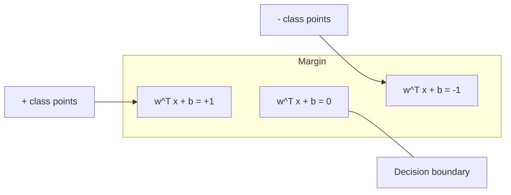
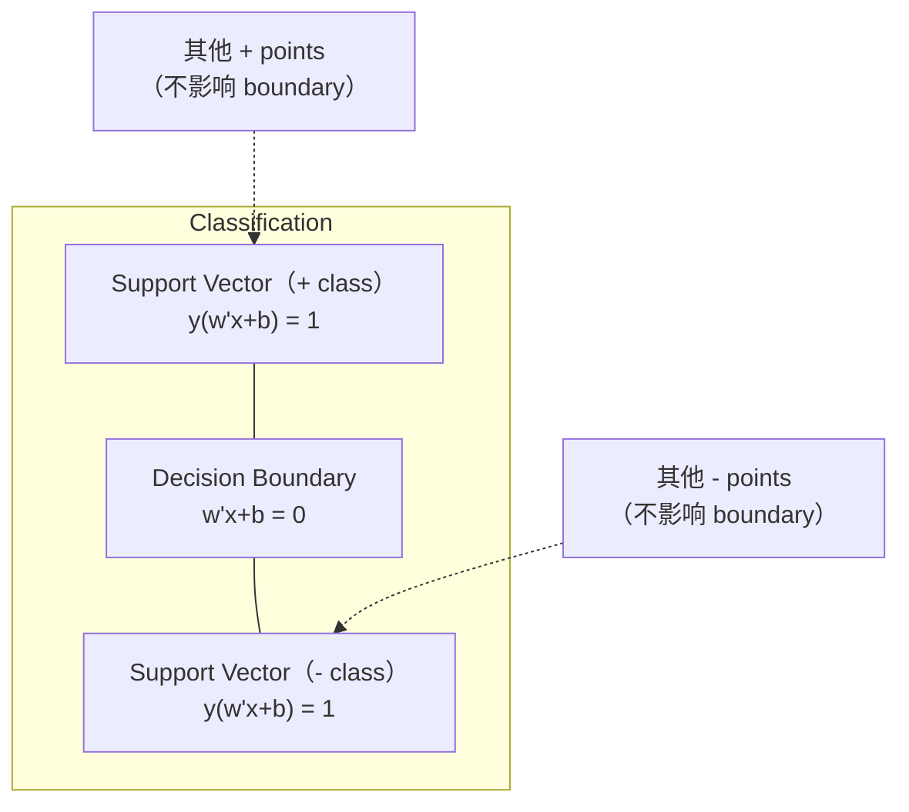
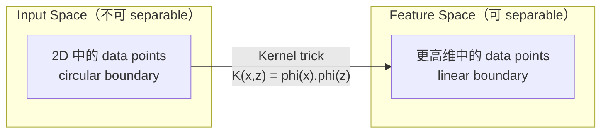

# 支持向量机

> 在两个类别之间找到最宽的街道.

**Type:** Build
**Language:**字符串
**先修要求：**阶段1 ((08课时优化,14条规范和距离,18条曲优化)
**Time:** ~90 分钟

## 学习目标
- 使用链损失和原始配方上层梯度下降,从零实现一个线性SVM
- 解释最大边缘原则,并从训练好的模型中识别支持向量
- 比较线性数和RBF核,并解释核技巧 如何避免显而易见的高维映射
- 评估由C参数控制的边际宽度与分类错误之间的权衡

## 问题
你有两个类型的数据点,需要画一个直线 (或超平面) 将它们分开.

选择边界 最大的那一条──边界是决定边界与两侧最近数据点之间的距离──更宽的边界意味着分类者更有信心,并且可以更好地将未见数据概括──

这种直觉引发了支持向量机,它是ML中数学中最优秀的算法之一.SVM在深度学习之前曾是主导的分类方法,并且在小数据集,高维数据以及需要有原则,充分理解,具有理论保证的模型问题中,仍然是最佳选择.

直接连接到第一阶段:优化是形的 (第18课),边缘使用规范来量度 (第14课),而内核技巧是利用点产品,在不真正计算高维空间的情况下处理非线性界限.

## 概念
### 最大的间隔分类器

给定{-1, +1} 和特征向量 x_i 的线性可分离数据,我们希望找到一个超平面 w^T x + b = 0 来分离类别.

距离高平面是:

```
distance = |w^T x_i + b| / ||w||
```

对于正确分类点:y_i * (w^T x_i + b) > 0──边缘是从超平面到任一侧最近点距离的两倍──



优化问题:

```
maximize    2 / ||w||     (margin width)
subject to  y_i * (w^T x_i + b) >= 1  for all i
```

等地(最小化更低的价格:

```
minimize    (1/2) ||w||^2
subject to  y_i * (w^T x_i + b) >= 1  for all i
```

这是一个形的方形程序――它有一个唯一的全球解决方案――正好位于边界的数据点上面.其中的 y_i * (w^T x_i + b) = 1) 是支持向量――它们是唯一决定决定的决定界限的点――移动或删除任何非支持向量点,界限不会改变――

### 支持向量:关键的少数点



大多数训练点都无关紧要. 只有支持向量重要. 这就是为什么SVM在预测时间中具有效率:你只需要存储支持向量,而不是整个训练集.

支持向量的数量也给出了通用错误的界限.

### 软边缘: 使用C参数 处理噪音

真实数据很少是完全可分离的. 有些点可能在边界的错误一边,或者位于边界内部.

```
minimize    (1/2) ||w||^2 + C * sum(xi_i)
subject to  y_i * (w^T x_i + b) >= 1 - xi_i
            xi_i >= 0  for all i
```

宽松变量 xi_i 衡量点 i 违反利率的程度──C 控制这种交易:

| C value | Behavior |
|---------|----------|
| Large C | 对 violations 施加重罚。margin 窄，misclassifications 更少。Overfits |
| Small C | 允许更多 violations。margin 宽，misclassifications 更多。Underfits |

C 是规律化强度的倒数――大 C = 更少的规律化――小 C = 更多的规律化――

### 损失:SVM 的损失函数

软边缘SVM可以重写为无限制优化:

```
minimize    (1/2) ||w||^2 + C * sum(max(0, 1 - y_i * (w^T x_i + b)))
```

项 max(0, 1 - y_i * f(x_i)) 就是链损失──当点被正确分类并位于边缘外时,它为零──当点位于边缘内部或被错误分类时,它是线性的──

```
单个点的 Hinge loss：

loss
  |
  | \
  |  \
  |   \
  |    \
  |     \_______________
  |
  +-----|-----|-------->  y * f(x)
       0     1

当 y*f(x) >= 1 时为 zero loss（正确分类，位于 margin 外）。
当 y*f(x) < 1 时为 linear penalty。
```

与物流损失 (物流回归)

```
Hinge:     max(0, 1 - y*f(x))          在 margin 处 hard cutoff
Logistic:  log(1 + exp(-y*f(x)))        平滑，永远不会精确为零
```

损失 产生稀缺的解决方案(只有支持向量 有非零贡献) ――逻辑损失 使用所有数据点――这使SVM在预测时间更有效的存储力――

### 用梯度下降 训练线性SVM

您可以使用链损失加上L2规律化 上的梯度下降来训练线性SVM,而不需要求解限制的QP:

```
L(w, b) = (lambda/2) * ||w||^2 + (1/n) * sum(max(0, 1 - y_i * (w^T x_i + b)))

关于 w 的 Gradient：
  If y_i * (w^T x_i + b) >= 1:  dL/dw = lambda * w
  If y_i * (w^T x_i + b) < 1:   dL/dw = lambda * w - y_i * x_i

关于 b 的 Gradient：
  If y_i * (w^T x_i + b) >= 1:  dL/db = 0
  If y_i * (w^T x_i + b) < 1:   dL/db = -y_i
```

这被称为原始公式. 它每个时代的运行时间为 O(n * d),其中 n 是样本的数量,d 是特征的数量.

### 双式发明和内核技巧

拉格兰基双重问题 (来自1阶段18课,KKT条件) 是:

```
maximize    sum(alpha_i) - (1/2) * sum_ij(alpha_i * alpha_j * y_i * y_j * (x_i . x_j))
subject to  0 <= alpha_i <= C
            sum(alpha_i * y_i) = 0
```

只有涉及数据点之间的点产品 x_i. x_j──这是关键洞见──使用内核函数 K(x_i, x_j) 替换每个点产品,SVM 就能学习非线性界限,而不需要显而易见的计算转换──

```
Linear kernel:      K(x, z) = x . z
Polynomial kernel:  K(x, z) = (x . z + c)^d
RBF (Gaussian):     K(x, z) = exp(-gamma * ||x - z||^2)
```

RBF内核将数据映射到无限维空间中接近的点,其内核值接近1――相距很远的点,其内核值接近0――它可以学习任意的平滑决策边界――



对于 D 维中度 d 的多项内核,显式特征空间有 O  D 维 维  维                                                                                                                                                                                                                                               

### 逆转的SVM (SVR)

支持向量回归会围绕数据拟合一个宽度为一的管子――管子内的点具有零损失――管外的点会被线性惩罚――

```
minimize    (1/2) ||w||^2 + C * sum(xi_i + xi_i*)
subject to  y_i - (w^T x_i + b) <= epsilon + xi_i
            (w^T x_i + b) - y_i <= epsilon + xi_i*
            xi_i, xi_i* >= 0
```

控制管宽度,管宽越宽 = 支持向量,越少 = 适应 更平滑,管越窄 = 支持向量,越多 = 适应 更紧.

### 为什么SVM 输给了深度学习以及它们在什么时候仍然胜出)

从1990年代末到2010年代初,SVM主导了深度学习,

| Factor | SVMs | Deep learning |
|--------|------|---------------|
| Feature engineering | 需要它 | 学习 features |
| Scalability | kernel 为 O(n^2) 到 O(n^3) | 使用 SGD 时每个 epoch 为 O(n) |
| Image/text/audio | 需要 handcrafted features | 从 raw data 学习 |
| Large datasets (>100k) | 慢 | 扩展良好 |
| GPU acceleration | 收益有限 | 巨大加速 |

在这些场景中,SVM仍然胜出:
- 小数据集 ((数百到低数千个样本)
- 高维稀疏数据 (带TF-IDF功能 的文本)
- 当你需要数学保证 (利率限制)
- 当训练时间必须最小化 (直线SVM非常快)
- 具有清晰的边际结构的二元分类
- 异常检测 (单类SVM)


```figure
svm-margin
```

## 构建它
### 步骤1:纹损失和梯度

基础――计算一批的链损失及其梯度――

```python
def hinge_loss(X, y, w, b):
    n = len(X)
    total_loss = 0.0
    for i in range(n):
        margin = y[i] * (dot(w, X[i]) + b)
        total_loss += max(0.0, 1.0 - margin)
    return total_loss / n
```

### 步骤 2:通过梯度下降的线性SVM

通过最小化规律化链损失 来训练――不需要QP溶剂――

```python
class LinearSVM:
    def __init__(self, lr=0.001, lambda_param=0.01, n_epochs=1000):
        self.lr = lr
        self.lambda_param = lambda_param
        self.n_epochs = n_epochs
        self.w = None
        self.b = 0.0

    def fit(self, X, y):
        n_features = len(X[0])
        self.w = [0.0] * n_features
        self.b = 0.0

        for epoch in range(self.n_epochs):
            for i in range(len(X)):
                margin = y[i] * (dot(self.w, X[i]) + self.b)
                if margin >= 1:
                    self.w = [wj - self.lr * self.lambda_param * wj
                              for wj in self.w]
                else:
                    self.w = [wj - self.lr * (self.lambda_param * wj - y[i] * X[i][j])
                              for j, wj in enumerate(self.w)]
                    self.b -= self.lr * (-y[i])

    def predict(self, X):
        return [1 if dot(self.w, x) + self.b >= 0 else -1 for x in X]
```

### 步骤3:内核函数

实现线性数和RBF核子

```python
def linear_kernel(x, z):
    return dot(x, z)

def polynomial_kernel(x, z, degree=3, c=1.0):
    return (dot(x, z) + c) ** degree

def rbf_kernel(x, z, gamma=0.5):
    diff = [xi - zi for xi, zi in zip(x, z)]
    return math.exp(-gamma * dot(diff, diff))
```

### 步骤 4:边缘和支持向量识别

训练后,识别哪些点是支持向量,并计算边缘宽度.

```python
def find_support_vectors(X, y, w, b, tol=1e-3):
    support_vectors = []
    for i in range(len(X)):
        margin = y[i] * (dot(w, X[i]) + b)
        if abs(margin - 1.0) < tol:
            support_vectors.append(i)
    return support_vectors
```

完整实现和所有演示`code/svm.py`,我知道.

## 使用它
使用小说学习:

```python
from sklearn.svm import SVC, LinearSVC, SVR
from sklearn.preprocessing import StandardScaler
from sklearn.pipeline import Pipeline

clf = Pipeline([
    ("scaler", StandardScaler()),
    ("svm", SVC(kernel="rbf", C=1.0, gamma="scale")),
])
clf.fit(X_train, y_train)
print(f"Accuracy: {clf.score(X_test, y_test):.4f}")
print(f"Support vectors: {clf['svm'].n_support_}")
```

重要:训练SVM 之前始终要扩展你的特征――SVM对特征大小敏感,因为边缘取决于其存在的情况,而未扩展的特征会扭曲几何结构――

对于大数据集,使用 `LinearSVC`(原始表达,每个时代为 O  n)) 而不是`SVC`(双式表达,O(n^2) 到O(n^3)):

```python
from sklearn.svm import LinearSVC

clf = Pipeline([
    ("scaler", StandardScaler()),
    ("svm", LinearSVC(C=1.0, max_iter=10000)),
])
```

## 练习
1. 生成一个2D线性可分离的数据集──训练你的线性SVM,并识别支持向量──验证支持向量是最接近决策边界的点──

2. 在一个杂的数据集上将C从0.001 变化到1000──为每一个C值 绘制决策边界──观察从宽边缘(不合适) 到狭边缘(过) 的过渡──

3. 创建一个类界限 为圆形的非线性数据集――展示线性SVM 会失败――计算RBF内核矩阵,并展示类别在内核诱导的功能空间中变得可分离――

4. 在同一数据集上比较链损失与物流损失――训练一个线性SVM和物流回归――统计有多少训练点会为每个模型的决策边界贡献(支持向量对所有点)

5. 实现SVR(epsilon-insensitive loss) ――将它拟合到 y = sin(x) +噪音──绘制预测 周围的epsilon管,并突出显示支持向量(tube 外的点)。

## 关键术语
| Term | What it actually means |
|------|----------------------|
| Support vectors | 最接近 decision boundary 的 training points。唯一决定 hyperplane 的点 |
| Margin | decision boundary 与最近 support vectors 之间的距离。SVMs 会最大化它 |
| Hinge loss | max(0, 1 - y*f(x))。正确分类且位于 margin 外时为零。否则为 linear penalty |
| C parameter | margin width 与 classification errors 之间的 trade-off。Large C = narrow margin，small C = wide margin |
| Soft margin | 通过 slack variables 允许 margin violations 的 SVM formulation。处理 non-separable data |
| Kernel trick | 在不显式映射到高维 feature space 的情况下，计算该空间中的 dot products |
| Linear kernel | K(x, z) = x . z。等价于标准 dot product。用于 linearly separable data |
| RBF kernel | K(x, z) = exp(-gamma * \|\|x-z\|\|^2)。映射到 infinite dimensions。学习任意 smooth boundary |
| Polynomial kernel | K(x, z) = (x . z + c)^d。映射到 polynomial combinations 的 feature space |
| Dual formulation | SVM problem 的重写形式，只依赖数据点之间的 dot products。支持 kernels |
| SVR | Support Vector Regression。围绕数据拟合 epsilon-tube。tube 内的点具有 zero loss |
| Slack variables | xi_i：衡量一个点违反 margin 的程度。正确分类且位于 margin 外的点为零 |
| Maximum margin | 选择能够最大化到每个类别最近点距离的 hyperplane 的原则 |

## 延伸阅读
- [Vapnik: The Nature of Statistical Learning Theory (1995)](https://link.springer.com/book/10.1007/978-1-4757-3264-1)- 关于SVM和统计学学习的基础文本
- [Cortes & Vapnik: Support-vector networks (1995)](https://link.springer.com/article/10.1007/BF00994018)- 原始的SVM纸
- [Platt: Sequential Minimal Optimization (1998)](https://www.microsoft.com/en-us/research/publication/sequential-minimal-optimization-a-fast-algorithm-for-training-support-vector-machines/)- 让SVM培训 变得实用的SMO算法
- [scikit-learn SVM documentation](https://scikit-learn.org/stable/modules/svm.html)- 包含实施细节的实践指南
- [LIBSVM: A Library for Support Vector Machines](https://www.csie.ntu.edu.tw/~cjlin/libsvm/)- 大多数SVM实现后面的C++库
