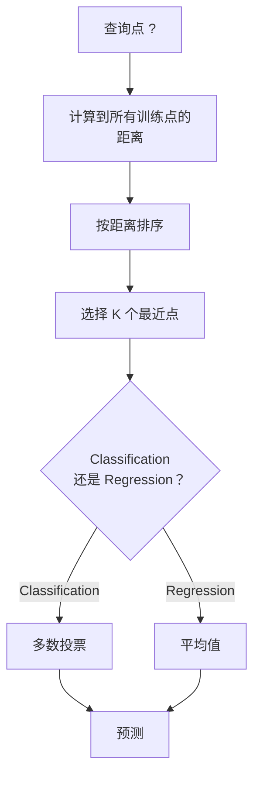
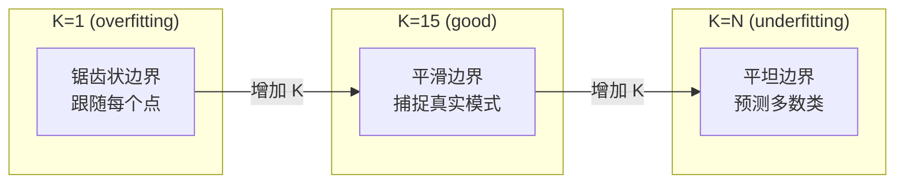
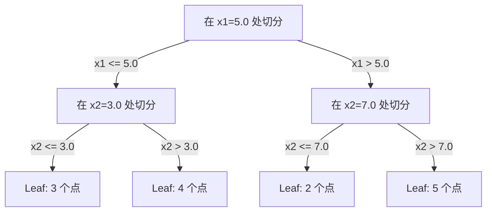

# 邻居和距离

> 存储一切――通过查看你的邻居来预测――这是最简单而真正有效的算法――

**Type:** Build
**Language:**字符串
**前置要求：**第1阶段 (第14课规范和距离)
**Time:** ~90 分钟

## 学习目标
- 从零实现KNN分类和回归,支持可配置的K和距离加权投票
- 比较L1、L2、科西恩和明科夫斯基 距离度量,并为给定数据类型选择适合度量
- 解释维度灾难,并演示为什么KNN在高维空间中会退化
- 构建KD树以实现高效的近邻搜索,并分析它何时优于残酷力量

## 问题
你有一个数据集――一个新的数据点到来――你需要对它进行分类或预测它的价值――与其数据中学习参数 (例如线性回归或SVM) 相比,你只需要找到距离新点最近的 K 训练点,并让它们投票――

这就是K-近邻. 它没有训练阶段. 它没有学习参数. 它没有最小化损失函数.

它听起来很简单,但KN在许多问题上表现出了人们意愿的竞争力,特别是在中小型数据集中.

现在,KN也以不同的名称出现在现代AI的各个地方――向量数据库会在嵌入式上执行KN搜索――恢复增强代 (RAG) 会寻找K个最近的文档片段――推系统会寻找类似的用户或物品――算法是相同的――不同于规模和数据结构――

## 概念
### KNN 的运作方式

给一个标签点的数据集和一个新的查询点:

1. 计算查询点到数据中心的每个点距离
2. 按距离排序
3. 取最近的K 个点
4. 对于分类:在K个邻居中进行多数投票
5. 对于回归:对K个邻居的值取平均 (或加权平均)



这就是完整的算法.没有拟合.没有渐进的下降.

### 选择K

控制偏差变量交易:

| K | 行为 |
|---|----------|
| K = 1 | 决策边界跟随每一个点。训练误差为零。高方差。Overfits |
| Small K (3-5) | 对局部结构敏感。可以捕捉复杂边界 |
| Large K | 边界更平滑。对噪声更稳健。可能 underfit |
| K = N | 对每个点都预测多数类。最大 bias |

常见起点是对包含N个点的数据集使用K = 平方 (N) ⋅二分类时使用奇数K,以避免平票──



### 距离指标

距离函数定义了什么叫近──不同度量会产生不同的邻居、不同的预测──

**L2 (Euclidean)**是默认选择.

```
d(a, b) = sqrt(sum((a_i - b_i)^2))
```

对于特征尺度敏感性. 使用L2 和 KNN 前,始终要标准化特征.

**L1 (Manhattan)**对于绝对差异求和和.比L2更能抵制异常值,因为它不会对差异值平方.

```
d(a, b) = sum(|a_i - b_i|)
```

**Cosine distance**衡量向量之间的角度,忽略大小.

```
d(a, b) = 1 - (a . b) / (||a|| * ||b||)
```

**Minkowski**使用参数 p 泛化 L1 和 L2

```
d(a, b) = (sum(|a_i - b_i|^p))^(1/p)

p=1: Manhattan
p=2: Euclidean
p->inf: Chebyshev (max absolute difference)
```

使用哪种量取决于数据:

| 数据类型 | 最佳度量 | 原因 |
|-----------|------------|-----|
| 数值特征，尺度相近 | L2 (Euclidean) | 默认选择，适用于空间数据 |
| 数值特征，存在 outliers | L1 (Manhattan) | 稳健，不会放大大差异 |
| Text embeddings | Cosine | 大小是噪声，方向是含义 |
| 高维稀疏 | Cosine 或 L1 | L2 受维度灾难影响严重 |
| 混合类型 | Custom distance | 按特征类型组合度量 |

### 权重 KNN

标准KN对所有K邻居给予相同权力.

**Distance-weighted KNN**按距离的倒数为每个邻居加权:

```
weight_i = 1 / (distance_i + epsilon)

For classification: weighted vote
For regression:     weighted average = sum(w_i * y_i) / sum(w_i)
```

当查询点与训练点完全匹配时,Epsilon可以防止除到零.

对于K的选择,KN的重量不那么敏感,因为远处的邻居无论如何都很小.

### 维度灾难

现在,我们在数学上看到了一个问题.

**问题 1：距离会收敛。**随着维度的增加,最大距离与最小距离的比值将接近1.

```
In d dimensions, for random uniform points:

d=2:    max_dist / min_dist = varies widely
d=100:  max_dist / min_dist ~ 1.01
d=1000: max_dist / min_dist ~ 1.001

When all distances are nearly equal, "nearest" is meaningless.
```

**问题 2：体积会爆炸。**为了在数据的固定比例中捕捉K个邻居,你需要扩大搜索半径,使其覆盖了大多的特征空间.

**问题 3：角落占主导。**在d 维单位超立方体中,大部分体积集中在角落附近,而不是中心.随着d 增长,在d 维单位中,包含的体积分数量趋于接近零.

实际后果:KNN在大约20-50个特征内表现良好. 在这个范围之后,你需要在应用KNN前进行维度减少 (PCA、UMAP、t-SNE),或者使用能利用数据在低维结构的树木基础搜索结构中.

### 快速近邻 搜索

对于大型数据集而言,这太慢了――

在每层层,它沿着某个维度按中位数进行分分.



为了寻找最接近的邻居,先穿过树到包含查询点的叶子,然后回来,并且只在相邻区可能包含更接近的点时检查它们.

平均查询时间:低维时为O(log n) ・・・但KD树在高维度 (d > 20) 将退化为O(n),因为回溯能排除分支越来越少──

### 球树: 更适合中等维度

球树将数据分为嵌套的超球体,而不是轴对齐的盒子.每个节点定义一个球,中心+半径,包含该子树中的所有点.

相对KD树的优势:
- 在中等维度中表现更好 ((最高约50).
- 能处理非轴对齐结构
- 更紧的边界体积意味着搜索时可以切断更多分支

对于真正的大规模搜索,将改用近邻方法 (HNSW、IVF、产品量化) 进行.

### 惰学习与渴望学习

简单的学习者:训练时不做工作,所有工作都在预测时完成.

| 方面 | Lazy (KNN) | Eager (SVM, neural net) |
|--------|------------|------------------------|
| 训练时间 | O(1)，只存储数据 | O(n * epochs) |
| 预测时间 | 每次查询 O(n * d) | O(d) 或 O(parameters) |
| 预测时内存 | 存储整个训练集 | 只存储模型参数 |
| 适应新数据 | 立即添加点 | 重新训练模型 |
| 决策边界 | 隐式，在运行时计算 | 显式，训练后固定 |

惰学习 适合以下场景:
- 数据集频繁变化(无需重新训练即可添加/删除点)
- 只有很少需要查询的预测
- 你希望训练时间为零
- 据集足够小,残酷的搜索 快速

### 退回 KNN

对于K个邻居的目标值取平均.

```
prediction = (1/K) * sum(y_i for i in K nearest neighbors)

Or with distance weighting:
prediction = sum(w_i * y_i) / sum(w_i)
where w_i = 1 / distance_i
```

由于KNN的回归 产生分段常数预测(使用加权时为分段平滑) ⋅它无法推出到训练数据范围之外――如果训练目标全都在0到100之间,KNN永远不会预测200──


```figure
knn-smoothness
```

## 构建它
### 步骤1: 距离函数

实现L1、L2、科西恩和明科夫斯基距离.

```python
import math

def l2_distance(a, b):
    return math.sqrt(sum((ai - bi) ** 2 for ai, bi in zip(a, b)))

def l1_distance(a, b):
    return sum(abs(ai - bi) for ai, bi in zip(a, b))

def cosine_distance(a, b):
    dot_val = sum(ai * bi for ai, bi in zip(a, b))
    norm_a = math.sqrt(sum(ai ** 2 for ai in a))
    norm_b = math.sqrt(sum(bi ** 2 for bi in b))
    if norm_a == 0 or norm_b == 0:
        return 1.0
    return 1.0 - dot_val / (norm_a * norm_b)

def minkowski_distance(a, b, p=2):
    if p == float('inf'):
        return max(abs(ai - bi) for ai, bi in zip(a, b))
    return sum(abs(ai - bi) ** p for ai, bi in zip(a, b)) ** (1 / p)
```

### 步骤 2: KNN分类器和回归器

构建完整的KN,支持可配置的K,距离度量以及可选的距离加权.

```python
class KNN:
    def __init__(self, k=5, distance_fn=l2_distance, weighted=False,
                 task="classification"):
        self.k = k
        self.distance_fn = distance_fn
        self.weighted = weighted
        self.task = task
        self.X_train = None
        self.y_train = None

    def fit(self, X, y):
        self.X_train = X
        self.y_train = y

    def predict(self, X):
        return [self._predict_one(x) for x in X]
```

### 步骤3:KD树,有效搜索

从零构建 KD树,按每个维度的中位数递归切分.

```python
class KDTree:
    def __init__(self, X, indices=None, depth=0):
        # Recursively partition the data
        self.axis = depth % len(X[0])
        # Split on median of the current axis
        ...

    def query(self, point, k=1):
        # Traverse to leaf, then backtrack
        ...
```

完整实现见`code/knn.py`包含所有辅助方法和演示.

### 步骤 4: 功能扩展

由于对特征的距离较小,所以KN需要扩展,因为从0到1000的特征的距离从0到1的特征的范围.

```python
def standardize(X):
    n = len(X)
    d = len(X[0])
    means = [sum(X[i][j] for i in range(n)) / n for j in range(d)]
    stds = [
        max(1e-10, (sum((X[i][j] - means[j]) ** 2 for i in range(n)) / n) ** 0.5)
        for j in range(d)
    ]
    return [[((X[i][j] - means[j]) / stds[j]) for j in range(d)] for i in range(n)], means, stds
```

## 使用它
使用小说学习:

```python
from sklearn.neighbors import KNeighborsClassifier
from sklearn.preprocessing import StandardScaler
from sklearn.pipeline import Pipeline

clf = Pipeline([
    ("scaler", StandardScaler()),
    ("knn", KNeighborsClassifier(n_neighbors=5, metric="euclidean")),
])
clf.fit(X_train, y_train)
print(f"Accuracy: {clf.score(X_test, y_test):.4f}")
```

当数据集足够大且维度足够低时,Scikit-learn会自动使用KD树或球树.`algorithm`参数控制这个点.

对于大规模的近邻搜索数百万个向量),使用 FAISS、Annoy 或向量数据库:

```python
import faiss

index = faiss.IndexFlatL2(dimension)
index.add(embeddings)
distances, indices = index.search(query_vectors, k=5)
```

## 练习
1. 在包含3类的2D数据集中实现KN分类化――绘制K=1、K=5、K=15 和K=N的决策界限――观察从过度到不足的转变――

2. 在2、5、10、50、100 和 500 维中生成 1000 个随机点.对每个维度,计算最大对距离与最小对距离的比值.绘制该比值随着维度变化图,以可视化维度灾难.

3. 在文本分类问题上比较KN的L1、L2和宇宙距离(使用TF-IDF向量) ⋅哪种度量提供最佳准确性?为什么宇宙往往在文本上胜出?

4. 实现KD树,并在2D、10D 和 50D中,分别针对1k、10k 和100k点的数据集测量查询时间与残酷力量的比较. 在哪个维度KD树不再比残酷力量更快?

5. 为 y = sin(x) +噪音 构建一个重量KN回归器――将它与K=3、10、30的不重量KN比较――展示加权会产生更平滑的预测,特别是在K 较大时――

## 关键术语
| 术语 | 它实际意味着什么 |
|------|----------------------|
| K-nearest neighbors | 一种非参数算法，通过寻找距离查询点最近的 K 个训练点来预测 |
| Lazy learning | 训练时不进行计算。所有工作都发生在预测时。KNN 是典型例子 |
| Eager learning | 训练时进行大量计算以构建紧凑模型。大多数 ML 算法都是 eager |
| Curse of dimensionality | 在高维中，距离会收敛，neighborhoods 会扩展到覆盖空间的大部分，使 KNN 失效 |
| KD-tree | 沿特征轴递归划分空间的二叉树。在低维中查询为 O(log n) |
| Ball tree | 嵌套超球体构成的树。在中等维度（最高约 ~50）中比 KD-trees 表现更好 |
| Weighted KNN | neighbors 按距离倒数加权。更近的 neighbors 对预测影响更大 |
| Feature scaling | 将特征归一化到可比较范围。KNN 等基于距离的方法需要它 |
| Majority vote | 通过统计 K 个 neighbors 中哪个类别最常见来进行 Classification |
| Brute force search | 计算到每个训练点的距离。每次查询 O(n*d)。精确但在大 n 时很慢 |
| Approximate nearest neighbor | 能比精确搜索快得多地找到近似最近点的算法（HNSW、LSH、IVF） |
| Voronoi diagram | 一种空间划分，其中每个区域包含所有比任何其他训练点都更接近某个训练点的点。K=1 KNN 会产生 Voronoi 边界 |

## 延伸阅读
- [Cover & Hart: Nearest Neighbor Pattern Classification (1967)](https://ieeexplore.ieee.org/document/1053964)基基性KN论文,证明其错误率至于为Bays最佳的两倍
- [Friedman, Bentley, Finkel: An Algorithm for Finding Best Matches in Logarithmic Expected Time (1977)](https://dl.acm.org/doi/10.1145/355744.355745)- 原始 KD树论文
- [Beyer et al.: When Is "Nearest Neighbor" Meaningful? (1999)](https://link.springer.com/chapter/10.1007/3-540-49257-7_15)- 最近邻居 维度灾难的形式化分析
- [scikit-learn Nearest Neighbors documentation](https://scikit-learn.org/stable/modules/neighbors.html)- 包含算法选择的实践指南
- [FAISS: A Library for Efficient Similarity Search](https://github.com/facebookresearch/faiss)-  Meta 用于十亿级的近邻搜索库
