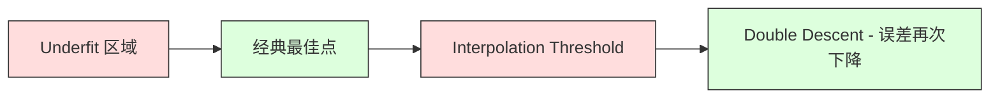
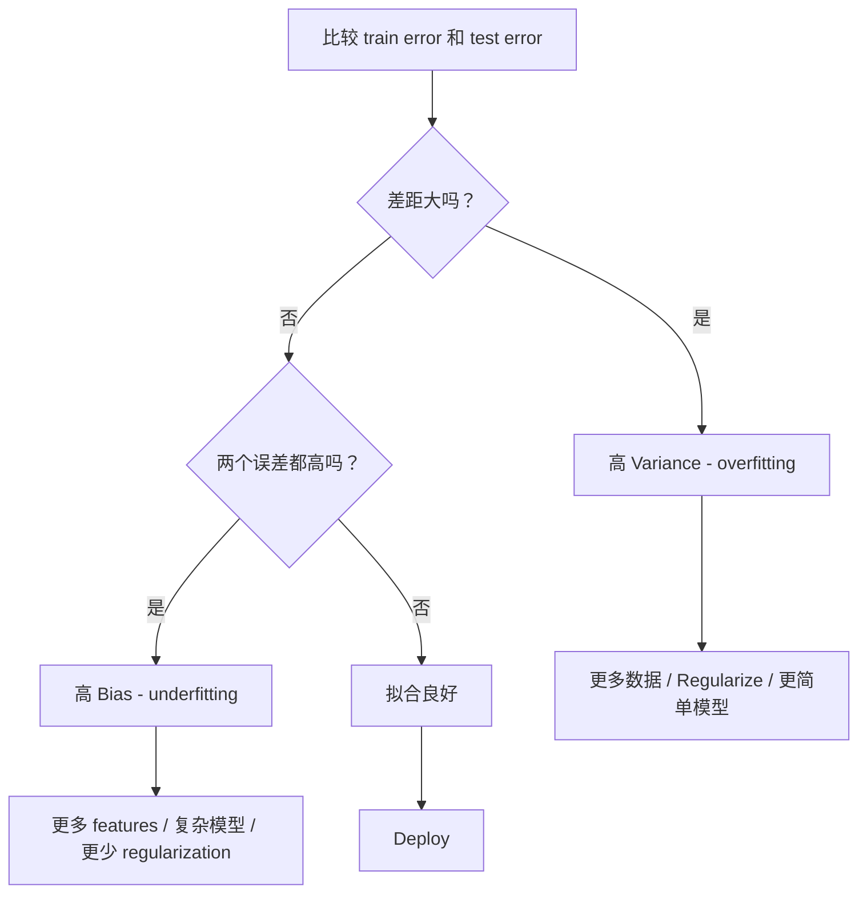
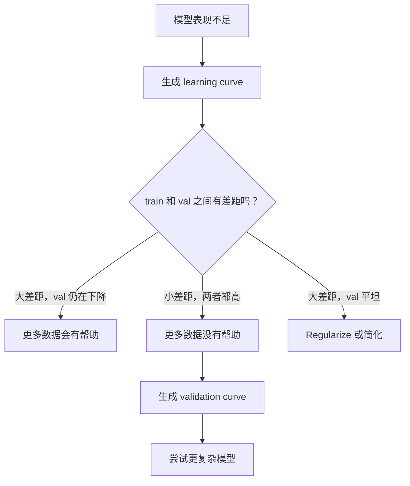

# 偏差差差异

> 每种模型差异都来自三个来源之一:偏见,变异或噪音.

**Type:** Learn
**Language:**字符串
**Prerequisites:** Phase 2, Lessons 01-09（ML 基础、Regression、Classification、评估）
**Time:** ~75 分钟

## 学习目标
- 推导期望预测误差的偏差变化 分解,并解释不可约的噪音作用
- 使用训练误差和测试误差模式诊断模型是否存在高偏差或高变异
- 解释规律化技术 (L1、L2、降落、早期停止)
- 实现实验,可视化不同复杂性模型上的偏差变量交易

## 问题
你训练了一个模型. 在测试数据中有一些错误.

如果你的模型过于简单 (例如在曲数据集中使用线性回归),它会持续错过真实模式――这就是偏见――如果你的模型过于复杂 (例如在15个数据点上使用20度多项式),它会完美适合训练数据,但在新数据上给出了剧烈变化的预测――这就是变化――

对于固定的模型容量,你不能同时最小化两者――降低偏差,变化就会上升――降低偏差,变化就会上升――理解这一差距是机器学习中最有用的诊断技能――它会告诉你应该让模型变得更复杂或更简单,应该获得更多数据或更好的工程功能,应该加强或减弱规范――

## 概念
### 系统性误差

偏见是模型平均预测与真实值之间的偏差程度.如果你从同一分布的许多不同的训练集中训练同一个模型,并对预测平均取,偏见是这个平均值与真实值之间的差距.

高偏见意味着模型太硬了,无法捕捉到真实模式――用一条直线来适应抛物线,无论给它多少数据,它都会错过曲线――这就是不适合――

```
高 Bias（underfitting）：
  模型总是预测大致相同的错误结果。
  训练误差：高
  测试误差：高
  二者差距：小
```

### 变异:对训练数据的敏感性

变量量是当你在不同数据集上训练时,预测会发生多少变化.

高变异意味着模型在适应训练数据中的噪音,而不是底层信号――20度多项式会穿过每个训练点,但它们之间剧烈振荡――这就是过度适应――

```
高 Variance（overfitting）：
  模型完美拟合训练数据，但在新数据上失败。
  训练误差：低
  测试误差：高
  二者差距：大
```

### 腐烂

对于任意点 x,平方损失下期望预测误差可以精确分解为:

```
Expected Error = Bias^2 + Variance + Irreducible Noise

where:
  Bias^2   = (E[f_hat(x)] - f(x))^2
  Variance = E[(f_hat(x) - E[f_hat(x)])^2]
  Noise    = E[(y - f(x))^2]             (sigma^2)
```

- `f(x)`是真实函数
- `f_hat(x)`是模型预测
- `E[...]`是对不同训练集的期望
- `y`是观测到的标签(真实函数加噪声)

在有噪音数据上,没有模型能比Sigma^2做得更好.

### 模型复杂性与错误


经典的U 形曲线:

| Complexity | Bias | Variance | Total Error |
|-----------|------|----------|-------------|
| 过低 | 高 | 低 | 高（underfitting） |
| 刚刚好 | 中等 | 中等 | 最低 |
| 过高 | 低 | 高 | 高（overfitting） |

### 作为偏差变化控制的规范

规范化会有意增加偏见,降低变量.

- **L2 (Ridge):**将所有权重缩至零,保留所有特征,但降低其影响.
- **L1 (Lasso):**将某些权重精确推推到零.执行功能选择.
- **Dropout:**在训练期间随机禁用神经元──迫使形成冗余的表现──
- **Early stopping:**在模型完全适合训练数据之前停止训练――

调节强度 (lambda、降落率、时代 数) 将直接控制你在偏差变化曲线上的位置.

### 现代视角

经典理论认为:超过最佳点后,更多的复杂性总是有害的.但自2019年以来的研究显示了意外现象.如果你继续将模型容量增加到远超的插射门,模型有足够的参数可以完美适合训练数据的位置,测试错误可能再次下降.



这种"双下降"现象解释了为什么大规模超级分数的神经网络 (参数数量远远超过训练样本) 仍然可以很好地概括.

关于双色人下降的关键观察:
- 它会出现在线性模型,决策树和神经网络中.
- 在插图区域,更多数据实际上可能有害 (样本智能双下降)
- 更多训练时代也可能导致它 ((时代智慧双下降)
- 规范化会平滑峰值,但不会消除它

为什么会发生这种情况?在插射门上,模型刚好有足够的容量适合所有训练点. 它被迫进入一个非常具体的解,这个解穿过每个点,数据中的微小扰动会导致适合发生巨大的变化. 这就是变化 达到峰值的位置. 在这个门之后,模型有许多可能完美适合数据的可能解.学习算法 (例如带有隐含规范化的梯度下降) 倾向于从中选择最简单的原因之一.

| Regime | Parameters vs Samples | Behavior |
|--------|----------------------|----------|
| Underparameterized | p << n | 经典 tradeoff 适用 |
| Interpolation threshold | p ~ n | Variance 达到峰值，测试误差激增 |
| Overparameterized | p >> n | Implicit regularization 开始起作用，测试误差下降 |

从实践角度看:如果你使用神经网络或大型树团,不要停在插曲门上.

### 诊断你的模式



| Symptom | Diagnosis | Fix |
|---------|-----------|-----|
| 高 train error，高 test error | Bias | 更多 features、复杂模型、更少 regularization |
| 低 train error，高 test error | Variance | 更多数据、regularization、更简单模型、dropout |
| 低 train error，低 test error | 拟合良好 | Ship it |
| Train error 下降，test error 上升 | Overfitting 正在发生 | Early stopping |

### 实际的策略

**当 Bias 是问题时：**
- 添加多项或交互特性
- 使用更灵活的模型 (例如使用树组合代替线性模型)
- 降低规律化强度
- 训练更久 ((如果还没有收到)

**当 Variance 是问题时：**
- 获取更多训练数据
- 使用包装 (随机森林)
- 增加规律化 ((更高的果、更多的退休)
- 功能选择 (移除噪音功能)
- 使用交叉验证 尽早发现它

### 组装方法 和方差降低

组装方法是对抗变异的最实用的工具.

**Bagging (Bootstrap Aggregating)**预测取平均――每个单独模型都有高变化,但平均值的变化要低得多――随机森林将被用于决策树――

它在数学上有效的原因是:如果平均N个独立预测,每个预测的变量都是sigma^2,那么平均值的变量是sigma^2 / N. 这些模型并不真正独立,所以降幅小于1/N,但仍然相当可观.

**Boosting**通过顺序构建模型来降低偏见,其中每一个新模型都关注当前组合的错误.

| Method | Primary Effect | Bias Change | Variance Change |
|--------|---------------|-------------|-----------------|
| Bagging | 降低 Variance | 不变 | 降低 |
| Boosting | 降低 Bias | 降低 | 可能增加 |
| Stacking | 同时降低两者 | 取决于 meta-learner | 取决于 base models |
| Dropout | Implicit bagging | 略微增加 | 降低 |

**实践规则：**如果你的基模型有高变量,使用包装. 如果你的基模型有高偏差,使用简单的线性模型.

### 学习曲线

学习曲线将训练错误和验证错误绘制为训练集的大小函数――它们是你拥有的最实用诊断工具――不同于单次训练/测试比较,学习曲线会展示模型轨迹,并告诉你更多数据是否有帮助――


如何解读它们:

| Scenario | Training Error | Validation Error | Gap | What It Means | What to Do |
|----------|---------------|-----------------|-----|---------------|------------|
| 高 Bias | 高 | 高 | 小 | 模型无法捕捉模式 | 更多 features、复杂模型、更少 regularization |
| 高 Variance | 低 | 高 | 大 | 模型记忆训练数据 | 更多数据、regularization、更简单模型 |
| 拟合良好 | 中等 | 中等 | 小 | 模型 generalizes well | Ship it |
| 高 Variance，正在改善 | 低 | 随更多数据下降 | 缩小 | 数据可以修复的 Variance 问题 | 收集更多数据 |
| 高 Bias，平坦 | 高 | 高且平坦 | 小且平坦 | 更多数据没有帮助 | 改变 model architecture |

关键洞察:如果两条曲线都平坦,差距很小,但两个差距很高,更多数据没有用.你需要更好的模型.

### 如何生成学习曲线

有两种方法:

**Approach 1: 改变训练集大小，固定模型。**保持模型和超参数不变――在越来越大的训练数据集上训练――测量每个小小的训练错误和验证错误――这是标准学习曲线――

**Approach 2: 改变模型复杂度，固定数据。**保持数据不变――扫描一个复杂度参数(多项数度、树深、层数量) ――测量每个复杂度下的训练误差和验证误差――这是验证曲线,会直接显示偏差差距――

两种方法相互补充. 一种告诉你更多的数据是否有帮助.




```figure
bias-variance
```

## 构建它
`code/bias_variance.py`中的代码会运行完整的偏差变异 分解实验. 下面是逐步方法.

### 步骤1:从已知函数生成合成数据

我们使用了高斯人的噪音.`f(x) = sin(1.5x) + 0.5x`△知道真实函数让我们可以计算精确的偏差和变量──

```python
def true_function(x):
    return np.sin(1.5 * x) + 0.5 * x

def generate_data(n_samples=30, noise_std=0.5, x_range=(-3, 3), seed=None):
    rng = np.random.RandomState(seed)
    x = rng.uniform(x_range[0], x_range[1], n_samples)
    y = true_function(x) + rng.normal(0, noise_std, n_samples)
    return x, y
```

### 步骤 2: 启动截图样本和多项式配件

对于每个多项数的学位,我们抽取了许多启动训练集,拟合多项数,并固定测试格上记录预测.

```python
def fit_polynomial(x_train, y_train, degree, lam=0.0):
    X = np.column_stack([x_train ** d for d in range(degree + 1)])
    if lam > 0:
        penalty = lam * np.eye(X.shape[1])
        penalty[0, 0] = 0
        w = np.linalg.solve(X.T @ X + penalty, X.T @ y_train)
    else:
        w = np.linalg.lstsq(X, y_train, rcond=None)[0]
    return w
```

我们在200个不同的启动器样本上图.每个启动器样本都从同一层次分布中抽取,但包含不同的点.

### 步骤3:计算偏差^2,变量分解

根据每一个测试点的200组预测,我们可以直接根据定义计算分解:

```python
mean_pred = predictions.mean(axis=0)
bias_sq = np.mean((mean_pred - y_true) ** 2)
variance = np.mean(predictions.var(axis=0))
total_error = np.mean(np.mean((predictions - y_true) ** 2, axis=1))
```

- `mean_pred`是从启动样本 估计出的E[f_hat(x)
- `bias_sq`是平均预测与真实值之间的差距的平方
- `variance`是跨启动样本的预测平均离散程度
- `total_error`应该近似等于偏差^2 +变异 +噪音

### 步骤 4:学习曲线

学习曲线在保持模型复杂性固定的同时扫描训练集大小──它们显示你的模型是数据有限的,也是容量有限的──

```python
def demo_learning_curves():
    sizes = [10, 15, 20, 30, 50, 75, 100, 150, 200, 300]
    degree = 5

    for n in sizes:
        train_errors = []
        test_errors = []
        for seed in range(50):
            x_train, y_train = generate_data(n_samples=n, seed=seed * 100)
            w = fit_polynomial(x_train, y_train, degree)
            train_pred = predict_polynomial(x_train, w)
            train_mse = np.mean((train_pred - y_train) ** 2)
            test_pred = predict_polynomial(x_test, w)
            test_mse = np.mean((test_pred - y_test) ** 2)
            train_errors.append(train_mse)
            test_errors.append(test_mse)
        # 对多次运行取平均，得到 learning curve 上的点
```

对于高变量模型 (小数据上的五度),你会看到:
- 训练差距开始很低,随着更多的数据,记忆变得困难,提高.
- 测试差距一开始很高,随着模型获得更多信号而下降
- 随着更多数据而差距缩小

对于高偏见模型 (级 1),两个误差会快速收到同一个高值,更多数据没有帮助.

### 第五步:规范化扫描

代码还包含`demo_regularization_sweep()`通过测试,它将固定一个高度多项式,15度),并将从0.001 扫描到100的平稳定强度.

```python
def demo_regularization_sweep():
    alphas = [0.001, 0.005, 0.01, 0.05, 0.1, 0.5, 1.0, 5.0, 10.0, 50.0, 100.0]
    for alpha in alphas:
        results = bias_variance_decomposition([15], lam=alpha)
        r = results[15]
        print(f"alpha={alpha:.3f}  bias={r['bias_sq']:.4f}  var={r['variance']:.4f}")
```

在低阿尔法下,15度多项式几乎不受约束.变量占主导,因为模型会追逐每个启动器样本中的噪音. 在高阿尔法下,惩罚强到使模型实际上变成接近常数的函数.

这与改变多项数的程度得到的是相同的U曲线,只过这里使用连续旋转而不是离散选项来控制.

## 使用它
提供 提供`learning_curve`和 `validation_curve`没有必要编写启动循环.

### 验证曲线:扫描模型复杂性

```python
from sklearn.model_selection import validation_curve
from sklearn.pipeline import make_pipeline
from sklearn.preprocessing import PolynomialFeatures
from sklearn.linear_model import Ridge

degrees = list(range(1, 16))
train_scores_all = []
val_scores_all = []

for d in degrees:
    pipe = make_pipeline(PolynomialFeatures(d), Ridge(alpha=0.01))
    train_scores, val_scores = validation_curve(
        pipe, X, y, param_name="polynomialfeatures__degree",
        param_range=[d], cv=5, scoring="neg_mean_squared_error"
    )
    train_scores_all.append(-train_scores.mean())
    val_scores_all.append(-val_scores.mean())
```

这会直接给你偏差差差距曲线. 当验证分数相对于火车分数 最差时,变量占主导. 当两者都差时,偏差占主导.

### 学习曲线:扫描 训练集尺寸

```python
from sklearn.model_selection import learning_curve

pipe = make_pipeline(PolynomialFeatures(5), Ridge(alpha=0.01))
train_sizes, train_scores, val_scores = learning_curve(
    pipe, X, y, train_sizes=np.linspace(0.1, 1.0, 10),
    cv=5, scoring="neg_mean_squared_error"
)
train_mse = -train_scores.mean(axis=1)
val_mse = -val_scores.mean(axis=1)
```

将`train_mse`和 `val_mse`对于`train_sizes`绘制出来的曲线形状会告诉你关于模型的一切.

### 使用规范化扫描的交叉验证

```python
from sklearn.model_selection import cross_val_score

alphas = [0.001, 0.01, 0.1, 1.0, 10.0, 100.0]
for alpha in alphas:
    pipe = make_pipeline(PolynomialFeatures(10), Ridge(alpha=alpha))
    scores = cross_val_score(pipe, X, y, cv=5, scoring="neg_mean_squared_error")
    print(f"alpha={alpha:>7.3f}  MSE={-scores.mean():.4f} +/- {scores.std():.4f}")
```

这将是固定模型复杂度扫描规律化强度. 你会看到相同的偏差差差距:低阿尔法意味着高变化,高阿尔法意味着高偏差.

### 整合起来:完整诊断工作流程

实践中,你会按照顺序运行这些诊断:

1. 训练你的模型――计算火车 和测试错误――
2. 如果两者都高:你有偏见问题.
3. 如果训练低但测试高:你有变化问题――生成学习曲线,看看更多数据是否有帮助――如果没有,就定期化――
4. 生成验证曲线,扫描主要复杂度参数――找到最佳点――
5. 在最佳位置,生成学习曲线. 如果差距仍然很大,你需要更多的数据或规律化.
6. 使用 `cross_val_score`尝试不同的阿尔法值的Ridge/Lasso──选择截止验证错误 最低的阿尔法──

对于大多数表格数据集,这需要10-15分钟计算时间,但可以节省几小时猜测.

## 交付它
本课产出:`outputs/prompt-model-diagnostics.md`

## 练习
1. 使用 `noise_std=0`运行分解.不可约误差项会发生什么?最优复杂度会改变吗?

2. 如何影响变量组件?最优多项数的程度是否会移动?

3. 向实验添加L2规律化 (Ridge回归) ⋅对于固定的高度多项式 (高度多项式) ⋅15),将 lambda从0扫描到100──绘制偏差^2 和变异 随 lambda 变化的函数图──

4. 将真实函数从多项式修改为`sin(x)`偏差变化 分解会如何变化?是否仍然有最好的程度的清晰度?

5. 实现一个简单的启动集集集集集:在启动样本上训练10个模型并平均预测展示这会降低变化,而且几乎不会增加偏见.

## 关键术语
| Term | What people say | What it actually means |
|------|----------------|----------------------|
| Bias | “模型太简单” | 来自错误假设的系统性误差。平均模型预测与真实值之间的差距。 |
| Variance | “模型在 overfitting” | 来自对训练数据敏感性的误差。预测在不同训练集之间变化的程度。 |
| Irreducible error | “数据中的噪声” | 来自真实数据生成过程中的随机性的误差。没有模型能消除它。 |
| Underfitting | “学得不够” | 模型有高 Bias。即使在训练数据上也会错过真实模式。 |
| Overfitting | “记住了数据” | 模型有高 Variance。它拟合了训练数据中无法 generalize 的噪声。 |
| Regularization | “约束模型” | 添加惩罚来降低模型复杂度，用 Bias 换取更低 Variance。 |
| Double descent | “更多参数可能有帮助” | 当模型容量远超 interpolation threshold 时，测试误差会再次下降。 |
| Model complexity | “模型有多灵活” | 模型拟合任意模式的容量。由 architecture、features 或 regularization 控制。 |

## 延伸阅读
- [Hastie, Tibshirani, Friedman: Elements of Statistical Learning, Ch. 7](https://hastie.su.domains/ElemStatLearn/)-- 偏差差分解的权力论述
- [Belkin et al., Reconciling modern machine learning practice and the bias-variance trade-off (2019)](https://arxiv.org/abs/1812.11118)-- 双色血统论文
- [Nakkiran et al., Deep Double Descent (2019)](https://arxiv.org/abs/1912.02292)-- 时代和样本的双向下降
- [Scott Fortmann-Roe: Understanding the Bias-Variance Tradeoff](http://scott.fortmann-roe.com/docs/BiasVariance.html)-- 清晰的可视化解释
