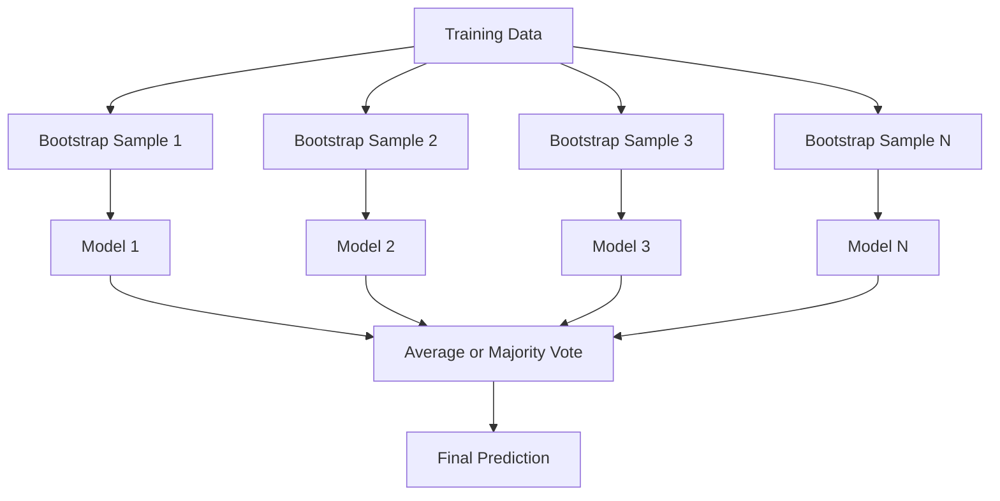
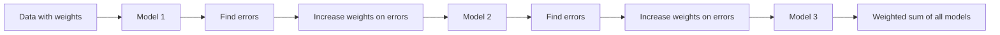
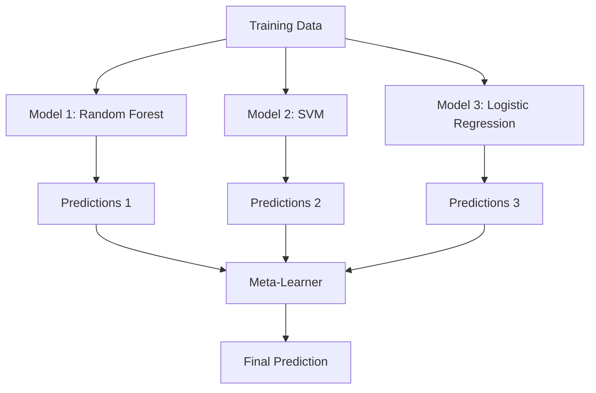

# 组建方法

> 一组弱的学习者,如果正确组合,就会成为一个强大的学习者.

**Type:** Build
**Language:**字符串
**Prerequisites:** Phase 2, Lesson 10 (Bias-Variance Tradeoff)
**Time:** ~120 分钟

## 学习目标

- 从零实现AdaBoost 和梯度增强,并解释如何按顺序降低偏差
- 构建一个包装组,并向相关模型展示如何在不增加偏见的情况下降低差异
- 根据各种方法,针对错误组件的角度,比较包装,增强和堆
- 评估团队多样性,并解释为什么随着更多独立弱势学习者加入,多数投票的准确性会提升

## 问题

单个决策树 训练速度快且易解释,但会过于适合――单个线性模型在复杂的边界上会过于适合――你可以花几天时间设计完美的模型架构――或者,你可以组装一批不完美的模型,得到一个比它们中的任何一个模型都更好的结果――

组合方法正是这样做的.它们是表格数据上赢得了最可靠的技术,支了大多数生产的 ML 系统,并且生动地展示了偏差差差距的实际作用.

## 概念

### 为什么集团有效

假设你有N个独立分类器,每个分类的准确性都是p >0.5──多数投票的准确性为:

```
P(majority correct) = sum over k > N/2 of C(N,k) * p^k * (1-p)^(N-k)
```

对于21个类别的准确度为60%的分类,多数投票的准确度约为74%──如果有101个类别,将升至84%──当模型犯不同错误时,错误会相互抵消──

关键要求是**diversity**,如果所有模型都犯了相同的错误,组合它们没有任何帮助.

- 不同的训练子集(背包)
- 不同的特征子集 (随机森林)
- 顺序式错误纠正(增强)
- 不同的模型家族(堆积)

### 包装 (带集成)

通过在训练数据的不同启动器样本上训练每个模型来创造多样性.



启动器样本是从原始数据中得到的回放抽样,大小与原始数据相同. 每个启动器中约出现63.2%的独特样本.

包装在几乎没有增加的偏差的情况下降低差异性. 每棵单独的树都会过度适应自己的引导样本,但每个树的过度适应不同,因此需要平均抵消噪音.

**Random Forests**随着额外的机制包装:在每次分区时,只考虑随机特征子组.`sqrt(n_features)`缩中`n_features / 3`,我知道.

### 增强 (顺序式错误纠正)

增强按顺序训练模型――每个新模型都关注之前模型预测错误的例子――



提高 降低偏见――每个新模型都会纠正正前组的系统性错误――最终预测是所有模型的权重总量,其中表现更好的模型会获得更高权重――

权衡在于:如果运行太多轮, 增强可能会过于适合, 因为它会不断适应更难的例子, 其中一些可能只是噪音.

### 适应性

适应性增强是第一个实用增强算法. 它可以与任何基础学习者配合使用,通常使用决策木.

算法:

```
1. Initialize sample weights: w_i = 1/N for all i

2. For t = 1 to T:
   a. Train weak learner h_t on weighted data
   b. Compute weighted error:
      err_t = sum(w_i * I(h_t(x_i) != y_i)) / sum(w_i)
   c. Compute model weight:
      alpha_t = 0.5 * ln((1 - err_t) / err_t)
   d. Update sample weights:
      w_i = w_i * exp(-alpha_t * y_i * h_t(x_i))
   e. Normalize weights to sum to 1

3. Final prediction: H(x) = sign(sum(alpha_t * h_t(x)))
```

错误更低的模型会获得更高的阿尔法. 被错误分类的样本会获得更高的重量,让下一个模型重点关注它们.

### 逐步增长

渐进式增强将增强 泛化到任意损失函数――它不是重新加权样本,而是让每个新模型适应当前组的残余 (丧的负级) .

```
1. Initialize: F_0(x) = argmin_c sum(L(y_i, c))

2. For t = 1 to T:
   a. Compute pseudo-residuals:
      r_i = -dL(y_i, F_{t-1}(x_i)) / dF_{t-1}(x_i)
   b. Fit a tree h_t to the residuals r_i
   c. Find optimal step size:
      gamma_t = argmin_gamma sum(L(y_i, F_{t-1}(x_i) + gamma * h_t(x_i)))
   d. Update:
      F_t(x) = F_{t-1}(x) + learning_rate * gamma_t * h_t(x)

3. Final prediction: F_T(x)
```

对于二次错误损失,伪残留是实际残留:`r_i = y_i - F_{t-1}(x_i)`,每棵树实际上都在一个组合的错误中.

需要更多树木,但泛化效果更好――典型取值:0.01~0.3──

### 基于图表数据的数据

增强高率 (XGBoost) 是加入工程优化的增强高率,使其快速准确,并且不容易过度适应:

- **Regularized objective:**施加L1和L2罚款,防止单棵树过度自信
- **Second-order approximation:**同时使用损失的第一阶段和第二阶段衍生品,从而做出更好的分断决策
- **Sparsity-aware splits:**通过在每次分开时学习缺失数据的最佳方向,原生处理缺失值
- **Column subsampling:**像随机森林一样,在每次分开时采用特征以增加多样性
- **Weighted quantile sketch:**在分布式数据上高效寻找连续特征的分区点
- **Cache-aware block structure:**针对CPU缓存线 优化内存布局

对于表格数据,XGBoost (以及其后代 LightGBM) 持续优于神经网络.

### 堆叠 (Meta-Learning)

堆叠将多个基模型的预测作为一个 Meta-learner的特征.



如果随机森林在某些区域表现更好,而SVM在其他区域表现更好,

为了避免数据泄露,基础模型预测必须通过训练集上的交叉验证 生成――绝不能在同一批数据上既训练基础模型,再生成元特征――

### 投票

最简单的组合――直接组合预测――

- **Hard voting:**对类标签进行多数投票.
- **Soft voting:**对于预测概率 求平均,选择平均概率最高的类.


```figure
f3-ensemble-average
```

## 构建它

### 步骤1:决定 (Base Learner)

`code/ensembles.py`中代码从零实现了一切. 我们从决策开始:一棵只有一个分开的树.

```python
class DecisionStump:
    def __init__(self):
        self.feature_idx = None
        self.threshold = None
        self.polarity = 1
        self.alpha = None

    def fit(self, X, y, weights):
        n_samples, n_features = X.shape
        best_error = float("inf")

        for f in range(n_features):
            thresholds = np.unique(X[:, f])
            for thresh in thresholds:
                for polarity in [1, -1]:
                    pred = np.ones(n_samples)
                    pred[polarity * X[:, f] < polarity * thresh] = -1
                    error = np.sum(weights[pred != y])
                    if error < best_error:
                        best_error = error
                        self.feature_idx = f
                        self.threshold = thresh
                        self.polarity = polarity

    def predict(self, X):
        n = X.shape[0]
        pred = np.ones(n)
        idx = self.polarity * X[:, self.feature_idx] < self.polarity * self.threshold
        pred[idx] = -1
        return pred
```

### 步骤2:从零实现AdaBoost

```python
class AdaBoostScratch:
    def __init__(self, n_estimators=50):
        self.n_estimators = n_estimators
        self.stumps = []
        self.alphas = []

    def fit(self, X, y):
        n = X.shape[0]
        weights = np.full(n, 1 / n)

        for _ in range(self.n_estimators):
            stump = DecisionStump()
            stump.fit(X, y, weights)
            pred = stump.predict(X)

            err = np.sum(weights[pred != y])
            err = np.clip(err, 1e-10, 1 - 1e-10)

            alpha = 0.5 * np.log((1 - err) / err)
            weights *= np.exp(-alpha * y * pred)
            weights /= weights.sum()

            stump.alpha = alpha
            self.stumps.append(stump)
            self.alphas.append(alpha)

    def predict(self, X):
        total = sum(a * s.predict(X) for a, s in zip(self.alphas, self.stumps))
        return np.sign(total)
```

### 步骤3:从零实现渐进增强

```python
class GradientBoostingScratch:
    def __init__(self, n_estimators=100, learning_rate=0.1, max_depth=3):
        self.n_estimators = n_estimators
        self.lr = learning_rate
        self.max_depth = max_depth
        self.trees = []
        self.initial_pred = None

    def fit(self, X, y):
        self.initial_pred = np.mean(y)
        current_pred = np.full(len(y), self.initial_pred)

        for _ in range(self.n_estimators):
            residuals = y - current_pred
            tree = SimpleRegressionTree(max_depth=self.max_depth)
            tree.fit(X, residuals)
            update = tree.predict(X)
            current_pred += self.lr * update
            self.trees.append(tree)

    def predict(self, X):
        pred = np.full(X.shape[0], self.initial_pred)
        for tree in self.trees:
            pred += self.lr * tree.predict(X)
        return pred
```

### 步骤4:与Skularn相比

代码会验证我们的从头开始的实现是否能产生与 sklearn 的`AdaBoostClassifier`和 `GradientBoostingClassifier`相近的准确性,并将所有方法并排比较.

## 使用它

### 如何使用每种方法

| Method | Reduces | Best for | Watch out for |
|--------|---------|----------|---------------|
| Bagging / Random Forest | Variance | noisy data、features 很多 | 对 bias 没有帮助 |
| AdaBoost | Bias | clean data、简单 base learners | 对 outliers 和 noise 敏感 |
| Gradient Boosting | Bias | tabular data、比赛 | 训练慢，不调参容易 overfit |
| XGBoost / LightGBM | Both | 生产环境 tabular ML | hyperparameters 很多 |
| Stacking | Both | 争取最后 1-2% accuracy | 复杂，存在 meta-learner overfitting 风险 |
| Voting | Variance | 快速组合 diverse models | 只有在模型足够 diverse 时才有帮助 |

### 表格数据的生产堆

对于大多数表表预测问题,建议按以下顺序尝试:

1. 使用默认参数的**LightGBM 或 XGBoost**
2. 调优 n_estimators、学习率、最大_深度、小孩_体重
3. 如果需要最后的0.5%的提升,构建一个包含3-5个不同的模型的堆组合
4. 全程使用交叉验证

尽管研究仍在继续,神经网络在表格数据上几乎总是比梯度增强差距.

## 交付它

本课会产出 `outputs/prompt-ensemble-selector.md`-- 一个帮助你给定数据集 选择合适组合方法的提示――描述你的数据 ((尺寸,特征类型,噪音水平,类平衡) 以及你正在解决的问题――这个提示会引导你完成一个决策检查清单,推一种方法,建议开始超参数,并提醒这个方法常见错误――会出现`outputs/skill-ensemble-builder.md`包含完整的选择指南.

## 练习

1. 修改AdaBoost 实现,跟踪每轮后的训练精度――绘制精度与估计器数量――它什么时候收?

2. 通过向回归树 添加随机特征子样本,从零实现一个随机森林.`max_features=sqrt(n_features)`训练100棵树并对预测 求平均――将与单棵树相比较的差异减少――

3. 在梯度提升中实现中添加早期停止:每轮后跟踪验证损失,如果连续10轮没有提升则停止――它实际上需要多少棵树?

4. 构建一个包含三个基模型 (逻辑回归、决策树、k-近邻) 和一个逻辑回归的 Meta-学习者的堆组――使用5倍的交叉验证 生成的 Meta-功能――与每个基模型 单独使用时比较――

5. 在同一数据集上使用默认参数运行 XGBoost. 它的准确性与你的从零梯度提高比较.

## 关键术语

| Term | 常见说法 | 实际含义 |
|------|----------------|----------------------|
| Bagging | “在 random subsets 上训练” | Bootstrap aggregating：在 bootstrap samples 上训练模型，对 predictions 求平均以降低 variance |
| Boosting | “关注 hard examples” | 按顺序训练模型，每个模型纠正当前 ensemble 的错误，以降低 bias |
| AdaBoost | “重新加权数据” | 通过 sample weight updates 实现 boosting；misclassified points 会在下一个 learner 中获得更高 weight |
| Gradient boosting | “拟合 residuals” | 通过让每个新模型拟合 Loss Function 的 negative Gradient 来实现 boosting |
| XGBoost | “Kaggle 武器” | 带有 regularization、second-order optimization 和系统级加速技巧的 gradient boosting |
| Stacking | “模型叠在模型上” | 将 base models 的 predictions 作为 meta-learner 的 input features |
| Random forest | “许多 randomized trees” | 使用 decision trees 的 bagging，并在每次 split 时加入 random feature subsampling 以增加 diversity |
| Ensemble diversity | “犯不同错误” | 模型的错误必须不相关，ensemble 才能优于单个模型 |
| Out-of-bag error | “免费 validation” | 不在某次 bootstrap draw 中的 samples（约 36.8%）可作为 validation set，无需单独 holdout |

## 延伸阅读

- [Schapire & Freund: Boosting: Foundations and Algorithms](https://mitpress.mit.edu/9780262526036/)-- 创始人所写的书
- [Friedman: Greedy Function Approximation: A Gradient Boosting Machine (2001)](https://statweb.stanford.edu/~jhf/ftp/trebst.pdf)-- 原始梯度增强论文
- [Chen & Guestrin: XGBoost (2016)](https://arxiv.org/abs/1603.02754)-- XGBoost 论文
- [Wolpert: Stacked Generalization (1992)](https://www.sciencedirect.com/science/article/abs/pii/S0893608005800231)-- 原始堆叠论文
- [scikit-learn Ensemble Methods](https://scikit-learn.org/stable/modules/ensemble.html)-- 实用参考
