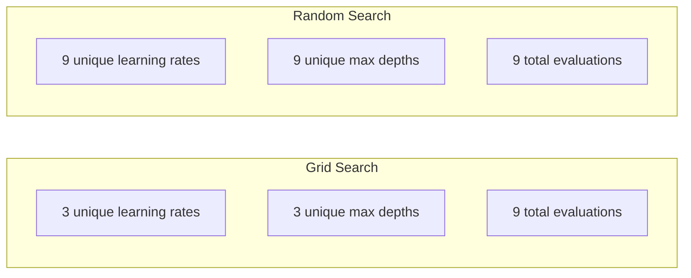
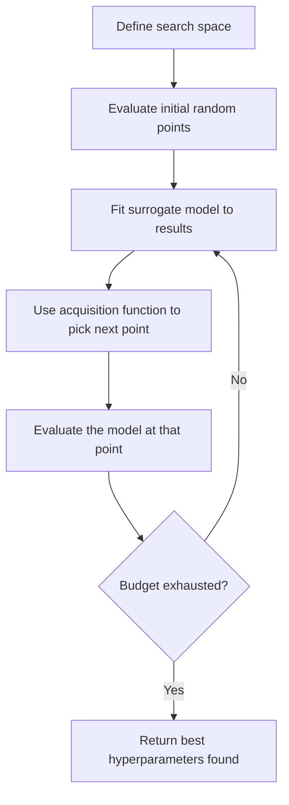
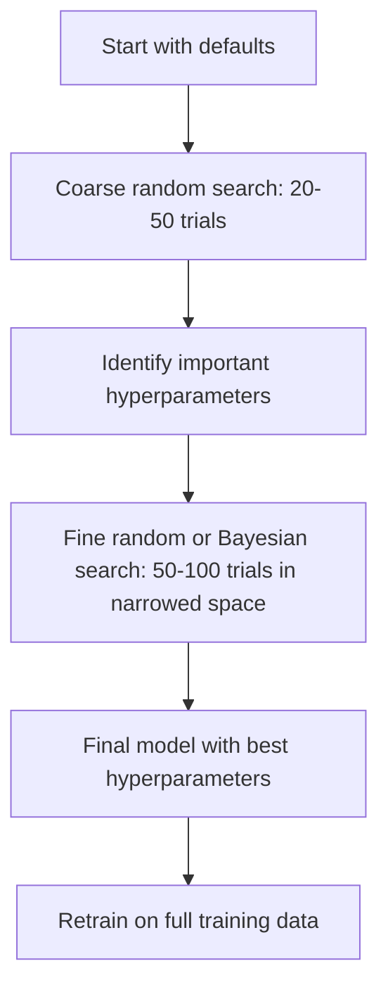
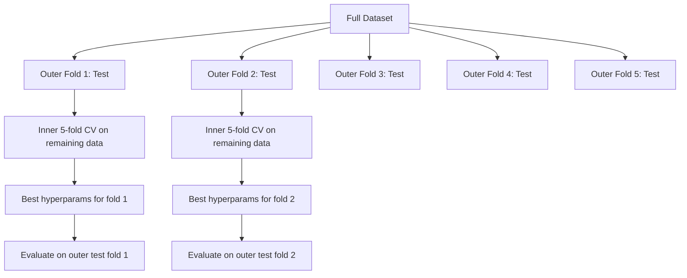

# 超参数调整

> 超参数是训练开始前调节的旋.调节好不好,决定模型是平还是出色.

**Type:** Build
**Language:**字符串
**Prerequisites:** Phase 2, Lesson 11 (Ensemble Methods)
**Time:** ~90 分钟

## 学习目标
- 从零实现网格搜索,随机搜索和贝叶斯优化,并比较它们的采集效率
- 解释为什么当大多数超参数的有效维度较低时,随机搜索会比网格搜索更好
- 使用替代模型 和收购函数 构建贝叶斯优化 循环来指导搜索
- 设计一种超参数调整策略,通过合适的交叉验证 避免对验证集过拟合

## 问题
你的梯度增强 模型有学习速度、树木数量、最大深度、每叶子的分样数、子样本比和列样本比──也就是六个超参数──如果每个都有5个合理取值,那么网格就有5^6 = 15,625种组合──每次训练需要10秒──全部尝试一次需要43小时的计算时间──

随机搜索使用更少的计算量可以做得更好. 通过从过去的评估中学习,效果也会更好. 知道该使用哪种策略,以及哪些超值参数是真的重要,可以省下几天浪费的GPU 时间.

## 概念
### 参数与超参数

参数是训练过程中学习的重量,偏差,分离门) 过量参数是训练开始前设置的,用来控制学习如何发生.

| Hyperparameter | 控制什么 | 典型范围 |
|---------------|-----------------|---------------|
| Learning rate | 每次更新的步长 | 0.001 到 1.0 |
| Number of trees/epochs | 训练时长 | 10 到 10,000 |
| Max depth | 模型复杂度 | 1 到 30 |
| Regularization (lambda) | 防止过拟合 | 0.0001 到 100 |
| Batch size | Gradient 估计噪声 | 16 到 512 |
| Dropout rate | 被丢弃的 neurons 比例 | 0.0 到 0.5 |

### 网格搜索

网格搜索会评估指定取值的每个组合. 它是很简单的,也很容易理解,但随着超参数的数量呈指数级增长.

```
Grid for 2 hyperparameters:

  learning_rate: [0.01, 0.1, 1.0]
  max_depth:     [3, 5, 7]

  Evaluations: 3 x 3 = 9 combinations

  (0.01, 3)  (0.01, 5)  (0.01, 7)
  (0.1,  3)  (0.1,  5)  (0.1,  7)
  (1.0,  3)  (1.0,  5)  (1.0,  7)
```

网格搜索有一个根本缺陷:如果一个超参数很重要,而另一个不重要,大多数评估都会被浪费.

### 随机搜索

随机搜索不是从格里中取值,而是从分布中采集超参数.



为什么随机会胜过网格(Bergstra & Bengio, 2012):

- 大多数超参数的有效度很低.
- 电网搜索会将浪费的评估在不重要的维度上.
- 在同样的预算下,随机搜索将更密集地覆盖重要维度.
- 在60次随机试验中,如果搜索空间中存在最优点,你有95%的可能性找到一个最优点距离的5%内点.

### 贝叶斯优化

随机搜索会忽略结果. 它不会学习到更高的学习率,会导致分歧,也不会学习到更深的3 一直优于更深的10.



两个关键组件:

**Surrogate model:**一个低成本的模型 (通常是高斯过程),用于近似昂贵的客观函数.

**Acquisition function:**通过平衡利用 (在已知好点附近搜索) 和探索 (在不确定性高的区域搜索),决定下一步评估哪里――常见选择包括:

- **Expected Improvement (EI):**我们预计这个点能提升多少比目前的最佳值?
- **Upper Confidence Bound (UCB):**预测值加上不确定性的某个倍数.
- **Probability of Improvement (PI):**现在的最佳值的概率是多少?

比亚利安优化通常可以使用比随机搜索少2-5倍的评估次数找到更好的超参数――与训练真实模型相比,适合替代模型的开销可以忽略不计――

### 早期停止

不是每次训练都需要完成. 如果在10个时代后某个配置明显差,就停止它并继续下一个.

策略:
- **Patience-based:**如果验证损失 连续 N 个时代 没有提升,就停止
- **Median pruning:**如果一个试验的中期结果比一个步骤完成的试验中位数更差,就停止
- **Hyperband:**给许多配置分配较小预算,然后逐步增加最佳配置预算

超级带 尤其有效. 它首先需要1个时代启动81个配置,保留前三分之一,给它们3个时代,再保留前三分之一,根据此类推.

### 学习时间表

学习率几乎总是最重要的超值.

| Scheduler | Formula | 何时使用 |
|-----------|---------|-------------|
| Step decay | 每 N 个 epochs 乘以 0.1 | 经典 CNN 训练 |
| Cosine annealing | lr * 0.5 * (1 + cos(pi * t / T)) | 现代默认选择 |
| Warmup + decay | 先线性增加，再 cosine decay | Transformers |
| One-cycle | 在一个 cycle 内先增加再减少 | 快速收敛 |
| Reduce on plateau | 指标停滞时按因子降低 | 稳妥默认选择 |

### 超参数的重要性

关于随机森林的研究显示一致模式:

**高重要性：**
- 学习率 (始终优先调)
- 预测器/时代的数量(使用早期停止,而不是调它)
- 规律化强度

**中等重要性：**
- 极度深度/层数量
- 每叶子/重量衰减的最小样本
- 副样本比例

**低重要性：**
- 对于随机森林的特征
- 具体激活函数 的选择
- 批量尺寸 (在合理范围内)

首先调重要,其余保留默认值.

### 实际战略



具体工作流:

1. **从库的默认值开始。**经验丰富的实践者选择它们,通常已经达到80%的效果.
2. **粗粒度 random search。**使用宽范围,20-50次试验──用早点停止 快速终止差的运行──
3. **分析结果。**哪些超参数与性能相关?缩小搜索空间.
4. **精细搜索。**在缩小后的空间中使用贝叶斯优化或聚焦的随机搜索――50-100次试验――
5. **使用找到的最佳 hyperparameters 在全部训练数据上重新训练。**

### 跨验证 集成

在单个验证分区上调超参数 有风险. 最好的超参数可能过拟合到特定验证折叠.

- **Outer loop**报告无偏见性能.
- **Inner loop**(调优):将列车+val 拆分为列车 和val――寻找最佳的超参数――



每个外部折叠都会独立找到自己的最佳超参数.

使用:

```python
from sklearn.model_selection import cross_val_score, GridSearchCV
from sklearn.ensemble import GradientBoostingRegressor

inner_cv = GridSearchCV(
    GradientBoostingRegressor(),
    param_grid={
        "learning_rate": [0.01, 0.05, 0.1],
        "max_depth": [2, 3, 5],
        "n_estimators": [50, 100, 200],
    },
    cv=5,
    scoring="neg_mean_squared_error",
)

outer_scores = cross_val_score(
    inner_cv, X, y, cv=5, scoring="neg_mean_squared_error"
)

print(f"Nested CV MSE: {-outer_scores.mean():.4f} +/- {outer_scores.std():.4f}")
```

这很昂贵,5个外面折叠 × 5个内部折叠 × 27个格式点 = 675次模型适合),但它可以提供可靠的性能估计.

### 实际的建议

**从 learning rate 开始。**对于基于梯度的方法来说,它始终是最重要的超参数――糟糕的学习率会让其他设置都失去意义――先把其他超参数固定为默认值,并扫描学习率――

**对 learning rate 和 regularization 使用 log-uniform distributions。**由于在线搜索将预算浪费在较大的端, 0.001 和 0.01 的差异同样重要.

**使用 early stopping，而不是调 n_estimators。**对于增强和神经网络来说,把n_estimators或 epochs 设定更高,让早期停止决定何时停止.

**预算分配。**调整预算的60%用于最重要的前2个超参数上,剩余40%用于所有其他参数,前2个解释了大部分性能变化.

**尺度很重要。**永远不要在日志尺度上搜索批量尺寸 ((16、32、64 就可以) ──始终在日志尺度上搜索学习率──让搜索分布匹配超参数 影响模型的方式──

| Model Type | Top Hyperparameters | Recommended Search | Budget |
|-----------|--------------------|--------------------|--------|
| Random Forest | n_estimators, max_depth, min_samples_leaf | Random search，50 次 trials | 低（训练快） |
| Gradient Boosting | learning_rate, n_estimators, max_depth | Bayesian，100 次 trials + early stopping | 中 |
| Neural Network | learning_rate, weight_decay, batch_size | Bayesian 或 random，100+ 次 trials | 高（训练慢） |
| SVM | C, gamma (RBF kernel) | 在 log scale 上 grid，25-50 次 trials | 低（2 个参数） |
| Lasso/Ridge | alpha | 在 log scale 上 1D search，20 次 trials | 很低 |
| XGBoost | learning_rate, max_depth, subsample, colsample | Bayesian，100-200 次 trials + early stopping | 中 |

**拿不准时：**使用随机搜索,试验数量至少为超参数数量的2倍(例如,6 个超参数 =至少12次试验) ――你会惊地发现,50次试验的随机搜索经常能击败精心设计的网格搜索――


```figure
k-fold-cv
```

## 构建它
### 步骤1:从零实现网格搜索

`code/tuning.py`中代码从零实现了网格搜索,随机搜索和一个简单的贝叶斯优化器.

```python
def grid_search(model_fn, param_grid, X_train, y_train, X_val, y_val):
    keys = list(param_grid.keys())
    values = list(param_grid.values())
    best_score = -float("inf")
    best_params = None
    n_evals = 0

    for combo in itertools.product(*values):
        params = dict(zip(keys, combo))
        model = model_fn(**params)
        model.fit(X_train, y_train)
        score = evaluate(model, X_val, y_val)
        n_evals += 1

        if score > best_score:
            best_score = score
            best_params = params

    return best_params, best_score, n_evals
```

### 步骤2:从零实现随机搜索

```python
def random_search(model_fn, param_distributions, X_train, y_train,
                  X_val, y_val, n_iter=50, seed=42):
    rng = np.random.RandomState(seed)
    best_score = -float("inf")
    best_params = None

    for _ in range(n_iter):
        params = {k: sample(v, rng) for k, v in param_distributions.items()}
        model = model_fn(**params)
        model.fit(X_train, y_train)
        score = evaluate(model, X_val, y_val)

        if score > best_score:
            best_score = score
            best_params = params

    return best_params, best_score, n_iter
```

### 步骤3:贝叶斯优化 (简化版)

核心思想:将高斯过程拟合到已观测的(超参数,分数)配对上,然后使用收购函数决定下一步看哪里──

```python
class SimpleBayesianOptimizer:
    def __init__(self, search_space, n_initial=5):
        self.search_space = search_space
        self.n_initial = n_initial
        self.X_observed = []
        self.y_observed = []

    def _kernel(self, x1, x2, length_scale=1.0):
        dists = np.sum((x1[:, None, :] - x2[None, :, :]) ** 2, axis=2)
        return np.exp(-0.5 * dists / length_scale ** 2)

    def _fit_gp(self, X_new):
        X_obs = np.array(self.X_observed)
        y_obs = np.array(self.y_observed)
        y_mean = y_obs.mean()
        y_centered = y_obs - y_mean

        K = self._kernel(X_obs, X_obs) + 1e-4 * np.eye(len(X_obs))
        K_star = self._kernel(X_new, X_obs)

        L = np.linalg.cholesky(K)
        alpha = np.linalg.solve(L.T, np.linalg.solve(L, y_centered))
        mu = K_star @ alpha + y_mean

        v = np.linalg.solve(L, K_star.T)
        var = 1.0 - np.sum(v ** 2, axis=0)
        var = np.maximum(var, 1e-6)

        return mu, var

    def _expected_improvement(self, mu, var, best_y):
        sigma = np.sqrt(var)
        z = (mu - best_y) / (sigma + 1e-10)
        ei = sigma * (z * norm_cdf(z) + norm_pdf(z))
        return ei

    def suggest(self):
        if len(self.X_observed) < self.n_initial:
            return sample_random(self.search_space)

        candidates = [sample_random(self.search_space) for _ in range(500)]
        X_cand = np.array([to_vector(c) for c in candidates])
        mu, var = self._fit_gp(X_cand)
        ei = self._expected_improvement(mu, var, max(self.y_observed))
        return candidates[np.argmax(ei)]

    def observe(self, params, score):
        self.X_observed.append(to_vector(params))
        self.y_observed.append(score)
```

预测分数:预测分数:预测分数:预测分数:预测分数:预测分数:预测分数:预测分数:预测分数:预测分数:预测分数:预测分数:预测分数:预测分数:预测分数:预测分数:预测分数:预测分数:预测分数:预测分数:预测分数:预测分数:预测分数:预测分数:预测分数:预测分数:预测分数:预测分数:预测分数:预测分数:预测分数:预测分数:预测分数:预测分数:预测分数:预测分数:预测分数:预测分数:预测分数:预测分数:预测分数:预测分数:预测分数:预测分数:预测分数:预测分数:预测分数:预测分数:预测分数:预测分数:预测分数:预测分数:预测分数:预测分数:预测分数:预测分数:预测分数:预测分数:预测分数:预测分数:预测分数:预测分数:预测分数:预测分数:预测分数:预测分数:预测分数:预测分数:预测分数:预测分数:预测分数:预测分数:预测分分分数:预测分分分数:预测分分分数:预测分分分数:预测分数:预测分分数:预测分分分分数:预测分分分数:预测分分数:预测分分分数:预测分分分分分分分分分分分分分数:预测分分分数:预测预测预测分数:预测预测预测分分分分分分分分分分分分分分分分分分分分分分分分分分分分分分分分分分分分分分分分分分分

### 步骤4:比较所有方法

在同一个合成目标上运行三种方法并比较. 这个比较使用一个简化包装,直接使用目标函数调用每个优化器,因此API与上面的模型基于实现不同:

```python
def synthetic_objective(params):
    lr = params["learning_rate"]
    depth = params["max_depth"]
    return -(np.log10(lr) + 2) ** 2 - (depth - 4) ** 2 + 10

param_grid = {
    "learning_rate": [0.001, 0.01, 0.1, 1.0],
    "max_depth": [2, 3, 4, 5, 6, 7, 8],
}

grid_best = None
grid_score = -float("inf")
grid_history = []
for combo in itertools.product(*param_grid.values()):
    params = dict(zip(param_grid.keys(), combo))
    score = synthetic_objective(params)
    grid_history.append((params, score))
    if score > grid_score:
        grid_score = score
        grid_best = params

param_dist = {
    "learning_rate": ("log_float", 0.001, 1.0),
    "max_depth": ("int", 2, 8),
}

rand_best = None
rand_score = -float("inf")
rand_history = []
rng = np.random.RandomState(42)
for _ in range(28):
    params = {k: sample(v, rng) for k, v in param_dist.items()}
    score = synthetic_objective(params)
    rand_history.append((params, score))
    if score > rand_score:
        rand_score = score
        rand_best = params

optimizer = SimpleBayesianOptimizer(param_dist, n_initial=5)
bayes_history = []
for _ in range(28):
    params = optimizer.suggest()
    score = synthetic_objective(params)
    optimizer.observe(params, score)
    bayes_history.append((params, score))
bayes_score = max(s for _, s in bayes_history)

print(f"{'Method':<20} {'Best Score':>12} {'Evaluations':>12}")
print("-" * 50)
print(f"{'Grid Search':<20} {grid_score:>12.4f} {len(grid_history):>12}")
print(f"{'Random Search':<20} {rand_score:>12.4f} {len(rand_history):>12}")
print(f"{'Bayesian Opt':<20} {bayes_score:>12.4f} {len(bayes_history):>12}")
```

在相同的预算下,贝叶斯优化通常能最快找到最佳分数,因为它不会在明显糟糕的区域评估浪费.

## 使用它
### 实践中的图纳

选择是严格的超参数调整的推库──它开箱即支持剪裁、分布式搜索和可视化──

```python
import optuna

def objective(trial):
    lr = trial.suggest_float("learning_rate", 1e-4, 1e-1, log=True)
    n_est = trial.suggest_int("n_estimators", 50, 500)
    max_depth = trial.suggest_int("max_depth", 2, 10)

    model = GradientBoostingRegressor(
        learning_rate=lr,
        n_estimators=n_est,
        max_depth=max_depth,
    )
    model.fit(X_train, y_train)
    return mean_squared_error(y_val, model.predict(X_val))

study = optuna.create_study(direction="minimize")
study.optimize(objective, n_trials=100)

print(f"Best params: {study.best_params}")
print(f"Best MSE: {study.best_value:.4f}")
```

选择的关键特征:
- `suggest_float(..., log=True)`用于最适合在日志尺度上搜索参数 (学习率,规范化)
- `suggest_int`用整数参数
- `suggest_categorical`用于分离选择
- 内置中级跑步机,用于对糟糕的试验 进行早期停止
- `study.trials_dataframe()`用于分析

### 子子

剪裁会提前停止无希望的试验,从而节省大量计算:

```python
import optuna
from sklearn.model_selection import cross_val_score

def objective(trial):
    params = {
        "learning_rate": trial.suggest_float("lr", 1e-4, 0.5, log=True),
        "max_depth": trial.suggest_int("max_depth", 2, 10),
        "n_estimators": trial.suggest_int("n_estimators", 50, 500),
        "subsample": trial.suggest_float("subsample", 0.5, 1.0),
    }

    model = GradientBoostingRegressor(**params)
    scores = cross_val_score(model, X_train, y_train, cv=3,
                             scoring="neg_mean_squared_error")
    mean_score = -scores.mean()

    trial.report(mean_score, step=0)
    if trial.should_prune():
        raise optuna.TrialPruned()

    return mean_score

pruner = optuna.pruners.MedianPruner(n_startup_trials=10, n_warmup_steps=5)
study = optuna.create_study(direction="minimize", pruner=pruner)
study.optimize(objective, n_trials=200)
```

`MedianPruner`试验中位数比一步中位数更差,停止它.`trial.report()`报告中指标,并调用 `trial.should_prune()`检查该审判是否应该停止.`n_startup_trials=10`确保至少有10次试验 完成后,切割才会启动.

### 斯克尔纳的内置调节器

对于快速实验,学习提供了`GridSearchCV`,我知道.`RandomizedSearchCV`和 `HalvingRandomSearchCV`其他:

```python
from sklearn.model_selection import RandomizedSearchCV
from scipy.stats import loguniform, randint

param_dist = {
    "learning_rate": loguniform(1e-4, 0.5),
    "max_depth": randint(2, 10),
    "n_estimators": randint(50, 500),
}

search = RandomizedSearchCV(
    GradientBoostingRegressor(),
    param_dist,
    n_iter=100,
    cv=5,
    scoring="neg_mean_squared_error",
    random_state=42,
    n_jobs=-1,
)
search.fit(X_train, y_train)
print(f"Best params: {search.best_params_}")
print(f"Best CV MSE: {-search.best_score_:.4f}")
```

对于学习速度和规律化 使用学术`loguniform`△对整数超参数 使用 `randint`,我知道.`n_jobs=-1`标志会在所有CPU核心上并行.

### 超参数调节 中的常见错误

**通过 preprocessing 产生 data leakage。**如果在交叉验证前先在完整的数据集上合适一个扩展器,验证折叠的信息就会泄露到训练中.`Pipeline`只有在训练上,它就能合适.

**对 validation set 过拟合。**运行数千次试验 实际上等于在验证集上训练.最终性能估计应使用嵌套的交叉验证,或者留出一个在调优期间从未触碰的独立测试集.

**搜索范围太窄。**如果您的最佳值位于搜索空间的边界,说明搜索范围不够宽.

**忽略交互效应。**在提高中,学习率和估计者数量有强交互――较低的学习率需要更多的估计者――独立调整它们会比一起调试效果更差――

**没有对 iterative models 使用 early stopping。**对于渐变增强和神经网络,将 n_estimators或 epochs 设置为较高值并使用早期停止.

## 练习
1. 用相同的总预算运行网页搜索和随机搜索 (例如50次评估) ・比较找到最佳分数――用不同种子运行实验10次――随机搜索 赢得了多少次?

2. 从零实现超级带. 从81个配置开始,每个训练1个时代.

3. 给课11中的梯度提升 实现添加一个学习率调度器 (结) 结. 与固定学习率相比,有什么帮助?

4. 使用Optuna 在真实数据集 (例如 sklearn 的乳腺癌数据集) 上调 RandomForestClassifier。使用 `optuna.visualization.plot_param_importances(study)`查看哪些超参数最重要? 它是否符合本课程中的重要排列?

5. 实现简单的收购功能 (预期改善),并演示探索与利用,并绘制替代模型的平均值和不确定性,并展示EI 选择下一步评估的位置.

## 关键术语
| Term | 人们通常说 | 实际含义 |
|------|----------------|----------------------|
| Hyperparameter | “你选择的一个设置” | 训练前设置的值，用来控制学习过程，不是从数据中学习得到的 |
| Grid search | “尝试每一种组合” | 在指定 parameter grid 上进行穷举搜索。成本呈指数级增长。 |
| Random search | “就是随机采样” | 从分布中采样 hyperparameters。比 grid search 更好地覆盖重要维度。 |
| Bayesian optimization | “智能搜索” | 使用 objective 的 surrogate model 来决定下一步评估哪里，平衡 exploration 和 exploitation |
| Surrogate model | “一个便宜的近似” | 一个模型（通常是 Gaussian process），根据已观测评估来近似昂贵的 objective function |
| Acquisition function | “下一步看哪里” | 通过平衡 expected improvement 和不确定性，为候选点打分。EI 和 UCB 是常见选择。 |
| Early stopping | “停止浪费时间” | 当 validation performance 停止提升时，提前终止训练 |
| Hyperband | “配置的锦标赛分组” | 自适应资源分配：用小预算启动许多 configs，保留最好的并增加它们的预算 |
| Learning rate scheduler | “训练期间改变 lr” | 一个函数，用于在训练过程中调整 learning rate，以获得更好的收敛 |

## 延伸阅读
- [Bergstra & Bengio: Random Search for Hyper-Parameter Optimization (2012)](https://jmlr.org/papers/v13/bergstra12a.html)-- 证明随机 胜过网格 的论文
- [Snoek et al., Practical Bayesian Optimization of Machine Learning Algorithms (2012)](https://arxiv.org/abs/1206.2944)-- 用于ML的贝叶斯优化
- [Li et al., Hyperband: A Novel Bandit-Based Approach (2018)](https://jmlr.org/papers/v18/16-558.html)-- 超级带 论文
- [Optuna: A Next-generation Hyperparameter Optimization Framework](https://arxiv.org/abs/1907.10902)-- 图纳论文
- [Probst et al., Tunability: Importance of Hyperparameters (2019)](https://jmlr.org/papers/v20/18-444.html)-- 哪些超参数 重要
