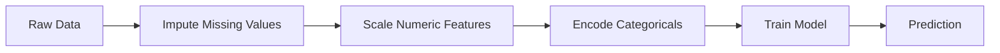
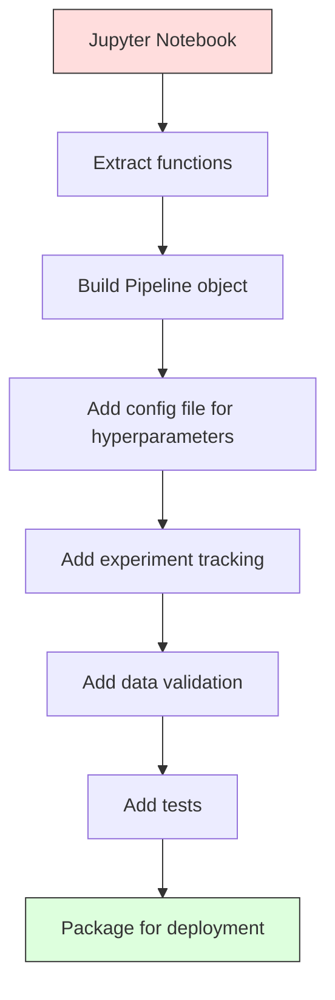

# 道

> 模型不是产品. 管道线才是. 管道线从原始数据到部署的预测的全部过程,并且每一步都必须可复现.

**Type:** Build
**Language:**字符串
**Prerequisites:** Phase 2, Lesson 12 (Hyperparameter Tuning)
**Time:** ~120 minutes

## 学习目标
- 从零构建一个ML管道,将归因,扩展,编码和模型培训 串联成一个可复制的单一对象
- 识别数据泄露 场景,并解释管道 如何通过仅在训练数据上拟合的变压器以防止泄漏
- 构建一个列转换器,对数值和类别特征 应用不同的预处理
- 实现管道串行,并证明与一个已拟合的管道在培训和生产中产生一致的结果

## 问题
你有一个笔记本:它加载数据,使用中位数填充缺失值,缩小功能,训练模型,并打印精度.

一个月后,有人重新训练模型,却得到不同结果――中位数是包含测试数据的完整数据集上计算的数据泄露) ─ 缩放参数没有保存,所以推断使用不同的统计量──特征工程码在训练和服务之间被复制粘贴,两个副本逐渐产生差异──某个类型列在生产中出现了编码器从未见过的新值──

这些不是假设的情况. 这些是 ML 系统在生产中失败的最常见原因.

## 概念
### 管道是什么

管道是一组有序的数据转型,后面接一个模型. 每一步都作为输入的输出.



管道保证:
- 转型只在培训数据上拟合 (没有泄漏)
- 推理时应用完全相同的转换
- 整个对象可以被串行,并作为一个文物部署
- 通过通过通过通过管道进行验证,防止细微泄漏.

### 密默的杀手

数据泄露发生在测试组或未来数据中信息污染培训的时刻.

**Leaky（错误）：**
```python
X = df.drop("target", axis=1)
y = df["target"]

scaler = StandardScaler()
X_scaled = scaler.fit_transform(X)

X_train, X_test = X_scaled[:800], X_scaled[800:]
y_train, y_test = y[:800], y[800:]
```

测试数据看到了测试数据.平均和标准偏差包含测试样本.

**Correct：**
```python
X_train, X_test = X[:800], X[800:]

scaler = StandardScaler()
X_train_scaled = scaler.fit_transform(X_train)
X_test_scaled = scaler.transform(X_test)
```

您不需要专注思考这个问题.

### 斯克拉恩管道

牛牛的`Pipeline`它们是相连的变压器和估计器.`.fit()`,我知道.`.predict()`和 `.score()`按顺序应用所有步骤.

```python
from sklearn.pipeline import Pipeline
from sklearn.preprocessing import StandardScaler
from sklearn.linear_model import LogisticRegression

pipe = Pipeline([
    ("scaler", StandardScaler()),
    ("model", LogisticRegression()),
])

pipe.fit(X_train, y_train)
predictions = pipe.predict(X_test)
```

当你调用`pipe.fit(X_train, y_train)`时:
1. 度器 在 X_train 上调用 `fit_transform`
2. 模型在尺度 X_train 上调用 `fit`

当你调用`pipe.predict(X_test)`时:
1. 测量器在X_test上调用`transform`(不是适合_转换)
2. 模型在规模 X_test 上调用 `predict`

在安装过程中永远不会看到测试数据.

### 列变压器:不同列使用不同管道

真实数据集同时包含数和类列,它们需要不同的预处理.`ColumnTransformer`负责处理这种情况.

```python
from sklearn.compose import ColumnTransformer
from sklearn.preprocessing import StandardScaler, OneHotEncoder
from sklearn.impute import SimpleImputer

numeric_pipe = Pipeline([
    ("impute", SimpleImputer(strategy="median")),
    ("scale", StandardScaler()),
])

categorical_pipe = Pipeline([
    ("impute", SimpleImputer(strategy="most_frequent")),
    ("encode", OneHotEncoder(handle_unknown="ignore")),
])

preprocessor = ColumnTransformer([
    ("num", numeric_pipe, ["age", "income", "score"]),
    ("cat", categorical_pipe, ["city", "gender", "plan"]),
])

full_pipeline = Pipeline([
    ("preprocess", preprocessor),
    ("model", GradientBoostingClassifier()),
])
```

单机编码器 中的`handle_unknown="ignore"`对于生产至关重要.当出现新类别时,它会产生一个全零向量,而不是直接崩.

### 实验追踪

管道让训练可复现,但你还需要跟踪实验之间发生了什么:使用哪些超参数,哪些数据集版本,什么是测量,运行的是哪些代码.

**MLflow**是最常见的开源解决方案:

```python
import mlflow

with mlflow.start_run():
    mlflow.log_param("max_depth", 5)
    mlflow.log_param("n_estimators", 100)
    mlflow.log_param("learning_rate", 0.1)

    pipe.fit(X_train, y_train)
    accuracy = pipe.score(X_test, y_test)

    mlflow.log_metric("accuracy", accuracy)
    mlflow.sklearn.log_model(pipe, "model")
```

每次运行都会记录参数,计量,文物和完整模型――你可以比较运行,复现任意实验,并部署任意模型版本――

**Weights & Biases (wandb)**提供相同功能,并带有主机仪表板:

```python
import wandb

wandb.init(project="my-pipeline")
wandb.config.update({"max_depth": 5, "n_estimators": 100})

pipe.fit(X_train, y_train)
accuracy = pipe.score(X_test, y_test)

wandb.log({"accuracy": accuracy})
```

### 模型版本

完成实验跟踪后,你需要管理模型版本.哪个模型正在生产?哪个正在进行?上周使用的是哪个?

提供:
- **Version tracking:**每个保存的模型都会得到一个版本号码
- **Stage transitions:**演出,制作,档案
- **Approval workflow:**模型必须被明确推进到生产
- **Rollback:**立即切回之前的版本

### 使用DVC进行数据版本

代码使用 Git 做版本化.数据也应该被版本化,但 Git 无法处理大文件.

```
dvc init
dvc add data/training.csv
git add data/training.csv.dvc data/.gitignore
git commit -m "Track training data"
dvc push
```

现在,DVC将实际数据存储在远程存储中,并保留一个很小的数据存储.`.dvc`文件来记录哈希.当你查询某个 Git 承诺时,`dvc checkout`会恢复当时使用的精确数据.

这意味着每个 Git 提交都同时固定了代码和数据.

### 可复制实验

一个可复制的实验需要四件事:

1. **Fixed random seeds:**为 numpy、random 和 framework(torch、sklearn) 设置种子
2. **Pinned dependencies:**使用带精确版本的要求.txt 或诗歌.锁
3. **Versioned data:**使用DVC或类似工具
4. **Config files:**所有超参数都放在配置中,而不是硬码.

```python
import numpy as np
import random

def set_seed(seed=42):
    random.seed(seed)
    np.random.seed(seed)
    try:
        import torch
        torch.manual_seed(seed)
        torch.cuda.manual_seed_all(seed)
        torch.backends.cudnn.deterministic = True
    except ImportError:
        pass
```

### 从笔记本到生产管道



典型演进过程:

1. **Notebook exploration:**快速实验,视觉化,特征观念
2. **Extract functions:**将预处理,特征工程,评估 转移到模块中
3. **Build Pipeline:**将转换 串联成 库尔达尔管道或定制类
4. **Config management:**将所有超参数移入YAML/JSON配置
5. **Experiment tracking:**添加ML流或木伐木
6. **Data validation:**在训练前检查方案,分布和缺少值模式
7. **Tests:**为变压器编写单元测试,为完整管道编写集成测试
8. **Deployment:**连续化管道,使用API(FastAPI、Flask)封装,并集装

### 常见的管道错误

| Mistake | Why it is bad | Fix |
|---------|-------------|-----|
| 在 splitting 前对完整数据 fitting | Data leakage | 使用带 cross_val_score 的 Pipeline |
| 在 Pipeline 外做 feature engineering | Train 与 serve 时 transforms 不一致 | 把所有 transforms 放入 Pipeline |
| 不处理 unknown categories | Production 中出现新值会崩溃 | OneHotEncoder(handle_unknown="ignore") |
| Hardcoded column names | schema 变化时会出错 | 从 config 使用 column name lists |
| 没有 data validation | bad data 会导致悄无声息的错误 predictions | 在 prediction 前添加 schema checks |
| Training/serving skew | 模型在 prod 中看到不同 features | training 和 serving 共用一个 Pipeline 对象 |


```figure
f3-pipeline-flow
```

## 构建它
`code/pipeline.py`中的代码从零构建一个完整的ML管道:

### 步骤1: 定制变压器

```python
class CustomTransformer:
    def __init__(self):
        self.means = None
        self.stds = None

    def fit(self, X):
        self.means = np.mean(X, axis=0)
        self.stds = np.std(X, axis=0)
        self.stds[self.stds == 0] = 1.0
        return self

    def transform(self, X):
        return (X - self.means) / self.stds

    def fit_transform(self, X):
        return self.fit(X).transform(X)
```

### 步骤2:从零构建管道

```python
class PipelineFromScratch:
    def __init__(self, steps):
        self.steps = steps

    def fit(self, X, y=None):
        X_current = X.copy()
        for name, step in self.steps[:-1]:
            X_current = step.fit_transform(X_current)
        name, model = self.steps[-1]
        model.fit(X_current, y)
        return self

    def predict(self, X):
        X_current = X.copy()
        for name, step in self.steps[:-1]:
            X_current = step.transform(X_current)
        name, model = self.steps[-1]
        return model.predict(X_current)
```

### 步骤3: 使用管道 进行跨验证

代码演示了使用管道的交叉验证 如何防止数据泄露:scaler 会分别在每个折叠的训练数据上合.

### 第四步:使用 sklearn 的完整生产管道

一个完整的管道,包含`ColumnTransformer`、多条预处理路径 和一个模型,并使用正确的交叉验证与实验记录进行训练.

## 交付它
本课产出:
- `outputs/prompt-ml-pipeline.md`-- 用于构建和调试ML管道的技能
- `code/pipeline.py`-- 一个完整的管道,从零实现到零

## 练习
1. 构建一个管道,处理包含3个数值列和2个分类列的数据集.`ColumnTransformer`对数学的应用 平均计算+扩展,对类型的应用 应用最频繁的计算+单热编码――使用5次横证实的应用 进行训练――

2. 由于引入数据泄露:在分开前对完整数据集的尺度量化器.

3. 使用 `joblib.dump`在单独脚本中加载它并运行预测――验证预测 完全一致――

4. 向管道 添加一个定制变压器,为两个最重要的数列 创建多项式特征 ((二级) ・它应该放在管道的哪个位置?

5. 为管道 设置ML流跟踪――使用不同超参数 运行 5次实验――使用ML流UI(`mlflow ui`) 比较运行,并选择最佳模型――

## 关键术语
| Term | What people say | What it actually means |
|------|----------------|----------------------|
| Pipeline | "Chain of transforms + model" | 一组有序的已拟合 transformers 和一个模型，作为一个整体应用以防止泄漏 |
| Data leakage | "Test info leaked into training" | 使用 training set 之外的信息构建模型，从而夸大 performance estimates |
| ColumnTransformer | "Different preprocessing per column" | 对不同列子集应用不同 Pipelines，并合并结果 |
| Experiment tracking | "Logging your runs" | 为每次 training run 记录 parameters、metrics、artifacts 和 code versions |
| MLflow | "Track and deploy models" | 用于 experiment tracking、model registry 和 deployment 的 open-source platform |
| DVC | "Git for data" | 面向 large data files 的 version control system，在 git 中存储 hashes，在 remote storage 中存储数据 |
| Model registry | "Model version catalog" | 使用 stage labels（staging、production、archived）追踪 model versions 的系统 |
| Training/serving skew | "It worked in the notebook" | Training 与 inference 期间数据处理方式存在差异，导致 silent errors |
| Reproducibility | "Same code, same result" | 使用相同代码、数据和配置获得完全相同结果的能力 |

## 延伸阅读
- [scikit-learn Pipeline docs](https://scikit-learn.org/stable/modules/compose.html)-- 官方管道参考
- [MLflow documentation](https://mlflow.org/docs/latest/index.html)-- 实验跟踪和模型登记
- [DVC documentation](https://dvc.org/doc)-- 数据版本
- [Sculley et al., Hidden Technical Debt in Machine Learning Systems (2015)](https://papers.nips.cc/paper/2015/hash/86df7dcfd896fcaf2674f757a2463eba-Abstract.html)-- 关于 ML 系统复杂性的开创性论文
- [Google ML Best Practices: Rules of ML](https://developers.google.com/machine-learning/guides/rules-of-ml)-- 实用生产 ML 建议
