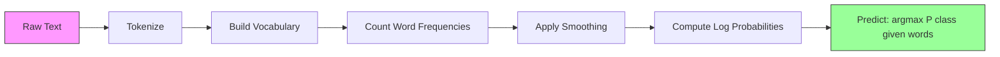

# 简单的贝尔斯

> 假设是错误的,但它仍然有效.

**Type:** Build
**Language:**字符串
**先修要求：**阶段2,课程01-07 ((分类,贝叶斯定理)
**Time:** ~75 分钟

## 学习目标
- 从零实现带拉普拉斯平滑的多个字母天真的贝尔,用于文本分类
- 解释为什么天真的独立假设在数学上是错误的,但在实践中仍然可以产生正确的类别排序
- 比较多项式、伯诺利 和高斯天真的贝尔变体,并为给定特征类型选择合适的版本
- 在高维稀疏数据上将天真的贝斯与物流回归进行对比评估,并解释其中发挥作用的偏差差异交易

## 问题
你需要对文本进行分类. 你需要把邮件分为垃圾邮件或非垃圾邮件. 你需要把客户评论分为积极或负面. 你需要把支持的单个分为不同类别.

大多数分类器在这里都会吃不消. 逻辑回归需要足够多的样本,才能可靠地估计成千上万权重.

简单的贝伊斯可以处理这种情况. 它做了一个数学错误的假设. 给定的类别后,每个特征与其他所有特征都是独立的. 但在文本分类中,它仍然可以超过那些更聪明的模型,特别是在训练集比小时. 它只需要单次遍历数据才能完成训练. 它可以扩展到数百万个特征. 它会产生概率估算.

了解为什么假设错误能带来好预测,会让你学习机器学习的一个根本事实:最好的模型不是最正确的模型,而是对你的数据拥有最佳偏差差差异交易模型.

## 概念
### 贝叶斯定理 (快速回顾)

贝叶斯定理会反转条件概率:

```
P(class | features) = P(features | class) * P(class) / P(features)
```

我们想要`P(class | features)`根据以下几种计算,我们可以计算它:
- `P(features | class)`在该类文档中看到这些词的可能性
- `P(class)`总体上,垃圾邮件有多常见吗?
- `P(features)`证据,对所有类别都相同,因此类别的比较可以忽略

`P(class | features)`最好的类别是胜利.

### 无明自主假设

精确计算`P(features | class)`需要估计所有特征的联合出现的共同概率.

简单的假设是:给定类别后,每个特征都是条件独立的.

```
P(w1, w2, ..., wn | class) = P(w1 | class) * P(w2 | class) * ... * P(wn | class)
```

你不再估计一个不可能的联合分布,而是估计一个简单的特征分布.

这种假设显然是错误的.任何文档中的"机器"和"学习"都不是独立的.但分类器不需要正确的概率估计.

### 为什么它仍然有效

三个原因:

1. **排序优先于校准。**排名只需要排名最高的类别正确――即使P(垃圾邮件) = 0.99999,而真实概率是0.7,分类器仍然会正确选择垃圾邮件――我们不需要正确的概率――我们需要正确的胜出类别――

2. **高 bias，低 variance。**独立假设是一个强的先驱――它强力约束模型,从而防止过度适应――在训练数据有限时,一个略微错误但稳定的模型,将胜过一个理论上正确但极不稳定的模型――这就是偏差差差异在发挥作用――

3. **特征冗余会相互抵消。**相关特征提供冗余的证据――分类器会重复计算这些证据,但它也会为正确类别重复计算――如果"机器"和"学习"总是出现,它们都会为"技术"类提供证据――NB会把它们计算两次,但它是正确类别计算两次――

第四个实践原因: 无数贝斯 极快――训练只是单次遍历数据并统计频率――预测是一次矩阵乘法――你可以在几秒钟内完成训练――这种速度意味着你可以更快代、尝试更多特征,并运行比慢速模型更多的实验――

### 数学一步一步

让我们跟踪一个具体的例子.假设我们有两个类别:垃圾邮件和非垃圾邮件.

训练数据:
- 垃圾邮件提到"免费"80次"",钱"60次"",会议"10次(总计150个词)
- 没有垃圾邮件提到"免费" 5 次"",钱" 10 次"",会议" 100 次(总计 115 个词)
- 发送的邮件是垃圾邮件,60%是非垃圾邮件.

使用拉普拉斯滑滑

```
P(free | spam)    = (80 + 1) / (150 + 3) = 81/153 = 0.529
P(money | spam)   = (60 + 1) / (150 + 3) = 61/153 = 0.399
P(meeting | spam) = (10 + 1) / (150 + 3) = 11/153 = 0.072

P(free | not-spam)    = (5 + 1) / (115 + 3) = 6/118 = 0.051
P(money | not-spam)   = (10 + 1) / (115 + 3) = 11/118 = 0.093
P(meeting | not-spam) = (100 + 1) / (115 + 3) = 101/118 = 0.856
```

新邮件包含:"免费"(2 次) 、"金钱"(1 次) 、"会议"(0 次) 。

```
log P(spam | email) = log(0.4) + 2*log(0.529) + 1*log(0.399) + 0*log(0.072)
                    = -0.916 + 2*(-0.637) + (-0.919) + 0
                    = -3.109

log P(not-spam | email) = log(0.6) + 2*log(0.051) + 1*log(0.093) + 0*log(0.856)
                        = -0.511 + 2*(-2.976) + (-2.375) + 0
                        = -8.838
```

垃圾邮件 以很大优势胜出──"免费" 出现两次是支持垃圾邮件的强有力的证据──注意,"会议"未出现时,对两个日志总量的贡献都是零(0 * log(P))在多项内内,缺失词没有影响──显然建模词缺失是伯诺利NB──

### 三种方式

简单的贝尔有三种形式.`P(feature | class)`,我知道.

#### 多数字 无明的贝斯

将每个特征构建为数量. 最适合特征为词频或TF-IDF值的文本数据.

```
P(word_i | class) = (count of word_i in class + alpha) / (total words in class + alpha * vocab_size)
```

`alpha`是拉普拉斯平滑的下文解释) .

#### 盖斯人天真的贝斯

将每个特征建模为正态分布.

```
P(x_i | class) = (1 / sqrt(2 * pi * var)) * exp(-(x_i - mean)^2 / (2 * var))
```

每个类别都会对每个特征有自己的平均值和方差.

#### 伯诺利天真的贝耶斯

将每个特征建模为二值变量 (或未) ⋅最适合短文本或二值特征向量⋅

```
P(word_i | class) = (docs in class containing word_i + alpha) / (total docs in class + 2 * alpha)
```

不同于多种字母,伯诺利会显然惩罚某个词的缺失. 如果"免费"通常出现在垃圾邮件中,但没有,伯诺利会把它作为反对垃圾邮件的证据.

### 每种变体何时使用

| Variant | Feature Type | Best For | Example |
|---------|-------------|----------|---------|
| Multinomial | 计数或频率 | 文本 classification、bag-of-words | Email spam、topic classification |
| Gaussian | 连续值 | 具有近似正态特征的表格数据 | Iris classification、传感器数据 |
| Bernoulli | 二值（0/1） | 短文本、二值特征 Vector | SMS spam、presence/absence features |

### 拉普拉斯滑滑

如果测试数据中出现一个词,但它从未出现过训练数据的特定类别,会发生什么?

没有滑滑:`P(word | class) = 0/N = 0`零乘进整个乘积后,会使`P(class | features) = 0`无论其他证据有多强. 单个未见的词会摧毁整个预测,

平将给每个特征计数加上一个小计数`alpha`(通常为1):

```
P(word_i | class) = (count(word_i, class) + alpha) / (total_words_in_class + alpha * vocab_size)
```

当alpha=1时,每个词至少有一个很小的概率――测试邮件中出现"解散" 不再会让垃圾邮件的概率归零――滑滑 有一个贝耶斯语解释:它等于在词分布上放置一个均的直线字母前――

更高的阿尔法意味着更强的平滑 (更强的分布更均) ⋅更低的阿尔法意味着更信任的数据――阿尔法是需要调整的超参数――

影响:

| Alpha | Effect | When to use |
|-------|--------|-------------|
| 0.001 | 几乎没有 smoothing，信任数据 | 非常大的训练集，预计不会有未见特征 |
| 0.1 | 轻度 smoothing | 大型训练集 |
| 1.0 | 标准 Laplace smoothing | 默认起点 |
| 10.0 | 重度 smoothing，会压平分布 | 非常小的训练集，预计有许多未见特征 |

### 记录空间计算

乘以百个概率相乘 (每一个小于1) 将导致浮点下流.即使真实值是一个非常小的正数,乘积在浮点数中也会变成零.

解决方案:在日志空间中工作――不要相乘概率,而是相加它们的对数:

```
log P(class | x1, x2, ..., xn) = log P(class) + sum_i log P(xi | class)
```

这将使预测变成点产品:

```
log_scores = X @ log_feature_probs.T + log_class_priors
prediction = argmax(log_scores)
```

矩阵乘法――这就是天真的贝叶斯预测如此快速的原因它与单层线性模型是同样的运算――

### 简单的贝尔斯与物流回归

两者都是用于文本的线性分类器.

| Aspect | Naive Bayes | Logistic Regression |
|--------|------------|-------------------|
| Type | Generative（建模 P(X\|Y)） | Discriminative（建模 P(Y\|X)） |
| Training | 统计频率 | 优化 Loss Function |
| Small data | 更好（强 prior 有帮助） | 更差（不足以估计权重） |
| Large data | 更差（错误假设会拖累） | 更好（更灵活的边界） |
| Features | 假设独立 | 能处理相关性 |
| Speed | 单次遍历，非常快 | 迭代优化 |
| Calibration | 概率较差 | 概率更好 |

经验法则:从天真的贝伊开始. 如果你有足够的数据,并记住进入平台期,就转换到物流回归.

### 类别管道



实际上,我们在木块空间中工作,以避免浮点下流.

```
log P(class | features) = log P(class) + sum_i log P(feature_i | class)
```


```figure
naive-bayes
```

## 构建它
`code/naive_bayes.py`中的代码从零实现了多数NB 和高斯NB.

### 多号号NB

从零实现:

1. **fit(X, y)**对于每个类别,统计每个特征的频率――加入拉普莱斯平滑――计算日志概率――存储类的先例――类别频率的日志)――

2. **predict_log_proba(X)**对于每个样本,计算所有类别的日志 P(类) +日志 P(特征_i 类) .这是一个矩阵乘法:X @ log_probs.T + log_priors──

3. **predict(X)**返回日志概率最高的类别.

```python
class MultinomialNB:
    def __init__(self, alpha=1.0):
        self.alpha = alpha

    def fit(self, X, y):
        classes = np.unique(y)
        n_classes = len(classes)
        n_features = X.shape[1]

        self.classes_ = classes
        self.class_log_prior_ = np.zeros(n_classes)
        self.feature_log_prob_ = np.zeros((n_classes, n_features))

        for i, c in enumerate(classes):
            X_c = X[y == c]
            self.class_log_prior_[i] = np.log(X_c.shape[0] / X.shape[0])
            counts = X_c.sum(axis=0) + self.alpha
            self.feature_log_prob_[i] = np.log(counts / counts.sum())

        return self
```

关键洞察:拟合后,预测只是矩阵乘法加上偏见――这就是天真的贝尔的原因――

### 盖斯尼NB

对于连续特征,我们为每个类别的每个特征估计平均值和方差:

```python
class GaussianNB:
    def __init__(self):
        pass

    def fit(self, X, y):
        classes = np.unique(y)
        self.classes_ = classes
        self.means_ = np.zeros((len(classes), X.shape[1]))
        self.vars_ = np.zeros((len(classes), X.shape[1]))
        self.priors_ = np.zeros(len(classes))

        for i, c in enumerate(classes):
            X_c = X[y == c]
            self.means_[i] = X_c.mean(axis=0)
            self.vars_[i] = X_c.var(axis=0) + 1e-9
            self.priors_[i] = X_c.shape[0] / X.shape[0]

        return self
```

预测会对每个特征使用高斯语 PDF,并跨特征相乘(在日志空间中相加) 』

### 演示:文本分类

代码会生成合成的词包 数据,模拟两个类别的技术文章和体育文章.

合成数据的工作方式如下:我们创建200个词 (特征列) ⋅词 0-39 在技术文章中频率高、在体育中频率低──词 80-119 在体育中频率高、在技术中频率低──词 40-79 在两者中都是中等频率──这会创建一个现实场景:有些词是强类指示器,另一些词是噪音──

### 演示:连续功能

代码会生成类似于Iris的数据(3个类别、4个特征、高斯集群) ――高斯NB使用每个类别的平均值和方差进行分类──每个类别都有不同的中心 ((中向量) 和不同的离散程度 ((变化),模拟现实数据中的各类测量值系统性不同的情况────

代码还演示了:
- **Smoothing comparison：**使用不同阿尔法值训练多项NB,显示滑滑强度对准确率的影响.
- **Training size experiment：**随着训练数据从20个样本增长到1600个样本,NB准确率如何提高.即使样本很少,NB也能达到不错的准确率.
- **Confusion matrix：**每个类别的精度,回忆和F1分数,用于显示NB 在哪里犯错误.

### 预测速度

简单的贝耶斯预测是一个矩阵乘法.
- 多数NB:一次矩阵乘以 (n x d) @ (d x k) = O(n * d * k)
- 盖斯NB:n * k 次 盖斯 PDF 求值,每次覆盖d 个特征 = O(n * d * k)

两者在每个维度都是线性的. 与 KNN (KnN) 需要计算到所有训练点的距离) 或带 RBF 核的 SVM (RBF 核的 SVM) 需要对所有支持向量进行核评估) 相比,NB 在预测时快速进行数量级.

## 使用它
通过使用商店,这两个变体都是一个行式的使用方法:

```python
from sklearn.naive_bayes import GaussianNB, MultinomialNB

gnb = GaussianNB()
gnb.fit(X_train, y_train)
print(f"GaussianNB accuracy: {gnb.score(X_test, y_test):.3f}")

mnb = MultinomialNB(alpha=1.0)
mnb.fit(X_train_counts, y_train)
print(f"MultinomialNB accuracy: {mnb.score(X_test_counts, y_test):.3f}")
```

用于学习做文本分类:

```python
from sklearn.feature_extraction.text import CountVectorizer
from sklearn.naive_bayes import MultinomialNB
from sklearn.pipeline import Pipeline

text_clf = Pipeline([
    ("vectorizer", CountVectorizer()),
    ("classifier", MultinomialNB(alpha=1.0)),
])

text_clf.fit(train_texts, train_labels)
accuracy = text_clf.score(test_texts, test_labels)
```

`naive_bayes.py`代码会将在相同数据上进行零实现与零学习的比较,以验证正确性.

### 们在们的家里,

原始词计数会让每次出现的每一个词都具有相同的权重.但是,像"和"是"这样的常见词会频繁出现现在每个类别中.它们不携带信息.

```python
from sklearn.feature_extraction.text import TfidfVectorizer
from sklearn.naive_bayes import MultinomialNB
from sklearn.pipeline import Pipeline

text_clf = Pipeline([
    ("tfidf", TfidfVectorizer()),
    ("classifier", MultinomialNB(alpha=0.1)),
])
```

TF-IDF 值是负面的,因此可以和多维数NB 一起使用.TF-IDF +多维数NB 的组合是文本分类中最强大的基线之一. 在训练样本少于10,000的数据集中,它经常击败更复杂的模型.

### 用短文本的伯诺利NB

对于短文本 (tweet,SMS,chat),BernoulliNB可能优于多语文NB.短文本的词数量很低,因此多语文NB依赖于频率信息噪音较大.

```python
from sklearn.naive_bayes import BernoulliNB
from sklearn.feature_extraction.text import CountVectorizer

text_clf = Pipeline([
    ("vectorizer", CountVectorizer(binary=True)),
    ("classifier", BernoulliNB(alpha=1.0)),
])
```

计量向量表 中的 `binary=True`标志会将所有计数转换为0/1──没有它,伯诺利NB仍然可以运行,但它看到的是并非为其设计的计数──

### 校准NB概率

概率校准很差. 当NB说P(spam) =0.95时,真实概率可能是0.7──如果你需要可靠的概率估计,例如,用于设置值或与其他模型组合,请使用Skelarn的校准分类CV:

```python
from sklearn.calibration import CalibratedClassifierCV

calibrated_nb = CalibratedClassifierCV(MultinomialNB(), cv=5, method="sigmoid")
calibrated_nb.fit(X_train, y_train)
proba = calibrated_nb.predict_proba(X_test)
```

这将通过交叉验证,在NB的原始分数上拟合一个物流回归.

### 常见的古特哈

1. **负特征值。**多数字符NB 要求非负值的特征.如果你有负值 (例如,在某些设置下,TF-IDF,或标准化后的特征),请改用高斯式NB,或者把特征平移为正值.

2. **零方差特征。**如果某类的某个特征差为零,所有值都相同,概率计算会出现问题.

3. **类别不平衡。**如果99% 的邮件是非垃圾邮件,前P(非垃圾邮件) = 0.99 会非常强,以压力过了概率证据――你可以手动设置类优先级,或使用 sklearn 中的类_优先级参数――

4. **特征缩放。**多数NB 不需要扩展 (它处理计量) ‧ 高斯NB 也不需要扩展 (它估计逐特征统计量) ‧ 这对物流回归和SVM的优势,后两者对特征尺度敏感.

## 交付它
本课会产出:
- `outputs/skill-naive-bayes-chooser.md`选择正确的NB变体的决策技能
- `code/naive_bayes.py`实现的多项NB和高斯NB,并包含了对比的结算

### 当天真的贝耶斯失败时

当独立假设导致排序错误 (而不是仅仅是错误概率) 时,NB会失败.

1. **强特征交互。**如果类别取决于两个特征的组合,而不是取决于任意单独特征,NB会完全错过.

2. **高度相关且 evidence 相反的特征。**如果特征A指向"垃圾邮件",特征B指向"非垃圾邮件",但A 和B 完全相关,NB会看到实际上没有冲突的证据.

3. **非常大的训练集。**当数据充足时,像物流回归这样的歧视性模型会学到真实的决策边界,并超过NB.

实际上,对于文本分类,这些失败模式并非常见.文本特征数量很多,单个特征较弱,而独立假设的错误往往会相互抵消.

## 练习
1. **Smoothing experiment。**在文本数据中使用alpha 值0.01、0.1、1.0、10.0 和 100.0 训练多项NB──绘制精度与alpha──性能在哪里达到峰值?为什么非常高的alpha会损害性能?

2. **Feature independence test。**取一个真实文本数据集. 选择两个明显相关的词语. 机器和学习. 计算 P 字1 字2 字. 类. 并与 P 字1 和字2 字. 类. 比较. 独立假设 错误有多严重?

3. **Bernoulli implementation。**扩展代码,添加一个BernoulliNB类──将字包转换为二值(现在/缺席),并在文本数据上与多式NB比较准确──什么时候Bernoulli会赢?

4. **NB vs Logistic Regression。**在文本数据上训练两者――从100个训练样本开始,逐步增加到10,000――绘制两者的精度与训练集规模――逻辑回归在何时超过天真的贝斯?

5. **Spam filter。**构建一个完整的垃圾邮件分类器:代码化 原始邮件文本、构建词汇、创建字包功能、训练多维码NB,并使用精确和回忆评估(不只是精确为什么?)

## 关键术语
| Term | What people say | What it actually means |
|------|----------------|----------------------|
| Naive Bayes | “简单的概率 classifier” | 一个使用 Bayes' theorem，并假设给定类别后特征 conditionally independent 的 classifier |
| Conditional independence | “特征彼此不影响” | P(A, B \| C) = P(A \| C) * P(B \| C)——一旦知道 C，知道 B 不会告诉你关于 A 的任何新信息 |
| Laplace smoothing | “Add-one smoothing” | 给每个特征添加一个小计数，防止零概率主导预测 |
| Prior | “看到数据之前你相信什么” | P(class)——观察任何特征之前，每个类别的概率 |
| Likelihood | “数据拟合得有多好” | P(features \| class)——如果类别已知，观察到这些特征的概率 |
| Posterior | “看到数据之后你相信什么” | P(class \| features)——观察到特征后，类别的更新概率 |
| Generative model | “建模数据如何生成” | 学习 P(X \| Y) 和 P(Y)，然后使用 Bayes' theorem 得到 P(Y \| X) 的模型 |
| Discriminative model | “建模 decision boundary” | 不建模 X 如何生成，而是直接学习 P(Y \| X) 的模型 |
| Log probability | “避免 underflow” | 使用 log P 而不是 P，防止许多小数相乘后在浮点数中变成零 |

## 延伸阅读
- [scikit-learn Naive Bayes docs](https://scikit-learn.org/stable/modules/naive_bayes.html) 三种变体及其数学细节
- [McCallum and Nigam, A Comparison of Event Models for Naive Bayes Text Classification (1998)](https://www.cs.cmu.edu/~knigam/papers/multinomial-aaaiws98.pdf)文本中多项与伯诺利的经典比较
- [Rennie et al., Tackling the Poor Assumptions of Naive Bayes Text Classifiers (2003)](https://people.csail.mit.edu/jrennie/papers/icml03-nb.pdf) 针对文本NB的改进
- [Ng and Jordan, On Discriminative vs. Generative Classifiers (2001)](https://ai.stanford.edu/~ang/papers/nips01-discriminativegenerative.pdf) 证明NB 在数据较少时比 LR 收更快
