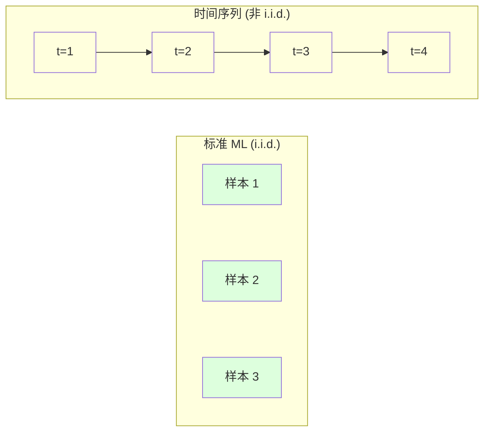
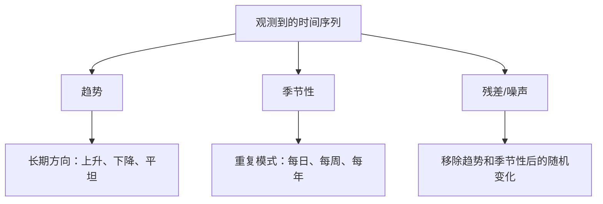
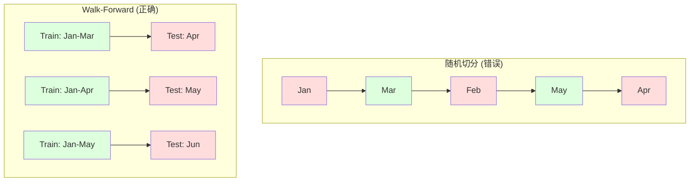

# 时间序列基础

> 过去的表现确实可以预测未来的结果-- 前提是你先检查平稳性――

**Type:** Build
**Language:**字符串
**Prerequisites:** Phase 2, Lessons 01-09
**Time:** ~90 分钟

## 学习目标

- 将时间序列分解为趋势,季节性和残差组件,并检查平稳性
- 实现滞后特征和滚动统计,把时间序列转换为监督学习问题
- 构建前进验证框架,防止未来数据泄露到训练中
- 解释为什么随机火车/测试分为时间序列无效,并展示它与正确时间分之间的性能差距

## 问题

你有时间排序的数据. 每天的销售量, 每小时的温度, 每分钟的 CPU 使用率, 每周的股票价格.

你拿出标准的 ML 工具箱:随机列车/测试分区"",交叉验证"",输入特征矩阵"",输出预测"",每一步都是错的――

时间序列会打破标准ML依赖假设――样本并不独立--今天的温度依赖于昨天的温度――随时分开将未来信息泄露到过去――在后测试中看起来很好,到了生产环境的失败,因为它们依赖于随时间漂移的模式――

一个随机交叉验证的模型获得了95%的准确性,在正确的基于时间的评估中,只有55%的可能性.

本课内容包括时间数据有什么不同,如何诚实地评估模型以及如何将时间序列转换为标准ML模型的可使用特征.

## 概念

### 时间序列有什么不同

标准 ML 假设 i.i.d. -- 独立同分布──每种样本都从同一个分布中抽取,并且独立于其他样本──时间序列同时违反了这两个点:

- **不独立。**今天的股票价格取决于昨天的价格.
- **不同分布。**12月的销售额与 3月的销售额不同.

这些违规行为并不轻微.它们会改变你构建特征的方式,评估模型的方式以及可用的算法.



在标准 ML 中,样本可以互换.打乱它们不会改变任何东西.

### 时间序列的组成部分

每个时间序列都是以下内容的组合:



- **趋势**长期方向――收入每年增长10%――全球气温上升――
- **季节性**零售销售在12月增长.空调使用量在7月达到峰值.
- **残差**移动趋势和季节性后剩下的部分. 如果残差看起来像白噪声,说明分解捕获信号.

### 稳定性

如果一个时间序列的统计属性 (平均值,方差,自相关) 不随时间变化,它就是平稳的.

**为什么重要：**在1月数据训练模型中,所学到的平均值与2月呈现的平均值不同.

**如何检查：**在窗口上计算滚动平均和滚动标准偏差.如果它们漂移,序列就是不平稳的.

**如何修复：**差分――不要建模原始值,而是建模连续值之间的变化:

```
diff[t] = value[t] - value[t-1]
```

如果一次差分不能使序列平稳,就再应用一次.

**示例：**

原始序列:[100, 102, 106, 112, 120]
一阶差分: [2, 4, 6, 8](仍在上升趋势)
二阶差分: [2,2,2](常数 -- 平稳)

原始序列有二次趋势――一阶差分将其变成线性趋势――二阶差分让它变平――在实践中,你很少需要超过两次差分――

**形式化检验：**增强克式填充测试 (ADF) 是平稳的标准统计检查. 原假设是序列不平稳的. 低于0.05的p值表示你可以拒绝原假设并得出平稳结论. 我们从零实现ADF不需要渐近分布表,但代码中的滚动统计方法提供了实用可视化检查.

### 自相关

自相关衡量时间 t 的值与时间 t-k 过去 k 步的值之间的相关程度――自动相对函数 (ACF) 会绘制每个滞 k 的这种相关性――

**ACF 告诉你：**
- 序列能记住多远.如果ACF在5 后降到零,则5 步前的值无关紧要.
- 如果ACF在12月度数据后出现峰值,则会出现年度季节性.
- 为了创建多少滞后特征.

**PACF (Partial Autocorrelation Function)**如果今天与前3天相关,只是因为二者与昨天相关,那么3的PACF会是零,而3的ACF不会是零.

### 滞后特征:把时间序列转换为监督学习

标准 ML 模型需要特征矩阵 X 和目标 y.时间序列只给你一列值.

取序列 [10, 12, 14, 13, 15],创建 lag-1 和 lag-2 特征:

| lag_2 | lag_1 | target |
|-------|-------|--------|
| 10    | 12    | 14     |
| 12    | 14    | 13     |
| 14    | 13    | 15     |

现在你有一个标准回归问题.任何ML模型 (线性回归,随机森林,渐进增长) 都可以从这些延迟预测目标中实现.

您可以使用其他特性:
- **Rolling statistics:**最近的 k 个值的平均值
- **Calendar features:**星期几月份,这是假期,是周末.
- **Differenced values:**相比上一步的变化
- **Expanding statistics:**累计平均 累计总量
- **Ratio features:**当前值 /滚动平均值 (偏离近期平均值多远)
- **Interaction features:**工作日对动量的影响)

**多少个 lag？**使用自动相关性函数. 如果ACF到10个滞后是显著的,就至少使用10个滞后.如果周季节性存在,包含7个滞后,也可能包含14个滞后.更多滞后将给模型提供更多历史信息,但也会增加需要适合的特征数量,从而提高过度适应风险.

**target 对齐陷阱。**创建滞后特征时,目标必须是时间 t 的值,并且所有特征都必须使用时间 t-1 或更早的值.如果你不小心把时间 t 的值作为包含的特征,你就拥有完美的预测器,以及一个完全无用的模型.这是时间序列特征工程中最常见的错误.

### 经验证

这就是本课程最重要的概念.标准的 k 倍加验证会随时将样本分配到火车和测试中.



进行前进验证:
1. 在截至时间的数据上训练
2. 预测时间 t+1(或用于多步预测的 t+1 到 t+k)
3. 将窗口向前滑动
4. 重复 其他

每个测试折叠只包含了所有训练后的数据. 没有未来泄露. 这将给你一个诚实的估计,说明模型部署后的表现.

**Expanding window**使用所有历史数据进行训练.**Sliding window**使用固定大小的训练窗口 (滑动窗口) ⋅当你相信更旧的数据仍然相关时,使用扩展──当世界变化且旧数据有害时,使用滑动──

### 们直觉

亚里马是经典的时间序列模型. 它有三个组件:

- **AR (Autoregressive):**从过去值进行预测──AR(p) 使用最近的 p 个值──
- **I (Integrated):**通过差分实现平稳性.
- **MA (Moving Average):**从过去预测误差进行预测──MA(q) 使用最近的 q 个误差──

您基于ACF/PACF 分析或自动搜索

我们不会从零实现ARIMA - 它需要数值优化,超出本课范围.关键洞察是理解每个组件的作用,这样你就能解释ARIMA的结果,并知道何时使用它.

### 何时使用什么

| Approach | Best For | Handles Seasonality | Handles External Features |
|----------|---------|-------------------|------------------------|
| 滞后特征 + ML | 有很多外部特征的表格数据 | 通过 calendar features | 是 |
| ARIMA | 单个单变量序列、短期 | SARIMA 变体 | 否（ARIMAX 支持有限） |
| Exponential smoothing | 简单趋势 + 季节性 | 是（Holt-Winters） | 否 |
| Prophet | 业务预测、节假日 | 是（Fourier terms） | 有限 |
| Neural networks (LSTM, Transformer) | 长序列、多序列 | 学习得到 | 是 |

对于大多数实际问题来说,滞后特征+梯度提升是最强的起点.

### 预测 视野和策略

单步预测会预测未来一个时间步.多步预测会预测多个时间步.有三种策略:

**Recursive (iterated):**预测下一步,把预测结果作为下一步的输入――简单,但错误会积累――每个预测都使用上一个预测,因此错误会复杂――

**Direct:**为每一个视界 训练单独的模型――模型-1 预测 t+1,模型-5 预测 t+5――没有积累的差异,但每个模型的训练样本更少,而且它们不共享信息――

**Multi-output:**训练一个同时输出所有视界的模型――跨视界共享信息,但需要支持多输出模型 (或自定义损失函数) ――

对于大多数实际问题,短视野 (短视野) 从递归开始,较长视野 用直接的.

### 时间序列中的常见错误

| Mistake | Why it happens | How to fix |
|---------|---------------|-----------|
| 随机 train/test split | 来自标准 ML 的习惯 | 使用 walk-forward 或 temporal split |
| 使用未来特征 | 误把时间 t 的特征包含进去 | 审计每个特征的时间对齐 |
| 对季节性 overfitting | 模型记住了日历模式 | 在 test set 中留出一个完整季节周期 |
| 忽略尺度变化 | 收入翻倍但模式保持 | 建模百分比变化而非绝对值 |
| 过多滞后特征 | “更多历史更好” | 使用 ACF 确定相关 lag |
| 不做差分 | “模型会自己搞定” | 树模型能处理趋势；线性模型需要平稳性 |


```figure
f3-series-decompose
```

## 构建它

`code/time_series.py`中代码从零实现了核心构建块.

### 滞后特征创建器

```python
def make_lag_features(series, n_lags):
    n = len(series)
    X = np.full((n, n_lags), np.nan)
    for lag in range(1, n_lags + 1):
        X[lag:, lag - 1] = series[:-lag]
    valid = ~np.isnan(X).any(axis=1)
    return X[valid], series[valid]
```

这将把1D序列转化为特征矩阵,其中每一行都是最近的.`n_lags`个值作为特征,并以当前值作为目标.

### 走向向的十字验证

```python
def walk_forward_split(n_samples, n_splits=5, min_train=50):
    assert min_train < n_samples, "min_train must be less than n_samples"
    step = max(1, (n_samples - min_train) // n_splits)
    for i in range(n_splits):
        train_end = min_train + i * step
        test_end = min(train_end + step, n_samples)
        if train_end >= n_samples:
            break
        yield slice(0, train_end), slice(train_end, test_end)
```

每次分分都确保训练数据严格提前测试数据.

### 简单 权威退行 模型

纯AR模型就是滞后特征的线性回归:

```python
class SimpleAR:
    def __init__(self, n_lags=5):
        self.n_lags = n_lags
        self.weights = None
        self.bias = None

    def fit(self, series):
        X, y = make_lag_features(series, self.n_lags)
        # Solve via normal equations
        X_b = np.column_stack([np.ones(len(X)), X])
        theta = np.linalg.lstsq(X_b, y, rcond=None)[0]
        self.bias = theta[0]
        self.weights = theta[1:]
        return self
```

这在概念上与课02中的线性回归完全相同,只是应用在同一变量的时间滞后版本上.

### 平稳性检查

代码计算滚动统计,用于可视化和数值化评估平稳性:

```python
def check_stationarity(series, window=50):
    rolling_mean = np.array([
        series[max(0, i - window):i].mean()
        for i in range(1, len(series) + 1)
    ])
    rolling_std = np.array([
        series[max(0, i - window):i].std()
        for i in range(1, len(series) + 1)
    ])
    return rolling_mean, rolling_std
```

如果滚动的平均值变化,序列就是不平稳的.

代码也通过比较序列前半段和后半段来检查平稳性. 如果平均值差异超过半个标准差异,或方差超过2倍,序列将被标记为不平稳.

### 自相关

```python
def autocorrelation(series, max_lag=20):
    n = len(series)
    mean = series.mean()
    var = series.var()
    acf = np.zeros(max_lag + 1)
    for k in range(max_lag + 1):
        cov = np.mean((series[:n-k] - mean) * (series[k:] - mean))
        acf[k] = cov / var if var > 0 else 0
    return acf
```

## 使用它

通过使用Skularn,你可以直接把滞后特征交给任何回归者:

```python
from sklearn.linear_model import Ridge
from sklearn.ensemble import GradientBoostingRegressor

X, y = make_lag_features(series, n_lags=10)

for train_idx, test_idx in walk_forward_split(len(X)):
    model = Ridge(alpha=1.0)
    model.fit(X[train_idx], y[train_idx])
    predictions = model.predict(X[test_idx])
```

对于ARIMA,使用统计模型:

```python
from statsmodels.tsa.arima.model import ARIMA

model = ARIMA(train_series, order=(5, 1, 2))
fitted = model.fit()
forecast = fitted.forecast(steps=30)
```

`time_series.py`中的代码演示了两种方法,并使用步向验证进行比较.

### 时间系列 分类

 sklearn 提供实现前进验证的`TimeSeriesSplit`其他:

```python
from sklearn.model_selection import TimeSeriesSplit

tscv = TimeSeriesSplit(n_splits=5)
for train_index, test_index in tscv.split(X):
    X_train, X_test = X[train_index], X[test_index]
    y_train, y_test = y[train_index], y[test_index]
    model.fit(X_train, y_train)
    score = model.score(X_test, y_test)
```

这等于我们从零开始实现的价格.`walk_forward_split`现在,我们已经进入了Skularn的跨验证框架.`cross_val_score`一起使用:

```python
from sklearn.model_selection import cross_val_score

scores = cross_val_score(model, X, y, cv=TimeSeriesSplit(n_splits=5))
print(f"Mean score: {scores.mean():.4f} +/- {scores.std():.4f}")
```

### 评估指标

时间序列预测使用回归指标,但带有时间感知的上下文:

- **MAE (Mean Absolute Error):**简单的解释,预测偏差为3.2度.
- **RMSE (Root Mean Squared Error):**平均二次错误的平方根――相比 MAE,它对大错误的惩罚更重――当大错误比很多小错误更糟糕时使用――
- **MAPE (Mean Absolute Percentage Error):**错误/真实值是*100的平均值,与尺度无关,适合比较不同序列,但真实值为零时未定义.
- **Naive baseline comparison:**始终与简单的基线相比. 季节性天真的基线 会预测上一周期的价值.

### 滚动特征

代码显示了向后延迟的特征加上滚动统计数据,7天和14天窗口上的平均、std、min、max) ⋅这些特征将为模型提供近期趋势和波动性信息,而这些信息仅靠后延迟的特征无法捕获──

例如,如果滚动的平均水平在上升,说明存在上升趋势.如果滚动的转变在增加,说明波动性在增长.

## 交付它

本课产出:
- `outputs/prompt-time-series-advisor.md`-- 一个用于定义时间序列问题的提示
- `code/time_series.py`后特征,前进验证,AR模型,平稳性检查

### 你必须击败的基线

在构建任何模型之前,先建立基线:

1. **Last value (persistence).**预测明天会和今天一样.
2. **Seasonal naive.**预测今天会和上周同一个天一样. 如果你的模型不能击败它,说明它没有学到任何有用的模式.
3. **Moving average.**预测最近的 k 个值的平均值――能平滑噪音,但无法捕捉突变――

如果你的高级 ML 模型输出了季节性天真的基线,你就有错误.

### 实用建议

1. **从绘图开始。**在任何建模之前,先绘制原始序列――寻找趋势,季节性,外观性,结构性破裂,行为突然变化――30秒的可视化检查通常比一小时的自动分析告诉你更多――

2. **先差分，再建模。**如果序列有明显的趋势,在创建滞后特征之前先做差分.树型模型可以处理趋势,但线性模型不能,差分通常不会有坏处.

3. **至少留出一个完整季节周期。**如果有周季节性,测试组至少需要完整一周. 如果是月季节性,至少需要完整一月.

4. **在生产中监控。**随着世界变化,时间序列模型随着时间退化. 随着时间的变化,随着时间的变化,随着时间的变化,随着时间的变化,随着时间的变化,随着时间的变化,随着时间的变化,随着时间的变化,随着时间的变化,随着时间的变化,随着时间的变化,随着时间的变化,随着时间的变化,随着时间的变化,随着时间的变化,随着时间的变化,随着时间的变化,随着时间的变化,随着时间的变化,随着时间的变化,随着时间的变化,随着时间的变化,随着时间的变化,随着时间的变化,随着时间的变化,随着时间的变化,随着时间的变化,随着时间的变化,随着时间的变化,随着时间的变化,随着时间的变化.

5. **警惕 regime changes。**在疫情前数据上训练的模型无法预测疫情后行为. 作为特征加入已知政权变化的指示器,或使用将遗忘旧数据的滑动窗口.

6. **对偏斜序列做 log-transform。**收入,价格和计数通常右偏.取日记可以稳定方差,并把乘法模式变成加法模式,从而使线性模型能够处理.

## 练习

1. **平稳性实验。**生成一个带线性趋势的序列――使用滚动统计统计 检查平稳性――应用一阶差分――再次检查――对于第二个趋势,需要多少轮差分?

2. **Lag 选择。**在季节性序列中,在计算ACF上,哪些延迟是自相关的最高?只使用这些延迟而不是连续延迟) 创建延迟特征.

3. **Walk-forward vs random split。**在滞后特征上训练坡回归――随机80/20分和步向验证 评估――随机切分高估了多少性能?

4. **特征工程。**向滞后特征添加滚动平均值 (window=7) 滚动STD (window=7) 和周日特征──使用前进验证比较添加这些额外特征前后的准确性──

5. **多步预测。**修改AR模型,让它预测未来5步而不是1步.比较两种策略:

## 关键术语

| Term | What people say | What it actually means |
|------|----------------|----------------------|
| Stationarity | “统计量不随时间变化” | 均值、方差和自相关结构随时间保持不变的序列 |
| Differencing | “连续值相减” | 计算 y[t] - y[t-1] 来移除趋势并实现平稳性 |
| Autocorrelation (ACF) | “一个序列与自身的相关程度” | 时间序列与自身滞后副本之间的相关性，作为 lag 的函数 |
| Partial autocorrelation (PACF) | “只有直接相关” | 移除所有更短 lag 的影响后，lag k 上的自相关 |
| Lag features | “把过去值作为输入” | 使用 y[t-1]、y[t-2]、...、y[t-k] 作为特征来预测 y[t] |
| Walk-forward validation | “尊重时间顺序的 cross-validation” | 训练数据在时间上始终先于测试数据的评估方式 |
| ARIMA | “经典时间序列模型” | AutoRegressive Integrated Moving Average：组合过去值（AR）、差分（I）和过去误差（MA） |
| Seasonality | “重复的日历模式” | 与日历周期（每日、每周、每年）相关的、规则且可预测的时间序列周期 |
| Trend | “长期方向” | 序列水平随时间持续上升或下降 |
| Expanding window | “使用所有历史” | 训练集随每个 fold 增长的 walk-forward validation |
| Sliding window | “固定大小的历史” | 训练集是向前滑动的固定长度窗口的 walk-forward validation |

## 延伸阅读

- [Hyndman and Athanasopoulos, Forecasting: Principles and Practice (3rd ed.)](https://otexts.com/fpp3/)-- 最好的免费时间序列预测教材
- [scikit-learn Time Series Split](https://scikit-learn.org/stable/modules/generated/sklearn.model_selection.TimeSeriesSplit.html)-- sklearn 的前进分离器
- [statsmodels ARIMA docs](https://www.statsmodels.org/stable/generated/statsmodels.tsa.arima.model.ARIMA.html)-- 带诊断的ARIMA 实现
- [Makridakis et al., The M5 Competition (2022)](https://www.sciencedirect.com/science/article/pii/S0169207021001874)-- 展示 ML 方法与统计方法大规模预测竞赛
