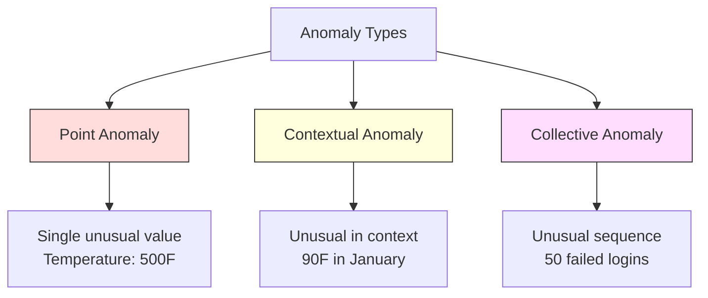
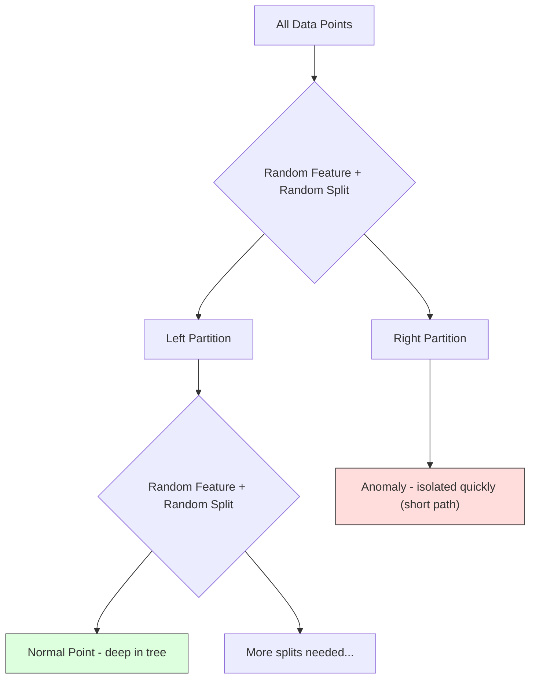
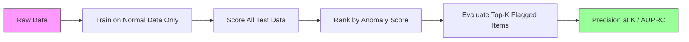

# 异常检测

> 正常的很容易定义.异常就是任何不符合它的东西.

**Type:** Build
**Language:**字符串
**Prerequisites:** Phase 2, Lessons 01-09
**Time:** ~75 minutes

## 学习目标

- 从零实现Z-score、IQR 和孤立森林异常检测方法
- 区分点、背景和集体异常,并为每种选择合适的检测方法
- 解释为什么异常检测被表达为正常数据而不是异常进行分类
- 较监督不下的异常检测与监督的分类,并评估新异常的范围和精度之间的权衡

## 问题

一张信用卡在下午2点到纽约被使用,随后在下午2点05点到东京被使用. 一个工厂传感器读数为150度,正常范围为80-120度.

这些都是异常. 发现它们很重要. 欺诈会造成数十亿美元的损失. 设备故障会导致停机时间.

挑战在于:你很少有标签的异常 示例――欺诈占交易的0.1%――设备故障一年只发生几次――你无法训练标准分类器,因为"异常"类几乎没有可学习的内容――即使你有一些标签,你见过的异常也不是未来会遇到的所有类型――明天的欺诈方案将与今天的方案不同――

异常检测反转了问题――不要学习什么是异常,而是学习什么是正常――任何偏离正常的东西都是可疑的――这种方法不需要标签,能够适应新类型的异常,并可扩展到海量数据集――

## 概念

### 异常的类型

不是所有异常都相同:

- **Point anomalies.**单个数据点无论上下文如何都很不寻常――500度的温度读数――一个通常消费$50 的账户发生 $交易量为5万.
- **Contextual anomalies.**某个数据点在给定下文下异常――90°在夏天是正常的,在冬天是异常的――同一个值,不同在下文下――
- **Collective anomalies.**一组数据点作为整体是异常的,即使每个单独的数据点可能都是正常的.

大多数方法检测点异常――背景异常――需要时间或位置特征――集体异常――需要序列意识的方法――



### 没有监督表述

在标准分类中,你有两个类型的标签. 在异常检测中,通常会遇到以下三个情况之一:

1. **Fully unsupervised.**完全没有标签. 你在所有数据上都能配合检测器,并希望异常很少,不会污染"正常"模型.
2. **Semi-supervised.**你有一个只包含正常数据的干净数据集. 你在这个干净数据集中适合,然后对所有其他数据打分.
3. **Weakly supervised.**你有少量带标签的异常. 将它们用于评估,而不是训练.

关键洞见:异常检测与分类有本质区别――你是在对正常数据的分布构建,而不是学习两个类别之间的决定界限――

### 监督与监督不下的:权衡

如果确实有标签异常,应该把它们用于训练 (监督分类),还是仅用于评估 (不监督检测)?

**Supervised（当作 Classification 处理）：**
- 能捕捉到你以前见过的确切异常类型
- 对已知异常类型具有更高的精度
- 完全失去了新奇异常类型
- 出现新异常时需要重新训练
- 需要足够多的异常示例(通常太少)

**Unsupervised（对 normal 建模，标记偏离项）：**
- 能捕捉任何偏离正常的情况,包括小说类型
- 不需要带标签的异常
- 假阳性率更高,并非所有不寻常的都是坏事)
- 对于分布转移更强

实践中,最好的系统会结合两种:使用无监督检测 获得广泛覆盖,使用监督模型处理已知高优先级异常 类型,并让人工审查模糊案例──

### 方法

最简单的方法――计算每个特征的平均和标准偏差――标记任何距离的平均 超过 k 个标准偏差的点――

```text
z_score = (x - mean) / std
anomaly if |z_score| > threshold
```

默认门是3.0(对于高斯分布,99.7%的正常数据落在3个标准偏差范围内)

**优点：**简单――快速――可解释("这个值离正常的距离有4.5个标准偏差")

**缺点：**假设数据服从正常分布. 对训练数据中的异常值. 敏感. 异常值会移动,并增加,使它们更难被检测出来.

**适用场景：**数据大致呈钟形分布单个功能 监控――服务器响应时间、制造公差、具有稳定基线的传感器读数――

**失效场景：**多集群 数据(两个办公室位置有不同的基线 温度) 歪曲数据(交易金额1000美元 很少见但并非异常) 训练集中包含异常的数据──

### 方法

比Z分更强──使用中位数范围,而不是平均和标准偏差──

```
Q1 = 25th percentile
Q3 = 75th percentile
IQR = Q3 - Q1
lower_bound = Q1 - factor * IQR
upper_bound = Q3 + factor * IQR
anomaly if x < lower_bound or x > upper_bound
```

默认因子是1.5.

**优点：**对异常值强的百分比 不受极端值影响) 适用于偏差分布,没有正常性假设.

**缺点：**仅适用于单变性 (单独看可能是正常的,但在联合空间中是异常的)

**实践说明：**根据""的分析,在""中,的值是潜在的异常值.

### 孤立森林

关键洞见:异常数量少且与众不同. 当数据进行随机分区时,异常更容易被分离出来,它们只需要更少的随机分区才能与其余数据分开.



**工作方式：**
1. 构建许多随机树木 (一个孤立的森林)
2. 在每个节点,随时选择一个功能,并在该功能的最小和最大之间随时选择一个分值
3. 持续分裂,直到每个点都被隔离,
4. 所有树木上有较短的平均路径长度

**为什么有效：**常规点位于密集区域.需要许多随机分离才能将一个点与其邻居隔离出来.

基于所有树木的平均路径长度,并使用随机二进制搜索树的预期路径长度进行正常化:

```
score(x) = 2^(-average_path_length(x) / c(n))
```

其中`c(n)`是 n个样本的预期路径长度──Score 接近 1 表示异常──Score 接近 0.5 表示正常──Score 接近 0 表示非常正常(位于密集集团深处)。

**优点：**没有分布假设――适用于高尺寸――扩展性好――由于每棵树使用子样本,所以相对于样本大小是子线性)――处理混合特征类型――

**缺点：**难以处理密集区域 中的异常 (化效应) ⋅当许多特征不相关时,随机分开效果较差──

**关键 hyperparameters：**
- `n_estimators`树木数量――100通常足够――更多树木会带来更稳定的分数,但计算更慢――
- `max_samples`树的样本数量――原始论文默认值为256――较小的值将使单棵树不那么准确,但会提高多样性―― 副样本正是孤立森林快速的原因,每棵树只看到一小部分数据――
- `contamination`预期异常 比如――只用于设置门──不影响分数 本身──

### 地方外卖因素 (LOF)

LOF将某个点周围的当地密度与邻居周围密度进行比较.

**工作方式：**
1. 为了每个点,找到它的 k 最近的邻居
2. 计算本地可达度密度 (邻域有多密)
3. 与邻居的密度相比
4. 如果某个点的密度显得低于其邻居,它就会变得异常.

**LOF score：**
- 接近1.0表示与邻居相似的密度
- LOF大于1.0 表示密度低于邻居(可能异常)
- LOF 远大于 1.0 (例如 2.0+) 表示密度显著更低 (很可能是异常)

考虑一个有两个集群的数据集:一个包含1000个点的密集集,另一个包含50个点的稀疏集群.

**优点：**检测当地异常点,即使它们不是全局异常点,也适用于不同密度的集群.

**缺点：**在大型数据集中慢的实现为 O                                                                                                                                                                                                                                                          

### 对于

| Method | Assumptions | Speed | Handles High Dims | Detects Local Anomalies |
|--------|------------|-------|-------------------|------------------------|
| Z-score | Normal distribution | 非常快 | 是（逐 feature） | 否 |
| IQR | 无（逐 feature） | 非常快 | 是（逐 feature） | 否 |
| Isolation Forest | 无 | 快 | 是 | 部分 |
| LOF | Distance 有意义 | 慢 | 较差 | 是 |

### 评估挑战

评估异常检测器比评估分类器更难:

- **Extreme class imbalance.**如果异常占0.1%,对所有内容都预测"正常"会得到99.9%的准确性.
- **AUROC 具有误导性。**在严重的失衡下,即使模型在实际的门下漏掉大多数异常,AUROC 也可能看起来不错.
- **更好的 metrics：**精确度调度曲线 下面积),以及固定错误正率 下面调度.



### 异常检测管道

实践中,异常检测 遵循以下工作流程:

1. **收集 baseline data.**理想情况下,选择一个你知道没有 (或几乎没有) 异常的时期.
2. **Feature engineering.**原始特征加上衍生特征(滚动统计,时间特征,比率)
3. **训练 detector.**在基线数据上拟合――模型学习"正常"的样式――
4. **对新数据打分.**每次新的观察都会得到一个异常分数.
5. **Threshold selection.**选择分数截止.这是业务决策:更高的门意味着虚假报警更少,但错过了异常.
6. **Alert and investigate.**被标记的点进入人工审查或自动响应.
7. **Feedback collection.**记录被标记项是真实异常或是虚假报警.

管道线永远不是"完成"――数据分布会漂移,新的异常类型会出现,门也需要调整――把异常检测当作一个持续运行的系统,而不是一次性模型――


```figure
f3-anomaly-fence
```

## 构建它

`code/anomaly_detection.py`中代码从零实现了Z分数,IQR和隔离森林.

### 测量器

```python
def zscore_detect(X, threshold=3.0):
    mean = X.mean(axis=0)
    std = X.std(axis=0)
    std[std == 0] = 1.0
    z = np.abs((X - mean) / std)
    return z.max(axis=1) > threshold
```

简单且向量化. 如果任何特征超过门,就标记该点.

### 智能仪表检测器

```python
def iqr_detect(X, factor=1.5):
    q1 = np.percentile(X, 25, axis=0)
    q3 = np.percentile(X, 75, axis=0)
    iqr = q3 - q1
    iqr[iqr == 0] = 1.0
    lower = q1 - factor * iqr
    upper = q3 + factor * iqr
    outside = (X < lower) | (X > upper)
    return outside.any(axis=1)
```

### 从零实现孤立森林

从零实现的版本会构建隔离树,对特征空间进行随机分区:

```python
class IsolationTree:
    def __init__(self, max_depth):
        self.max_depth = max_depth

    def fit(self, X, depth=0):
        n, p = X.shape
        if depth >= self.max_depth or n <= 1:
            self.is_leaf = True
            self.size = n
            return self
        self.is_leaf = False
        self.feature = np.random.randint(p)
        x_min = X[:, self.feature].min()
        x_max = X[:, self.feature].max()
        if x_min == x_max:
            self.is_leaf = True
            self.size = n
            return self
        self.threshold = np.random.uniform(x_min, x_max)
        left_mask = X[:, self.feature] < self.threshold
        self.left = IsolationTree(self.max_depth).fit(X[left_mask], depth + 1)
        self.right = IsolationTree(self.max_depth).fit(X[~left_mask], depth + 1)
        return self
```

隔离某个点所需的路径长度决定其异常分数――更短的路径表示更异常――

`IsolationForest`包装了多棵树:

```python
class IsolationForest:
    def __init__(self, n_estimators=100, max_samples=256, seed=42):
        self.n_estimators = n_estimators
        self.max_samples = max_samples

    def fit(self, X):
        sample_size = min(self.max_samples, X.shape[0])
        max_depth = int(np.ceil(np.log2(sample_size)))
        for _ in range(self.n_estimators):
            idx = rng.choice(X.shape[0], size=sample_size, replace=False)
            tree = IsolationTree(max_depth=max_depth)
            tree.fit(X[idx])
            self.trees.append(tree)

    def anomaly_score(self, X):
        avg_path = average path length across all trees
        scores = 2.0 ** (-avg_path / c(max_samples))
        return scores
```

正常化因素`c(n)`是包含n个元素的二进制搜索树 中一次失败的搜索的预期路径长度──它等于`2 * H(n-1) - 2*(n-1)/n`在其中`H`确保分数在不同大小的数据集之间可比较.

### 演示场景

代码生成多个测试场景:

1. **Single cluster with outliers.**一个2D高斯集团,在远离中心的位置注入异常.
2. **Multimodal data.**三个不同大小和密度的集群.集群之间的点是异常的.
3. **High-dimensional data.**测试方法是否能在特征中集中找到异常?

每个演示都使用了精确的方法, 召回的方法, F1 和 Precision@k 比较所有方法.

## 使用它

使用 sklearn(使用库实现,而不是从零实现):

```python
from sklearn.ensemble import IsolationForest
from sklearn.neighbors import LocalOutlierFactor

iso = IsolationForest(n_estimators=100, contamination=0.05, random_state=42)
iso.fit(X_train)
predictions = iso.predict(X_test)

lof = LocalOutlierFactor(n_neighbors=20, contamination=0.05, novelty=True)
lof.fit(X_train)
predictions = lof.predict(X_test)
```

注意,`contamination`设置预期异常 比如;;正确设置它很重要,太低会漏掉异常,太高会产生虚假报警;;

`anomaly_detection.py`中代码会在同一数据上比较零实现版本与Skularn.

### 污染参数

牛牛中`contamination`参数决定如何把连续异常分数转换为二进制预测的门──它不会改变底层分数──

```python
iso_5 = IsolationForest(contamination=0.05)
iso_10 = IsolationForest(contamination=0.10)
```

两者都产生相同的异常分数.`iso_5`标记上5%`iso_10`标记前10%──如果你不知道真实异常率(通常不知道),将污染设置为"自动",并直接使用原始分数──根据虚假积极与虚假负的成本权衡设置自己的门──

### 一级SVM

另一个值得了解的无监督异常检测器―― 一级SVM会在高维特征空间中围绕正常数据 适合一个边界(使用内核技巧) ――

```python
from sklearn.svm import OneClassSVM

oc_svm = OneClassSVM(kernel="rbf", gamma="auto", nu=0.05)
oc_svm.fit(X_train)
predictions = oc_svm.predict(X_test)
```

`nu`一级SVM 在小到中等数据集上效果很好,但无法扩展到非常大的数据(内核矩阵会平方增长)

### 机器编码方法 (预览)

自动编码器是学习压缩和重构数据的神经网络. 在正常数据上训练.测试时,异常会有更高的重构错误,因为网络只学会重构正常模式.

这将在3期的深度学习中介绍,但原则相同:对正常的建模,标记偏离项.

### 组装异常检测

像组合方法会改进分类的方法一样,组合多个异常检测器也会改进检测效果.

1. 运行多个探测器 ((Z-score、IQR、隔离森林、LOF)
2. 每个探测器的分数将正常化到 [0, 1]
3. 对于正常成绩 要求平均
4. 标记平均分数高于门的点

这将减少错误正面,因为不同方法有不同的失败模式.

更复杂的组件将根据每个探测器的估计可靠性赋予权重,如果有已知异常的验证集,则可在上面测量)

### 生产环境考虑

1. **Threshold drift.**随着数据分布漂移,固定门 会过时――监控异常分数的分布,并定期调整――
2. **Alert fatigue.**太多时,运营商会停止关注.
3. **Ensemble approach.**在生产环境中,组合多个探测器. 只有在多种方法中认为某个点异常时才标记它.
4. **Feature engineering.**原始特征通常不够──添加滚动统计,比率,自最后事件以来的时间和域名特征──优秀的特征集 比选择哪种探测器更重要──
5. **Feedback loop.**当运营商确认或驳回标记项目的调查时,将这些反输入系统──随着时间积累标记的数据,用于评估和改进探测器──

## 交付它

本课产出:
- `outputs/skill-anomaly-detector.md`-- 一个用于选择合适检测器的决策技能
- `code/anomaly_detection.py`零实现的Z-score、IQR和隔离森林,并与Skularn相比

### 选择 门

异常分数是连续值. 为了做出二元决策,你需要一个门.

考虑两个场景:
- **Fraud detection.**漏掉欺诈成本很高(拒绝付、客户信任) ・虚假报警的成本是人工分析师调查 5 分钟――将设置低门以捕获更多欺诈,并接受更多虚假报警――
- **Equipment maintenance.**假报警意味着一次不必停机,成本为$50,000。missed failure 意味着 $设置门来平衡这些成本.

在两种情况下,最优的门都取决于错误正与错误负的成本比例.

### 扩展到生产环境

对于生产环境中的实时异常检测:

1. **Batch training, online scoring.**定期(每天、每周) 在近期正常数据上训练模型──每一个新观察到达时进行得分──
2. **Feature computation must match.**如果您在训练中使用了30天窗口的滚动统计数据,那么需要30天历史来进行新的观察 计算功能.
3. **Score distribution monitoring.**如果中位数上移,数据正在变化,模型已经过去了时间.
4. **Explainability.**当你标记一个异常时,说明原因──Z-score:"特征 X 比正常高 4.2 个标准偏差──"隔离森林:"这个点平均在 3.1 次分区中被隔离了(正常点需要 8.5 次) 』

## 练习

1. **Threshold tuning.**运行Z分数探测器,绘制每个门的精确性和回忆.

2. **Multivariate anomalies.**创建2D数据,其中每个功能都像正常,但组合起来是异常的,例如,远离主集群角形的点) 展示每个功能的Z-score会错过这些点,但隔离森林能捕捉它们.

3. **从零实现 LOF.**使用 k-近邻实现本地外出因素. 在同一数据上与 sklearn的本地外出因素比较.使用 k=10 和 k=50 的选择如何影响结果?

4. **Streaming Anomaly Detection.**修改Z-score检测器,使其在流媒体设置中工作:随着新点到达更新运行平均和变异,

5. **Real-world evaluation.**选择一个带有已知异常的数据集 (例如卡格尔的信用卡欺诈) ⋅使用精确@100、精确@500 和 AUPRC 评估全部四种方法──哪种方法效果最好?为什么?

## 关键术语

| Term | 人们通常怎么说 | 它实际意味着什么 |
|------|----------------|----------------------|
| Anomaly | "Outlier，异常点" | 一个明显偏离 normal data 预期模式的数据点 |
| Point anomaly | "单个奇怪的值" | 一个无论上下文如何都异常的单独 observation |
| Contextual anomaly | "normal 值，错误上下文" | 一个在给定上下文（时间、位置等）下异常、但在另一个上下文中可能 normal 的 observation |
| Isolation Forest | "用 random splits 找 outliers" | 一种 random trees 的 ensemble，它能用比 normal points 更少的 splits 隔离 anomalies |
| Local Outlier Factor | "把 density 和 neighbors 比较" | 一种标记 local density 明显低于其 neighbors density 的点的方法 |
| Z-score | "距离 mean 的 standard deviations 数" | (x - mean) / std，用 standard deviation 为单位衡量某个点距离中心有多远 |
| IQR | "Interquartile range" | Q3 - Q1，衡量数据中间 50% 的 spread，用于 robust outlier detection |
| Contamination | "预期 anomalies 比例" | 一个 hyperparameter，用于告诉 detector 应该将数据中多大比例标记为 anomalous |
| Precision@k | "top k flags 中有多少是真的" | 只在 k 个最可疑点上计算的 precision，适用于 imbalanced Anomaly Detection |
| AUPRC | "Precision-recall curve 下的面积" | 一个汇总所有 thresholds 下 precision-recall 表现的 metric，对 imbalanced data 比 AUROC 更好 |

## 延伸阅读

- [Liu et al., Isolation Forest (2008)](https://cs.nju.edu.cn/zhouzh/zhouzh.files/publication/icdm08b.pdf)-- 原始 孤立森林 论文
- [Breunig et al., LOF: Identifying Density-Based Local Outliers (2000)](https://dl.acm.org/doi/10.1145/342009.335388)-- 原始 LOF 论文
- [scikit-learn Outlier Detection docs](https://scikit-learn.org/stable/modules/outlier_detection.html)-- 所有的零星异常检测器的概述
- [Chandola et al., Anomaly Detection: A Survey (2009)](https://dl.acm.org/doi/10.1145/1541880.1541882)-- 异常检测方法的综合综述
- [Goldstein and Uchida, A Comparative Evaluation of Unsupervised Anomaly Detection Algorithms (2016)](https://journals.plos.org/plosone/article?id=10.1371/journal.pone.0152173)-- 在真实数据集中对10种方法的实验证进行比较
