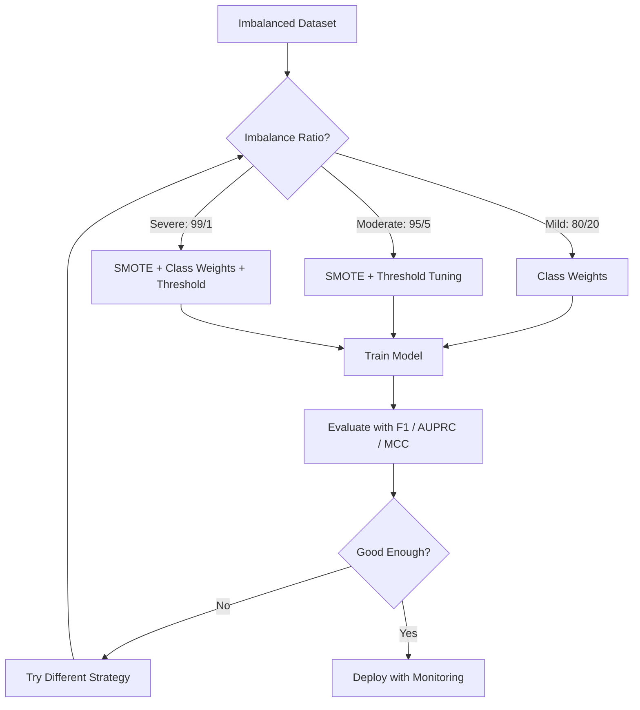
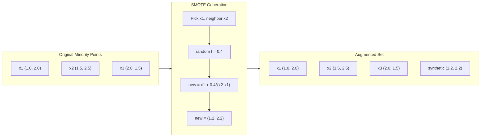
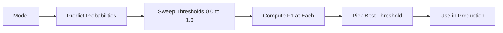
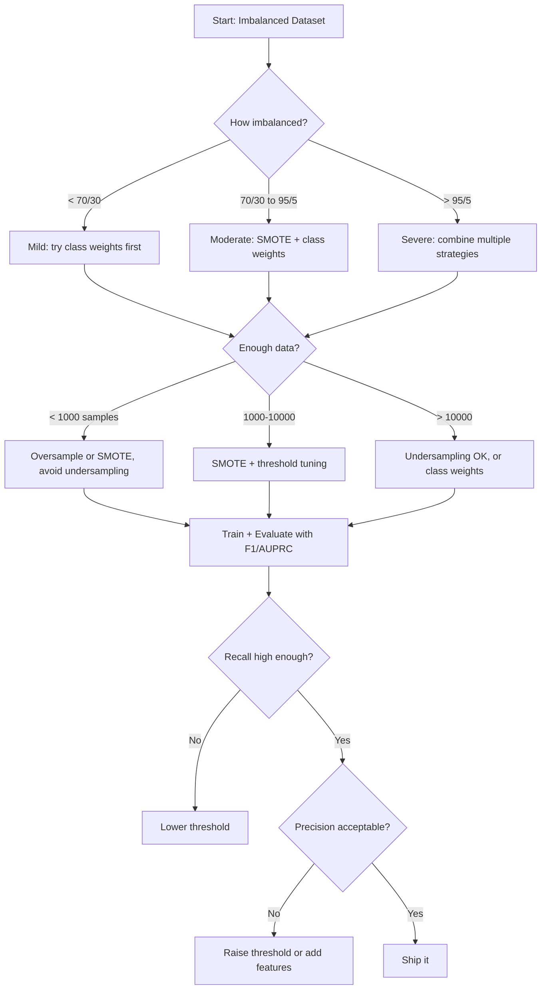

# 处理不平衡数据

> 当你的数据有99%的正常时,准确性就是一个谎言.

**类型：**建立
**语言：**字符串
**先修要求：**阶段2课01-09 (特别是评估指标)
**时间：**约90分钟

## 学习目标

- 从零实现SMOTE,并解释合成过量样本与随机复制有什么区别
- 使用F1、AUPRC 和马修斯的相关系数 评估不平衡的分类器,而不是使用精度
- 比较类权重,门调整和重新样本策略,并为给定的不平衡比例选择合适方法
- 构建一个完整的不平衡数据管道,结合SMOTE、类重量和门优化

## 问题

你建立了一个欺诈检测模型. 它达到99.9%的准确性.

这不是错误. 当只有0.1%的交易是欺诈时,这是理性的做法.

任何是真正重要的 场景,都会遇到这种情况――疾病诊断:1% 阳性率――网络入侵:0.01% 攻击――制造缺陷:0.5% 缺陷率――垃圾邮件过:20% 垃圾邮件――流失预测:5% 流失用户――少数群体 越来越重要,往往越稀少――

正确标记一个合法交易和正确抓住一个欺诈,都只算作准确的一分之一.

## 概念

### 为什么准确性会失败

考虑一个包含1000个样本的数据集:990个负,10个正,一个总是预测负的模型:

|  | Predicted Positive | Predicted Negative |
|--|---|---|
| Actually Positive | 0 (TP) | 10 (FN) |
| Actually Negative | 0 (FP) | 990 (TN) |

精度 = (0 + 990) / 1000 = 99.0%

模型抓住了零次欺诈――零个疾病――零个缺陷――但准确性显示了99%.

### 更好的标志

**Precision**在所有被标记为积极的样本中,真正是积极的有多少?高精度意味着误报少.

**Recall**在所有真正正面的样本中,我们抓住了多少?高回忆意味着丢失的正面少.

**F1 Score**= 2 *精度 *回忆 / (精度 +回忆) ⋅调和平均数量──相比算术平均数,它会更严厉地惩罚精度和回忆 之间的极端不平衡──

**F-beta Score**= (1 + beta^2) *精度 *回忆 / (beta^2 *精度 +回忆) ――当beta > 1 时,回忆更重要――当beta < 1 时,精度更重要――F2 在欺诈检测中很常见(漏掉欺诈比误报更糟) ――

**AUPRC**(精度召回曲线下的区域) 类似于AUC-ROC,但对不平衡数据有更多信息量――随机分类器的AUPRC等于正分类的比例(不像ROC那样是0.5)――这使改进更容易被看到――

**Matthews Correlation Coefficient**= (TP * TN - FP * FN) /sqrt((TP+FP)(TP+FN)(TN+FP)(TN+FN))──范围从 -1 到 +1──只有当模型在两个类别上表现良好时才会给出高分──即使类别规模差异很大,也保持平衡──

对于上始终预测负的模型:精度 = 0/0(未定义,通常设为 0),回忆 = 0/10 = 0,F1 = 0,MCC = 0──这些指标正确地识别出该模型没有价值──

### 不平衡数据管道



### 综合少数民族过量样本技术

随着过量样本会复制现有的少数样本.

它们看起来合理,但不是副本.

1. 对于每一个少数群体的样本,在其他少数群体的样本中找到它的近邻.
2. 随时选择一个邻居
3. 在 x 和邻居之间的线段上创建一个新的样本

公式:`new_sample = x + random(0, 1) * (neighbor - x)`

这将在真实少数点之间插入值,在特征空间的相同区域创建样本,而不是仅仅复制已有的数据.



### 采样策略对比

**Random Oversampling**复制少数样本,使其数量匹配多数.
- 优点:简单,没有信息损失
- 缺点:完全重复会导致过适合,增加训练时间

**Random Undersampling**移除多数样本,使其数量匹配少数.
- 优点:训练快,简单
- 缺点:丢弃潜在有用的多数数据,方差更高

**SMOTE**通过插值创建合成少数民族样本
- 优点:生成新的数据点,相比随机过量样本 减少过拟合
- 缺点:可能在决策边界 附近创建噪声样本,不考虑多数阶级的分布

| Strategy | Data Changed | Risk | When to Use |
|----------|-------------|------|-------------|
| Oversample | 复制 minority | 过拟合 | 小数据集，中等不平衡 |
| Undersample | 移除 majority | 信息损失 | 大数据集，需要快速训练 |
| SMOTE | 添加 synthetic minority | 边界噪声 | 中等不平衡，有足够 minority 样本用于 k-NN |

### 类型的重量

与其改变数据,不如改变模型对错误处理方式.

对于一个包含950个负和50个正的二元样本的问题:
- 负类的权重 = n_样本 / (2 * n_负) = 1000 / (2 * 950) = 0.526
- 积极类的权重 = n_样本 / (2 * n_积极) = 1000 / (2 * 50) = 10.0

积极类 获得19倍权重――误分类 一个积极样本的价格,相当于误分类19个负面样本――模型被迫关注少数类――

在物流回归中,这会修改损失函数:

```
weighted_loss = -sum(w_i * [y_i * log(p_i) + (1-y_i) * log(1-p_i)])
```

其中,取决于样本的类别.

类重量在数学上与过量样本等价的意义上,但不会创建新的数据点――这使它们更快,并避免重复样本带来的过于适合风险――

### 值调整

大多数分类器会输出一个概率──默认值是0.5:如果P(正) >=0.5,就预测为正──但0.5是任意的──当类别不平衡时,最优值通常要低得多──

流程:
1. 训练一个模型
2. 在验证集上获取预测概率
3. 从0.0到1.0扫描值
4. 在每个值计算F1 ((或你选择的指标)
5. 选择使指标最大的值



一个模型可能对一个欺诈交易输出 P(欺诈) =0.15──在0.5下,它将被分为非欺诈──在0.10下,它将被正确抓住──概率校准的重要性低于排序:只要欺诈样本获得的概率高于非欺诈样本,就存在一个值可以分开它们──

### 低成本的学习

类权重的泛化形式――不是使用统一成本,而是分配特定的误分类成本:

| | Predict Positive | Predict Negative |
|--|---|---|
| Actually Positive | 0 (correct) | C_FN = 100 |
| Actually Negative | C_FP = 1 | 0 (correct) |

漏掉一笔欺诈交易的成本比一次误报高100倍.

当你能够估计现实世界成本时,这是最有原则的方法――错误诊断癌症和一次错误报道导致额外检查,其成本完全不同――显然写出这些成本,会迫使模型做出正确的权衡――

### 决策流程图




```figure
class-imbalance
```

## 构建它

### 步骤1:生成一个不平衡的数据集

```python
import numpy as np


def make_imbalanced_data(n_majority=950, n_minority=50, seed=42):
    rng = np.random.RandomState(seed)

    X_maj = rng.randn(n_majority, 2) * 1.0 + np.array([0.0, 0.0])
    X_min = rng.randn(n_minority, 2) * 0.8 + np.array([2.5, 2.5])

    X = np.vstack([X_maj, X_min])
    y = np.concatenate([np.zeros(n_majority), np.ones(n_minority)])

    shuffle_idx = rng.permutation(len(y))
    return X[shuffle_idx], y[shuffle_idx]
```

### 步骤2:从零实现SMOTE

```python
def euclidean_distance(a, b):
    return np.sqrt(np.sum((a - b) ** 2))


def find_k_neighbors(X, idx, k):
    distances = []
    for i in range(len(X)):
        if i == idx:
            continue
        d = euclidean_distance(X[idx], X[i])
        distances.append((i, d))
    distances.sort(key=lambda x: x[1])
    return [d[0] for d in distances[:k]]


def smote(X_minority, k=5, n_synthetic=100, seed=42):
    rng = np.random.RandomState(seed)
    n_samples = len(X_minority)
    k = min(k, n_samples - 1)
    synthetic = []

    for _ in range(n_synthetic):
        idx = rng.randint(0, n_samples)
        neighbors = find_k_neighbors(X_minority, idx, k)
        neighbor_idx = neighbors[rng.randint(0, len(neighbors))]
        t = rng.random()
        new_point = X_minority[idx] + t * (X_minority[neighbor_idx] - X_minority[idx])
        synthetic.append(new_point)

    return np.array(synthetic)
```

### 步骤3:随机过量样本和下样本

```python
def random_oversample(X, y, seed=42):
    rng = np.random.RandomState(seed)
    classes, counts = np.unique(y, return_counts=True)
    max_count = counts.max()

    X_resampled = list(X)
    y_resampled = list(y)

    for cls, count in zip(classes, counts):
        if count < max_count:
            cls_indices = np.where(y == cls)[0]
            n_needed = max_count - count
            chosen = rng.choice(cls_indices, size=n_needed, replace=True)
            X_resampled.extend(X[chosen])
            y_resampled.extend(y[chosen])

    X_out = np.array(X_resampled)
    y_out = np.array(y_resampled)
    shuffle = rng.permutation(len(y_out))
    return X_out[shuffle], y_out[shuffle]


def random_undersample(X, y, seed=42):
    rng = np.random.RandomState(seed)
    classes, counts = np.unique(y, return_counts=True)
    min_count = counts.min()

    X_resampled = []
    y_resampled = []

    for cls in classes:
        cls_indices = np.where(y == cls)[0]
        chosen = rng.choice(cls_indices, size=min_count, replace=False)
        X_resampled.extend(X[chosen])
        y_resampled.extend(y[chosen])

    X_out = np.array(X_resampled)
    y_out = np.array(y_resampled)
    shuffle = rng.permutation(len(y_out))
    return X_out[shuffle], y_out[shuffle]
```

### 步骤 4:带类重量的物流回归

```python
def sigmoid(z):
    return 1.0 / (1.0 + np.exp(-np.clip(z, -500, 500)))


def logistic_regression_weighted(X, y, weights, lr=0.01, epochs=200):
    n_samples, n_features = X.shape
    w = np.zeros(n_features)
    b = 0.0

    for _ in range(epochs):
        z = X @ w + b
        pred = sigmoid(z)
        error = pred - y
        weighted_error = error * weights

        gradient_w = (X.T @ weighted_error) / n_samples
        gradient_b = np.mean(weighted_error)

        w -= lr * gradient_w
        b -= lr * gradient_b

    return w, b


def compute_class_weights(y):
    classes, counts = np.unique(y, return_counts=True)
    n_samples = len(y)
    n_classes = len(classes)
    weight_map = {}
    for cls, count in zip(classes, counts):
        weight_map[cls] = n_samples / (n_classes * count)
    return np.array([weight_map[yi] for yi in y])
```

### 步骤5:值调整

```python
def find_optimal_threshold(y_true, y_probs, metric="f1"):
    best_threshold = 0.5
    best_score = -1.0

    for threshold in np.arange(0.05, 0.96, 0.01):
        y_pred = (y_probs >= threshold).astype(int)
        tp = np.sum((y_pred == 1) & (y_true == 1))
        fp = np.sum((y_pred == 1) & (y_true == 0))
        fn = np.sum((y_pred == 0) & (y_true == 1))

        if metric == "f1":
            precision = tp / (tp + fp) if (tp + fp) > 0 else 0.0
            recall = tp / (tp + fn) if (tp + fn) > 0 else 0.0
            score = 2 * precision * recall / (precision + recall) if (precision + recall) > 0 else 0.0
        elif metric == "recall":
            score = tp / (tp + fn) if (tp + fn) > 0 else 0.0
        elif metric == "precision":
            score = tp / (tp + fp) if (tp + fp) > 0 else 0.0

        if score > best_score:
            best_score = score
            best_threshold = threshold

    return best_threshold, best_score
```

### 步骤 6:评估函数

```python
def confusion_matrix_values(y_true, y_pred):
    tp = np.sum((y_pred == 1) & (y_true == 1))
    tn = np.sum((y_pred == 0) & (y_true == 0))
    fp = np.sum((y_pred == 1) & (y_true == 0))
    fn = np.sum((y_pred == 0) & (y_true == 1))
    return tp, tn, fp, fn


def compute_metrics(y_true, y_pred):
    tp, tn, fp, fn = confusion_matrix_values(y_true, y_pred)
    accuracy = (tp + tn) / (tp + tn + fp + fn)
    precision = tp / (tp + fp) if (tp + fp) > 0 else 0.0
    recall = tp / (tp + fn) if (tp + fn) > 0 else 0.0
    f1 = 2 * precision * recall / (precision + recall) if (precision + recall) > 0 else 0.0

    denom = np.sqrt(float((tp + fp) * (tp + fn) * (tn + fp) * (tn + fn)))
    mcc = (tp * tn - fp * fn) / denom if denom > 0 else 0.0

    return {
        "accuracy": accuracy,
        "precision": precision,
        "recall": recall,
        "f1": f1,
        "mcc": mcc,
    }
```

### 步骤 7: 比较所有方法

```python
X, y = make_imbalanced_data(950, 50, seed=42)
split = int(0.8 * len(y))
X_train, X_test = X[:split], X[split:]
y_train, y_test = y[:split], y[split:]

# Baseline: no treatment
w_base, b_base = logistic_regression_weighted(
    X_train, y_train, np.ones(len(y_train)), lr=0.1, epochs=300
)
probs_base = sigmoid(X_test @ w_base + b_base)
preds_base = (probs_base >= 0.5).astype(int)

# Oversampled
X_over, y_over = random_oversample(X_train, y_train)
w_over, b_over = logistic_regression_weighted(
    X_over, y_over, np.ones(len(y_over)), lr=0.1, epochs=300
)
preds_over = (sigmoid(X_test @ w_over + b_over) >= 0.5).astype(int)

# SMOTE
minority_mask = y_train == 1
X_minority = X_train[minority_mask]
synthetic = smote(X_minority, k=5, n_synthetic=len(y_train) - 2 * int(minority_mask.sum()))
X_smote = np.vstack([X_train, synthetic])
y_smote = np.concatenate([y_train, np.ones(len(synthetic))])
w_sm, b_sm = logistic_regression_weighted(
    X_smote, y_smote, np.ones(len(y_smote)), lr=0.1, epochs=300
)
preds_smote = (sigmoid(X_test @ w_sm + b_sm) >= 0.5).astype(int)

# Class weights
sample_weights = compute_class_weights(y_train)
w_cw, b_cw = logistic_regression_weighted(
    X_train, y_train, sample_weights, lr=0.1, epochs=300
)
probs_cw = sigmoid(X_test @ w_cw + b_cw)
preds_cw = (probs_cw >= 0.5).astype(int)

# Threshold tuning (tune on held-out validation set, not test set)
probs_val = sigmoid(X_val @ w_cw + b_cw)
best_thresh, best_f1 = find_optimal_threshold(y_val, probs_val, metric="f1")
preds_thresh = (probs_cw >= best_thresh).astype(int)
```

代码文件将在一个脚本中运行所有这些内容并打印结果.

## 使用它

借助小学学习和失衡学习,这些技术都需要一行:

```python
from sklearn.linear_model import LogisticRegression
from sklearn.metrics import classification_report, f1_score
from sklearn.model_selection import train_test_split
from imblearn.over_sampling import SMOTE
from imblearn.under_sampling import RandomUnderSampler
from imblearn.pipeline import Pipeline

X_train, X_test, y_train, y_test = train_test_split(X, y, stratify=y)

model_weighted = LogisticRegression(class_weight="balanced")
model_weighted.fit(X_train, y_train)
print(classification_report(y_test, model_weighted.predict(X_test)))

smote = SMOTE(random_state=42)
X_resampled, y_resampled = smote.fit_resample(X_train, y_train)
model_smote = LogisticRegression()
model_smote.fit(X_resampled, y_resampled)
print(classification_report(y_test, model_smote.predict(X_test)))

pipeline = Pipeline([
    ("smote", SMOTE()),
    ("model", LogisticRegression(class_weight="balanced")),
])
pipeline.fit(X_train, y_train)
print(classification_report(y_test, pipeline.predict(X_test)))
```

从零实现的版本会清楚地展示每种技术具体做了什么.SMOTE 只是对少数阶级做 k-NN 插值.

## 交付它

本课会产出:
- `outputs/skill-imbalanced-data.md`-- 一份处理不平衡 问题决策清单

## 练习

1. **Borderline-SMOTE**修改 SMOTE 实现,仅为靠近决策边界的少数点生成合成样本,即那些 k-近邻中包含多数类样本的点.

2. **Cost matrix optimization**实现成本敏感学习,其中成本矩阵是一个参数. 创建一个函数,接收成本矩阵并返回可最小化预期成本的最佳预测. 使用不同成本比例.

3. **Threshold calibration**实现平面缩小 (在模型原始输出上适合物流回归,以产生校准后的概率) ⋅比较校准前后的精确回忆曲线.

4. **Ensemble with balanced bagging**训练多个模型,每个模型都使用一个平衡的引导样本.

5. **Imbalance ratio experiment**根据SMOTE的使用和不使用情况,对每个比例进行训练. 绘制两种方法的F1与不平衡比率. 在什么比例下,SMOTE 开始产生有意义的差异?

## 关键术语

| Term | What people say | What it actually means |
|------|----------------|----------------------|
| Class imbalance | “一个类别的样本多得多” | 数据集中类别分布显著偏斜，导致模型偏向 majority class |
| SMOTE | “Synthetic oversampling” | 通过在现有 minority 样本及其 k-nearest minority neighbors 之间插值，创建新的 minority 样本 |
| Class weights | “让 rare class 上的错误代价更高” | 用特定类别的权重乘以 Loss Function，使模型对 minority 误分类施加更重惩罚 |
| Threshold tuning | “移动 decision boundary” | 将 Classification 的概率 cutoff 从默认 0.5 改为能优化目标指标的值 |
| Precision-recall tradeoff | “你不能两者兼得” | 降低阈值会抓住更多 positive（更高 recall），但也会标记更多 false positive（更低 precision），反之亦然 |
| AUPRC | “PR curve 下的面积” | 将 precision-recall curve 汇总为一个数字；当类别严重不平衡时，比 AUC-ROC 信息量更大 |
| Matthews Correlation Coefficient | “平衡指标” | 预测标签与真实标签之间的相关性；只有模型在两个类别上都表现良好时才会产生高分 |
| Cost-sensitive learning | “不同错误的代价不同” | 将现实世界中的误分类成本纳入训练目标，使模型优化总成本，而不是错误数量 |
| Random oversampling | “复制 minority” | 重复 minority class 样本以平衡类别数量；简单，但有过拟合到重复点的风险 |

## 延伸阅读

- [SMOTE: Synthetic Minority Over-sampling Technique (Chawla et al., 2002)](https://arxiv.org/abs/1106.1813)-- 原始 SMOTE 论文,至今仍是不平衡学习中最多引用的工作
- [Learning from Imbalanced Data (He & Garcia, 2009)](https://ieeexplore.ieee.org/document/5128907)综合采样,成本敏感和算法层面的方法
- [imbalanced-learn documentation](https://imbalanced-learn.org/stable/)-- Python 库,提供SMOTE 变体、下样本策略和管道 集成
- [The Precision-Recall Plot Is More Informative than the ROC Plot (Saito & Rehmsmeier, 2015)](https://journals.plos.org/plosone/article?id=10.1371/journal.pone.0118432)--何时以及为什么在不平衡问题中应优先使用 PR 曲线而不是 ROC 曲线
