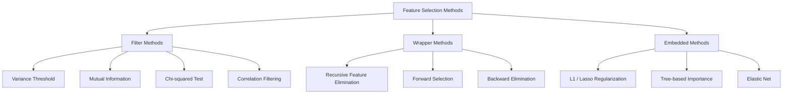
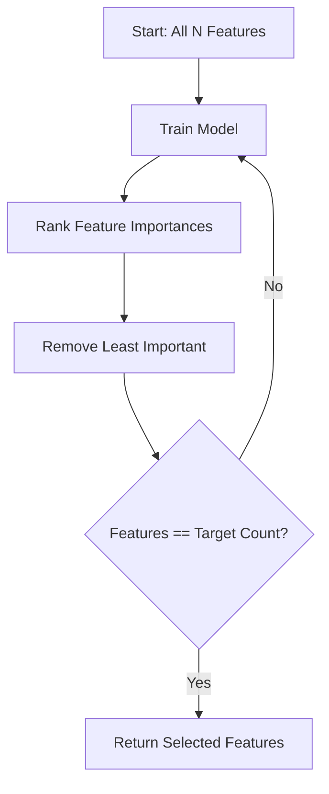
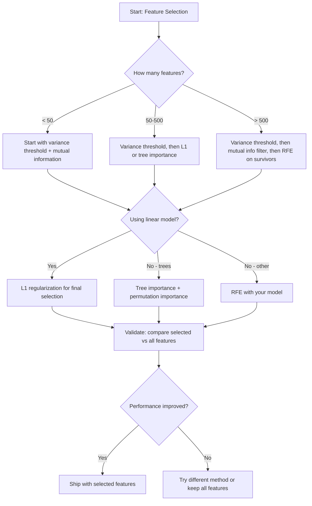

# 功能选择

> 更多的特征并不是更好.

**Type:** Build
**Language:**字符串
**先修要求：**阶段2,课程01-09,08
**Time:** ~75 分钟

## 学习目标
- 从零实现过方法 (变量门,互通信息,四方形) 和包装方法 (RFE,前进选择)
- 解释为什么相互信息 能捕捉相关性 会漏掉非线性特征目标 关系
- 比较L1规律化 (嵌入式选择) 与RFE (包装选择)
- 构建一个结合多种方法的功能选择管道,并展示它在持有数据上改善了通用化的效果

## 问题
你有500个特征. 你的模型训练很慢,经常过度,而且没有人能解释它学到了什么.

这就是维度的诅咒的实际表现.随着数量增长的特征,特征空间的体积会爆炸式扩大. 数据点变得稀疏.

功能选择是解药――剥离噪音――移除冗余――保留真正带有目标信息的特性――结果是:训练更快――通用化更好,并且模型真的可以解释――

目标不是使用所有可用的信息,而是使用正确的信息.

## 概念
### 功能选择的三类方法

每种特征选择方法都属于以下三类之一:



**Filter methods**使用统计量独立为每个特征打分──它们不使用模型──速度快,但会错过特征互动──

**Wrapper methods**训练模型来评估功能子组──它们使用模型性能作为分数──结果更好,但成本更高,因为需要多次重新训练模型──

**Embedded methods**在模型培训过程中选择特征――L1规律化会把重量推向零――决策树会基于最有用的特征进行分类――选择发生在适配期间,而不是作为单独步骤――

### 变化门

最简单的过器. 如果一个功能在样本之间几乎不变,它几乎没有信息.

考虑一个特征,在1000个样本中,有999个是0.0――它的变量接近零――没有模型可以使用它来区分类――移除它――

```
variance(x) = mean((x - mean(x))^2)
```

设置一个门,例如0.01) 弃每个变量低于这个门的特征,这会在完全不看待目标变量的情况下移除常数或近常数的特征.

使用场景:作为其他方法之前的预处理步骤,它几乎几乎零成本地捕捉明显无用的功能.

局限性:一个特征可能有高差异,但仍然是纯噪音.

### 互通信息

相互信息 衡量知道X的特征值可以在多大程度上减少对目标Y的不确定性.

```
I(X; Y) = sum_x sum_y p(x, y) * log(p(x, y) / (p(x) * p(y)))
```

如果 X 和 Y 独立,则 p(x,y) = p(x) * p(y),因此 log 项为零,I(X;Y) = 0──X 能告诉你更多关于 Y 的信息,相互信息就越高──

相对于相关性关键优势:相互信息能捕捉非线性关系――某个特征可能与目标相关性为零,但相互信息很高,因为关系可能是方形或周期性――

对于连续特征,首先要分辨成子 (基于历史图的估计) ・子数量会影响估计结果:子太少会丢失信息,子太多会增加噪音――常见选择:sqrt(n) 子或斯图尔格斯规则(1 + log2(n))。


### 复发性特征消除 (RFE)

形形是形方法.它使用模型.

1. 使用所有功能 训练模型
2. 按特征的重要性 排名 线性模型 使用系数,树木 使用污染减少)
3. 移除最不重要的特征 (s)
4. 重复,直到剩下期望数量的特征



由于模型会同时看到所有剩余的功能,RFE会考虑功能相互作用.

成本:你需要训练模型N - 目标次.对于500个特征,目标为10的情况,就是490次训练.对于昂贵的模型,这会很慢.

### 规范化

L1规律化 会把重量的绝对值加入损失函数:

```
loss = prediction_error + alpha * sum(|w_i|)
```

关键控制功能 被剪枝的激进程度──alpha 越高,越多的重量 会精确变成零──

为什么会精确为零?L1罚在权重空间中创建一个形约束区域.

这就是嵌入式功能选择:模型在训练期间学习哪些功能应忽略.

优势:只需一次训练,能处理相关的特性,选择其中一个并把其他置零,内置在大多数线性模型实现中.

局限性:仅适用于线性模型.

### 树木的重要性

决策树及其组合 (随机森林,渐进增强) 会自然地对特征排名. 每个分区都会减少杂质.

对于有树木的随机森林:

```
importance(feature_j) = (1/T) * sum over all trees of
    sum over all nodes splitting on feature_j of
        (n_samples * impurity_decrease)
```

这将为每个特征提供正常化重要性分数. 它可以自动处理非线性关系和特征相互作用.

注意:树基重要性 会偏向具有许多独特值的特征 (高率) ──随机ID 列会显得重要,因为它能完美分开每样品──使用变量重要性作为智力检查──

### 转变的重要性

一种模式无知方法:

1. 训练模型,并记录验证数据上基线性能
2. 对于每个功能:随时混动它的值,测量性能的下降
3. 下降越大,这个特征越重要

如果混动某个功能不会损害性能,说明模型不依赖它.

变量的重要性 避免了基于树的重要性的特点偏差.

### 较量表

| Method | Type | Speed | Nonlinear | Feature Interactions |
|--------|------|-------|-----------|---------------------|
| Variance threshold | Filter | 非常快 | 否 | 否 |
| Mutual information | Filter | 快 | 是 | 否 |
| Correlation filter | Filter | 快 | 否 | 否 |
| RFE | Wrapper | 慢 | 取决于 model | 是 |
| L1 / Lasso | Embedded | 快 | 否（linear） | 否 |
| Tree importance | Embedded | 中等 | 是 | 是 |
| Permutation importance | Model-agnostic | 慢 | 是 | 是 |

### 决策流程图




```figure
f3-feature-prune
```

## 构建它
### 步骤1:生成已知特征结构的合成数据

```python
import numpy as np


def make_feature_selection_data(n_samples=500, seed=42):
    rng = np.random.RandomState(seed)

    x1 = rng.randn(n_samples)
    x2 = rng.randn(n_samples)
    x3 = rng.randn(n_samples)
    x4 = x1 + 0.1 * rng.randn(n_samples)
    x5 = x2 + 0.1 * rng.randn(n_samples)

    informative = np.column_stack([x1, x2, x3, x4, x5])

    correlated = np.column_stack([
        x1 * 0.9 + 0.1 * rng.randn(n_samples),
        x2 * 0.8 + 0.2 * rng.randn(n_samples),
        x3 * 0.7 + 0.3 * rng.randn(n_samples),
        x1 * 0.5 + x2 * 0.5 + 0.1 * rng.randn(n_samples),
        x2 * 0.6 + x3 * 0.4 + 0.1 * rng.randn(n_samples),
    ])

    noise = rng.randn(n_samples, 10) * 0.5

    X = np.hstack([informative, correlated, noise])
    y = (2 * x1 - 1.5 * x2 + x3 + 0.5 * rng.randn(n_samples) > 0).astype(int)

    feature_names = (
        [f"info_{i}" for i in range(5)]
        + [f"corr_{i}" for i in range(5)]
        + [f"noise_{i}" for i in range(10)]
    )

    return X, y, feature_names
```

我们知道基本的真相:特征0-4是信息的(而且3 和 4 是 0 和 1 的相关副本),特征5-9与信息特征相关,特征10-19是纯噪音――好选择方法应该把0-4排得最高,把10-19排得最低――

### 步骤 2:变异门

```python
def variance_threshold(X, threshold=0.01):
    variances = np.var(X, axis=0)
    mask = variances > threshold
    return mask, variances
```

### 步骤3:相互信息 (分辨率)

```python
def discretize(x, n_bins=10):
    min_val, max_val = x.min(), x.max()
    if max_val == min_val:
        return np.zeros_like(x, dtype=int)
    bin_edges = np.linspace(min_val, max_val, n_bins + 1)
    binned = np.digitize(x, bin_edges[1:-1])
    return binned


def mutual_information(X, y, n_bins=10):
    n_samples, n_features = X.shape
    mi_scores = np.zeros(n_features)

    y_vals, y_counts = np.unique(y, return_counts=True)
    p_y = y_counts / n_samples

    for f in range(n_features):
        x_binned = discretize(X[:, f], n_bins)
        x_vals, x_counts = np.unique(x_binned, return_counts=True)
        p_x = dict(zip(x_vals, x_counts / n_samples))

        mi = 0.0
        for xv in x_vals:
            for yi, yv in enumerate(y_vals):
                joint_mask = (x_binned == xv) & (y == yv)
                p_xy = np.sum(joint_mask) / n_samples
                if p_xy > 0:
                    mi += p_xy * np.log(p_xy / (p_x[xv] * p_y[yi]))
        mi_scores[f] = mi

    return mi_scores
```

### 步骤4: 复发性特性消除

```python
def simple_logistic_importance(X, y, lr=0.1, epochs=100):
    n_samples, n_features = X.shape
    w = np.zeros(n_features)
    b = 0.0

    for _ in range(epochs):
        z = X @ w + b
        pred = 1.0 / (1.0 + np.exp(-np.clip(z, -500, 500)))
        error = pred - y
        w -= lr * (X.T @ error) / n_samples
        b -= lr * np.mean(error)

    return w, b


def rfe(X, y, n_features_to_select=5, lr=0.1, epochs=100):
    n_total = X.shape[1]
    remaining = list(range(n_total))
    rankings = np.ones(n_total, dtype=int)
    rank = n_total

    while len(remaining) > n_features_to_select:
        X_subset = X[:, remaining]
        w, _ = simple_logistic_importance(X_subset, y, lr, epochs)
        importances = np.abs(w)

        least_idx = np.argmin(importances)
        original_idx = remaining[least_idx]
        rankings[original_idx] = rank
        rank -= 1
        remaining.pop(least_idx)

    for idx in remaining:
        rankings[idx] = 1

    selected_mask = rankings == 1
    return selected_mask, rankings
```

### 步骤 5: L1 功能选择

```python
def soft_threshold(w, alpha):
    return np.sign(w) * np.maximum(np.abs(w) - alpha, 0)


def l1_feature_selection(X, y, alpha=0.1, lr=0.01, epochs=500):
    n_samples, n_features = X.shape
    w = np.zeros(n_features)
    b = 0.0

    for _ in range(epochs):
        z = X @ w + b
        pred = 1.0 / (1.0 + np.exp(-np.clip(z, -500, 500)))
        error = pred - y

        gradient_w = (X.T @ error) / n_samples
        gradient_b = np.mean(error)

        w -= lr * gradient_w
        w = soft_threshold(w, lr * alpha)
        b -= lr * gradient_b

    selected_mask = np.abs(w) > 1e-6
    return selected_mask, w
```

### 步骤 6:树木基础上的重要性 (简单的决策树)

```python
def gini_impurity(y):
    if len(y) == 0:
        return 0.0
    classes, counts = np.unique(y, return_counts=True)
    probs = counts / len(y)
    return 1.0 - np.sum(probs ** 2)


def best_split(X, y, feature_idx):
    values = np.unique(X[:, feature_idx])
    if len(values) <= 1:
        return None, -1.0

    best_threshold = None
    best_gain = -1.0
    parent_gini = gini_impurity(y)
    n = len(y)

    for i in range(len(values) - 1):
        threshold = (values[i] + values[i + 1]) / 2.0
        left_mask = X[:, feature_idx] <= threshold
        right_mask = ~left_mask

        n_left = np.sum(left_mask)
        n_right = np.sum(right_mask)

        if n_left == 0 or n_right == 0:
            continue

        gain = parent_gini - (n_left / n) * gini_impurity(y[left_mask]) - (n_right / n) * gini_impurity(y[right_mask])

        if gain > best_gain:
            best_gain = gain
            best_threshold = threshold

    return best_threshold, best_gain


def tree_importance(X, y, n_trees=50, max_depth=5, seed=42):
    rng = np.random.RandomState(seed)
    n_samples, n_features = X.shape
    importances = np.zeros(n_features)

    for _ in range(n_trees):
        sample_idx = rng.choice(n_samples, size=n_samples, replace=True)
        feature_subset = rng.choice(n_features, size=max(1, int(np.sqrt(n_features))), replace=False)

        X_boot = X[sample_idx]
        y_boot = y[sample_idx]

        tree_imp = _build_tree_importance(X_boot, y_boot, feature_subset, max_depth)
        importances += tree_imp

    total = importances.sum()
    if total > 0:
        importances /= total

    return importances


def _build_tree_importance(X, y, feature_subset, max_depth, depth=0):
    n_features = X.shape[1]
    importances = np.zeros(n_features)

    if depth >= max_depth or len(np.unique(y)) <= 1 or len(y) < 4:
        return importances

    best_feature = None
    best_threshold = None
    best_gain = -1.0

    for f in feature_subset:
        threshold, gain = best_split(X, y, f)
        if gain > best_gain:
            best_gain = gain
            best_feature = f
            best_threshold = threshold

    if best_feature is None or best_gain <= 0:
        return importances

    importances[best_feature] += best_gain * len(y)

    left_mask = X[:, best_feature] <= best_threshold
    right_mask = ~left_mask

    importances += _build_tree_importance(X[left_mask], y[left_mask], feature_subset, max_depth, depth + 1)
    importances += _build_tree_importance(X[right_mask], y[right_mask], feature_subset, max_depth, depth + 1)

    return importances
```

### 步骤 7:运行所有方法并比较

代码文件将在同一合成数据集上运行全部五种方法,并打印一个比较表,显示每个方法选择了哪些功能――

## 使用它
使用小程序学习时,功能选择已内置到管道中:

```python
from sklearn.feature_selection import (
    VarianceThreshold,
    mutual_info_classif,
    RFE,
    SelectFromModel,
)
from sklearn.linear_model import Lasso, LogisticRegression
from sklearn.ensemble import RandomForestClassifier

vt = VarianceThreshold(threshold=0.01)
X_filtered = vt.fit_transform(X)

mi_scores = mutual_info_classif(X, y)
top_k = np.argsort(mi_scores)[-10:]

rfe_selector = RFE(LogisticRegression(), n_features_to_select=10)
rfe_selector.fit(X, y)
X_rfe = rfe_selector.transform(X)

lasso_selector = SelectFromModel(Lasso(alpha=0.01))
lasso_selector.fit(X, y)
X_lasso = lasso_selector.transform(X)

rf = RandomForestClassifier(n_estimators=100)
rf.fit(X, y)
importances = rf.feature_importances_
```

这些从零开始 实现确实展示了每种方法内部发生的事情.`var(X, axis=0)`应用面具――相互信息是在应急表中统计联合和边际频率――RFE 是一个训练,排名,剪枝的循环――L1 是带着软门的步骤的渐进下降――三重意义 会在分区之间积累的污染减少――没有魔法,只是统计和循环――

版本增加了强度 (例如,使用k-NN密度估计而不是) 速度 (C 实现) 和管道集成).

## 交付它
本课产出:
- `outputs/skill-feature-selector.md`-- 用于选择正确的特征选择方法的快速参考决策树

## 练习
1. **Forward selection**实现RFE的反向过程――从零个功能开始――每一步增加最能提高模型性能的功能――当增加功能时不再有帮助停止――将选出的功能与RFE的结果相比――哪个更快?哪个结果更好?

2. **Stability selection**运行 L1 功能选择 50 次,每次使用数据随机80%的子样本,并使用略有不同的阿尔法值――统计每个功能被选的频率――在 > 80% 运行中被选的功能是稳的――将与单次运行 L1 选项相比较.

3. **Multicollinearity detection**计算所有特征的相关性矩阵――实现一个函数,给定相关性门――例如0.9分,从每对高度相关的特征中移除一个特征――保留与目标的互通信息更高的)――在合成数据集上测试,并验证它移除了冗余的相关特征――

4. **Feature selection pipeline**首先移除接近零变量特征,然后按相互信息保证50%以上,再在幸存者上运行RFE──将该管道与直接在所有特征上运行RFE比较──管道更快吗?准确性是否相同?

5. **Permutation importance from scratch**实现变量重要性. 对每个特征,混动其值10次,测量F1分数的平均下降.将与树基重要性进行排名比较.

## 关键术语
| Term | What people say | What it actually means |
|------|----------------|----------------------|
| Filter method | “独立为 features 打分” | 一种 feature selection 方法，不训练 model，而是使用统计度量对 features 排名，并孤立地评估每个 feature |
| Wrapper method | “用 model 挑 features” | 一种 feature selection 方法，通过训练 model 并使用其 performance 作为 selection criterion 来评估 feature subsets |
| Embedded method | “model 在训练期间选择 features” | 作为 model fitting 一部分发生的 feature selection，例如 L1 regularization 会把 weights 推向零 |
| Mutual information | “一个变量能告诉你关于另一个变量的多少信息” | 给定 X 的知识后，关于 Y 的不确定性减少量的度量，能够捕捉线性和非线性 dependencies |
| Recursive Feature Elimination | “训练、排名、剪枝、重复” | 一种迭代式 wrapper method，会训练 model、移除最不重要的 feature(s)，并重复直到达到 target count |
| L1 / Lasso regularization | “会消灭 features 的 penalty” | 将 weight 绝对值之和加入 Loss Function，这会把不重要 feature 的 weights 推到精确为零 |
| Variance threshold | “移除 constant features” | 丢弃在 samples 之间 variance 低于指定 threshold 的 features，过滤掉不携带信息的 features |
| Feature importance | “哪些 features 最重要” | 表示每个 feature 对 model predictions 贡献程度的分数，可由 split gains（trees）或 coefficient magnitudes（linear）计算 |
| Permutation importance | “shuffle 并测量损害” | 通过随机 shuffle 每个 feature 的 values，并测量由此导致的 model performance 下降来评估 feature importance |
| Curse of dimensionality | “features 太多，data 不够” | 添加 features 会使 feature space 的体积指数级增长，导致 data 稀疏且 distances 失去意义的现象 |

## 延伸阅读
- [An Introduction to Variable and Feature Selection (Guyon & Elisseeff, 2003)](https://jmlr.org/papers/v3/guyon03a.html)基本的综述,至今仍被广泛引用
- [scikit-learn Feature Selection Guide](https://scikit-learn.org/stable/modules/feature_selection.html)-- 关于选器和嵌入式方法的实用参考,包含代码示例
- [Stability Selection (Meinshausen & Buhlmann, 2010)](https://arxiv.org/abs/0809.2932)-- 将子样本与特征选择结合,以获得强的可复制性结果
- [Beware Default Random Forest Importances (Strobl et al., 2007)](https://bmcbioinformatics.biomedcentral.com/articles/10.1186/1471-2105-8-25)-- 展示树木基础上的重要性 中的卡丁度偏见,并提出条件性重要性 作为替代方案
