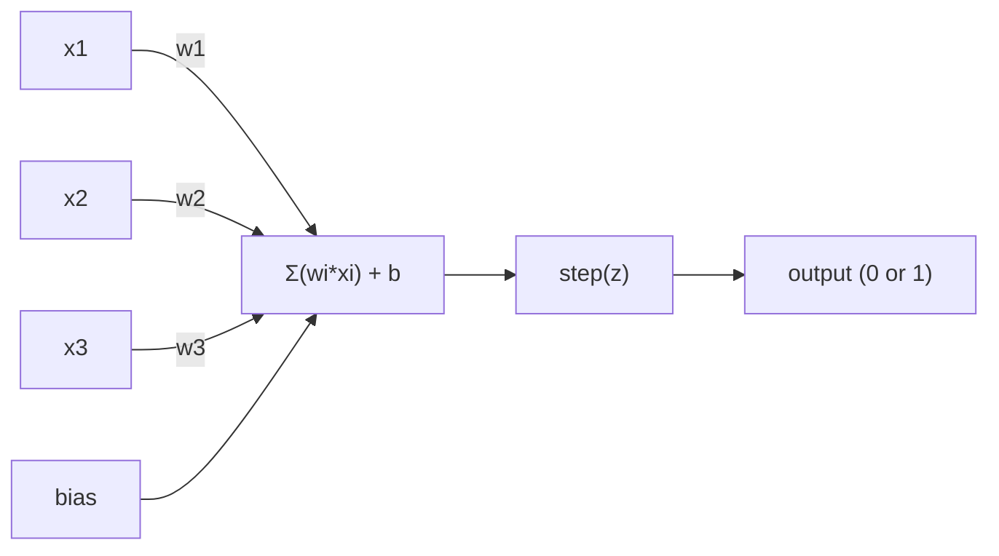
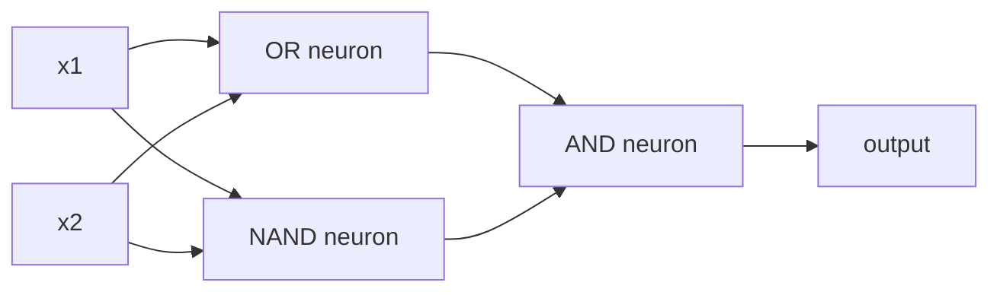

# 感觉器

> 感知是神经网络的原子. 拆开它,你会看到重量,一个偏见,以及一个决定.

**类型：**构建
**语言：**字符串
**先修要求：**阶段1 ((线性代数直觉)
**时间：**时间60分钟

## 学习目标
- 使用Python实现一个Perceptron,包括重量更新规则和步骤激活函数
- 解释为什么单个感觉器只能解决线性分离的问题,并演示XOR失败案例
- 通过组合OR、NAND 和 AND门 构建一个多层的感知器来解决XOR
- 使用sigmoid激活和背扩散 训练一个两个层网络,使其自动学习XOR

## 问题
你已经理解了向量和点产品. 你知道矩阵将输入转换为输出.

感知器回答了这个问题. 它是最简单的学习机器:接收一些输入,乘以权重,加上偏见,然后做出二进制决定.

了解Perceptron,就意味着理解代码中的学习到底是什么:不断调整数字,直到输出符合现实.

## 概念
### 一个神经元,一个决定

一个感知器接收了 n 个输入,将每个输入乘以一个权重,求和,加上偏差,然后将结果传输到一个激活函数.



步骤函数 非常直接:如果加加加加加加加加加加加加加加加加加加加加加加加加加加加加加加加加加加加加加加加加加加加加加加加加加加加加加加加加加加加加加加加加加加加加加加加加加加加加加加加加加加加加加加加加加加加加加加加加加加加加加加加加加加加加加加加加加加加加加加加加加加加加加加加加加加加加加加加加加加加加加加加加加加加加加加加加加加加加加加加加加加加加加加加加加加加加加加加加加加加加加加加加加加加加加加加加加加加加加加加加加加加加加加加加加加加加加加加加加加加加加加加加加加加加加加加加加加加加加加加加加加加加加加加加加加加加加加加加加加加加加加加加加加加加加加加加加加加加加加加加加加加加加加加加加加加加加加加加加加加加加加加加加加加加加加加加加加加加加加加加加加加加加加加加加加加加加加加加加加加加加加加加加加加加加加加加加加加加加加加加加加加加加加加加加加加加加加加加加加加加加加加加加加加加加加加加加加加加加加加加加加加加加加加加加加加加加加加加加加加加加加加加加加加加加加加加加加加加加加加加加加加加加加加加加加加加加加加加加加加加加加加加加加加加加加加加加加加加加加加加加加加加加加加加加加加加加加加加加加加加

```
step(z) = 1  if z >= 0
           0  if z < 0
```

这是一个线性分类器. 重量和偏差定义了一条线.

### 决策的界限

对于两个输入,Perceptron会在2D空间中画出一条线:

```
  x2
  ┤
  │  Class 1        /
  │    (0)          /
  │                /
  │               / w1·x1 + w2·x2 + b = 0
  │              /
  │             /     Class 2
  │            /        (1)
  ┼───────────/──────────── x1
```

线一侧所有点输出为0――另一侧所有点输出为1――训练过程将移动这条线,直到它能正确分离这些类.

### 学习规则

感知器学习规则很简单:

```
For each training example (x, y_true):
    y_pred = predict(x)
    error = y_true - y_pred

    For each weight:
        w_i = w_i + learning_rate * error * x_i
    bias = bias + learning_rate * error
```

如果预测是正确的,错误 = 0,什么都不会改变. 如果预测为 0,但应该是 1,重量会增加. 如果预测为 1,但应该是 0,重量会减少.

### 关于XOR问题

问题就在这里. 看看这些逻辑门:

```
AND gate:           OR gate:            XOR gate:
x1  x2  out         x1  x2  out         x1  x2  out
0   0   0           0   0   0           0   0   0
0   1   0           0   1   1           0   1   1
1   0   0           1   0   1           1   0   1
1   1   1           1   1   1           1   1   0
```

和 OR 是线性可分的:你可以画出一条线,把 0 和 1 分开;;XOR 则不是──没有任何一条直线能把 [0,1] 和 [1,0] 与 [0,0] 和 [1,1] 分开──

```
AND (separable):        XOR (not separable):

  x2                      x2
  1 ┤  0     1            1 ┤  1     0
    │     /                 │
  0 ┤  0 / 0              0 ┤  0     1
    ┼──/──────── x1         ┼──────────── x1
       line works!          no single line works!
```

这是一个根本的限制. 单个感觉器只能解决线性分离的问题. 敏斯基和帕珀特在1969年证明了这一点,而这几乎使神经网络研究停滞了十年.

解决方案:把感觉器 堆叠成层次. 多层感觉器可以通过把两个线性决定组合成一个非线性决定来解决XOR.


```figure
perceptron-boundary
```

## 构建它
### 步骤1:Perceptron类

```python
class Perceptron:
    def __init__(self, n_inputs, learning_rate=0.1):
        self.weights = [0.0] * n_inputs
        self.bias = 0.0
        self.lr = learning_rate

    def predict(self, inputs):
        total = sum(w * x for w, x in zip(self.weights, inputs))
        total += self.bias
        return 1 if total >= 0 else 0

    def train(self, training_data, epochs=100):
        for epoch in range(epochs):
            errors = 0
            for inputs, target in training_data:
                prediction = self.predict(inputs)
                error = target - prediction
                if error != 0:
                    errors += 1
                    for i in range(len(self.weights)):
                        self.weights[i] += self.lr * error * inputs[i]
                    self.bias += self.lr * error
            if errors == 0:
                print(f"Converged at epoch {epoch + 1}")
                return
        print(f"Did not converge after {epochs} epochs")
```

### 步骤2: 在逻辑门上训练

```python
and_data = [
    ([0, 0], 0),
    ([0, 1], 0),
    ([1, 0], 0),
    ([1, 1], 1),
]

or_data = [
    ([0, 0], 0),
    ([0, 1], 1),
    ([1, 0], 1),
    ([1, 1], 1),
]

not_data = [
    ([0], 1),
    ([1], 0),
]

print("=== AND Gate ===")
p_and = Perceptron(2)
p_and.train(and_data)
for inputs, _ in and_data:
    print(f"  {inputs} -> {p_and.predict(inputs)}")

print("\n=== OR Gate ===")
p_or = Perceptron(2)
p_or.train(or_data)
for inputs, _ in or_data:
    print(f"  {inputs} -> {p_or.predict(inputs)}")

print("\n=== NOT Gate ===")
p_not = Perceptron(1)
p_not.train(not_data)
for inputs, _ in not_data:
    print(f"  {inputs} -> {p_not.predict(inputs)}")
```

### 步骤3:观察XOR 失败

```python
xor_data = [
    ([0, 0], 0),
    ([0, 1], 1),
    ([1, 0], 1),
    ([1, 1], 0),
]

print("\n=== XOR Gate (single perceptron) ===")
p_xor = Perceptron(2)
p_xor.train(xor_data, epochs=1000)
for inputs, expected in xor_data:
    result = p_xor.predict(inputs)
    status = "OK" if result == expected else "WRONG"
    print(f"  {inputs} -> {result} (expected {expected}) {status}")
```

这就是单个感觉器无法学习XOR的硬证据.

### 步骤 4:用两个层解决XOR

技巧是:XOR = (x1 OR x2) 并非 (x1 AND x2)



```python
def xor_network(x1, x2):
    or_neuron = Perceptron(2)
    or_neuron.weights = [1.0, 1.0]
    or_neuron.bias = -0.5

    nand_neuron = Perceptron(2)
    nand_neuron.weights = [-1.0, -1.0]
    nand_neuron.bias = 1.5

    and_neuron = Perceptron(2)
    and_neuron.weights = [1.0, 1.0]
    and_neuron.bias = -1.5

    hidden1 = or_neuron.predict([x1, x2])
    hidden2 = nand_neuron.predict([x1, x2])
    output = and_neuron.predict([hidden1, hidden2])
    return output


print("\n=== XOR Gate (multi-layer network) ===")
for inputs, expected in xor_data:
    result = xor_network(inputs[0], inputs[1])
    print(f"  {inputs} -> {result} (expected {expected})")
```

让Perceptron 堆积成层,可以创建单个Perceptron 无法产生决策界限.

### 步骤5:训练一个双层网络

步骤 4 手动连接了重量──这对XOR有效,但对于你之前不知道正确的重量的真实问题就不适用──解决方案:把步骤函数 换成 sigmoid,并通过背传播 自动学习重量──

```python
class TwoLayerNetwork:
    def __init__(self, learning_rate=0.5):
        import random
        random.seed(0)
        self.w_hidden = [[random.uniform(-1, 1), random.uniform(-1, 1)] for _ in range(2)]
        self.b_hidden = [random.uniform(-1, 1), random.uniform(-1, 1)]
        self.w_output = [random.uniform(-1, 1), random.uniform(-1, 1)]
        self.b_output = random.uniform(-1, 1)
        self.lr = learning_rate

    def sigmoid(self, x):
        import math
        x = max(-500, min(500, x))
        return 1.0 / (1.0 + math.exp(-x))

    def forward(self, inputs):
        self.inputs = inputs
        self.hidden_outputs = []
        for i in range(2):
            z = sum(w * x for w, x in zip(self.w_hidden[i], inputs)) + self.b_hidden[i]
            self.hidden_outputs.append(self.sigmoid(z))
        z_out = sum(w * h for w, h in zip(self.w_output, self.hidden_outputs)) + self.b_output
        self.output = self.sigmoid(z_out)
        return self.output

    def train(self, training_data, epochs=10000):
        for epoch in range(epochs):
            total_error = 0
            for inputs, target in training_data:
                output = self.forward(inputs)
                error = target - output
                total_error += error ** 2

                d_output = error * output * (1 - output)

                saved_w_output = self.w_output[:]
                hidden_deltas = []
                for i in range(2):
                    h = self.hidden_outputs[i]
                    hd = d_output * saved_w_output[i] * h * (1 - h)
                    hidden_deltas.append(hd)

                for i in range(2):
                    self.w_output[i] += self.lr * d_output * self.hidden_outputs[i]
                self.b_output += self.lr * d_output

                for i in range(2):
                    for j in range(len(inputs)):
                        self.w_hidden[i][j] += self.lr * hidden_deltas[i] * inputs[j]
                    self.b_hidden[i] += self.lr * hidden_deltas[i]
```

```python
net = TwoLayerNetwork(learning_rate=2.0)
net.train(xor_data, epochs=10000)
for inputs, expected in xor_data:
    result = net.forward(inputs)
    predicted = 1 if result >= 0.5 else 0
    print(f"  {inputs} -> {result:.4f} (rounded: {predicted}, expected {expected})")
```

它与步骤4有两个关键区别.第一,sigmoid 替换了步骤函数,因为它是平滑的,所以渐进存在.`train`方法把错误从输出后传到隐藏层,并按每个重量调整错误的贡献比例.

这是通向第03课的桥梁.`d_output`和 `hidden_deltas`后面的数学,是把链条规则 应用到网络图上. 我们将在那里正式推广它.

## 使用它
你刚刚从零构建的所有内容,都存在于一个进口中:

```python
from sklearn.linear_model import Perceptron as SkPerceptron
import numpy as np

X = np.array([[0,0],[0,1],[1,0],[1,1]])
y = np.array([0, 0, 0, 1])

clf = SkPerceptron(max_iter=100, tol=1e-3)
clf.fit(X, y)
print([clf.predict([x])[0] for x in X])
```

五行. 你的30行.`Perceptron`类做的是同样的事情. 学版本增加了融合检查,多种损失函数,以及稀少的输入支持,但核心循环完全相同:加权的数量,步骤函数,在错误上更新的重量.

实际差距在规模上显现.

- 步骤函数将变成sigmoid、ReLU或其他平滑激活
- 通过背扩散自动学习(03课程)
- 层会变得更深: 3、10、100+层
- 同一个原则仍然存在:每层都从前层的输出中创建新的功能

单个感觉器只能画直线. 把它们堆叠起来,你可以画任何形状.

## 交付它
本课会产出:
- `outputs/skill-perceptron.md`- 一个技能,说明什么时候需要单层和多层架构

## 练习
1. 在NAND门中,任何逻辑电路都可以由NAND构建) 上训练一个感知器――验证它的权重和偏见构成一个有效的决策界限――
2. 修改Perceptron类,使其在每个时代跟踪决策界限(w1*x1 + w2*x2 + b = 0) 』印在 AND门 训练期间这条线如何移动──
3. 构建一个3输入感知器:只有当3输入中至少2个为1时才输出1(多数投票函数) ――它是线性可分离的吗?为什么?

## 关键术语
| Term | What people say | What it actually means |
|------|----------------|----------------------|
| Perceptron | “一个假的 neuron” | 一个 linear classifier：inputs 与 weights 的 dot product，加上 bias，再通过 step function |
| Weight | “一个 input 有多重要” | 一个 multiplier，用来缩放每个 input 对 decision 的贡献 |
| Bias | “threshold” | 一个 constant，用来平移 decision boundary，让 Perceptron 即使在 inputs 为零时也能触发 |
| Activation function | “压缩数值的东西” | 一个在 weighted sum 之后应用的 function：Perceptron 使用 step function，现代 networks 使用 sigmoid/ReLU |
| Linearly separable | “你能在它们之间画一条线” | 一个 dataset，其中单个 hyperplane 可以完美分离 classes |
| XOR problem | “Perceptron 做不到的那件事” | single-layer networks 无法学习 non-linearly-separable functions 的证明 |
| Decision boundary | “classifier 发生切换的位置” | 将 input space 分成两个 classes 的 hyperplane w*x + b = 0 |
| Multi-layer perceptron | “一个真正的 Neural Network” | 按 layers 堆叠的 Perceptron，其中每一层的 output 会输入到下一层 |

## 延伸阅读
- 弗兰克·罗森布拉特, 感知器:大脑信息存储和组织的概率模型 ()  ()  ()  ()  ()  ()  ()  ()  ()  ()  ()  ()  ()  ()  ()  ()  ()  ()
-                                                                                                                                                                                                                                                               
- 神经网络和深度学习,第一章http://neuralnetworksanddeeplearning.com/）--免费在线资源,是关于Perceptron 如何组建网络的最佳可视化解释
