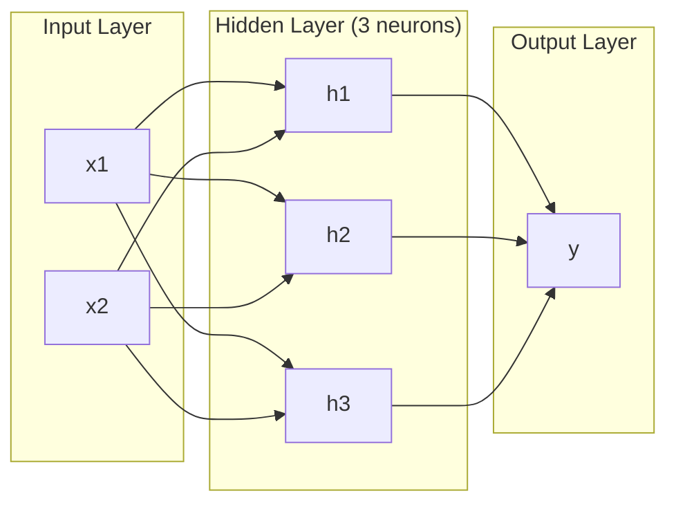
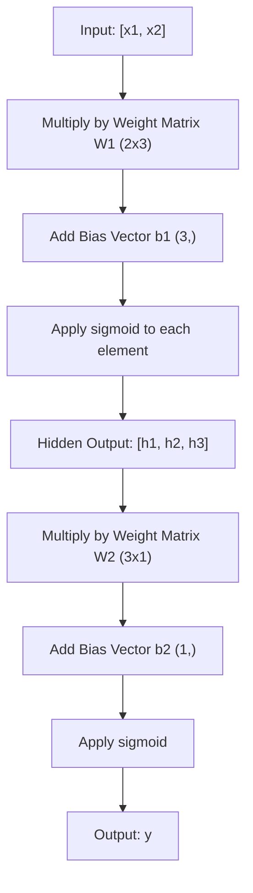
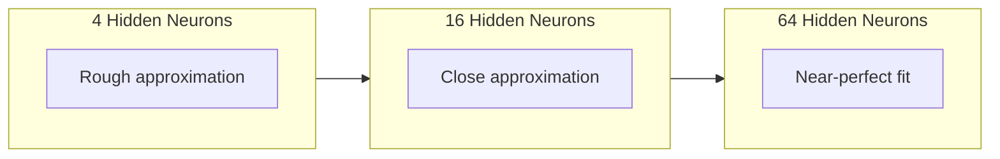

# 多层网络与前行通行

> 一个神经画出一条线. 把它们堆叠起来,你就可以画出任何东西.

**Type:** 构建
**Languages:** Python
**Prerequisites:** Phase 01（Math Foundations），Lesson 03.01（The Perceptron）
**Time:** 约 90 分钟

## 学习目标

- 使用层和网络类 从零构建多层网络,完成完整的前进通行
- 追踪网络每层中的矩阵 维度,并识别形状不匹配
- 解释堆叠非线性激活如何让网络学习曲的决策边界
- 使用 2-2-1 架构和手工调好的标识 权重解决XOR问题

## 问题

单个神经元就是一个画线器――仅仅是这样――它只能在你的数据中画出一条直线――AI中每个真实的问题--图像识别,语言理解,下围棋--都需要曲线――把神经元堆叠成层,就是获得曲线的方法――

1969年,明斯基和帕珀证明了这一限制是致命的:单层网络无法学习XOR──不是很难学习──而是在数学上做不到──XOR真值表把 [0,1] 和 [1,0] 放在一边,把 [0,0] 和 [1,1] 放在另一边──没有一条直线可以把它们分开──

这让神经网络的经费支持停滞了十多年. 后来看来,修复方法很明显:不要只使用一层.

这种堆积是多层网络. 它是今天生产环境中每一个深度学习模型的基础. 进步通过隐藏层输入到输出的数据是你必须先构建的第一件事.

## 概念

### 层:输入,隐藏,输出

一个多层网络有三层:

**输入层**-- 严格来说不是一层. 它保存原始数据.

**Hidden layer**-- 工作发生的地方──每个神经元接收上层的每个输出,应用权重和一个偏差,然后将结果传输到激活函数──称为隐藏,因为你不会直接在训练数据中看到这些值──

**输出层**对于二分类,使用一个带西格莫ид的神经元.



这是一个2-3-1 网络――两个输入,三个隐藏的神经元,一个输出――每条连接都带着一个权重――每个神经元都带着一个偏见――

每层都会产生一组数字组成的向量,称为隐藏状态.对于文本,隐藏状态会增加维度. - 把一个词编码成768个数字以捕捉语义意义.对于图像,它们会降低维度. - 将数百万像素缩小成可管理的表示.

### 神经元与激活

每个神经元都做了三件事:

1. 将每一个输入乘以对应的权重
2. 将所有乘积求和并加上一个偏差
3. 将这个和传入激活函数

现在,激活函数是sigmoid:

```
sigmoid(z) = 1 / (1 + e^(-z))
```

形将任意数字压缩到 (0, 1) 范围内.较大的正输入会推向1――较大的负输入会推向0――零映射到0.5――这个平曲线让学习成为可能--不同于感知的硬阶跃,形在每个位置都有梯度――

### 前进通行:数据如何流动

进口传递将将输入数据逐层推过网络,直到输出.



在每层,三个操作会按顺序发生:

```
z = W * input + b       (linear transformation)
a = sigmoid(z)           (activation)
```

一层的输入会成为下层的输入.

### 矩阵维度

追踪维度是深度学习中最重要的调试技能.

| Step | Operation | Dimensions | Result Shape |
|------|-----------|------------|-------------|
| 输入 | x | -- | (2,) |
| Hidden 线性部分 | W1 * x + b1 | W1: (3, 2), b1: (3,) | (3,) |
| Hidden 激活 | sigmoid(z1) | -- | (3,) |
| 输出线性部分 | W2 * h + b2 | W2: (1, 3), b2: (1,) | (1,) |
| 输出激活 | sigmoid(z2) | -- | (1,) |

规则:第 k 层的权重矩阵 W 的形状是 (神经元_在_层_k,神经元_在_层_k_minus_1) 行对应前层――列对应上层――如果形状对不上,你就有错误――

### 全球近似定理

1989年,乔治·赛本科证明了一个非凡的事实:一个拥有单个隐藏层的神经网络,可以随意地接近任何连续函数.

这并不意味着一个隐藏的层,总是最佳选择. 这意味着该结构在理论上具有能力.

直觉是:隐藏层中每个神经元学习一个凸起或特征――只要有足够多的凸起,并将它们放在正确位置,就能接近任意平滑曲线――神经元越多,凸起越多,接近越好――



### 可组合性

神经网络是可组合的. 你可以堆叠它们,串联它们,并行运行它们. 语模型 使用一个编码网络处理音频,并使用一个独立的编码网络.


```figure
mlp-forward
```

## 构建它

纯Python──不使用numpy──每个矩阵操作都从零编写──

### 步骤1:sigmoid 激活

```python
import math

def sigmoid(x):
    x = max(-500.0, min(500.0, x))
    return 1.0 / (1.0 + math.exp(-x))
```

放值到500,500,可以防止溢出.`math.exp(500)`很大,但仍然有限.`math.exp(1000)`是无穷大.

### 步骤 2: 层级

所有深度学习中最重要的操作是矩阵乘法――每层,每层注意力头――每次前进传递――下层都是矩阵――一个线性层接收一个输入向量,将其乘以权重矩阵,并加上偏差向量:y = Wx + b――这个单一程占神经网络中90%的计算量――

一层保存一个权重矩阵和一个偏向向量――它的前进方法接收一个输入向量,并返回激活后的输出――

```python
class Layer:
    def __init__(self, n_inputs, n_neurons, weights=None, biases=None):
        if weights is not None:
            self.weights = weights
        else:
            import random
            self.weights = [
                [random.uniform(-1, 1) for _ in range(n_inputs)]
                for _ in range(n_neurons)
            ]
        if biases is not None:
            self.biases = biases
        else:
            self.biases = [0.0] * n_neurons

    def forward(self, inputs):
        self.last_input = inputs
        self.last_output = []
        for neuron_idx in range(len(self.weights)):
            z = sum(
                w * x for w, x in zip(self.weights[neuron_idx], inputs)
            )
            z += self.biases[neuron_idx]
            self.last_output.append(sigmoid(z))
        return self.last_output
```

权重矩阵的形状是 (n_neurons, n_inputs) ⋅每一行是一个神经元跨所有输入的权重──前进方法 遍历神经元,计算加权和加偏见,应用 sigmoid,并收集结果──

### 步骤3:网络类

一个网络是层列表. 前进通行将它们链接起来:第一个层输出输入到第一个层+1层.

```python
class Network:
    def __init__(self, layers):
        self.layers = layers

    def forward(self, inputs):
        current = inputs
        for layer in self.layers:
            current = layer.forward(current)
        return current
```

这就是整个前进传递.

### 步骤4:使用手工调好的权重解决XOR

在第01课中,我们通过组合OR、NAND 和 AND perceptron 解决了XOR──现在用我们的层和网络类做同样的事──2-2-1 架构:两个输入、两个隐藏的神经元、一个输出──

```python
hidden = Layer(
    n_inputs=2,
    n_neurons=2,
    weights=[[20.0, 20.0], [-20.0, -20.0]],
    biases=[-10.0, 30.0],
)

output = Layer(
    n_inputs=2,
    n_neurons=1,
    weights=[[20.0, 20.0]],
    biases=[-30.0],
)

xor_net = Network([hidden, output])

xor_data = [
    ([0, 0], 0),
    ([0, 1], 1),
    ([1, 0], 1),
    ([1, 1], 0),
]

for inputs, expected in xor_data:
    result = xor_net.forward(inputs)
    predicted = 1 if result[0] >= 0.5 else 0
    print(f"  {inputs} -> {result[0]:.6f} (rounded: {predicted}, expected: {expected})")
```

较大的权重(20, -20) 让西格莫ид表现得像阶跃函数――第一个隐藏的神经元近似OR――第二个近似NAND――输出神经元把它们组合成 AND,也就是XOR――

### 步骤 5: 圆形分类

一个更难的问题是将2D点分类为以原点为中心的圆内或圆外的半径0.5个.

```python
import random
import math

random.seed(42)

data = []
for _ in range(200):
    x = random.uniform(-1, 1)
    y = random.uniform(-1, 1)
    label = 1 if (x * x + y * y) < 0.25 else 0
    data.append(([x, y], label))

circle_net = Network([
    Layer(n_inputs=2, n_neurons=8),
    Layer(n_inputs=8, n_neurons=1),
])
```

随时权重时,网络分类效果不会好.但是前进传递 仍然会运行.

```python
correct = 0
for inputs, expected in data:
    result = circle_net.forward(inputs)
    predicted = 1 if result[0] >= 0.5 else 0
    if predicted == expected:
        correct += 1

print(f"Accuracy with random weights: {correct}/{len(data)} ({100*correct/len(data):.1f}%)")
```

随着权重会得到较差的准确率 - 通常甚至比猜大多数类还差. 训练后 (课3)),这个拥有8个隐藏的神经元的相同结构会绘制一个曲边界,把内部和外部部分开设.

## 使用它

通过四行代码完成上面的所有内容:

```python
import torch
import torch.nn as nn

model = nn.Sequential(
    nn.Linear(2, 8),
    nn.Sigmoid(),
    nn.Linear(8, 1),
    nn.Sigmoid(),
)

x = torch.tensor([[0.0, 0.0], [0.0, 1.0], [1.0, 0.0], [1.0, 1.0]])
output = model(x)
print(output)
```

`nn.Linear(2, 8)`就是你的层类:形 为 (8,2) 的权重矩阵,形 为 (8,) 的偏差向量.`nn.Sigmoid()`是你的sigmoid 函数,逐元素应用──`nn.Sequential`是你的网络类:按顺序串联各层.

区别在于速度和规模. 在GPU上运行,处理数百万个样本的批量,并自动计算用于后传的梯度.

## 交付它

本课程产出了一个可复制的提示,用于设计网络架构:

- `outputs/prompt-network-architect.md`

当你需要决定给定的问题时,你可以使用多少层,每个层多少神经元以及使用哪些激活函数.

## 练习

1. 构建一个 2-4-2-1 网络(两个隐藏层),并使用XOR 数据随机权重运行 前行通过──打印中间隐藏层的输出,观察表示在每个层如何变化──

2. 将圆形分类器中隐藏层大小从8 改为2,再改为32──每次都使用随机权重运行 前进传递──隐藏的神经元的数量是否会改变输出范围或分布?为什么?

3. 在网络类上实现一个`count_parameters`系统的重量和偏差总数. 在一个 784-256-128-10 网络中,

4. 为一个 3-4-4-2 网络构建 进口通过――向它输入RGB 颜色值(归结到0-1),并观察两个输出――这是一个两类简单的颜色分类器的构建――

5. 使用一个漏式步函数替换sigmoid:如果 z < 0,则返回0.01 * z,否则返回1.0.──使用步4中的同样手工调好权重,在XOR上运行前进传递──它仍然有效吗?为什么平滑的sigmoid比硬截断更受欢迎?

## 关键术语

| Term | 人们会怎么说 | 它实际意味着什么 |
|------|----------------|----------------------|
| Forward pass | “运行模型” | 将输入推过每一层 -- 乘以权重、加上 bias、激活 -- 以产生输出 |
| Hidden layer | “中间部分” | 输入和输出之间的任意层，其值不会在数据中被直接观察到 |
| Multi-layer network | “一个深的 Neural Network” | 按顺序堆叠的神经元层，其中每一层的输出会输入到下一层 |
| Activation function | “非线性” | 在线性变换之后应用的函数，用来把曲线引入决策边界 |
| Sigmoid | “S 曲线” | sigma(z) = 1/(1+e^(-z))，将任意实数压缩到 (0,1)，平滑且处处可微 |
| Weight matrix | “参数” | 一个 shape 为 (current_layer_neurons, previous_layer_neurons) 的 Matrix W，包含可学习的连接强度 |
| Bias vector | “偏移量” | 在 Matrix 乘法之后添加的 Vector，使神经元即使在所有输入为零时也能激活 |
| Universal approximation | “Neural Network 可以学习任何东西” | 一个拥有足够多神经元的单 hidden layer 可以逼近任意连续函数 -- 但“足够多”可能意味着数十亿 |
| Linear transformation | “Matrix 乘法步骤” | z = W * x + b，激活前的计算，将输入映射到一个新空间 |
| Decision boundary | “分类器切换的地方” | 输入空间中的一个曲面，网络输出在这里跨过分类阈值 |

## 延伸阅读

- 迈克尔·尼尔森"神经网络和深度学习",1-2章 (http://neuralnetworksanddeeplearning.com/) -- 关于前进通行和网络结构最清晰的免费解释,包含互动可视化
- 赛本科, "Sigmoidal函数的超置式近似" (1989) -- 最初的普遍近似定理论文,出乎意料地易读
- 蓝色1棕色",但神经网络是什么?"https://www.youtube.com/watch?v=aircAruvnKk) -- 20 分钟可视化讲解层、权重和前进通过,帮助建立正确的心智模型
- 善良的同事,Bengio, Courville,"深度学习",第6章 (https://www.deeplearningbook.org/) -- 多层网络的标准参考,免费在线阅读
