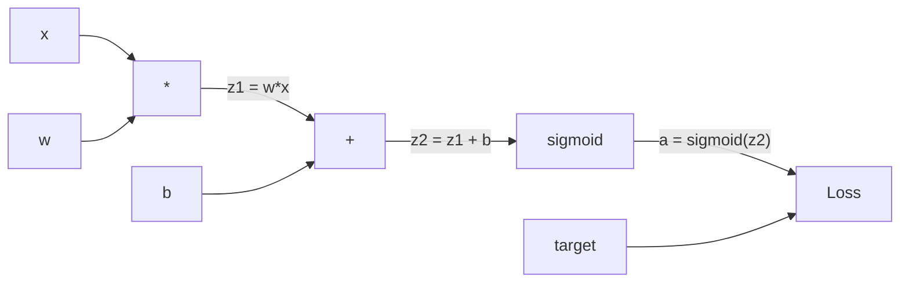
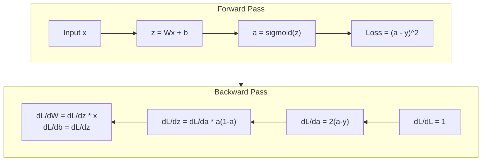
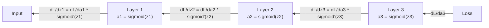

# 从零实现后延

> 背传播是让学习成为可能的算法.没有它,神经网络只是一个昂贵的随机数生成器.

**Type:** Build
**Languages:** Python
**Prerequisites:** Lesson 03.02 (Multi-Layer Networks)
**Time:** ~120 minutes

## 学习目标
- 实现一个基于值的自行排序引擎,它将构建计算图,并通过拓类型计算梯度
- 使用链条规则 推导加倍 和 sigmoid 的倒退通行
- 仅使用你从零实现的后扩散引擎,在XOR和圆的分类上训练一个多层网络
- 识别深层sigmoid网络中的消失梯度问题,并解释为什么渐进指数级缩小

## 问题
你的网络有一个隐藏的层,包含768个输入和3072个输出. 这就是2,359,296个权重. 它做了一个错误预测.

简单的做法是:取一个权重,轻微动动一点,再运行一次前进通行,测量损失是上升还是下降. 这将给出权重的分数.

后传播解决了这个问题――一次前进通过,一次后退通过,所有梯度都计算出来――关键是计算中链条规则,被系统地应用到计算图上――正是这个算法让深度学习变得实用――没有它,我们仍然只能困在玩具问题上――

## 概念
### 链条规则,应用到网络上

你在第01阶段,第05课中见过链条规则──快速回顾:如果 y = f(g(x)),那么dy/dx = f'(g(x)) * g'(x)──你沿着链条相乘衍生之──

在神经网络中,链条是从输入到损失的操作序列. 每层应用权重加上偏置,再通过激活.

### 计算图表

每次前进通行都会构建一个图. 每个节点都是一个操作.



进步传递:值从左向右流动──x 和 w 产生 z1 = w*x──加上 b 得到 z2──Sigmoid 给出激活 a──使用损失函数将 a 与目标 y 比较──

逆转过度:从右向左流动。从dL/da 开始──输出 如何随激活变化)──乘以da/dz2 ()  ()  ()  ()  () )  ()  ()  ()  ()  ()  ()  ()  ()  ()  () )  ()  ()  ()  ()  ()  ()  ()  ()  ()  ()  ()  ()  () )  ()  ()  ()  ()  ()  ()  () )  ()  ()  ()  () )  ()  ()  ()  () )  ()  ()  ()  ()  () )  ()  ()  ()  ()  () ) ()  ()  ()  ()  ()  ()  ()  ()  () ) ()  ()  () ()  ()  ()  ()  () )  ()  ()  ()  ()  ()  () )  ()  () )  ()  () ) ()  ()  ( () ) )  ()  ()  () ) 

在后游通行期间,每个节点在图中只有一个任务:接收从上游的梯度,乘以其自己的本地衍生值,然后向下游传递.

### 前往对后退



后期通行需要这些已存储的值来计算的基准. 这就是后期传递核心内存-计算权衡.

### 网络中流动的渐变

对于一个三层网络,每层都会有梯度链接.



在每层,梯度都会乘以西格莫因衍生品──西格莫因衍生品是 * (1 - a),最大值是0.25(当 a = 0.5 时)──深入三层后,梯度 至多已经乘以0.25^3 = 0.0156──深入十层:0.25^10 = 0.000001──

### 渐变物消失

这就是消失梯度问题. 锡格莫ид会把输出压缩到0 和 1 之间. 其衍生品永远小于0.25. 后,渐变会缩小到接近零. 早期层几乎无法学习,因为它们接收到的渐变接近零.

```
sigmoid(z):     Output range [0, 1]
sigmoid'(z):    Max value 0.25 (at z = 0)

After 5 layers:   gradient * 0.25^5 = 0.001x original
After 10 layers:  gradient * 0.25^10 = 0.000001x original
```

这就是为什么深层sigmoid网络几乎不可能训练――修复方法-- ReLU 及其变体――是第04课题――现在,先了解后传播本身运行得很完美――问题在于它经历了什么――

### 推导 两层网络的渐变

下面是一个具体的数学例子:网络有输入 x、带 sigmoid 的隐藏层、带 sigmoid 的输出层,以及 MSE Loss──

前行通行:
```
z1 = W1 * x + b1
a1 = sigmoid(z1)
z2 = W2 * a1 + b2
a2 = sigmoid(z2)
L = (a2 - y)^2
```

后行通行 (逐步应用链条规则):
```
dL/da2 = 2(a2 - y)
da2/dz2 = a2 * (1 - a2)
dL/dz2 = dL/da2 * da2/dz2 = 2(a2 - y) * a2 * (1 - a2)

dL/dW2 = dL/dz2 * a1
dL/db2 = dL/dz2

dL/da1 = dL/dz2 * W2
da1/dz1 = a1 * (1 - a1)
dL/dz1 = dL/da1 * da1/dz1

dL/dW1 = dL/dz1 * x
dL/db1 = dL/dz1
```

每个分数都来自于损失的地方衍生量乘积.


```figure
backprop-vanishing
```

## 构建它
### 步骤1:值节点

我们计算中的每个数字都会变成一个值. 它存储自己的数据,以及它是如何创建的.

```python
class Value:
    def __init__(self, data, children=(), op=''):
        self.data = data
        self.grad = 0.0
        self._backward = lambda: None
        self._children = set(children)
        self._op = op

    def __repr__(self):
        return f"Value(data={self.data:.4f}, grad={self.grad:.4f})"
```

还没有 Gradient ((0.0) ・・・ 还没有倒退功能 ((没有操作) ・・・`_children`之后我们可以对图进行拓类型.

### 步骤 2: 带后退函数的操作

每个操作都会创建一个新的价值,并定义了如何反向流经它.

```python
def __add__(self, other):
    other = other if isinstance(other, Value) else Value(other)
    out = Value(self.data + other.data, (self, other), '+')

    def _backward():
        self.grad += out.grad
        other.grad += out.grad

    out._backward = _backward
    return out

def __mul__(self, other):
    other = other if isinstance(other, Value) else Value(other)
    out = Value(self.data * other.data, (self, other), '*')

    def _backward():
        self.grad += other.data * out.grad
        other.grad += self.data * out.grad

    out._backward = _backward
    return out
```

对于加:d(a+b)/da = 1,d(a+b)/db = 1──因此两个输入都会直接获得输出的梯度──

对于乘法:d(a*b)/da = b,d(a*b)/db = a──每个输入都会获得另一个输入的值 乘以输出级别──

`+=`很关键. 一个值可能会被多个操作使用.

### 步骤3:sigmoid和损失

```python
import math

def sigmoid(self):
    x = self.data
    x = max(-500, min(500, x))
    s = 1.0 / (1.0 + math.exp(-x))
    out = Value(s, (self,), 'sigmoid')

    def _backward():
        self.grad += (s * (1 - s)) * out.grad

    out._backward = _backward
    return out
```

引号导数:sigmoid(x) * (1 - sigmoid(x))。我们在前进通行中已经计算了sigmoid(x) = s──复用它──不需要额外工作──

```python
def mse_loss(predicted, target):
    diff = predicted + Value(-target)
    return diff * diff
```

单个输出的MSE:(预测 - 目标) ^2。我们把减值表达为加上一个取负值──

### 步骤4: 倒退通行

拓类型 确保我们按正确顺序处理节点 - - 某个节点的渐变会在通过它继续传播之前被完全积累.

```python
def backward(self):
    topo = []
    visited = set()

    def build_topo(v):
        if v not in visited:
            visited.add(v)
            for child in v._children:
                build_topo(child)
            topo.append(v)

    build_topo(self)
    self.grad = 1.0
    for v in reversed(topo):
        v._backward()
```

从 开始的损失 (Gradient = 1.0,因为 dL/dL = 1)──沿着排序后的图反向遍历──每个节点的`_backward`让Gradient推送给他的孩子们.

### 步骤5: 层和网络

```python
import random

class Neuron:
    def __init__(self, n_inputs):
        scale = (2.0 / n_inputs) ** 0.5
        self.weights = [Value(random.uniform(-scale, scale)) for _ in range(n_inputs)]
        self.bias = Value(0.0)

    def __call__(self, x):
        act = sum((wi * xi for wi, xi in zip(self.weights, x)), self.bias)
        return act.sigmoid()

    def parameters(self):
        return self.weights + [self.bias]


class Layer:
    def __init__(self, n_inputs, n_outputs):
        self.neurons = [Neuron(n_inputs) for _ in range(n_outputs)]

    def __call__(self, x):
        out = [n(x) for n in self.neurons]
        return out[0] if len(out) == 1 else out

    def parameters(self):
        params = []
        for n in self.neurons:
            params.extend(n.parameters())
        return params


class Network:
    def __init__(self, sizes):
        self.layers = []
        for i in range(len(sizes) - 1):
            self.layers.append(Layer(sizes[i], sizes[i + 1]))

    def __call__(self, x):
        for layer in self.layers:
            x = layer(x)
            if not isinstance(x, list):
                x = [x]
        return x[0] if len(x) == 1 else x

    def parameters(self):
        params = []
        for layer in self.layers:
            params.extend(layer.parameters())
        return params

    def zero_grad(self):
        for p in self.parameters():
            p.grad = 0.0
```

一个神经元 接收输入,计算权重总量 +偏差,然后应用 sigmoid──权重初始化按平方 (2/n_inputs) 缩小,用于防止更深的网络中的 sigmoid 和──一个层是神经元的列表──一个网络是层的列表──`parameters()`方法会收集所有可学习的价值,这样我们就可以更新它们.

### 步骤 6: 在 XOR 上训练

```python
random.seed(42)
net = Network([2, 4, 1])

xor_data = [
    ([0.0, 0.0], 0.0),
    ([0.0, 1.0], 1.0),
    ([1.0, 0.0], 1.0),
    ([1.0, 1.0], 0.0),
]

learning_rate = 1.0

for epoch in range(1000):
    total_loss = Value(0.0)
    for inputs, target in xor_data:
        x = [Value(i) for i in inputs]
        pred = net(x)
        loss = mse_loss(pred, target)
        total_loss = total_loss + loss

    net.zero_grad()
    total_loss.backward()

    for p in net.parameters():
        p.data -= learning_rate * p.grad

    if epoch % 100 == 0:
        print(f"Epoch {epoch:4d} | Loss: {total_loss.data:.6f}")

print("\nXOR Results:")
for inputs, target in xor_data:
    x = [Value(i) for i in inputs]
    pred = net(x)
    print(f"  {inputs} -> {pred.data:.4f} (expected {target})")
```

观察损失下降――从随机预测到正确的XOR输出,完全由后延伸计算 Gradient 并向正确方向微调权重来驱动――

### 步骤 7: 圆的分类

在第02课中,你为圆圈分类手动调过权重――现在让网络自我学习它们――

```python
random.seed(7)

def generate_circle_data(n=100):
    data = []
    for _ in range(n):
        x1 = random.uniform(-1.5, 1.5)
        x2 = random.uniform(-1.5, 1.5)
        label = 1.0 if x1 * x1 + x2 * x2 < 1.0 else 0.0
        data.append(([x1, x2], label))
    return data

circle_data = generate_circle_data(80)

circle_net = Network([2, 8, 1])
learning_rate = 0.5

for epoch in range(2000):
    random.shuffle(circle_data)
    total_loss_val = 0.0
    for inputs, target in circle_data:
        x = [Value(i) for i in inputs]
        pred = circle_net(x)
        loss = mse_loss(pred, target)
        circle_net.zero_grad()
        loss.backward()
        for p in circle_net.parameters():
            p.data -= learning_rate * p.grad
        total_loss_val += loss.data

    if epoch % 200 == 0:
        correct = 0
        for inputs, target in circle_data:
            x = [Value(i) for i in inputs]
            pred = circle_net(x)
            predicted_class = 1.0 if pred.data > 0.5 else 0.0
            if predicted_class == target:
                correct += 1
        accuracy = correct / len(circle_data) * 100
        print(f"Epoch {epoch:4d} | Loss: {total_loss_val:.4f} | Accuracy: {accuracy:.1f}%")
```

在这里我们使用在线SGD - 每个样本之后就会更新权重,而不是积累完整的批量――这会更快地打破对称性,并避免在完整的损失景观上出现的sigmoid和――每一个时代对数据进行,可以防止网络记住顺序――

没有手动调参――网络会发现圆形决策界限――这就是反向传播的力量:你定义了架构、损失函数和数据――算法会找到权重――

## 使用它
皮托奇使用几行代码完成上述所有工作.核心思想完全相同.

```python
import torch
import torch.nn as nn

model = nn.Sequential(
    nn.Linear(2, 4),
    nn.Sigmoid(),
    nn.Linear(4, 1),
    nn.Sigmoid(),
)
optimizer = torch.optim.SGD(model.parameters(), lr=1.0)
criterion = nn.MSELoss()

X = torch.tensor([[0,0],[0,1],[1,0],[1,1]], dtype=torch.float32)
y = torch.tensor([[0],[1],[1],[0]], dtype=torch.float32)

for epoch in range(1000):
    pred = model(X)
    loss = criterion(pred, y)
    optimizer.zero_grad()
    loss.backward()
    optimizer.step()

print("PyTorch XOR Results:")
with torch.no_grad():
    for i in range(4):
        pred = model(X[i])
        print(f"  {X[i].tolist()} -> {pred.item():.4f} (expected {y[i].item()})")
```

`loss.backward()`这是你的.`total_loss.backward()`,我知道.`optimizer.step()`这就是你手动写的.`p.data -= lr * p.grad`,我知道.`optimizer.zero_grad()`这是你的.`net.zero_grad()`△同一个算法,工业级实现──PyTorch 负责GPU加速、混合精度、渐变检查,以及数百种层类型──但后退通行仍然是相同的链条规则,应用在相同的计算图上──

训练会运行前进通行,然后运行后进通行,再更新权重――推理只运行前进通行――没有梯度,没有更新――这个区别很重要,因为推理是生产环境中发生的事情――当你调用克劳德或GPT这样的API时,你运行推理――你的提示向前流经网络,Token从另一端输出――没有权重发生变化――理解后进传递很重要,因为它塑造了网络中的每一个权重――

## 交付它
本课会产出:
- `outputs/prompt-gradient-debugger.md`-- 一个可复用提示,用于诊断任何神经网络中的渐进问题

## 练习
1. 给值类 添加一个 `__sub__`方法 (a - b = a + (-1 * b))──然后实现一个`__neg__`通过简单表达式 (如 (a - b) ^2) 的手动计算进行比较,验证梯度是否正确的.

2. 给值添加一个`relu`方法(输出为最大(0,x),衍生在 x > 0 时为 1,否则为 0) ――在隐藏层中使用 rel 替换 sigmoid,并再次在 XOR 上训练――比较收速度――你应该看到训练更快――这是第04课的预告――

3. 在值上实现一个用于整数的权力`__pow__`方法. 用它.`mse_loss`换成真正的`(predicted - target) ** 2`表达式――验证 渐进与原始实现一致――

4. 给训练循环 添加梯度剪辑:调用 `backward()`之后把所有的梯度剪辑到 [-1, 1]──训练一个更深的网络(4+层与sigmoid),并比较有无剪辑的损失曲线──这是你对抗爆炸梯度的第一道防线──

5. 构建一个可视化:在 XOR 训练完成后,打印网络中每个参数的梯度――找出哪一层的梯度 最小――这将显示你在概念 部分读到的消失梯度问题――

## 关键术语
| Term | What people say | What it actually means |
|------|----------------|----------------------|
| Backpropagation | “Network 学会了” | 一种算法，通过沿 Computational Graph 反向应用 chain rule，为每个权重计算 dL/dw |
| Computational graph | “Network 结构” | 一个有向无环 graph，其中 node 是 operation，edge 承载 value（forward）和 Gradient（backward） |
| Chain rule | “把 derivative 相乘” | 如果 y = f(g(x))，那么 dy/dx = f'(g(x)) * g'(x) -- Backpropagation 的数学基础 |
| Gradient | “最陡上升方向” | Loss 相对于某个 parameter 的 partial derivative -- 告诉你如何改变该 parameter 来降低 Loss |
| Vanishing gradient | “深层 network 学不会” | 当 Gradient 通过带有 sigmoid 这类 saturating activation 的 layer 传播时，会指数级缩小 |
| Forward pass | “运行 network” | 通过顺序应用每一层的 operation，从 input 计算 output，并存储 intermediate value |
| Backward pass | “计算 Gradient” | 反向遍历 Computational Graph，在每个 node 使用 chain rule 累积 Gradient |
| Learning rate | “学习速度” | 一个控制权重更新步长的 scalar：w_new = w_old - lr * gradient |
| Topological sort | “正确顺序” | 一种 graph node 排序方式，使每个 node 都出现在其依赖的所有 node 之后 -- 确保 Gradient 在传播前已完全累积 |
| Autograd | “自动微分” | 一个在 forward computation 期间构建 Computational Graph，并自动计算 Gradient 的系统 -- PyTorch 的 engine 做的就是这个 |

## 延伸阅读
- 鲁姆哈特,希顿和威廉姆斯,"通过背后传播错误学习表示" (1986) -- 这篇论文让背后传播成为主流,并解锁了多层网络培训
- 蓝色1棕色,神经网络系列 (https://www.youtube.com/playlist?list=PLZHQObOWTQDNU6R1_67000Dx_ZCJB-3pi) -- 关于后传播以及如何通过 Gradient网络的最佳可见解释
