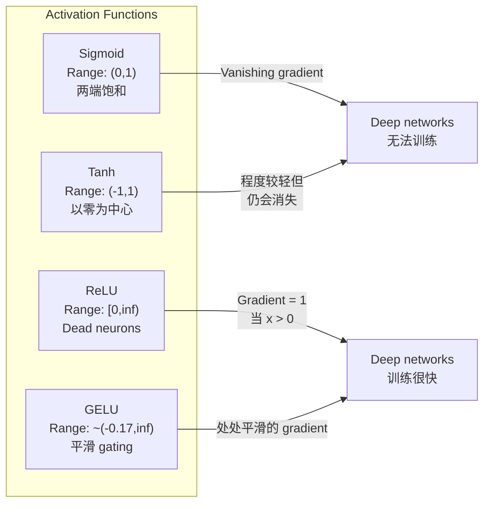
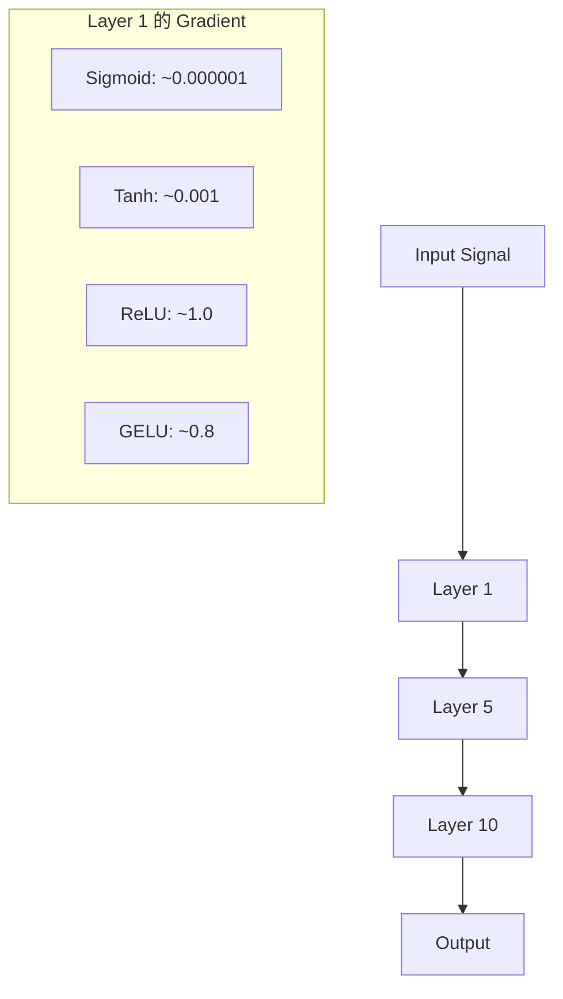
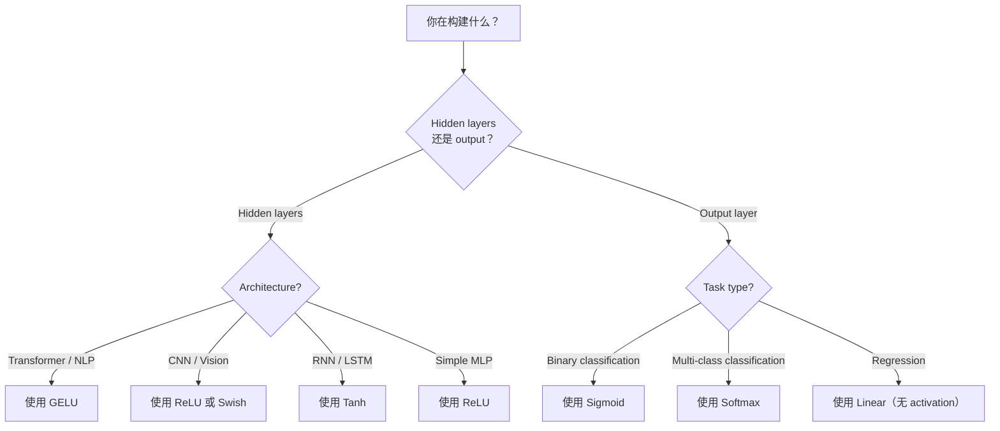

# 激活函数

> 没有非线性,你的100层网络只是精致的矩阵乘法.

**Type:** Build
**Languages:** Python
**Prerequisites:** Lesson 03.03 (Backpropagation)
**Time:** ~75 分钟

## 学习目标

- 从零实现sigmoid、tanh、ReLU、Leaky ReLU、GELU、Swish 和软max 及其衍生品
- 通过测量不同激活在10+层中的激活大小,诊断消失梯度问题
- 检测Relu网络中死神经元,并解释为什么GELU能够避免这种失败模式
- 为定制架构 (transformer,CNN,RNN,输出层) 选择正确的激活函数

## 问题

堆叠两个线性转变:y = W2(W1x + b1) + b2。展开它:y = W2W1x + W2b1 + b2。这只是 y = Ax + c 一个单一的线性转变――无论你堆叠多少线性层,结果都会缩成一次的矩阵乘倍――你的100层网络与单层网络具有相同的表示能力――

这不是理论上的猎奇. 它意味着深线网络 字面上无法学习XOR,无法分类螺旋数据集,无法识别人脸.

激活函数 打破线性――它们通过非线性函数 扭曲每层输出,让网络能够曲决策界限、近似任意函数,并真正学习――但如果选择错误的激活,你的梯度会消失到零(深度网络中的 sigmoid) 、爆炸到无穷大(没有谨慎的初始化无限的激活),或者你的神经元会永久死亡(带有较大的负面偏见的 ReLU) ・激活函数的选择直接决定了你的网络是否能学习――

## 概念

### 为什么非线性是必要的

矩阵乘法是可组合的.首先使用矩阵A乘以一个向量,再使用矩阵B乘以结果,等于直接乘以AB.这意味着堆积十个线性层,数学上等于一个带有大矩阵的线性层.所有这些参数,所有这些深度都浪费了.你需要某种东西来打断这个链.这是激活函数的作用.

下面是证明――一个线性层计算 f(x) = Wx + b──堆叠两个:

```
Layer 1: h = W1 * x + b1
Layer 2: y = W2 * h + b2
```

代入:

```
y = W2 * (W1 * x + b1) + b2
y = (W2 * W1) * x + (W2 * b1 + b2)
y = A * x + c
```

一层──在层之间插入非线性激活g():

```
h = g(W1 * x + b1)
y = W2 * h + b2
```

现在代入被打破了──W2 * g(W1 * x + b1) + b2 不能再简化为单一线性转换──网络可以表示非线性函数──每增加一层带激活的层,都会增加表示能力──

### 状

神经网络最早的激活功能.

```
sigmoid(x) = 1 / (1 + e^(-x))
```

输出范围:(0, 1)──平滑、可微,将任意实数映射到类似概率的值──

衍生品:

```
sigmoid'(x) = sigmoid(x) * (1 - sigmoid(x))
```

这个衍生值的最大值是0.25,现在x=0──在后延,梯度会逐层相乘──十层sigmoid意思是梯度 最多会被0.25连续乘十次:

```
0.25^10 = 0.000000953674
```

不到原始信号的百万分之一――这是渐变问题――早期层间的渐变变极小,重量几乎没有更新――网络看起来在学习中后层的损失在下降,但前层已结结――深度的西格莫ид网络根本没有训练――

另一个问题:sigmoid 输出始终为正 ((0 到 1),这意味着重量上梯次总是同号――这会导致梯次下降过程中出现字形震荡――

### 

的中文版本.

```
tanh(x) = (e^x - e^(-x)) / (e^x + e^(-x))
```

输出范围: ((-1, 1)──以零为中心,可消除之字形问题──

衍生品:

```
tanh'(x) = 1 - tanh(x)^2
```

最大的衍生在 x = 0 时为 1.0 比sigmoid 好四倍――但消失梯度问题仍然存在――对于很大的正输入或负输入,衍生会趋近零――十层仍然会压碎梯度,只是没有那么激烈――

### 突破

修改线性单位──纳尔 和 希顿在2010年将其推广到深度学习.

```
relu(x) = max(0, x)
```

输出范围:[0,无限) ・衍生 非常简单:

```
relu'(x) = 1  if x > 0
            0  if x <= 0
```

对于正输入,没有消失梯度――梯度正好是1,会直接传递过去――这就是深度网络变得可训练的原因ReLU能够跨层保留梯度大小――

但它有一个失败模式:死神经元问题. 如果某个神经元的重量输入总是负面的 (由于较大的负面偏见或不幸的重量初始化),它的输出永远为零,渐进式永远为零,因此永远不会更新.

### 泄漏的RLU

死亡神经元最简单的修复方式.

```
leaky_relu(x) = x        if x > 0
                alpha * x if x <= 0
```

其中,alpha 是一个小常数,通常为0.01──负半轴有一个小斜率而不是零,因此死神经元仍然可以获得梯度信号,并有机会恢复──

### 现代默认选择

盖斯错误线性单位──由亨德里克斯和吉普尔于2016年提出──是BERT、GPT以及大多数现代变压器中默认激活──

```
gelu(x) = x * Phi(x)
```

其中,phi ((x) 是标准正常分布的累积分布函数――实践中使用的近似形式:

```
gelu(x) ~= 0.5 * x * (1 + tanh(sqrt(2/pi) * (x + 0.044715 * x^3)))
```

 GELU处于平滑,允许较小的负值 ((不像 ReLU 那样硬截断为零),并且有一个概率解释:它根据每一个输入在高斯分布下为正的可能性对其加权.

### 瑞士 / 瑞士

由Ramachandran等人在2017年通过自动搜索发现的自我关闭激活.

```
swish(x) = x * sigmoid(x)
```

通过在激活功能空间上进行自动搜索,发现它是一个神经网络在设计神经网络的一部分.

与GELU一样,它平滑、非单调,并允许较小的负值──差异很微妙:Swish使用 sigmoid 作为门,而GELU使用Gaussian CDF──实践中,性能几乎相同──Swish使用 EfficientNet 和一些视觉模型──GELU则主导语言模型──

### 软max:输出激活

不用于隐藏层次――软max将原始分数 (logits) 的向量转换为概率分布――

```
softmax(x_i) = e^(x_i) / sum(e^(x_j) for all j)
```

每个输出都在0到1之间. 所有输出都为1. 这使得它成为多类分类标准的最终激活. 最大的逻辑会得到最高概率,但与 argmax 不一样,软max 是微的,并保留了相对可信的信息.

### 形状对比



### 渐进流量对比



### 什么时候使用什么类型的激活



## 动手构建

### 步骤1:实现所有激活函数及其衍生品

每个函数接收一个浮动并返回一个浮动――每一个衍生函数接收相同的输入并返回梯度――

```python
import math

def sigmoid(x):
    x = max(-500, min(500, x))
    return 1.0 / (1.0 + math.exp(-x))

def sigmoid_derivative(x):
    s = sigmoid(x)
    return s * (1 - s)

def tanh_act(x):
    return math.tanh(x)

def tanh_derivative(x):
    t = math.tanh(x)
    return 1 - t * t

def relu(x):
    return max(0.0, x)

def relu_derivative(x):
    return 1.0 if x > 0 else 0.0

def leaky_relu(x, alpha=0.01):
    return x if x > 0 else alpha * x

def leaky_relu_derivative(x, alpha=0.01):
    return 1.0 if x > 0 else alpha

def gelu(x):
    return 0.5 * x * (1 + math.tanh(math.sqrt(2 / math.pi) * (x + 0.044715 * x ** 3)))

def gelu_derivative(x):
    phi = 0.5 * (1 + math.erf(x / math.sqrt(2)))
    pdf = math.exp(-0.5 * x * x) / math.sqrt(2 * math.pi)
    return phi + x * pdf

def swish(x):
    return x * sigmoid(x)

def swish_derivative(x):
    s = sigmoid(x)
    return s + x * s * (1 - s)

def softmax(xs):
    max_x = max(xs)
    exps = [math.exp(x - max_x) for x in xs]
    total = sum(exps)
    return [e / total for e in exps]
```

### 步骤2:可视化 梯度 在哪里死亡

在 -5 到 5 的 100 个平均间隔点上计算梯度――打印一个文本历史图,显示每个激活的梯度在哪里接近零――

```python
def gradient_scan(name, derivative_fn, start=-5, end=5, n=100):
    step = (end - start) / n
    near_zero = 0
    healthy = 0
    for i in range(n):
        x = start + i * step
        g = derivative_fn(x)
        if abs(g) < 0.01:
            near_zero += 1
        else:
            healthy += 1
    pct_dead = near_zero / n * 100
    print(f"{name:15s}: {healthy:3d} healthy, {near_zero:3d} near-zero ({pct_dead:.0f}% dead zone)")

gradient_scan("Sigmoid", sigmoid_derivative)
gradient_scan("Tanh", tanh_derivative)
gradient_scan("ReLU", relu_derivative)
gradient_scan("Leaky ReLU", leaky_relu_derivative)
gradient_scan("GELU", gelu_derivative)
gradient_scan("Swish", swish_derivative)
```

### 步骤3:消失的渐进 实验

使用 sigmoid 与 ReLU,让一个信号通过 N 层前进通过.

```python
import random

def vanishing_gradient_experiment(activation_fn, name, n_layers=10, n_inputs=5):
    random.seed(42)
    values = [random.gauss(0, 1) for _ in range(n_inputs)]

    print(f"\n{name} through {n_layers} layers:")
    for layer in range(n_layers):
        weights = [random.gauss(0, 1) for _ in range(n_inputs)]
        z = sum(w * v for w, v in zip(weights, values))
        activated = activation_fn(z)
        magnitude = abs(activated)
        bar = "#" * int(magnitude * 20)
        print(f"  Layer {layer+1:2d}: magnitude = {magnitude:.6f} {bar}")
        values = [activated] * n_inputs

vanishing_gradient_experiment(sigmoid, "Sigmoid")
vanishing_gradient_experiment(relu, "ReLU")
vanishing_gradient_experiment(gelu, "GELU")
```

### 步骤4:死神经元检测器

创建一个RELU网络,将随机输入传入其中,统计有多少神经元从未激活过.

```python
def dead_neuron_detector(n_inputs=5, hidden_size=20, n_samples=1000):
    random.seed(0)
    weights = [[random.gauss(0, 1) for _ in range(n_inputs)] for _ in range(hidden_size)]
    biases = [random.gauss(0, 1) for _ in range(hidden_size)]

    fire_counts = [0] * hidden_size

    for _ in range(n_samples):
        inputs = [random.gauss(0, 1) for _ in range(n_inputs)]
        for neuron_idx in range(hidden_size):
            z = sum(w * x for w, x in zip(weights[neuron_idx], inputs)) + biases[neuron_idx]
            if relu(z) > 0:
                fire_counts[neuron_idx] += 1

    dead = sum(1 for c in fire_counts if c == 0)
    rarely_fire = sum(1 for c in fire_counts if 0 < c < n_samples * 0.05)
    healthy = hidden_size - dead - rarely_fire

    print(f"\nDead Neuron Report ({hidden_size} neurons, {n_samples} samples):")
    print(f"  Dead (never fired):     {dead}")
    print(f"  Barely alive (<5%):     {rarely_fire}")
    print(f"  Healthy:                {healthy}")
    print(f"  Dead neuron rate:       {dead/hidden_size*100:.1f}%")

    for i, c in enumerate(fire_counts):
        status = "DEAD" if c == 0 else "WEAK" if c < n_samples * 0.05 else "OK"
        bar = "#" * (c * 40 // n_samples)
        print(f"  Neuron {i:2d}: {c:4d}/{n_samples} fires [{status:4s}] {bar}")

dead_neuron_detector()
```

### 步骤 5:训练对比 Sigmoid vs ReLU vs GELU

在圆内点 = 类 1,圆外 = 类 0) 上,使用三种不同的激活训练与一个双层网络――比较收速度――

```python
def make_circle_data(n=200, seed=42):
    random.seed(seed)
    data = []
    for _ in range(n):
        x = random.uniform(-2, 2)
        y = random.uniform(-2, 2)
        label = 1.0 if x * x + y * y < 1.5 else 0.0
        data.append(([x, y], label))
    return data


class ActivationNetwork:
    def __init__(self, activation_fn, activation_deriv, hidden_size=8, lr=0.1):
        random.seed(0)
        self.act = activation_fn
        self.act_d = activation_deriv
        self.lr = lr
        self.hidden_size = hidden_size

        self.w1 = [[random.gauss(0, 0.5) for _ in range(2)] for _ in range(hidden_size)]
        self.b1 = [0.0] * hidden_size
        self.w2 = [random.gauss(0, 0.5) for _ in range(hidden_size)]
        self.b2 = 0.0

    def forward(self, x):
        self.x = x
        self.z1 = []
        self.h = []
        for i in range(self.hidden_size):
            z = self.w1[i][0] * x[0] + self.w1[i][1] * x[1] + self.b1[i]
            self.z1.append(z)
            self.h.append(self.act(z))

        self.z2 = sum(self.w2[i] * self.h[i] for i in range(self.hidden_size)) + self.b2
        self.out = sigmoid(self.z2)
        return self.out

    def backward(self, target):
        error = self.out - target
        d_out = error * self.out * (1 - self.out)

        for i in range(self.hidden_size):
            d_h = d_out * self.w2[i] * self.act_d(self.z1[i])
            self.w2[i] -= self.lr * d_out * self.h[i]
            for j in range(2):
                self.w1[i][j] -= self.lr * d_h * self.x[j]
            self.b1[i] -= self.lr * d_h
        self.b2 -= self.lr * d_out

    def train(self, data, epochs=200):
        losses = []
        for epoch in range(epochs):
            total_loss = 0
            correct = 0
            for x, y in data:
                pred = self.forward(x)
                self.backward(y)
                total_loss += (pred - y) ** 2
                if (pred >= 0.5) == (y >= 0.5):
                    correct += 1
            avg_loss = total_loss / len(data)
            accuracy = correct / len(data) * 100
            losses.append(avg_loss)
            if epoch % 50 == 0 or epoch == epochs - 1:
                print(f"    Epoch {epoch:3d}: loss={avg_loss:.4f}, accuracy={accuracy:.1f}%")
        return losses


data = make_circle_data()

configs = [
    ("Sigmoid", sigmoid, sigmoid_derivative),
    ("ReLU", relu, relu_derivative),
    ("GELU", gelu, gelu_derivative),
]

results = {}
for name, act_fn, act_d_fn in configs:
    print(f"\n=== Training with {name} ===")
    net = ActivationNetwork(act_fn, act_d_fn, hidden_size=8, lr=0.1)
    losses = net.train(data, epochs=200)
    results[name] = losses

print("\n=== Final Loss Comparison ===")
for name, losses in results.items():
    print(f"  {name:10s}: start={losses[0]:.4f} -> end={losses[-1]:.4f} (improvement: {(1 - losses[-1]/losses[0])*100:.1f}%)")
```


```figure
softmax-temperature
```

## 使用它

皮托尔奇同时提供了所有这些函数的功能和模块.

```python
import torch
import torch.nn as nn
import torch.nn.functional as F

x = torch.randn(4, 10)

relu_out = F.relu(x)
gelu_out = F.gelu(x)
sigmoid_out = torch.sigmoid(x)
swish_out = F.silu(x)

logits = torch.randn(4, 5)
probs = F.softmax(logits, dim=1)

model = nn.Sequential(
    nn.Linear(10, 64),
    nn.GELU(),
    nn.Linear(64, 32),
    nn.GELU(),
    nn.Linear(32, 5),
)
```

变压器 中的隐藏层:GELU。CNN 中的隐藏层:ReLU。分类的输出层:softmax。回归的输出层:无(线性) ・概率的输出层:sigmoid──就是这样──先从这些默认值开始──只有你有证据才改变它们──

如果您今天从零构建,您大概不会使用RNNs──如果您的RLU网络中的神经元正在死亡状态,切换到GELU──不要随手选择泄漏的RLU,除非您有明确的理由GELU能解决死神经元问题,并提供更好的梯度流量──

## 交付成果

本课会产出:
- `outputs/prompt-activation-selector.md`可复用提示,帮助你选择任何架构的正确激活功能

## 练习

1. 实现参数 ReLU (PReLU),其中负倾斜alpha 是一个可学习的参数――在圆数据集上训练它,并与固定的泄漏 ReLU对比――

2. 将从10层转换为50层运行的消失梯度实验.绘制每层的度中的sigmoid、tanh、ReLU和GELU.

3. 实现ELU (指数直线单位):elu(x) =x如果x > 0,alpha * (e^x - 1) 如果x <= 0──在同一个网络上将其死亡神经元率与RLU对比──

4. 构建一个梯度健康监测器,在训练期间运行:每时代计算每层的平均梯度大小──当任意层的梯度低于0.001或超过100时打印警告──

5. 修改训练对比,使用01课中的XOR数据集,而不是圆.

## 关键术语

| Term | 人们怎么说 | 它实际是什么意思 |
|------|----------------|----------------------|
| Activation function | “非线性部分” | 应用于每个 neuron 输出的函数，用于打破线性，使 network 能够学习 nonlinear mappings |
| Vanishing gradient | “Gradients 在 deep networks 中消失” | 当 activation 的 derivative 小于 1 时，gradients 会通过 layers 指数级缩小，使早期 layers 无法训练 |
| Exploding gradient | “Gradients 爆炸” | 当有效乘数超过 1 时，gradients 会通过 layers 指数级增长，导致训练不稳定 |
| Dead neuron | “停止学习的 neuron” | 输入永久为负的 ReLU neuron，会产生零输出和零 gradient |
| Sigmoid | “把值压缩到 0-1” | logistic function 1/(1+e^-x)，历史上很重要，但会在 deep networks 中导致 vanishing gradients |
| ReLU | “把负数裁剪为零” | max(0, x)——通过保留 gradient magnitude 让 deep learning 变得实用的 activation |
| GELU | “transformer activation” | Gaussian Error Linear Unit，一种平滑 activation，会根据输入为正的概率对输入加权 |
| Swish/SiLU | “Self-gated ReLU” | x * sigmoid(x)，通过 automated search 发现，用于 EfficientNet |
| Softmax | “把分数变成概率” | 将 logits 的 Vector 归一化为 probability distribution，其中所有值都在 (0,1) 内且总和为 1 |
| Leaky ReLU | “不会死亡的 ReLU” | max(alpha*x, x)，其中 alpha 很小（0.01），通过允许较小的 negative gradients 来防止 dead neurons |
| Saturation | “sigmoid 的平坦部分” | activation 的 derivative 趋近于零的区域，会阻断 gradient flow |
| Logit | “softmax 之前的原始分数” | 应用 softmax 或 sigmoid 之前，final layer 的未归一化输出 |

## 延伸阅读

- 纳尔和希顿, "修改线性单位改善限制的博尔茨曼机器" (2010) 介绍 ReLU 并促成深度网络 训练的论文
- 亨德里克斯和吉普尔, "高斯错误线性单位 (GELU) " (2016) 提出后成为变压器 默认选择的激活函数
- 拉马满德兰等人",搜索激活功能" (2017) 使用自动搜索 发现Swish,展示激活 设计可以自动化
- 格洛特和Bengio, "理解训练深度传输神经网络的难度" (2010) 诊断消失/爆炸梯度并提出Xavier初始化的论文
- 善良的同事,Bengio, Courville,深度学习6.3章 (https://www.deeplearningbook.org/) 对隐藏单元和激活函数的严谨论述
