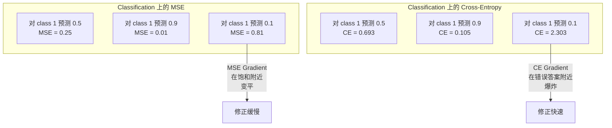
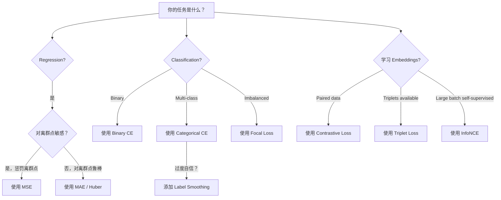
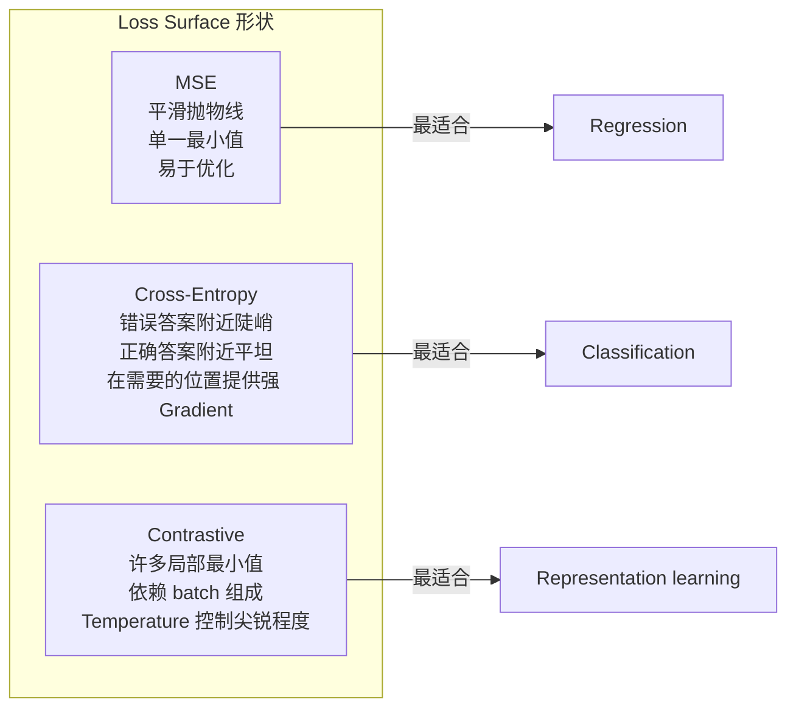

# 损失功能

> 你的神经网络做了一个预测.基础真理却给出了不同的答案.它错误了.

**Type:** Build
**Languages:** Python
**Prerequisites:** Lesson 03.04 (Activation Functions)
**Time:** ~75 minutes

## 学习目标

- 从零实现MSE,二进制交叉,类交叉和对比损失 (InfoNCE),以及它们的渐进
- 通过演示对所有样本都预测0.5的失败模式,解释为什么MSE不适合分类
- 将标签滑滑 应用于跨,并描述它如何防止过度自信预测
- 为回归,二进制分类,多类分类和嵌入学习任务选择正确的损失函数

## 问题

在分类问题上,最小化MSE的模型,对所有东西都很自信预测0.5――它确实在最小化损失――但它也完全没有用――

损失函数是模型实际优化的唯一对象――不是精度――不是F1分数――也不是你汇报给经理的任何指标――优化器会取损失函数的梯度,并调整权重来让这个数字变小――如果损失函数没有捕捉到你真正关心的东西,模型就会找到数学上最低成本的方式来满足它,而这种方式几乎永远不是你想要的――

这里有一个具体例子――你有一个二进制分类任务――两个类别,50/50 分布――你使用MSE 作为损失――模型对每一个输入都预测0.5――平均MSE是0.25,这是在任何未学到的情况下可能达到的最小值――这个模型没有任何判断能力,但从技术上说它已经最小化了你的损失函数――换成交叉化后,同一个模型将被迫推向预测到0或1,因为 - (log0.5) =0.693是非常糟糕的损失,而 -log(0.99) =0.01 会奖励自信和正确的预测――损失函数的选择,就是学习模型和钻探测量空子模型之间的区别――

情况也会更糟. 在自主监督学习中,你甚至没有标签. 矛盾损失完全定义了学习信号:什么算相似,什么算不同,以及模型应该多用力分开它们.

## 概念

### 平均平方错误 (MSE)

逆转的默认选择――计算预测值和目标值之间的差异的平方,并对所有样本进行平均――

```
MSE = (1/n) * sum((y_pred - y_true)^2)
```

为什么平方很重要:它会以第二种方式惩罚大错误――错误为2的价格是1的4倍――错误为10的价格是100倍――这使得MSE对离群点敏感――一个极端错误的预测会主导亏损――

真正数字:如果你的模型预测房价,$10,000，但对一栋豪宅偏差 $其他99套房子的性能可能会受到损害.

预测值的基准是:

```
dMSE/dy_pred = (2/n) * (y_pred - y_true)
```

对于归根是特征,对分类是问题,你希望对自信但错误的答案进行指数级惩罚,而不是线性惩罚.

### 交叉缩损失

归类的损失函数――它源于信息论-- 衡量预测概率分布与实际分布之间的差异――

**Binary Cross-Entropy (BCE):**

```
BCE = -(y * log(p) + (1 - y) * log(1 - p))
```

其中 y 是真实标签 ((0 或 1),p 是预测概率──

为什么 -log(p) 有效:当真标签是1 且你预测 p = 0.99 时,Loss 是 -log(0.99) = 0.01。当你预测 p = 0.01 时,Loss 是 -log(0.01) = 4.6。这个460 倍的差异是交叉化 有效的原因──它会严厉惩罚自信但错误的预测,同时几乎不惩罚自信且正确的预测────

渐进讲述是同一个故事:

```
dBCE/dp = -(y/p) + (1-y)/(1-p)
```

当 y = 1 且 p 接近零时,梯度是 -1/p,会向负无穷――模型会得到一个巨大的信号来修复错误――当 p 接近 1 时,梯度是很小――已经正确了,不需要修改――

**Categorical Cross-Entropy:**

用于一个热码目标的多类分类.

```
CCE = -sum(y_i * log(p_i))
```

只有真实类别会贡献损失(因为其他所有类别都是零) ⋅如果有10个类别,正确类别得到的概率是0.1(随机猜测),Loss是 -log(0.1) =2.3──如果正确类别得到的概率是0.9,Loss是 -log(0.9) =0.105──模型会学习把概率质量集中到正确答案上──

### 为什么MSE不适合分类



当预测接近0或1时,MSE渐变会平面 (由于sigmoid 和) ――横向缩的渐变会补偿这一点 - - 抵消了sigmoid 的平面区域,在最需要的位置给出强大的渐变――

### 标签滑滑

标准一个热标签会说这是100%的3级,其他类别都是0%――这是一个很强的断言――标签滑滑会软化它:

```
smooth_label = (1 - alpha) * one_hot + alpha / num_classes
```

当alpha = 0.1 且有10个类别时:目标不再是 [0, 0, 1, 0, ...],而是 [0.01, 0.01, 0.91, 0.01,...]──模型的目标是0.91,而不是1.0──

为什么这有效:一个试图通过软max 输出精确的 1.0 模型,需要把逻辑推向无穷. 这会导致过度自信,损害泛化能力,并使模型对分布偏移变得脆弱.

### 显著损失

没有标签.没有类型. 只有输入对和一个问题:它们相似还是不同?

**SimCLR-style contrastive loss (NT-Xent / InfoNCE):**

取一张图像──创建它的两个增强视图作物,旋转,色彩)──它们是正对 - 它们应该有相似的嵌入式──每批中其他图像都会形成一个负对 - 它们应该有不同的嵌入式──

```
L = -log(exp(sim(z_i, z_j) / tau) / sum(exp(sim(z_i, z_k) / tau)))
```

其中的 sim() 是共数相似性,z_i 和 z_j 是正对,求和覆盖所有负面,tau (温度) 控制分布的尖程度──更低的温度 = 更难的负面 = 更激进的分离──

真实数字:批量大小 256 意思是每个正对有 255 个负面点.

**Triplet Loss:**

接收三个输入:,正面,同类,负面,不同类别.

```
L = max(0, d(anchor, positive) - d(anchor, negative) + margin)
```

强制正和负之间的距离是最小的间隔. 如果负已经足够远,损失就是零.

### 焦点损失

用于不平衡数据集.标准跨化会同等对待所有正确分类的样本.

```
FL = -alpha * (1 - p_t)^gamma * log(p_t)
```

其中p_t 是真实类别的预测概率,gamma 控制聚焦程度──当gamma = 0时,这就是标准的跨化──当gamma = 2时:

- 简单的例子 (p_t = 0.9):重量 = (0.1) ^2 = 0.01──基本被忽略──
- 硬实例 (p_t = 0.1):重量 = (0.9) ^2 = 0.81──完整的渐变信号──

临等提出,用于对象检测,其中99%的候选区域都是背景 (简单的负面) ⋅没有焦点损失时,模型会淹没在简单的背景示例中,永远不会检测物体――有它,模型将将容量集中在真正重要的困难、模糊样本上――

### 损失函数 决策树



### 失景




```figure
cross-entropy-loss
```

## 构建它

### 步骤1:MSE 及其渐进

```python
def mse(predictions, targets):
    n = len(predictions)
    total = 0.0
    for p, t in zip(predictions, targets):
        total += (p - t) ** 2
    return total / n

def mse_gradient(predictions, targets):
    n = len(predictions)
    grads = []
    for p, t in zip(predictions, targets):
        grads.append(2.0 * (p - t) / n)
    return grads
```

### 步骤2:二进制交叉

问题是真实存在的. 如果模型对一个积极的例子 精确预测 0,log(0) =负无穷.

```python
import math

def binary_cross_entropy(predictions, targets, eps=1e-15):
    n = len(predictions)
    total = 0.0
    for p, t in zip(predictions, targets):
        p_clipped = max(eps, min(1 - eps, p))
        total += -(t * math.log(p_clipped) + (1 - t) * math.log(1 - p_clipped))
    return total / n

def bce_gradient(predictions, targets, eps=1e-15):
    grads = []
    for p, t in zip(predictions, targets):
        p_clipped = max(eps, min(1 - eps, p))
        grads.append(-(t / p_clipped) + (1 - t) / (1 - p_clipped))
    return grads
```

### 步骤3: 带软max 的类别交叉透

软max 将原始的记录转换为概率.

```python
def softmax(logits):
    max_val = max(logits)
    exps = [math.exp(x - max_val) for x in logits]
    total = sum(exps)
    return [e / total for e in exps]

def categorical_cross_entropy(logits, target_index, eps=1e-15):
    probs = softmax(logits)
    p = max(eps, probs[target_index])
    return -math.log(p)

def cce_gradient(logits, target_index):
    probs = softmax(logits)
    grads = list(probs)
    grads[target_index] -= 1.0
    return grads
```

对于真类,它只是一个预测概率 - 1),对所有其他类,它只是一个预测概率.

### 步骤 4:标签滑滑

```python
def label_smoothed_cce(logits, target_index, num_classes, alpha=0.1, eps=1e-15):
    probs = softmax(logits)
    loss = 0.0
    for i in range(num_classes):
        if i == target_index:
            smooth_target = 1.0 - alpha + alpha / num_classes
        else:
            smooth_target = alpha / num_classes
        p = max(eps, probs[i])
        loss += -smooth_target * math.log(p)
    return loss
```

### 步骤5:对比损失 (简化版 InfoNCE)

```python
def cosine_similarity(a, b):
    dot = sum(x * y for x, y in zip(a, b))
    norm_a = math.sqrt(sum(x * x for x in a))
    norm_b = math.sqrt(sum(x * x for x in b))
    if norm_a < 1e-10 or norm_b < 1e-10:
        return 0.0
    return dot / (norm_a * norm_b)

def contrastive_loss(anchor, positive, negatives, temperature=0.07):
    sim_pos = cosine_similarity(anchor, positive) / temperature
    sim_negs = [cosine_similarity(anchor, neg) / temperature for neg in negatives]

    max_sim = max(sim_pos, max(sim_negs)) if sim_negs else sim_pos
    exp_pos = math.exp(sim_pos - max_sim)
    exp_negs = [math.exp(s - max_sim) for s in sim_negs]
    total_exp = exp_pos + sum(exp_negs)

    return -math.log(max(1e-15, exp_pos / total_exp))
```

### 步骤 6: 类别上层的MSE与跨

使用两种损失函数 训练课 04 中 中的同一个神经网络 (同一个神经网络) 圆数据集) ⋅观察交叉化 收得更快──

```python
import random

def sigmoid(x):
    x = max(-500, min(500, x))
    return 1.0 / (1.0 + math.exp(-x))

def make_circle_data(n=200, seed=42):
    random.seed(seed)
    data = []
    for _ in range(n):
        x = random.uniform(-2, 2)
        y = random.uniform(-2, 2)
        label = 1.0 if x * x + y * y < 1.5 else 0.0
        data.append(([x, y], label))
    return data


class LossComparisonNetwork:
    def __init__(self, loss_type="bce", hidden_size=8, lr=0.1):
        random.seed(0)
        self.loss_type = loss_type
        self.lr = lr
        self.hidden_size = hidden_size

        self.w1 = [[random.gauss(0, 0.5) for _ in range(2)] for _ in range(hidden_size)]
        self.b1 = [0.0] * hidden_size
        self.w2 = [random.gauss(0, 0.5) for _ in range(hidden_size)]
        self.b2 = 0.0

    def forward(self, x):
        self.x = x
        self.z1 = []
        self.h = []
        for i in range(self.hidden_size):
            z = self.w1[i][0] * x[0] + self.w1[i][1] * x[1] + self.b1[i]
            self.z1.append(z)
            self.h.append(max(0.0, z))

        self.z2 = sum(self.w2[i] * self.h[i] for i in range(self.hidden_size)) + self.b2
        self.out = sigmoid(self.z2)
        return self.out

    def backward(self, target):
        if self.loss_type == "mse":
            d_loss = 2.0 * (self.out - target)
        else:
            eps = 1e-15
            p = max(eps, min(1 - eps, self.out))
            d_loss = -(target / p) + (1 - target) / (1 - p)

        d_sigmoid = self.out * (1 - self.out)
        d_out = d_loss * d_sigmoid

        for i in range(self.hidden_size):
            d_relu = 1.0 if self.z1[i] > 0 else 0.0
            d_h = d_out * self.w2[i] * d_relu
            self.w2[i] -= self.lr * d_out * self.h[i]
            for j in range(2):
                self.w1[i][j] -= self.lr * d_h * self.x[j]
            self.b1[i] -= self.lr * d_h
        self.b2 -= self.lr * d_out

    def compute_loss(self, pred, target):
        if self.loss_type == "mse":
            return (pred - target) ** 2
        else:
            eps = 1e-15
            p = max(eps, min(1 - eps, pred))
            return -(target * math.log(p) + (1 - target) * math.log(1 - p))

    def train(self, data, epochs=200):
        losses = []
        for epoch in range(epochs):
            total_loss = 0.0
            correct = 0
            for x, y in data:
                pred = self.forward(x)
                self.backward(y)
                total_loss += self.compute_loss(pred, y)
                if (pred >= 0.5) == (y >= 0.5):
                    correct += 1
            avg_loss = total_loss / len(data)
            accuracy = correct / len(data) * 100
            losses.append((avg_loss, accuracy))
            if epoch % 50 == 0 or epoch == epochs - 1:
                print(f"    Epoch {epoch:3d}: loss={avg_loss:.4f}, accuracy={accuracy:.1f}%")
        return losses
```

## 使用它

PyTorch 提供了所有标准损失函数,并内置了数值稳定性:

```python
import torch
import torch.nn as nn
import torch.nn.functional as F

predictions = torch.tensor([0.9, 0.1, 0.7], requires_grad=True)
targets = torch.tensor([1.0, 0.0, 1.0])

mse_loss = F.mse_loss(predictions, targets)
bce_loss = F.binary_cross_entropy(predictions, targets)

logits = torch.randn(4, 10)
labels = torch.tensor([3, 7, 1, 9])
ce_loss = F.cross_entropy(logits, labels)
ce_smooth = F.cross_entropy(logits, labels, label_smoothing=0.1)
```

使用 `F.cross_entropy`(而不是`F.nll_loss`加手动软max) ・它将记录软max 和负记录概率合并为一个数值稳定的操作――先单独应用软max 再取记录稳定性更差――在大指数的相减中会丢失精度――

对于对比性学习,大多数团队都会使用自定义实现,或使用`lightly`,我知道.`pytorch-metric-learning`这样库――核心循环始终相同:计算成对相似度,基于积极和负面 创建软max,然后后扩散――

## 交付它

本课会产出:
- `outputs/prompt-loss-function-selector.md`-- 一个可复用提示,用于选择正确的损失函数
- `outputs/prompt-loss-debugger.md`曲线看起来不对的情况

## 练习

1. 实现Huber损失 (滑 L1损失),它对小误差使用MSE,对大误差使用MAE──训练一个回归神经网络 来预测 y = sin(x),并在5%的训练目标被加入随机噪声(离群点)的情况下比较MSE与Huber──比较最终测试误差──

2. 将焦点损失 加入二进制分类 训练循环中――创建一个不平衡数据集――90%类 0.10%类 1)――比较标准 BCE 与焦点损失 (gamma=2) 在200个时代后对少数类的回忆――

3. 实现带半硬负矿的三分之一损失――为 5 个类别生成 2D 嵌入 数据――对每个,找到仍然比正面更远的最难负面(半硬) ─将收情况与随机三分之一选择进行比较――

4. 运行MSE对交叉透比较,但在训练期间跟踪每层的透大小――绘制每个时代的平均透标准――验证在模型最不确定的早期时代中,交叉透会产生更大的透――

5. 实现 KL分离损失并验证当真实分布是单热时,最小化 KL(真实的输出预测) 将给与交叉相似的基准――然后尝试软目标――如知识蒸),其中真实分布来自教师模型的软max输出――

## 关键术语

| Term | 人们常说的说法 | 它实际意味着什么 |
|------|----------------|----------------------|
| Loss function | “模型错得有多离谱” | 一个可微函数，将预测和目标映射到 Optimizer 要最小化的标量 |
| MSE | “平均平方误差” | 预测和目标之间平方差的均值；以二次方式惩罚大误差 |
| Cross-entropy | “Classification 的 Loss” | 使用 -log(p) 衡量预测概率分布和真实分布之间的差异 |
| Binary cross-entropy | “BCE” | 两个类别的 cross-entropy：-(y*log(p) + (1-y)*log(1-p)) |
| Label smoothing | “软化目标” | 用软值（例如 0.1/0.9）替换硬 0/1 目标，以防止过度自信并提升泛化能力 |
| Contrastive loss | “拉近，推远” | 一种通过让相似对在 Embedding 空间中更近、非相似对更远来学习表示的 Loss |
| InfoNCE | “CLIP/SimCLR Loss” | 对相似度分数进行 normalized temperature-scaled cross-entropy；将 contrastive learning 视为 Classification |
| Focal loss | “不平衡数据修复方案” | 用 (1-p_t)^gamma 加权的 cross-entropy，用于降低 easy examples 的权重并聚焦 hard examples |
| Triplet loss | “Anchor-positive-negative” | 在 Embedding 空间中，使 anchor 比 negative 至少按一个 margin 更接近 positive |
| Temperature | “尖锐度旋钮” | 作用在 logits/相似度上的标量除数，用于控制结果分布的峰值程度；越低越尖锐 |

## 延伸阅读

- 林等人",密集物体检测的焦点损失" (2017) -- 引入焦点损失,用于处理物体检测 中的极端类别不平衡(RetinaNet)
- 陈等人",视觉表示对比性学习的简单框架" (SimCLR, 2020) -- 使用NT-Xent损失 定义了现代对比性学习流程
- 谢格迪等人",重新思考创始架构" (2016) -- 引入标签滑滑作为正则化技术,如今已成为大多数大模型的标准做法
- 希顿等人",神经网络中知识分离" (2015) -- 使用软目标和KL分离的知识分离,是模型压缩的基础
