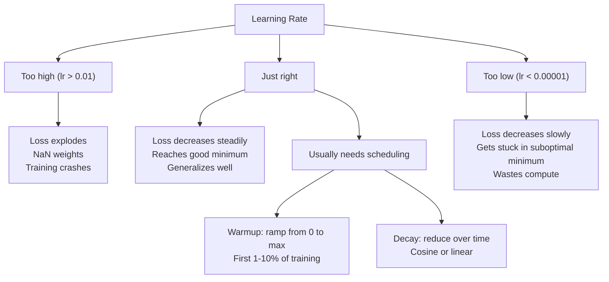
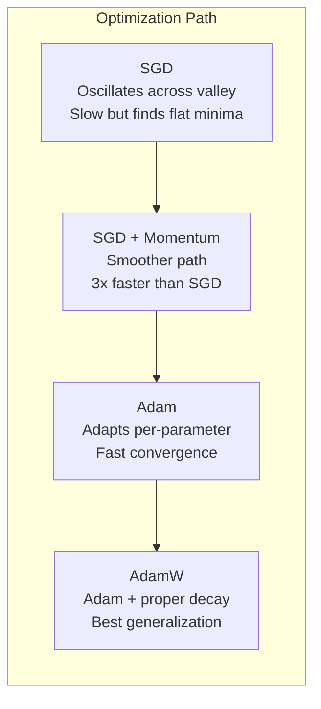
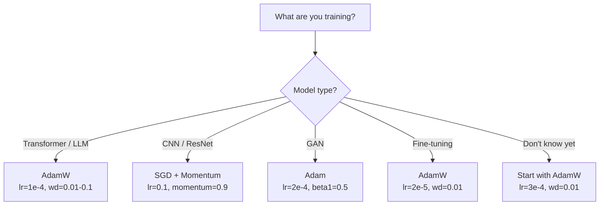

# 优化器

> 渐进式下降告诉你要走哪个方向. 它没有说明要走多远,也没有说明要走多快.

**Type:** Build
**Languages:** Python
**Prerequisites:** Lesson 03.05 (Loss Functions)
**Time:** ~75 minutes

## 学习目标

- 通过Python从零实现SGD、带动的SGD、亚当和亚当W优化器
- 解释亚当的偏差纠正 如何补偿训练早期步骤中到零初始化的时刻估计
- 展示为什么在同一任务上,AdamW比带有L2规律化的Adam具有更好的泛化能力
- 选择适合优化器和默认超参数

## 问题

你已经计算了渐进. 你知道第 4,721 个权重应该减少 0.003 才能减少损失. 但 0.003 的单位是什么?按什么缩小?第 1 步和第 1,000 步应该移动同样的量吗?

基梯次降在每一步对每个参数 应用相同的学习速度:w = w - lr *梯次――这会产生三个问题,让训练神经网络在实践中变得非常痛苦――

第一,振荡――失景 很少像平滑的碗――它更像一条又长又窄的山谷――渐进指向穿越山谷的方向 (方向),而不是沿着山谷的方向 (平方向)――渐进下降会在狭小维度上跳跃回来,而在真正有用的方向上进展很小――你已经看到这种现象:失败先快速下降,然后进入平台期,不是因为模型已经收到了,而是因为它在振荡――

第二,对所有参数使用相同的学习率是错误的.有些重量需要大幅更新.

第三,车点――在高维空间中,失景区存在大片平坦区域,其中的梯度接近零――瓦尼拉 SGD 将以梯度速度爬过这些区域,而这个速度实际上接近零――模型看起来卡住了――它没有卡住――它处于平坦区域,另一边还有有用的下降方向――但 SGD 没有推动它穿过该区域的机制――

亚当解决了这三个问题. 它为每个参数维护了两个运行平均值 - 平均梯度,处理振荡) 和平均平方梯度 (适应率,处理不同尺度) 再结合前几步的偏差纠正,它提供了一个使用默认的超参数,可以处理80%的问题的单一优化器. 本课程将从零构建它,让你准确理解它在另外20%的场景中何时以及为什么会失败.

## 概念

### 缩率下降 (SGD)

最简单的优化器――在小批量上计算的渐变,并朝相反方向前进一步――

```
w = w - lr * gradient
```

stochastic 表示你使用数据的随机集 (迷你批量) 来估计渐进率,而不是使用完整的数据集.

训练将耗费极长时间. 最优值取决于架构,数据,批量,以及当前的训练阶段.

### 动力

小球滚下山坡的比率被用得太多,但它是准确的――你不仅按进步梯度,而是保持一个速度,用来积累过去的梯度――

```
m_t = beta * m_{t-1} + gradient
w = w - lr * m_t
```

贝塔通常为0.9) 控制保留多少历史信息──当贝塔 =0.9时,momentum 大致等于最近10个梯度的平均值──1/ (1 - 0.9) = 10)──

为什么这能修复振荡:指向相同方向的梯度会积累――方向反复翻转的梯度会相互抵消――在那条狭窄山谷中,横穿分量每一步都会变号并减弱――沿着分量保持一致并被放大――结果是有用方向平滑加速――

真实数字:在非常差的损失环境上,单独使用SGD可能需要10,000步.带动的SGD(beta=0.9) 在同一问题上通常需要3,000-5,000步.

### 标

第一个真正有效的每参数适应性学习率方法. 由Hinton 在课程中提出.

```
s_t = beta * s_{t-1} + (1 - beta) * gradient^2
w = w - lr * gradient / (sqrt(s_t) + epsilon)
```

随着二次梯度的运行平均水平――持续拥有较大的梯度的参数将以较大的数量 (更小的有效学习率) 计算――较小的梯度将以较小的数量 (更大的有效学习率) 计算――

这解决了所有参数使用相同的学习速度问题――一个已经持续获得大幅更新的体重 很可能接近目标―― 放缓它――一个一直得到很小的更新的体重 可能缺乏训练―― 加快它――

子通常为1e-8) 将在某个参数中 没有更新时防止除以零.

### 动力+RMSProp

亚当结合了两种思想. 它为每个参数维护两个指数动平均值:

```
m_t = beta1 * m_{t-1} + (1 - beta1) * gradient        (first moment: mean)
v_t = beta2 * v_{t-1} + (1 - beta2) * gradient^2       (second moment: variance)
```

**Bias correction**是大多数解释会跳过的关键细节──在第1步,m_1 = (1 - beta1) *梯度──当beta1 = 0.9 时,它是0.1 *梯度── 小了十倍──移动平均还没有预热──偏差纠正会进行补偿:

```
m_hat = m_t / (1 - beta1^t)
v_hat = v_t / (1 - beta2^t)
```

第1步且beta1 = 0.9 时:m_hat = m_1 / (1 - 0.9) = m_1 / 0.1 = 实际梯度. 第100步时:(1 - 0.9^100) 约等于1.0,因此纠正消失.

更新公式:

```
w = w - lr * m_hat / (sqrt(v_hat) + epsilon)
```

亚当默认值:lr = 0.001,beta1 = 0.9,beta2 = 0.999,epsilon = 1e-8──这些默认值适用于80%的问题──当它们不适用时,先改l──然后改beta2──几乎永远不要改beta1或epsilon──

### 现在,我们需要一个人来看看.

在瓦尼莉 SGD 中,这等于减肥的位,在亚当中,这种等价关系会失效.

洛希洛夫和哈特的洞见是:当你把L2加到损失中,然后让亚当处理渐进时,适应性学习率也会缩小调整术语――渐进变量大参数得到更少的调整――变量小参数得到更多――这不是你想要的――你想要的不是依赖于渐进统计的统一调整――

通过亚当更新后直接对体重进行减肥来修复这个问题:

```
w = w - lr * m_hat / (sqrt(v_hat) + epsilon) - lr * lambda * w
```

减肥的术语 (lr * lambda * w) 不被亚当的适应因素缩放.

这看起来像一个小细节――不是――亚当W 在几乎所有任务都会比亚当+L2规范化 收到更好的解答――它是 PyTorch 中用于训练变压器,扩散模型和大多数现代建筑的默认优化器――BERT、GPT、LLaMA、稳定扩散―― 都是用亚当W 训练的――

### 学习率:最重要的超参数



如果你只调整一个超参数,那就调整学习率.学习率发生了10倍的变化,比你做出的任何架构都更重要.

- 清算量: lr = 0.01 至 0.1
- 亚当/亚当W: lr = 1e-4到 3e-4
- 精细调节预训练的模型:lr = 1e-5至 5e-5
- 学习速度升温: 在前1-10%的步骤中线性

### 优化对比



### 每种优化器何时胜出




```figure
optimizer-trajectory
```

## 构建它

### 步骤1:瓦尼拉 SGD

```python
class SGD:
    def __init__(self, lr=0.01):
        self.lr = lr

    def step(self, params, grads):
        for i in range(len(params)):
            params[i] -= self.lr * grads[i]
```

### 步骤2:带动力的 SGD

```python
class SGDMomentum:
    def __init__(self, lr=0.01, beta=0.9):
        self.lr = lr
        self.beta = beta
        self.velocities = None

    def step(self, params, grads):
        if self.velocities is None:
            self.velocities = [0.0] * len(params)
        for i in range(len(params)):
            self.velocities[i] = self.beta * self.velocities[i] + grads[i]
            params[i] -= self.lr * self.velocities[i]
```

### 步骤3:亚当

```python
import math

class Adam:
    def __init__(self, lr=0.001, beta1=0.9, beta2=0.999, epsilon=1e-8):
        self.lr = lr
        self.beta1 = beta1
        self.beta2 = beta2
        self.epsilon = epsilon
        self.m = None
        self.v = None
        self.t = 0

    def step(self, params, grads):
        if self.m is None:
            self.m = [0.0] * len(params)
            self.v = [0.0] * len(params)

        self.t += 1

        for i in range(len(params)):
            self.m[i] = self.beta1 * self.m[i] + (1 - self.beta1) * grads[i]
            self.v[i] = self.beta2 * self.v[i] + (1 - self.beta2) * grads[i] ** 2

            m_hat = self.m[i] / (1 - self.beta1 ** self.t)
            v_hat = self.v[i] / (1 - self.beta2 ** self.t)

            params[i] -= self.lr * m_hat / (math.sqrt(v_hat) + self.epsilon)
```

### 步骤4:亚当W

```python
class AdamW:
    def __init__(self, lr=0.001, beta1=0.9, beta2=0.999, epsilon=1e-8, weight_decay=0.01):
        self.lr = lr
        self.beta1 = beta1
        self.beta2 = beta2
        self.epsilon = epsilon
        self.weight_decay = weight_decay
        self.m = None
        self.v = None
        self.t = 0

    def step(self, params, grads):
        if self.m is None:
            self.m = [0.0] * len(params)
            self.v = [0.0] * len(params)

        self.t += 1

        for i in range(len(params)):
            self.m[i] = self.beta1 * self.m[i] + (1 - self.beta1) * grads[i]
            self.v[i] = self.beta2 * self.v[i] + (1 - self.beta2) * grads[i] ** 2

            m_hat = self.m[i] / (1 - self.beta1 ** self.t)
            v_hat = self.v[i] / (1 - self.beta2 ** self.t)

            params[i] -= self.lr * m_hat / (math.sqrt(v_hat) + self.epsilon)
            params[i] -= self.lr * self.weight_decay * params[i]
```

### 步骤5: 训练对比

在第05课中,使用全部四种优化器训练同一个双层网络.

```python
import random

def sigmoid(x):
    x = max(-500, min(500, x))
    return 1.0 / (1.0 + math.exp(-x))

def make_circle_data(n=200, seed=42):
    random.seed(seed)
    data = []
    for _ in range(n):
        x = random.uniform(-2, 2)
        y = random.uniform(-2, 2)
        label = 1.0 if x * x + y * y < 1.5 else 0.0
        data.append(([x, y], label))
    return data


class OptimizerTestNetwork:
    def __init__(self, optimizer, hidden_size=8):
        random.seed(0)
        self.hidden_size = hidden_size
        self.optimizer = optimizer

        self.w1 = [[random.gauss(0, 0.5) for _ in range(2)] for _ in range(hidden_size)]
        self.b1 = [0.0] * hidden_size
        self.w2 = [random.gauss(0, 0.5) for _ in range(hidden_size)]
        self.b2 = 0.0

    def get_params(self):
        params = []
        for row in self.w1:
            params.extend(row)
        params.extend(self.b1)
        params.extend(self.w2)
        params.append(self.b2)
        return params

    def set_params(self, params):
        idx = 0
        for i in range(self.hidden_size):
            for j in range(2):
                self.w1[i][j] = params[idx]
                idx += 1
        for i in range(self.hidden_size):
            self.b1[i] = params[idx]
            idx += 1
        for i in range(self.hidden_size):
            self.w2[i] = params[idx]
            idx += 1
        self.b2 = params[idx]

    def forward(self, x):
        self.x = x
        self.z1 = []
        self.h = []
        for i in range(self.hidden_size):
            z = self.w1[i][0] * x[0] + self.w1[i][1] * x[1] + self.b1[i]
            self.z1.append(z)
            self.h.append(max(0.0, z))

        self.z2 = sum(self.w2[i] * self.h[i] for i in range(self.hidden_size)) + self.b2
        self.out = sigmoid(self.z2)
        return self.out

    def compute_grads(self, target):
        eps = 1e-15
        p = max(eps, min(1 - eps, self.out))
        d_loss = -(target / p) + (1 - target) / (1 - p)
        d_sigmoid = self.out * (1 - self.out)
        d_out = d_loss * d_sigmoid

        grads = [0.0] * (self.hidden_size * 2 + self.hidden_size + self.hidden_size + 1)
        idx = 0
        for i in range(self.hidden_size):
            d_relu = 1.0 if self.z1[i] > 0 else 0.0
            d_h = d_out * self.w2[i] * d_relu
            grads[idx] = d_h * self.x[0]
            grads[idx + 1] = d_h * self.x[1]
            idx += 2

        for i in range(self.hidden_size):
            d_relu = 1.0 if self.z1[i] > 0 else 0.0
            grads[idx] = d_out * self.w2[i] * d_relu
            idx += 1

        for i in range(self.hidden_size):
            grads[idx] = d_out * self.h[i]
            idx += 1

        grads[idx] = d_out
        return grads

    def train(self, data, epochs=300):
        losses = []
        for epoch in range(epochs):
            total_loss = 0.0
            correct = 0
            for x, y in data:
                pred = self.forward(x)
                grads = self.compute_grads(y)
                params = self.get_params()
                self.optimizer.step(params, grads)
                self.set_params(params)

                eps = 1e-15
                p = max(eps, min(1 - eps, pred))
                total_loss += -(y * math.log(p) + (1 - y) * math.log(1 - p))
                if (pred >= 0.5) == (y >= 0.5):
                    correct += 1
            avg_loss = total_loss / len(data)
            accuracy = correct / len(data) * 100
            losses.append((avg_loss, accuracy))
            if epoch % 75 == 0 or epoch == epochs - 1:
                print(f"    Epoch {epoch:3d}: loss={avg_loss:.4f}, accuracy={accuracy:.1f}%")
        return losses
```

## 使用它

光电优化器 会处理参数组,渐进式剪辑和学习速度规划:

```python
import torch
import torch.optim as optim

model = torch.nn.Sequential(
    torch.nn.Linear(784, 256),
    torch.nn.ReLU(),
    torch.nn.Linear(256, 10),
)

optimizer = optim.AdamW(model.parameters(), lr=3e-4, weight_decay=0.01)

scheduler = optim.lr_scheduler.CosineAnnealingLR(optimizer, T_max=100)

for epoch in range(100):
    optimizer.zero_grad()
    output = model(torch.randn(32, 784))
    loss = torch.nn.functional.cross_entropy(output, torch.randint(0, 10, (32,)))
    loss.backward()
    torch.nn.utils.clip_grad_norm_(model.parameters(), max_norm=1.0)
    optimizer.step()
    scheduler.step()
```

模式始终是:零_grad、前进、损失、后退、 片) 、步、 时间表) 。记住这个顺序──弄错它──例如在优化器.步.

对于CNN,许多实践者仍然偏好使用带动的 SGD ((lr=0.1,momentum=0.9,weight_decay=1e-4),并搭配步骤或宇宙时间表――SGD会找到更平坦的最小值,而这通常具有更好的泛化能力――对于变压器和LLM,带动加热+宇宙衰退的AdamW是通用的默认选择――除非有经过测量理由,否则不要和共识对抗――

## 交付它

本课产出:
- `outputs/prompt-optimizer-selector.md`-- 一个用于任意架构的选择正确优化和学习率的决策提示

## 练习

1. 实现Nesterov动力,其中你在 lookhead 位置 (w - lr * beta * v) 而不是当前位置计算的梯度.

2. 实现学习率升温时间表:在训练前10%的步骤中从0 线性拉普到max_lr,然后到0 时代的宇宙衰退.

3. 在亚当训练期间跟踪每个参数的有效学习率──有效率是 lr * m_hat / (sqrt(v_hat) + eps) ─绘制第 10、50 和200步后有效率的分布──所有参数都以相同的速度更新吗?

4. 实现梯度剪辑 (按全球标准剪辑) 〔将最大梯度标准设为1.0〕使用较高的学习率〔亚当的lr=0.01) 分别在有剪辑和无剪辑的情况下训练〔统计〕 10个随机种子中,有多少次运行 会发散〔 损失变为 NaN〕。

5. 在一个具有大重量的网络上比较亚当与亚当W──将所有重量初始化为 [-5, 5] 中的随机值(远大于正常值)──使用重量_衰减=0.1 训练200个时代──绘制两个优化器──训练过程中重量的L2规范──亚当W应显示更快的重量缩小──

## 关键术语

| Term | 人们通常怎么说 | 它实际意味着什么 |
|------|----------------|----------------------|
| Learning rate | “Step size” | Gradient update 上的标量乘数；训练中影响最大的单个 hyperparameter |
| SGD | “Basic gradient descent” | Stochastic Gradient Descent：通过减去 lr * gradient 来更新 weights，Gradient 在 mini-batch 上计算 |
| Momentum | “Rolling ball analogy” | 过去 Gradients 的 exponential moving average；削弱振荡，并加速一致方向 |
| RMSProp | “Adaptive learning rate” | 用近期 Gradients 的 running RMS 除以每个 parameter 的 Gradient；均衡 learning rates |
| Adam | “The default optimizer” | 将 momentum（first moment）和 RMSProp（second moment）结合起来，并对初始 steps 进行 bias correction |
| AdamW | “Adam done right” | 带 decoupled weight decay 的 Adam；直接对 weights 应用 regularization，而不是通过 Gradient |
| Bias correction | “Warmup for running averages” | 除以 (1 - beta^t)，用于补偿 Adam 的 moment estimates 的零初始化 |
| Weight decay | “Shrink the weights” | 每一步减去 weight 值的一部分；一种惩罚大 weights 的 regularizer |
| Learning rate schedule | “Changing lr over time” | 在训练期间调整 learning rate 的函数；warmup + cosine decay 是现代默认方案 |
| Gradient clipping | “Capping the gradient norm” | 当 Gradient Vector 的 norm 超过阈值时对其进行缩放；防止 exploding gradient updates |

## 延伸阅读

- 亚当:一种方法来实现斯托卡斯式优化 (2014) -- 原始亚当论文,包含融合分析和偏见纠正推导
- 洛希洛夫和哈特, 脱节体重减肥规范化 (2017) -- 证明在亚当中L2规范化与体重减肥不等价,并提出亚当W
- 史密斯, 神经网络培训周期性学习率 (2017) -- 引入 LR范围测试和周期性时间表,减少调整定制学习率的需求
- 鲁德,  渐进式下降优化算法的概述 (2016) 关于所有优化器 变体的最佳单篇综述,比较清晰,直觉解释也明确
