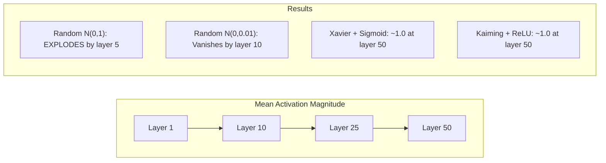
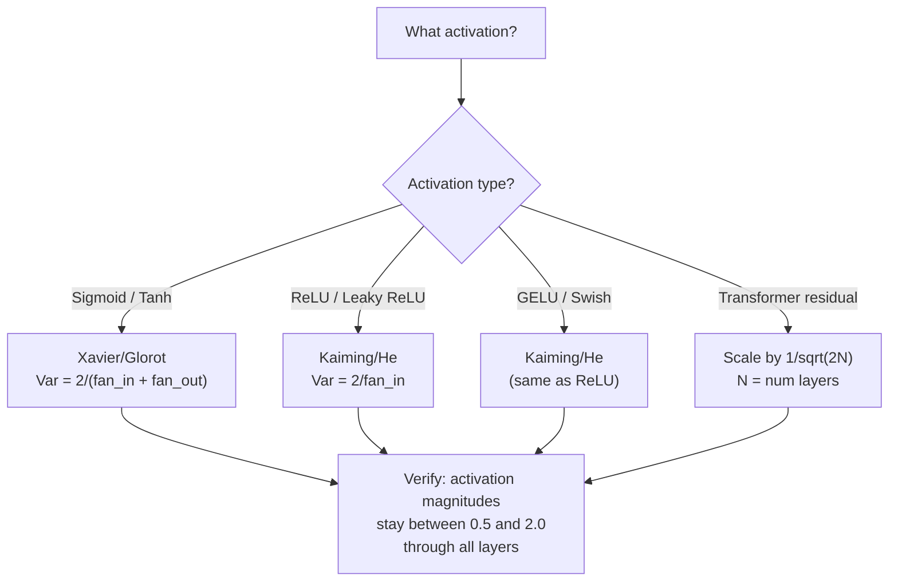

# 体重初始化与训练稳定性

> 开始就错了,训练根本无法开始.

**Type:** Build
**Languages:** Python
**Prerequisites:** Lesson 03.04 (Activation Functions), Lesson 03.07 (Regularization)
**Time:** ~90 minutes

## 学习目标
- 实现零、随机、Xavier/Glorot 和 Kaiming/He初始化 策略,并测量它们对50层中激活幅度的影响
- 推导为什么Xavier init 使用Var(w) = 2/(fan_in + fan_out),而Kaiming 使用Var(w) = 2/fan_in
- 演示零初始化的对称性问题,并解释为什么仅靠随机尺度还不够
- 将正确的初始化 策略匹配到激活函数:sigmoid/tanh 使用Xavier,ReLU/GELU 使用Kaiming

## 问题
把所有的重量都初始化为零──一切都学不到──每个神经元都计算出相同的函数,接收相同的分数,并以相同的方式更新──经过10,000个时代之后,你的512神经元隐藏层仍然只是同一个神经元的512个副本──你为512个参数付出了成本,但只得到1个──

它们开始太大了―― 激活会在整个网络中爆炸――到10层,数值达到1e15――到20层,它们溢出无限―― 渐变会沿着反向走同样的轨迹――

从标准正常分布中随机初始化――对3层有效――到50层,信号会缩为零,或者爆炸到无限,取决于随机规模是略小还是略大――能工作和崩之间的边界极其狭窄――

权重初始化是深度学习中最被低估的决策――建筑会有论文――优化者会有博客文章――初始化通常只得到一个脚注――但如果在这里错了,其他一切都不重要――你的网络在训练开始之前就已经死了――

## 概念
### 象征问题

一层中每个神经元都具有相同的结构:使用重量乘以输入,加上偏差,应用激活.如果所有重量都从相同的值开始,每个神经元都会计算相同的输出.

你被卡住了.网络有数百个参数,但它们都同步移动. 这被称为对称性,而随机初始化是打破它的暴力方法. 每个神经元都从重量空间中的不同位置开始,因此每个神经元都会学习不同的特征.

但随机还不够.随机性的规模决定了网络是否能训练.

### 通过层的变异传播

考虑一个具有风扇_在个输入的单个层:

```
z = w1*x1 + w2*x2 + ... + w_n*x_n
```

如果每个权重的分布为 Var(w),并且每个输入 xi 的变化为 Var(x),则输出变化为:

```
Var(z) = fan_in * Var(w) * Var(x)
```

如果 Var(w) = 1 且 fan_in = 512,则输出变量是输入变量的 512 倍──经过 10 层:512^10 = 1.2e27──你的信号已经爆炸──

如果 Var(w) = 0.001,则输出变量 每层按 0.001 * 512 = 0.512 缩小──经过 10 层:0.512^10 = 0.00013──你的信号已经消失──

目标:选择Var(w),使Var(z) =Var(x) ――信号大小在各层之间保持恒定──

### 哈维尔/格洛罗初始化

为了在前进和后退的通过中都保持变异恒定:

```
Var(w) = 2 / (fan_in + fan_out)
```

实践中,重量从以下分布中采样:

```
w ~ Uniform(-limit, limit)  where limit = sqrt(6 / (fan_in + fan_out))
```

或:

```
w ~ Normal(0, sqrt(2 / (fan_in + fan_out)))
```

这就是有效的,因为sigmoid 和 tanh 在零附近的近似线性,而正确初始化后的激活正好位于这个区域.

### 卡明/他初始化

由于平均来看一半输入被置于零.Xavier init 没有考虑这一点 - 它低估了所需的变化.

他等人 (2015) 调整了公式:

```
Var(w) = 2 / fan_in
```

从以下分布中采样:

```
w ~ Normal(0, sqrt(2 / fan_in))
```

系统将将其半个激活 置零影响.没有它,信号 每层将缩小约0.5倍.

### 变压器启动

GPT-2 引入了另一种模式. 剩余连接将每个子层的输出加到其输入上:

```
x = x + sublayer(x)
```

每次相加都会增加变量. 对N 个残留层而言,变量会按N 成比例增长. GPT-2 会按1/sqrt 缩小残留层的重量.其中N 是层数.

拉马3 (405B参数,126层) 使用类似方案──如果没有这种缩放,残留流会在126层关注和进射区块中无界增长──

```mermaid
flowchart TD
    subgraph "Zero Init"
        Z1["Layer 1<br/>All weights = 0"] --> Z2["Layer 2<br/>All neurons identical"]
        Z2 --> Z3["Layer 3<br/>Still identical"]
        Z3 --> ZR["Result: 1 effective neuron<br/>regardless of width"]
    end

    subgraph "Xavier Init"
        X1["Layer 1<br/>Var = 2/(fan_in+fan_out)"] --> X2["Layer 2<br/>Signal stable"]
        X2 --> X3["Layer 50<br/>Signal stable"]
        X3 --> XR["Result: Trains with<br/>sigmoid/tanh"]
    end

    subgraph "Kaiming Init"
        K1["Layer 1<br/>Var = 2/fan_in"] --> K2["Layer 2<br/>Signal stable"]
        K2 --> K3["Layer 50<br/>Signal stable"]
        K3 --> KR["Result: Trains with<br/>ReLU/GELU"]
    end
```



### 穿越50层时的激活大小



### 选择正确的心灵




```figure
weight-init-variance
```

## 构建它
### 步骤1:启动策略

始始化重量矩阵的四种方式──每种方式都返回一个列表的列表──一个二维矩阵,其中有粉丝在列和粉丝行.

```python
import math
import random


def zero_init(fan_in, fan_out):
    return [[0.0 for _ in range(fan_in)] for _ in range(fan_out)]


def random_init(fan_in, fan_out, scale=1.0):
    return [[random.gauss(0, scale) for _ in range(fan_in)] for _ in range(fan_out)]


def xavier_init(fan_in, fan_out):
    std = math.sqrt(2.0 / (fan_in + fan_out))
    return [[random.gauss(0, std) for _ in range(fan_in)] for _ in range(fan_out)]


def kaiming_init(fan_in, fan_out):
    std = math.sqrt(2.0 / fan_in)
    return [[random.gauss(0, std) for _ in range(fan_in)] for _ in range(fan_out)]
```

### 步骤 2: 激活功能

我们需要一个SIGMOID,TAH和RELU,以便使用每种启动策略和预期激活,进行测试.

```python
def sigmoid(x):
    x = max(-500, min(500, x))
    return 1.0 / (1.0 + math.exp(-x))


def tanh_act(x):
    return math.tanh(x)


def relu(x):
    return max(0.0, x)
```

### 步骤3: 通过50层前进

让随机数据通过一个深层网络,并测量每个层次的平均激活大小.

```python
def forward_deep(init_fn, activation_fn, n_layers=50, width=64, n_samples=100):
    random.seed(42)
    layer_magnitudes = []

    inputs = [[random.gauss(0, 1) for _ in range(width)] for _ in range(n_samples)]

    for layer_idx in range(n_layers):
        weights = init_fn(width, width)
        biases = [0.0] * width

        new_inputs = []
        for sample in inputs:
            output = []
            for neuron_idx in range(width):
                z = sum(weights[neuron_idx][j] * sample[j] for j in range(width)) + biases[neuron_idx]
                output.append(activation_fn(z))
            new_inputs.append(output)
        inputs = new_inputs

        magnitudes = []
        for sample in inputs:
            magnitudes.append(sum(abs(v) for v in sample) / width)
        mean_mag = sum(magnitudes) / len(magnitudes)
        layer_magnitudes.append(mean_mag)

    return layer_magnitudes
```

### 步骤4:实验

运行所有组合:零 init、随机 N(0,1)、随机 N(0,0.01)、Xavier与 sigmoid、Xavier与 tanh、Kaiming与 ReLU──打印关键层的大小──

```python
def run_experiment():
    configs = [
        ("Zero init + Sigmoid", lambda fi, fo: zero_init(fi, fo), sigmoid),
        ("Random N(0,1) + ReLU", lambda fi, fo: random_init(fi, fo, 1.0), relu),
        ("Random N(0,0.01) + ReLU", lambda fi, fo: random_init(fi, fo, 0.01), relu),
        ("Xavier + Sigmoid", xavier_init, sigmoid),
        ("Xavier + Tanh", xavier_init, tanh_act),
        ("Kaiming + ReLU", kaiming_init, relu),
    ]

    print(f"{'Strategy':<30} {'L1':>10} {'L5':>10} {'L10':>10} {'L25':>10} {'L50':>10}")
    print("-" * 80)

    for name, init_fn, act_fn in configs:
        mags = forward_deep(init_fn, act_fn)
        row = f"{name:<30}"
        for idx in [0, 4, 9, 24, 49]:
            val = mags[idx]
            if val > 1e6:
                row += f" {'EXPLODED':>10}"
            elif val < 1e-6:
                row += f" {'VANISHED':>10}"
            else:
                row += f" {val:>10.4f}"
        print(row)
```

### 步骤5:对称性示范

显示零开始会产生完全相同的神经元.

```python
def symmetry_demo():
    random.seed(42)
    weights = zero_init(2, 4)
    biases = [0.0] * 4

    inputs = [0.5, -0.3]
    outputs = []
    for neuron_idx in range(4):
        z = sum(weights[neuron_idx][j] * inputs[j] for j in range(2)) + biases[neuron_idx]
        outputs.append(sigmoid(z))

    print("\nSymmetry Demo (4 neurons, zero init):")
    for i, out in enumerate(outputs):
        print(f"  Neuron {i}: output = {out:.6f}")
    all_same = all(abs(outputs[i] - outputs[0]) < 1e-10 for i in range(len(outputs)))
    print(f"  All identical: {all_same}")
    print(f"  Effective parameters: 1 (not {len(weights) * len(weights[0])})")
```

### 步骤 6: 层次大小报告

打印激活大小在50层中可视化条形图.

```python
def magnitude_report(name, magnitudes):
    print(f"\n{name}:")
    for i, mag in enumerate(magnitudes):
        if i % 5 == 0 or i == len(magnitudes) - 1:
            if mag > 1e6:
                bar = "X" * 50 + " EXPLODED"
            elif mag < 1e-6:
                bar = "." + " VANISHED"
            else:
                bar_len = min(50, max(1, int(mag * 10)))
                bar = "#" * bar_len
            print(f"  Layer {i+1:3d}: {bar} ({mag:.6f})")
```

## 使用它
作为内置函数, PyTorch 将提供:

```python
import torch
import torch.nn as nn

layer = nn.Linear(512, 256)

nn.init.xavier_uniform_(layer.weight)
nn.init.xavier_normal_(layer.weight)

nn.init.kaiming_uniform_(layer.weight, nonlinearity='relu')
nn.init.kaiming_normal_(layer.weight, nonlinearity='relu')

nn.init.zeros_(layer.bias)
```

当你调用`nn.Linear(512, 256)`时,PyTorch默认使用Kaiming统一初始化. 这就是为什么大多数简单的网络 只是工作了. PyTorch 已经做出了正确的选择.

对于变压器来说,HuggingFace模型通常会在它们中.`_init_weights`方法中处理初始化――GPT-2的实现会按1/sqrt(N) 缩放残余投影――如果你从零开始构建变压器,需要自己添加这个点――

## 交付它
本课会产出:
- `outputs/prompt-init-strategy.md`-- 一个用于诊断体重的初始化问题并推正确策略的提示

## 练习
1. 添加LeCun初始化(Var = 1/fan_in,为SELU激活设计) ・运行50层实验,使用LeCun init + tanh,并与Xavier + tanh对比──

2. 实现GPT-2残余扩展:在加入残余流之前,将每层输出乘以1/sqrt(2*N) ⋅分别运行在有扩展和没有扩展的情况下50层,测量残余大小 增长多快――

3. 创建一个"init健康检查"函数,接收网络的层维度和激活类型,然后推正确的初始化,并在当前 init 会导致问题时给出警告.

4. 使用fan_in = 16 与fan_in = 1024 运行实验──Xavier 和 Kaiming 会适应fan_in,但随机 init 不会──展示随着层变大,工作和休之间的差距如何扩大──

5. 实现直角初始化(生成一个随机矩阵,计算其SVD,使用直角矩阵U) ・与50层RLU网络中的Kaiming进行比较。

## 关键术语
| Term | What people say | What it actually means |
|------|----------------|----------------------|
| Weight initialization | “随机设置 starting weights” | 选择 initial weight values 的策略，它决定一个 network 是否有可能训练 |
| Symmetry breaking | “让 neurons 变得不同” | 使用 random initialization 确保 neurons 学习不同 features，而不是计算完全相同的函数 |
| Fan-in | “一个 neuron 的 inputs 数量” | incoming connections 的数量，它决定 input variance 如何在 weighted sum 中累积 |
| Fan-out | “一个 neuron 的 outputs 数量” | outgoing connections 的数量，与在 Backpropagation 期间维持 Gradient variance 有关 |
| Xavier/Glorot init | “sigmoid initialization” | Var(w) = 2/(fan_in + fan_out)，旨在通过 sigmoid 和 tanh activations 保持 variance |
| Kaiming/He init | “ReLU initialization” | Var(w) = 2/fan_in，考虑了 ReLU 会将一半 activations 置零 |
| Variance propagation | “signals 如何在 layers 中增长或缩小” | 基于 weight scale，逐层分析 activation variance 如何变化的数学分析 |
| Residual scaling | “GPT-2 的 init trick” | 将 residual connection weights 按 1/sqrt(2N) 缩放，以防止 variance 在 N 个 transformer layers 中增长 |
| Dead network | “什么都训练不了” | 一个因 initialization 不佳而导致所有 Gradients 为 zero 或所有 activations 饱和的 network |
| Exploding activations | “数值走向 infinity” | 当 weight variance 过高时，activation magnitudes 会在 layers 中指数级增长 |

## 延伸阅读
- 格洛特和Bengio, "理解训练深度传输神经网络的难度" (2010) -- 原始 克萨维尔初始化论文,包含变异分析
- 他等,"深入探讨修复器" (2015) -- 引入了用于ReLU网络的Kaiming初始化
- 拉德福德等人",语言模型是无监督的多任务学习者" (2019) -- GPT-2 论文,其中包含残余扩展初始化
- 密希金和马塔斯, "你需要的只是一个好的初步" (2016) - 层次单元变量初始化,一种相对解析公式的经验替代方案
