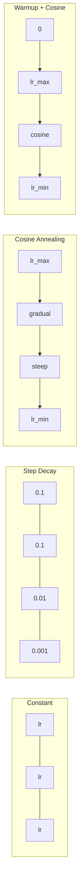
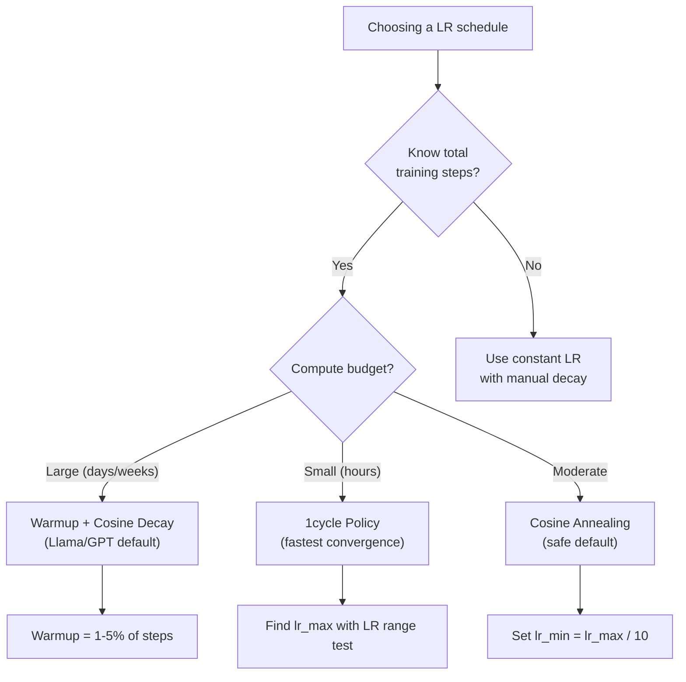
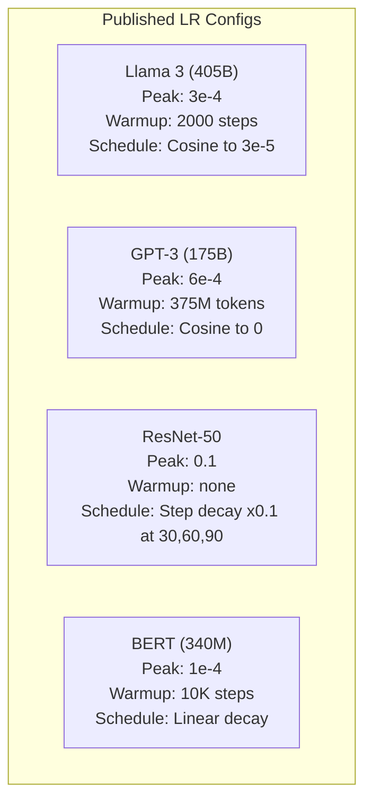

# 学习时间表和热潮

> 学习率是唯一最重要的超参数――不是架构――不是数据集的尺寸――不是激活函数――是学习率――如果你什么都不调,就调它――

**类型：**构建
**语言：**字符串
**先修：**课时 03.06 (优化器),课时 03.08 (权重初始化)
**时间：**约90分钟

## 学习目标

- 从零实现常态,步骤衰退,化,加热+化和1周期学习率时间表
- 演示学习率 选择的三种失败模式:分化(过高) 停滞(过低) 和振荡(没有衰退)
- 解释为什么基于亚当的优化器需要加热,以及它如何稳定早期训练
- 为了确定训练预算,选择合适的时间表.

## 问题

设定学习率为0.1──训练会异--损失在3步跳到无穷大――设定为0.0001──训练会慢爬--100个时代后,模型几乎仍然停留在随机状态――设定为0.01──训练在前50个时代有效,之后,损失会在一个永远无法实现的最小的附近波动,因为步骤太大――

最优的学习率 不是常数――它会在训练过程中变化――早期,你希望使用大步快速覆盖空间――训练后期,你希望使用很小的步骤获得一个明确的最低――一个90%精确的模型和一个95%精确的模型之间的差异,往往只是时间表――

过去三年发表的每个主流模型都使用了学习率时间表――Llama 3 使用峰值 lr=3e-4,2000 个加热步骤,并通过了宇宙衰退 衰减到3e-5――GPT-3 使用 lr=6e-4,并进行了375万代币的加热――这些不是随意选择――它们是花费数百万美元的大规模超参数扫描的结果――

你需要理解时间表,因为默认值不一定适用于你的问题. 当你调整一个预训练模型时,正确的时间表不同于从零训练.

## 概念

### 持续学习率

最简单的方法. 选择一个数字,每一步都用它.

```
lr(t) = lr_0
```

很少是最优的――它要么对训练末期来说太高 ((在最小的 附近的振荡),要么对训练初步来说太低 ((在小步上浪费计算) ――对小模型和调试来说也可以――对任何需要训练超过一个小时的任务都是糟糕的选择――

### 步骤衰退

根据某个因素,在固定时期,通常是10倍的学习率降低.

```
lr(t) = lr_0 * gamma^(floor(epoch / step_size))
```

其中的Gamma=0.1 且 step_size=30 表示:lr 每30个时代 降低10x──ResNet-50 就用这个--lr=0.1,在30、60 和90 时代降低10x──

问题是:最优的衰退 点取决于数据集和架构――转换到另一个问题,就需要调整什么时候降低――转变也很突然――当速度突然变化时,损失可能会升――

### 酸

根据宇宙曲线,从最大学习率平滑衰退到最小值:

```
lr(t) = lr_min + 0.5 * (lr_max - lr_min) * (1 + cos(pi * t / T))
```

其中,t 是前一步,T 是总步数.

当t=0时,cosine 项为1,所以lr = lr_max──当t=T时,cosine 项为 -1,所以lr = lr_min──衰落 一开始很平缓,中间加速,接近最后时再次变得平缓──

对于大多数现代训练运行的默认选择.除了lr_max 和lr_min之外,没有需要调整的超参数.

### 热点:为什么要从小开始

根据较差的统计量,最初几次的渐进更新. 如果你的学习率在此期间很大,模型会迈出巨大且方向不良的步骤.

暖化可以修复这个问题――首先从一个非常小的学习速度开始,通常是lr_max/warmup_steps,甚至为零),然后在前N步骤中线性上升到lr_max──当你达到完整的学习速度时,亚当的统计已经稳定了──

```
lr(t) = lr_max * (t / warmup_steps)     for t < warmup_steps
```

典型加热:总训练步骤的1-5%──Llama 3 训练了约18万亿代币,并加热了2000个步骤──GPT-3 在375万代币上进行加热──

### 线性变暖 + 化衰变

现代默认方案――先线性升级,然后使用化解:

```
if t < warmup_steps:
    lr(t) = lr_max * (t / warmup_steps)
else:
    progress = (t - warmup_steps) / (total_steps - warmup_steps)
    lr(t) = lr_min + 0.5 * (lr_max - lr_min) * (1 + cos(pi * progress))
```

这就是Llama、GPT、PaLM 和大多数现代变压器使用方案──加热 防止早期不稳定──可西因衰变 让模型 收到良好的最低点──

### 周期政策

莱斯利·史密斯的发现 (2018):在训练前半段把学习率从低值升高值,再在后半段下降――反直觉--为什么要在训练中增加学习率?

理论是:高学习率 会通过优化轨迹中加入噪音来起到规范化作用――模型在升级阶段会探索更多的损失景观,从而找到更好的盆地――然后在升级阶段进行精炼在找到最佳盆地――

```
Phase 1 (0 to T/2):    lr ramps from lr_max/25 to lr_max
Phase 2 (T/2 to T):    lr ramps from lr_max to lr_max/10000
```

在固定计算预算下,1周期通常比代码缩更快.

### 时间表 形状



### 决策流程图



### 已发表的模型 中的真实数值




```figure
lr-schedule
```

## 构建它

### 步骤1:时间表功能

每个函数接收当前步骤,并返回该步骤的学习率.

```python
import math


def constant_schedule(step, lr=0.01, **kwargs):
    return lr


def step_decay_schedule(step, lr=0.1, step_size=100, gamma=0.1, **kwargs):
    return lr * (gamma ** (step // step_size))


def cosine_schedule(step, lr=0.01, total_steps=1000, lr_min=1e-5, **kwargs):
    if step >= total_steps:
        return lr_min
    return lr_min + 0.5 * (lr - lr_min) * (1 + math.cos(math.pi * step / total_steps))


def warmup_cosine_schedule(step, lr=0.01, total_steps=1000, warmup_steps=100, lr_min=1e-5, **kwargs):
    if total_steps <= warmup_steps:
        return lr * (step / max(warmup_steps, 1))
    if step < warmup_steps:
        return lr * step / warmup_steps
    progress = (step - warmup_steps) / (total_steps - warmup_steps)
    return lr_min + 0.5 * (lr - lr_min) * (1 + math.cos(math.pi * progress))


def one_cycle_schedule(step, lr=0.01, total_steps=1000, **kwargs):
    mid = max(total_steps // 2, 1)
    if step < mid:
        return (lr / 25) + (lr - lr / 25) * step / mid
    else:
        progress = (step - mid) / max(total_steps - mid, 1)
        return lr * (1 - progress) + (lr / 10000) * progress
```

### 步骤2:可视化所有时间表

打印一个基于文本的情节,展示每一个时间表在训练过程中的变化.

```python
def visualize_schedule(name, schedule_fn, total_steps=500, **kwargs):
    steps = list(range(0, total_steps, total_steps // 20))
    if total_steps - 1 not in steps:
        steps.append(total_steps - 1)

    lrs = [schedule_fn(s, total_steps=total_steps, **kwargs) for s in steps]
    max_lr = max(lrs) if max(lrs) > 0 else 1.0

    print(f"\n{name}:")
    for s, lr_val in zip(steps, lrs):
        bar_len = int(lr_val / max_lr * 40)
        bar = "#" * bar_len
        print(f"  Step {s:4d}: lr={lr_val:.6f} {bar}")
```

### 步骤3:训练网络

在圆数据集上使用一个简单的两个层网络,与前几课相同,但这次我们改变了时间表.

```python
import random


def sigmoid(x):
    x = max(-500, min(500, x))
    return 1.0 / (1.0 + math.exp(-x))


def relu(x):
    return max(0.0, x)


def relu_deriv(x):
    return 1.0 if x > 0 else 0.0


def make_circle_data(n=200, seed=42):
    random.seed(seed)
    data = []
    for _ in range(n):
        x = random.uniform(-2, 2)
        y = random.uniform(-2, 2)
        label = 1.0 if x * x + y * y < 1.5 else 0.0
        data.append(([x, y], label))
    return data


def train_with_schedule(schedule_fn, schedule_name, data, epochs=300, base_lr=0.05, **kwargs):
    random.seed(0)
    hidden_size = 8
    total_steps = epochs * len(data)

    std = math.sqrt(2.0 / 2)
    w1 = [[random.gauss(0, std) for _ in range(2)] for _ in range(hidden_size)]
    b1 = [0.0] * hidden_size
    w2 = [random.gauss(0, std) for _ in range(hidden_size)]
    b2 = 0.0

    step = 0
    epoch_losses = []

    for epoch in range(epochs):
        total_loss = 0
        correct = 0

        for x, target in data:
            lr = schedule_fn(step, lr=base_lr, total_steps=total_steps, **kwargs)

            z1 = []
            h = []
            for i in range(hidden_size):
                z = w1[i][0] * x[0] + w1[i][1] * x[1] + b1[i]
                z1.append(z)
                h.append(relu(z))

            z2 = sum(w2[i] * h[i] for i in range(hidden_size)) + b2
            out = sigmoid(z2)

            error = out - target
            d_out = error * out * (1 - out)

            for i in range(hidden_size):
                d_h = d_out * w2[i] * relu_deriv(z1[i])
                w2[i] -= lr * d_out * h[i]
                for j in range(2):
                    w1[i][j] -= lr * d_h * x[j]
                b1[i] -= lr * d_h
            b2 -= lr * d_out

            total_loss += (out - target) ** 2
            if (out >= 0.5) == (target >= 0.5):
                correct += 1
            step += 1

        avg_loss = total_loss / len(data)
        accuracy = correct / len(data) * 100
        epoch_losses.append(avg_loss)

    return epoch_losses
```

### 步骤4: 比较所有时间表

用每一个时间表 训练同一个网络,并比较最终损失和融合行为.

```python
def compare_schedules(data):
    configs = [
        ("Constant", constant_schedule, {}),
        ("Step Decay", step_decay_schedule, {"step_size": 15000, "gamma": 0.1}),
        ("Cosine", cosine_schedule, {"lr_min": 1e-5}),
        ("Warmup+Cosine", warmup_cosine_schedule, {"warmup_steps": 3000, "lr_min": 1e-5}),
        ("1cycle", one_cycle_schedule, {}),
    ]

    print(f"\n{'Schedule':<20} {'Start Loss':>12} {'Mid Loss':>12} {'End Loss':>12} {'Best Loss':>12}")
    print("-" * 70)

    for name, schedule_fn, extra_kwargs in configs:
        losses = train_with_schedule(schedule_fn, name, data, epochs=300, base_lr=0.05, **extra_kwargs)
        mid_idx = len(losses) // 2
        best = min(losses)
        print(f"{name:<20} {losses[0]:>12.6f} {losses[mid_idx]:>12.6f} {losses[-1]:>12.6f} {best:>12.6f}")
```

### 步骤 5:LR 过高对过低

演示三种失败模式:过高(分化) 过低(爬行) 和刚刚好。

```python
def lr_sensitivity(data):
    learning_rates = [1.0, 0.1, 0.01, 0.001, 0.0001]

    print("\nLR Sensitivity (constant schedule, 100 epochs):")
    print(f"  {'LR':>10} {'Start Loss':>12} {'End Loss':>12} {'Status':>15}")
    print("  " + "-" * 52)

    for lr in learning_rates:
        losses = train_with_schedule(constant_schedule, f"lr={lr}", data, epochs=100, base_lr=lr)
        start = losses[0]
        end = losses[-1]

        if end > start or math.isnan(end) or end > 1.0:
            status = "DIVERGED"
        elif end > start * 0.9:
            status = "BARELY MOVED"
        elif end < 0.15:
            status = "CONVERGED"
        else:
            status = "LEARNING"

        end_str = f"{end:.6f}" if not math.isnan(end) else "NaN"
        print(f"  {lr:>10.4f} {start:>12.6f} {end_str:>12} {status:>15}")
```

## 使用它

火器在`torch.optim.lr_scheduler`中提供时间表:

```python
import torch
import torch.optim as optim
from torch.optim.lr_scheduler import CosineAnnealingLR, OneCycleLR, StepLR

model = nn.Sequential(nn.Linear(10, 64), nn.ReLU(), nn.Linear(64, 1))
optimizer = optim.Adam(model.parameters(), lr=3e-4)

scheduler = CosineAnnealingLR(optimizer, T_max=1000, eta_min=1e-5)

for step in range(1000):
    loss = train_step(model, optimizer)
    scheduler.step()
```

对于加热+,使用Lambda调度器,或者使用HuggingFace的`get_cosine_schedule_with_warmup`其他:

```python
from transformers import get_cosine_schedule_with_warmup

scheduler = get_cosine_schedule_with_warmup(
    optimizer,
    num_warmup_steps=2000,
    num_training_steps=100000,
)
```

拥抱面部功能是大多数Llama 和 GPT细调脚本的使用方案──拿不准时,使用加热+可西因,并将加热设为总步骤的 3-5%──它几乎适用于所有情况──

## 交付它

本课会产出:
- `outputs/prompt-lr-schedule-advisor.md`-- 一个提示,根据你的训练设置推合适的学习速度时间表和超参数

## 练习

1. 实现指数分解:lr(t) =lr_0 *gamma^t,其中的gamma =0.999──在圆数据集上与共弦缩比较──

2. 实现学习率范围测试 (Leslie Smith):训练几百步,同时将LR从1e-7指数增加到1──绘制Loss vs LR──最优最大LR 位于Loss 开始增加之前──

3. 使用加热+炼,但改变加热 长度:总步骤的0%、1%、5%、10%、20%──找到训练最稳定的甜点──

4. 实现带热启动的共性缩 (Cosine annealing) (SGDR):每T步骤将学习速度重置为lr_max,然后再次衰退.

5. 构建一个日程外科医生,监控训练 损失,并在损失 稳定时自动从加热转换到阴平;如果损失平原太久,则降低.

## 关键术语

| Term | 人们通常怎么说 | 它真正的含义 |
|------|----------------|----------------------|
| Learning rate | “model 学得有多快” | 用来乘以 Gradient、决定参数更新大小的标量 |
| Schedule | “随时间改变 LR” | 将 training step 映射到 learning rate 的 function，旨在优化 convergence |
| Warmup | “从小 LR 开始” | 在最初 N steps 中，将 LR 从接近零 linearly ramp 到目标值，以稳定 Optimizer 统计量 |
| Cosine annealing | “平滑 LR decay” | 在训练过程中，让 LR 按 cosine 曲线从 lr_max 降低到 lr_min |
| Step decay | “在 milestones 降低 LR” | 在固定 epoch intervals，将 LR 乘以一个因子（通常是 0.1） |
| 1cycle policy | “先上后下” | Leslie Smith 的方法：在单个 cycle 中将 LR 先 ramp up 再 ramp down，以获得更快 convergence |
| LR range test | “找到最佳 learning rate” | 在短时间训练中逐步增加 LR，以找到 Loss 开始 diverge 的数值 |
| Cosine with warm restarts | “重置并重复” | 周期性地将 LR 重置为 lr_max，并再次 decay（SGDR） |
| Eta min | “LR 的下限” | schedule 最终 decay 到的最小 learning rate |
| Peak learning rate | “最大 LR” | 训练过程中达到的最高 LR，通常出现在 warmup 之后 |

## 延伸阅读

- 洛希洛夫和哈特, "SGDR:随着温暖的恢复而降低的斯托哈斯斯基梯度" (2017) -- 引入了化和温暖的重新启动
- 史密斯, "超级融合:使用较高学习率的神经网络非常快速培训" (2018) -- 1周期政策论文
- 图弗龙等人",Llama 2:开放基础和精细调节的聊天模式" (2023) --记录了大规模使用的加热+可西斯时间表
- 戈伊尔等",精确,大型小型批次SGD:训练图像网在1小时内" (2017) --大型批次训练的线性扩展规则 和加热
