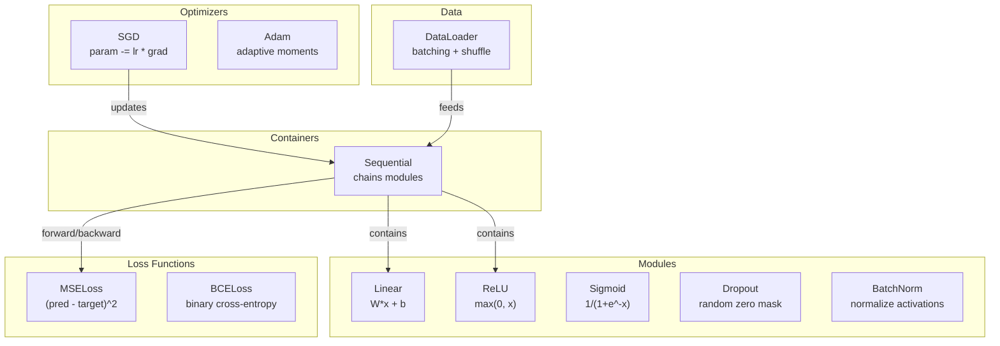
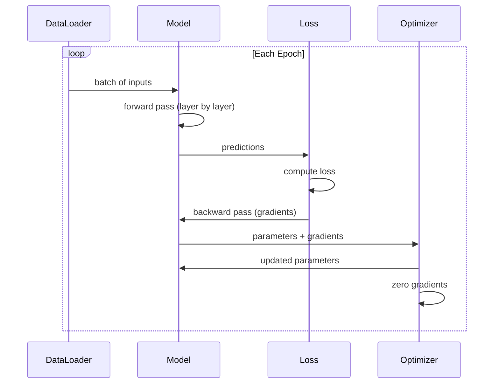
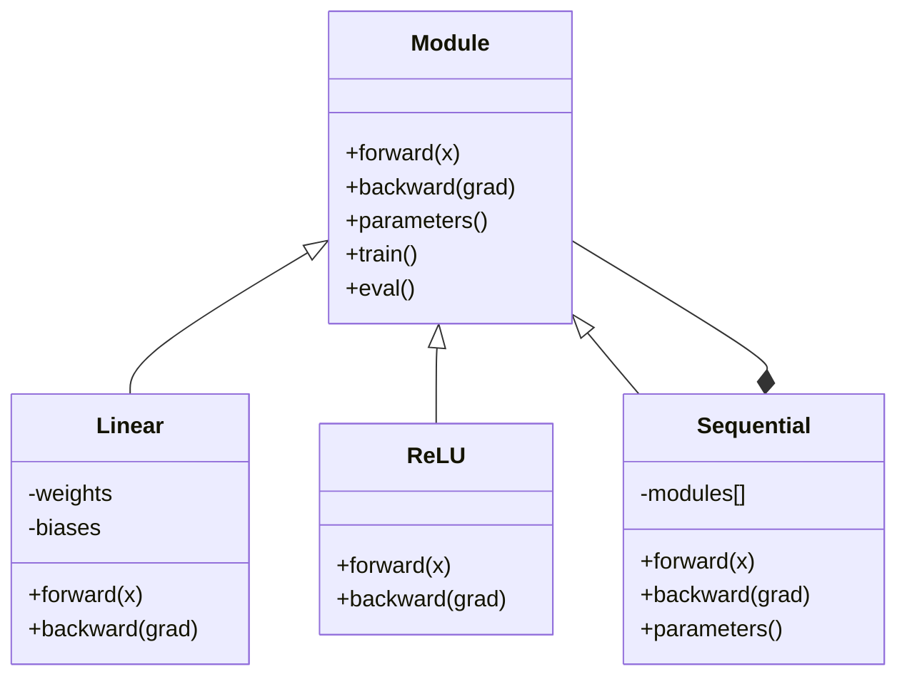

# 构建自己的迷你框架

> 你已经构建了神经元,层,网络,后置,激活,损失函数,优化器,调节,初始化和 LR 时间表.

**类型:**构建
**语言:**字符串
**前置知识:**阶段03 全部内容(课01-09)
**时间:**时间120分钟

## 学习目标

- 构建一个完整的深度学习框架 (约500 行),包含模块,线性,ReLU,Sigmoid,Dropout,BatchNorm,序列性,损失函数,优化器和数据载体
- 解释模块抽象 ((前进、后退、参数),以及为什么必须切换火车/车辆模式
- 将所有组件连接到一个可操作的训练循环,用于在圆形分类上训练一个4层网络
- 为了实现这个目标,我们需要将你的框架中的每个组件映射到对应的 PyTorch 等价物品 (n.Module、n.Sequential、optim.Adam、DataLoader)

## 问题

你已经在十节中构建了分散在不同文件中的建筑块.`Value`为了训练一个网络,你需要从五节不同的课程中复制粘贴代码,然后手动连接它们.

这正是解决问题的框架.`nn.Module`,我知道.`nn.Sequential`,我知道.`optim.Adam`,我知道.`DataLoader`它们的组合以及形成的训练循环模式.`keras.Layer`,我知道.`keras.Sequential`,我知道.`keras.optimizers.Adam`这些都不是魔法. 这些都是组织模式,使你能够定义,训练和评估网络,而不需要每次重新发明底层连接逻辑.

你将使用约500 行Python 构建类似的东西――不用 numpy――不用外部依赖――这个框架可以定义任意的输送网络,使用SGD或Adam 训练,对数据做批量,应用下降和批量正常化,使用任意激活,并调度学习率――

完成后,你会准确理解在 PyTorch 中写下`model = nn.Sequential(...)`什么发生了? 你会明白为什么存在.`model.train()`和 `model.eval()`你会明白为什么`optimizer.zero_grad()`你会理解这些,因为它们都是你亲自构建的.

## 核心概念

### 模块抽象

火器中每一个层都继承了自己.`nn.Module`△一个模块有三个职责:

1. **forward()**-- 给定输入,计算输出
2. **parameters()**-- 返回所有可训练的重量
3. **backward()**-- 计算梯度(在 PyTorch 中由自动梯度处理,在我们的框架中显式实现)

线性层是一个模块――ReLU激活是一个模块――放弃层是一个模块――批量正常化层 也是一个模块――它们都有相同的接口――

### 序列容器

`nn.Sequential`会串联模块──前传:让数据依次通过模块1、模块2、模块3──后传:反向遍历这条链──容器本身也是一个模块--它有前面() 参数() 和后面(()──这是复合模式:一串模块本身也是一个模块──

### 训练与评估模式

断在训练时随时将神经元置零,但在评估时让所有值通过――批量正常化在训练时使用批量统计,但在评估时使用运行平均量――`train()`和 `eval()`每个模块都有一个`training`旗

### 优化器

优化器使用参数的梯度来更新它们.`param -= lr * grad`‧亚当:维护动力和变量估计,然后进行更新‧优化器不需要知道网络架构--它只能看到一个平面的参数列表及其梯度‧

### 数据载体

批量 很重要,有两个原因.第一,对于大型问题,你无法把整个数据集都放进内存.第二,迷你批量渐进下降提供了噪音,有助于逃离本地最小值.

### 框架架构



### 训练循环



### 模块层次




```figure
gradient-clipping
```

## 构建它

### 步骤1:模块基础类

每层都需要实现抽象界面.

```python
class Module:
    def __init__(self):
        self.training = True

    def forward(self, x):
        raise NotImplementedError

    def backward(self, grad):
        raise NotImplementedError

    def parameters(self):
        return []

    def train(self):
        self.training = True

    def eval(self):
        self.training = False
```

### 步骤 2:线性层

最基本的建筑块――存储权重和偏差,前时计算Wx+b,后时计算权重/输入梯度――

```python
import math
import random


class Linear(Module):
    def __init__(self, fan_in, fan_out):
        super().__init__()
        std = math.sqrt(2.0 / fan_in)
        self.weights = [[random.gauss(0, std) for _ in range(fan_in)] for _ in range(fan_out)]
        self.biases = [0.0] * fan_out
        self.weight_grads = [[0.0] * fan_in for _ in range(fan_out)]
        self.bias_grads = [0.0] * fan_out
        self.fan_in = fan_in
        self.fan_out = fan_out
        self.input = None

    def forward(self, x):
        self.input = x
        output = []
        for i in range(self.fan_out):
            val = self.biases[i]
            for j in range(self.fan_in):
                val += self.weights[i][j] * x[j]
            output.append(val)
        return output

    def backward(self, grad):
        input_grad = [0.0] * self.fan_in
        for i in range(self.fan_out):
            self.bias_grads[i] += grad[i]
            for j in range(self.fan_in):
                self.weight_grads[i][j] += grad[i] * self.input[j]
                input_grad[j] += grad[i] * self.weights[i][j]
        return input_grad

    def parameters(self):
        params = []
        for i in range(self.fan_out):
            for j in range(self.fan_in):
                params.append((self.weights, i, j, self.weight_grads))
            params.append((self.biases, i, None, self.bias_grads))
        return params
```

### 步骤3:激活模块

将 ReLU、Sigmoid 和 Tanh 实现为模块──每个都会缓存后行所需内容──

```python
class ReLU(Module):
    def __init__(self):
        super().__init__()
        self.mask = None

    def forward(self, x):
        self.mask = [1.0 if v > 0 else 0.0 for v in x]
        return [max(0.0, v) for v in x]

    def backward(self, grad):
        return [g * m for g, m in zip(grad, self.mask)]


class Sigmoid(Module):
    def __init__(self):
        super().__init__()
        self.output = None

    def forward(self, x):
        self.output = []
        for v in x:
            v = max(-500, min(500, v))
            self.output.append(1.0 / (1.0 + math.exp(-v)))
        return self.output

    def backward(self, grad):
        return [g * o * (1 - o) for g, o in zip(grad, self.output)]


class Tanh(Module):
    def __init__(self):
        super().__init__()
        self.output = None

    def forward(self, x):
        self.output = [math.tanh(v) for v in x]
        return self.output

    def backward(self, grad):
        return [g * (1 - o * o) for g, o in zip(grad, self.output)]
```

### 步骤 4: 放弃模块

训练时随机将元素置零──将保留下来的元素按1/(1-p) 缩小,使期望值保持不变──在评估时没有任何处理──

```python
class Dropout(Module):
    def __init__(self, p=0.5):
        super().__init__()
        self.p = p
        self.mask = None

    def forward(self, x):
        if not self.training:
            return x
        self.mask = [0.0 if random.random() < self.p else 1.0 / (1 - self.p) for _ in x]
        return [v * m for v, m in zip(x, self.mask)]

    def backward(self, grad):
        if self.mask is None:
            return grad
        return [g * m for g, m in zip(grad, self.mask)]
```

### 步骤 5: 批量规范模块

按功能 在批量维度上将激活 归一化为零平均 和单元变量――为评估模式 维护运行统计――

```python
class BatchNorm(Module):
    def __init__(self, size, momentum=0.1, eps=1e-5):
        super().__init__()
        self.size = size
        self.gamma = [1.0] * size
        self.beta = [0.0] * size
        self.gamma_grads = [0.0] * size
        self.beta_grads = [0.0] * size
        self.running_mean = [0.0] * size
        self.running_var = [1.0] * size
        self.momentum = momentum
        self.eps = eps
        self.x_norm = None
        self.std_inv = None
        self.batch_input = None

    def forward_batch(self, batch):
        batch_size = len(batch)
        output_batch = []

        if self.training:
            mean = [0.0] * self.size
            for sample in batch:
                for j in range(self.size):
                    mean[j] += sample[j]
            mean = [m / batch_size for m in mean]

            var = [0.0] * self.size
            for sample in batch:
                for j in range(self.size):
                    var[j] += (sample[j] - mean[j]) ** 2
            var = [v / batch_size for v in var]

            self.std_inv = [1.0 / math.sqrt(v + self.eps) for v in var]

            self.x_norm = []
            self.batch_input = batch
            for sample in batch:
                normed = [(sample[j] - mean[j]) * self.std_inv[j] for j in range(self.size)]
                self.x_norm.append(normed)
                output = [self.gamma[j] * normed[j] + self.beta[j] for j in range(self.size)]
                output_batch.append(output)

            for j in range(self.size):
                self.running_mean[j] = (1 - self.momentum) * self.running_mean[j] + self.momentum * mean[j]
                self.running_var[j] = (1 - self.momentum) * self.running_var[j] + self.momentum * var[j]
        else:
            std_inv = [1.0 / math.sqrt(v + self.eps) for v in self.running_var]
            for sample in batch:
                normed = [(sample[j] - self.running_mean[j]) * std_inv[j] for j in range(self.size)]
                output = [self.gamma[j] * normed[j] + self.beta[j] for j in range(self.size)]
                output_batch.append(output)

        return output_batch

    def forward(self, x):
        result = self.forward_batch([x])
        return result[0]

    def backward(self, grad):
        if self.x_norm is None:
            return grad
        for j in range(self.size):
            self.gamma_grads[j] += self.x_norm[0][j] * grad[j]
            self.beta_grads[j] += grad[j]
        return [grad[j] * self.gamma[j] * self.std_inv[j] for j in range(self.size)]

    def parameters(self):
        params = []
        for j in range(self.size):
            params.append((self.gamma, j, None, self.gamma_grads))
            params.append((self.beta, j, None, self.beta_grads))
        return params
```

### 步骤 6: 序列容器

串联模块――向前从左到右,向后从右到左――

```python
class Sequential(Module):
    def __init__(self, *modules):
        super().__init__()
        self.modules = list(modules)

    def forward(self, x):
        for module in self.modules:
            x = module.forward(x)
        return x

    def backward(self, grad):
        for module in reversed(self.modules):
            grad = module.backward(grad)
        return grad

    def parameters(self):
        params = []
        for module in self.modules:
            params.extend(module.parameters())
        return params

    def train(self):
        self.training = True
        for module in self.modules:
            module.train()

    def eval(self):
        self.training = False
        for module in self.modules:
            module.eval()
```

### 步骤 7: 损失功能

双向交叉值――每个都会返回损失值,并提供一个倒退的值――返回值――

```python
class MSELoss:
    def __call__(self, predicted, target):
        self.predicted = predicted
        self.target = target
        n = len(predicted)
        self.loss = sum((p - t) ** 2 for p, t in zip(predicted, target)) / n
        return self.loss

    def backward(self):
        n = len(self.predicted)
        return [2 * (p - t) / n for p, t in zip(self.predicted, self.target)]


class BCELoss:
    def __call__(self, predicted, target):
        self.predicted = predicted
        self.target = target
        eps = 1e-7
        n = len(predicted)
        self.loss = 0
        for p, t in zip(predicted, target):
            p = max(eps, min(1 - eps, p))
            self.loss += -(t * math.log(p) + (1 - t) * math.log(1 - p))
        self.loss /= n
        return self.loss

    def backward(self):
        eps = 1e-7
        n = len(self.predicted)
        grads = []
        for p, t in zip(self.predicted, self.target):
            p = max(eps, min(1 - eps, p))
            grads.append((-t / p + (1 - t) / (1 - p)) / n)
        return grads
```

### 步骤 8: SGD 和亚当优化器

两者都接收参数列表,并使用梯度更新权重.

```python
class SGD:
    def __init__(self, parameters, lr=0.01):
        self.params = parameters
        self.lr = lr

    def step(self):
        for container, i, j, grad_container in self.params:
            if j is not None:
                container[i][j] -= self.lr * grad_container[i][j]
            else:
                container[i] -= self.lr * grad_container[i]

    def zero_grad(self):
        for container, i, j, grad_container in self.params:
            if j is not None:
                grad_container[i][j] = 0.0
            else:
                grad_container[i] = 0.0


class Adam:
    def __init__(self, parameters, lr=0.001, beta1=0.9, beta2=0.999, eps=1e-8):
        self.params = parameters
        self.lr = lr
        self.beta1 = beta1
        self.beta2 = beta2
        self.eps = eps
        self.t = 0
        self.m = [0.0] * len(parameters)
        self.v = [0.0] * len(parameters)

    def step(self):
        self.t += 1
        for idx, (container, i, j, grad_container) in enumerate(self.params):
            if j is not None:
                g = grad_container[i][j]
            else:
                g = grad_container[i]

            self.m[idx] = self.beta1 * self.m[idx] + (1 - self.beta1) * g
            self.v[idx] = self.beta2 * self.v[idx] + (1 - self.beta2) * g * g

            m_hat = self.m[idx] / (1 - self.beta1 ** self.t)
            v_hat = self.v[idx] / (1 - self.beta2 ** self.t)

            update = self.lr * m_hat / (math.sqrt(v_hat) + self.eps)

            if j is not None:
                container[i][j] -= update
            else:
                container[i] -= update

    def zero_grad(self):
        for container, i, j, grad_container in self.params:
            if j is not None:
                grad_container[i][j] = 0.0
            else:
                grad_container[i] = 0.0
```

### 步骤 9: 数据载体

将数据分成批量,并可选择在每个时代中混.

```python
class DataLoader:
    def __init__(self, data, batch_size=32, shuffle=True):
        self.data = data
        self.batch_size = batch_size
        self.shuffle = shuffle

    def __iter__(self):
        indices = list(range(len(self.data)))
        if self.shuffle:
            random.shuffle(indices)
        for start in range(0, len(indices), self.batch_size):
            batch_indices = indices[start:start + self.batch_size]
            batch = [self.data[i] for i in batch_indices]
            inputs = [item[0] for item in batch]
            targets = [item[1] for item in batch]
            yield inputs, targets

    def __len__(self):
        return (len(self.data) + self.batch_size - 1) // self.batch_size
```

### 第十步:在圆形分类上训练四层网络

把所有东西连接起来――定义模型,选择损失函数,选择优化器,运行训练循环――

```python
def make_circle_data(n=500, seed=42):
    random.seed(seed)
    data = []
    for _ in range(n):
        x = random.uniform(-2, 2)
        y = random.uniform(-2, 2)
        label = 1.0 if x * x + y * y < 1.5 else 0.0
        data.append(([x, y], [label]))
    return data


def train():
    random.seed(42)

    model = Sequential(
        Linear(2, 16),
        ReLU(),
        Linear(16, 16),
        ReLU(),
        Linear(16, 8),
        ReLU(),
        Linear(8, 1),
        Sigmoid(),
    )

    criterion = BCELoss()
    optimizer = Adam(model.parameters(), lr=0.01)

    data = make_circle_data(500)
    split = int(len(data) * 0.8)
    train_data = data[:split]
    test_data = data[split:]

    loader = DataLoader(train_data, batch_size=16, shuffle=True)

    model.train()

    for epoch in range(100):
        total_loss = 0
        total_correct = 0
        total_samples = 0

        for batch_inputs, batch_targets in loader:
            batch_loss = 0
            for x, t in zip(batch_inputs, batch_targets):
                pred = model.forward(x)
                loss = criterion(pred, t)
                batch_loss += loss

                optimizer.zero_grad()
                grad = criterion.backward()
                model.backward(grad)
                optimizer.step()

                predicted_class = 1.0 if pred[0] >= 0.5 else 0.0
                if predicted_class == t[0]:
                    total_correct += 1
                total_samples += 1

            total_loss += batch_loss

        avg_loss = total_loss / total_samples
        accuracy = total_correct / total_samples * 100

        if epoch % 10 == 0 or epoch == 99:
            print(f"Epoch {epoch:3d} | Loss: {avg_loss:.6f} | Train Accuracy: {accuracy:.1f}%")

    model.eval()
    correct = 0
    for x, t in test_data:
        pred = model.forward(x)
        predicted_class = 1.0 if pred[0] >= 0.5 else 0.0
        if predicted_class == t[0]:
            correct += 1
    test_accuracy = correct / len(test_data) * 100
    print(f"\nTest Accuracy: {test_accuracy:.1f}% ({correct}/{len(test_data)})")

    return model, test_accuracy
```

## 使用它

下面是你刚刚构建的PyTorch等价格版本:

```python
import torch
import torch.nn as nn
from torch.utils.data import DataLoader, TensorDataset

model = nn.Sequential(
    nn.Linear(2, 16),
    nn.ReLU(),
    nn.Linear(16, 16),
    nn.ReLU(),
    nn.Linear(16, 8),
    nn.ReLU(),
    nn.Linear(8, 1),
    nn.Sigmoid(),
)

criterion = nn.BCELoss()
optimizer = torch.optim.Adam(model.parameters(), lr=0.01)

for epoch in range(100):
    model.train()
    for inputs, targets in dataloader:
        optimizer.zero_grad()
        predictions = model(inputs)
        loss = criterion(predictions, targets)
        loss.backward()
        optimizer.step()

    model.eval()
    with torch.no_grad():
        test_predictions = model(test_inputs)
```

结构是完全一致的.`Sequential`,我知道.`Linear`,我知道.`ReLU`,我知道.`Sigmoid`,我知道.`BCELoss`,我知道.`Adam`,我知道.`zero_grad`,我知道.`backward`,我知道.`step`,我知道.`train`,我知道.`eval`△每个概念都是一对应的──区别在于 PyTorch 会自动处理自动化(不需要在每个模块实现向后()),可以在 GPU 上运行,并且经过多年的优化──但架构是一样的──

现在,当你看到 PyTorch 代码时,你确实知道每一行都发生了什么.

## 交付内容

本课会产出:
- `outputs/prompt-framework-architect.md`-- 一个用于基于框架抽象的提示 设计神经网络架构

## 练习

1. 为多类分类 添加一个 `SoftmaxCrossEntropyLoss`类──对预测做软max,计算跨缩损失,并处理组合后的倒退传递──在一个3级螺旋数据集上测试它──

2. 在优化器中实现学习率安排:添加一个 `set_lr()`方法,并接入 第09课 中的宇宙时间表――使用热化+宇宙 训练圈分类器,并与恒定 LR对比――

3. 为序列添加`save()`和 `load()`测试后载模型与原始模型产生相同的预测.

4. 在亚当优化器中实现体重减小 (L2规律化) 〔添加一个〕`weight_decay`缩的结果: 缩=0与缩=0.01的结果

5. 用真正的迷你批量渐进积累 替换每样本训练循环:在一批的所有样本上积累梯度,然后分为批量大小,再执行一次优化步骤――测量这是否会改变收收获速度――

## 关键术语

| Term | 人们通常怎么说 | 它真正的含义 |
|------|----------------|----------------------|
| Module | “一个 layer” | framework 中的基础 abstraction -- 任何具有 forward()、backward() 和 parameters() 的东西 |
| Sequential | “按顺序堆叠 layers” | 一个串联 modules 的 container，在 forward 时按顺序应用，在 backward 时反向应用 |
| Forward pass | “运行 network” | 按顺序让 input 通过每个 module 来计算 output |
| Backward pass | “计算 gradients” | 将 Loss Gradient Backpropagation通过每个 module，以计算 parameter gradients |
| Parameters | “可训练 weights” | network 中 Optimizer 可以更新的所有值 -- weights 和 biases |
| Optimizer | “更新 weights 的东西” | 一种使用 gradients 更新 parameters 的算法，实现 SGD、Adam 或其他规则 |
| DataLoader | “喂 data 的东西” | 一个 iterator，将 dataset 切分为 batches，并可选择在 epochs 之间 shuffle |
| Training mode | “model.train()” | 一个启用 stochastic 行为的 flag，例如 dropout，以及使用 batch stats 的 batch normalization |
| Evaluation mode | “model.eval()” | 一个禁用 dropout 并让 batch normalization 使用 running statistics 的 flag |
| Zero grad | “清空 gradients” | 在计算下一个 batch 的 gradients 之前，将所有 parameter gradients 重置为零 |

## 延伸阅读

- 帕斯克等人",PyTorch:一个强迫式风格,高性能深度学习图书馆" (2019) -- 描述PyTorch 设计决策的论文
- 乔莱特, "Python的深度学习,第二版" (2021) -- 第3章介绍Keras内部,使用相同的模块/层抽象
- 约翰逊,小DNN (https://github.com/tiny-dnn/tiny-dnn) -- 一个仅供标题使用的C++深度学习框架,用于理解框架内部
