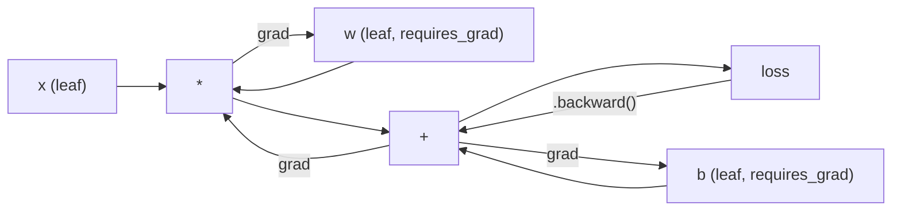
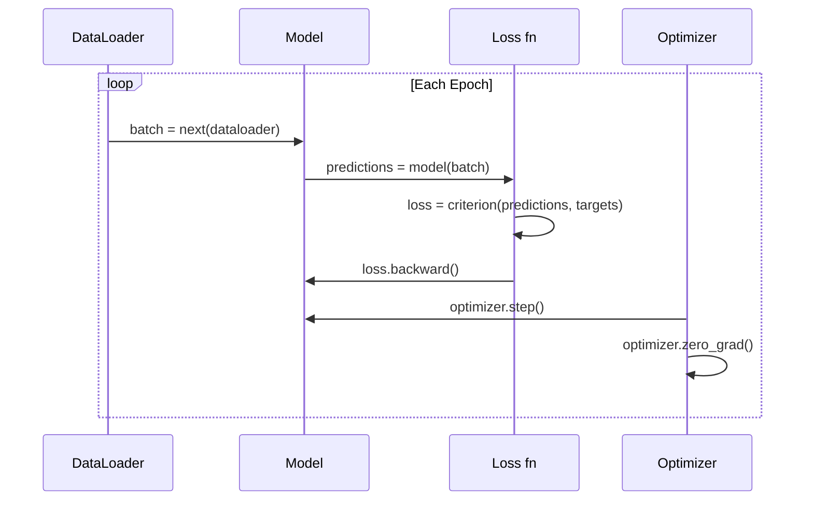

# 火器入门

> 你已经用活塞和曲轴来造出引擎了.现在来学习大家真正会开的一台.

**Type:** Build
**Languages:** Python
**Prerequisites:** Lesson 03.10 (Build Your Own Mini Framework)
**Time:** ~75 minutes

## 学习目标
- 使用 PyTorch 的 nn.Module、nn.Sequential 和 autograd 构建并训练神经网络
- 使用PyTorch Tensor、GPU 加速,以及标准训练循环 ((零_级、前进、损失、后退、步骤)
- 将你从零实现的迷你框架组件转换为对应的 PyTorch等实现
- 在同一任务上,并比较你的纯 Python 框架与 PyTorch 的训练速度

## 问题
你已经有一个可操作的迷你框架――线性层,ReLU,dropout,batch规范,Adam,一个数据加载器,一个训练循环――它可以使用纯Python在圆形分类问题上训练一个四层网络――

但在同一个问题上,它也比PyTorch慢500倍.

你的迷你框架使用嵌套 Python 循环一次处理一个样本.PyTorch 将把相同的操作分派给经过优化的C++/CUDA核,并运行在 GPU 上.在单块NVIDIA A100上,PyTorch 训练一个ResNet-50(25.6M参数) 处理ImageNet(1.28M图像) 需要大约6小时.

速度不是唯一的差距――你的框架没有GPU支持――没有自动区分――你为每个模块写回来了――没有序列化――没有分布式训练――没有混合精度――除了打印语句,没有方法去调试渐进流――

皮托尔奇补补了所有这些缺陷.而且它保留了你已经建立的完全相同的心智模型:模块,前进,参数,后退,优化.步骤.

## 概念
### 为什么皮托奇赢得了

2015年,TensorFlow 要求你在运行任何内容之前先定义一个静态计算图――你构建图,编译它,然后把数据送进去――调试意思是着图形可视化――修改架构意思是从零重建图――

根据PyTorch的2017年发布,它采用了不同的理念:渴望执行.`y = model(x)`会真的立刻计算 y,而不是给稍后才会计算 y 的图表 添加一个节点──这意味着标准Python调试工具都能工作──打印() 能工作──pdb 能工作──前进通过里 if/else 能工作──

到2020年,市场已经给出了答案.在ML研究论文中,PyTorch的占比从7% (在2017年) 增长到超过75% (在2022年) 增加.

这一节课的关键点:开发者经验会复利增长――一个慢的10%――但对快50%的框架进行调试,每次都会赢――

### 电压器

电压是多维数组,具有三个关键属性:形状,d类型和装置.

```python
import torch

x = torch.zeros(3, 4)           # shape: (3, 4), dtype: float32, device: cpu
x = torch.randn(2, 3, 224, 224) # batch of 2 RGB images, 224x224
x = torch.tensor([1, 2, 3])     # from a Python list
```

**Shape**表示维度──尺度的形状是 (),向量是 (n,),矩阵是 (m, n),一批图像是 (批量,道,高度,宽度)──

**Dtype**控制精度和内存.

| dtype | Bits | Range | Use case |
|-------|------|-------|----------|
| float32 | 32 | ~7 位十进制数字 | 默认训练 |
| float16 | 16 | ~3.3 位十进制数字 | Mixed precision |
| bfloat16 | 16 | 与 float32 相同的范围，精度更低 | LLM 训练 |
| int8 | 8 | -128 到 127 | Quantized inference |

**Device**决定计算发生在哪里.

```python
device = torch.device("cuda" if torch.cuda.is_available() else "cpu")
x = torch.randn(3, 4, device=device)
x = x.to("cuda")
x = x.cpu()
```

每个操作都要求所有电压器都位于同一设备上.这是初学者最常遇到的 PyTorch 错误:`RuntimeError: Expected all tensors to be on the same device`△修复方法是计算前把所有内容移动到同一设备.

**Reshaping**是常数时间操作它改变的是元数据,而不是数据.

```python
x = torch.randn(2, 3, 4)
x.view(2, 12)      # reshape to (2, 12) -- must be contiguous
x.reshape(6, 4)    # reshape to (6, 4) -- works always
x.permute(2, 0, 1) # reorder dimensions
x.unsqueeze(0)     # add dimension: (1, 2, 3, 4)
x.squeeze()        # remove size-1 dimensions
```

### 澳门威尼斯人

你的迷你框架 要求你为每个模块 实现向后() ・PyTorch 不需要──它将 Tensor 上的每个操作记录在一个指导的循环图 (计算图) 中,然后反向遍历这个图,自动计算 Gradient──



随着你的框架的关键区别:PyTorch 使用带式自动化.`.backward()`我会反向重放这张录音带.

```python
x = torch.randn(3, requires_grad=True)
y = x ** 2 + 3 * x
z = y.sum()
z.backward()
print(x.grad)  # dz/dx = 2x + 3
```

马克思的三条规则:

1. 只有带有`requires_grad=True`叶子度会积累渐进
2. 渐进默认会累积每次倒退通过 前调用 `optimizer.zero_grad()`
3. `torch.no_grad()`会禁用 渐进跟踪 (在评估期间使用)

### nn.模块

`nn.Module`您已经在10课中构建了这个抽象. PyTorch的版本增加了自动参数注册,回归模块发现,设备管理和状态定序列化.

```python
import torch.nn as nn

class MLP(nn.Module):
    def __init__(self, input_dim, hidden_dim, output_dim):
        super().__init__()
        self.layer1 = nn.Linear(input_dim, hidden_dim)
        self.relu = nn.ReLU()
        self.layer2 = nn.Linear(hidden_dim, output_dim)

    def forward(self, x):
        x = self.layer1(x)
        x = self.relu(x)
        x = self.layer2(x)
        return x
```

当你在`__init__`现在,我们要做一个.`nn.Module`或`nn.Parameter`赋值为属性时,PyTorch 会自动注册它.`model.parameters()`这就是为什么你再也不需要像在迷你框架里那样手动收集权重.

核心建筑物:

| Module | What it does | Parameters |
|--------|-------------|------------|
| nn.Linear(in, out) | Wx + b | in*out + out |
| nn.Conv2d(in_ch, out_ch, k) | 2D convolution | in_ch*out_ch*k*k + out_ch |
| nn.BatchNorm1d(features) | Normalize activations | 2 * features |
| nn.Dropout(p) | Random zeroing | 0 |
| nn.ReLU() | max(0, x) | 0 |
| nn.GELU() | Gaussian error linear | 0 |
| nn.Embedding(vocab, dim) | Lookup table | vocab * dim |
| nn.LayerNorm(dim) | Per-sample normalization | 2 * dim |

### 损失功能与优化器

鱼自带你构建的所有内容的生产准备版本.

**Loss functions**(来自`torch.nn`):

| Loss | Task | Input |
|------|------|-------|
| nn.MSELoss() | Regression | 任意 shape |
| nn.CrossEntropyLoss() | Multi-class classification | Logits（不是 softmax） |
| nn.BCEWithLogitsLoss() | Binary classification | Logits（不是 sigmoid） |
| nn.L1Loss() | Regression（robust） | 任意 shape |
| nn.CTCLoss() | Sequence alignment | Log probabilities |

注意:`CrossEntropyLoss`内部组合了`LogSoftmax`其他`NLLLoss`传入原始的输出,而不是软max输出.

**Optimizers**(来自`torch.optim`):

| Optimizer | When to use | Typical LR |
|-----------|-------------|-----------|
| SGD(params, lr, momentum) | CNNs、调优良好的 pipelines | 0.01--0.1 |
| Adam(params, lr) | 默认起点 | 1e-3 |
| AdamW(params, lr, weight_decay) | Transformers、fine-tuning | 1e-4--1e-3 |
| LBFGS(params) | Small-scale、second-order | 1.0 |

### 训练循环

每个PyTorch训练循环都遵循相同的5步模式.



规范模式:

```python
for epoch in range(num_epochs):
    model.train()
    for inputs, targets in train_loader:
        inputs, targets = inputs.to(device), targets.to(device)
        optimizer.zero_grad()
        outputs = model(inputs)
        loss = criterion(outputs, targets)
        loss.backward()
        optimizer.step()
```

内部五行――训练出GPT-4、稳定分散和LLaMA的也是这五行――结构会变化――数据会变化――这五行不会变化――

### 数据集和数据载体

皮托尔奇的`Dataset`是一个有两个方法的抽象类:`__len__`和 `__getitem__`,我知道.`DataLoader`在它上封装批量和多进程数据加载.

```python
from torch.utils.data import Dataset, DataLoader

class MNISTDataset(Dataset):
    def __init__(self, images, labels):
        self.images = images
        self.labels = labels

    def __len__(self):
        return len(self.labels)

    def __getitem__(self, idx):
        return self.images[idx], self.labels[idx]

loader = DataLoader(dataset, batch_size=64, shuffle=True, num_workers=4)
```

`num_workers=4`在磁盘上载的工作负载上,只有这个项目的可能让训练速度翻倍.

###  GPU 训练

将模型移动到GPU:

```python
device = torch.device("cuda" if torch.cuda.is_available() else "cpu")
model = model.to(device)
```

这将递归地把每个参数和缓冲器移动到GPU.

```python
inputs, targets = inputs.to(device), targets.to(device)
```

**Mixed precision**会在现代 GPU(A100、H100、RTX 4090) 上把内存使用减半、吞吐量翻倍:前后使用浮16 运行,同时主权重保持在浮32:

```python
from torch.amp import autocast, GradScaler

scaler = GradScaler()
for inputs, targets in loader:
    with autocast(device_type="cuda"):
        outputs = model(inputs)
        loss = criterion(outputs, targets)
    scaler.scale(loss).backward()
    scaler.step(optimizer)
    scaler.update()
    optimizer.zero_grad()
```

### 对比:迷你框架vs PyTorchvsJAX

| Feature | Mini Framework (L10) | PyTorch | JAX |
|---------|---------------------|---------|-----|
| Autodiff | Manual backward() | Tape-based autograd | Functional transforms |
| Execution | Eager（Python loops） | Eager（C++ kernels） | Traced + JIT compiled |
| GPU support | 无 | 有（CUDA、ROCm、MPS） | 有（CUDA、TPU） |
| Speed (MNIST MLP) | ~300s/epoch | ~0.5s/epoch | ~0.3s/epoch |
| Module system | Custom Module class | nn.Module | Stateless functions（Flax/Equinox） |
| Debugging | print() | print()、pdb、breakpoint() | 更难（JIT tracing 会破坏 print） |
| Ecosystem | 无 | Hugging Face、Lightning、timm | Flax、Optax、Orbax |
| Learning curve | 你已经构建过它 | 中等 | 陡峭（functional paradigm） |
| Production use | Toy problems | Meta、OpenAI、Anthropic、HF | Google DeepMind、Midjourney |


```figure
dropout-mask
```

## 构建它
一个只使用PyTorch原始的三层MLP在MNIST上训练.没有高层包装.`torchvision.datasets`我们自己下载并解析原始数据.

### 步骤1:从原始文件上载MNIST

通过MNIST 以4个gzipped文件发布:训练图像(60,000 x 28 x 28) 训练标签、测试图像(10,000 x 28 x 28) 测试标签──────────────────────────────────────────────────────────────────────────────────────────────────────────────────────────────────────────────────────────────────────────────────────────────────────────────────────────────────────────────────────────────────────────────────────────────────────────────────────────────────────────────────────────────────────────────────────────────────────────────────────────────────────────────────────────────────────────────────────────────────────────────────────────────────────────────────────────────────────────────────────────────────────────────────────────────────────────────────────────────────────────────────────────────────────────────────────────────────────────────────────────────────────────────────────────────────────────────────────────────────────────────────────────────────────────────────────────────────────────────────────────────────────────────────────────────

```python
import torch
import torch.nn as nn
import struct
import gzip
import urllib.request
import os

def download_mnist(path="./mnist_data"):
    base_url = "https://storage.googleapis.com/cvdf-datasets/mnist/"
    files = [
        "train-images-idx3-ubyte.gz",
        "train-labels-idx1-ubyte.gz",
        "t10k-images-idx3-ubyte.gz",
        "t10k-labels-idx1-ubyte.gz",
    ]
    os.makedirs(path, exist_ok=True)
    for f in files:
        filepath = os.path.join(path, f)
        if not os.path.exists(filepath):
            urllib.request.urlretrieve(base_url + f, filepath)

def load_images(filepath):
    with gzip.open(filepath, "rb") as f:
        magic, num, rows, cols = struct.unpack(">IIII", f.read(16))
        data = f.read()
        images = torch.frombuffer(bytearray(data), dtype=torch.uint8)
        images = images.reshape(num, rows * cols).float() / 255.0
    return images

def load_labels(filepath):
    with gzip.open(filepath, "rb") as f:
        magic, num = struct.unpack(">II", f.read(8))
        data = f.read()
        labels = torch.frombuffer(bytearray(data), dtype=torch.uint8).long()
    return labels
```

### 步骤2:定义模型

一个3层MLP:784 -> 256 -> 128 -> 10──ReLU激活──用Droput做规范──为了保持简单,不使用批量规范──

```python
class MNISTModel(nn.Module):
    def __init__(self):
        super().__init__()
        self.net = nn.Sequential(
            nn.Linear(784, 256),
            nn.ReLU(),
            nn.Dropout(0.2),
            nn.Linear(256, 128),
            nn.ReLU(),
            nn.Dropout(0.2),
            nn.Linear(128, 10),
        )

    def forward(self, x):
        return self.net(x)
```

输出层产生10个原始logits(每个数字一个) ――不使用软max`CrossEntropyLoss`现在我们要在内部处理.

参数数:784*256+256+256+256*128+128+128+128*10+10=235,146──以现代标准来看非常小──GPT-2小 有 124M──这个模型几秒就能完成训练──

### 步骤3: 训练循环

规范的前进损失后退步骤模式

```python
def train_one_epoch(model, loader, criterion, optimizer, device):
    model.train()
    total_loss = 0
    correct = 0
    total = 0
    for images, labels in loader:
        images, labels = images.to(device), labels.to(device)
        optimizer.zero_grad()
        outputs = model(images)
        loss = criterion(outputs, labels)
        loss.backward()
        optimizer.step()
        total_loss += loss.item() * images.size(0)
        _, predicted = outputs.max(1)
        correct += predicted.eq(labels).sum().item()
        total += labels.size(0)
    return total_loss / total, correct / total


def evaluate(model, loader, criterion, device):
    model.eval()
    total_loss = 0
    correct = 0
    total = 0
    with torch.no_grad():
        for images, labels in loader:
            images, labels = images.to(device), labels.to(device)
            outputs = model(images)
            loss = criterion(outputs, labels)
            total_loss += loss.item() * images.size(0)
            _, predicted = outputs.max(1)
            correct += predicted.eq(labels).sum().item()
            total += labels.size(0)
    return total_loss / total, correct / total
```

注意评估期间`torch.no_grad()`没有它,PyTorch会构建一个你根本不会使用的计算图.

### 步骤 4:把所有部分连接起来

```python
def main():
    device = torch.device("cuda" if torch.cuda.is_available() else "cpu")

    download_mnist()
    train_images = load_images("./mnist_data/train-images-idx3-ubyte.gz")
    train_labels = load_labels("./mnist_data/train-labels-idx1-ubyte.gz")
    test_images = load_images("./mnist_data/t10k-images-idx3-ubyte.gz")
    test_labels = load_labels("./mnist_data/t10k-labels-idx1-ubyte.gz")

    train_dataset = torch.utils.data.TensorDataset(train_images, train_labels)
    test_dataset = torch.utils.data.TensorDataset(test_images, test_labels)
    train_loader = torch.utils.data.DataLoader(
        train_dataset, batch_size=64, shuffle=True
    )
    test_loader = torch.utils.data.DataLoader(
        test_dataset, batch_size=256, shuffle=False
    )

    model = MNISTModel().to(device)
    criterion = nn.CrossEntropyLoss()
    optimizer = torch.optim.Adam(model.parameters(), lr=1e-3)

    num_params = sum(p.numel() for p in model.parameters())
    print(f"Device: {device}")
    print(f"Parameters: {num_params:,}")
    print(f"Train samples: {len(train_dataset):,}")
    print(f"Test samples: {len(test_dataset):,}")
    print()

    for epoch in range(10):
        train_loss, train_acc = train_one_epoch(
            model, train_loader, criterion, optimizer, device
        )
        test_loss, test_acc = evaluate(
            model, test_loader, criterion, device
        )
        print(
            f"Epoch {epoch+1:2d} | "
            f"Train Loss: {train_loss:.4f} | Train Acc: {train_acc:.4f} | "
            f"Test Loss: {test_loss:.4f} | Test Acc: {test_acc:.4f}"
        )

    torch.save(model.state_dict(), "mnist_mlp.pt")
    print(f"\nModel saved to mnist_mlp.pt")
    print(f"Final test accuracy: {test_acc:.4f}")
```

后期预期输出:~97.8%的测试精度――CPU 上训练时间:~30秒――GPU 上:~5秒――使用相同的架构的你的迷你框架:~45分钟――

## 使用它
### 快速对比:迷你框架vsPyTorch

| Mini Framework (Lesson 10) | PyTorch |
|---------------------------|---------|
| `model = Sequential(Linear(784, 256), ReLU(), ...)` | `model = nn.Sequential(nn.Linear(784, 256), nn.ReLU(), ...)` |
| `pred = model.forward(x)` | `pred = model(x)` |
| `optimizer.zero_grad()` | `optimizer.zero_grad()` |
| `grad = criterion.backward()` then `model.backward(grad)` | `loss.backward()` |
| `optimizer.step()` | `optimizer.step()` |
| 无 GPU | `model.to("cuda")` |
| 每个 module 都要手写 backward | Autograd 处理所有内容 |

接口几乎完全相同.

### 储存和装载模型

```python
torch.save(model.state_dict(), "model.pt")

model = MNISTModel()
model.load_state_dict(torch.load("model.pt", weights_only=True))
model.eval()
```

始终保存`state_dict()`保存模型对象 会使用,你重构代码时会失效.

### 学习时间表

```python
scheduler = torch.optim.lr_scheduler.CosineAnnealingLR(
    optimizer, T_max=10
)
for epoch in range(10):
    train_one_epoch(model, train_loader, criterion, optimizer, device)
    scheduler.step()
```

光自带15+个时间表:StepLR、ExponentialLR、CosineAnnealingLR、OneCycleLR、ReduceLROnPlateau──它们都能连接到一个优化界面──

## 交付它
本课会产出两个文物:

- `outputs/prompt-pytorch-debugger.md`用于诊断常见 PyTorch 训练失败的快速
- `outputs/skill-pytorch-patterns.md`PyTorch 训练模式的技能参考

## 练习
1. **添加 batch normalization。**在每个线性层之后,`nn.BatchNorm1d`△比较测试精度和训练速度,与仅使用中断的版本对照──

2. **实现 learning rate finder。**用指数增长的学习率(从1e-7到1.0) 训练一个时代――绘制损失与 LR――最佳 LR 位于损失 开始上升之前――用它为MNIST模型 选择更好的 LR――

3. **迁移到 GPU 并使用 mixed precision。**在训练循环中加入`torch.amp.autocast`和 `GradScaler`在GPU上测量使用和不使用混合精度时的输出量 (样本/秒) ⋅在A100上,预期约2倍的速度――

4. **构建 custom Dataset。**下载时尚-MNIST 格式与MNIST相似,但内容是服装物品)`__getitem__`和 `__len__`的`FashionMNISTDataset(Dataset)`时尚-MNIST 更难预期约88%,而不是98%──

5. **用 SGD + momentum 替换 Adam。**使用 `SGD(params, lr=0.01, momentum=0.9)`训练――比较曲线――然后加入`CosineAnnealingLR`时间表,看看 SGD 是否能在时代10 时追上亚当.

## 关键术语
| Term | What people say | What it actually means |
|------|----------------|----------------------|
| Tensor | “一个多维数组” | 一个有类型、device-aware 的数组，每个操作都内置 automatic differentiation 支持 |
| Autograd | “Automatic backprop” | 一个 tape-based 系统，在 forward pass 期间记录操作，然后反向重放它们以计算精确 Gradient |
| nn.Module | “一个 layer” | 任意 differentiable computation block 的基类——注册 parameters、支持 nesting、处理 train/eval modes |
| state_dict | “model weights” | 一个把 parameter names 映射到 Tensor 的 OrderedDict——trained model 的可移植、可序列化表示 |
| .backward() | “计算 Gradient” | 反向遍历 computational graph，为每个带有 requires_grad=True 的 leaf Tensor 计算并累积 Gradient |
| .to(device) | “移动到 GPU” | 递归地把所有 parameters 和 buffers 转移到指定 device（CPU、CUDA、MPS） |
| DataLoader | “data pipeline” | 一个 iterator，会对来自 Dataset 的数据执行 batching、shuffling，并可选地并行化 data loading |
| Mixed precision | “使用 float16” | 使用 float16 forward/backward 提升速度，同时保留 float32 master weights 以保证 numerical stability |
| Eager execution | “立即运行” | 操作在被调用时立即执行，而不是推迟到之后的 compilation step——这是区分 PyTorch 与 TF 1.x 的核心设计选择 |
| zero_grad | “重置 Gradient” | 在下一次 backward pass 前把所有 parameter gradients 置零，因为 PyTorch 默认会累积 Gradient |

## 延伸阅读
- PyTorch:一个强迫风格,高性能深度学习图书馆 (2019) 解释PyTorch 设计权衡的原始论文
- 学习PyTorch以示例 (https://pytorch.org/tutorials/beginner/pytorch_with_examples.html) 从子到 nn.Module 的官方路径
- 火器性能调整指南 (https://pytorch.org/tutorials/recipes/recipes/tuning_guide.html) 混合精度,数据载体工作者,内存和其他生产优化
- 霍拉斯·赫, 使深度学习成为 (https://horace.io/brrr_intro.html什么是GPU培训 快速以及PyTorch特定优化策略
