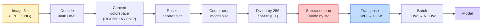
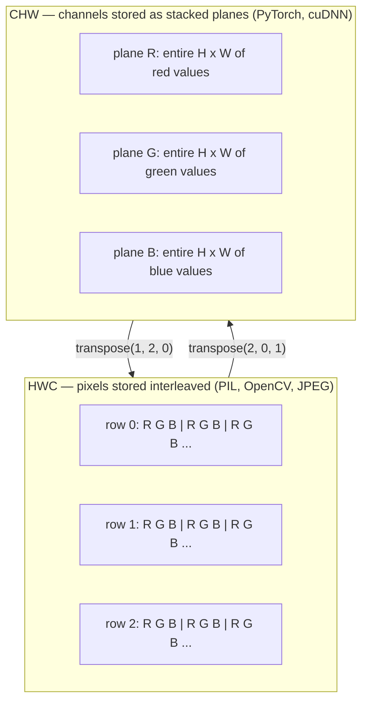

# 图像基础  像素、道、颜色空间

> 图像是光采集的光. 你将使用的每一个视觉模型,都从这个事实开始.

**类型：**建立
**语言：**字符串
**前置要求：**阶段1课12 (光器操作),阶段3课11 (入门到皮托尔奇)
**时间：**约45分钟

## 学习目标

- 解释连续场景如何被分离为像素,以及采样和量化决策为什么决定每个下游模型的上限
- 将图像作为NumPy阵列 读取、切片和检查,并熟练在HWC和CHW布局之间切换
- 在RGB、灰度尺度、HSV和YCbCr之间转换,并说明每个颜色空间存在的原因
- 严格按照火视的预期应用 像素级预处理(正常化、标准化、尺寸化、频道-第一)

## 问题

你会阅读每篇论文,下载每一个预先训练的重量,调用每一个视觉API,都假设输入具有特定的编码.`uint8`图像传给期望`float32`模型的运行仍然会,并且产生无意义的结果. 给BGR 在RGB上训练的网络,准确度会下降10%点. 当模型期望频道-第一,而你给它频道-最后的输入时,第一个 conv 层将高度视为功能频道――这些都不会产生错误――它只会毁掉你的测量,然后你花一周时间去寻找其实藏在文件加载方式中的错误.

一旦你知道卷积在什么上滑动,它本身并不复杂――难点在于,一张图像对摄像机,JPEG解码器,PIL,OpenCV,火视觉和CUDA内核来说有不同的含义――每个堆都有自己的轴序,字节范围和频道会议――无法把这些理念的视觉工程师会交付坏的管道――

本课将修改这个基础,让本阶段后续内容可以建立在它上.最后,你会知道什么是像素,为什么每个像素有三个数字而不是一个,

## 概念

### 完整预处理管道 一览

每个生产级视觉系统都是相同的可逆转变.



红色和蓝色两个框是80%的静默失败发生的地方:缺乏标准化,以及布局错误.

### 像素是样本,不是正方形

摄像头传感器会统计落在微小探测器网格上的光子. 每个探测器在一小段时间内积分光线,并输出一个与其相对照数量相比例的电压.

```
Continuous scene                 Sensor grid                     Digital image
(infinite detail)                (H x W detectors)               (H x W integers)

    ~~~~~                        +--+--+--+--+--+                 210 198 180 155 120
   现在,我们在这个世界里,
  没有任何东西,没有任何东西.
   ~~~~~                         |  |  |  |  |  |                 195 185 170 148 112
                                 +--+--+--+--+--+                 188 180 165 145 108
```

这一步将发生两个选择,它们决定了所有下游任务的上限:

- **Spatial sampling**由于它是个非常重要的测试器,它可以被测试.
- **Intensity quantization**决定电压被分桶得多细――8位 提供 256 个级别,是显示标准――10、12、16位 提供更平滑的梯度,对医疗成像、HDR 和原始传感器管道很重要――

像素不带面积的彩色小方块. 它是一个单独的测量.

### 为什么有三个频道

一个探测器会统计整个可见光谱范围内的光子,那就是灰度.为了获得颜色,传感器会使用红、绿、蓝色过模样子覆盖网格.经过测试后,每个空间位置都有三个整数:附近的红色过探测器、绿色过探测器和蓝色过探测器的响应.

```
One pixel in memory:

    (R, G, B) = (210, 140, 30)   <- reddish-orange

An H x W RGB image:

    shape (H, W, 3)     stored as   H rows of W pixels of 3 values
                                    each in [0, 255] for uint8
```

三不奇怪. 摄像头会添加Z频道. 卫星会添加红外线和紫外线带. 医学扫描通常有一个频道.

### 两种布局公约:HWC和CHW

随着一个子,两种排序.

```
HWC (height, width, channels)           CHW (channels, height, width)

   W ->                                    H ->
  +-----+-----+-----+                     +-----+-----+
H |R G B|R G B|R G B|                   C |R R R R R R|
| +-----+-----+-----+                   | +-----+-----+
v |R G B|R G B|R G B|                   v |G G G G G G|
  +-----+-----+-----+                     +-----+-----+
                                          |B B B B B B|
                                          +-----+-----+

   PIL, OpenCV, matplotlib,              PyTorch, most deep learning
   almost every image file on disk       frameworks, cuDNN kernels
```

曲芯的存在原因是曲芯 会沿H 和W滑动――把道轴放在前面,这意味着每个子都能看到每个道上连续的2D平面,从而干净地向量化――磁盘格式保持HWC,因为这匹配的传感器输出扫描线的方式――

你会输入上千次的转换:

```
img_chw = img_hwc.transpose(2, 0, 1)      # NumPy
img_chw = img_hwc.permute(2, 0, 1)        # PyTorch tensor
```

记忆配置可视化:



### 字节范围和d类型

三种公约 最常见:

| Convention | dtype | Range | 你会在哪里见到它 |
|------------|-------|-------|------------------|
| Raw | `uint8` | [0, 255] | Disk 上的文件、PIL、OpenCV output |
| Normalized | `float32` | [0.0, 1.0] | `img.astype('float32') / 255` 之后 |
| Standardized | `float32` | 大约 [-2, +2] | 减去 mean 并除以 std 之后 |

缩网络是标准化输入上训练的.`mean=[0.485, 0.456, 0.406]`,我知道.`std=[0.229, 0.224, 0.225]`是在完整的图像网训练集上,对 [0, 1]正常化像素 计算得到的三个频道的算术平均和标准偏差――把原始`uint8`输入给期望的标准化浮动模型,是应用视觉中最常见的静默失败.

### 颜色空间以及它们为什么存在

RGB 是捕获格式,但它并不总是对模型最有用的表示.

```
 RGB               HSV                       YCbCr / YUV

 R red             H hue (angle 0-360)       Y luminance (brightness)
 G green           S saturation (0-1)        Cb chroma blue-yellow
 B blue            V value/brightness (0-1)  Cr chroma red-green

 Linear to         Separates color from      Separates brightness from
 sensor output     brightness. Useful for    color. JPEG and most video
                   color thresholding, UI    codecs compress the chroma
                   sliders, simple filters   channels harder because the
                                             human eye is less sensitive
                                             to chroma detail than to Y.
```

在这些场景中,你会遇到其他空间:

- **HSV**经典简历代码,基于颜色的细分,
- **YCbCr**读取JPEG内部视频管道 仅仅在Y上操作的超分辨率模型中
- **Grayscale** OCR、文件模型,以及任何颜色都是扰动变量而不是信号的情况.

从RGB 转灰度上,是加权和,不是平均值,因为人眼对绿色比红色或蓝色更敏感:

```
Y = 0.299 R + 0.587 G + 0.114 B       (ITU-R BT.601, the classic weights)
```

### 面积比度,大小和插射

每个模型都有固定输入尺寸. 大多数ImageNet分类器是224x224,现代探测器常用384x384或512x512) 您的图像很少正好匹配.

- **Resize shorter side, then center crop** 标准图像网配方──保留面积比率,丢弃一条边缘像素──
- **Resize and pad** 保持方体比 和每个像素,添加黑边──检测和OCR的标准做法──
- **Resize directly to target**拉伸图像──便宜,会扭曲几何,但对许多分类任务来说,足够好──

当新网格与旧网格不相对时,插图方法决定中方像素如何计算:

```
Nearest neighbour     fastest, blocky, only choice for masks/labels
Bilinear              fast, smooth, default for most image resizing
Bicubic               slower, sharper on upscaling
Lanczos               slowest, best quality, used for final display
```

经验法则:训练用二线,你会亲眼看的资产用双立方或子,任何包含整数类ID的东西使用最近的──


```figure
conv-output-size
```

## 构建它

### 步骤1:加载图像并检查形状

使用枕头加载任意JPEG或PNG,转换为NumPy,并打印你得到的内容――为了提供可离线运行的确定性示例,这里合成一张图――

```python
import numpy as np
from PIL import Image

def synthetic_rgb(h=128, w=192, seed=0):
    rng = np.random.default_rng(seed)
    yy, xx = np.meshgrid(np.linspace(0, 1, h), np.linspace(0, 1, w), indexing="ij")
    r = (np.sin(xx * 6) * 0.5 + 0.5) * 255
    g = yy * 255
    b = (1 - yy) * xx * 255
    rgb = np.stack([r, g, b], axis=-1) + rng.normal(0, 6, (h, w, 3))
    return np.clip(rgb, 0, 255).astype(np.uint8)

arr = synthetic_rgb()
# 或从 disk 加载：
# arr = np.asarray(Image.open("your_image.jpg").convert("RGB"))

print(f"type:   {type(arr).__name__}")
print(f"dtype:  {arr.dtype}")
print(f"shape:  {arr.shape}     # (H, W, C)")
print(f"min:    {arr.min()}")
print(f"max:    {arr.max()}")
print(f"pixel at (0, 0): {arr[0, 0]}")
```

预期输出:`shape: (H, W, 3)`,我知道.`dtype: uint8`范围`[0, 255]`无论是来自相机的字节,JPEG解码器还是合成发电机,都是可行的磁盘表现.

### 步骤2:拆分频道并重排布局

分别取出R、G、B,然后从HWC转换为Pytorch使用的CHW──

```python
R = arr[:, :, 0]
G = arr[:, :, 1]
B = arr[:, :, 2]
print(f"R shape: {R.shape}, mean: {R.mean():.1f}")
print(f"G shape: {G.shape}, mean: {G.mean():.1f}")
print(f"B shape: {B.shape}, mean: {B.mean():.1f}")

arr_chw = arr.transpose(2, 0, 1)
print(f"\nHWC shape: {arr.shape}")
print(f"CHW shape: {arr_chw.shape}")
```

三个灰度平面,每个频道 一个.CHW 只是重排轴;当内存布局允许时,严格来说不需要数据副本.

### 步骤3:灰度和HSV转换

加权和灰度,然后手动RGB到HSV.

```python
def rgb_to_grayscale(rgb):
    weights = np.array([0.299, 0.587, 0.114], dtype=np.float32)
    return (rgb.astype(np.float32) @ weights).astype(np.uint8)

def rgb_to_hsv(rgb):
    rgb_f = rgb.astype(np.float32) / 255.0
    r, g, b = rgb_f[..., 0], rgb_f[..., 1], rgb_f[..., 2]
    cmax = np.max(rgb_f, axis=-1)
    cmin = np.min(rgb_f, axis=-1)
    delta = cmax - cmin

    h = np.zeros_like(cmax)
    mask = delta > 0
    rmax = mask & (cmax == r)
    gmax = mask & (cmax == g)
    bmax = mask & (cmax == b)
    h[rmax] = ((g[rmax] - b[rmax]) / delta[rmax]) % 6
    h[gmax] = ((b[gmax] - r[gmax]) / delta[gmax]) + 2
    h[bmax] = ((r[bmax] - g[bmax]) / delta[bmax]) + 4
    h = h * 60.0

    s = np.where(cmax > 0, delta / cmax, 0)
    v = cmax
    return np.stack([h, s, v], axis=-1)

gray = rgb_to_grayscale(arr)
hsv = rgb_to_hsv(arr)
print(f"gray shape: {gray.shape}, range: [{gray.min()}, {gray.max()}]")
print(f"hsv   shape: {hsv.shape}")
print(f"hue range: [{hsv[..., 0].min():.1f}, {hsv[..., 0].max():.1f}] degrees")
print(f"sat range: [{hsv[..., 1].min():.2f}, {hsv[..., 1].max():.2f}]")
print(f"val range: [{hsv[..., 2].min():.2f}, {hsv[..., 2].max():.2f}]")
```

图的输出单位是度,和值 在 [0, 1] 中.`hsv_full`合适的公约

### 步骤4:规范化,标准化并反向回原

从原始字节转到预训练的图像网模型 期望的精确子,然后再转回来.

```python
mean = np.array([0.485, 0.456, 0.406], dtype=np.float32)
std = np.array([0.229, 0.224, 0.225], dtype=np.float32)

def preprocess_imagenet(rgb_uint8):
    x = rgb_uint8.astype(np.float32) / 255.0
    x = (x - mean) / std
    x = x.transpose(2, 0, 1)
    return x

def deprocess_imagenet(chw_float32):
    x = chw_float32.transpose(1, 2, 0)
    x = x * std + mean
    x = np.clip(x * 255.0, 0, 255).astype(np.uint8)
    return x

x = preprocess_imagenet(arr)
print(f"preprocessed shape: {x.shape}     # (C, H, W)")
print(f"preprocessed dtype: {x.dtype}")
print(f"preprocessed mean per channel:  {x.mean(axis=(1, 2)).round(3)}")
print(f"preprocessed std  per channel:  {x.std(axis=(1, 2)).round(3)}")

roundtrip = deprocess_imagenet(x)
max_diff = np.abs(roundtrip.astype(int) - arr.astype(int)).max()
print(f"roundtrip max pixel diff: {max_diff}    # 应该是 0 或 1")
```

每道平均值应接近0,std 接近1──这个预处理/减处理对正是每个火视图`transforms.Normalize`让我们做一些事情.

### 步骤5:使用三种插射方法变大

在高档上比较最近的,千亿和立方,这样的差异会更明显.

```python
target = (arr.shape[0] * 3, arr.shape[1] * 3)

nearest = np.asarray(Image.fromarray(arr).resize(target[::-1], Image.NEAREST))
bilinear = np.asarray(Image.fromarray(arr).resize(target[::-1], Image.BILINEAR))
bicubic = np.asarray(Image.fromarray(arr).resize(target[::-1], Image.BICUBIC))

def local_roughness(x):
    gy = np.diff(x.astype(float), axis=0)
    gx = np.diff(x.astype(float), axis=1)
    return float(np.abs(gy).mean() + np.abs(gx).mean())

for name, out in [("nearest", nearest), ("bilinear", bilinear), ("bicubic", bicubic)]:
    print(f"{name:>8}  shape={out.shape}  roughness={local_roughness(out):6.2f}")
```

距离最近的粗度 分数最高,因为它保留硬边缘――二平式 最平滑――二平式 之间,在没有楼梯阶梯文物的情况下保留感觉敏度――

## 使用它

`torchvision.transforms`现在,我们将把上面的内容包装成一个可编译的管道.`preprocess_imagenet`做的事情,并额外加入变大和作物.

```python
import torch
from torchvision import transforms
from PIL import Image

img = Image.fromarray(synthetic_rgb(256, 256))

pipeline = transforms.Compose([
    transforms.Resize(256),
    transforms.CenterCrop(224),
    transforms.ToTensor(),
    transforms.Normalize(mean=[0.485, 0.456, 0.406], std=[0.229, 0.224, 0.225]),
])

x = pipeline(img)
print(f"tensor type:  {type(x).__name__}")
print(f"tensor dtype: {x.dtype}")
print(f"tensor shape: {tuple(x.shape)}      # (C, H, W)")
print(f"per-channel mean: {x.mean(dim=(1, 2)).tolist()}")
print(f"per-channel std:  {x.std(dim=(1, 2)).tolist()}")

batch = x.unsqueeze(0)
print(f"\nbatched shape: {tuple(batch.shape)}   # (N, C, H, W) — ready for a model")
```

四步,顺序必须这样:`Resize(256)`缩小到256个.`CenterCrop(224)`从中间取一个224x224补丁;`ToTensor()`除了255次转换HWC为CHW;`Normalize`减去图像网意味着并除以 std──颠倒这个顺序会改变到达模型的内容──

## 交付它

本课会产出:

- `outputs/prompt-vision-preprocessing-audit.md` 一个快速,可将任意的模型卡或数据集卡转换为清单,列出团队必须遵守精确的预处理变量.
- `outputs/skill-image-tensor-inspector.md`一个技能,给定任意图像形的 Tensor 或 array,报告dtype、布局、范围,以及它看起来是原始、正常化或标准化──

## 练习

1. **(Easy)**分别使用OpenCV (`cv2.imread`) 和枕 加载一张JPEG──打印二者的形状 和 `(0, 0)`处的像素──解释频道顺序差异,然后写出一行转换,让OpenCV阵列与枕头阵列完全一致──
2. **(Medium)**编写`standardize(img, mean, std)`并且反之,使二者能在任意的图像上通过`roundtrip_max_diff <= 1`测试――你的函数必须能够使用同一个调用 同时处理HWC中单张图像和NCHW中批量――
3. **(Hard)**取一个3道图像网标准化的电压器,让它通过一个1x1,该子学习RGB到单个灰频道的加权混合.`[0.299, 0.587, 0.114]`结结它们,并验证输出与你的手动`rgb_to_grayscale`在浮点错误范围内匹配. 还有哪些经典的颜色空间转换可以写成1x1卷积?

## 关键术语

| Term | 人们的说法 | 它实际的意思 |
|------|----------------|----------------------|
| Pixel | “一个彩色方块” | 一个 grid location 上的一次光强采样；color 用三个数字，grayscale 用一个数字 |
| Channel | “颜色” | 堆叠成 image Tensor 的并行 spatial grid 之一；在 HWC 中是最后一个 axis，在 CHW 中是第一个 |
| HWC / CHW | “shape” | image Tensor 的 axis ordering；disk 和 PIL 使用 HWC，PyTorch 和 cuDNN 使用 CHW |
| Normalize | “缩放图像” | 除以 255，让 Pixel 落在 [0, 1] 中；这是必要的，但还不充分 |
| Standardize | “零中心化” | 按 channel 减去 mean 并除以 std，使 input distribution 匹配模型训练时看到的分布 |
| Grayscale conversion | “对 channel 求平均” | 使用系数 0.299/0.587/0.114 的加权和，匹配人类 luminance perception |
| Interpolation | “resize 如何选 Pixel” | 当新 grid 与旧 grid 不对齐时决定 output value 的规则；label 用 nearest，training 用 bilinear，display 用 bicubic |
| Aspect ratio | “宽高比” | 区分“resize and pad”和“resize and stretch”的 ratio |

## 延伸阅读

- [Charles Poynton — A Guided Tour of Color Space](https://poynton.ca/PDFs/Guided_tour.pdf)关于为什么有这么多的颜色空间以及每一个最重要的,最清晰的技术解释
- [PyTorch Vision Transforms Docs](https://pytorch.org/vision/stable/transforms.html) 你在生产中实际会构成的完整转型管道
- [How JPEG Works (Colt McAnlis)](https://www.youtube.com/watch?v=F1kYBnY6mwg)对于色子样本,DCT以及为什么JPEG编码为YCbCr而不是RGB的清晰可视化讲解
- [ImageNet Preprocessing Conventions (torchvision models)](https://pytorch.org/vision/stable/models.html) `mean=[0.485, 0.456, 0.406]`动物园中的每个模型都为什么期望它
