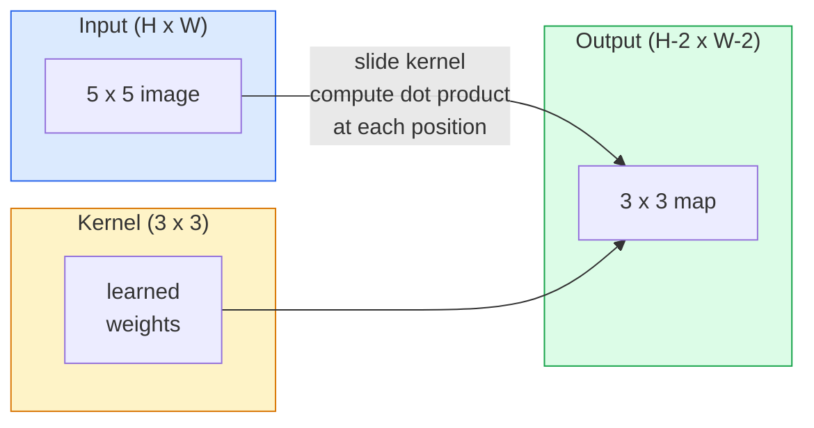
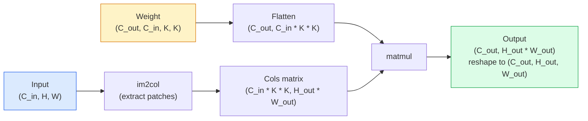

# 从零开始的转变

> 卷积是一个非常小的密集层,你把它滑过一张图像,并在每个位置共享相同的权重.

**Type:** Build
**Languages:** Python
**Prerequisites:** Phase 3 (Deep Learning Core), Phase 4 Lesson 01 (Image Fundamentals)
**Time:** ~75 分钟

## 学习目标
- 仅使用NumPy 从零实现2D卷积,包括嵌套循环 版本和向量化 `im2col`版本
- 针对输入尺寸,内核尺寸,和步骤的任意组合,计算输出空间尺寸,并解释`(H - K + 2P) / S + 1`公式为什么成立
- 并且解释为什么会产生应对激活的模式
- 将曲堆积成一个特征提取器,并将堆积深度与接收场的大小联系在一起

## 问题
在一张224x224 RGB 图像上使用完全连接的层,每个神经元需要224 *224 *3 = 150,528个输入权重.一个只有1000个单元的隐藏层已经有15亿个参数,而且这还是在你学到任何有用的东西之前.更糟糕的是,这个层不知道左上角的狗和右下角的狗是相同的模式. 它把每个图像位置都视为相互独立的对象,但这对图像相对恰恰是错误的:把一个猫移动三个图像,不应该迫使网络重新学习这个概念.

图像模型需要两个性质:**translation equivariance**(输入移动时输出也随其移动) 和 **parameter sharing**两者都不给你转 两者都天然具备――

转变并不是为深度学习而发明的. 它也是JPEG压缩,Photoshop中高斯模糊,工业视觉中的边缘检测,以及几乎所有音频过器背后的同样的操作.CNN在2012年至2020年主导ImageNet的原因是,转变是适合这种类型的数据的正确先验:相邻值相互相关,同样的模式可以出现在任何位置.

## 概念
### 一个核子,滑动

2D卷积将取一个称为内核的小重量矩阵,将它滑过输入,并在每个位置计算每个元素乘积和.



具体的3x3示例,输入为5x5 ((无,步骤1):

```
Input X (5 x 5):                Kernel W (3 x 3):

  1  2  0  1  2                   1  0 -1
  0  1  3  1  0                   2  0 -2
  2  1  0  2  1                   1  0 -1
  1  0  2  1  3
  2  1  1  0  1

The kernel slides across every valid 3 x 3 window. Output Y is 3 x 3:

 Y[0,0] = sum( W * X[0:3, 0:3] )
 Y[0,1] = sum( W * X[0:3, 1:4] )
 Y[0,2] = sum( W * X[0:3, 2:5] )
 Y[1,0] = sum( W * X[1:4, 0:3] )
 ... and so on
```

这是一个公式,也就是说**shared weights、locality、sliding window**其他一切都是会计.

### 输出尺寸公式

给定输入空间尺寸`H`、核子尺寸`K`接`P`步行`S`其他:

```
H_out = floor( (H - K + 2P) / S ) + 1
```

记住它. 你会在每个建筑中计算它几十次.

| Scenario | H | K | P | S | H_out |
|----------|---|---|---|---|-------|
| Valid conv，无 padding | 32 | 3 | 0 | 1 | 30 |
| Same conv（保持尺寸） | 32 | 3 | 1 | 1 | 32 |
| 按 2 倍 downsample | 32 | 3 | 1 | 2 | 16 |
| Pool 2x2 | 32 | 2 | 0 | 2 | 16 |
| 大 receptive field | 32 | 7 | 3 | 2 | 16 |

"同样的填充"的意思是选择P,使当S == 1 时 H_out == H。对奇数K,也就是P = (K - 1) / 2。这就是为什么3x3核占主导地位:它们仍然拥有中心点的最小奇数核。

### 子

没有填充时,每次卷积都会缩小特征地图――堆积20个之后,你的224x224图像会变成184x184,这既浪费了边界计算,也会让需要匹配的形状的残余连接变得复杂――

```
Zero padding (P = 1) on a 5 x 5 input:

  0  0  0  0  0  0  0
  0  1  2  0  1  2  0
  0  0  1  3  1  0  0
  0  2  1  0  2  1  0       Now the kernel can centre on pixel
  0  1  0  2  1  3  0       (0, 0) and still have three rows and
  0  2  1  1  0  1  0       three columns of values to multiply.
  0  0  0  0  0  0  0
```

实践中会遇到的模式:`zero`现在,我们要做什么?`reflect`(镜像边缘,在生成模型中避免硬边界)`replicate`没有任何其他方法.`circular`(环绕,在形问题中使用)

### 步骤

步骤是滑动的步长.`stride=1`是默认的.`stride=2`让空间维度减半,在CNN内部不使用单独的聚合层,而进行下样本的经典方式.

```
Stride 1 on a 5 x 5 input, 3 x 3 kernel:

  starts: (0,0) (0,1) (0,2)        -> output row 0
          (1,0) (1,1) (1,2)        -> output row 1
          (2,0) (2,1) (2,2)        -> output row 2

  Output: 3 x 3

Stride 2 on the same input:

  starts: (0,0) (0,2)              -> output row 0
          (2,0) (2,2)              -> output row 1

  Output: 2 x 2
```

### 多个输入道

真实图像有三个通道――RGB 输入上的3x3卷积 实际上是一个3x3x3体积:每个输入通道有一个3x3切片――在每个空间位置上,你将对三个切片进行乘法和求和,并加上偏差――

```
Input:   (C_in,  H,  W)        3 x 5 x 5
Kernel:  (C_in,  K,  K)        3 x 3 x 3 (one kernel)
Output:  (1,     H', W')       2D map

For a layer that produces C_out output channels, you stack C_out kernels:

Weight:  (C_out, C_in, K, K)   e.g. 64 x 3 x 3 x 3
Output:  (C_out, H', W')       64 x 3 x 3

Parameter count: C_out * C_in * K * K + C_out   (the + C_out is biases)
```

最后一行是你规划模型时会计算的内容.`64 * 3 * 3 * 3 + 64 = 1,792`个参数――很便宜――

### 们的法

嵌套循环 很容易读,但很慢.GPU 想要的是大型矩阵乘法.技巧是:把输入在每个接收场窗口中 展平为一个大矩阵的一列,把内核展平为一行,于是整个卷积就变成了一个矩阵.



每个生产级 conv 实现都是这个思路加上缓存造技巧的某种变体

### 接收场

单个3x3 conv 会查看9个输入像素――堆叠两个3x3 conv,第二层中的一个神经元 会查看5x5 输入像素――三个3x3 conv 给出7x7――一般来说:

```
RF after L stacked K x K convs (stride 1) = 1 + L * (K - 1)

With strides:   RF grows multiplicatively with stride along each layer.
```

由于"一路3x3" (VGG、ResNet、ConvNeXt) 的基本原因是,两个3x3的输入区域与一个5x5的输入区域相似,但参数较小,中间多一个非线性.


```figure
convolution-kernel
```

## 构建它
### 步骤1: 置一个阵列

从最小的原始式开始:一个在H x W数组周围补零的函数.

```python
import numpy as np

def pad2d(x, p):
    if p == 0:
        return x
    h, w = x.shape[-2:]
    out = np.zeros(x.shape[:-2] + (h + 2 * p, w + 2 * p), dtype=x.dtype)
    out[..., p:p + h, p:p + w] = x
    return out

x = np.arange(9).reshape(3, 3)
print(x)
print()
print(pad2d(x, 1))
```

后行轴 技巧 `x.shape[:-2]`意思是,同一个函数无需修改就可以发挥作用.`(H, W)`,我知道.`(C, H, W)`或`(N, C, H, W)`,我知道.

### 步骤2:使用嵌套循环实现2D卷积

参考实现:慢,但毫不含糊.`torch.nn.functional.conv2d`做什么事.

```python
def conv2d_naive(x, w, b=None, stride=1, padding=0):
    c_in, h, w_in = x.shape
    c_out, c_in_w, kh, kw = w.shape
    assert c_in == c_in_w

    x_pad = pad2d(x, padding)
    h_out = (h + 2 * padding - kh) // stride + 1
    w_out = (w_in + 2 * padding - kw) // stride + 1

    out = np.zeros((c_out, h_out, w_out), dtype=np.float32)
    for oc in range(c_out):
        for i in range(h_out):
            for j in range(w_out):
                hs = i * stride
                ws = j * stride
                patch = x_pad[:, hs:hs + kh, ws:ws + kw]
                out[oc, i, j] = np.sum(patch * w[oc])
        if b is not None:
            out[oc] += b[oc]
    return out
```

子子子子子子子子子子子子子子子子子子子子子子子子子子子子子子子子子子子子子子子子子子子子子子子子子子子子子子子子子子子子子子子子子子子子子子子子子子子子子子子子子子子子子子子子子子子子子子子子子子子子子子子子子子子子子子子子子子子子子子子子子子子子子子子子子子子子子

### 步骤3: 用手工设计的内核验证

构建一个垂直的索贝尔内核,把它应用到一张合成步骤图像上,然后观察垂直边缘被点亮.

```python
def synthetic_step_image():
    img = np.zeros((1, 16, 16), dtype=np.float32)
    img[:, :, 8:] = 1.0
    return img

sobel_x = np.array([
    [[-1, 0, 1],
     [-2, 0, 2],
     [-1, 0, 1]]
], dtype=np.float32)[None]

x = synthetic_step_image()
y = conv2d_naive(x, sobel_x, padding=1)
print(y[0].round(1))
```

预期在第7列出现更大的正值 ((从左到右增加亮度),其他位置为零――这个印记就是你确认数学正确的智力检查――

### 步骤 4: im2col

把输入中每个内核大小的窗口转换为矩阵的一列.`C_in=3, K=3`每一列都是27个数字.

```python
def im2col(x, kh, kw, stride=1, padding=0):
    c_in, h, w = x.shape
    x_pad = pad2d(x, padding)
    h_out = (h + 2 * padding - kh) // stride + 1
    w_out = (w + 2 * padding - kw) // stride + 1

    cols = np.zeros((c_in * kh * kw, h_out * w_out), dtype=x.dtype)
    col = 0
    for i in range(h_out):
        for j in range(w_out):
            hs = i * stride
            ws = j * stride
            patch = x_pad[:, hs:hs + kh, ws:ws + kw]
            cols[:, col] = patch.reshape(-1)
            col += 1
    return cols, h_out, w_out
```

它仍然是Python循环,但现在繁重的计算将变成一个向量化数学.

### 步骤5:通过 im2col + matmul 实现快速调整

用一次矩阵乘法 替换四倍循环.

```python
def conv2d_im2col(x, w, b=None, stride=1, padding=0):
    c_out, c_in, kh, kw = w.shape
    cols, h_out, w_out = im2col(x, kh, kw, stride, padding)
    w_flat = w.reshape(c_out, -1)
    out = w_flat @ cols
    if b is not None:
        out += b[:, None]
    return out.reshape(c_out, h_out, w_out)
```

正确性检查:运行两个实现并比较.

```python
rng = np.random.default_rng(0)
x = rng.normal(0, 1, (3, 16, 16)).astype(np.float32)
w = rng.normal(0, 1, (8, 3, 3, 3)).astype(np.float32)
b = rng.normal(0, 1, (8,)).astype(np.float32)

y_naive = conv2d_naive(x, w, b, padding=1)
y_im2col = conv2d_im2col(x, w, b, padding=1)

print(f"max abs diff: {np.max(np.abs(y_naive - y_im2col)):.2e}")
```

`max abs diff`应该在`1e-5`左右──这种差异来自浮点累加顺序,不是 bug──

### 步骤 6:一组手工设计的核心

五个过器,展示一个层,在任何训练之前就能表达什么.

```python
KERNELS = {
    "identity": np.array([[0, 0, 0], [0, 1, 0], [0, 0, 0]], dtype=np.float32),
    "blur_3x3": np.ones((3, 3), dtype=np.float32) / 9.0,
    "sharpen": np.array([[0, -1, 0], [-1, 5, -1], [0, -1, 0]], dtype=np.float32),
    "sobel_x": np.array([[-1, 0, 1], [-2, 0, 2], [-1, 0, 1]], dtype=np.float32),
    "sobel_y": np.array([[-1, -2, -1], [0, 0, 0], [1, 2, 1]], dtype=np.float32),
}

def apply_kernel(img2d, kernel):
    x = img2d[None].astype(np.float32)
    w = kernel[None, None]
    return conv2d_im2col(x, w, padding=1)[0]
```

应用到任意的灰度图像上时,模糊会柔化,尖会让边缘更清晰,Sobel-x 会点亮垂直边缘,Sobel-y 会点亮水平边缘──这些正是AlexNet和VGG中第一个训练出来的 conv层 最终学到的模式,因为优秀的图像模型无论后续任务是什么,都需要边缘和斑探测器──

## 使用它
皮托尔奇的`nn.Conv2d`用自动化,CUDA核和cuDNN优化 包装了同一个操作.

```python
import torch
import torch.nn as nn

conv = nn.Conv2d(in_channels=3, out_channels=64, kernel_size=3, stride=1, padding=1)
print(conv)
print(f"weight shape: {tuple(conv.weight.shape)}   # (C_out, C_in, K, K)")
print(f"bias shape:   {tuple(conv.bias.shape)}")
print(f"param count:  {sum(p.numel() for p in conv.parameters())}")

x = torch.randn(8, 3, 224, 224)
y = conv(x)
print(f"\ninput  shape: {tuple(x.shape)}")
print(f"output shape: {tuple(y.shape)}")
```

让我`padding=1`换成`padding=0`输出到222x222的.`stride=1`换成`stride=2`输出到112x112......就是你记住的同一个公式.

## 交付它
本课会产出:

- `outputs/prompt-cnn-architect.md`给定输入大小,参数预算和目标接收场, 后,设计一组`Conv2d`并且每一步都使用正确的K/S/P──
- `outputs/skill-conv-shape-calculator.md`技术:一个技能,逐层遍历网络规格,并返回每个区块的输出形状、接收场和参数数量──

## 练习
1. **(Easy)**给定一个128x128灰色尺度输入,以及一组`[Conv3x3(s=1,p=1), Conv3x3(s=2,p=1), Conv3x3(s=1,p=1), Conv3x3(s=2,p=1)]`通过一个由模拟传输器组成的 PyTorch 计算出每个层的输出空间尺寸和接收场`nn.Sequential`进行验证.
2. **(Medium)**扩展`conv2d_naive`和 `conv2d_im2col`让他们接受`groups`参数――证明`groups=C_in=C_out`可以复现深度曲,并且它的参数数是`C * K * K`没有什么.`C * C * K * K`,我知道.
3. **(Hard)**手工实现`conv2d_im2col`的倒退通过:给定输出梯度,计算`x`和 `w`分量与重量同样输入和重量`torch.autograd.grad`验证――关键技巧是:im2col的梯度是`col2im`并且必须加重窗户.

## 关键术语
| Term | What people say | What it actually means |
|------|----------------|----------------------|
| Convolution | “滑动一个 filter” | 一个在每个空间位置用 shared weights 应用的可学习 dot product；数学上是 cross-correlation，但大家都叫它 convolution |
| Kernel / filter | “feature detector” | 一个形状为 (C_in, K, K) 的小型 weight tensor，它与输入窗口的 dot product 会产生一个输出像素 |
| Stride | “每次跳多远” | 连续 kernel placements 之间的步长；stride 2 会让每个空间维度减半 |
| Padding | “边缘上的零” | 在输入周围添加的额外值，使 kernel 可以以边界像素为中心；`same` padding 会让输出尺寸等于输入尺寸 |
| Receptive field | “neuron 能看到多少” | 某个输出 activation 所依赖的原始输入 patch，会随着深度和 stride 增长 |
| im2col | “GEMM trick” | 把每个 receptive window 重排成列，让 convolution 变成一次大型 matrix multiply，这是每个快速 conv kernel 的核心 |
| Depthwise conv | “每个 channel 一个 kernel” | 一个满足 `groups == C_in` 的 conv，每个输出 channel 只由匹配的输入 channel 计算得到；是 MobileNet 和 ConvNeXt 的 backbone |
| Translation equivariance | “输入平移，输出平移” | 输入平移 k 个像素时，输出也平移 k 个像素的性质；shared weights 天然带来这个性质 |

## 延伸阅读
- [A guide to convolution arithmetic for deep learning (Dumoulin & Visin, 2016)](https://arxiv.org/abs/1603.07285) 每门课程都会借鉴的补/步骤/扩张 权威图解
- [CS231n: Convolutional Neural Networks for Visual Recognition](https://cs231n.github.io/convolutional-networks/) 经典讲座笔记,包括最初的 im2col 解释
- [The Annotated ConvNet (fast.ai)](https://nbviewer.org/github/fastai/fastbook/blob/master/13_convolutions.ipynb) 一个从手写卷曲走到训练数字分类器的笔记本
- [Receptive Field Arithmetic for CNNs (Dang Ha The Hien)](https://distill.pub/2019/computing-receptive-fields/) 具备论文级质量的接收场 计算交互式讲解器
