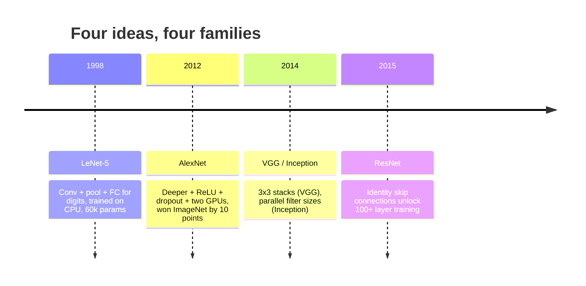
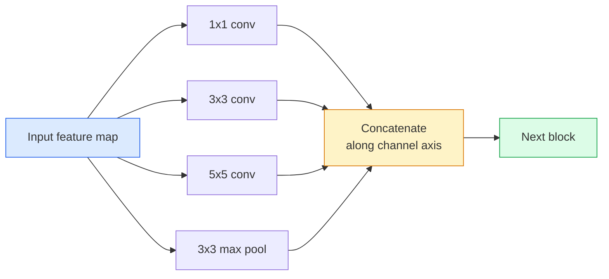
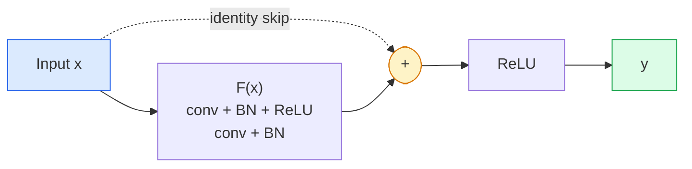

# 网络网络网到resnet

> 过去三十年中,每个重要的CNN本质上都是同一个非线性下样本,再加上一个新想法.

**Type:** 学习 + 构建
**Languages:** Python
**先修要求：**阶段3课11 (PyTorch),阶段4课01 (图像基础),阶段4课02 (从零开始转变)
**Time:** ~75 分钟

## 学习目标
- 追踪LeNet-5 -> AlexNet -> VGG -> 创始 -> ResNet的架构谱系,并说明每个家庭贡献的单一新想法
- 在 PyTorch 中实现 LeNet-5、一个VGG风格区块,以及一个ResNet BasicBlock,每个控制在40行内
- 解释为什么剩余连接可以把一个无法训练的1000层网络变成最先进的
- 阅读一个现代脊柱 (ResNet-18,ResNet-50),查看源码前预测它的输出形状、接收场和参数数

## 问题
2011年,最佳图像网分类器的前五个准确度大约是74%.2012年亚历克斯网达到85%――2015年,ResNet达到96%――没有新数据――没有新一代GPU――提升来自架构想法――一个能工作的视觉工程师必须知道哪个想法来自哪个论文,因为你在2026年发布的每个生产后台都是这些相同的组件的重组;也因为这些想法会持续迁移:集成的传输从CNN转移到变压器,从ResNet转移到现存的每个LLM,批量规范化存在于现有传播模型中.

按顺序学习这些网络也能让你避免一个常见错误:在LeNet大小网络就能解决问题时,直接使用可用的最大模型――MNIST不需要ResNet――了解每个家庭的规模曲线,能告诉你应该落在曲线的位置――

## 概念
### 改变视觉的四个想法



在经典的视觉中,没有什么比这四次跃迁更重要.

### 雷内特-5 (1998)

延·莱昆的数字识别器60,000个参数.两个 conv-pool 块.两个完全连接的层.

```
input (1, 32, 32)
  conv 5x5 -> (6, 28, 28)
  avg pool 2x2 -> (6, 14, 14)
  conv 5x5 -> (16, 10, 10)
  avg pool 2x2 -> (16, 5, 5)
  flatten -> 400
  dense -> 120
  dense -> 84
  dense -> 10
```

现代世界所说的CNN,即交替转变和下样再接一个小型分类器头,本质上就是层数更多的频道更大的激活更好的LeNet──

### 亚历克斯网 (2012)

现在,我们已经开始了三次合作,

1. 用**ReLU**替代. . . . . . . .
2. 在完全连接的头 中使用 **Dropout**规范化变成了一个层,而不是一个技巧.
3. **Depth and width**五个合层,三个密集层,60M参数,在两个块GPU上训练,并把模型分成两个块卡上.

论文的图2仍然显示了GPU分区,即两条平行流. 这种平行是硬件层面的解决方案,而不是结构洞见.

### 美国"国际" (2014)

如果只使用3x3转折,并且不断加深,会发生什么?

```
stack:   conv 3x3 -> conv 3x3 -> pool 2x2
repeat:  16 or 19 conv layers
```

两个3x3孔的输入面积与一个5x5孔相似,但参数更少 (2*9*C^2 = 18C^2 vs 25*C^2),并且中间额外多一个 ReLU──VGG 把这个观察变成完整的结构──它的简单性,即一个块类型反复堆叠,让它成为所有结构的后一个参照点──

代价:138M参数,训练慢,推理 昂贵

### 创始 (2014,同年)

谷歌对我应该使用什么核子大小的回答是:全部并行使用.



每个分支都专门化:1x1用于道混合,3x3用于本地纹理,5x5用于更大的模式,聚合用于变量不变的特性;集成让下层选择任何有用的分支.

### 降解问题

到2015年,VGG-19 能工作,而VGG-32 不能.深度本应有帮助,但超过20层后,训练损失和测试损失都变得差异.

```
Plain deep network:
  y = f_L( f_{L-1}( ... f_1(x) ... ) )

Gradient wrt early layer:
  dL/dW_1 = dL/dy * df_L/df_{L-1} * ... * df_2/df_1 * df_1/dW_1

Each multiplicative term has magnitude roughly (weight magnitude) * (activation gain).
Stack 100 of them with gains < 1 and the gradient is effectively zero.
```

由于批量标准 (几乎同时发布) 让激活保持良好的尺度.

### 网页版

他,张,任,孙提出了一个解决一切的改变:

```
standard block:   y = F(x)
residual block:   y = F(x) + x
```

`+ x`表示层总能通过把`F(x)`推到零来选择什么都不做――一个1000层的ResNet现在最差也不会比1层网络差,因为每个额外的区块都有一个微不足道的逃生口――有这个保证,优化器愿意让每个区块变得*稍微*有用;而稍微有用的区块堆积100次,就是最先进的――



这块的两个变体可见:

- **BasicBlock**两艘3×3号船,跳过两者.
- **Bottleneck**升,跳过三者──当频道数量很高时更便宜──

当跳过时必须跨越下样本 (步骤=2) 时,身份路径会被替换为1x1步骤=2 conv,以匹配的形状.

### 为什么剩余的意思超越视觉

这一想法不是真正关注图像分类. 它关注的是将深层网络从祈祷 gradients 能生存下来变成可靠的可扩展工程工具.


```figure
pooling
```

## 构建它
### 步骤1: 雷Net-5

只有一个最少的和忠实的网络.`nn.CrossEntropyLoss`而不是原始的高斯人联系.

```python
import torch
import torch.nn as nn
import torch.nn.functional as F

class LeNet5(nn.Module):
    def __init__(self, num_classes=10):
        super().__init__()
        self.conv1 = nn.Conv2d(1, 6, kernel_size=5)
        self.conv2 = nn.Conv2d(6, 16, kernel_size=5)
        self.pool = nn.AvgPool2d(2)
        self.fc1 = nn.Linear(16 * 5 * 5, 120)
        self.fc2 = nn.Linear(120, 84)
        self.fc3 = nn.Linear(84, num_classes)

    def forward(self, x):
        x = self.pool(torch.tanh(self.conv1(x)))
        x = self.pool(torch.tanh(self.conv2(x)))
        x = torch.flatten(x, 1)
        x = torch.tanh(self.fc1(x))
        x = torch.tanh(self.fc2(x))
        return self.fc3(x)

net = LeNet5()
x = torch.randn(1, 1, 32, 32)
print(f"output: {net(x).shape}")
print(f"params: {sum(p.numel() for p in net.parameters()):,}")
```

预期产量:`output: torch.Size([1, 10])`现在`params: 61,706`这就是开启现代视觉的完整数字分类器.

### 步骤2: 一个VGG块

一个可复用块:两个3×3车,ReLU,批量标准,最大池.

```python
class VGGBlock(nn.Module):
    def __init__(self, in_c, out_c):
        super().__init__()
        self.conv1 = nn.Conv2d(in_c, out_c, kernel_size=3, padding=1)
        self.bn1 = nn.BatchNorm2d(out_c)
        self.conv2 = nn.Conv2d(out_c, out_c, kernel_size=3, padding=1)
        self.bn2 = nn.BatchNorm2d(out_c)
        self.pool = nn.MaxPool2d(2)

    def forward(self, x):
        x = F.relu(self.bn1(self.conv1(x)))
        x = F.relu(self.bn2(self.conv2(x)))
        return self.pool(x)

class MiniVGG(nn.Module):
    def __init__(self, num_classes=10):
        super().__init__()
        self.stack = nn.Sequential(
            VGGBlock(3, 32),
            VGGBlock(32, 64),
            VGGBlock(64, 128),
        )
        self.head = nn.Sequential(
            nn.AdaptiveAvgPool2d(1),
            nn.Flatten(),
            nn.Linear(128, num_classes),
        )

    def forward(self, x):
        return self.head(self.stack(x))

net = MiniVGG()
x = torch.randn(1, 3, 32, 32)
print(f"output: {net(x).shape}")
print(f"params: {sum(p.numel() for p in net.parameters()):,}")
```

在CIFAR大小输入上使用三个VGG块,一个适应池,一个线性层――约290k参数――对CIFAR-10已经足够――

### 步骤3:一个ResNet基本Block

据了解,该系统的核心构建块是ResNet-18和ResNet-34

```python
class BasicBlock(nn.Module):
    def __init__(self, in_c, out_c, stride=1):
        super().__init__()
        self.conv1 = nn.Conv2d(in_c, out_c, kernel_size=3, stride=stride, padding=1, bias=False)
        self.bn1 = nn.BatchNorm2d(out_c)
        self.conv2 = nn.Conv2d(out_c, out_c, kernel_size=3, stride=1, padding=1, bias=False)
        self.bn2 = nn.BatchNorm2d(out_c)
        if stride != 1 or in_c != out_c:
            self.shortcut = nn.Sequential(
                nn.Conv2d(in_c, out_c, kernel_size=1, stride=stride, bias=False),
                nn.BatchNorm2d(out_c),
            )
        else:
            self.shortcut = nn.Identity()

    def forward(self, x):
        out = F.relu(self.bn1(self.conv1(x)))
        out = self.bn2(self.conv2(out))
        out = out + self.shortcut(x)
        return F.relu(out)
```

层上层`bias=False`是一个批量规范惯例,因为BN的beta参数已经处理了偏差,所以同时带着 conv偏差是浪费.`shortcut`才需要真正的认同,否则它就是一个无需的身份.

### 步骤4:一个小的ResNet

堆叠四组基本块,得到一个适合CIFAR大小输入的可工作ResNet.

```python
class TinyResNet(nn.Module):
    def __init__(self, num_classes=10):
        super().__init__()
        self.stem = nn.Sequential(
            nn.Conv2d(3, 32, kernel_size=3, stride=1, padding=1, bias=False),
            nn.BatchNorm2d(32),
            nn.ReLU(inplace=True),
        )
        self.layer1 = self._make_group(32, 32, num_blocks=2, stride=1)
        self.layer2 = self._make_group(32, 64, num_blocks=2, stride=2)
        self.layer3 = self._make_group(64, 128, num_blocks=2, stride=2)
        self.layer4 = self._make_group(128, 256, num_blocks=2, stride=2)
        self.head = nn.Sequential(
            nn.AdaptiveAvgPool2d(1),
            nn.Flatten(),
            nn.Linear(256, num_classes),
        )

    def _make_group(self, in_c, out_c, num_blocks, stride):
        blocks = [BasicBlock(in_c, out_c, stride=stride)]
        for _ in range(num_blocks - 1):
            blocks.append(BasicBlock(out_c, out_c, stride=1))
        return nn.Sequential(*blocks)

    def forward(self, x):
        x = self.stem(x)
        x = self.layer1(x)
        x = self.layer2(x)
        x = self.layer3(x)
        x = self.layer4(x)
        return self.head(x)

net = TinyResNet()
x = torch.randn(1, 3, 32, 32)
print(f"output: {net(x).shape}")
print(f"params: {sum(p.numel() for p in net.parameters()):,}")
```

通过下载,每次下载样本 时频道数量翻倍.

### 步骤5:比较参数到特征的效率

通过三个网络输入相同的输入,并比较参数数量.

```python
def summary(name, net, x):
    y = net(x)
    params = sum(p.numel() for p in net.parameters())
    print(f"{name:12s}  input {tuple(x.shape)} -> output {tuple(y.shape)}  params {params:>10,}")

x = torch.randn(1, 3, 32, 32)
summary("LeNet5",     LeNet5(),       torch.randn(1, 1, 32, 32))
summary("MiniVGG",    MiniVGG(),      x)
summary("TinyResNet", TinyResNet(),   x)
```

对于CIFAR-10的精度,训练几个时代 后大致需要:LeNet 60%,MiniVGG 89%,TinyResNet 93%──

## 使用它
`torchvision.models`提供上述所有模型的预训练版本.不同家族的呼叫签名完全一致,这正是脊柱抽象的意义.

```python
from torchvision.models import resnet18, ResNet18_Weights, vgg16, VGG16_Weights

r18 = resnet18(weights=ResNet18_Weights.IMAGENET1K_V1)
r18.eval()

print(f"ResNet-18 params: {sum(p.numel() for p in r18.parameters()):,}")
print(r18.layer1[0])
print()

v16 = vgg16(weights=VGG16_Weights.IMAGENET1K_V1)
v16.eval()
print(f"VGG-16   params: {sum(p.numel() for p in v16.parameters()):,}")
```

由于其存在的差异,RESNET-18具有11.7M参数.VGG-16具有138M. 图像网的前一级准确性接近 (69.8%对比71.6%) 剩余连接给你带来12倍的参数效率.

对于转移学习,配方始终相同:预训练的负载,结脊柱,替换分类器头.

```python
for p in r18.parameters():
    p.requires_grad = False
r18.fc = nn.Linear(r18.fc.in_features, 10)
```

现在你拥有10级CIFAR分类器,它继承了ImageNet训练的表示.

## 交付它
本课会产出:

- `outputs/prompt-backbone-selector.md`根据任务,数据集大小和计算预算, 选择适合CNN家庭 (LeNet/VGG/ResNet/MobileNet/ConvNeXt) 👇
- `outputs/skill-residual-block-reviewer.md`时缺少快捷方式、快捷方式激活顺序、BN 相对于添加位置)

## 练习
1. **(Easy)**手动逐层计算`TinyResNet`参数`sum(p.numel() for p in net.parameters())`对于参数预算的主要部分是哪里,是convsBN还是分类器主?
2. **(Medium)**实现瓶区块 (1x1 -> 3x3 -> 1x1与跳转),并使用它构建一个面向CIFAR的ResNet-50式网络.`TinyResNet`对于比较.
3. **(Hard)**从`BasicBlock`中移除跳转连接,在CIFAR-10 上分别训练一个34块的"平坦"网络和一个34块的ResNet,各训练10个时代――绘制二者的训练损失与时代――复现

## 关键术语
| Term | What people say | What it actually means |
|------|----------------|----------------------|
| Backbone | “模型” | 产生 feature map 并馈送给 task head 的 convolutional blocks 堆栈 |
| Residual connection | “Skip connection” | `y = F(x) + x`；通过将 F 设为零，让 Optimizer 学习 identity，从而让任意 depth 可训练 |
| BasicBlock | “两个带 skip 的 3x3 convs” | ResNet-18/34 的 building block：conv-BN-ReLU-conv-BN-add-ReLU |
| Bottleneck | “1x1 down，3x3，1x1 up” | ResNet-50/101/152 block；在高 channel counts 下成本低，因为 3x3 运行在缩减后的 width 上 |
| Degradation problem | “更深反而更差” | 超过约 20 个 plain conv layers 后，training error 和 test error 都会增加；由 residual connections 解决，而不是靠更多数据 |
| Stem | “第一层” | 将 3-channel input 转换为基础 feature width 的初始 conv；ImageNet 通常是 7x7 stride 2，CIFAR 通常是 3x3 stride 1 |
| Head | “分类器” | final backbone block 之后的 layers：adaptive pool、flatten、linear(s) |
| Transfer learning | “Pretrained weights” | 加载在 ImageNet 上训练过的 backbone，并且只在你的 task 上 fine-tune head |

## 延伸阅读
- [Deep Residual Learning for Image Recognition (He et al., 2015)](https://arxiv.org/abs/1512.03385)ResNet论文;每张图都值得研究
- [Very Deep Convolutional Networks (Simonyan & Zisserman, 2014)](https://arxiv.org/abs/1409.1556) VGG论文;仍然是理解为什么是3x3的最佳参考
- [ImageNet Classification with Deep CNNs (Krizhevsky et al., 2012)](https://papers.nips.cc/paper_files/paper/2012/hash/c399862d3b9d6b76c8436e924a68c45b-Abstract.html) AlexNet;终结手工制作的功能 时代的论文
- [Going Deeper with Convolutions (Szegedy et al., 2014)](https://arxiv.org/abs/1409.4842) 开始 v1;仍然会出现视觉变换器 中的平行过器 想法
