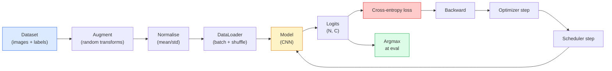

# 图像分类

> 类别是从像素到类的概率分布的函数.

**Type:** Build
**Languages:** Python
**Prerequisites:** Phase 2 Lesson 09 (Model Evaluation), Phase 3 Lesson 10 (Mini Framework), Phase 4 Lesson 03 (CNNs)
**Time:** ~75 minutes

## 学习目标

- 在CIFAR-10上构建端到端图像分类管道:数据集,增长,模型,培训循环,评估
- 解释每个组件的作用 ((数据加载器、损失、优化器、安排器、增加),并预测其中任何一个出错会如何体现的损失曲线上
- 从零实现混合,切割和标签滑滑,并说明什么时候值得加入它们
- 阅读混矩阵 和每类精度/召回表,使用总准确度 之外的信息诊断数据集与模型的失败模式

## 问题

每一个最终上线的视觉任务,在某种层面上都归结为图像分类.检测会对区域进行分类.分类会对像素进行分类.检索会根据类中心的相似度排序进行分类.分类做对,也就是对数据集循环进行增长政策,损失,评估做对,是这一阶段可以转移到所有其他任务的核心能力.

大多数分类错误不存在模型里.它们存在于管道中:损坏的正常化,没有混的训练集,会扭曲标签的增长,被训练数据扭曲的标签,污染的验证分化,在30个时代之后散的学习率.一个正确设置下可以在CIFAR-10上达到93%的CNN,在损坏设置下通常只能得到70-75%,而损失曲线看起来全程都是合理的.

让每个部分都能被检查.`torchvision.datasets`任何可能隐藏的东西.

## 核心概念

### 类别管道



通过透,接收原始的输出,而不是软max输出,所以在损失之前做任何事情.`model(x).softmax()`增加仅应用于输入,不应用于标签,除了混合,因为它会同时混合二者.`optimizer.zero_grad()`必须每一步都执行一次;跳过它会积累渐进,看起来就像学习速度极不稳定.

### 交叉化 和软max

分类器 会为每张图像产生`C`个数字,称为逻辑.应用软max 会将它们转换为概率分布:

```
softmax(z)_i = exp(z_i) / sum_j exp(z_j)
```

跨体的正确类的负记录概率:

```
CE(z, y) = -log( softmax(z)_y )
        = -z_y + log( sum_j exp(z_j) )
```

右侧形式是数值稳定的形式(log-sum-exp) ・PyTorch 的 `nn.CrossEntropyLoss`由于你计算的是log(softmax(softmax(z)) ,这是一个没有意义的量──

### 为什么增长有效

对于翻译的引偏见 (来自重量分享),但对作物,翻转,色彩的动或动没有内置变异性.教会它这些变异的唯一方法是让它能够体现这些变化的像素.

```
Original crop:  "dog facing left"
Flip:           "dog facing right"       <- same label, different pixels
Rotate(+15):    "dog, slight tilt"
Colour jitter:  "dog in warmer light"
RandomErasing:  "dog with patch missing"
```

规则是:增强必须保留标签.对数字做切割和旋转可能将6 变成9;对于这种数据集,你需要使用更小的旋转范围,并选择尊重数字特定的不变的增强.

### 混合和切割混合

常见的增强会转换像素,但保持标签为一个热点.**Mixup**和 **cutmix**通过同时插入两个值来打破这一点.

```
Mixup:
  lambda ~ Beta(a, a)
  x = lambda * x_i + (1 - lambda) * x_j
  y = lambda * y_i + (1 - lambda) * y_j

Cutmix:
  paste a random rectangle of x_j into x_i
  y = area-weighted mix of y_i and y_j
```

它有什么帮助:模型不再记住尖端的热门目标,而是学习在课堂之间插值.

### 标签滑滑

混的亲近.`[0, 0, 1, 0, 0]`作为训练目标,而用`[eps/C, eps/C, 1-eps, eps/C, eps/C]`在其中`eps`它阻止模型产生任意尖的定位,并且几乎零成本地改善校准.`nn.CrossEntropyLoss(label_smoothing=0.1)`,我知道.

### 精度之外的评估

总的准确性会掩盖失衡. 如果永远预测多数类,也能得到90%.

- **Per-class accuracy** 每个类别一个数字;会立即暴露表现不足的类别.
- **Confusion matrix** C x C 格,其中行 i col j = true class i 被预测为类 j 的数量;直角是正确预测,离线是模型 问题所在──
- **Top-1 / Top-5** 正确的类是不是在前1或前5预测中;前5对ImageNet很重要,因为像Norwich Terrier和Norfolk Terrier这样的类型确实存在差异.
- **Calibration (ECE)** 0.8 的信心预测是否真的有80%的时间是正确的?现代网络 系统性地过于自信;可以使用温度扩展或标签滑滑修饰.


```figure
receptive-field
```

## 构建它

### 步骤1:确定性的合成数据集

为了让本课程可复现且快速,我们构建了一个看起来像CIFAR的合成数据集,也就是带着类型特定的结构,模型必须学习的32x32RGB图像.

```python
import numpy as np
import torch
from torch.utils.data import Dataset


def synthetic_cifar(num_per_class=1000, num_classes=10, seed=0):
    rng = np.random.default_rng(seed)
    X = []
    Y = []
    for c in range(num_classes):
        centre = rng.uniform(0, 1, (3,))
        freq = 2 + c
        for _ in range(num_per_class):
            yy, xx = np.meshgrid(np.linspace(0, 1, 32), np.linspace(0, 1, 32), indexing="ij")
            r = np.sin(xx * freq) * 0.5 + centre[0]
            g = np.cos(yy * freq) * 0.5 + centre[1]
            b = (xx + yy) * 0.5 * centre[2]
            img = np.stack([r, g, b], axis=-1)
            img += rng.normal(0, 0.08, img.shape)
            img = np.clip(img, 0, 1)
            X.append(img.astype(np.float32))
            Y.append(c)
    X = np.stack(X)
    Y = np.array(Y)
    idx = rng.permutation(len(X))
    return X[idx], Y[idx]


class ArrayDataset(Dataset):
    def __init__(self, X, Y, transform=None):
        self.X = X
        self.Y = Y
        self.transform = transform

    def __len__(self):
        return len(self.X)

    def __getitem__(self, i):
        img = self.X[i]
        if self.transform is not None:
            img = self.transform(img)
        img = torch.from_numpy(img).permute(2, 0, 1)
        return img, int(self.Y[i])
```

每个类都有自己的颜色调和频率模式,再加上高斯噪音,迫使模型学习信号,而不是记忆像素.

### 步骤2:规范化和增强

每个视觉管道都有这两个变化.

```python
def standardize(mean, std):
    mean = np.array(mean, dtype=np.float32)
    std = np.array(std, dtype=np.float32)
    def _fn(img):
        return (img - mean) / std
    return _fn


def random_hflip(p=0.5):
    def _fn(img):
        if np.random.random() < p:
            return img[:, ::-1, :].copy()
        return img
    return _fn


def random_crop(pad=4):
    def _fn(img):
        h, w = img.shape[:2]
        padded = np.pad(img, ((pad, pad), (pad, pad), (0, 0)), mode="reflect")
        y = np.random.randint(0, 2 * pad)
        x = np.random.randint(0, 2 * pad)
        return padded[y:y + h, x:x + w, :]
    return _fn


def compose(*fns):
    def _fn(img):
        for fn in fns:
            img = fn(img)
        return img
    return _fn
```

在作物之前使用反射板,而不是零板,因为黑边框是一种信号,模型会以一种无用的方式忽略它.

### 步骤3:混合

在训练阶段,它实现了批量转换,因此它位于前进传递附近,而不是数据集内部.

```python
def mixup_batch(x, y, num_classes, alpha=0.2):
    if alpha <= 0:
        return x, torch.nn.functional.one_hot(y, num_classes).float()
    lam = float(np.random.beta(alpha, alpha))
    idx = torch.randperm(x.size(0), device=x.device)
    x_mixed = lam * x + (1 - lam) * x[idx]
    y_onehot = torch.nn.functional.one_hot(y, num_classes).float()
    y_mixed = lam * y_onehot + (1 - lam) * y_onehot[idx]
    return x_mixed, y_mixed


def soft_cross_entropy(logits, soft_targets):
    log_probs = torch.log_softmax(logits, dim=-1)
    return -(soft_targets * log_probs).sum(dim=-1).mean()
```

`soft_cross_entropy`针对软标签分布的跨化. 当目标恰好是一个热时,它会退化为一个热的情况.

### 步骤4:训练循环

完整配方:遍历一次数据,每个批次 计算一次梯度,每个时代 执行一次规划步骤──

```python
import torch
import torch.nn as nn
from torch.utils.data import DataLoader
from torch.optim import SGD
from torch.optim.lr_scheduler import CosineAnnealingLR

def train_one_epoch(model, loader, optimizer, device, num_classes, use_mixup=True):
    model.train()
    total, correct, loss_sum = 0, 0, 0.0
    for x, y in loader:
        x, y = x.to(device), y.to(device)
        if use_mixup:
            x_m, y_soft = mixup_batch(x, y, num_classes)
            logits = model(x_m)
            loss = soft_cross_entropy(logits, y_soft)
        else:
            logits = model(x)
            loss = nn.functional.cross_entropy(logits, y, label_smoothing=0.1)
        optimizer.zero_grad()
        loss.backward()
        optimizer.step()
        loss_sum += loss.item() * x.size(0)
        total += x.size(0)
        # Training accuracy vs the un-mixed labels `y` is only an approximation
        # when mixup is on (the model saw soft targets, not y). Treat it as a
        # rough progress signal; rely on val accuracy for real performance.
        with torch.no_grad():
            pred = logits.argmax(dim=-1)
            correct += (pred == y).sum().item()
    return loss_sum / total, correct / total


@torch.no_grad()
def evaluate(model, loader, device, num_classes):
    model.eval()
    total, correct = 0, 0
    loss_sum = 0.0
    cm = torch.zeros(num_classes, num_classes, dtype=torch.long)
    for x, y in loader:
        x, y = x.to(device), y.to(device)
        logits = model(x)
        loss = nn.functional.cross_entropy(logits, y)
        pred = logits.argmax(dim=-1)
        for t, p in zip(y.cpu(), pred.cpu()):
            cm[t, p] += 1
        loss_sum += loss.item() * x.size(0)
        total += x.size(0)
        correct += (pred == y).sum().item()
    return loss_sum / total, correct / total, cm
```

每次编写训练循环时,必须检查五种变量:

1. 培训前调用 `model.train()`评价前调用 `model.eval()`这会改变退出和批量规范的行为.
2. 在`.backward()`前调用 `.zero_grad()`,我知道.
3. 累积指标 时使用 `.item()`这样不会让计算图直存活.
4. 期间使用`@torch.no_grad()`节省内存和时间,防止微小事故.
5. 对于原始的逻辑做 argmax,而不是对软max做 argmax,结果相同,少一个 op──

### 步骤 5:组装起来

使用上一课的`TinyResNet`训练几个时代,然后评估.

```python
from main import synthetic_cifar, ArrayDataset
from main import standardize, random_hflip, random_crop, compose
from main import mixup_batch, soft_cross_entropy
from main import train_one_epoch, evaluate
# TinyResNet comes from the previous lesson (03-cnns-lenet-to-resnet).
# Adjust the import path to wherever you stored the previous lesson's code.
from cnns_lenet_to_resnet import TinyResNet  # example placeholder

X, Y = synthetic_cifar(num_per_class=500)
split = int(0.9 * len(X))
X_train, Y_train = X[:split], Y[:split]
X_val, Y_val = X[split:], Y[split:]

mean = [0.5, 0.5, 0.5]
std = [0.25, 0.25, 0.25]
train_tf = compose(random_hflip(), random_crop(pad=4), standardize(mean, std))
eval_tf = standardize(mean, std)

train_ds = ArrayDataset(X_train, Y_train, transform=train_tf)
val_ds = ArrayDataset(X_val, Y_val, transform=eval_tf)

train_loader = DataLoader(train_ds, batch_size=128, shuffle=True, num_workers=0)
val_loader = DataLoader(val_ds, batch_size=256, shuffle=False, num_workers=0)

device = "cuda" if torch.cuda.is_available() else "cpu"
model = TinyResNet(num_classes=10).to(device)
optimizer = SGD(model.parameters(), lr=0.1, momentum=0.9, weight_decay=5e-4, nesterov=True)
scheduler = CosineAnnealingLR(optimizer, T_max=10)

for epoch in range(10):
    tr_loss, tr_acc = train_one_epoch(model, train_loader, optimizer, device, 10, use_mixup=True)
    va_loss, va_acc, _ = evaluate(model, val_loader, device, 10)
    scheduler.step()
    print(f"epoch {epoch:2d}  lr {scheduler.get_last_lr()[0]:.4f}  "
          f"train {tr_loss:.3f}/{tr_acc:.3f}  val {va_loss:.3f}/{va_acc:.3f}")
```

在合成数据集上,它将在五个时代内达到接近完美的验证准确性,这正是重点:管线是正确的,模型能学会可学习的东西――把数据集换成真实CIFAR-10,同一个循环不做修改也可以训练到90%――

### 步骤 6:阅读混矩阵

单靠精确性永远无法告诉你模型 在哪里失败.

```python
def print_confusion(cm, labels=None):
    c = cm.shape[0]
    labels = labels or [str(i) for i in range(c)]
    print(f"{'':>6}" + "".join(f"{l:>5}" for l in labels))
    for i in range(c):
        row = cm[i].tolist()
        print(f"{labels[i]:>6}" + "".join(f"{v:>5}" for v in row))
    print()
    tp = cm.diag().float()
    fp = cm.sum(dim=0).float() - tp
    fn = cm.sum(dim=1).float() - tp
    prec = tp / (tp + fp).clamp_min(1)
    rec = tp / (tp + fn).clamp_min(1)
    f1 = 2 * prec * rec / (prec + rec).clamp_min(1e-9)
    for i in range(c):
        print(f"{labels[i]:>6}  prec {prec[i]:.3f}  rec {rec[i]:.3f}  f1 {f1[i]:.3f}")

_, _, cm = evaluate(model, val_loader, device, 10)
print_confusion(cm)
```

行是真实类,列是预测. 3 和 5 类之间出现了一个离线数,意味着模型混了这两类,并为定向数据收集或类型特定增强提供了起点.

## 使用它

`torchvision`对于真正的CIFAR-10来说,一个完整的管道只需要四行,再加上一个训练循环.

```python
from torchvision.datasets import CIFAR10
from torchvision.transforms import Compose, RandomCrop, RandomHorizontalFlip, ToTensor, Normalize

mean = (0.4914, 0.4822, 0.4465)
std = (0.2470, 0.2435, 0.2616)
train_tf = Compose([
    RandomCrop(32, padding=4, padding_mode="reflect"),
    RandomHorizontalFlip(),
    ToTensor(),
    Normalize(mean, std),
])
eval_tf = Compose([ToTensor(), Normalize(mean, std)])

train_ds = CIFAR10(root="./data", train=True,  download=True, transform=train_tf)
val_ds   = CIFAR10(root="./data", train=False, download=True, transform=eval_tf)
```

有两点要注意:意思/std 是**dataset-specific**它们是在CIFAR-10训练集上计算出来的,而不是ImageNet;反射板是社区默认的作物政策.

## 交付它

本课会产出:

- `outputs/prompt-classifier-pipeline-auditor.md` 一个提示,用于审计培训脚本是否满足上述五种变量,并揭示第一个违规性.
- `outputs/skill-classification-diagnostics.md` 一个技能,给定混矩阵和类名单 列表后,总结每类失败,并提出最有影响力的单个修复.

## 练习

1. **(Easy)**在合成数据集上,使用同一个模型分别训练有混和无混的版本,各训练五个时代――绘制两者的火车损失和损――解释为什么带来混的火车损失更高,但准确度相近或更好――
2. **(Medium)**实现切除:在每张训练图片中随机把一个8x8 方块置零,并运行放除,对比没有增长、hflip+作物、hflip+作物+切除、hflip+作物+混合──报告每种设置的值精度──
3. **(Hard)**构建CIFAR-100管道(100类,相同输入大小),并复现一次ResNet-34训练运行,使结果与发表的准确度差距在1%以内.额外任务:扫描三个学习率和两个体重减轻,记录到本地CSV,并产生最终的混-矩阵-顶部混表.

## 关键术语

| Term | 人们通常怎么说 | 它实际是什么意思 |
|------|----------------|----------------------|
| Logits | “Raw outputs” | 每张图像对应的 pre-softmax C 维 Vector；cross-entropy 期望接收它们，而不是 softmaxed values |
| Cross-entropy | “The loss” | 正确 class 的 negative log-probability；在一个稳定 op 中结合 log-softmax 和 NLL |
| DataLoader | “The batcher” | 用 shuffling、batching 和（可选）multi-worker loading 包装 dataset；一半 training bugs 都会被怪到它头上 |
| Augmentation | “Random transforms” | training time 的任何 pixel-level transform，只要它保留 label；教会 CNN 它原生不具备的 invariances |
| Mixup / Cutmix | “Mix two images” | 同时混合 inputs 和 labels，让 classifier 学习平滑插值，而不是硬边界 |
| Label smoothing | “Softer targets” | 用 (1-eps, eps/(C-1), ...) 替换 one-hot；改善 calibration，并略微提升 accuracy |
| Top-k accuracy | “Top-5” | 正确 class 位于 k 个最高 probability predictions 之中；用于包含真实歧义 classes 的 datasets |
| Confusion matrix | “Where errors live” | C x C table，其中 entry (i, j) 统计 true class i 被预测为 j 的 images 数量；diagonal 是正确项，off-diagonal 告诉你该修什么 |

## 延伸阅读

- [CS231n: Training Neural Networks](https://cs231n.github.io/neural-networks-3/) 仍然是对训练管道 最清晰的单页导导览
- [Bag of Tricks for Image Classification (He et al., 2019)](https://arxiv.org/abs/1812.01187)所有小技巧一起,可以使图像网上ResNet的精度增加3-4%.
- [mixup: Beyond Empirical Risk Minimization (Zhang et al., 2017)](https://arxiv.org/abs/1710.09412)最初的混合论文;三页理论加上有说服力的实验
- [Why temperature scaling matters (Guo et al., 2017)](https://arxiv.org/abs/1706.04599)这篇论文证明了现代网络存在错误的校准,并使用一个规模参数修复它.
