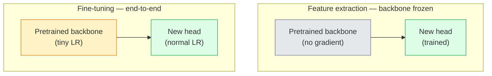

# 转移学习和调整

> 别人已经花了数百万的GPU小时,教会一个神经网络 识别边缘,纹理和物体部件是什么样子――在训练自己的模型之前,你应该借这些功能――

**Type:** Build
**Languages:** Python
**Prerequisites:** Phase 4 Lesson 03 (CNNs), Phase 4 Lesson 04 (Image Classification)
**Time:** ~75 minutes

## 学习目标
- 区分功能提取和细节调整,并根据数据集的大小,域距离和计算预算 选择合适方法
- 装载预训练的脊椎,替换其分类器头,并在20 行内只训练头 得到可用的基线
- 使用歧视性学习率 逐步解层,让早期的通用功能的更新幅度小于后期的任务特定功能
- 诊断三类常见失败:解块 上 LR 过高导致特征漂移,小数据集 上 BN 统计数据崩,以及灾难性遗忘

## 问题
在图像网上训练一个ResNet-50需要大约2000个GPU小时.很少有团队能够承担每一个上线任务的预算.几乎所有的团队都真正上线,都是一个预训练的脊椎,加上一个新的头脑,而这个头脑是几百或几千张任务特定图像上训练的.

这不是捷径――任何在ImageNet上训练的CNN,其第一个 conv块都会学习边缘和类似Gabor的过器――接下来的几个块学习纹理和简单的动作――中间块学习对象部分――最后的块学习开始接近1000个ImageNet类别的组合――这个层次结构的前90%几乎可以原始地转移到医疗成像,工业检查,卫星数据以及其他每个任务,因为自然界的边缘和纹理的词汇量有限――最后10%才是你真正需要训练的部分――

进行好转移 有三个错误在等待你:使用过高的学习速度破坏预训练的功能; 结过多导致模型信息不足;让BatchNorm的运行统计数据流向一个小的数据集上,而神经网络的其余部分从未从这个数据集中学到过的东西.

## 概念
### 特征提取 vs 细调

两种模式,取决于你有多个预先训练的特征,以及你有多少数据.



经验法则:

| Dataset size | Domain distance | Recipe |
|--------------|-----------------|--------|
| < 1k images | 接近 ImageNet | 冻结 backbone，只训练 head |
| 1k-10k | 接近 | 冻结前 2-3 个 stages，fine-tune 其余部分 |
| 10k-100k | 任意 | 使用 discriminative LR 进行 end-to-end fine-tune |
| 100k+ | 远 | Fine-tune 全部参数；如果 domain 足够远，考虑从零训练 |

接近图像网 大致意味着带有像对象的自然RGB照片.

### 冰的作用是什么原因?

CNN 学习的 ImageNet 功能并非专门针对这些1000个类别的.它们专门适应自然图像的统计特性:特定方向的边缘,纹理,对比模式,形状原始性.这些统计特性在几乎每个视觉领域中都很稳定.这就是为什么在 ImageNet 上训练的模型,在CIFAR-10 上的零射击新评估时,只需要添加一个线性头 (不细调的脊柱) 才能达到80%+的准确性.

### 歧视性学习率

当你确实解时,早期层应比晚层慢练习.早期层编码是你想保留的通用特征.晚层编码是你需要大幅调整任务特定结构.

```
Typical recipe:

  stage 0 (stem + first group): lr = base_lr / 100    (mostly fixed)
  stage 1:                       lr = base_lr / 10
  stage 2:                       lr = base_lr / 3
  stage 3 (last backbone group): lr = base_lr
  head:                          lr = base_lr  (or slightly higher)
```

在 PyTorch 中,这只是传递给优化器的参数组列表.

### 批量规则问题

现在,我们已经开始了.`running_mean`和 `running_var`如果你的任务有不同的像素分布,例如不同的照明,不同的传感器,不同的颜色空间,那么这些缓冲器就是错的.

1. **在 train mode 下 fine-tune BN。**让 BN 随其它部分一起更新运行统计数据.
2. **在 eval mode 下冻结 BN。**保持图像网统计,只训练重量――当你的数据集小到 BN 的移动平均水平 会很杂时,这是正确的选择――
3. **用 GroupNorm 替换 BN。**完全移除移动平均值 问题──用于检测和细分脊椎,因为每个GPU上部的批量大小很小──

这里做错会让精度下降5-15%

### 头部设计

每个火视觉背骨都带着默认的头,你需要更换它:

```
backbone.fc = nn.Linear(backbone.fc.in_features, num_classes)          # ResNet
backbone.classifier[1] = nn.Linear(..., num_classes)                    # EfficientNet, MobileNet
backbone.heads.head = nn.Linear(..., num_classes)                       # torchvision ViT
```

对于小数据集,一个单一线性层通常就足够了――当任务分布和背骨的训练分布相距更远时,添加隐藏层(线性 -> ReLU -> 脱落 -> 线性) 有帮助――

### 层级 LR衰变

这是现代细调 (BEiT、DINOv2、ViT-B细调) 中使用的差别性LR的更平滑版本.

```
lr_layer_k = base_lr * decay^(L - k)
```

当衰变 = 0.75 且L = 12 个变压器块时,第一个块的训练 LR 是头 LR 的`0.75^11 ≈ 0.04x`,对于变压器的细节比CNN更重要;对于CNN,

### 评估什么

转移学习运行需要两个你在零运行中不会跟踪的数字:

- **Pretrained-only accuracy**脊柱 结时头部的精度.这是你的地板.
- **Fine-tuned accuracy**终端训练 后同一个模型的精度──这是你的天花板──

如果精细调节低于预训练,你就有学习率或BN bug──始终打印两者──


```figure
transfer-learning
```

## 构建它
### 步骤1:装载预训练的脊椎,检查它

```python
import torch
import torch.nn as nn
from torchvision.models import resnet18, ResNet18_Weights

backbone = resnet18(weights=ResNet18_Weights.IMAGENET1K_V1)
print(backbone)
print()
print("classifier head:", backbone.fc)
print("feature dim:", backbone.fc.in_features)
```

`ResNet18`有四个阶段.`layer1..layer4`),外加一个干和一个`fc`每个火视觉分类背骨都有类似的结构.

### 步骤2: 功能提取  结冰一切,取代头部

```python
def make_feature_extractor(num_classes=10):
    model = resnet18(weights=ResNet18_Weights.IMAGENET1K_V1)
    for p in model.parameters():
        p.requires_grad = False
    model.fc = nn.Linear(model.fc.in_features, num_classes)
    return model

model = make_feature_extractor(num_classes=10)
trainable = sum(p.numel() for p in model.parameters() if p.requires_grad)
frozen = sum(p.numel() for p in model.parameters() if not p.requires_grad)
print(f"trainable: {trainable:>10,}")
print(f"frozen:    {frozen:>10,}")
```

只有`model.fc`是可训练的. 脊柱是一个冷的特征提取器.

### 步骤3:歧视性细调

一个实用工具,用于构建具有阶段特定学习率的参数组.

```python
def discriminative_param_groups(model, base_lr=1e-3, decay=0.3):
    stages = [
        ["conv1", "bn1"],
        ["layer1"],
        ["layer2"],
        ["layer3"],
        ["layer4"],
        ["fc"],
    ]
    groups = []
    for i, names in enumerate(stages):
        lr = base_lr * (decay ** (len(stages) - 1 - i))
        params = [p for n, p in model.named_parameters()
                  if any(n.startswith(k) for k in names)]
        if params:
            groups.append({"params": params, "lr": lr, "name": "_".join(names)})
    return groups

model = resnet18(weights=ResNet18_Weights.IMAGENET1K_V1)
model.fc = nn.Linear(model.fc.in_features, 10)
for p in model.parameters():
    p.requires_grad = True

groups = discriminative_param_groups(model)
for g in groups:
    print(f"{g['name']:>10s}  lr={g['lr']:.2e}  params={sum(p.numel() for p in g['params']):>8,}")
```

`decay=0.3`表示每个阶段的训练速度是下一个阶段的30%──`fc`得到了`base_lr`没有任何`layer4`得到了`0.3 * base_lr`没有任何`conv1`得到了`0.3^5 * base_lr ≈ 0.00243 * base_lr`听起来很极端;经验上它确实有效.

### 步骤4:批量规范处理

用于结 BN运行统计而不结其体重的辅助者.

```python
def freeze_bn_stats(model):
    for m in model.modules():
        if isinstance(m, (nn.BatchNorm1d, nn.BatchNorm2d, nn.BatchNorm3d)):
            m.eval()
            for p in m.parameters():
                p.requires_grad = False
    return model
```

在每个时代 开始时设置`model.train()`之后调用它.`model.train()`将把所有内容切入训练模式;这个函数只会对BN层进行反向切回.

### 步骤 5: 最少的端到端细调循环

```python
from torch.optim import SGD
from torch.utils.data import DataLoader
from torch.optim.lr_scheduler import CosineAnnealingLR
import torch.nn.functional as F

def fine_tune(model, train_loader, val_loader, device, epochs=5, base_lr=1e-3, freeze_bn=False):
    model = model.to(device)
    groups = discriminative_param_groups(model, base_lr=base_lr)
    optimizer = SGD(groups, momentum=0.9, weight_decay=1e-4, nesterov=True)
    scheduler = CosineAnnealingLR(optimizer, T_max=epochs)

    for epoch in range(epochs):
        model.train()
        if freeze_bn:
            freeze_bn_stats(model)
        tr_loss, tr_correct, tr_total = 0.0, 0, 0
        for x, y in train_loader:
            x, y = x.to(device), y.to(device)
            logits = model(x)
            loss = F.cross_entropy(logits, y, label_smoothing=0.1)
            optimizer.zero_grad()
            loss.backward()
            optimizer.step()
            tr_loss += loss.item() * x.size(0)
            tr_total += x.size(0)
            tr_correct += (logits.argmax(-1) == y).sum().item()
        scheduler.step()

        model.eval()
        va_total, va_correct = 0, 0
        with torch.no_grad():
            for x, y in val_loader:
                x, y = x.to(device), y.to(device)
                pred = model(x).argmax(-1)
                va_total += x.size(0)
                va_correct += (pred == y).sum().item()
        print(f"epoch {epoch}  train {tr_loss/tr_total:.3f}/{tr_correct/tr_total:.3f}  "
              f"val {va_correct/va_total:.3f}")
    return model
```

通过使用上述配方在CIFAR-10上训练五个时代,可以把`ResNet18-IMAGENET1K_V1`通过炼头部,完全不动脊椎,精度将会达到86%进入高原.

### 步骤 6: 逐步解

一种从端到前端的每个时代 解一个阶段的时间表――它以额外的时代为代价缓解特征的漂移――

```python
def progressive_unfreeze_schedule(model):
    stages = ["layer4", "layer3", "layer2", "layer1"]
    yielded = set()

    def start():
        for p in model.parameters():
            p.requires_grad = False
        for p in model.fc.parameters():
            p.requires_grad = True

    def unfreeze(epoch):
        if epoch < len(stages):
            name = stages[epoch]
            yielded.add(name)
            for n, p in model.named_parameters():
                if n.startswith(name):
                    p.requires_grad = True
            return name
        return None

    return start, unfreeze
```

在第一时代之前调用一次`start()`在每个时代 开始时调用`unfreeze(epoch)`△每当可训练参数 集合发生变化时,必须重建优化器,否则冷参数 仍然保留缓存时刻,会干扰它.

## 使用它
对于大多数真实任务,`torchvision.models`只有当你遇到库默认问题时才有所重要.

```python
from torchvision.models import resnet50, ResNet50_Weights

model = resnet50(weights=ResNet50_Weights.IMAGENET1K_V2)
model.fc = nn.Linear(model.fc.in_features, num_classes)
optimizer = torch.optim.AdamW(model.parameters(), lr=1e-4, weight_decay=1e-4)
```

另外两个生产级违约:

- `timm`提供约800个预训练的视觉脊椎,并带有一致的API(`timm.create_model("resnet50", pretrained=True, num_classes=10)`对于火视野动物园以外的任何细节,
- 对于变压器,`transformers.AutoModelForImageClassification.from_pretrained(name, num_labels=N)`它们可以给你 ViT / BEiT / DeiT,并且加载语义与文本模型相似.

## 交付它
本课会产出:

- `outputs/prompt-fine-tune-planner.md` 一个提示,会根据数据集的大小,域距离和计算预算,选择功能提取,渐进的细节调整或端到端细节调整.
- `outputs/skill-freeze-inspector.md`一个技能,给定PyTorch模型后,会报告哪些参数是可训练的,哪些BatchNorm层 处于评估模式,以及优化器是否真的得到了可训练的参数――

## 练习
1. **(Easy)**在同一个合成CIFAR数据集上,将`ResNet18`分别作为线性探测器 (骨结) 和完整的细调 进行训练――并排报告两者的准确性――解释哪个缺口 说明特征传输 效果好,哪个缺口 说明效果不好――
2. **(Medium)**想引入一个错误:把脊柱阶段上`base_lr = 1e-1`没有头上,而是显示训练损失爆炸,然后通过应用`discriminative_param_groups`记录每一个阶段 开始发散时的 LR。
3. **(Hard)**选取一个医学成像数据集 (例如CheXpert-small、PatchCamelyon 或 HAM10000),比较三种模式: (a) ImageNet预训练的结脊椎+线性头; (b) ImageNet预训练的端到端细调; (c) 抓子训练――报告每种方法的准确性和计算成本――在什么数据集大小下,抓子训练 开始具备竞争力?

## 关键术语
| Term | What people say | What it actually means |
|------|----------------|----------------------|
| Feature extraction | “Freeze and train head” | Backbone parameters 冻结，只有新的 classifier head 接收 Gradient |
| Fine-tuning | “Retrain end-to-end” | 所有 parameters 都 trainable，通常使用比 scratch training 小得多的 LR |
| Discriminative LR | “Smaller LR for early layers” | Optimizer parameter groups，其中 early-stage LR 是 late-stage LR 的一部分 |
| Layer-wise LR decay | “Smooth LR gradient” | 每层 LR 乘以 decay^(L - k)；常见于 transformer fine-tunes |
| Catastrophic forgetting | “The model lost ImageNet” | 过高 LR 在新任务信号被学到之前覆盖了 pretrained features |
| BN statistics drift | “Running mean is wrong” | BatchNorm running_mean/var 是在不同于当前任务的 distribution 上计算的，会悄悄损害 accuracy |
| Linear probe | “Frozen backbone + linear head” | 对 pretrained features 的评估，即 frozen representation 之上最佳 linear classifier 的 accuracy |
| Catastrophic collapse | “Everything predicts one class” | 当 fine-tuning 的 LR 高到在 head 的 Gradient 能稳定之前就破坏 features 时发生 |

## 延伸阅读
- [How transferable are features in deep neural networks? (Yosinski et al., 2014)](https://arxiv.org/abs/1411.1792) 这篇论文量化了不同层次之间的可转移性
- [Universal Language Model Fine-tuning (ULMFiT, Howard & Ruder, 2018)](https://arxiv.org/abs/1801.06146)最初的歧视性 LR / 渐进式解凍配方;这些思想可以直接转移到视觉
- [timm documentation](https://huggingface.co/docs/timm) 现代视觉背骨 以及其训练时精确调节默认的参考
- [A Simple Framework for Linear-Probe Evaluation (Kornblith et al., 2019)](https://arxiv.org/abs/1805.08974)为什么线性探测器的准确性很重要,以及如何正确报告它
