# 目标检测  从零实现YOLO

> 检测是分类加回归,运行在特征地图的每个位置,然后使用非最大的抑制清理结果.

**类型：**构建
**语言：**字符串
**前置要求：**阶段4课03 (CNN),阶段4课04 (图像分类),阶段4课05 (转移学习)
**时间：**约75分钟

## 学习目标

- 解释格格和 设计如何把检测 转化为密集预测 问题,并说明输出数 中每个数字的含义
- 计算框 之间 交叉-超欧盟,并从零实现非最大压缩
- 在预训练的脊椎上构建一个最小的YOLO风格的头,包括分类,物体和盒子回归损失
- 读懂一行检测测量度(精度@0.5,回忆,mAP@0.5,mAP@0.5:0.95),并判断下一步应该调整哪个按

## 问题

解析会说 这张图是一个狗──检测会说 在像素 (112, 40, 280, 210) 处有一个狗,在 (400, 180, 560, 310) 处有一个猫,画面中没有其他东西──这个结构变化预测数量可变的带标签盒,而不是每张图片一个标签是每个自动驾驶系统,每个监控产品,每个文档布局解析器和每个工厂视觉产品线的依赖能力──

检测也就是视觉中所有的工程取舍同时出现的地方. 你希望盒子准确的,希望每个盒子的类 正确的,希望模型知道什么时候没有什么需要检测的,希望每个真实对象只应对一个预测的,不最大的压缩.

约洛 (You Only Look Once, Redmon et al. 2016) 是一种设计,它通过 convnet的单次前进通过让所有这些实时运行起来;同样的结构决策至今仍然是现代探测器 (YOLOv8,YOLOv9,YOLO-NAS,RT-DETR) 的脊柱.

## 概念

### 检测 作为密集预测

分类器 每张图输出 C 个数字――YOLO 风格探测器 每张图输出 `(S x S x (5 + C))`个数字,其中 S 是空间网的尺寸.

```mermaid
flowchart LR
    IMG["Input 416x416 RGB"] --> BB["Backbone<br/>(ResNet, DarkNet, ...)"]
    BB --> FM["Feature map<br/>(C_feat, 13, 13)"]
    FM --> HEAD["Detection head<br/>(1x1 convs)"]
    HEAD --> OUT["Output tensor<br/>(13, 13, B * (5 + C))"]
    OUT --> DEC["Decode<br/>(grid + sigmoid + exp)"]
    DEC --> NMS["Non-max suppression"]
    NMS --> RESULT["Final boxes"]

    style IMG fill:#dbeafe,stroke:#2563eb
    style HEAD fill:#fef3c7,stroke:#d97706
    style NMS fill:#fecaca,stroke:#dc2626
    style RESULT fill:#dcfce7,stroke:#16a34a
```



每个`S * S`网格细胞 会预测 `B`个盒子. 对每个盒子:

- 个数字描述几何信息:`tx, ty, tw, th`,我知道.
- 个数字是对象性分数: 有没有一个对象落在这个细胞中?
- 个数字是类概率.

每个细胞的总数:`B * (5 + C)`△对于VOC,若`S=13, B=2, C=20`只有每一个细胞有50个数字.

### 为什么需要网和?

简单的回归会为每个对象 预测绝对坐标形式的`(x, y, w, h)`△对 conv 网络来说很难,因为平移图像不应该让所有预测都平移相同的量每个对象都在空间上被定定──网格通过分开每个基实盒给其中的中心所在的网格细胞来解决这个问题;只有那个细胞负责该对象──

结 解决第二个问题──3x3 conv 很难从16像素接收场的特征细胞中退缩出一个500像素宽的盒子──因此,我们在每个细胞中预先定义`B`个先验盒形状() 并从每个 预测小的海峡――模型学习选择正确的 并微调它,而不是从零回归――

```
Anchor box priors (example for 416x416 input):

  small:   (30,  60)
  medium:  (75,  170)
  large:   (200, 380)

At each grid cell, every anchor emits (tx, ty, tw, th, obj, c_1, ..., c_C).
```

现代探测器通常使用FPN,在不同分辨率上使用不同基套浅层高分辨率地图 上放小基,深层低分辨率地图 上放大基――同样的思想,更多尺度――

### 解码预测

原始的`tx, ty, tw, th`不是盒子坐标;它们需要在绘制前转换的回归目标:

```
centre x  = (sigmoid(tx) + cell_x) * stride
centre y  = (sigmoid(ty) + cell_y) * stride
width     = anchor_w * exp(tw)
height    = anchor_h * exp(th)
```

`sigmoid`把中心偏移限制在细胞内.`exp`让宽度可以从杆自由缩小而不会发生符号翻转.`stride`把格列坐标缩小到像素. 这个解码步骤从 v2 开始,从每一个 YOLO 版本都是一样的.

### 其他

检测中衡量两个盒子相似度的通用指标:

```
IoU(A, B) = area(A intersect B) / area(A union B)
```

 IoU = 1 表示完全相同;IoU = 0 表示没有重叠──预测和基础真相框之间的 IoU决定某种预测是否算作真正的(通常 IoU >=0.5);;两个预测之间的 IoU 是NMS 用来重量依据──

### 超出最大压力

在相邻的杆上训练的 conv网络通常会为同一个对象预测重叠盒子.NMS保持信心最高的预测,并删除任何 IoU高于值的其他预测.

```
NMS(boxes, scores, iou_threshold):
    sort boxes by score descending
    keep = []
    while boxes not empty:
        pick the top-scoring box, add to keep
        remove every box with IoU > iou_threshold to the picked box
    return keep
```

典型值:对象检测 中为0.45──近期检测器 会用 `soft-NMS`,我知道.`DIoU-NMS`替代标准NMS,或直接学习抑制RT-DETR),但结构性目的相同.

### 损失

子损失是三个重量损失相加:

```
L = lambda_coord * L_box(pred, target, where obj=1)
  + lambda_obj   * L_obj(pred, 1,     where obj=1)
  + lambda_noobj * L_obj(pred, 0,     where obj=0)
  + lambda_cls   * L_cls(pred, target, where obj=1)
```

只有包含对象的细胞 才会贡献框回归和分类损失――不包含对象的细胞 只能贡献对象性损失――教模型保持沉默)`lambda_noobj`通常较小 (约0.5),因为绝大多数细胞都是空的,否则会导致总损失.

现代变体会把MSE盒损失 换成CIoU / DIoU(直接优化IoU),用焦失处理类失衡,并用质量焦失平衡对象性──三组件结构保持不变──

### 检测指标

精度 不能直接移动到检测.

- **Precision@IoU=0.5**在被认为是积极的预测中,有多少实际正确.
- **Recall@IoU=0.5**在真实物体中,我们找到了多少.
- **AP@0.5** IoU门 0.5 下精度回忆曲线的面积;每个类 一个数量――
- **mAP@0.5:0.95** 在 IoU 门 0.5, 0.55, ..., 0.95 上对AP 求平均──COCO指标;最严格,也最有信息量──

四个要报告――如果一个探测器在mAP@0.5上很强,但在mAP@0.5:0.95上很弱,说明定位大致正确但不够紧;用更好的盒子回归损失修复――如果探测器精度高、回忆低,说明它过于保守;降低信心门或提高对象权重――


```figure
object-detection-nms
```

## 构建它

### 步骤1:

整节课的核心工具.`(x1, y1, x2, y2)`格式的盒子阵列──

```python
import numpy as np

def box_iou(boxes_a, boxes_b):
    ax1, ay1, ax2, ay2 = boxes_a[:, 0], boxes_a[:, 1], boxes_a[:, 2], boxes_a[:, 3]
    bx1, by1, bx2, by2 = boxes_b[:, 0], boxes_b[:, 1], boxes_b[:, 2], boxes_b[:, 3]

    inter_x1 = np.maximum(ax1[:, None], bx1[None, :])
    inter_y1 = np.maximum(ay1[:, None], by1[None, :])
    inter_x2 = np.minimum(ax2[:, None], bx2[None, :])
    inter_y2 = np.minimum(ay2[:, None], by2[None, :])

    inter_w = np.clip(inter_x2 - inter_x1, 0, None)
    inter_h = np.clip(inter_y2 - inter_y1, 0, None)
    inter = inter_w * inter_h

    area_a = (ax2 - ax1) * (ay2 - ay1)
    area_b = (bx2 - bx1) * (by2 - by1)
    union = area_a[:, None] + area_b[None, :] - inter
    return inter / np.clip(union, 1e-8, None)
```

返回一个`(N_a, N_b)`对于一个单个地图真相盒,比较时,把其中一个数组做成形状.`(1, 4)`,我知道.

### 步骤 2: 无限压制

```python
def nms(boxes, scores, iou_threshold=0.45):
    order = np.argsort(-scores)
    keep = []
    while len(order) > 0:
        i = order[0]
        keep.append(i)
        if len(order) == 1:
            break
        rest = order[1:]
        ious = box_iou(boxes[[i]], boxes[rest])[0]
        order = rest[ious <= iou_threshold]
    return np.array(keep, dtype=np.int64)
```

确定性实现,排序带来`O(N log N)`复杂性,并在相同的输入上匹配`torchvision.ops.nms`行为

### 步骤3: 盒子编码和解码

在像素坐标和网络 实际回归的`(tx, ty, tw, th)`目标之间转换.

```python
def encode(box_xyxy, cell_x, cell_y, stride, anchor_wh):
    x1, y1, x2, y2 = box_xyxy
    cx = 0.5 * (x1 + x2)
    cy = 0.5 * (y1 + y2)
    w = x2 - x1
    h = y2 - y1
    tx = cx / stride - cell_x
    ty = cy / stride - cell_y
    tw = np.log(w / anchor_wh[0] + 1e-8)
    th = np.log(h / anchor_wh[1] + 1e-8)
    return np.array([tx, ty, tw, th])


def decode(tx_ty_tw_th, cell_x, cell_y, stride, anchor_wh):
    tx, ty, tw, th = tx_ty_tw_th
    cx = (sigmoid(tx) + cell_x) * stride
    cy = (sigmoid(ty) + cell_y) * stride
    w = anchor_wh[0] * np.exp(tw)
    h = anchor_wh[1] * np.exp(th)
    return np.array([cx - w / 2, cy - h / 2, cx + w / 2, cy + h / 2])


def sigmoid(x):
    return 1.0 / (1.0 + np.exp(-x))
```

测试:编码一个盒子 再编码你应该得到非常接近原始值的结果`tx`在后sigmoid范围中,sigmoid逆并非完全可逆,因此会有轻微差异)

### 步骤4: 一个最小的YOLO头

图上一个1x1集,重塑为`(B, S, S, num_anchors, 5 + C)`,我知道.

```python
import torch
import torch.nn as nn

class YOLOHead(nn.Module):
    def __init__(self, in_c, num_anchors, num_classes):
        super().__init__()
        self.num_anchors = num_anchors
        self.num_classes = num_classes
        self.conv = nn.Conv2d(in_c, num_anchors * (5 + num_classes), kernel_size=1)

    def forward(self, x):
        n, _, h, w = x.shape
        y = self.conv(x)
        y = y.view(n, self.num_anchors, 5 + self.num_classes, h, w)
        y = y.permute(0, 3, 4, 1, 2).contiguous()
        return y
```

输出形状:`(N, H, W, num_anchors, 5 + C)` 最后一个维度保存`[tx, ty, tw, th, obj, cls_0, ..., cls_{C-1}]`,我知道.

### 步骤5:基础真相分配

对于每一个基本的真相盒子,决定哪个`(cell, anchor)`负责它.

```python
def assign_targets(boxes_xyxy, classes, anchors, stride, grid_size, num_classes):
    num_anchors = len(anchors)
    target = np.zeros((grid_size, grid_size, num_anchors, 5 + num_classes), dtype=np.float32)
    has_obj = np.zeros((grid_size, grid_size, num_anchors), dtype=bool)

    for box, cls in zip(boxes_xyxy, classes):
        x1, y1, x2, y2 = box
        cx, cy = 0.5 * (x1 + x2), 0.5 * (y1 + y2)
        gx, gy = int(cx / stride), int(cy / stride)
        bw, bh = x2 - x1, y2 - y1

        ious = np.array([
            (min(bw, aw) * min(bh, ah)) / (bw * bh + aw * ah - min(bw, aw) * min(bh, ah))
            for aw, ah in anchors
        ])
        best = int(np.argmax(ious))
        aw, ah = anchors[best]

        target[gy, gx, best, 0] = cx / stride - gx
        target[gy, gx, best, 1] = cy / stride - gy
        target[gy, gx, best, 2] = np.log(bw / aw + 1e-8)
        target[gy, gx, best, 3] = np.log(bh / ah + 1e-8)
        target[gy, gx, best, 4] = 1.0
        target[gy, gx, best, 5 + cls] = 1.0
        has_obj[gy, gx, best] = True
    return target, has_obj
```

轮选择是与地面真相相匹配的最佳形状 IoU这是一个廉价的代理,匹配YOLOv2/v3的任务──v5及后续版本使用更复杂的策略──任务一致的匹配,动态的k) 来细化相同的思路──

### 步骤 6: 三个损失

```python
def yolo_loss(pred, target, has_obj, lambda_coord=5.0, lambda_obj=1.0, lambda_noobj=0.5, lambda_cls=1.0):
    has_obj_t = torch.from_numpy(has_obj).bool()
    target_t = torch.from_numpy(target).float()

    # box-regression loss: only on cells with objects
    box_pred = pred[..., :4][has_obj_t]
    box_true = target_t[..., :4][has_obj_t]
    loss_box = torch.nn.functional.mse_loss(box_pred, box_true, reduction="sum")

    # objectness loss
    obj_pred = pred[..., 4]
    obj_true = target_t[..., 4]
    loss_obj_pos = torch.nn.functional.binary_cross_entropy_with_logits(
        obj_pred[has_obj_t], obj_true[has_obj_t], reduction="sum")
    loss_obj_neg = torch.nn.functional.binary_cross_entropy_with_logits(
        obj_pred[~has_obj_t], obj_true[~has_obj_t], reduction="sum")

    # classification loss on cells with objects
    cls_pred = pred[..., 5:][has_obj_t]
    cls_true = target_t[..., 5:][has_obj_t]
    loss_cls = torch.nn.functional.binary_cross_entropy_with_logits(
        cls_pred, cls_true, reduction="sum")

    total = (lambda_coord * loss_box
             + lambda_obj * loss_obj_pos
             + lambda_noobj * loss_obj_neg
             + lambda_cls * loss_cls)
    return total, {"box": loss_box.item(), "obj_pos": loss_obj_pos.item(),
                   "obj_neg": loss_obj_neg.item(), "cls": loss_cls.item()}
```

五个超级参数,每个YOLO教程要么硬码,要么扫描.`lambda_coord=5, lambda_noobj=0.5`应原始的YOLOv1纸,至今仍然是合理的默认值.

### 步骤7: 推进管道

解码原始头输出,应用sigmoid/exp,按对象性门过,然后执行NMS──

```python
def postprocess(pred_tensor, anchors, stride, img_size, conf_threshold=0.25, iou_threshold=0.45):
    pred = pred_tensor.detach().cpu().numpy()
    grid_h, grid_w = pred.shape[1], pred.shape[2]
    num_anchors = len(anchors)

    boxes, scores, classes = [], [], []
    for gy in range(grid_h):
        for gx in range(grid_w):
            for a in range(num_anchors):
                tx, ty, tw, th, obj, *cls = pred[0, gy, gx, a]
                score = sigmoid(obj) * sigmoid(np.array(cls)).max()
                if score < conf_threshold:
                    continue
                cls_idx = int(np.argmax(cls))
                cx = (sigmoid(tx) + gx) * stride
                cy = (sigmoid(ty) + gy) * stride
                w = anchors[a][0] * np.exp(tw)
                h = anchors[a][1] * np.exp(th)
                boxes.append([cx - w / 2, cy - h / 2, cx + w / 2, cy + h / 2])
                scores.append(float(score))
                classes.append(cls_idx)

    if not boxes:
        return np.zeros((0, 4)), np.zeros((0,)), np.zeros((0,), dtype=int)
    boxes = np.array(boxes)
    scores = np.array(scores)
    classes = np.array(classes)
    keep = nms(boxes, scores, iou_threshold)
    return boxes[keep], scores[keep], classes[keep]
```

这就是完整的评估路径:头 -> 解码 -> 门 -> NMS。

## 使用它

`torchvision.models.detection`提供具有相同概念结构的生产级探测器.

```python
import torch
from torchvision.models.detection import fasterrcnn_resnet50_fpn_v2

model = fasterrcnn_resnet50_fpn_v2(weights="DEFAULT")
model.eval()
with torch.no_grad():
    predictions = model([torch.randn(3, 400, 600)])
print(predictions[0].keys())
print(f"boxes:  {predictions[0]['boxes'].shape}")
print(f"scores: {predictions[0]['scores'].shape}")
print(f"labels: {predictions[0]['labels'].shape}")
```

对于实时推断管道,`ultralytics`现在,我们需要一个标准选择.`from ultralytics import YOLO; model = YOLO('yolov8n.pt'); model(img)`△模型将在内部处理解码和NMS,并返回与你构建的相同`boxes / scores / labels`其他地方

## 交付它

本课会产出:

- `outputs/prompt-detection-metric-reader.md` 一个提示,把一行`precision, recall, AP, mAP@0.5:0.95`转换为一个诊断和最有用的下一个实验.
- `outputs/skill-anchor-designer.md`一个技能,给定了基础真相盒 数据集后,在`(w, h)`上运行 k-means,并返回每个FPN级别的杆集合以及选择正确的杆数量所需的覆盖统计数据――

## 练习

1. **（简单）**实现`box_iou`随机组合上与上`torchvision.ops.box_iou`对比度最大绝对差距小于`1e-6`,我知道.
2. **（中等）**将`yolo_loss`移植为使用`CIoU`在一个100图像合成数据集上显示:在同一时期 数下,CIoU比MSE 收到更好的最终mAP@0.5:0.95。
3. **（困难）**实现多尺度推理:以三种分辨率将相同图像输入模型,合并框预测,最后运行一次NMS──在持久的集合上测量相比单尺度推理的mAP提升──

## 关键术语

| Term | 人们怎么说 | 它实际是什么意思 |
|------|----------------|----------------------|
| Anchor | “Box prior” | 每个 grid cell 上的预定义 box shape，network 从中预测 deltas，而不是预测绝对坐标 |
| IoU | “Overlap” | 两个 box 的 Intersection-over-union；detection 中通用的相似度度量 |
| NMS | “Deduplicate” | 贪心算法，保留最高分 predictions，并移除高于阈值的重叠 predictions |
| Objectness | “Is there something here” | 每个 anchor、每个 cell 的 scalar，用于预测是否有 object 的中心落在该 cell 中 |
| Grid stride | “Downsample factor” | 每个 grid cell 对应的 pixels 数；416-px input 配 13-grid head 时 stride 为 32 |
| mAP | “Mean average precision” | precision-recall curve 下方面积的平均值，对 classes 求平均，并且（对 COCO）也对 IoU thresholds 求平均 |
| AP@0.5 | “PASCAL VOC AP” | IoU threshold 0.5 下的 average precision；该 metric 的宽松版本 |
| mAP@0.5:0.95 | “COCO AP” | 在 IoU thresholds 0.5..0.95、步长 0.05 上求平均；严格版本，也是当前社区标准 |

## 延伸阅读

- [YOLOv1: You Only Look Once (Redmon et al., 2016)](https://arxiv.org/abs/1506.02640) 奠基纸;后来的每一个YOLO都对该结构进行了改进
- [YOLOv3 (Redmon & Farhadi, 2018)](https://arxiv.org/abs/1804.02767) 引入多尺度FPN风格头的纸;至今仍有最清晰的图表
- [Ultralytics YOLOv8 docs](https://docs.ultralytics.com) 当前生产参考;涵盖数据集格式,增强,培训食谱
- [The Illustrated Guide to Object Detection (Jonathan Hui)](https://jonathan-hui.medium.com/object-detection-series-24d03a12f904)对于完整的探测器动物园 最好的简单英语 导览;对于理解DETR、RetinaNet、FCOS和YOLO之间的关系非常宝贵
