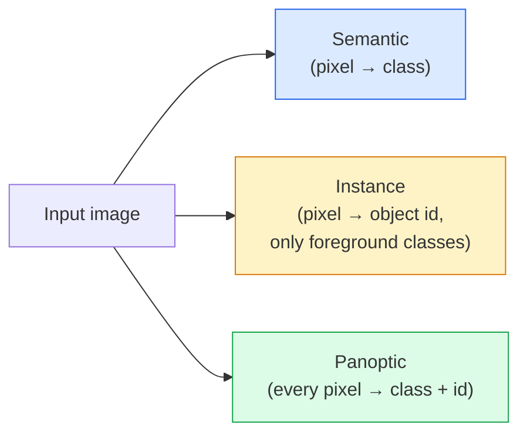
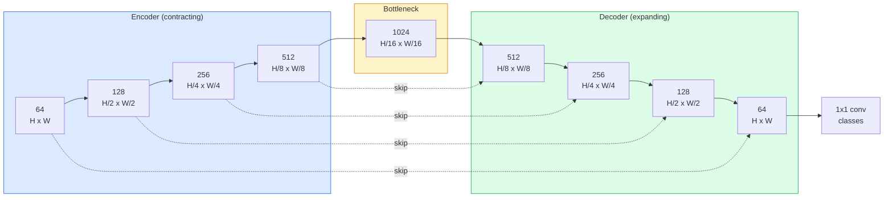

# 语义分类 U-Net

> 分类是对每个像素进行分类.通过将下采样编码器与上采样解码器,配对,并连接两者之间跳过连接,使这一点变得可行的.

**Type:** Build
**Languages:** Python
**Prerequisites:** Phase 4 Lesson 03 (CNNs), Phase 4 Lesson 04 (Image Classification)
**Time:** ~75 minutes

## 学习目标
- 区分语义,实例和全观分区,并为给定问题选择正确任务
- 在 PyTorch 中从零构建U-Net,包含编码区块,瓶,带转换的转变,以及跳转连接的解码器
- 实现像素智能交叉化、Dice损失,以及当前医疗和工业分区的默认组合损失
- 按类 解读IoU 和 Dice指标,并诊断低分是来自小物体回忆,限度准确性,还是类的不平衡

## 问题
分类对每张图像输出一个标签――检测对每张图像输出少量框――分类对每一个像素输出一个标签――对大小为`H x W`输入,输出是形状为`H x W`它们是什么意思?`H x W x N_instances`这意味着每张图像都有数百万个预测,而不是一个.

分类结构解释了为什么它支几乎所有密集预测视觉 产品:医疗成像 (瘤面具) 驾驶自主驾驶 (道路,轨道,障碍) 卫星 (建筑足迹,作物界限) 文件解析 (布局区) 机器人 (可抓取区域) 这些任务都无法通过对象 (绘制一个盒子来解决) 它们需要精确的模样.

架构问题说起来很简单,但解决起来并不简单:你需要网络同时看到图像的全球背景 (这是什么样的场景) 和本地像素细节 (究竟哪个像素是道路,哪个是路面) 标准 CNN会在空间维度上压缩以获得背景,但这会丢失.

## 概念
### 语义 vs 实例 vs 全景



- **Semantic**表示这个像素是道路,那个像素是汽车.
- **Instance**表示这个像素是车#3,那个像素是车#5.
- **Panoptic**每个像素都得到一个类标签,每个实例都得到一个唯一的ID,物品和东西都被分类.

本课涵盖语义――下一课(面具R-CNN) 涵盖实例――

### 网络形状



编码器将空间分辨率 减半四次,并将频道 翻倍――解码器 反向执行:将空间分辨率 翻倍四次,并将频道 减半――跳转连接 会在每个分辨率上把匹配的编码器功能与解码器功能 进行连接――最终的1x1 conv 在完整分辨率下将`64 -> num_classes`,我知道.

为什么跳转连接是必要的:当解码器试图输出像素级预测时,它只看到很小的特征地图.没有跳转,它无法准确地定位边缘,因为这些信息已经被压缩在编码器中.

### 转换与双线上样本

解码器必须扩大空间尺寸.

- **Transposed convolution**(`nn.ConvTranspose2d`) 可学习的样本――历史上的U-Net默认方案――如果步骤和内核尺寸不整整除,可能产生棋牌文物――
- **Bilinear upsample + 3x3 conv**平滑上样本 后一个卷. 文物更少,参数更少,现在是现代默认方案.

对于第一个U-Net,比较稳定.

### 像素格上的交叉

对于包含C类的语义分类,模型输出是`(N, C, H, W)`◎目标是`(N, H, W)`包含整数类ID. 跨透与分类的场景完全相同,只是适用于每个空间位置上:

```
Loss = mean over (n, h, w) of -log( softmax(logits[n, :, h, w])[target[n, h, w]] )
```

火中的`F.cross_entropy`没有需要重新塑造.

### 子损失以及为什么需要它

交叉透等待每个像素――当一个类占据框架绝大多数时间,这是错误的(医学成像:99%背景,1%瘤) ・网络可通过在所有位置预测背景 获得99%的准确性,但仍然没有用处――

通过直接优化预测面具与真实面具之间的重叠来解决这个问题:

```
Dice(p, y) = 2 * sum(p * y) / (sum(p) + sum(y) + epsilon)
Dice_loss = 1 - Dice
```

其中`p`是某个类的sigmoid/softmax概率地图,`y`只有当重叠时,损失才为零. 因为它基于比例,类失衡不再相关.

实践中,使用**combined loss**其他:

```
L = L_cross_entropy + lambda * L_dice       (lambda ~ 1)
```

交叉化在训练早期提供稳定的基准; 训练后段将聚焦在真正匹配的面具形状上.

### 评估指标

- **Pixel accuracy** 预测正确的像素 百分比――计算便宜――与分类中的准确性一样,在不平衡的数据上会失效――
- **IoU per class** 每个类面具的交叉点在工会上;跨类 求平均 = mIoU。
- **Dice (F1 on pixels)** 类似的;`Dice = 2 * IoU / (1 + IoU)`◎医疗成像更偏好 Dice,驾驶社区更偏好 IoU;
- **Boundary F1** 测量预测边界与地面真相边界的接近程度,即使是小偏移也会受到惩罚.

报告每类的IU,而不是只是一个IU.平均IU只覆盖一个类的15%,而其他九类的情况是85%的.

### 输入分辨率权衡

医疗图像通常是512x512或1024x1024──自动驾驶作物是2048x1024──U-Net的内存成本随着`H * W * C_max`缩放,在1024x1024 且瓶道为1024 时,前行通过已使用数 GB VRAM──

两个标准解决方案:
1. 处理带叠加的256x256,然后.
2. 用扩张的卷积 替换瓶,保持更高的空间分辨率的同时扩大接收场 (DeepLab家族) .

对于第一个模型,使用256x256输入和64通道基线U-Net可以在8GBVRAM上舒适训练.


```figure
segmentation-flood
```

## 构建它
### 步骤1:编码器区块

两个3x3的电缆,带批量规范和回放.

```python
import torch
import torch.nn as nn
import torch.nn.functional as F

class DoubleConv(nn.Module):
    def __init__(self, in_c, out_c):
        super().__init__()
        self.net = nn.Sequential(
            nn.Conv2d(in_c, out_c, kernel_size=3, padding=1, bias=False),
            nn.BatchNorm2d(out_c),
            nn.ReLU(inplace=True),
            nn.Conv2d(out_c, out_c, kernel_size=3, padding=1, bias=False),
            nn.BatchNorm2d(out_c),
            nn.ReLU(inplace=True),
        )

    def forward(self, x):
        return self.net(x)
```

这块将在全程使用.`bias=False`因为BN的beta已经处理了偏见.

### 步骤2:下楼楼块

```python
class Down(nn.Module):
    def __init__(self, in_c, out_c):
        super().__init__()
        self.net = nn.Sequential(
            nn.MaxPool2d(2),
            DoubleConv(in_c, out_c),
        )

    def forward(self, x):
        return self.net(x)


class Up(nn.Module):
    def __init__(self, in_c, out_c):
        super().__init__()
        self.up = nn.Upsample(scale_factor=2, mode="bilinear", align_corners=False)
        self.conv = DoubleConv(in_c, out_c)

    def forward(self, x, skip):
        x = self.up(x)
        if x.shape[-2:] != skip.shape[-2:]:
            x = F.interpolate(x, size=skip.shape[-2:], mode="bilinear", align_corners=False)
        x = torch.cat([skip, x], dim=1)
        return self.conv(x)
```

只检查空间形状`shape[-2:]`) 可处理尺寸 不能被16个整体除除的输入;一个安全的`F.interpolate`由于频道数量差异,这种差异应该是明确的报错,不应该被静静地插入.

### 步骤3:U-Net

```python
class UNet(nn.Module):
    def __init__(self, in_channels=3, num_classes=2, base=64):
        super().__init__()
        self.inc = DoubleConv(in_channels, base)
        self.d1 = Down(base, base * 2)
        self.d2 = Down(base * 2, base * 4)
        self.d3 = Down(base * 4, base * 8)
        self.d4 = Down(base * 8, base * 16)
        self.u1 = Up(base * 16 + base * 8, base * 8)
        self.u2 = Up(base * 8 + base * 4, base * 4)
        self.u3 = Up(base * 4 + base * 2, base * 2)
        self.u4 = Up(base * 2 + base, base)
        self.outc = nn.Conv2d(base, num_classes, kernel_size=1)

    def forward(self, x):
        x1 = self.inc(x)
        x2 = self.d1(x1)
        x3 = self.d2(x2)
        x4 = self.d3(x3)
        x5 = self.d4(x4)
        x = self.u1(x5, x4)
        x = self.u2(x, x3)
        x = self.u3(x, x2)
        x = self.u4(x, x1)
        return self.outc(x)

net = UNet(in_channels=3, num_classes=2, base=32)
x = torch.randn(1, 3, 256, 256)
print(f"output: {net(x).shape}")
print(f"params: {sum(p.numel() for p in net.parameters()):,}")
```

输出形状`(1, 2, 256, 256)` 与输入的空间大小相等,包含`num_classes`个道.`base=32`时约7.7M参数

### 步骤 4:损失

```python
def dice_loss(logits, targets, num_classes, eps=1e-6):
    probs = F.softmax(logits, dim=1)
    targets_one_hot = F.one_hot(targets, num_classes).permute(0, 3, 1, 2).float()
    dims = (0, 2, 3)
    intersection = (probs * targets_one_hot).sum(dim=dims)
    denom = probs.sum(dim=dims) + targets_one_hot.sum(dim=dims)
    dice = (2 * intersection + eps) / (denom + eps)
    return 1 - dice.mean()


def combined_loss(logits, targets, num_classes, lam=1.0):
    ce = F.cross_entropy(logits, targets)
    dc = dice_loss(logits, targets, num_classes)
    return ce + lam * dc, {"ce": ce.item(), "dice": dc.item()}
```

按类数 计算后再平均`eps`防止批量中缺失某些类 时出现除零──

### 步骤 5: 米

```python
@torch.no_grad()
def iou_per_class(logits, targets, num_classes):
    preds = logits.argmax(dim=1)
    ious = torch.zeros(num_classes)
    for c in range(num_classes):
        pred_c = (preds == c)
        true_c = (targets == c)
        inter = (pred_c & true_c).sum().float()
        union = (pred_c | true_c).sum().float()
        ious[c] = (inter / union) if union > 0 else torch.tensor(float("nan"))
    return ious
```

返回长度为C的向量──`nan`标记批次 中缺失类  计算mIoU 时不要把这些值纳入平均量

### 步骤 6: 合成数据集用于端到端验证

在彩色背景上生成形状,使网络必须学习形状,而不是像素颜色.

```python
import numpy as np
from torch.utils.data import Dataset, DataLoader

def synthetic_segmentation(num_samples=200, size=64, seed=0):
    rng = np.random.default_rng(seed)
    images = np.zeros((num_samples, size, size, 3), dtype=np.float32)
    masks = np.zeros((num_samples, size, size), dtype=np.int64)
    for i in range(num_samples):
        bg = rng.uniform(0, 1, (3,))
        images[i] = bg
        masks[i] = 0
        num_shapes = rng.integers(1, 4)
        for _ in range(num_shapes):
            cls = int(rng.integers(1, 3))
            color = rng.uniform(0, 1, (3,))
            cx, cy = rng.integers(10, size - 10, size=2)
            r = int(rng.integers(4, 12))
            yy, xx = np.meshgrid(np.arange(size), np.arange(size), indexing="ij")
            if cls == 1:
                mask = (xx - cx) ** 2 + (yy - cy) ** 2 < r ** 2
            else:
                mask = (np.abs(xx - cx) < r) & (np.abs(yy - cy) < r)
            images[i][mask] = color
            masks[i][mask] = cls
        images[i] += rng.normal(0, 0.02, images[i].shape)
        images[i] = np.clip(images[i], 0, 1)
    return images, masks


class SegDataset(Dataset):
    def __init__(self, images, masks):
        self.images = images
        self.masks = masks

    def __len__(self):
        return len(self.images)

    def __getitem__(self, i):
        img = torch.from_numpy(self.images[i]).permute(2, 0, 1).float()
        mask = torch.from_numpy(self.masks[i]).long()
        return img, mask
```

三类:背景 (0) √圆 (1) √平方 (2) √ √ √ √ √ √ √ √ √ √ √ √ √ √ √ √ √ √ √ √ √ √ √ √ √ √ √ √ √ √ √ √ √ √ √ √ √ √ √ √ √ √ √ √ √ √ √ √ √ √ √ √ √ √ √ √ √ √ √ √ √ √ √ √ √ √ √ √ √ √ √ √ √ √ √ √ √ √ √ √ √ √ √ √ √ √ √ √ √ √ √ √ √ √ √ √ √ √ √ √ √ √ √ √ √ √ √ √ √ √ √ √ √ √ √ √ √ √ √ √ √ √ √ √ √ √ √ √ √ √ √ √ √ √ √ √ √ √ √ √ √ √ √ √ √ √ √ √ √ √ √ √ √ √ √ √ √ √ √ √ √ √ √ √ √ √ √ √ √ √ √ √ √ √ √ √ √ √ √ √ √ √ √ √ √ √ √ √ √ √ √ √ √ √ √ √ √ √ √ √ √ √ √ √ √ √ √ √ √ √ √ √ √ √ √ √ √ √ √ √ √ √ √ √ √ √ √ √ √ √ √ √ √ √ √ √ √ √ √ √ √ √ √ √ √ √ √ √ 

### 步骤 7: 训练循环

```python
def train_one_epoch(model, loader, optimizer, device, num_classes):
    model.train()
    loss_sum, total = 0.0, 0
    iou_sum = torch.zeros(num_classes)
    for x, y in loader:
        x, y = x.to(device), y.to(device)
        logits = model(x)
        loss, _ = combined_loss(logits, y, num_classes)
        optimizer.zero_grad()
        loss.backward()
        optimizer.step()
        loss_sum += loss.item() * x.size(0)
        total += x.size(0)
        iou_sum += iou_per_class(logits, y, num_classes).nan_to_num(0)
    return loss_sum / total, iou_sum / len(loader)
```

在合成数据集上运行 10-30 时代,观察形状类的mIoU 爬升到 0.9 以上.注意,`nan_to_num(0)`为了获得准确的每类IoU,在评估阶段应按存在做面具,并跨批量使用`torch.nanmean`而不是直接平均水平.

## 使用它
对于生产,`segmentation_models_pytorch`("smp") 用任意的火视觉或时间背骨封装了所有标准分区结构──三行代码:

```python
import segmentation_models_pytorch as smp

model = smp.Unet(
    encoder_name="resnet34",
    encoder_weights="imagenet",
    in_channels=3,
    classes=3,
)
```

实际工作中还值得了解:
- **DeepLabV3+**通过扩展的传输器 替代基于最大池的下样,使瓶 保持分辨率; 在卫星和驾驶数据上边界更快.
- **SegFormer**将 conv编码器换成等级变压器; 在许多基准上是当前SOTA──
- **Mask2Former**现在,**OneFormer**在单一架构中统一语义、实例 和全观分区――

这三个人在`smp`或`transformers`中都可以作为下降替代,并使用相同的数据加载器.

## 交付它
本课产出:

- `outputs/prompt-segmentation-task-picker.md` 一个提示,用于在语义和泛光分区之间进行选择,并为给定任务命名架构.
- `outputs/skill-segmentation-mask-inspector.md` 一个技能,用于报告类分类分布,预测面具统计以及低预测或边界模糊的类.

## 练习
1. **(Easy)**为二进制分类任务 (前景与背景) 实现`bce_dice_loss`在合成二类数据集上验证,当前只有占5%的像素时,相比单独 BCE 收更快.
2. **(Medium)**将`nn.Upsample + conv`换为 升级区块`nn.ConvTranspose2d`在合成数据集上训练二者并比较 mIoU──观察转换-conv 版本中棋牌文物 出现位置──
3. **(Hard)**选取一个真实细分数据集 ((牛津-IIIT物、城市景观小分区,或一个医学子集),并将U-Net 训练到距离`smp.Unet`参考不超过2个IoU积分――报告每类IoU,并识别哪些类从损失中加入 Dice 获益最多――

## 关键术语
| Term | What people say | What it actually means |
|------|----------------|----------------------|
| Semantic segmentation | “标注每个 pixel” | 对每个 pixel 进行 C classes 的 Classification；同一 class 的 instances 会合并 |
| Instance segmentation | “标注每个 object” | 分离同一 class 的不同 instances；仅 foreground |
| Panoptic segmentation | “Semantic + instance” | 每个 pixel 得到一个 class；每个 thing instance 还得到一个唯一 id |
| Skip connection | “U-Net bridge” | 将 encoder features concatenate 到匹配 resolution 的 decoder features 中；保留 high-frequency detail |
| Transposed conv | “Deconvolution” | 可学习的 upsampling；可能产生 checkerboard artifacts |
| Dice loss | “Overlap loss” | 1 - 2|A ∩ B| / (|A| + |B|)；直接优化 mask overlap，并且对 class imbalance 鲁棒 |
| mIoU | “Mean intersection over union” | 跨 classes 平均 IoU；segmentation 的 community-standard metric |
| Boundary F1 | “Boundary accuracy” | 只在 boundary pixels 上计算的 F1 score；对 precision-critical tasks 很重要 |

## 延伸阅读
- [U-Net: Convolutional Networks for Biomedical Image Segmentation (Ronneberger et al., 2015)](https://arxiv.org/abs/1505.04597)原始纸;所有人都会复刻的数字在第2页
- [Fully Convolutional Networks (Long et al., 2015)](https://arxiv.org/abs/1411.4038) 首个将分类变成端到端的卷积问题
- [segmentation_models_pytorch](https://github.com/qubvel/segmentation_models.pytorch)生产细分的参考;包含所有标准架构和所有标准损失
- [Lessons learned from training SOTA segmentation (kaggle.com competitions)](https://www.kaggle.com/code/iafoss/carvana-unet-pytorch)讲解为什么TTA,伪标签和类型权重在真实数据上很重要
