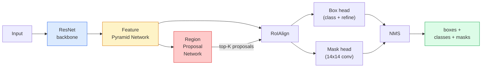

# 机器人机器人机器人机器人机器人机器人机器人机器人机器人机器人机器人机器人机器人机器人机器人机器人机器人机器人机器人机器人机器人机器人机器人机器人机器人机器人机器人机器人机器人机器人机器人机器人机器人机器人机器人机器人机器人机器人机器人机器人机器人机器人机器人机器人机器人机器人机器人机器人机器人机器人机器人机器人机器人机器人机器人机器人机器人机器人机器人机器人机器人机器人机器人机器人机器人机器人机器人机器人机器人机器人机器人机器人机器人机器人机器人机器人机器人机器人机器人机器人机器人机器

> 给快速R-CNN探测器加上一个很小的面具分支,就得到了实例细分点.

**Type:** Build + Learn
**Languages:** Python
**Prerequisites:** Phase 4 Lesson 06 (YOLO), Phase 4 Lesson 07 (U-Net)
**Time:** ~75 minutes

## 学习目标
- 端到端追踪 面具R-CNN架构:脊椎、FPN、RPN、RoIAlign、盒头、面具头
- 从零实现RoIA align,并解释为什么RoIPool不再被使用
- 使用火视觉的`maskrcnn_resnet50_fpn_v2`预训练模型 生成生产质量实例面具,并正确读取它的输出格式
- 通过换盒和面具头,并保持脊椎结,在小型自定义数据集上调整面具R-CNN

## 问题
语义分类为每个类 给出一个面具――实例分类为每个对象 给出一个面具,即使两个对象 属于同一类――统计个体数量、跨追踪,以及测量对象的测量对象――墙上的每个块的边界框、显微图像中的每个细胞) 都需要实例分类――

通过实例细分重新表述为检测加上面具来解决这个问题. 这个设计非常简单,直到接下来的五年里,几乎每篇实例细分论文都是 Mask R-CNN 的变体,而火视觉实现至今仍然是中小型数据集的生产默认选择.

难题的工程问题是:如何从一个提案框中切割一个固定的大小的特征区域,而这个框的角点不与像素界限相对?

## 概念
### 建筑



需要理解五个部分:

1. **Backbone** 在ImageNet上训练的ResNet-50或ResNet-101──生成步骤为4、8、16、32个功能地图层级──
2. **FPN (Feature Pyramid Network)**上下 + 侧接,让每个级别都具有C频道的语义丰富功能──检测会查询与对象大小匹配的FPN级别──
3. **RPN (Region Proposal Network)** 一个小型的头,在每个头位置上预测这里有没有物体?以及我该如何精细盒子?──每张图片产生约1000个建议──
4. **RoIAlign** 从任意FPN级上的任意框中采样固定大小(例如7x7) 的特征补丁──使用二线性样本,不做量化──
5. **Heads** 两层盒头,用于精炼盒子并选择类;再加一个小型卷头,为每一个建议输出一个`28x28`双重面具.

### 为什么RoIAlign而不是RoIPool

最初的快速R-CNN使用RoIPool,它把提案框拆成一个网格,在每个细胞中取最大的特征,并把所有坐标圆到整数.这种圆将使特征地图与输入像素坐标 最多错位一个完整的特征地图像像像在 224x224 图像影响较小,但当特征地图的步骤是 32 时会造成灾难性的后果.

```
RoIPool:
  box (34.7, 51.3, 98.2, 142.9)
  round -> (34, 51, 98, 142)
  split grid -> round each cell boundary
  misalignment accumulates at every step

RoIAlign:
  box (34.7, 51.3, 98.2, 142.9)
  sample at exact float coordinates using bilinear interpolation
  no rounding anywhere
```

现在每个重视定位的探测器都会使用它,包括YOLOv7seg、RT-DETR、Mask2Former。

### 单一段的RPN

在特征地图的每个位置,放置K个不同尺寸和形状的杆盒子――为每个杆预测一个对象性分数,以及一个回归抵消,用来将杆变成更贴合对象的盒子――根据分数保存在约1,000个盒子,在IoU 0.7 下应用NMS,然后把保留下来的盒子交给头――RPN使用自己的迷你损失训练,其结构与第6课的YOLO损失相似,只是两个类别的对象/没有对象) ――

### 面具头

对于每一个提案,面具头是一个很小的FCN:四个3x3conv,一个2xdeconv,一个最终的1x1conv,在`28x28`解析 下生成 `num_classes`个输出道――只保留与预测类对应的道;其他道会被忽视――这将掩盖预测与分类解──

给出一个原始像素尺寸的建议,得到最终的二进制面具.

### 损失

面具R-CNN有四类损失相加:

```
L = L_rpn_cls + L_rpn_box + L_box_cls + L_box_reg + L_mask
```

- `L_rpn_cls`现在`L_rpn_box` RPN 提案的客观性 + 框 逆转――
- `L_box_cls`头类上针对 (C+1) 类的背景含有) 交叉化
- `L_box_reg`头盒精炼上的光滑 L1──
- `L_mask` 28x28面具输出 上的每像素二进制交叉化

每个损失都有自己的默认权重;火视觉的实施将将它们作为构造论点 暴露出来.

### 输出格式

`torchvision.models.detection.maskrcnn_resnet50_fpn_v2`返回一个单词列表,每张图像对应一个单词:

```
{
    "boxes":  (N, 4) in (x1, y1, x2, y2) pixel coordinates,
    "labels": (N,) class IDs, 0 = background so indices are 1-based,
    "scores": (N,) confidence scores,
    "masks":  (N, 1, H, W) float masks in [0, 1] — threshold at 0.5 for binary,
}
```

面具已是全图像分辨率──28x28头输出已在内部完成样──


```figure
cv3-roialign-sampling
```

## 构建它
### 步骤1:从零开始实现

面具R-CNN的这个组件,使用代码理解比使用文字描述更简单.

```python
import torch
import torch.nn.functional as F

def roi_align_single(feature, box, output_size=7, spatial_scale=1 / 16.0):
    """
    feature: (C, H, W) single-image feature map
    box: (x1, y1, x2, y2) in original image pixel coordinates
    output_size: side of the output grid (7 for box head, 14 for mask head)
    spatial_scale: reciprocal of the feature map stride
    """
    C, H, W = feature.shape
    x1, y1, x2, y2 = [c * spatial_scale - 0.5 for c in box]
    bin_w = (x2 - x1) / output_size
    bin_h = (y2 - y1) / output_size

    grid_y = torch.linspace(y1 + bin_h / 2, y2 - bin_h / 2, output_size)
    grid_x = torch.linspace(x1 + bin_w / 2, x2 - bin_w / 2, output_size)
    yy, xx = torch.meshgrid(grid_y, grid_x, indexing="ij")

    gx = 2 * (xx + 0.5) / W - 1
    gy = 2 * (yy + 0.5) / H - 1
    grid = torch.stack([gx, gy], dim=-1).unsqueeze(0)
    sampled = F.grid_sample(feature.unsqueeze(0), grid, mode="bilinear",
                            align_corners=False)
    return sampled.squeeze(0)
```

每个数值都来自二线性样本位置――没有圆化,没有量化,也没有丢失梯度――

### 步骤2:与火视觉的RoIAlign进行比较

```python
from torchvision.ops import roi_align

feature = torch.randn(1, 16, 50, 50)
boxes = torch.tensor([[0, 10, 20, 100, 90]], dtype=torch.float32)  # (batch_idx, x1, y1, x2, y2)

ours = roi_align_single(feature[0], boxes[0, 1:].tolist(), output_size=7, spatial_scale=1/4)
theirs = roi_align(feature, boxes, output_size=(7, 7), spatial_scale=1/4, sampling_ratio=1, aligned=True)[0]

print(f"shape ours:   {tuple(ours.shape)}")
print(f"shape theirs: {tuple(theirs.shape)}")
print(f"max|diff|:    {(ours - theirs).abs().max().item():.3e}")
```

在`sampling_ratio=1`且`aligned=True`时,两者能在`1e-5`为了让我们能做到这一点.

### 步骤3:装载预训练式面具R-CNN

```python
import torch
from torchvision.models.detection import maskrcnn_resnet50_fpn_v2, MaskRCNN_ResNet50_FPN_V2_Weights

model = maskrcnn_resnet50_fpn_v2(weights=MaskRCNN_ResNet50_FPN_V2_Weights.DEFAULT)
model.eval()
print(f"params: {sum(p.numel() for p in model.parameters()):,}")
print(f"classes (including background): {len(model.roi_heads.box_predictor.cls_score.out_features * [0])}")
```

模型实际检测所有内容都从 id 1 开始──

### 步骤 4: 运行推断

```python
with torch.no_grad():
    x = torch.randn(3, 400, 600)
    predictions = model([x])
p = predictions[0]
print(f"boxes:  {tuple(p['boxes'].shape)}")
print(f"labels: {tuple(p['labels'].shape)}")
print(f"scores: {tuple(p['scores'].shape)}")
print(f"masks:  {tuple(p['masks'].shape)}")
```

面具度的形状是`(N, 1, H, W)`△以0.5 为门,为每一个对象 得到二进制面膜:

```python
binary_masks = (p['masks'] > 0.5).squeeze(1)  # (N, H, W) boolean
```

### 步骤5: 换头来定制类数

常见的细调配方:复用脊椎、FPN 和 RPN;替换两个分类器头──

```python
from torchvision.models.detection.faster_rcnn import FastRCNNPredictor
from torchvision.models.detection.mask_rcnn import MaskRCNNPredictor

def build_custom_maskrcnn(num_classes):
    model = maskrcnn_resnet50_fpn_v2(weights=MaskRCNN_ResNet50_FPN_V2_Weights.DEFAULT)
    in_features = model.roi_heads.box_predictor.cls_score.in_features
    model.roi_heads.box_predictor = FastRCNNPredictor(in_features, num_classes)
    in_features_mask = model.roi_heads.mask_predictor.conv5_mask.in_channels
    hidden_layer = 256
    model.roi_heads.mask_predictor = MaskRCNNPredictor(in_features_mask, hidden_layer, num_classes)
    return model

custom = build_custom_maskrcnn(num_classes=5)
print(f"custom cls_score.out_features: {custom.roi_heads.box_predictor.cls_score.out_features}")
```

`num_classes`必须包含背景类,因此一个有4个对象类的数据集应使用`num_classes=5`,我知道.

### 步骤 6: 结不需要培训的东西

在小型数据集中,结脊椎和FPN──只让RPN对象性+回归以及两个头学习──

```python
def freeze_backbone_and_fpn(model):
    # torchvision Mask R-CNN packs the FPN inside `model.backbone` (as
    # `model.backbone.fpn`), so iterating `model.backbone.parameters()` covers
    # both the ResNet feature layers and the FPN lateral/output convs.
    for p in model.backbone.parameters():
        p.requires_grad = False
    return model

custom = freeze_backbone_and_fpn(custom)
trainable = sum(p.numel() for p in custom.parameters() if p.requires_grad)
print(f"trainable after freeze: {trainable:,}")
```

在500张图像数据集中,这是收录与过度配合的区别.

## 使用它
完全训练循环只有40 行,并且在不同任务之间基本不变:

```python
def train_step(model, images, targets, optimizer):
    model.train()
    loss_dict = model(images, targets)
    losses = sum(loss for loss in loss_dict.values())
    optimizer.zero_grad()
    losses.backward()
    optimizer.step()
    return {k: v.item() for k, v in loss_dict.items()}
```

`targets`列表必须包含每张图像对应的句子,其中有`boxes`,我知道.`labels`和 `masks`(作为`(num_instances, H, W)`模型在训练中返回四个损失的指令,在评估中返回预测列表,由`model.training`决定

`pycocotools`评估员会同时为盒子和面具 生成mAP@IoU=0.5:0.95;你需要两个数字,才能判断瓶是盒子头还是面具头.

## 交付它
本课会产出:

- `outputs/prompt-instance-vs-semantic-router.md` 一个提示,会提出三个问题,并选择实例与语义与全观,以及精确的起始模型.
- `outputs/skill-mask-rcnn-head-swapper.md`一个技能,给定新的`num_classes`为了任意的火视觉检测模型 生成用于交换头的10 行代码

## 练习
1. **(Easy)**在100个随机盒上使用`torchvision.ops.roi_align`验证你的RoIA align──报告最大绝对差值──同时运行RoIPool(2017年之前的行为),并显示它在附近边界的盒子上会偏离约1-2个特征地图像素──
2. **(Medium)**在一个50图像的定制数据集中,任意两个类型:气球,鱼,坑,标志) 进行细节调节.`maskrcnn_resnet50_fpn_v2`结脊柱,训练20个时代,报告面具AP@0.5。
3. **(Hard)**将面具R-CNN的面具头换为预测56x56而不是28x28版本――测量前后mAP@IoU=0.75──解释为什么提升(或没有提升) 符合预期的边界精度/内存交易――

## 关键术语
| Term | What people say | What it actually means |
|------|----------------|----------------------|
| Mask R-CNN | “Detection plus masks” | Faster R-CNN + 一个小型 FCN head，为每个 proposal 的每个 class 预测一个 28x28 mask |
| FPN | “Feature pyramid” | top-down + lateral connections，让每个 stride level 都有 C channels 的语义丰富 features |
| RPN | “Region proposer” | 一个小型 conv head，每张图像生成约 1000 个 object/no-object proposals |
| RoIAlign | “No-rounding crop” | 从任意 float-coordinate box 中以 bilinear 方式采样固定大小的 feature grid |
| RoIPool | “Pre-2017 crop” | 与 RoIAlign 用途相同，但会 round box coordinates；已经过时 |
| Mask AP | “Instance mAP” | 使用 mask IoU 而不是 box IoU 计算的 average precision；COCO instance segmentation metric |
| Binary mask head | “Per-class mask” | 为每个 proposal 的每个 class 预测一个 binary mask；只保留 predicted class 的 channel |
| Background class | “Class 0” | 兜底的 “no object” class；真实 classes 的 indices 从 1 开始 |

## 延伸阅读
- [Mask R-CNN (He et al., 2017)](https://arxiv.org/abs/1703.06870)论文;关于RoIAlign的第3节是关键阅读
- [FPN: Feature Pyramid Networks (Lin et al., 2017)](https://arxiv.org/abs/1612.03144)FPN论文;每个现代探测器都会使用它
- [torchvision Mask R-CNN tutorial](https://pytorch.org/tutorials/intermediate/torchvision_tutorial.html)细调循环的参考
- [Detectron2 model zoo](https://github.com/facebookresearch/detectron2/blob/main/MODEL_ZOO.md) 生产级实施,提供几乎所有检测和细分 变体的训练有素重量
