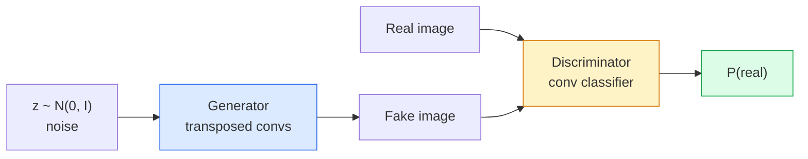
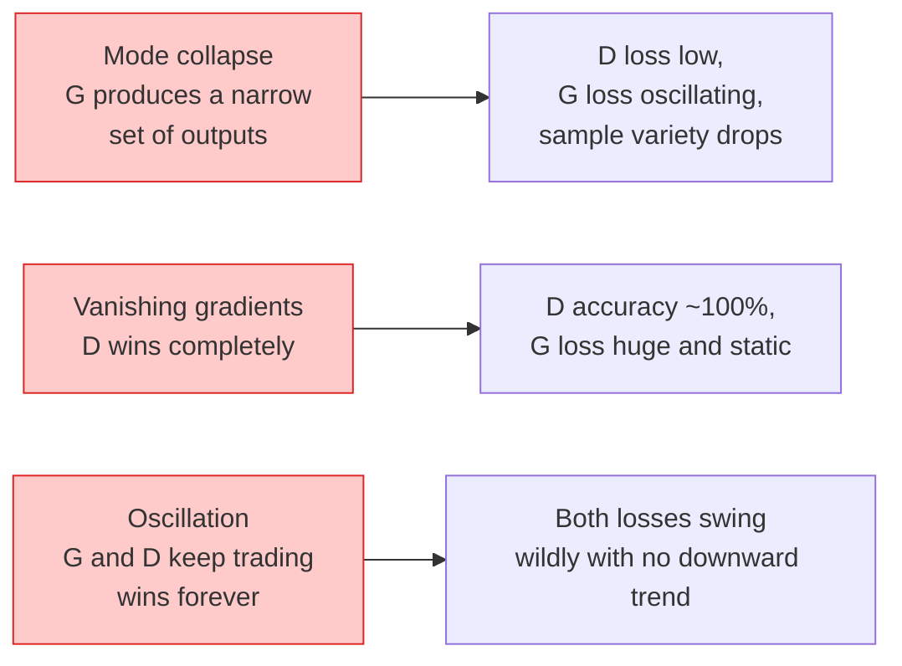

# 图像生成 GAN

> 两个神经网络之间存在着固定的关系.一个负责绘制,一个负责评判.

**Type:** Build
**Languages:** Python
**Prerequisites:** Phase 4 Lesson 03 (CNNs), Phase 3 Lesson 06 (Optimizers), Phase 3 Lesson 07 (Regularization)
**Time:** ~75 分钟

## 学习目标
- 解释生成器与歧视者之间的最小值以及为什么对应于p_model =p_data的平衡
- 在 PyTorch 中实现DCGAN,并在60行内让它生成连贯的32x32合成图像
- 使用三种标准技巧稳定GAN 训练:不和损失、光谱规范、TTUR (两次更新规则)
- 读取训练曲线,区分健康收与模式崩,动,歧视者赢得完全

## 问题
类别教会网络将图像映射到标签. 代人则反转这个问题:采样看起来像来自同一分布的新图像.

标准损失函数 (MSE、跨) 不能衡量这个样本是否来自真实分布──最小化以像素差异产生模糊的平均结果,而不是真实感觉样本──突破点在于学习损失:训练第二网络,让它的任务是区分真实与假的,并使用它来判断推动发电机──

格安 (Goodfellow等,2014) 定义了这个框架.到2018年,StyleGAN 已经能够产生与照片难以区分的1024x1024人脸.

## 概念
### 两家网络



**generator**接收一个噪声向量`z`并输出一张图像.**discriminator**接收一张图像并输出单个标志量:该图像为真实的概率.

### 游戏

希望自己判断正确的.

```
min_G max_D  E_x[log D(x)] + E_z[log(1 - D(G(z)))]
```

从右往左读:D 正在最大化它在真实中`log D(real)`假的`log (1 - D(fake))`图像的准确性. G 正在最小化 D 在假的上的准确性 希望它`D(G(z))`很高.

善良的朋友证明了这个最小值存在着一个全局平衡,其中`p_G = p_data`在所有位置都输出0.5,并且产生分布与真实分布之间的詹森-申农分歧为零.

### 无化的损失

上面的形式在数值上不稳定.`D(G(z))`对于每一个假的都接近零,所以`log(1 - D(G(z)))`对G的渐进会消失──修复方法:翻转G的损失──

```
L_D = -E_x[log D(x)] - E_z[log(1 - D(G(z)))]
L_G = -E_z[log D(G(z))]                          # non-saturating
```

现在当`D(G(z))`接近零时,G的损失 很大,渐进也有信息量――每个现代的GAN都使用这个变体进行训练――

### DCGAN架构规则

拉德福德·梅茨·辛塔拉 (2015) 将多年失败实验提炼成五条规则,使甘训练更加稳定:

1. 两个网络都如此)
2. 在发电机和分辨器中都使用批量标准,但G的输出和D的输入除外.
3. 在更深层次的架构中移除完全连接的层次.
4. 输出层外所有层使用 ReLU(输出层使用 tanh,将输出限制在 [-1, 1])。
5. 度度度度度度度度度度度度度度度度度度度度度度度度度度度度度度度度度度度度度度度度度度度度度度度度度度度度度度度度度度度度度度度度度度度度度度度度度度度度度度度度度度度度度度度度度度度度度度度度度度度度度度度度度度度度度度度度度度度度度度度度度度度度度度度度度度度度度度度度度度度度度度度度度度度度度度度度度度度度度度度度度度度度度度度度度度度度度度度度度度度度度度度度度度度度度度度度度度度度度度度度度度度度度度度度度

每个现代的基于 conv的GAN (StyleGAN,BigGAN,GigaGAN) 仍然从这些规则中发出,并一次替换其中的一部分.

### 失败模式及其特征



- **Mode collapse**修复:加入微批次歧视、光谱规范,或标签条件──
- **Discriminator wins**变强太快,G 的渐变消失──修复:减小 D、降低 D 学习率,或对真实标签 应用标签滑滑──
- **Oscillation**两网络不断抢占彼此优势,但从不接近平衡.

### 评估

没有什么实在的,你怎么知道它们是否在工作?

- **Sample inspection**每一个时代的结束时直接查看64个样本.
- **FID (Fréchet Inception Distance)**真实集合与生成集合的Inception-v3特征分布之间的距离──越低越好──社区标准──
- **Inception Score**较旧,也更脆弱;优先使用FID──
- **Precision/Recall for generative models**分别衡量质量 (精度) 和覆盖度 (回忆) ⋅比单独使用FID更有信息量⋅

对于小型合成数据运行,样本检查就足够了.


```figure
cv-gan-image
```

## 构建它
### 步骤1:生成器

一个小型DCGAN发电机,接收64维噪音并生成一张32x32图像.

```python
import torch
import torch.nn as nn

class Generator(nn.Module):
    def __init__(self, z_dim=64, img_channels=3, feat=64):
        super().__init__()
        self.net = nn.Sequential(
            nn.ConvTranspose2d(z_dim, feat * 4, kernel_size=4, stride=1, padding=0, bias=False),
            nn.BatchNorm2d(feat * 4),
            nn.ReLU(inplace=True),
            nn.ConvTranspose2d(feat * 4, feat * 2, kernel_size=4, stride=2, padding=1, bias=False),
            nn.BatchNorm2d(feat * 2),
            nn.ReLU(inplace=True),
            nn.ConvTranspose2d(feat * 2, feat, kernel_size=4, stride=2, padding=1, bias=False),
            nn.BatchNorm2d(feat),
            nn.ReLU(inplace=True),
            nn.ConvTranspose2d(feat, img_channels, kernel_size=4, stride=2, padding=1, bias=False),
            nn.Tanh(),
        )

    def forward(self, z):
        return self.net(z.view(z.size(0), -1, 1, 1))
```

转换的四个车,每个都使用`kernel_size=4, stride=2, padding=1`通过它将输出激活限制在 [-1, 1]

### 步骤2: 歧视者

发电机的镜像―― 泄漏的电源,最后输出一个标量逻辑――

```python
class Discriminator(nn.Module):
    def __init__(self, img_channels=3, feat=64):
        super().__init__()
        self.net = nn.Sequential(
            nn.Conv2d(img_channels, feat, kernel_size=4, stride=2, padding=1),
            nn.LeakyReLU(0.2, inplace=True),
            nn.Conv2d(feat, feat * 2, kernel_size=4, stride=2, padding=1, bias=False),
            nn.BatchNorm2d(feat * 2),
            nn.LeakyReLU(0.2, inplace=True),
            nn.Conv2d(feat * 2, feat * 4, kernel_size=4, stride=2, padding=1, bias=False),
            nn.BatchNorm2d(feat * 4),
            nn.LeakyReLU(0.2, inplace=True),
            nn.Conv2d(feat * 4, 1, kernel_size=4, stride=1, padding=0),
        )

    def forward(self, x):
        return self.net(x).view(-1)
```

最后一个子将`4x4`降到 功能地图`1x1`△输出是每张图像一个标量;只在损失计算期间应用标量.

### 步骤3:培训步骤

交替执行:每批次先更新一次 D,再更新一次 G.

```python
import torch.nn.functional as F

def train_step(G, D, real, z, opt_g, opt_d, device):
    real = real.to(device)
    bs = real.size(0)

    # D step
    opt_d.zero_grad()
    d_real = D(real)
    d_fake = D(G(z).detach())
    loss_d = (F.binary_cross_entropy_with_logits(d_real, torch.ones_like(d_real))
              + F.binary_cross_entropy_with_logits(d_fake, torch.zeros_like(d_fake)))
    loss_d.backward()
    opt_d.step()

    # G step
    opt_g.zero_grad()
    d_fake = D(G(z))
    loss_g = F.binary_cross_entropy_with_logits(d_fake, torch.ones_like(d_fake))
    loss_g.backward()
    opt_g.step()

    return loss_d.item(), loss_g.item()
```

步骤中`G(z).detach()`至关重要:我们不希望在更新D时渐进流入G.

### 步骤 4: 在合成形状上运行完整的训练循环

```python
from torch.utils.data import DataLoader, TensorDataset
import numpy as np

def synthetic_images(num=2000, size=32, seed=0):
    rng = np.random.default_rng(seed)
    imgs = np.zeros((num, 3, size, size), dtype=np.float32) - 1.0
    for i in range(num):
        r = rng.uniform(6, 12)
        cx, cy = rng.uniform(r, size - r, size=2)
        yy, xx = np.meshgrid(np.arange(size), np.arange(size), indexing="ij")
        mask = (xx - cx) ** 2 + (yy - cy) ** 2 < r ** 2
        color = rng.uniform(-0.5, 1.0, size=3)
        for c in range(3):
            imgs[i, c][mask] = color[c]
    return torch.from_numpy(imgs)

device = "cuda" if torch.cuda.is_available() else "cpu"
data = synthetic_images()
loader = DataLoader(TensorDataset(data), batch_size=64, shuffle=True)

G = Generator(z_dim=64, img_channels=3, feat=32).to(device)
D = Discriminator(img_channels=3, feat=32).to(device)
opt_g = torch.optim.Adam(G.parameters(), lr=2e-4, betas=(0.5, 0.999))
opt_d = torch.optim.Adam(D.parameters(), lr=2e-4, betas=(0.5, 0.999))

for epoch in range(10):
    for (batch,) in loader:
        z = torch.randn(batch.size(0), 64, device=device)
        ld, lg = train_step(G, D, batch, z, opt_g, opt_d, device)
    print(f"epoch {epoch}  D {ld:.3f}  G {lg:.3f}")
```

`Adam(lr=2e-4, betas=(0.5, 0.999))`是DCGAN默认设置较低的beta1 会避免动力 过度稳定对抗游戏

### 步骤5:采样

```python
@torch.no_grad()
def sample(G, n=16, z_dim=64, device="cpu"):
    G.eval()
    z = torch.randn(n, z_dim, device=device)
    imgs = G(z)
    imgs = (imgs + 1) / 2
    return imgs.clamp(0, 1)
```

采样前始终切换到评估模式――对DCGAN来说,这是很重要的,因为批量标准会使用运行统计数据,而不是当前批量统计数据――

### 步骤 6: 频谱规范化

据报道,这项计划是"一"的.

```python
from torch.nn.utils import spectral_norm

def build_sn_discriminator(img_channels=3, feat=64):
    return nn.Sequential(
        spectral_norm(nn.Conv2d(img_channels, feat, 4, 2, 1)),
        nn.LeakyReLU(0.2, inplace=True),
        spectral_norm(nn.Conv2d(feat, feat * 2, 4, 2, 1)),
        nn.LeakyReLU(0.2, inplace=True),
        spectral_norm(nn.Conv2d(feat * 2, feat * 4, 4, 2, 1)),
        nn.LeakyReLU(0.2, inplace=True),
        spectral_norm(nn.Conv2d(feat * 4, 1, 4, 1, 0)),
    )
```

将`Discriminator`替换为`build_sn_discriminator()`后,你通常不再需要TTUR技巧.

## 使用它
对于严的代,使用预训练的重量或转换到扩散.

- `torch_fidelity`没有必要编写自定义评估代码.
- `pytorch-gan-zoo`及`StudioGAN`提供经过测试的DCGAN、WGAN-GP、SN-GAN、StyleGAN 和 BigGAN 实现.

到2026年,GAN仍然是这些场景的最佳选择:实时图像生成 (实时图像生成) 延迟 <10 ms) 风格转移,具有精确控制的图像转换 (图像转换) 像2Pix、循环GAN) 传播在摄影现实主义和文本调整上胜出.

## 交付它
本课产出:

- `outputs/prompt-gan-training-triage.md`一个提示,用于读取训练曲线描述并选择失败模式,以及单个推修复方案.
- `outputs/skill-dcgan-scaffold.md`一个技能,可根据`z_dim`、目标`image_size`和 `num_channels`编写DCGAN架子,包括训练循环和样本储存器.

## 练习
1. **(Easy)**在合成圈数据集上训练上的DCGAN,并在每个时代的结束时保存16个样本的网格. 到什么时代,生成的圆会变得明显圆?
2. **(Medium)**用光谱规范 替换分辨器的批量规范 并排训练两版本 哪个收更快?哪个在三个种子中上方差更低?
3. **(Hard)**实现条件DCGAN:将类标签输入 G 和 D(在 G 中将一个热拼接到噪音,在 D 中拼接一个类嵌入频道) ・在第7课中合成"圆与平方"数据集 上训,并通过使用指定标签 采样来展示类调节 有效之──

## 关键术语
| Term | What people say | What it actually means |
|------|----------------|----------------------|
| Generator (G) | “负责画东西的网络” | 将 noise 映射到图像；训练目标是骗过 discriminator |
| Discriminator (D) | “评判者” | Binary classifier；训练目标是区分真实图像与生成图像 |
| Minimax | “这个博弈” | 在 adversarial loss 上对 G 取 min、对 D 取 max；均衡是 p_G = p_data |
| Non-saturating loss | “数值上合理的版本” | G 的 Loss 是 -log(D(G(z)))，而不是 log(1 - D(G(z)))，以避免训练早期 Gradient 消失 |
| Mode collapse | “Generator 只生成一种东西” | G 只生成数据分布中的一小部分；用 SN、minibatch discrimination 或更大的 batch 修复 |
| TTUR | “两个 learning rates” | D 比 G 学得更快，通常快 2-4 倍；稳定训练 |
| Spectral norm | “1-Lipschitz layer” | 一种 weight-normalisation，用来限制每层的 Lipschitz constant；防止 D 变得任意陡峭 |
| FID | “Fréchet Inception Distance” | 真实集合与生成集合的 Inception-v3 feature distributions 之间的距离；标准评估指标 |

## 延伸阅读
- [Generative Adversarial Networks (Goodfellow et al., 2014)](https://arxiv.org/abs/1406.2661)开创这一方向的论文
- [DCGAN (Radford, Metz, Chintala, 2015)](https://arxiv.org/abs/1511.06434)让GAN可训练的架构规则
- [Spectral Normalization for GANs (Miyato et al., 2018)](https://arxiv.org/abs/1802.05957)最有用的单个稳定技巧
- [StyleGAN3 (Karras et al., 2021)](https://arxiv.org/abs/2106.12423)SOTA GAN; 读起来像是过去十年的所有技巧的精选集
