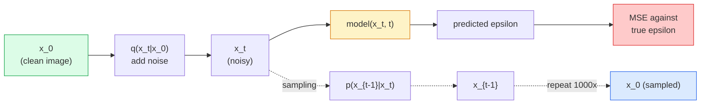

# 图像生成  扩散模型

> 散模型学习是指标. 训练它从含噪音图像中删除一小部分噪音,反向重复这个过程一千次,你就得到了一个图像生成器.

**Type:** Build
**Languages:** Python
**Prerequisites:** Phase 4 Lesson 07 (U-Net), Phase 1 Lesson 06 (Probability), Phase 3 Lesson 06 (Optimizers)
**Time:** ~75 分钟

## 学习目标

- 推导前进的噪音过程 `x_0 -> x_1 -> ... -> x_T`解释为什么关闭`q(x_t | x_0)`为了任何一个城市成立
- 实现一个DDPM风格的训练目标,用于回归每一步加入的噪音,并实现一个从纯噪音 逐步回归图像的样本
- 构建一个时间定制的U-Net(小到可以在CPU上训练),用于预测任意时间步骤的噪音
- 解释DDPM和DDIM采样的区别以及各自适用的场景 (课23会深入讲解流量匹配和修正流量)

## 问题

散模型是代式生成的:从纯噪音开始,通过小步指标,图像逐渐浮现.它们速度慢,但很容易训练.过去五年,后一种特点占主导地位:任何小团队都可以训练一个散模型并得到合理的样本;而散模型是需要多年失败运行中学的技巧.

除了训练稳定性之外,Diffusion的代结构也解锁了现代图像生成中的一切能力:文字调节,涂料,图像编辑,超分辨率,可控制的风格.样本循环的每一步都是注入新约束的入口.正是这个,使得稳定的Diffusion,Imagen,DALL-E3以及你使用的每个可控图像模型都基于Diffusion.

本课会构建一个最小的DDPM:前面噪音,后面谴责,训练循环. 下一课:稳定传播将其连接到一个生产系统,其中包含VAE,文本编码器和无类别器的指导.

## 核心概念

### 未来的过程

取一张图像 `x_0`加入少量高斯噪音 得到`x_1`再加入少量噪音 得到`x_2`继续进行,直到`x_T`几乎无法与纯高斯噪音区分.

```
q(x_t | x_{t-1}) = N(x_t; sqrt(1 - beta_t) * x_{t-1},  beta_t * I)
```

`beta_t`变节目较小,通常在T=1000步内从 0.0001 线性增长到 0.02 步.

### 闭式跳转

逐步加入噪音是一个马科夫链,但数学上可以折叠:你可以直接从一步.`x_0`样本 出`x_t`,我知道.

```
Define alpha_t = 1 - beta_t
Define alpha_bar_t = prod_{s=1..t} alpha_s

Then:
  q(x_t | x_0) = N(x_t; sqrt(alpha_bar_t) * x_0,  (1 - alpha_bar_t) * I)

Equivalently:
  x_t = sqrt(alpha_bar_t) * x_0 + sqrt(1 - alpha_bar_t) * epsilon
  where epsilon ~ N(0, I)
```

们可以选择一个.`t`直接从`x_0`样本 出`x_t`没有必要模拟完整的马科夫链.

### 逆转过程

进步过程是固定的.`p(x_{t-1} | x_t)`是神经网络要学习的内容――分散模型 不直接预测 `x_{t-1}`它们预测在第一个步骤加入的噪音`epsilon`然后由数学公式推导出来`x_{t-1}`,我知道.



### 训练 损失

对于每一个训练步骤:

1. 样本 一张真实图像 `x_0`,我知道.
2. 从 [1, T] 中平均样本 一个时间步骤`t`,我知道.
3. 样本噪音`epsilon ~ N(0, I)`,我知道.
4. 计算`x_t = sqrt(alpha_bar_t) * x_0 + sqrt(1 - alpha_bar_t) * epsilon`,我知道.
5. 用网络预测`epsilon_theta(x_t, t)`,我知道.
6. 最小化`|| epsilon - epsilon_theta(x_t, t) ||^2`,我知道.

没有敌对游戏,没有崩,也没有振荡.

### 采样器 (DDPM)

生成时: 从`x_T ~ N(0, I)`开始,一步一步反向走.

```
for t = T, T-1, ..., 1:
    eps = model(x_t, t)
    x_{t-1} = (1 / sqrt(alpha_t)) * (x_t - (beta_t / sqrt(1 - alpha_bar_t)) * eps) + sqrt(beta_t) * z
    where z ~ N(0, I) if t > 1, else 0
return x_0
```

关键在于,尽管反向条件一般没有已知闭式形式,但对于这个特定的高斯式前进过程,它是有闭式的.

### 为什么是1000步

未来噪音时间表的选择目标是让每一步加入刚好足够的噪音,使反步近似高斯人.步数太少,反步远离高斯人.网络难以很好地建模.步数太多,样本会变得昂贵,收益也会减少.

### 快20倍的样本采集

训练相同,样本改变――DDIM(Song et al., 2020) 定义了一个确定性的反向过程,可以在不重新训练的情况下跳过时间步骤――使用DDIM以50步样本,可以得到接近1000步DDPM的质量――每个生产系统都会使用DDIM或更快的变体――DPM-Solver、Euler祖先)――

### 时间定制

网络`epsilon_theta(x_t, t)`需要知道它正在指明 哪个时间步骤――现代的扩散模型通过状时间嵌入注入`t`(与变压器中的位置编码的想法相同),并将其添加到每个U-Net层级的功能地图上.

```
t_embedding = sinusoidal(t)
feature_map += MLP(t_embedding)
```

没有时间调节,网络就必须从图像本身来猜测噪音水平,这也可以工作,但样本效率会低得多.


```figure
cv-diffusion-image
```

## 构建它

### 步骤1:噪声时间表

```python
import torch

def linear_beta_schedule(T=1000, beta_start=1e-4, beta_end=2e-2):
    return torch.linspace(beta_start, beta_end, T)


def precompute_schedule(betas):
    alphas = 1.0 - betas
    alphas_cumprod = torch.cumprod(alphas, dim=0)
    return {
        "betas": betas,
        "alphas": alphas,
        "alphas_cumprod": alphas_cumprod,
        "sqrt_alphas_cumprod": torch.sqrt(alphas_cumprod),
        "sqrt_one_minus_alphas_cumprod": torch.sqrt(1.0 - alphas_cumprod),
        "sqrt_recip_alphas": torch.sqrt(1.0 / alphas),
    }

schedule = precompute_schedule(linear_beta_schedule(T=1000))
```

预先计算一次,在训练和采样时按指数收集.

### 步骤 2:前进扩散 (q_样本)

```python
def q_sample(x0, t, noise, schedule):
    sqrt_a = schedule["sqrt_alphas_cumprod"][t].view(-1, 1, 1, 1)
    sqrt_one_minus_a = schedule["sqrt_one_minus_alphas_cumprod"][t].view(-1, 1, 1, 1)
    return sqrt_a * x0 + sqrt_one_minus_a * noise
```

一行闭式形式――`t`它们是个时间段,分数中每张图像对应一个.

### 步骤3: 一个小型的时间定制的U-网

```python
import torch.nn as nn
import torch.nn.functional as F
import math

def timestep_embedding(t, dim=64):
    half = dim // 2
    freqs = torch.exp(-math.log(10000) * torch.arange(half, device=t.device) / half)
    args = t[:, None].float() * freqs[None]
    emb = torch.cat([args.sin(), args.cos()], dim=-1)
    return emb


class TinyUNet(nn.Module):
    def __init__(self, img_channels=3, base=32, t_dim=64):
        super().__init__()
        self.t_mlp = nn.Sequential(
            nn.Linear(t_dim, base * 4),
            nn.SiLU(),
            nn.Linear(base * 4, base * 4),
        )
        self.t_dim = t_dim
        self.enc1 = nn.Conv2d(img_channels, base, 3, padding=1)
        self.enc2 = nn.Conv2d(base, base * 2, 4, stride=2, padding=1)
        self.mid = nn.Conv2d(base * 2, base * 2, 3, padding=1)
        self.dec1 = nn.ConvTranspose2d(base * 2, base, 4, stride=2, padding=1)
        self.dec2 = nn.Conv2d(base * 2, img_channels, 3, padding=1)
        self.time_proj = nn.Linear(base * 4, base * 2)

    def forward(self, x, t):
        t_emb = timestep_embedding(t, self.t_dim)
        t_emb = self.t_mlp(t_emb)
        t_proj = self.time_proj(t_emb)[:, :, None, None]

        h1 = F.silu(self.enc1(x))
        h2 = F.silu(self.enc2(h1)) + t_proj
        h3 = F.silu(self.mid(h2))
        d1 = F.silu(self.dec1(h3))
        d2 = torch.cat([d1, h1], dim=1)
        return self.dec2(d2)
```

两层U-Net,并进入瓶时空调.

### 步骤4:训练循环

```python
def train_step(model, x0, schedule, optimizer, device, T=1000):
    model.train()
    x0 = x0.to(device)
    bs = x0.size(0)
    t = torch.randint(0, T, (bs,), device=device)
    noise = torch.randn_like(x0)
    x_t = q_sample(x0, t, noise, schedule)
    pred = model(x_t, t)
    loss = F.mse_loss(pred, noise)
    optimizer.zero_grad()
    loss.backward()
    optimizer.step()
    return loss.item()
```

这就是完整的训练循环.没有GAN游戏,没有专业损失,只有一次MSE调用.

### 步骤 5: 样本 (DDPM)

```python
@torch.no_grad()
def sample(model, schedule, shape, T=1000, device="cpu"):
    model.eval()
    x = torch.randn(shape, device=device)
    betas = schedule["betas"].to(device)
    sqrt_one_minus_a = schedule["sqrt_one_minus_alphas_cumprod"].to(device)
    sqrt_recip_alphas = schedule["sqrt_recip_alphas"].to(device)

    for t in reversed(range(T)):
        t_batch = torch.full((shape[0],), t, dtype=torch.long, device=device)
        eps = model(x, t_batch)
        coef = betas[t] / sqrt_one_minus_a[t]
        mean = sqrt_recip_alphas[t] * (x - coef * eps)
        if t > 0:
            x = mean + torch.sqrt(betas[t]) * torch.randn_like(x)
        else:
            x = mean
    return x
```

在真实代码中,你会把它替换为DDIM50步样本.

### 步骤 6:DDIM样品测试 (确定性,约快20倍)

```python
@torch.no_grad()
def sample_ddim(model, schedule, shape, steps=50, T=1000, device="cpu", eta=0.0):
    model.eval()
    x = torch.randn(shape, device=device)
    alphas_cumprod = schedule["alphas_cumprod"].to(device)

    ts = torch.linspace(T - 1, 0, steps + 1).long()
    for i in range(steps):
        t = ts[i]
        t_prev = ts[i + 1]
        t_batch = torch.full((shape[0],), t, dtype=torch.long, device=device)
        eps = model(x, t_batch)
        a_t = alphas_cumprod[t]
        a_prev = alphas_cumprod[t_prev] if t_prev >= 0 else torch.tensor(1.0, device=device)
        x0_pred = (x - torch.sqrt(1 - a_t) * eps) / torch.sqrt(a_t)
        sigma = eta * torch.sqrt((1 - a_prev) / (1 - a_t) * (1 - a_t / a_prev))
        dir_xt = torch.sqrt(1 - a_prev - sigma ** 2) * eps
        noise = sigma * torch.randn_like(x) if eta > 0 else 0
        x = torch.sqrt(a_prev) * x0_pred + dir_xt + noise
    return x
```

`eta=0`是完全确定性的 输入总会产生相同的输出)`eta=1`恢复了DPM.

## 使用它

生产工作中,使用 `diffusers`其他:

```python
from diffusers import DDPMScheduler, UNet2DModel

unet = UNet2DModel(sample_size=32, in_channels=3, out_channels=3, layers_per_block=2)
scheduler = DDPMScheduler(num_train_timesteps=1000)
```

这个库提供现成的时间表表,以及LoRA细调辅助器.

在研究工作中,`k-diffusion`它们是最有效的,最有效的.

## 交付它

本课会产出:

- `outputs/prompt-diffusion-sampler-picker.md` 一个提示,将基于质量目标,延迟预算和条件类型选择
- `outputs/skill-noise-schedule-designer.md` 一个技能,会根据T 和目标腐败水平 生成线性、可素或西格莫ид贝塔时间表,并附带信号与噪音比 随着时间变化的诊断图.

## 练习

1. **（简单）**可视化前进过程:取一张图像,并绘制`t in [0, 100, 250, 500, 750, 1000]`时的`x_t`验证`x_1000`看起来像纯粹的高斯人噪音.
2. **（中等）**在合成圈数据集上训练TinyUNet 20 个时代,并采样 16 个圈子──比较DDPM (1000 步) 和DDIM (50 步) 采样:它们能从相同的噪音种子产生相似图像吗?
3. **（困难）**实现"声"时间表 (尼乔尔和达里瓦尔,2021):`alpha_bar_t = cos^2((t/T + s) / (1 + s) * pi / 2)`△使用线性和共数表 练习同一个模型,并展示共数在低步数时能产生更好的样本。

## 关键术语

| Term | 人们通常怎么说 | 实际含义 |
|------|----------------|----------------------|
| Forward process | “随时间加入 noise” | 一个固定的 Markov chain，会在 T 步内把图像破坏成 Gaussian noise |
| Reverse process | “一步步 denoise” | 学到的分布，会从 noise 逐步走回图像 |
| Epsilon prediction | “预测 noise” | 训练目标：`epsilon_theta(x_t, t)` 预测在第 t 步加入的 noise |
| Beta schedule | “noise 大小” | T 个小 variance 组成的序列，定义每一步进入多少 noise |
| alpha_bar_t | “累计保留因子” | 到时间 t 为止的 (1 - beta_s) 乘积；t 越大，剩余信号越少 |
| DDPM sampler | “Ancestral，随机” | 从每个 x_{t-1} 的 conditional Gaussian 中 sample；1000 步 |
| DDIM sampler | “确定性，快速” | 将 sampling 重写为确定性 ODE；20-100 步即可得到相似质量 |
| Time conditioning | “告诉 model 当前是哪个 t” | 注入 U-Net 的 t 的 sinusoidal embedding，让它知道 noise level |

## 延伸阅读

- [Denoising Diffusion Probabilistic Models (Ho et al., 2020)](https://arxiv.org/abs/2006.11239)让传播变得实用,并击败FID上GAN的论文
- [Improved DDPM (Nichol & Dhariwal, 2021)](https://arxiv.org/abs/2102.09672)共数时间表和v参数化
- [DDIM (Song, Meng, Ermon, 2020)](https://arxiv.org/abs/2010.02502) 让实际推断 成为可能的确定性样本
- [Elucidating the Design Space of Diffusion (Karras et al., 2022)](https://arxiv.org/abs/2206.00364) 对每一个 传播设计选择的统一视角;当前最佳参考
