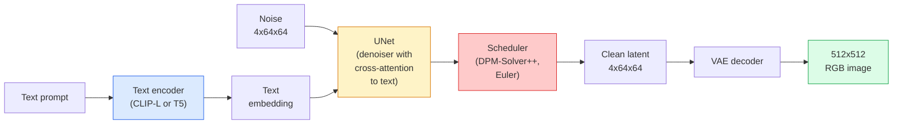

# 结构与细调

> 稳定扩散是一种DDPM,它在预训练 VAE的隐藏空间中运行,通过交叉关注以文本为条件,使用快速确定性的ODE解决器进行采样,并由无分类器指导引导.

**Type:** Learn + Use
**Languages:** Python
**Prerequisites:** Phase 4 Lesson 10 (Diffusion), Phase 7 Lesson 02 (Self-Attention)
**Time:** ~75 分钟

## 学习目标
- 追踪稳定传播管道的五个组成部分:VAE、文字编码器、U-Net、计时器、安全检查器,并理解它们实际做什么
- 解释隐形扩散以及为什么在4x64x64隐形空间中训练(而不是在3x512x512图像上训练) 可以在不损质量的情况下计算量将降低48x
- 使用 `diffusers`生成图像,运行图像到图像,涂料和控制网引导的生成
- 在小型自定义数据集上使用LoRA细调稳定扩散,并推断

## 问题
直接在512x512 RGB 图像上训练 DDPM 成本很高. 每个训练步骤都需要通过一个U-Net做后传播,而这个U-Net 看到的是3x512x512 = 786,432个输入值;采样还需要通过同一个U-Net 进行50+次前进.

让开放权重的文字到图像 变得实用的技巧是**latent diffusion**训练一个VAE,将3x512x512 图像映射到4x64x64 潜伏子再映射回来,然后在这个潜伏空间中做 Diffusion──计算量下降`(3*512*512)/(4*64*64) = 48x`在同一块GPU上,采样时间从几秒降到两秒内.

几乎所有现代图像生成模型SDXL、SD3、FLUX、HunyuanDiT、Wan-Video都是隐藏的扩散模型,只是在自动编码器、测量器(U-Net或 DiT) 和文本条件化上有所变化.

## 概念
### 管道



- **VAE** 结的自动编码器──编码器将图像转换为隐形的图像――用于img2img和训练.
- **Text encoder** CLIP文本编码器(SD 1.x/2.x)、CLIP-L + CLIP-G(SDXL) 或 T5-XXL(SD3/FLUX) 』生成一串的代币嵌入式──
- **U-Net**指标者──包含跨重视层,在每个分辨率层级,从潜伏到文本嵌入式──
- **Scheduler**采样算法 (DDIM、Euler、DPM-Solver++) 』选择 sigmas,并将预测的噪音混合回隐藏──
- **Safety checker**可选的输出图像NSFW / 非法内容过器──

### 无分类指导 (CFG)

常规文本条件化会针对每一个提示`c`学习 `epsilon_theta(x_t, t, c)`只有10%的时间会被丢弃.`c`为了实现一个能同时预测条件和无条件噪音的单一模型.

```
eps = eps_uncond + w * (eps_cond - eps_uncond)
```

`w`是指导尺度.`w=0`是无条件的,`w=1`是普通的条件,`w>1`总体而言, 产量推向更快速 条件约束, 价格是多样性下降.`w=7.5`,我知道.

没有它,输出偏差很弱;有它,即将占主导地位.

### 隐形空间几何学

维亚的4道隐藏不仅仅是压缩后图像――它是一个多元的算术运算大致对应语义编辑 (即时工程+插图都发生在这里),也是Difusion U-Net 投入全部建模预算进行训练的空间――解码一个随机的4x64x64隐藏图像不会产生随机图像,而是会产生垃圾结果,因为只有特定的隐藏子多元能解码有效图像――

两个结果:

1. **Img2img**由于编码接近可逆,图像结构会保留下来;内容会基于快速变化.
2. **Inpainting**面具 区域;非面具 区域保留为已编码的隐藏──

### 网络架构

SD U-Net 是小网的大型版本,并增加了三点:

- 每个空间分辨率上**Transformer blocks**包含自我注意力+对文本嵌入的跨度注意力.
- 通过阴道编码上的MLP得到**Time embedding**,我知道.
- 编码器和解码器在匹配分辨率之间**Skip connections**,我知道.

SD 1.5 的总参数:约860M──SDXL:约2.6B──FLUX:约12B──参数的增长主要来自注意层──

### 洛拉细调

为了稳定分散做完整的细节调整 需要20+GBVRAM,并更新860M个参数――LoRA(低级调整) 保持基模型结,并向注意层注入小型级分解矩阵――用于SD的LoRA适配器通常为10-50MB,在单块消费级GPU上训练10-60分钟,并在推断时作为降级修改加载――

```
Original: W_q : (d_in, d_out)   frozen
LoRA:     W_q + alpha * (A @ B)   where A : (d_in, r), B : (r, d_out)

r is typically 4-32.
```

洛拉是几乎所有社区的微调发作方式.

### 你会看到的时间表

- **DDIM** 确定性,大约50步,简单――
- **Euler ancestral** 随机性,30-50步,样本略有创意.
- **DPM-Solver++ 2M Karras** 确定性,20-30步,生产默认选择──
- **LCM / TCD / Turbo**一致性模型和蒸变体;1-4步骤,但会牺牲部分质量──

在`diffusers`换机调节器只需要一行改动,有时不需要任何重训就能修复采样问题.


```figure
cv3-latent-compression
```

## 构建它
本课端到端使用`diffusers`它们本身都是各自课程的主题; 目的是熟悉生产级API.

### 步骤1:文字到图像

```python
import torch
from diffusers import StableDiffusionPipeline

pipe = StableDiffusionPipeline.from_pretrained(
    "runwayml/stable-diffusion-v1-5",
    torch_dtype=torch.float16,
).to("cuda")

image = pipe(
    prompt="a dog riding a skateboard in tokyo, studio ghibli style",
    guidance_scale=7.5,
    num_inference_steps=25,
    generator=torch.Generator("cuda").manual_seed(42),
).images[0]
image.save("dog.png")
```

`float16`在没有可见质量损失的情况下将VRAM减半.`num_inference_steps=25`效果相当于使用DDIM`num_inference_steps=50`,我知道.

### 步骤2: 改变时间表

```python
from diffusers import DPMSolverMultistepScheduler, EulerAncestralDiscreteScheduler

pipe.scheduler = DPMSolverMultistepScheduler.from_config(pipe.scheduler.config)
pipe.scheduler = EulerAncestralDiscreteScheduler.from_config(pipe.scheduler.config)
```

随着 U-Net 权重的状态,你可以在 DDPM 上训练,然后使用任意的调度器采样.

### 步骤3: 图像到图像

```python
from diffusers import StableDiffusionImg2ImgPipeline
from PIL import Image

img2img = StableDiffusionImg2ImgPipeline.from_pretrained(
    "runwayml/stable-diffusion-v1-5",
    torch_dtype=torch.float16,
).to("cuda")

init_image = Image.open("dog.png").convert("RGB").resize((512, 512))
out = img2img(
    prompt="a dog riding a skateboard, oil painting",
    image=init_image,
    strength=0.6,
    guidance_scale=7.5,
).images[0]
```

`strength`表示在指责之前要加入多少噪音(0.0 = 不变,1.0 = 完全重新生成) ・0.5-0.7 是风格转移的标准范围──

### 步骤 4:涂料

```python
from diffusers import StableDiffusionInpaintPipeline

inpaint = StableDiffusionInpaintPipeline.from_pretrained(
    "runwayml/stable-diffusion-inpainting",
    torch_dtype=torch.float16,
).to("cuda")

image = Image.open("dog.png").convert("RGB").resize((512, 512))
mask = Image.open("dog_mask.png").convert("L").resize((512, 512))

out = inpaint(
    prompt="a cat",
    image=image,
    mask_image=mask,
    guidance_scale=7.5,
).images[0]
```

面具中白色图像是要重新生成的区域.

### 步骤 5: 载荷量

```python
pipe.load_lora_weights("sayakpaul/sd-lora-ghibli")
pipe.fuse_lora(lora_scale=0.8)

image = pipe(prompt="a village square in ghibli style").images[0]
```

`lora_scale`控制强度;0.0 = 无效,1.0 = 完整效果.`fuse_lora`接收器将在原地到重中以提高速度,但会阻止切换.`pipe.unfuse_lora()`,我知道.

### 步骤 6: LoRA培训 (草图)

真正的LORA培训 位于`peft`或`diffusers.training`中──大纲如下:

```python
# Pseudocode
for step, batch in enumerate(dataloader):
    images, prompts = batch
    latents = vae.encode(images).latent_dist.sample() * 0.18215

    t = torch.randint(0, num_train_timesteps, (batch_size,))
    noise = torch.randn_like(latents)
    noisy_latents = scheduler.add_noise(latents, noise, t)

    text_emb = text_encoder(tokenizer(prompts))

    pred_noise = unet(noisy_latents, t, text_emb)  # LoRA weights injected here

    loss = F.mse_loss(pred_noise, noise)
    loss.backward()
    optimizer.step()
```

只有LoRA矩阵会接收格里第安;基 U-Net、VAE 和文本编码器都被结结结. 使用批量尺寸为 1 和格里第安检查时,这可以适应8GBVRAM──

## 使用它
在生产中,你实际上需要做出的决定是:

- **Model family** SD 1.5 用于开源社区细节调音,SDXL 用于更高忠诚度,SD3 / FLUX 用于最先进的和严格许可要求.
- **Scheduler**:20-30步骤 使用DPM-Solver++ 2M Karras;当延迟低于1s时使用LCM-LoRA──
- **Precision**时间:`float16`更新设备上使用`bfloat16`VRAM 紧张时使用 `int8`(通过)`bitsandbytes`或`compel`
- **Conditioning**基本管道上加入控制网 (可用);如果需要更强的控制,

对于批量产量,`AUTO1111`现在,`ComfyUI`是社区工具;对于生产API,使用 `diffusers`其他`accelerate`通过使用TensorRT编译的`optimum-nvidia`,我知道.

## 交付它
本课产出:

- `outputs/prompt-sd-pipeline-planner.md` 一个提示,根据延迟预算,忠诚度目标和许可限制,选择SD 1.5 / SDXL / SD3 / FLUX,以及调度器和精度.
- `outputs/skill-lora-training-setup.md` 一个技能,用于自定义数据集编写完整的LoRA培训配置,包括标题,排名,批量和学习率.

## 练习
1. **(Easy)**使用 `[1, 3, 5, 7.5, 10, 15]`中中 `guidance_scale`生成同一个提示――描述图像如何变化―― 在哪个指导值开始出现文物?
2. **(Medium)**选择任意真实照片,在`[0.2, 0.4, 0.6, 0.8, 1.0]`的`strength`下通过`StableDiffusionImg2ImgPipeline`运行:哪个力量可以在改变风格的同时保留构图?为什么1.0会完全忽略输入?
3. **(Hard)**使用单个主体 (物、标志、角色) 的 10-20张图像训练一个LoRA,并生成包含该主体的新场景――报告在不过适合输入图像的情况下产生最佳身份保持效果的LoRA级和训练步骤――

## 关键术语
| Term | What people say | What it actually means |
|------|----------------|----------------------|
| Latent diffusion | “在 latents 中 diffuse” | 在 VAE latent space（4x64x64）而不是 pixel space（3x512x512）中运行整个 DDPM；节省 48x 计算量 |
| VAE scale factor | “0.18215” | 将 VAE 的原始 latent 重新缩放到大致 unit variance 的常数；硬编码在每个 SD pipeline 中 |
| Classifier-free guidance | “CFG” | 混合 conditional 和 unconditional noise predictions；影响最大的 inference knob |
| Scheduler | “Sampler” | 将 noise + model predictions 转换为 denoised latent trajectory 的算法 |
| LoRA | “Low-rank adapter” | 小型 rank-decomposition matrices，可在不触碰 base weights 的情况下 fine-tune Attention 层 |
| Cross-attention | “Text-image attention” | 从 latent tokens 到 text tokens 的 Attention；在每个 U-Net 层级注入 prompt 信息 |
| ControlNet | “Structure conditioning” | 一个单独训练的 adapter，用额外输入（canny、depth、pose、segmentation）引导 SD |
| DPM-Solver++ | “默认 scheduler” | 二阶确定性 ODE solver；在低 step counts（20-30）下拥有最佳质量（2026 年） |

## 延伸阅读
- [High-Resolution Image Synthesis with Latent Diffusion (Rombach et al., 2022)](https://arxiv.org/abs/2112.10752)稳定扩散论文;包含设计合理性的每一个分离的证明
- [Classifier-Free Diffusion Guidance (Ho & Salimans, 2022)](https://arxiv.org/abs/2207.12598)  论文
- [LoRA: Low-Rank Adaptation of Large Language Models (Hu et al., 2021)](https://arxiv.org/abs/2106.09685) LORA最初用于NLP;它几乎没有修改,就转移到SD
- [diffusers documentation](https://huggingface.co/docs/diffusers) 每个SD/SDXL/SD3/FLUX管道的参考文档
