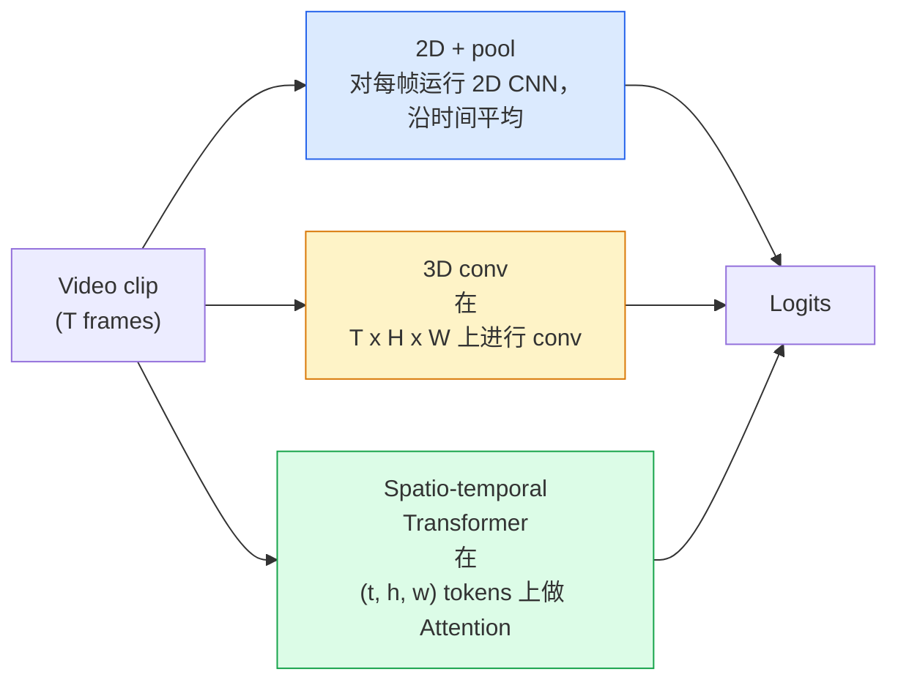

# 视频理解  时间建模

> 视频是一系列图像,加上它们的连接到物理规律. 每个视频模型要么把时间视为额外的轴,要么把它视为需要进行的注意序列,要么把它视为一次性提取并池化的特征.

**类型：**学习 + 构建
**语言：**字符串
**先修要求：**阶段4课03(CNN),阶段4课04(图像分类)
**时间：**时间45分钟

## 学习目标

- 区分三种主要视频建模方法(2D+pool、3D conv、空间时间变压器),并预测它们在成本和准确率上取代
- 在 PyTorch 中实现框架样本,时间聚合以及一个2D+pool基线分类器
- 解释为什么3D的膨胀3D核能很好从图像网重量迁移,以及因子化 (2+1)D conv 的不同之处
- 了解标准的行动识别数据集与指标:kinetics-400/600、UCF101、Something-Something V2;视频级别和视频级别的顶级准确性

## 问题

一个30秒、30fps的视频包含900张图像──简单地看,视频分类就是运行900次的图像分类,然后做某种聚合物──当动作几乎在每中都可见时,这种方法有效了;;体育、、健身视频);但当动作本身由运动定义时,它会严重失效:从左向右推出某个东西在每里看起来只是两个静止物体──

每个视频架构的核心问题是:时间结构在什么时候,如何建成?答案决定了其他所有事情,包括计算成本,预训练策略,是否可以重复ImageNet权重,以及模型将在哪些数据集上训练.

本课刻意比静态图像课程更短.核心图像机制已经存在,而视频理解主要关注时间度的故事:样本化,建模和汇总.

## 核心概念

### 三类架构家族



### 两维+游泳池

取一个2DCNN(ResNet、EfficientNet、ViT) ⋅在每个采样上独立运行它──对每的嵌入做平均或最大池,或注意池──将聚合向量输入分类器──

优点:
- 图像网预训可以直接迁移.
- 实现最简单的.
- 便宜:T  * 单张图像推断成本──

缺点:
- 无法建模运动――行动 = 现象的聚合――
- 时间聚合对序列不敏感; 开门和关门看起来相同.

适用场景:以外观为主任务,小视频数据集上的转移学习,初始基线.

### 转型

将2D (H,W) 核换成3D (T,H,W) 核.

技巧:取一个预训练的2D图像网模型,将每个2D内核沿新的时间轴复制,从而膨.

优点:
- 直接建模动作.
- 提供免费的转移学习.

缺点:
- 比对应的2D模型多T/8的FLOPs (对时间内核为3个,堆叠3次情况)
- 时间内核很小;长程运动需要金字塔或双流方法.

适用场景:运动是信号的行动识别.

### 时空变压器

将视频标记成空间时间补丁 网格,并在所有补丁之间做注意力.

重要注意事项:
- **Joint** 在 (t, h, w) 上做一次大注意力──对`T*H*W`呈二次复杂性;昂贵.
- **Divided** 每个块做两次注意:一次沿时间,一次沿空间――近似线性扩展――
- **Factorised**时间关注与空间关注 在区块之间交换.

优点:
- 在所有主要基准上达到SOTA准确性.
- 通过补丁通胀 从图像变革器 (ViT) 迁移――
- 通过稀少的关注 支持长文本视频.

缺点:
- 计算需求高――
- 需要谨慎选择注意力模式,否则运行时间会膨胀.

适用场景:大数据集、高保真视频理解、多模式视频+文本任务──

### 片样本

一个10秒,30fps的剪辑有300;把全部300输入任何模型都很浪费.

- **Uniform sampling** 在片中均选取 T ──2D+pool 的默认选择──
- **Dense sampling**随机连续T-框架窗户──3D孔 中常见,因为运动需要相邻──
- **Multi-clip** 从同一个视频中采样多个T-框架窗户,分别分类,并在测试时平均预测──

通常为 8、16、32 或 64──更高的T = 更多的时间信号,也意味着更多的计算──

### 评估

两个层次:
- **Clip-level accuracy**模型看到一个T-框架片段,报告顶部-k――
- **Video-level accuracy**对每个视频的多个片段的片段水平预测平均;更高且更稳定.

一个成绩为78%的剪辑 / 82%的视频模型高度依赖于测试时间平均;一个成绩为80% / 81%的模型在每段片上更强.

### 你会遇到的数据集

- **Kinetics-400 / 600 / 700**通用行动数据集──400万张视频;YouTubeURLs──很多现在已经失效.
- **Something-Something V2** 由运动定义的行动(从左转右) ⋅无法使用2D+pool 解决。
- **UCF-101**,我知道.**HMDB-51**更老,更小,但仍被报告.
- **AVA** 在空间和时间中的行动 *定位化*;比分类更难.


```figure
v4-video-temporal
```

## 构建它

### 步骤1:框架样本

适用于格列表或视频子的均和密集样本器──

```python
import numpy as np

def sample_uniform(num_frames_total, T):
    if num_frames_total <= T:
        return list(range(num_frames_total)) + [num_frames_total - 1] * (T - num_frames_total)
    step = num_frames_total / T
    return [int(i * step) for i in range(T)]


def sample_dense(num_frames_total, T, rng=None):
    rng = rng or np.random.default_rng()
    if num_frames_total <= T:
        return list(range(num_frames_total)) + [num_frames_total - 1] * (T - num_frames_total)
    start = int(rng.integers(0, num_frames_total - T + 1))
    return list(range(start, start + T))
```

两者都回来了`T`个指数,用于切片视频子

### 步骤 2:一个2D+池的基线

在每上运行2D ResNet-18,平均池特征,然后分类.

```python
import torch
import torch.nn as nn
from torchvision.models import resnet18, ResNet18_Weights

class FramePool(nn.Module):
    def __init__(self, num_classes=400, pretrained=True):
        super().__init__()
        weights = ResNet18_Weights.IMAGENET1K_V1 if pretrained else None
        backbone = resnet18(weights=weights)
        self.features = nn.Sequential(*(list(backbone.children())[:-1]))  # global avg pool kept
        self.head = nn.Linear(512, num_classes)

    def forward(self, x):
        # x: (N, T, 3, H, W)
        N, T = x.shape[:2]
        x = x.view(N * T, *x.shape[2:])
        feats = self.features(x).view(N, T, -1)
        pooled = feats.mean(dim=1)
        return self.head(pooled)

model = FramePool(num_classes=10)
x = torch.randn(2, 8, 3, 224, 224)
print(f"output: {model(x).shape}")
print(f"params: {sum(p.numel() for p in model.parameters()):,}")
```

在外观重重的任务上,这个基线通常比真正的3D模型低5-10个点,有时甚至更好,因为它使用了更强大的ImageNet脊柱.

### 步骤3:I3D式充气3D

通过新的时间轴重复重重量,将单个2D卷转换为3D卷.

```python
def inflate_2d_to_3d(conv2d, time_kernel=3):
    out_c, in_c, kh, kw = conv2d.weight.shape
    weight_3d = conv2d.weight.data.unsqueeze(2)  # (out, in, 1, kh, kw)
    weight_3d = weight_3d.repeat(1, 1, time_kernel, 1, 1) / time_kernel
    conv3d = nn.Conv3d(in_c, out_c, kernel_size=(time_kernel, kh, kw),
                        padding=(time_kernel // 2, conv2d.padding[0], conv2d.padding[1]),
                        stride=(1, conv2d.stride[0], conv2d.stride[1]),
                        bias=False)
    conv3d.weight.data = weight_3d
    return conv3d

conv2d = nn.Conv2d(3, 64, kernel_size=3, padding=1, bias=False)
conv3d = inflate_2d_to_3d(conv2d, time_kernel=3)
print(f"2D weight shape:  {tuple(conv2d.weight.shape)}")
print(f"3D weight shape:  {tuple(conv3d.weight.shape)}")
x = torch.randn(1, 3, 8, 56, 56)
print(f"3D output shape:  {tuple(conv3d(x).shape)}")
```

除了`time_kernel`让激活大致保持不变,这对于不破坏第一次前向传播中的批量标准统计非常重要.

### 步骤4: 因素化 (2+1) D 结合

将3D卷积分成2D空间卷积和1D时间卷积.相同的接收场,更少的参数,在某些基准上准确率更好.

```python
class Conv2Plus1D(nn.Module):
    def __init__(self, in_c, out_c, kernel_size=3):
        super().__init__()
        mid_c = (in_c * out_c * kernel_size * kernel_size * kernel_size) \
                // (in_c * kernel_size * kernel_size + out_c * kernel_size)
        self.spatial = nn.Conv3d(in_c, mid_c, kernel_size=(1, kernel_size, kernel_size),
                                 padding=(0, kernel_size // 2, kernel_size // 2), bias=False)
        self.bn = nn.BatchNorm3d(mid_c)
        self.act = nn.ReLU(inplace=True)
        self.temporal = nn.Conv3d(mid_c, out_c, kernel_size=(kernel_size, 1, 1),
                                  padding=(kernel_size // 2, 0, 0), bias=False)

    def forward(self, x):
        return self.temporal(self.act(self.bn(self.spatial(x))))

c = Conv2Plus1D(3, 64)
x = torch.randn(1, 3, 8, 56, 56)
print(f"(2+1)D output: {tuple(c(x).shape)}")
```

完整的R2+1)D网络就像一个ResNet-18一样,只是把每个3x3conv都换成`Conv2Plus1D`,我知道.

## 使用它

两库覆盖了生产级视频工作:

- `torchvision.models.video` R(2+1) D、MViT、Swin3D,带有预训练的动力学权重──API与图像模型相似──
- `pytorchvideo`模型动物园、用于动力学/SSv2/AVA的数据加载器、标准转换──

对于视觉语言视频模型 (视频标题,视频质量分析),使用`transformers`(`VideoMAE`,我知道.`VideoLLaMA`,我知道.`InternVideo`

## 交付它

本课会产出:

- `outputs/prompt-video-architecture-picker.md` 一个提示,根据外观与运动,数据集的尺寸和计算预算选择2D+pool/I3D/ (2+1)D/变压器──
- `outputs/skill-frame-sampler-auditor.md` 一个技能,用于检查视频管道的样本,并标记常见错误:`num_frames < T`时采样 不均、缺少保护种植的方面等

## 练习

1. **（简单）**计算FramemPool 在 T=8 时的 FLOPs (近似值),并与 T=8 的 I3D式 3D ResNet对比.说明为什么 2D+pool 便宜 3-5 倍.
2. **（中等）**生成一个合成视频数据集:随机小球朝随机方向移动,并按运动方向标注(左到右、右到左、斜面上) 在上面训练的框架池.
3. **（困难）**通过将ResNet-18 中的每个 Conv2d 替换为`Conv2Plus1D`构建一个R(2+1)D-18──使用ImageNet预训练的ResNet-18膨胀 第一个 conv 的权重──在练习2的运动数据集 上练,并超过 FramePool──

## 关键术语

| Term | 人们常说 | 实际含义 |
|------|----------------|----------------------|
| 2D + pool | “Per-frame classifier” | 在每个采样帧上运行 2D CNN，跨时间 average-pool features，然后分类 |
| 3D convolution | “Spatio-temporal kernel” | 在 (T, H, W) 上进行 conv 的 kernel；可以原生建模 motion |
| Inflation | “Lift 2D weights to 3D” | 通过沿新的时间轴重复 2D conv 的 weights 来初始化 3D conv weights，然后除以 kernel_T 以保持 activation scale |
| (2+1)D | “Factorised conv” | 将 3D 拆成 2D spatial + 1D temporal；参数更少，中间多一个非线性 |
| Divided attention | “Time then space” | 每层有两次 Attention 的 Transformer block：一次在同一帧的 tokens 上，一次在同一位置的 tokens 上 |
| Clip | “T-frame window” | T 帧的采样子序列；video model 消费的单位 |
| Clip vs video accuracy | “Two eval settings” | Clip = 每个视频一个 sample，video = 对多个 sampled clips 取平均 |
| Kinetics | “The ImageNet of video” | 400-700 个 action classes，300k+ YouTube clips，标准 video pretraining corpus |

## 延伸阅读

- [I3D: Quo Vadis, Action Recognition (Carreira & Zisserman, 2017)](https://arxiv.org/abs/1705.07750) 提出了通胀和动力学数据集
- [R(2+1)D: A Closer Look at Spatiotemporal Convolutions (Tran et al., 2018)](https://arxiv.org/abs/1711.11248)因子化共计,至今仍是强基线
- [TimeSformer: Is Space-Time Attention All You Need? (Bertasius et al., 2021)](https://arxiv.org/abs/2102.05095)第一个强大的视频变压器
- [VideoMAE (Tong et al., 2022)](https://arxiv.org/abs/2203.12602) 用于视频的隐藏自动编码预训;当前主流的预训食谱
